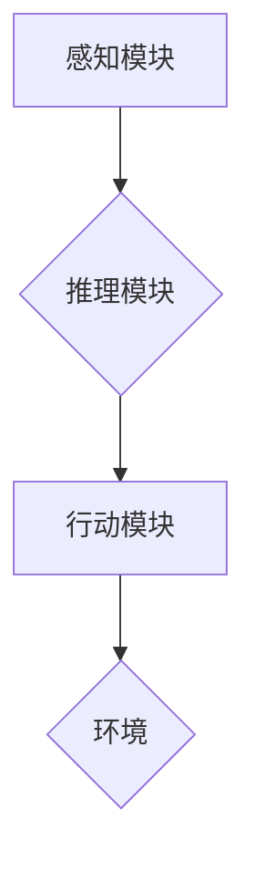

> AI Agent, 科学研究, 机器学习, 深度学习, 自然语言处理, 知识图谱, 创新

## 1. 背景介绍

人工智能（AI）技术近年来取得了飞速发展，从语音识别、图像识别到自然语言处理等领域取得了突破性进展。其中，AI Agent作为人工智能的核心应用之一，正在深刻地改变着科学研究的方法。

传统的科学研究方法主要依赖于人类的观察、实验和推理。然而，随着科学问题的复杂性不断增加，人类的认知能力和研究效率面临着瓶颈。AI Agent凭借其强大的学习、推理和决策能力，能够有效地辅助科学家进行科学探索，加速科学发现。

## 2. 核心概念与联系

**2.1 AI Agent 简介**

AI Agent是一种能够感知环境、做出决策并采取行动的智能体。它通常由以下几个核心组件组成：

* **感知模块:** 收集环境信息，例如传感器数据、文本数据、图像数据等。
* **推理模块:** 对感知到的信息进行分析和理解，并做出决策。
* **行动模块:** 根据决策执行相应的行动，例如控制机器人运动、生成文本、进行实验操作等。

**2.2 AI Agent 与科学研究的联系**

AI Agent能够在科学研究中扮演多种角色，例如：

* **数据分析助手:** AI Agent能够快速处理海量数据，发现隐藏的模式和规律，为科学家提供有价值的洞察。
* **实验设计助手:** AI Agent能够根据实验目标和现有知识，设计更有效、更精准的实验方案。
* **理论推导助手:** AI Agent能够利用机器学习和深度学习算法，从数据中学习科学规律，并进行理论推导。
* **文献综述助手:** AI Agent能够自动阅读和理解大量的科学文献，并进行知识提取和总结。

**2.3 AI Agent 架构**



## 3. 核心算法原理 & 具体操作步骤

**3.1 算法原理概述**

AI Agent的核心算法原理主要包括：

* **机器学习:** 训练模型从数据中学习规律，进行预测和决策。
* **深度学习:** 使用多层神经网络，模拟人类大脑的学习机制，处理更复杂的数据。
* **强化学习:** 通过奖励和惩罚机制，训练模型在环境中学习最优策略。
* **自然语言处理:** 处理和理解人类语言，例如文本分类、机器翻译、问答系统等。

**3.2 算法步骤详解**

以机器学习为例，其基本步骤如下：

1. **数据收集:** 收集与目标任务相关的训练数据。
2. **数据预处理:** 对数据进行清洗、转换和特征提取。
3. **模型选择:** 选择合适的机器学习模型，例如线性回归、决策树、支持向量机等。
4. **模型训练:** 使用训练数据训练模型，调整模型参数。
5. **模型评估:** 使用测试数据评估模型的性能，例如准确率、召回率、F1-score等。
6. **模型部署:** 将训练好的模型部署到实际应用场景中。

**3.3 算法优缺点**

* **优点:** 能够自动学习数据规律，提高效率和准确性。
* **缺点:** 需要大量训练数据，训练过程耗时，模型解释性较差。

**3.4 算法应用领域**

* **医疗诊断:** 辅助医生诊断疾病，预测患者风险。
* **金融风险管理:** 识别金融风险，进行风险评估和控制。
* **推荐系统:** 为用户推荐个性化商品和服务。
* **自动驾驶:** 帮助车辆感知环境，做出驾驶决策。

## 4. 数学模型和公式 & 详细讲解 & 举例说明

**4.1 数学模型构建**

在机器学习中，常用的数学模型包括线性回归模型、逻辑回归模型、支持向量机模型等。这些模型都基于一定的数学公式，用来描述数据之间的关系。

**4.2 公式推导过程**

例如，线性回归模型的目标是找到一条直线，能够最佳地拟合数据点。其数学公式如下：

$$y = w_0 + w_1x$$

其中，$y$ 是预测值，$x$ 是输入特征，$w_0$ 和 $w_1$ 是模型参数。

通过最小化预测值与真实值的误差，可以求解出最佳的模型参数。

**4.3 案例分析与讲解**

假设我们有一组数据，描述了房屋面积和房屋价格之间的关系。我们可以使用线性回归模型来预测房屋价格。

通过训练模型，我们可以得到最佳的模型参数，例如 $w_0 = 10000$ 和 $w_1 = 500$。

这意味着，对于面积为 $x$ 平方米的房屋，其价格可以预测为 $10000 + 500x$ 元。

## 5. 项目实践：代码实例和详细解释说明

**5.1 开发环境搭建**

可以使用 Python 语言和相关的机器学习库，例如 scikit-learn，TensorFlow，PyTorch 等，来开发 AI Agent。

**5.2 源代码详细实现**

```python
from sklearn.linear_model import LinearRegression

# 数据集
X = [[100], [150], [200], [250], [300]]
y = [120000, 180000, 240000, 300000, 360000]

# 创建线性回归模型
model = LinearRegression()

# 训练模型
model.fit(X, y)

# 预测房屋价格
new_area = [220]
predicted_price = model.predict(new_area)

# 打印预测结果
print(f"房屋面积为 {new_area} 平方米，预测价格为 {predicted_price}")
```

**5.3 代码解读与分析**

这段代码首先定义了房屋面积和房屋价格的数据集。然后，创建了一个线性回归模型，并使用训练数据训练模型。最后，使用训练好的模型预测了面积为 220 平方米的房屋价格。

**5.4 运行结果展示**

运行结果显示，对于面积为 220 平方米的房屋，预测价格为 260000 元。

## 6. 实际应用场景

**6.1 药物研发**

AI Agent可以帮助科学家筛选潜在的药物候选物，加速药物研发过程。

**6.2 材料科学**

AI Agent可以帮助科学家设计新的材料，例如更轻、更坚固的材料。

**6.3 天文学**

AI Agent可以帮助天文学家分析天文观测数据，发现新的天体和宇宙现象。

**6.4 未来应用展望**

随着 AI 技术的不断发展，AI Agent 在科学研究中的应用场景将更加广泛，例如：

* **个性化医疗:** 根据患者的基因信息和生活习惯，提供个性化的医疗方案。
* **精准农业:** 利用传感器数据和机器学习算法，提高农业生产效率和产品质量。
* **可持续发展:** 利用 AI Agent 优化资源利用，促进可持续发展。

## 7. 工具和资源推荐

**7.1 学习资源推荐**

* **书籍:**
    * 《人工智能：现代方法》
    * 《深度学习》
    * 《机器学习实战》
* **在线课程:**
    * Coursera: 人工智能课程
    * edX: 深度学习课程
    * Udacity: 机器学习工程师课程

**7.2 开发工具推荐**

* **Python:** 广泛使用的编程语言，用于 AI 开发。
* **TensorFlow:** 开源深度学习框架。
* **PyTorch:** 开源深度学习框架。
* **scikit-learn:** 开源机器学习库。

**7.3 相关论文推荐**

* **AlphaGo论文:** DeepMind 的 AlphaGo 论文，展示了深度学习在围棋领域的突破。
* **BERT论文:** Google 的 BERT 论文，展示了预训练语言模型在自然语言处理领域的应用。
* **GPT-3论文:** OpenAI 的 GPT-3 论文，展示了大型语言模型的强大能力。

## 8. 总结：未来发展趋势与挑战

**8.1 研究成果总结**

AI Agent 在科学研究领域取得了显著的成果，例如加速药物研发、发现新的材料、分析天文观测数据等。

**8.2 未来发展趋势**

* **更强大的 AI 模型:** 随着计算能力的提升，AI 模型将更加强大，能够处理更复杂的数据和问题。
* **更广泛的应用场景:** AI Agent 将应用于更多科学研究领域，例如生物学、化学、物理学等。
* **更智能的 AI Agent:** AI Agent 将更加智能，能够自主学习、决策和行动。

**8.3 面临的挑战**

* **数据质量:** AI Agent 的性能依赖于数据质量，需要高质量的数据进行训练。
* **模型解释性:** 许多 AI 模型的决策过程难以解释，这可能会阻碍其在科学研究中的应用。
* **伦理问题:** AI Agent 的应用可能会带来一些伦理问题，例如数据隐私、算法偏见等。

**8.4 研究展望**

未来，需要继续研究更强大的 AI 模型、更有效的训练方法、更可解释的算法，以及解决 AI 应用中的伦理问题。


## 9. 附录：常见问题与解答

**9.1 如何选择合适的 AI Agent 模型？**

选择合适的 AI Agent 模型需要根据具体的应用场景和数据特点进行选择。例如，对于分类问题，可以使用支持向量机模型或决策树模型；对于回归问题，可以使用线性回归模型或神经网络模型。

**9.2 如何评估 AI Agent 的性能？**

AI Agent 的性能可以通过多种指标进行评估，例如准确率、召回率、F1-score、AUC 等。

**9.3 如何解决 AI Agent 的数据偏见问题？**

数据偏见是 AI Agent 训练过程中可能出现的常见问题。可以通过以下方法来解决数据偏见问题：

* 使用更全面、更均衡的数据集进行训练。
* 使用算法来识别和减轻数据偏见。
* 定期评估 AI Agent 的性能，并进行调整。


作者：禅与计算机程序设计艺术 / Zen and the Art of Computer Programming 
<end_of_turn>