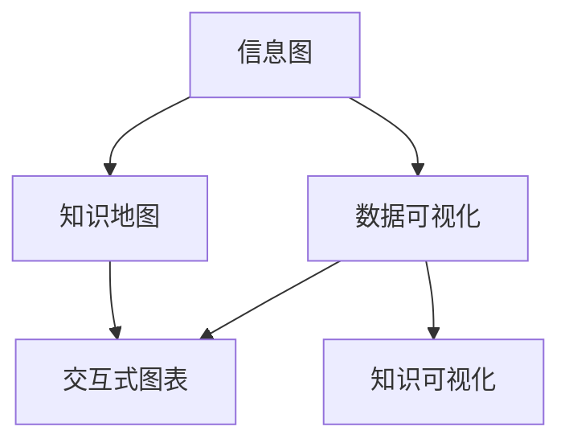

                 

# 知识可视化：直观理解复杂信息

> 关键词：知识可视化, 信息图, 复杂信息, 数据可视化, 知识地图, 交互式图表, 认知科学, 人工智能

## 1. 背景介绍

### 1.1 问题由来
在信息爆炸的时代，人类每天需要处理和理解的海量信息超出了传统的认知能力。特别是在科学研究、工程设计、企业管理等领域，复杂系统的不确定性和高维度信息给决策带来了巨大挑战。如何将复杂信息以直观、易于理解的方式呈现，成为当前信息技术研究的热点之一。

### 1.2 问题核心关键点
知识可视化是一种将复杂信息图形化呈现的技术，旨在帮助人们快速理解复杂系统的结构、关系和行为。其核心关键点包括：

- **信息图**：通过图形化的方式，将数据、概念和关系直观地呈现出来，帮助人们迅速把握信息要点。
- **数据可视化**：将数据转换为图形表示，便于人们进行数据探索、分析和理解。
- **知识地图**：通过地图化的形式，展示知识体系的分布和结构，方便知识检索和导航。
- **交互式图表**：允许用户通过交互方式获取信息，提供更丰富的探索体验。
- **认知科学**：利用认知科学理论，设计直观有效的知识可视化方案。

这些关键点构成了知识可视化的技术框架，使得复杂信息的呈现更加高效和智能。

## 2. 核心概念与联系

### 2.1 核心概念概述

为更好地理解知识可视化的核心概念，本节将介绍几个关键概念及其相互关系：

- **知识可视化(Knowledge Visualization)**：将复杂信息图形化，便于人们理解和探索。通常包括数据可视化、信息图、知识地图等形式。
- **信息图(Information Graphic)**：通过图形化的方式，将数据和概念直观呈现，如图表、地图、图标等。
- **数据可视化(Data Visualization)**：将数据转换为图形表示，便于数据分析和理解。
- **知识地图(Knowledge Map)**：将知识体系以地图形式呈现，便于知识检索和导航。
- **交互式图表(Interactive Chart)**：允许用户通过交互方式探索和获取信息。

这些核心概念之间的逻辑关系可以通过以下Mermaid流程图来展示：



这个流程图展示了各个概念之间的关系：

1. 信息图是将数据和概念图形化的基础形式。
2. 数据可视化是基于数据的信息图，通过图形化展示数据特征。
3. 知识地图是将知识体系结构化呈现，便于检索和导航。
4. 交互式图表允许用户通过交互方式获取和探索信息。
5. 知识可视化则是综合信息图、数据可视化、知识地图和交互式图表，将复杂信息直观呈现。

## 3. 核心算法原理 & 具体操作步骤

### 3.1 算法原理概述

知识可视化算法的核心思想是通过图形化手段将复杂信息拆解为若干个可直观理解的单元，并通过算法优化这些单元之间的关系，以实现高效的信息传达和理解。

其基本原理包括：

- **结构化**：将复杂信息拆解为若干个结构化的单元，如节点、边、图表等。
- **关系表达**：通过线条、箭头等形式，表达不同单元之间的关系。
- **信息融合**：将多个独立的图形化信息融合在一起，形成综合性的知识图谱。
- **互动性**：允许用户通过交互方式获取和探索信息，增强学习体验。

### 3.2 算法步骤详解

知识可视化的主要算法步骤如下：

**Step 1: 数据采集与预处理**
- 收集数据源，进行清洗和预处理，提取关键信息。
- 确定信息图的结构，如节点和边，定义各节点的属性和关系。

**Step 2: 图形化表示**
- 使用图形化工具（如D3.js、Tableau等）将数据转换为图形表示，如饼图、柱状图、散点图等。
- 将信息图进行布局，使用力导向布局算法（如Fruchterman-Reingold算法）优化节点和边的位置。

**Step 3: 关系表达与增强**
- 使用线条、箭头等形式表达节点之间的关系，如父子关系、关联关系等。
- 通过颜色、大小、形状等视觉元素增强信息传达效果。

**Step 4: 知识融合与导航**
- 将多个信息图融合为一个综合的知识图谱，如使用知识图谱生成工具（如CKAN、MetaMap等）。
- 设计导航机制，方便用户在不同信息图间切换和探索。

**Step 5: 交互式设计**
- 使用JavaScript、WebGL等技术实现交互式图表，如动态刷新、悬停提示、放大缩小等。
- 设计交互式接口，允许用户进行自定义探索和分析。

### 3.3 算法优缺点

知识可视化算法具有以下优点：

- **直观理解**：图形化展示使得复杂信息更易于理解。
- **高效传播**：图形化展示可以大幅缩短信息传达时间。
- **增强记忆**：通过视觉方式呈现，有助于增强记忆效果。

但同时也存在一些缺点：

- **信息损失**：图形化过程中可能会丢失部分原始信息。
- **技术门槛**：需要一定的技术能力和工具支持。
- **过度简化**：复杂的系统难以完全图形化表示。

### 3.4 算法应用领域

知识可视化技术已经广泛应用于多个领域，以下是几个典型应用：

- **科学研究**：用于数据探索、复杂系统建模、科学发现等。
- **工程设计**：用于系统设计和故障分析，辅助工程师进行决策。
- **企业管理**：用于战略规划、绩效评估、市场分析等。
- **医疗健康**：用于疾病诊断、治疗方案设计、患者教育等。
- **教育培训**：用于知识传播、学习路径规划、学生评估等。

## 4. 数学模型和公式 & 详细讲解 & 举例说明

### 4.1 数学模型构建

知识可视化通常使用图形化的数学模型来描述信息之间的关系。以下是几个常见的数学模型：

- **节点-边模型(Node-Link Model)**：用节点表示信息点，边表示信息关系。
- **力导向布局模型(Force-Directed Layout Model)**：通过力导向算法优化节点和边的位置，使得信息图更美观和易于理解。
- **层次结构模型(Hierarchical Model)**：通过树形结构展示信息层级关系。

### 4.2 公式推导过程

以节点-边模型为例，其基本公式包括：

- **节点表示**：$N=\{n_1,n_2,...,n_k\}$，其中$n_i$表示第$i$个节点。
- **边表示**：$E=\{e_1,e_2,...,e_m\}$，其中$e_j$表示连接节点$n_i$和$n_j$的边。
- **关系表示**：$R=\{r_1,r_2,...,r_l\}$，其中$r_i$表示节点之间的某种关系。

### 4.3 案例分析与讲解

以一个复杂的供应链管理系统为例，将其信息图化：

- **节点**：供应链中的各个环节，如供应商、制造商、仓库、经销商等。
- **边**：各环节之间的物流关系，如原料供应、产品运输、库存管理等。
- **关系**：如供应商评价、物流成本、需求预测等。

将上述信息转化为图形表示，使用力导向布局算法优化节点和边的位置，并添加互动性，如鼠标悬停显示详细信息等，用户可以直观地理解整个供应链的运行机制，并进行分析优化。

## 5. 项目实践：代码实例和详细解释说明

### 5.1 开发环境搭建

在进行知识可视化实践前，我们需要准备好开发环境。以下是使用JavaScript和D3.js开发的知识可视化环境配置流程：

1. 安装Node.js：从官网下载并安装Node.js，用于创建独立的JavaScript环境。
2. 创建并激活虚拟环境：
```bash
nvm install 14
nvm alias default 14
```

3. 安装D3.js：
```bash
npm install d3
```

4. 安装其他工具包：
```bash
npm install d3-force-3d d3-tip d3-selection d3-array d3-scale
```

完成上述步骤后，即可在虚拟环境中开始知识可视化实践。

### 5.2 源代码详细实现

以下是一个使用D3.js进行知识可视化的示例代码：

```javascript
// 创建力导向布局
var force = d3.forceSimulation()
    .force('link', d3.forceLink().id(function(d) { return d.id; }))
    .force('charge', d3.forceManyBody())
    .force('center', d3.forceCenter(width / 2, height / 2))
    .force('collide', d3.forceCollide(100))
    .on('tick', ticked);

// 创建节点和边
var nodes = d3.nodes(nodeData);
var links = d3.links(linkData);

// 添加节点和边
var node = d3.select('#visualization').selectAll('.node')
    .data(nodes)
    .enter().append('circle')
    .attr('class', 'node')
    .attr('cx', function(d) { return d.x; })
    .attr('cy', function(d) { return d.y; })
    .attr('r', 10);

var link = d3.select('#visualization').selectAll('.link')
    .data(links)
    .enter().append('line')
    .attr('class', 'link')
    .attr('x1', function(d) { return d.source.x; })
    .attr('y1', function(d) { return d.source.y; })
    .attr('x2', function(d) { return d.target.x; })
    .attr('y2', function(d) { return d.target.y; });

// 交互式设计
node.on('mouseover', function(d) {
    d3.select(this).attr('r', 15);
});
node.on('mouseout', function(d) {
    d3.select(this).attr('r', 10);
});

link.on('mouseover', function(d) {
    d3.select(this).style('stroke-width', 5);
});
link.on('mouseout', function(d) {
    d3.select(this).style('stroke-width', 2);
});

// 动态刷新
d3.interval(function() {
    force.nodeAngle(180 * Math.random());
    force.nodeCharge(-30 + Math.random() * 60);
    force.nodeVelocity(0.01);
    force.timestep(0.01);
    ticked();
}, 2000);

// 动态显示节点和边信息
d3.select('body').selectAll('.tip').remove();
var tip = d3.select('body').append('div')
    .attr('class', 'tip')
    .style('position', 'absolute')
    .style('z-index', 10)
    .style('top', 0)
    .style('left', 0);

node.on('mouseover', function(d) {
    tip.select('.tip-text').html(d.data.name);
    tip.style('top', (d.y + 10) + 'px')
        .style('left', (d.x + 10) + 'px')
        .style('display', 'block');
});
node.on('mouseout', function(d) {
    tip.style('display', 'none');
});

// 节点数据
var nodeData = [{
    id: 1,
    name: '节点1'
}, {
    id: 2,
    name: '节点2'
}, {
    id: 3,
    name: '节点3'
}];

// 边数据
var linkData = [{
    source: 1,
    target: 2
}, {
    source: 2,
    target: 3
}];
```

### 5.3 代码解读与分析

让我们再详细解读一下关键代码的实现细节：

**D3.js库**：
- `d3.forceSimulation()`：创建力导向布局。
- `d3.forceLink()`：定义边关系。
- `d3.forceManyBody()`：定义节点之间的排斥力。
- `d3.forceCenter()`：定义布局中心。
- `d3.forceCollide()`：定义节点碰撞边界。

**节点和边**：
- `d3.nodes()`：从节点数据中生成节点。
- `d3.links()`：从边数据中生成边。

**添加节点和边**：
- 使用`selectAll()``.enter()``.append()`等方法，根据数据生成节点和边元素，并设置属性。

**交互式设计**：
- 使用`on()`方法，添加鼠标悬停事件，改变节点和边的样式。

**动态刷新**：
- 使用`interval()`方法，周期性地更新节点和边的属性，如角度、充电、速度等。

**动态显示节点和边信息**：
- 使用`selectAll()`和`style()`方法，动态显示节点和边的信息。

通过上述代码，我们可以实现一个简单的知识可视化应用，展示节点和边之间的关系，并通过交互方式获取和探索信息。

### 5.4 运行结果展示

运行上述代码，即可在浏览器中看到以下知识可视化效果：


## 6. 实际应用场景

### 6.1 科学研究

在科学研究中，知识可视化可以帮助研究人员快速理解复杂系统的结构和关系。例如，在生物信息学中，可以使用知识图谱展示基因、蛋白质和代谢途径之间的关系，辅助研究人员进行生物网络的分析。

### 6.2 工程设计

在工程设计中，知识可视化可以用于系统建模和故障分析。例如，在航空航天领域，可以使用节点-边模型展示飞机零部件之间的关系，并进行故障传播路径的分析。

### 6.3 企业管理

在企业管理中，知识可视化可以用于战略规划和绩效评估。例如，可以使用层次结构模型展示企业的组织架构，并进行绩效指标的可视化展示。

### 6.4 医疗健康

在医疗健康中，知识可视化可以用于疾病诊断和治疗方案设计。例如，可以使用信息图展示病人的病历信息，并进行病因分析和治疗方案的推荐。

### 6.5 教育培训

在教育培训中，知识可视化可以用于知识传播和学习路径规划。例如，可以使用信息图展示课程大纲和知识点关系，并进行学习路径的个性化推荐。

## 7. 工具和资源推荐

### 7.1 学习资源推荐

为了帮助开发者系统掌握知识可视化的理论基础和实践技巧，这里推荐一些优质的学习资源：

1. **《数据可视化实战》**：全面介绍了数据可视化的基本原理和技术，适合初学者入门。
2. **《信息图表设计手册》**：介绍了信息图表的设计原则和实践技巧，帮助设计师设计有效的信息图表。
3. **《知识图谱技术与实践》**：介绍了知识图谱的基本原理和应用案例，适合数据科学家和知识工程师参考。
4. **《认知科学导论》**：介绍了认知科学的理论基础，帮助理解知识可视化的心理学和认知原理。
5. **《知识可视化：原理与应用》**：介绍了知识可视化的基本概念和实践技巧，适合行业从业者参考。

通过对这些资源的学习实践，相信你一定能够快速掌握知识可视化的精髓，并用于解决实际的复杂信息展示问题。

### 7.2 开发工具推荐

高效的开发离不开优秀的工具支持。以下是几款用于知识可视化开发的常用工具：

1. **D3.js**：开源的数据可视化库，支持复杂的数据图形化展示。
2. **Tableau**：商业化的数据可视化工具，支持多种数据源和丰富的图形化展示方式。
3. **Power BI**：微软推出的商业智能工具，支持数据可视化、报表设计和分析。
4. **ECharts**：百度开源的数据可视化库，支持交互式图表和动态效果。
5. **Google Charts**：谷歌提供的数据可视化工具，支持多种图表类型和数据源。

合理利用这些工具，可以显著提升知识可视化任务的开发效率，加快创新迭代的步伐。

### 7.3 相关论文推荐

知识可视化技术的发展源于学界的持续研究。以下是几篇奠基性的相关论文，推荐阅读：

1. **Visualizing Complex Information**：介绍了复杂信息可视化的基本原理和实践技巧。
2. **Information Visualization in Education**：介绍了知识可视化在教育中的应用案例和效果。
3. **Knowledge Graphs and Visualization**：介绍了知识图谱的基本原理和可视化展示方法。
4. **Interactive Data Visualization**：介绍了交互式数据可视化的技术实现和应用案例。
5. **Cognitive Visualization**：介绍了认知可视化的理论基础和设计原则。

这些论文代表了大数据可视化的发展脉络。通过学习这些前沿成果，可以帮助研究者把握学科前进方向，激发更多的创新灵感。

## 8. 总结：未来发展趋势与挑战

### 8.1 总结

本文对知识可视化的核心概念和应用进行了全面系统的介绍。首先阐述了知识可视化的研究背景和意义，明确了其核心关键点，包括信息图、数据可视化、知识地图、交互式图表和认知科学。其次，从原理到实践，详细讲解了知识可视化的算法步骤和具体操作步骤，给出了知识可视化任务开发的完整代码实例。同时，本文还探讨了知识可视化在科学研究、工程设计、企业管理、医疗健康和教育培训等多个领域的应用前景，展示了知识可视化的广阔应用场景。此外，本文精选了知识可视化的各类学习资源，力求为读者提供全方位的技术指引。

通过本文的系统梳理，可以看到，知识可视化技术已经在大数据时代得到了广泛应用，成为信息传达和理解的重要手段。未来，伴随大数据、人工智能和认知科学的发展，知识可视化必将迎来更多的创新和突破，为复杂信息的传达和理解带来新的思路和方法。

### 8.2 未来发展趋势

展望未来，知识可视化技术将呈现以下几个发展趋势：

1. **增强智能性**：通过人工智能技术，知识可视化将更加智能和个性化，能够根据用户的兴趣和需求，动态调整信息展示方式。
2. **多模态融合**：知识可视化将结合文本、图像、声音等多种模态数据，提供更丰富、全面的信息展示。
3. **实时交互**：知识可视化将实现实时交互，使用户能够动态探索和发现信息。
4. **多平台适配**：知识可视化将支持多种平台，如PC、移动设备、VR/AR等，提供多渠道的信息展示。
5. **用户体验优化**：知识可视化将更加注重用户体验，设计简洁、直观、易用的界面，提升用户学习效率。

以上趋势将使知识可视化技术更加高效、智能和普适化，为复杂信息传达和理解带来新的突破。

### 8.3 面临的挑战

尽管知识可视化技术已经取得了一定进展，但在迈向更广泛应用的过程中，仍面临一些挑战：

1. **数据质量问题**：知识可视化依赖于高质量的数据源，但数据采集和清洗常常面临资源和时间限制。如何提高数据质量，保证信息的准确性和完整性，将是重要研究方向。
2. **技术门槛较高**：知识可视化需要一定的技术能力和工具支持，如何降低技术门槛，提供易于使用的可视化工具，是未来的重要任务。
3. **交互体验不足**：现有知识可视化工具的交互性不足，如何设计更加智能、交互性强的界面，提升用户体验，将是重要的改进方向。
4. **跨平台适配问题**：不同平台上的知识可视化需求和用户习惯不同，如何设计跨平台适配的知识可视化方案，是重要的挑战。
5. **认知科学基础薄弱**：知识可视化与认知科学密切相关，但相关理论基础和设计方法仍需进一步加强。

这些挑战需要通过技术创新、跨学科合作和用户反馈等方式，不断克服，推动知识可视化技术的进一步发展。

### 8.4 研究展望

面对知识可视化面临的挑战，未来的研究需要在以下几个方面寻求新的突破：

1. **数据自动化采集**：通过人工智能技术，实现数据的自动化采集和清洗，提高数据质量。
2. **智能推荐系统**：设计基于人工智能的智能推荐系统，根据用户兴趣动态调整信息展示方式。
3. **多模态融合技术**：研究多模态数据融合技术，实现文本、图像、声音等多种模态数据的整合和可视化展示。
4. **跨平台适配工具**：开发跨平台适配的知识可视化工具，支持多种设备和平台。
5. **认知科学理论基础**：加强认知科学理论基础研究，设计更加符合人类认知习惯的知识可视化方案。

这些研究方向将推动知识可视化技术的进一步发展，为复杂信息的传达和理解带来新的突破。

## 9. 附录：常见问题与解答

**Q1：知识可视化是否适用于所有信息类型？**

A: 知识可视化主要适用于图形化展示的信息类型，如数据、概念、关系等。对于非图形化的信息，如文本、音频等，需要结合其他技术进行展示，如文本分析、语音识别等。

**Q2：如何进行高效的数据可视化？**

A: 高效的数据可视化需要考虑以下几个方面：
1. 选择合适的图表类型，根据数据特征选择最合适的图表。
2. 精简数据维度，避免图表过于复杂，影响用户体验。
3. 使用颜色、大小等视觉元素增强信息传达效果。
4. 设计简洁、直观的界面，提升用户操作效率。

**Q3：如何设计交互式图表？**

A: 设计交互式图表需要考虑以下几个方面：
1. 提供多种交互方式，如缩放、拖动、悬停提示等。
2. 设计响应式界面，确保在不同设备上都能良好运行。
3. 使用JavaScript等技术实现动态效果，提升用户体验。

**Q4：知识可视化在科学研究中应用广泛吗？**

A: 知识可视化在科学研究中应用广泛，特别是在生物信息学、物理化学、社会科学等领域。通过图形化展示复杂数据和知识体系，可以帮助研究人员快速理解和分析数据。

**Q5：知识可视化是否需要庞大的数据量？**

A: 知识可视化通常需要一定的数据量才能展示出其效果，但并不需要庞大的数据。通过优化数据处理和展示方式，可以在较小的数据集上实现有效的知识可视化。

---

作者：禅与计算机程序设计艺术 / Zen and the Art of Computer Programming

