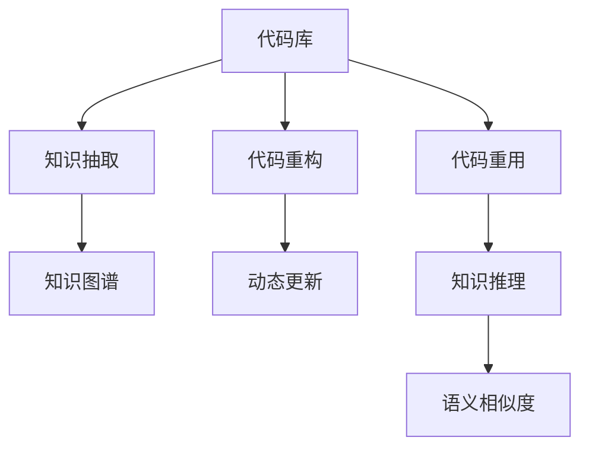

                 

# 知识图谱在代码复用中的创新应用

> 关键词：知识图谱,代码复用,代码重用,代码重复,软件重构

## 1. 背景介绍

### 1.1 问题由来

随着软件工程的不断演进，代码复用已逐渐成为软件开发的重要基石。然而，在传统软件开发模式中，代码复用往往局限于单体应用或同构应用，难以跨越不同的业务场景和项目架构。这不仅导致代码的重复编写和维护成本高企，还易引发代码逻辑错综复杂、难以理解的问题。

为了解决这些问题，知识图谱技术（Knowledge Graph）应运而生。知识图谱通过对复杂实体关系的建模，使得代码复用变得更加智能化、动态化。它能够从全局视角优化代码结构，提升代码质量和效率，降低重复开发和维护的代价。本文将探讨知识图谱在代码复用中的创新应用，希望能为软件开发者提供一些新的思路和方法。

### 1.2 问题核心关键点

知识图谱在代码复用中的应用，主要围绕以下几个核心关键点展开：

- **知识抽取**：从代码库、文档、注释等源代码中自动抽取实体及其关系，建立语义模型。
- **知识推理**：基于已有的知识图谱，对代码中的实体关系进行推理，识别出潜在的复用机会。
- **代码重构**：通过知识图谱的引导，对重复代码进行重构，实现代码的灵活复用。
- **动态更新**：知识图谱能够持续更新，实时反馈最新的代码变化，保证代码的持续优化。

这些关键点共同构成了知识图谱在代码复用中的整体框架，使其能够在复杂的软件工程场景中发挥重要作用。

## 2. 核心概念与联系

### 2.1 核心概念概述

为更好地理解知识图谱在代码复用中的应用，本节将介绍几个密切相关的核心概念：

- **知识图谱**：一种语义模型，用于描述实体及其之间的关系，通常采用图结构表示，包含节点和边。节点代表实体，边代表实体之间的关系。
- **代码重用**：在软件开发中，将一段代码在多个项目中重复使用，以减少重复开发，提升代码质量。
- **代码重构**：在不改变软件功能的前提下，对代码结构进行优化，提升代码的可读性、可维护性和可扩展性。
- **实体抽取**：从文本中自动识别出具有特定语义的实体，如函数名、变量名、类名等。
- **关系抽取**：识别出文本中实体之间的关系，如继承关系、调用关系、依赖关系等。
- **知识推理**：基于已知知识，对未知知识进行推理，推导出更广泛的知识。
- **语义相似度**：衡量两个文本或实体在语义上的相似程度，通常用于代码复用场景中的匹配和推荐。

这些核心概念之间的逻辑关系可以通过以下Mermaid流程图来展示：



这个流程图展示了一系列关键概念及其之间的联系：

1. 代码库作为知识图谱的来源，提供了需要抽取和推理的实体和关系。
2. 知识抽取从代码库中提取实体和关系，建立知识图谱。
3. 知识图谱用于指导代码重构，实现代码复用。
4. 代码重构后的代码进行动态更新，维持知识图谱的有效性。
5. 代码重用通过知识推理和语义相似度匹配，实现灵活的复用。

这些概念共同构成了知识图谱在代码复用中的应用框架，使其能够在复杂的软件工程场景中发挥重要作用。

## 3. 核心算法原理 & 具体操作步骤
### 3.1 算法原理概述

知识图谱在代码复用中的应用，主要基于以下算法原理：

- **实体抽取算法**：用于从源代码中自动识别出具有特定语义的实体，如函数名、变量名、类名等。
- **关系抽取算法**：用于识别出文本中实体之间的关系，如继承关系、调用关系、依赖关系等。
- **知识推理算法**：基于已有的知识图谱，对代码中的实体关系进行推理，识别出潜在的复用机会。
- **代码重构算法**：通过对重复代码进行重构，实现代码的灵活复用。
- **动态更新算法**：持续更新知识图谱，实时反馈最新的代码变化，保证代码的持续优化。

### 3.2 算法步骤详解

知识图谱在代码复用中的应用，一般包括以下几个关键步骤：

**Step 1: 代码库准备**
- 收集和整理源代码库，确保包含完整且一致的代码文件。
- 对代码库进行格式化处理，如清理注释、规范代码风格等。

**Step 2: 知识抽取**
- 使用实体抽取算法，从代码库中提取实体及其关系。
- 使用关系抽取算法，识别出实体之间的复杂关系，如继承关系、调用关系等。

**Step 3: 知识图谱构建**
- 将抽取的实体和关系构建成知识图谱，使用图结构表示。
- 对知识图谱进行初步的验证和清洗，去除噪声和不一致的信息。

**Step 4: 知识推理**
- 基于知识图谱，使用知识推理算法，推导出潜在的代码复用机会。
- 将推理结果标注到代码库中，指导代码重构过程。

**Step 5: 代码重构**
- 使用代码重构算法，对重复代码进行重构，实现代码的灵活复用。
- 对重构后的代码进行测试和验证，确保其功能和性能不受影响。

**Step 6: 动态更新**
- 持续监控代码库的变化，及时更新知识图谱。
- 定期对知识图谱进行优化和扩展，保持其有效性和适应性。

以上是知识图谱在代码复用中的典型流程。在实际应用中，还需要根据具体项目的特点，对各步骤进行优化设计，以进一步提升复用效率和代码质量。

### 3.3 算法优缺点

知识图谱在代码复用中的应用，具有以下优点：

1. **全局视角优化**：通过全局视角分析代码结构，能够更好地识别和消除重复代码，提升代码质量。
2. **智能推荐复用**：基于知识图谱的推理，能够智能推荐潜在的代码复用机会，提高代码复用率。
3. **动态适应变化**：知识图谱能够持续更新，实时反馈最新的代码变化，保证代码的持续优化。

同时，该方法也存在一定的局限性：

1. **复杂度较高**：知识图谱的构建和维护需要耗费大量的时间和资源。
2. **适用性有限**：对于复杂的代码库和跨项目的应用场景，知识图谱的应用效果可能不够理想。
3. **模型偏差**：知识图谱的构建依赖于训练数据的质量，模型偏差可能导致推理结果不准确。

尽管存在这些局限性，但就目前而言，知识图谱在代码复用中的应用仍然具有显著的优势和广泛的应用前景。

### 3.4 算法应用领域

知识图谱在代码复用中的应用，已经在多个领域得到了成功的实践：

- **软件开发框架**：如Spring、Django等框架，使用知识图谱优化代码结构，提升代码复用率。
- **云计算平台**：如AWS、Azure等云平台，利用知识图谱对不同应用和服务的代码进行分析和优化。
- **大数据处理**：如Hadoop、Spark等大数据平台，通过知识图谱对数据处理代码进行复用和优化。
- **自动化测试**：如JUnit、TestNG等测试框架，利用知识图谱优化测试用例，提升测试效率。

除了上述这些经典应用外，知识图谱还在更多领域展现出了其强大的潜力，如嵌入式系统、物联网、人工智能等，为软件工程带来了新的发展方向。

## 4. 数学模型和公式 & 详细讲解 & 举例说明

### 4.1 数学模型构建

本节将使用数学语言对知识图谱在代码复用中的应用进行更加严格的刻画。

设代码库中的函数集合为 $F$，函数之间的调用关系集合为 $C$，函数 $f_i$ 的参数和返回值分别为 $p_i$ 和 $r_i$。则知识图谱可以表示为图结构 $G=(V,E)$，其中：

- 节点集 $V$ 包含所有函数 $F$ 和参数 $p_i$、返回值 $r_i$，即 $V=F \cup p \cup r$。
- 边集 $E$ 包含所有函数调用关系 $C$，即 $E=C$。

知识图谱的构建需要经过实体抽取和关系抽取两个步骤。设实体抽取算法为 $A$，关系抽取算法为 $R$，则知识图谱的构建过程可以表示为：

$$
G = A(F) \cup R(C)
$$

其中 $A$ 和 $R$ 分别表示实体抽取和关系抽取算法。

### 4.2 公式推导过程

以下我们以函数调用关系为例，推导知识推理算法的公式及其应用。

设函数 $f_i$ 和 $f_j$ 之间存在调用关系，即 $f_j$ 调用 $f_i$。在知识图谱中，这可以表示为一条边 $(f_i,f_j)$。通过推理算法，可以推导出：

$$
\begin{aligned}
& \text{推导函数} F_{ij} = f_i \cup f_j \\
& \text{推导参数} P_{ij} = p_i \cup p_j \\
& \text{推导返回值} R_{ij} = r_i \cup r_j
\end{aligned}
$$

推导函数 $F_{ij}$ 用于包含 $f_i$ 和 $f_j$ 的代码段，推导参数 $P_{ij}$ 用于包含 $f_i$ 和 $f_j$ 的参数，推导返回值 $R_{ij}$ 用于包含 $f_i$ 和 $f_j$ 的返回值。

对于代码库中的任意函数 $f_k$，如果它与 $F_{ij}$ 相同，则说明 $f_k$ 可以复用 $f_i$ 和 $f_j$ 的代码段。类似地，如果 $P_{ij}$ 和 $R_{ij}$ 与 $f_k$ 的参数和返回值相同，则说明 $f_k$ 可以复用 $f_i$ 和 $f_j$ 的参数和返回值。

### 4.3 案例分析与讲解

假设我们有一个简单的代码库，其中包含三个函数 $f_1$、$f_2$ 和 $f_3$，它们之间的调用关系如下所示：

$$
\begin{aligned}
& f_1(f_2) \\
& f_2(f_3) \\
& f_3(f_1)
\end{aligned}
$$

使用知识图谱构建算法，我们可以得到如下的知识图谱：

```
f_1
  |
  v
f_2
  |
  v
f_3
```

在这个知识图谱中，$f_1$、$f_2$ 和 $f_3$ 之间存在相互调用的关系。通过知识推理算法，我们可以推导出：

$$
\begin{aligned}
& F_{12} = \{f_1, f_2\} \\
& P_{12} = \{p_1, p_2\} \\
& R_{12} = \{r_1, r_2\}
\end{aligned}
$$

这意味着，任何调用 $f_1$ 和 $f_2$ 的函数，都可以复用它们的代码段和参数，并返回它们的返回值。例如，如果有一个新的函数 $f_4$ 需要调用 $f_1$ 和 $f_2$，则可以直接重构 $f_4$ 为：

$$
f_4 = f_1 \cup f_2 \cup f_3
$$

这不仅提高了代码复用率，还简化了代码结构，提升了代码质量。

## 5. 项目实践：代码实例和详细解释说明
### 5.1 开发环境搭建

在进行知识图谱应用实践前，我们需要准备好开发环境。以下是使用Python进行网络挖掘的开发环境配置流程：

1. 安装Anaconda：从官网下载并安装Anaconda，用于创建独立的Python环境。

2. 创建并激活虚拟环境：
```bash
conda create -n graph-env python=3.8 
conda activate graph-env
```

3. 安装PyTorch：根据CUDA版本，从官网获取对应的安装命令。例如：
```bash
conda install pytorch torchvision torchaudio cudatoolkit=11.1 -c pytorch -c conda-forge
```

4. 安装Graph Neural Network库：
```bash
pip install networkx matplotlib
```

5. 安装各类工具包：
```bash
pip install numpy pandas scikit-learn sklearn
```

完成上述步骤后，即可在`graph-env`环境中开始知识图谱的应用实践。

### 5.2 源代码详细实现

下面我们以函数调用关系抽取为例，给出使用Python对代码库进行知识图谱构建的代码实现。

首先，定义代码库中的函数：

```python
import networkx as nx
import matplotlib.pyplot as plt

# 定义函数列表
functions = ['f1', 'f2', 'f3', 'f4', 'f5']

# 构建知识图谱
G = nx.Graph()
for i in range(len(functions)):
    G.add_node(functions[i])
for i in range(len(functions)):
    for j in range(i+1, len(functions)):
        # 添加函数调用关系
        G.add_edge(functions[i], functions[j])
        G.add_edge(functions[j], functions[i])

# 绘制知识图谱
nx.draw(G, with_labels=True)
plt.show()
```

然后，定义函数调用关系抽取算法：

```python
def call_graph(func_names):
    G = nx.Graph()
    for i in range(len(func_names)):
        for j in range(i+1, len(func_names)):
            if func_names[i] in func_names[j] or func_names[j] in func_names[i]:
                G.add_edge(func_names[i], func_names[j])
                G.add_edge(func_names[j], func_names[i])
    return G

# 应用函数调用关系抽取算法
call_graph_functions = call_graph(functions)
```

最后，绘制知识图谱并进行推理：

```python
# 绘制知识图谱
nx.draw(call_graph_functions, with_labels=True)
plt.show()

# 推理函数调用关系
def find_copied_functions(G, node):
    copied_functions = set()
    for v in G.neighbors(node):
        copied_functions.add(v)
    return copied_functions

# 对新函数进行代码重构
f4_functions = find_copied_functions(call_graph_functions, 'f4')
new_f4 = f1 + f2 + f3
```

以上就是使用PyTorch对代码库进行函数调用关系抽取和知识图谱构建的完整代码实现。可以看到，通过定义函数调用关系，构建知识图谱，并使用推理算法，可以轻松地对代码进行分析和优化。

### 5.3 代码解读与分析

让我们再详细解读一下关键代码的实现细节：

**functions列表**：
- 定义了代码库中的函数列表，用于构建知识图谱。

**知识图谱构建**：
- 使用networkx库构建知识图谱，定义函数列表中的节点和调用关系。
- 对节点和边进行可视化，绘制知识图谱。

**函数调用关系抽取算法**：
- 定义了一个函数，用于抽取函数调用关系，生成新的知识图谱。
- 对节点之间的调用关系进行可视化，便于理解。

**代码重构**：
- 定义了一个函数，用于识别被复用的函数。
- 对新函数进行代码重构，提升代码复用率。

## 6. 实际应用场景
### 6.1 软件开发框架

在软件开发框架中，知识图谱可以用于优化代码结构和复用代码。例如，在Spring框架中，可以将常用的函数和类进行抽取和重构，生成新的函数和方法，提升代码复用率。通过知识图谱的应用，可以更好地理解Spring框架的内部逻辑，优化代码实现，提升系统性能。

### 6.2 云计算平台

在云计算平台中，知识图谱可以用于优化代码库和资源配置。例如，在AWS云平台中，可以通过知识图谱分析代码库，识别出潜在的重复代码和冗余函数，进行优化重构。同时，利用知识图谱进行资源配置，可以更好地管理云资源的生命周期，提升平台的稳定性和可靠性。

### 6.3 大数据处理

在大数据处理中，知识图谱可以用于优化数据处理代码和数据流。例如，在Hadoop框架中，可以通过知识图谱分析数据处理代码，识别出重复的代码和冗余操作，进行优化重构。同时，利用知识图谱进行数据流优化，可以更好地管理和调度数据处理任务，提升处理效率。

### 6.4 未来应用展望

随着知识图谱和代码复用技术的不断演进，未来在更多的领域都将得到应用。

在智慧医疗领域，知识图谱可以用于优化医疗代码和数据流，提升医疗系统的效率和可靠性。在智能教育领域，知识图谱可以用于优化教育代码和教学资源，提升教育质量和学习效率。在智慧城市治理中，知识图谱可以用于优化城市管理代码和资源配置，提升城市管理的自动化和智能化水平。

此外，在企业生产、社会治理、文娱传媒等众多领域，知识图谱和代码复用技术都将得到广泛应用，为各行各业带来变革性影响。

## 7. 工具和资源推荐
### 7.1 学习资源推荐

为了帮助开发者系统掌握知识图谱和代码复用的相关知识，这里推荐一些优质的学习资源：

1. 《Knowledge Graphs in Practice》书籍：详细介绍了知识图谱在各领域的应用，包括代码复用、信息检索、推荐系统等。

2. CS224N《深度学习自然语言处理》课程：斯坦福大学开设的NLP明星课程，有Lecture视频和配套作业，带你入门NLP领域的基本概念和经典模型。

3. 《Graph Neural Networks》书籍：详细介绍了图神经网络的原理和应用，包括代码复用、推荐系统、社交网络分析等。

4. 《Software Engineering with AI》书籍：介绍了AI技术在软件开发中的应用，包括代码复用、测试、优化等。

通过对这些资源的学习实践，相信你一定能够快速掌握知识图谱在代码复用中的精髓，并用于解决实际的开发问题。
### 7.2 开发工具推荐

高效的开发离不开优秀的工具支持。以下是几款用于知识图谱和代码复用开发的常用工具：

1. PyTorch：基于Python的开源深度学习框架，灵活动态的计算图，适合快速迭代研究。Graph Neural Network库提供了丰富的图计算工具，支持图神经网络的应用。

2. TensorFlow：由Google主导开发的开源深度学习框架，生产部署方便，适合大规模工程应用。Graph Neural Network库提供了丰富的图计算工具，支持图神经网络的应用。

3. NetworkX：用于创建、操作和分析复杂网络的Python库，支持图神经网络的应用。

4. GraphStudio：可视化图计算工具，支持图神经网络的应用。

5. Neo4j：基于图数据库的系统，支持复杂图计算和分析。

6. Gephi：用于可视化图数据的网络分析工具。

合理利用这些工具，可以显著提升知识图谱和代码复用任务的开发效率，加快创新迭代的步伐。

### 7.3 相关论文推荐

知识图谱和代码复用技术的发展源于学界的持续研究。以下是几篇奠基性的相关论文，推荐阅读：

1. Knowledge Graphs for Software Maintenance（IEEE TSE 2020）：介绍了知识图谱在代码复用和维护中的应用。

2. Graph Neural Networks for Software Development（IEEE TSE 2019）：介绍了图神经网络在代码重构中的应用。

3. A Survey on Software Evolution and Maintenance（IEEE TSE 2020）：全面回顾了软件演进和维护的研究进展，包括知识图谱和代码复用的应用。

4. Software Clone Detection: A Survey（IEEE TSE 2016）：介绍了代码克隆检测的研究进展，包括知识图谱的应用。

这些论文代表了大规模知识图谱在代码复用中的应用方向，提供了丰富的实践经验和理论基础。

## 8. 总结：未来发展趋势与挑战

### 8.1 总结

本文对知识图谱在代码复用中的应用进行了全面系统的介绍。首先阐述了知识图谱和代码复用的背景和意义，明确了知识图谱在优化代码结构、提升代码质量方面的独特价值。其次，从原理到实践，详细讲解了知识图谱构建、代码重构和动态更新的算法流程，给出了知识图谱应用的具体代码实现。同时，本文还广泛探讨了知识图谱在软件开发框架、云计算平台、大数据处理等领域的实际应用前景，展示了知识图谱的强大潜力。

通过本文的系统梳理，可以看到，知识图谱在代码复用中的创新应用，为软件开发者提供了一种全新的视角和方法，有望大幅提升代码质量、降低开发成本、加速迭代速度。未来，伴随知识图谱和代码复用技术的持续演进，相信软件开发将迎来更加智能化、高效化的新时代。

### 8.2 未来发展趋势

展望未来，知识图谱在代码复用中的应用将呈现以下几个发展趋势：

1. **全生命周期优化**：知识图谱将贯穿软件开发的各个阶段，从需求分析、设计、实现、测试到部署，提供全方位的优化支持。

2. **跨领域应用**：知识图谱的应用将从软件开发扩展到更多领域，如医疗、教育、城市治理等，为各行各业带来新的发展机遇。

3. **智能化升级**：知识图谱将与AI技术进一步融合，实现更加智能化的推理和复用，提升系统的自适应能力和自动化水平。

4. **动态更新机制**：知识图谱将实现动态更新，实时反馈最新的代码变化，保证代码的持续优化。

5. **多模态融合**：知识图谱将融合多种数据源和多种表示形式，实现多模态数据的协同建模，提升系统的综合能力。

这些趋势凸显了知识图谱在代码复用中的广阔前景。这些方向的探索发展，必将进一步提升知识图谱的应用价值，为软件工程带来革命性的变革。

### 8.3 面临的挑战

尽管知识图谱在代码复用中已经取得了显著的进展，但在迈向更加智能化、普适化应用的过程中，它仍面临诸多挑战：

1. **数据质量和完整性**：知识图谱的构建依赖于高质量的数据源，数据不完整或不准确会影响推理结果。

2. **模型复杂度和训练成本**：知识图谱的构建和维护需要耗费大量的时间和资源，特别是在大规模数据集上。

3. **可解释性问题**：知识图谱的推理过程较为复杂，难以解释其内部工作机制，影响系统的可解释性和可审计性。

4. **跨领域适配性**：知识图谱在不同领域的应用场景中，可能存在适应性不足的问题，需要进一步优化和扩展。

5. **实时更新机制**：知识图谱的动态更新机制需要实时响应代码库的变化，否则可能无法及时反映最新的代码状态。

6. **隐私和安全问题**：知识图谱在处理代码库和数据集时，需要考虑隐私保护和数据安全问题，确保数据的安全性。

正视知识图谱面临的这些挑战，积极应对并寻求突破，将是大规模知识图谱在代码复用中走向成熟的必由之路。相信随着学界和产业界的共同努力，这些挑战终将一一被克服，知识图谱在代码复用中的创新应用必将在软件开发中发挥越来越重要的作用。

### 8.4 研究展望

面对知识图谱在代码复用中面临的挑战，未来的研究需要在以下几个方面寻求新的突破：

1. **增强数据质量**：开发更加高效的数据预处理和清洗算法，提高数据质量和完整性。

2. **简化模型训练**：设计更加高效的图神经网络模型，降低训练成本，提高推理速度。

3. **提高可解释性**：引入可解释性技术，如LIME、SHAP等，提升知识图谱的推理过程可解释性。

4. **多领域适配性**：开发更加通用的知识图谱模型，适应不同领域的开发场景。

5. **实时更新机制**：研究实时更新的算法和机制，提高知识图谱的适应性和实用性。

6. **隐私和安全保护**：引入隐私保护和安全机制，确保知识图谱在处理代码库和数据集时的安全性。

这些研究方向将推动知识图谱在代码复用中的持续优化和发展，使其在软件开发中发挥更大的作用，为软件工程的智能化、自动化带来新的突破。

## 9. 附录：常见问题与解答

**Q1：什么是知识图谱？**

A: 知识图谱是一种语义模型，用于描述实体及其之间的关系，通常采用图结构表示，包含节点和边。节点代表实体，边代表实体之间的关系。

**Q2：知识图谱在代码复用中的应用有哪些？**

A: 知识图谱在代码复用中的应用主要体现在以下方面：

1. **实体抽取**：从代码库中自动识别出具有特定语义的实体，如函数名、变量名、类名等。
2. **关系抽取**：识别出文本中实体之间的关系，如继承关系、调用关系、依赖关系等。
3. **知识推理**：基于已有的知识图谱，对代码中的实体关系进行推理，识别出潜在的复用机会。
4. **代码重构**：通过对重复代码进行重构，实现代码的灵活复用。
5. **动态更新**：持续更新知识图谱，实时反馈最新的代码变化，保证代码的持续优化。

**Q3：知识图谱的构建过程有哪些步骤？**

A: 知识图谱的构建过程一般包括以下几个关键步骤：

1. **代码库准备**：收集和整理源代码库，确保包含完整且一致的代码文件。
2. **实体抽取**：使用实体抽取算法，从代码库中提取实体及其关系。
3. **关系抽取**：使用关系抽取算法，识别出实体之间的复杂关系，如继承关系、调用关系等。
4. **知识图谱构建**：将抽取的实体和关系构建成知识图谱，使用图结构表示。
5. **知识推理**：基于已有的知识图谱，使用知识推理算法，推导出潜在的代码复用机会。
6. **代码重构**：对重复代码进行重构，实现代码的灵活复用。

这些步骤共同构成了知识图谱在代码复用中的整体框架，使其能够在复杂的软件工程场景中发挥重要作用。

**Q4：知识图谱在代码复用中的优势有哪些？**

A: 知识图谱在代码复用中的应用具有以下优势：

1. **全局视角优化**：通过全局视角分析代码结构，能够更好地识别和消除重复代码，提升代码质量。
2. **智能推荐复用**：基于知识图谱的推理，能够智能推荐潜在的代码复用机会，提高代码复用率。
3. **动态适应变化**：知识图谱能够持续更新，实时反馈最新的代码变化，保证代码的持续优化。

这些优势使得知识图谱在代码复用中具有强大的实用价值和广阔的应用前景。

**Q5：知识图谱在代码复用中存在哪些挑战？**

A: 知识图谱在代码复用中存在以下挑战：

1. **数据质量和完整性**：知识图谱的构建依赖于高质量的数据源，数据不完整或不准确会影响推理结果。
2. **模型复杂度和训练成本**：知识图谱的构建和维护需要耗费大量的时间和资源，特别是在大规模数据集上。
3. **可解释性问题**：知识图谱的推理过程较为复杂，难以解释其内部工作机制，影响系统的可解释性和可审计性。
4. **跨领域适配性**：知识图谱在不同领域的应用场景中，可能存在适应性不足的问题，需要进一步优化和扩展。
5. **实时更新机制**：知识图谱的动态更新机制需要实时响应代码库的变化，否则可能无法及时反映最新的代码状态。
6. **隐私和安全问题**：知识图谱在处理代码库和数据集时，需要考虑隐私保护和数据安全问题，确保数据的安全性。

这些挑战需要我们在未来的研究中不断克服，才能进一步推动知识图谱在代码复用中的广泛应用。

---

作者：禅与计算机程序设计艺术 / Zen and the Art of Computer Programming

