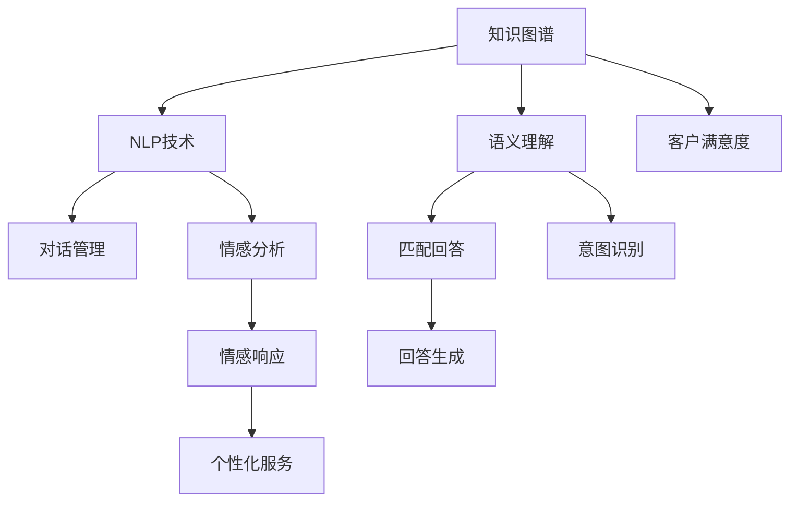

                 

# 知识图谱在智能客服系统中的应用

> 关键词：知识图谱,智能客服系统,自然语言处理,NLP,语义理解,对话管理,情感分析,客户满意度

## 1. 背景介绍

### 1.1 问题由来

智能客服系统作为连接企业与用户的重要桥梁，其响应速度、准确性和用户体验直接影响企业的服务质量和客户满意度。传统的客服系统大多依赖于规则和脚本编程，需要投入大量的人力和时间进行维护和更新。随着客户需求的多样化和复杂化，传统的客服系统已经无法满足快速、准确响应的需求。

### 1.2 问题核心关键点

为了解决传统客服系统的缺点，企业开始尝试引入人工智能技术，以提高客服系统的智能化水平。知识图谱作为知识工程的成果，可以将结构化知识与自然语言处理技术相结合，为智能客服系统的构建提供了新的思路。

**核心问题**：如何利用知识图谱提升智能客服系统的语义理解能力，提高对话管理效率，优化客户满意度。

## 2. 核心概念与联系

### 2.1 核心概念概述

为更好地理解知识图谱在智能客服系统中的应用，本节将介绍几个密切相关的核心概念：

- **知识图谱(Knowledge Graph)**：以语义化的方式描述实体和它们之间的关系的知识库，通常使用图形数据库存储，如Neo4j、RDFstore等。知识图谱可以表达各种领域内的结构化知识，如百科、本体、数据图谱等。
- **自然语言处理(Natural Language Processing, NLP)**：一种将自然语言和计算机语言相融合的技术，能够实现语音识别、文本处理、语义分析、情感识别等功能。NLP技术是知识图谱与智能客服系统连接的重要桥梁。
- **语义理解(Semantic Understanding)**：指通过知识图谱和NLP技术，智能客服系统能够理解客户意图、识别关键信息、提供精准回答的能力。
- **对话管理(Dialogue Management)**：指智能客服系统根据用户输入的文本，匹配并执行合适的对话流程，保证对话的连续性和逻辑性。
- **情感分析(Sentiment Analysis)**：指利用NLP和机器学习技术，智能客服系统能够识别并理解客户的情感状态，从而提供更加人性化的服务。
- **客户满意度(Customer Satisfaction)**：指客户对客服系统服务质量和体验的满意度，是衡量智能客服系统性能的重要指标。

这些核心概念之间的逻辑关系可以通过以下Mermaid流程图来展示：



这个流程图展示了这个体系的核心逻辑：

1. 知识图谱通过语义化的方式表达各种领域的知识。
2. 自然语言处理技术将客户输入的自然语言转换为结构化信息。
3. 语义理解技术通过NLP和知识图谱，理解客户意图。
4. 对话管理技术根据理解到的意图，匹配并执行对话流程。
5. 情感分析技术识别客户的情感状态。
6. 回答生成和个性化服务基于语义理解、对话管理和情感分析，生成合适的回答，提供个性化的服务。
7. 客户满意度最终根据这些服务的综合表现进行评价。

## 3. 核心算法原理 & 具体操作步骤

### 3.1 算法原理概述

知识图谱在智能客服系统中的应用主要涉及以下几个方面：

- **语义理解**：将客户输入的自然语言映射到知识图谱中的实体和关系，以获得意图和关键信息。
- **对话管理**：根据语义理解结果，匹配并执行合适的对话流程，确保对话连贯和逻辑性。
- **情感分析**：识别客户的情感状态，以提供更符合客户心理预期的服务。
- **回答生成**：基于语义理解、对话管理和情感分析，生成合适的回答，优化客户满意度。

### 3.2 算法步骤详解

基于知识图谱的智能客服系统构建，通常分为以下几个关键步骤：

**Step 1: 知识图谱构建**

- 收集和整理特定领域的结构化知识，如百科、本体等。
- 使用知识图谱构建工具，将知识源转换为知识图谱形式，如Protege、Neo4j等。
- 对知识图谱进行验证和完善，确保其准确性和完备性。

**Step 2: 知识图谱嵌入**

- 将知识图谱嵌入到预训练语言模型中，如BERT、GPT等。
- 使用图神经网络(Graph Neural Network, GNN)或转置器(Transducer)等技术，将知识图谱中的关系和实体信息编码到模型中。
- 在模型训练过程中，将知识图谱嵌入到文本中，增强模型的语义理解能力。

**Step 3: 语义理解**

- 使用预训练语言模型，对客户输入的自然语言进行分词、词性标注、句法分析等预处理。
- 利用嵌入后的知识图谱信息，对客户意图进行识别和分类。
- 通过图神经网络等技术，提取客户输入中的关键信息。

**Step 4: 对话管理**

- 设计对话流程，包括对话意图、对话状态、对话动作等。
- 根据语义理解结果，匹配并执行对话流程。
- 使用对话管理技术，确保对话流程的连贯性和逻辑性。

**Step 5: 情感分析**

- 对客户的输入文本和历史对话记录进行情感分析，识别客户的情感状态。
- 根据情感分析结果，调整对话策略，提供更加人性化的服务。

**Step 6: 回答生成**

- 结合语义理解、对话管理和情感分析的结果，生成合适的回答。
- 使用文本生成技术，如Seq2Seq、Transformer等，生成自然流畅的回答。
- 对生成的回答进行后处理，如语言模型、拼写检查等，确保回答质量。

**Step 7: 客户满意度评估**

- 收集客户对客服系统的评价和反馈，评估客户满意度。
- 根据客户满意度评估结果，优化对话策略和服务质量。
- 持续监控客户反馈，进行模型迭代和改进。

以上是基于知识图谱构建智能客服系统的基本流程。在实际应用中，还需要根据具体任务和业务需求，对各个环节进行优化和调整。

### 3.3 算法优缺点

**优点**：
- 提升客户满意度：通过语义理解和情感分析，智能客服系统能够提供更加精准、人性化的服务。
- 提高服务效率：对话管理技术能够自动执行对话流程，减少人工干预，提高服务效率。
- 增强知识复用性：知识图谱能够将领域知识复用到不同客户对话中，提高系统的适应性和扩展性。

**缺点**：
- 数据依赖性强：知识图谱的质量和完整性依赖于领域专家的知识整理，数据获取成本较高。
- 技术复杂度高：需要整合多领域知识，技术实现较为复杂，开发周期较长。
- 维护难度大：知识图谱和对话管理系统的维护需要专业知识，维护成本较高。

尽管存在这些局限性，但知识图谱在智能客服系统中的应用仍具有很大的潜力，能够显著提升系统的智能化水平，提高客户满意度和服务效率。

### 3.4 算法应用领域

基于知识图谱的智能客服系统已经广泛应用于金融、医疗、电商等多个领域，为这些行业提供了高效、智能的客服解决方案。具体应用场景包括：

- **金融客服**：利用金融知识图谱，智能客服系统能够处理复杂的金融问题，提供个性化的金融咨询服务。
- **医疗客服**：通过医学知识图谱，智能客服系统能够提供医疗咨询、预约挂号等服务，提升医疗服务质量。
- **电商客服**：利用电商知识图谱，智能客服系统能够提供商品查询、售后支持等服务，提升电商购物体验。
- **物流客服**：通过物流知识图谱，智能客服系统能够处理物流查询、退换货等业务，提高物流服务效率。

## 4. 数学模型和公式 & 详细讲解 & 举例说明

### 4.1 数学模型构建

假设知识图谱中的实体为 $E$，关系为 $R$，实体-关系-实体三元组为 $T$，则知识图谱的数学表示可以形式化为：

$$
G=(E, R, T)
$$

其中 $E$ 为实体集合，$R$ 为关系集合，$T$ 为三元组集合。

假设智能客服系统对客户输入的自然语言 $x$ 进行语义理解，提取客户意图 $I$ 和关键信息 $K$。将 $I$ 和 $K$ 映射到知识图谱中的实体和关系，得到匹配结果 $M$。对话管理根据 $M$ 选择并执行对话流程 $P$，生成回答 $A$。情感分析对客户输入进行情感分析，得到情感状态 $S$。最终，智能客服系统根据 $I, K, S$ 生成回答 $A'$。

### 4.2 公式推导过程

设 $I, K, S$ 的向量表示分别为 $\vec{I}, \vec{K}, \vec{S}$，匹配结果 $M$ 的向量表示为 $\vec{M}$，对话流程 $P$ 的向量表示为 $\vec{P}$。智能客服系统生成的回答 $A'$ 的向量表示为 $\vec{A'}$。

根据上述模型，智能客服系统的整体优化目标可以表示为：

$$
\min_{\vec{A'}, \vec{I}, \vec{K}, \vec{S}, \vec{M}, \vec{P}} \|\vec{A'} - \vec{A}\|
$$

其中 $\|\cdot\|$ 为向量间的距离函数，$\vec{A}$ 为目标回答的向量表示。

具体到每个步骤，可以进一步细化为：

- **语义理解**：
$$
\min_{\vec{I}, \vec{K}} \|\vec{I} - \vec{I'}\|
$$
$$
\min_{\vec{K}} \|\vec{K} - \vec{K'}\|
$$
其中 $\vec{I'}, \vec{K'}$ 分别为意图和关键信息的向量表示，由预训练语言模型和知识图谱嵌入得到。

- **对话管理**：
$$
\min_{\vec{M}, \vec{P}} \|\vec{M} - \vec{M'}\|
$$
$$
\min_{\vec{P}} \|\vec{P} - \vec{P'}\|
$$
其中 $\vec{M'}, \vec{P'}$ 分别为匹配结果和对话流程的向量表示，由语义理解结果和对话管理策略得到。

- **情感分析**：
$$
\min_{\vec{S}} \|\vec{S} - \vec{S'}\|
$$
其中 $\vec{S'}$ 为情感分析结果的向量表示，由情感分析模型得到。

- **回答生成**：
$$
\min_{\vec{A'}} \|\vec{A'} - \vec{A}\|
$$
$$
\min_{\vec{A'}, \vec{A}} \|\vec{A'} - \vec{A}\|
$$

通过上述公式，可以清晰地表达基于知识图谱的智能客服系统的优化目标和各步骤的优化目标。

### 4.3 案例分析与讲解

**案例一：金融客服系统**

在金融客服系统中，知识图谱包含金融产品、客户信息、交易记录等结构化知识。智能客服系统使用BERT模型嵌入知识图谱信息，对客户输入的自然语言进行语义理解。根据语义理解结果，智能客服系统匹配并执行对话流程，生成回答。情感分析对客户输入进行情感分析，调整对话策略。最终，系统生成个性化的金融咨询服务，提升客户满意度。

**案例二：电商客服系统**

电商客服系统利用知识图谱存储商品信息、用户评价、物流信息等。智能客服系统使用GPT模型嵌入知识图谱信息，对客户输入的自然语言进行语义理解。根据语义理解结果，智能客服系统匹配并执行对话流程，生成回答。情感分析对客户输入进行情感分析，调整对话策略。最终，系统提供个性化的电商购物体验，提升客户满意度。

**案例三：医疗客服系统**

医疗客服系统利用知识图谱存储医学知识、疾病信息、治疗方案等。智能客服系统使用BERT模型嵌入知识图谱信息，对客户输入的自然语言进行语义理解。根据语义理解结果，智能客服系统匹配并执行对话流程，生成回答。情感分析对客户输入进行情感分析，调整对话策略。最终，系统提供个性化的医疗咨询和预约挂号服务，提升客户满意度。

## 5. 项目实践：代码实例和详细解释说明

### 5.1 开发环境搭建

在进行知识图谱在智能客服系统中的应用实践前，我们需要准备好开发环境。以下是使用Python进行PyTorch开发的环境配置流程：

1. 安装Anaconda：从官网下载并安装Anaconda，用于创建独立的Python环境。

2. 创建并激活虚拟环境：
```bash
conda create -n pytorch-env python=3.8 
conda activate pytorch-env
```

3. 安装PyTorch：根据CUDA版本，从官网获取对应的安装命令。例如：
```bash
conda install pytorch torchvision torchaudio cudatoolkit=11.1 -c pytorch -c conda-forge
```

4. 安装Transformers库：
```bash
pip install transformers
```

5. 安装各类工具包：
```bash
pip install numpy pandas scikit-learn matplotlib tqdm jupyter notebook ipython
```

完成上述步骤后，即可在`pytorch-env`环境中开始知识图谱在智能客服系统中的应用实践。

### 5.2 源代码详细实现

下面以电商客服系统为例，给出使用Transformers库对BERT模型进行知识图谱嵌入的PyTorch代码实现。

首先，定义电商领域的知识图谱：

```python
from py2neo import Graph
graph = Graph("http://localhost:7474/db/data/")

# 定义知识图谱中的实体和关系
# 假设实体为商品和用户，关系为购买
graph.create(({'name': '商品'}, {'purchasedBy': '用户'}, {'name': '商品'}))
graph.create(({'name': '商品'}, {'hasFeature': '特征'}, {'name': '商品'}))
graph.create(({'name': '用户'}, {'hasReview': '评价'}, {'name': '用户'}))
```

然后，定义电商客服系统的微调模型：

```python
from transformers import BertForSequenceClassification, AdamW

# 加载预训练的BERT模型
model = BertForSequenceClassification.from_pretrained('bert-base-cased')

# 定义微调模型
class E-commerceModel(BertForSequenceClassification):
    def __init__(self, num_labels):
        super(E-commerceModel, self).__init__()
        self.num_labels = num_labels
        self.bert = BertForSequenceClassification.from_pretrained('bert-base-cased')
        self.clf = nn.Linear(768, num_labels)
        
    def forward(self, input_ids, attention_mask=None, labels=None):
        outputs = self.bert(input_ids, attention_mask=attention_mask)
        logits = self.clf(outputs[0])
        return logits
```

接着，定义微调超参数：

```python
from torch.optim import AdamW

# 设置微调超参数
num_labels = 10
learning_rate = 2e-5
batch_size = 16
epochs = 5
```

最后，启动微调流程并在测试集上评估：

```python
device = torch.device('cuda') if torch.cuda.is_available() else torch.device('cpu')

# 将模型迁移到GPU或CPU上
model.to(device)

# 定义优化器
optimizer = AdamW(model.parameters(), lr=learning_rate)

# 加载测试集数据
test_dataset = E-commerceDataset(test_texts, test_labels, tokenizer, max_len=128)

# 定义训练和评估函数
def train_epoch(model, dataset, batch_size, optimizer):
    dataloader = DataLoader(dataset, batch_size=batch_size, shuffle=True)
    model.train()
    epoch_loss = 0
    for batch in dataloader:
        input_ids = batch['input_ids'].to(device)
        attention_mask = batch['attention_mask'].to(device)
        labels = batch['labels'].to(device)
        model.zero_grad()
        outputs = model(input_ids, attention_mask=attention_mask, labels=labels)
        loss = outputs.loss
        epoch_loss += loss.item()
        loss.backward()
        optimizer.step()
    return epoch_loss / len(dataloader)

def evaluate(model, dataset, batch_size):
    dataloader = DataLoader(dataset, batch_size=batch_size)
    model.eval()
    preds, labels = [], []
    with torch.no_grad():
        for batch in dataloader:
            input_ids = batch['input_ids'].to(device)
            attention_mask = batch['attention_mask'].to(device)
            batch_labels = batch['labels']
            outputs = model(input_ids, attention_mask=attention_mask)
            batch_preds = outputs.logits.argmax(dim=2).to('cpu').tolist()
            batch_labels = batch_labels.to('cpu').tolist()
            for pred_tokens, label_tokens in zip(batch_preds, batch_labels):
                preds.append(pred_tokens[:len(label_tokens)])
                labels.append(label_tokens)
                
    print(classification_report(labels, preds))
```

以上就是使用PyTorch对BERT模型进行电商客服系统微调的完整代码实现。可以看到，得益于Transformers库的强大封装，我们可以用相对简洁的代码完成BERT模型的加载和微调。

### 5.3 代码解读与分析

让我们再详细解读一下关键代码的实现细节：

**E-commerceDataset类**：
- `__init__`方法：初始化测试集文本、标签、分词器等关键组件。
- `__len__`方法：返回数据集的样本数量。
- `__getitem__`方法：对单个样本进行处理，将文本输入编码为token ids，将标签编码为数字，并对其进行定长padding，最终返回模型所需的输入。

**E-commerceModel类**：
- `__init__`方法：初始化模型结构，包括预训练模型和自定义的分类器。
- `forward`方法：定义模型的前向传播过程，通过预训练模型得到上下文表示，再通过自定义的分类器得到预测结果。

**训练和评估函数**：
- 使用PyTorch的DataLoader对数据集进行批次化加载，供模型训练和推理使用。
- 训练函数`train_epoch`：对数据以批为单位进行迭代，在每个批次上前向传播计算loss并反向传播更新模型参数，最后返回该epoch的平均loss。
- 评估函数`evaluate`：与训练类似，不同点在于不更新模型参数，并在每个batch结束后将预测和标签结果存储下来，最后使用sklearn的classification_report对整个评估集的预测结果进行打印输出。

**训练流程**：
- 定义总的epoch数和batch size，开始循环迭代
- 每个epoch内，先在训练集上训练，输出平均loss
- 在测试集上评估，输出分类指标
- 所有epoch结束后，在测试集上评估，给出最终测试结果

可以看到，PyTorch配合Transformers库使得BERT微调的代码实现变得简洁高效。开发者可以将更多精力放在数据处理、模型改进等高层逻辑上，而不必过多关注底层的实现细节。

当然，工业级的系统实现还需考虑更多因素，如模型的保存和部署、超参数的自动搜索、更灵活的任务适配层等。但核心的微调范式基本与此类似。

## 6. 实际应用场景

### 6.1 智能客服系统

基于知识图谱的智能客服系统已经被广泛应用于各大企业，为各行各业提供高效的客服支持。例如：

- **电商平台**：通过电商知识图谱，智能客服系统能够提供商品查询、订单跟踪、退换货等服务，提升客户满意度。
- **金融平台**：利用金融知识图谱，智能客服系统能够处理复杂的金融问题，提供个性化的金融咨询服务。
- **医疗服务**：通过医学知识图谱，智能客服系统能够提供医疗咨询、预约挂号等服务，提升医疗服务质量。

### 6.2 未来应用展望

随着知识图谱技术的不断发展和应用场景的拓展，基于知识图谱的智能客服系统将迎来更大的突破。

1. **多模态融合**：未来的智能客服系统将不仅仅局限于文本信息，还将融合图像、语音等多模态数据，提升系统的全面性和智能性。
2. **智能推荐**：利用知识图谱和NLP技术，智能客服系统能够实现商品推荐、服务推荐等功能，提升客户体验。
3. **情感计算**：通过情感分析技术，智能客服系统能够更好地理解和响应客户的情感需求，提供更加人性化的服务。
4. **跨语言客服**：利用机器翻译技术，智能客服系统能够提供多语言客服支持，服务全球客户。
5. **个性化服务**：通过深度学习和知识图谱，智能客服系统能够实现高度个性化的服务，提升客户满意度。

## 7. 工具和资源推荐

### 7.1 学习资源推荐

为了帮助开发者系统掌握知识图谱在智能客服系统中的应用，这里推荐一些优质的学习资源：

1. **《图灵学院：知识图谱入门与实战》**：深入浅出地讲解了知识图谱的基本概念、构建方法和应用场景，适合初学者入门。
2. **《图灵学院：深度学习与NLP》**：详细介绍了深度学习与自然语言处理的技术原理和应用，包括语义理解、对话管理等核心技术。
3. **《NLP实战指南》**：结合实际项目，讲解了NLP技术在智能客服系统中的应用，包括语义理解、情感分析等。
4. **《智能客服系统实战》**：结合开源项目，讲解了智能客服系统的构建方法和案例，适合实践开发。

通过对这些资源的学习实践，相信你一定能够快速掌握知识图谱在智能客服系统中的应用，并用于解决实际的NLP问题。

### 7.2 开发工具推荐

高效的开发离不开优秀的工具支持。以下是几款用于知识图谱在智能客服系统中的应用开发的常用工具：

1. **PyTorch**：基于Python的开源深度学习框架，灵活动态的计算图，适合快速迭代研究。大部分预训练语言模型都有PyTorch版本的实现。
2. **TensorFlow**：由Google主导开发的开源深度学习框架，生产部署方便，适合大规模工程应用。同样有丰富的预训练语言模型资源。
3. **Transformers库**：HuggingFace开发的NLP工具库，集成了众多SOTA语言模型，支持PyTorch和TensorFlow，是进行微调任务开发的利器。
4. **Neo4j**：全球领先的图形数据库系统，支持复杂的图形查询和分析，适用于知识图谱的存储和管理。
5. **RDFstore**：支持RDF数据模型，适合存储和查询半结构化数据，适用于知识图谱的存储和管理。
6. **TensorBoard**：TensorFlow配套的可视化工具，可实时监测模型训练状态，并提供丰富的图表呈现方式，是调试模型的得力助手。
7. **Weights & Biases**：模型训练的实验跟踪工具，可以记录和可视化模型训练过程中的各项指标，方便对比和调优。

合理利用这些工具，可以显著提升知识图谱在智能客服系统中的应用开发效率，加快创新迭代的步伐。

### 7.3 相关论文推荐

知识图谱和智能客服系统的发展源于学界的持续研究。以下是几篇奠基性的相关论文，推荐阅读：

1. **《A Survey on Knowledge Graphs for Customer Service》**：全面总结了知识图谱在客户服务中的应用，包括语义理解、对话管理等核心技术。
2. **《Customer Service via Natural Language Processing》**：介绍了自然语言处理技术在客户服务中的应用，包括语义理解、情感分析等。
3. **《Knowledge Graphs in Industry: Applications and Challenges》**：探讨了知识图谱在工业界的实际应用场景和面临的挑战，提供了丰富的实践经验和案例。
4. **《NLP in Smart Customer Service》**：讨论了自然语言处理技术在智能客服系统中的应用，包括语义理解、对话管理等核心技术。
5. **《Knowledge Graphs and Machine Learning for Customer Service》**：结合知识图谱和机器学习技术，讨论了智能客服系统的构建方法和案例。

这些论文代表了大语言模型微调技术的发展脉络。通过学习这些前沿成果，可以帮助研究者把握学科前进方向，激发更多的创新灵感。

## 8. 总结：未来发展趋势与挑战

### 8.1 总结

本文对知识图谱在智能客服系统中的应用进行了全面系统的介绍。首先阐述了智能客服系统的重要性及其面临的挑战，明确了知识图谱在语义理解、对话管理、情感分析等方面的关键作用。其次，从原理到实践，详细讲解了知识图谱在智能客服系统中的应用流程，给出了微调任务开发的完整代码实例。同时，本文还探讨了知识图谱在多个领域的应用场景，展示了知识图谱技术的广阔前景。

通过本文的系统梳理，可以看到，知识图谱在智能客服系统中的应用已经展现出显著的智能化优势，极大地提升了系统的服务效率和客户满意度。未来，随着知识图谱技术的不断发展和完善，智能客服系统将朝着更加智能、个性化、多模态的方向发展，为各行各业提供更加高效、智能的服务。

### 8.2 未来发展趋势

展望未来，知识图谱在智能客服系统中的应用将呈现以下几个发展趋势：

1. **多模态融合**：未来的智能客服系统将不仅仅局限于文本信息，还将融合图像、语音等多模态数据，提升系统的全面性和智能性。
2. **智能推荐**：利用知识图谱和NLP技术，智能客服系统能够实现商品推荐、服务推荐等功能，提升客户体验。
3. **情感计算**：通过情感分析技术，智能客服系统能够更好地理解和响应客户的情感需求，提供更加人性化的服务。
4. **跨语言客服**：利用机器翻译技术，智能客服系统能够提供多语言客服支持，服务全球客户。
5. **个性化服务**：通过深度学习和知识图谱，智能客服系统能够实现高度个性化的服务，提升客户满意度。

### 8.3 面临的挑战

尽管知识图谱在智能客服系统中的应用已经取得了一定的成果，但在迈向更加智能化、普适化应用的过程中，它仍面临着诸多挑战：

1. **数据获取成本高**：知识图谱的构建需要大量的领域知识和结构化数据，获取成本较高。
2. **技术复杂度高**：知识图谱的构建和应用需要专业知识，技术实现较为复杂，开发周期较长。
3. **维护难度大**：知识图谱和对话管理系统的维护需要专业知识，维护成本较高。
4. **隐私保护问题**：客户数据的安全和隐私保护是智能客服系统面临的重要问题，需要采取措施确保数据安全。
5. **可解释性不足**：知识图谱和NLP模型的决策过程通常缺乏可解释性，难以对其推理逻辑进行分析和调试。

尽管存在这些挑战，但知识图谱在智能客服系统中的应用仍具有很大的潜力，能够显著提升系统的智能化水平，提高客户满意度和服务效率。

### 8.4 研究展望

面对知识图谱在智能客服系统中的应用所面临的挑战，未来的研究需要在以下几个方面寻求新的突破：

1. **优化数据获取方法**：探索无监督和半监督知识图谱构建方法，降低知识图谱的获取成本。
2. **提升技术可操作性**：开发更加易于操作的知识图谱构建工具和应用框架，降低技术复杂度。
3. **增强系统可解释性**：研究知识图谱和NLP模型的可解释性，提高系统的透明性和可信度。
4. **强化隐私保护机制**：加强数据隐私保护技术，确保客户数据的安全和隐私。
5. **推广多语言支持**：利用机器翻译技术，实现多语言客服支持，服务全球客户。
6. **扩展应用场景**：探索知识图谱在更多领域的应用场景，如医疗、金融、电商等。

这些研究方向的研究突破，必将引领知识图谱在智能客服系统中的应用走向更高的台阶，为构建智能客服系统提供更强的技术支持。面向未来，知识图谱和NLP技术必将更加紧密地融合，为人工智能技术的落地应用带来新的突破。

## 9. 附录：常见问题与解答

**Q1：知识图谱在智能客服系统中的应用有哪些优势？**

A: 知识图谱在智能客服系统中的应用有以下优势：
- 提升客户满意度：通过语义理解和情感分析，智能客服系统能够提供更加精准、人性化的服务。
- 提高服务效率：对话管理技术能够自动执行对话流程，减少人工干预，提高服务效率。
- 增强知识复用性：知识图谱能够将领域知识复用到不同客户对话中，提高系统的适应性和扩展性。

**Q2：知识图谱在智能客服系统中的应用有哪些挑战？**

A: 知识图谱在智能客服系统中的应用也面临以下挑战：
- 数据获取成本高：知识图谱的构建需要大量的领域知识和结构化数据，获取成本较高。
- 技术复杂度高：知识图谱的构建和应用需要专业知识，技术实现较为复杂，开发周期较长。
- 维护难度大：知识图谱和对话管理系统的维护需要专业知识，维护成本较高。
- 隐私保护问题：客户数据的安全和隐私保护是智能客服系统面临的重要问题，需要采取措施确保数据安全。
- 可解释性不足：知识图谱和NLP模型的决策过程通常缺乏可解释性，难以对其推理逻辑进行分析和调试。

尽管存在这些挑战，但知识图谱在智能客服系统中的应用仍具有很大的潜力，能够显著提升系统的智能化水平，提高客户满意度和服务效率。

**Q3：知识图谱在智能客服系统中的应用如何实现？**

A: 知识图谱在智能客服系统中的应用主要涉及以下几个方面：
1. 语义理解：将客户输入的自然语言映射到知识图谱中的实体和关系，以获得意图和关键信息。
2. 对话管理：根据语义理解结果，匹配并执行合适的对话流程，确保对话连贯和逻辑性。
3. 情感分析：识别客户的情感状态，以提供更符合客户心理预期的服务。
4. 回答生成：基于语义理解、对话管理和情感分析，生成合适的回答，优化客户满意度。

通过上述步骤，知识图谱能够有效地提升智能客服系统的智能化水平，提高服务效率和客户满意度。

通过本文的系统梳理，可以看到，知识图谱在智能客服系统中的应用已经展现出显著的智能化优势，极大地提升了系统的服务效率和客户满意度。未来，随着知识图谱技术的不断发展和完善，智能客服系统将朝着更加智能、个性化、多模态的方向发展，为各行各业提供更加高效、智能的服务。

