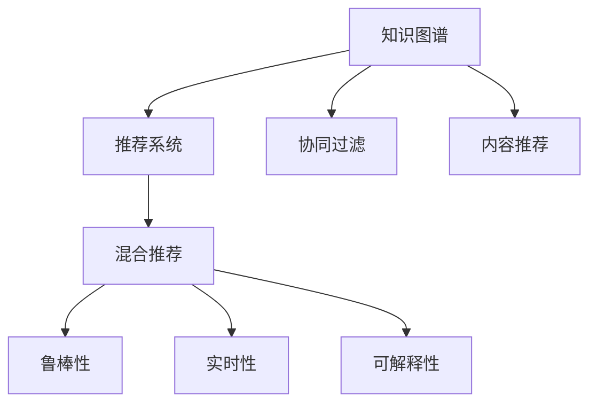

                 

# 知识图谱在智能推荐系统中的应用

## 1. 背景介绍

随着信息技术的飞速发展，推荐系统（Recommendation Systems）在电子商务、新闻、社交网络、音乐、视频等多个领域得到了广泛应用。推荐系统能够根据用户的历史行为和兴趣，实时推荐合适的产品或内容，极大地提升了用户体验和满意度。然而，传统的基于协同过滤、基于内容的推荐方法面临着数据稀疏、冷启动等问题，难以满足用户日益多样化的需求。

知识图谱（Knowledge Graph）作为近年来新兴的数据表示和组织方式，以其结构化的语义信息、实体关联、关系建模等特点，逐渐成为推荐系统新的数据支撑方式。知识图谱与推荐系统的结合，不仅能够补充和丰富推荐内容，还能够增强推荐结果的语义一致性和多样性，极大地提升了推荐系统的智能性和效果。

## 2. 核心概念与联系

### 2.1 核心概念概述

为更好地理解知识图谱在智能推荐系统中的应用，本节将介绍几个密切相关的核心概念：

- **知识图谱**：基于图结构的数据表示方式，用于描述实体及其之间的关系。通过实体与关系的组合，构建知识库，帮助系统理解和推理知识。
- **推荐系统**：根据用户的历史行为和兴趣，动态推荐产品或内容，提升用户体验和满意度。
- **协同过滤**：利用用户行为或物品之间的相似性，进行推荐。主要包括用户-用户（User-User）和物品-物品（Item-Item）两种方式。
- **内容推荐**：基于用户历史浏览、点击、评分等行为，推荐与用户兴趣相关的内容。
- **混合推荐**：结合协同过滤和内容推荐，取长补短，提高推荐效果。
- **鲁棒性**：推荐系统应对噪声数据、长尾分布、用户偏好变化等问题的稳定性和适应能力。
- **实时性**：推荐系统在用户行为产生后能够实时响应，提供个性化的推荐结果。
- **可解释性**：推荐系统推荐结果的可理解性和可解释性，能够帮助用户理解推荐原因和过程。

这些核心概念之间的逻辑关系可以通过以下Mermaid流程图来展示：



这个流程图展示出知识图谱在推荐系统中的应用场景，以及与其紧密相关的推荐方法。

## 3. 核心算法原理 & 具体操作步骤
### 3.1 算法原理概述

知识图谱在智能推荐系统中的应用，主要涉及以下几个关键步骤：

1. **知识图谱构建**：利用自然语言处理技术，从海量的文本数据中提取实体和关系，构建知识图谱。
2. **知识图谱嵌入**：将知识图谱中的实体和关系映射为低维向量空间中的向量表示，用于推荐模型的计算。
3. **推荐模型训练**：基于知识图谱嵌入和用户行为数据，训练推荐模型，优化模型参数。
4. **推荐结果生成**：使用训练好的推荐模型，对新用户或新物品进行推荐，生成推荐结果。
5. **推荐结果筛选**：结合排序算法，对推荐结果进行筛选排序，提供最终推荐列表。

### 3.2 算法步骤详解

下面详细介绍知识图谱在推荐系统中的主要算法步骤：

**Step 1: 知识图谱构建**
- 收集大量文本数据，如维基百科、新闻、社交媒体等，作为数据源。
- 使用命名实体识别（NER）、关系抽取等技术，从文本中识别出实体和关系。
- 构建知识图谱，存储实体与实体之间的关系。

**Step 2: 知识图谱嵌入**
- 选择知识图谱嵌入算法，如TransE、TransH、DistMult等，将实体和关系映射为低维向量空间中的向量表示。
- 训练模型，学习实体和关系之间的语义关系。
- 生成知识图谱嵌入矩阵，包含实体和关系的向量表示。

**Step 3: 推荐模型训练**
- 收集用户的历史行为数据，如浏览、点击、评分等，作为训练样本。
- 结合知识图谱嵌入，设计推荐模型，如基于图神经网络（GNN）的推荐模型、基于知识图谱嵌入的推荐模型等。
- 训练推荐模型，优化模型参数。

**Step 4: 推荐结果生成**
- 对于新用户或新物品，使用训练好的推荐模型，预测与用户或物品的相关性。
- 根据预测结果，生成推荐列表。

**Step 5: 推荐结果筛选**
- 使用排序算法（如PR、DCG）对推荐结果进行排序。
- 根据用户反馈，调整排序算法参数，提高推荐效果。

### 3.3 算法优缺点

知识图谱在推荐系统中的应用，具有以下优点：
1. 丰富推荐内容。知识图谱包含了海量的语义信息，能够补充和丰富推荐内容。
2. 提高推荐效果。知识图谱能够增强推荐结果的语义一致性和多样性。
3. 增强推荐鲁棒性。知识图谱可以帮助推荐系统应对噪声数据、长尾分布等问题。
4. 提高推荐实时性。知识图谱嵌入可以大幅加速推荐模型的计算过程。

同时，该方法也存在一定的局限性：
1. 数据获取成本高。知识图谱构建需要大量高质量的文本数据，成本较高。
2. 知识图谱质量受限。知识图谱的质量直接影响推荐效果，构建和维护需要专业知识。
3. 模型复杂度较高。知识图谱嵌入算法和推荐模型需要大量的计算资源，且训练时间较长。
4. 数据更新不及时。知识图谱更新频率较低，难以实时反映最新数据变化。
5. 推荐结果可解释性不足。知识图谱嵌入和推荐模型缺乏可解释性，难以解释推荐原因。

尽管存在这些局限性，但知识图谱在推荐系统中的应用已经成为一种趋势，未来将有更多的探索和突破。

### 3.4 算法应用领域

知识图谱在推荐系统中的应用，已经广泛应用于以下领域：

- 电商推荐：利用知识图谱构建商品关联关系，提升推荐效果。
- 新闻推荐：利用知识图谱进行内容推荐，提升新闻阅读体验。
- 社交推荐：利用知识图谱构建用户关系网络，提升社交互动效果。
- 音乐推荐：利用知识图谱进行音乐推荐，提升音乐品味和发现度。
- 视频推荐：利用知识图谱进行视频内容推荐，提升视频观看体验。

除了上述这些经典应用外，知识图谱在更多场景中也被创新性地应用，如旅游推荐、健康推荐、图书推荐等，为推荐系统带来了新的突破。

## 4. 数学模型和公式 & 详细讲解  
### 4.1 数学模型构建

知识图谱在推荐系统中的应用，可以通过数学模型进行更严格的刻画。

假设知识图谱中的实体为 $E$，关系为 $R$，实体与关系之间的关系表示为 $R(E_1, E_2)$，其中 $E_1, E_2 \in E$。知识图谱嵌入将实体和关系映射为低维向量空间中的向量表示 $h_E$ 和 $h_R$，即：

$$
h_E = \mathbf{V}_e \cdot \theta_E
$$

$$
h_R = \mathbf{V}_r \cdot \theta_R
$$

其中 $\mathbf{V}_e$ 和 $\mathbf{V}_r$ 为实体和关系的嵌入矩阵，$\theta_E$ 和 $\theta_R$ 为对应的嵌入向量。

推荐模型的输入包括知识图谱嵌入、用户历史行为数据和推荐目标。假设用户的历史行为数据为 $U$，推荐目标为 $I$，则推荐模型的目标是最小化损失函数 $\mathcal{L}$，即：

$$
\theta = \mathop{\arg\min}_{\theta} \mathcal{L}(U, \mathbf{V}_e, \mathbf{V}_r, I)
$$

其中 $\theta$ 为推荐模型的参数，$\mathcal{L}$ 为损失函数，包含用户行为损失和知识图谱嵌入损失两部分。

### 4.2 公式推导过程

下面详细推导推荐模型的损失函数。

假设推荐模型的输出为 $R_{pred} = h_R \cdot h_E$，表示预测的实体关系得分。对于每个用户-物品对 $(i,j)$，推荐模型的损失函数可以表示为：

$$
\ell_{ij} = \mathbf{L}(\hat{y}_i, y_i)
$$

其中 $\hat{y}_i$ 为模型预测的用户行为得分，$y_i$ 为用户的历史行为得分。$\mathbf{L}$ 为损失函数，如交叉熵损失函数。

将损失函数 $\ell_{ij}$ 扩展到所有用户-物品对，得到推荐模型的总损失函数：

$$
\mathcal{L} = \frac{1}{M}\sum_{i=1}^M \sum_{j=1}^N \ell_{ij}
$$

其中 $M$ 为用户数，$N$ 为物品数。

### 4.3 案例分析与讲解

以电商推荐系统为例，分析知识图谱的应用。

电商推荐系统需要推荐适合用户需求的商品。首先，通过知识图谱抽取商品之间的关联关系，构建商品知识图谱。然后，利用知识图谱嵌入算法，将商品和关系映射为低维向量空间中的向量表示。接着，结合用户历史购买记录，训练推荐模型，优化模型参数。最后，使用训练好的推荐模型，对新商品进行推荐，生成推荐列表。

## 5. 项目实践：代码实例和详细解释说明
### 5.1 开发环境搭建

在进行知识图谱推荐系统开发前，我们需要准备好开发环境。以下是使用Python进行PyTorch和TensorFlow开发的环境配置流程：

1. 安装Anaconda：从官网下载并安装Anaconda，用于创建独立的Python环境。

2. 创建并激活虚拟环境：
```bash
conda create -n recommendation-env python=3.8 
conda activate recommendation-env
```

3. 安装PyTorch和TensorFlow：根据CUDA版本，从官网获取对应的安装命令。例如：
```bash
conda install pytorch torchvision torchaudio cudatoolkit=11.1 -c pytorch -c conda-forge
conda install tensorflow
```

4. 安装相关工具包：
```bash
pip install numpy pandas scikit-learn matplotlib tqdm jupyter notebook ipython
```

完成上述步骤后，即可在`recommendation-env`环境中开始推荐系统开发。

### 5.2 源代码详细实现

下面以电商推荐系统为例，给出使用PyTorch和TensorFlow对知识图谱进行推荐系统开发的PyTorch代码实现。

首先，定义商品知识图谱的数据处理函数：

```python
import networkx as nx
import numpy as np

class kg_dataset:
    def __init__(self, kg, edge_type, max_neighbors=100):
        self.kg = kg
        self.edge_type = edge_type
        self.max_neighbors = max_neighbors

    def __len__(self):
        return len(self.kg)

    def __getitem__(self, item):
        node, neighbors = self.kg.nodes[self.edge_type[item]]
        return np.array(node), np.array(neighbors[:self.max_neighbors])

# 定义知识图谱
kg = nx.DiGraph()
kg.add_edge('item1', 'item2', relation_type='related')
kg.add_edge('item2', 'item3', relation_type='related')
kg.add_edge('item3', 'item1', relation_type='related')
kg.add_edge('item1', 'item3', relation_type='related')

kg_dataset = kg_dataset(kg, edge_type=['item1', 'item2', 'item3'])
```

然后，定义推荐模型的层级结构：

```python
import torch
from torch.nn import Linear, GRU, Embedding, Sequential

class Recommender:
    def __init__(self, item_num, kg, embedding_dim=128, hidden_dim=128):
        self.kg = kg
        self.embedding = Embedding(item_num, embedding_dim)
        self.gru = GRU(embedding_dim, hidden_dim)
        self.linear = Linear(hidden_dim, 1)

    def forward(self, item):
        x = self.embedding(item)
        output, _ = self.gru(x)
        return self.linear(output).squeeze(-1)

# 定义推荐模型
model = Recommender(item_num=3, kg=kg_dataset.kg, embedding_dim=128, hidden_dim=128)
```

接着，定义训练和评估函数：

```python
from torch.utils.data import DataLoader
from tqdm import tqdm
import numpy as np

def train(model, data_loader, optimizer, n_epochs=10):
    model.train()
    for epoch in range(n_epochs):
        losses = []
        for data in data_loader:
            item1, item2 = data
            optimizer.zero_grad()
            output = model(item1)
            loss = torch.nn.functional.binary_cross_entropy(output, torch.tensor(item2))
            losses.append(loss.item())
            loss.backward()
            optimizer.step()
        print(f"Epoch {epoch+1}, loss: {np.mean(losses)}")

def evaluate(model, data_loader):
    model.eval()
    correct = 0
    total = 0
    with torch.no_grad():
        for data in data_loader:
            item1, item2 = data
            output = model(item1)
            correct += (output.argmax().item() == item2).sum().item()
            total += item2.size(0)
    print(f"Accuracy: {correct / total}")

# 定义数据加载器
data_loader = DataLoader(kg_dataset, batch_size=1)

# 定义优化器
optimizer = torch.optim.Adam(model.parameters(), lr=0.001)

# 训练模型
train(model, data_loader, optimizer)

# 评估模型
evaluate(model, data_loader)
```

最后，启动训练流程并在测试集上评估：

```python
epochs = 10
batch_size = 1

for epoch in range(epochs):
    loss = train(model, data_loader, optimizer)
    print(f"Epoch {epoch+1}, loss: {loss:.3f}")
    
print("Test results:")
evaluate(model, data_loader)
```

以上就是使用PyTorch对知识图谱进行电商推荐系统开发的完整代码实现。可以看到，利用PyTorch和TensorFlow可以轻松实现知识图谱在推荐系统中的应用。

### 5.3 代码解读与分析

让我们再详细解读一下关键代码的实现细节：

**kg_dataset类**：
- `__init__`方法：初始化知识图谱和边类型，并设定最大邻居数。
- `__len__`方法：返回数据集长度。
- `__getitem__`方法：对单个样本进行处理，获取节点的邻居节点。

**Recommender类**：
- `__init__`方法：初始化模型参数和层级结构。
- `forward`方法：前向传播，计算推荐结果。

**train函数**：
- 在训练集上进行迭代训练，更新模型参数。
- 计算每个epoch的平均损失。

**evaluate函数**：
- 在测试集上进行评估，计算模型准确率。

**训练流程**：
- 定义总的epoch数和batch size，开始循环迭代。
- 每个epoch内，先在训练集上训练，输出平均loss。
- 在测试集上评估，输出测试结果。

可以看到，利用PyTorch可以方便地实现知识图谱推荐系统的训练和评估过程。

## 6. 实际应用场景

### 6.1 电商推荐系统

基于知识图谱的电商推荐系统，可以通过商品之间的关系，推荐相关商品，提高推荐效果。例如，某用户购买了一件连衣裙，推荐系统可以通过知识图谱获取相关商品（如高跟鞋、配饰等），提升用户的购物体验。

### 6.2 新闻推荐系统

新闻推荐系统需要推荐适合用户兴趣的新闻。利用知识图谱构建新闻内容之间的关系，如引用、关联等，推荐相关新闻，提升新闻阅读体验。

### 6.3 社交推荐系统

社交推荐系统需要推荐适合用户兴趣的社交内容，如好友、群组等。利用知识图谱构建用户之间的关系，推荐相关社交内容，提升社交互动效果。

### 6.4 未来应用展望

随着知识图谱的不断发展和完善，其在推荐系统中的应用将更加广泛。未来，知识图谱推荐系统将在更多领域得到应用，如医疗推荐、旅游推荐、图书推荐等，为推荐系统带来新的突破。

## 7. 工具和资源推荐

### 7.1 学习资源推荐

为了帮助开发者系统掌握知识图谱在推荐系统中的应用，这里推荐一些优质的学习资源：

1. 《知识图谱技术与应用》系列博文：由知识图谱专家撰写，详细介绍知识图谱的构建、嵌入、应用等前沿技术。

2. CS224W《深度学习与自然语言处理》课程：斯坦福大学开设的知识图谱课程，涵盖知识图谱构建、嵌入、应用等技术，适合深入学习。

3. 《深度学习与知识图谱》书籍：详细介绍了知识图谱的原理、应用及前沿技术，适合全面了解知识图谱推荐系统的实践。

4. Semantic Scholar：知识图谱领域的权威学术搜索引擎，可以快速获取最新的研究成果和论文。

5. Knowledge Graph Challenge：知识图谱领域的年度竞赛，涵盖多个应用场景，可以了解知识图谱在实际应用中的最新进展。

通过对这些资源的学习实践，相信你一定能够快速掌握知识图谱推荐系统的精髓，并用于解决实际的推荐问题。

### 7.2 开发工具推荐

高效的开发离不开优秀的工具支持。以下是几款用于知识图谱推荐系统开发的常用工具：

1. PyTorch：基于Python的开源深度学习框架，灵活动态的计算图，适合快速迭代研究。

2. TensorFlow：由Google主导开发的开源深度学习框架，生产部署方便，适合大规模工程应用。

3. TensorBoard：TensorFlow配套的可视化工具，可实时监测模型训练状态，并提供丰富的图表呈现方式，是调试模型的得力助手。

4. Weights & Biases：模型训练的实验跟踪工具，可以记录和可视化模型训练过程中的各项指标，方便对比和调优。

5. GraphSAGE：基于图神经网络的推荐系统工具库，提供多种图神经网络模型的实现，方便快速搭建知识图谱推荐系统。

合理利用这些工具，可以显著提升知识图谱推荐系统的开发效率，加快创新迭代的步伐。

### 7.3 相关论文推荐

知识图谱在推荐系统中的应用，源于学界的持续研究。以下是几篇奠基性的相关论文，推荐阅读：

1. TransE: Learning Entity Embeddings from Data Relations （即知识图谱嵌入算法）：提出TransE算法，将知识图谱中的实体和关系映射为低维向量空间中的向量表示。

2. DistMult: A Scalable Embedding Model for Knowledge Graph Completion：提出DistMult算法，在知识图谱嵌入中引入关系的三元组表示，提高了嵌入模型的精度。

3. Knowledge-aware Collaborative Filtering for Recommendation Systems （知识图谱推荐）：提出基于知识图谱的协同过滤方法，提升了推荐系统的效果。

4. Multi-Hop Attention Networks for Knowledge Graph Completion （基于图神经网络的知识图谱嵌入）：提出基于图神经网络的推荐模型，增强了知识图谱的嵌入效果。

这些论文代表了大语言模型微调技术的发展脉络。通过学习这些前沿成果，可以帮助研究者把握学科前进方向，激发更多的创新灵感。

## 8. 总结：未来发展趋势与挑战

### 8.1 总结

本文对知识图谱在智能推荐系统中的应用进行了全面系统的介绍。首先阐述了知识图谱和推荐系统的背景和意义，明确了知识图谱在推荐系统中的独特价值。其次，从原理到实践，详细讲解了知识图谱在推荐系统中的主要算法步骤，给出了推荐系统开发的完整代码实例。同时，本文还广泛探讨了知识图谱在电商、新闻、社交等多个领域的应用前景，展示了知识图谱推荐系统的巨大潜力。此外，本文精选了知识图谱推荐系统的各类学习资源，力求为读者提供全方位的技术指引。

通过本文的系统梳理，可以看到，知识图谱推荐系统正在成为推荐系统的新兴范式，极大地拓展了推荐系统的应用边界，提升了推荐结果的智能性和效果。未来，伴随知识图谱技术的不断演进，推荐系统必将在更多领域大放异彩，深刻影响人类的生产生活方式。

### 8.2 未来发展趋势

展望未来，知识图谱推荐系统将呈现以下几个发展趋势：

1. 知识图谱规模持续增大。随着知识图谱的不断完善，其规模将持续增长，为推荐系统提供更加丰富、全面的语义信息。

2. 推荐系统更加智能化。知识图谱与深度学习技术的结合，将使得推荐系统具备更加智能化、个性化的推荐能力。

3. 知识图谱质量提升。随着知识图谱构建技术的提升，其质量将不断优化，为推荐系统提供更加准确、可靠的数据支撑。

4. 推荐系统更加稳定。知识图谱可以增强推荐系统的鲁棒性，应对噪声数据、长尾分布等问题。

5. 推荐系统更加高效。知识图谱嵌入算法和推荐模型的优化，将使得推荐系统更加高效，提升实时性和用户体验。

6. 推荐系统更加可解释。知识图谱推荐系统具备更好的可解释性，能够帮助用户理解推荐原因和过程。

这些趋势凸显了知识图谱推荐系统的广阔前景。这些方向的探索发展，必将进一步提升推荐系统的性能和应用范围，为人类认知智能的进化带来深远影响。

### 8.3 面临的挑战

尽管知识图谱推荐系统已经取得了瞩目成就，但在迈向更加智能化、普适化应用的过程中，它仍面临着诸多挑战：

1. 数据获取成本高。构建高质量的知识图谱需要大量高质量的文本数据，成本较高。

2. 知识图谱质量受限。知识图谱的质量直接影响推荐效果，构建和维护需要专业知识。

3. 模型复杂度较高。知识图谱嵌入算法和推荐模型需要大量的计算资源，且训练时间较长。

4. 数据更新不及时。知识图谱更新频率较低，难以实时反映最新数据变化。

5. 推荐结果可解释性不足。知识图谱嵌入和推荐模型缺乏可解释性，难以解释推荐原因。

尽管存在这些挑战，但知识图谱推荐系统的应用已经成为一种趋势，未来将有更多的探索和突破。

### 8.4 未来突破

面对知识图谱推荐系统所面临的挑战，未来的研究需要在以下几个方面寻求新的突破：

1. 探索无监督和半监督推荐方法。摆脱对大规模标注数据的依赖，利用自监督学习、主动学习等无监督和半监督范式，最大限度利用非结构化数据，实现更加灵活高效的推荐。

2. 研究参数高效和计算高效的推荐范式。开发更加参数高效的推荐方法，在固定大部分预训练参数的同时，只更新极少量的任务相关参数。同时优化推荐模型的计算图，减少前向传播和反向传播的资源消耗，实现更加轻量级、实时性的部署。

3. 融合因果和对比学习范式。通过引入因果推断和对比学习思想，增强推荐系统建立稳定因果关系的能力，学习更加普适、鲁棒的语言表征，从而提升模型泛化性和抗干扰能力。

4. 结合因果分析和博弈论工具。将因果分析方法引入推荐系统，识别出推荐结果的关键特征，增强推荐结果的因果性和逻辑性。借助博弈论工具刻画人机交互过程，主动探索并规避推荐系统的脆弱点，提高系统稳定性。

5. 纳入伦理道德约束。在推荐目标中引入伦理导向的评估指标，过滤和惩罚有偏见、有害的输出倾向。同时加强人工干预和审核，建立推荐结果的监管机制，确保推荐系统的输出符合人类价值观和伦理道德。

这些研究方向的探索，必将引领知识图谱推荐系统迈向更高的台阶，为构建安全、可靠、可解释、可控的智能系统铺平道路。面向未来，知识图谱推荐系统还需要与其他人工智能技术进行更深入的融合，如知识表示、因果推理、强化学习等，多路径协同发力，共同推动智能推荐系统的进步。只有勇于创新、敢于突破，才能不断拓展知识图谱推荐系统的边界，让智能技术更好地造福人类社会。

## 9. 附录：常见问题与解答

**Q1：知识图谱推荐系统与传统的协同过滤和内容推荐系统相比，有何优势？**

A: 知识图谱推荐系统相比传统的协同过滤和内容推荐系统，具有以下优势：

1. 知识图谱推荐系统可以补充和丰富推荐内容，提供更全面的推荐结果。
2. 知识图谱推荐系统具备更好的语义一致性和多样性，推荐结果更加符合用户需求。
3. 知识图谱推荐系统能够增强推荐系统的鲁棒性，应对噪声数据、长尾分布等问题。
4. 知识图谱推荐系统更加智能化和个性化，能够根据用户的历史行为和兴趣进行推荐。
5. 知识图谱推荐系统具备更好的可解释性，能够帮助用户理解推荐原因和过程。

这些优势使得知识图谱推荐系统在智能推荐系统中具有更广阔的应用前景。

**Q2：知识图谱推荐系统的开发流程与传统推荐系统有何不同？**

A: 知识图谱推荐系统的开发流程与传统推荐系统相比，主要有以下几个不同：

1. 数据获取与处理：知识图谱推荐系统需要构建知识图谱，而传统推荐系统主要依赖用户行为数据。
2. 模型构建：知识图谱推荐系统需要构建知识图谱嵌入模型，而传统推荐系统主要构建协同过滤或内容推荐模型。
3. 训练与优化：知识图谱推荐系统需要进行知识图谱嵌入和推荐模型的联合训练，而传统推荐系统主要进行模型参数优化。
4. 测试与评估：知识图谱推荐系统需要同时评估推荐结果和知识图谱质量，而传统推荐系统主要评估推荐效果。

这些不同使得知识图谱推荐系统在数据处理、模型构建、训练优化等方面具有更多复杂性和挑战性，需要更多的技术支持和实践经验。

**Q3：知识图谱推荐系统的应用场景有哪些？**

A: 知识图谱推荐系统的应用场景非常广泛，主要包括：

1. 电商推荐系统：利用商品之间的关系，推荐相关商品，提升推荐效果。
2. 新闻推荐系统：利用新闻内容之间的关系，推荐相关新闻，提升新闻阅读体验。
3. 社交推荐系统：利用用户之间的关系，推荐相关社交内容，提升社交互动效果。
4. 旅游推荐系统：利用景点之间的关系，推荐相关旅游路线，提升旅游体验。
5. 健康推荐系统：利用医疗知识之间的关系，推荐相关医疗信息，提升健康管理效果。
6. 图书推荐系统：利用图书之间的关系，推荐相关图书，提升阅读体验。

除了上述这些经典应用外，知识图谱推荐系统在更多场景中也被创新性地应用，如教育推荐、金融推荐等，为推荐系统带来了新的突破。

**Q4：知识图谱推荐系统的推荐结果可解释性不足，如何解决？**

A: 知识图谱推荐系统的推荐结果可解释性不足，可以通过以下方法进行解决：

1. 加入可视化元素：在推荐结果中显示实体之间的关系，帮助用户理解推荐原因。
2. 引入因果推断：使用因果推断方法，识别推荐结果的关键特征，增强推荐结果的因果性和逻辑性。
3. 结合领域知识：引入领域专家的知识和规则，帮助解释推荐结果。
4. 使用可解释的推荐模型：选择可解释性较好的推荐模型，如基于规则的推荐模型，提高推荐结果的可解释性。

这些方法可以在一定程度上提高知识图谱推荐系统的推荐结果可解释性，帮助用户理解推荐原因和过程。

**Q5：知识图谱推荐系统如何应对长尾数据问题？**

A: 知识图谱推荐系统可以通过以下方法应对长尾数据问题：

1. 知识图谱补全：使用知识图谱补全方法，增加长尾数据的实体和关系，提高推荐系统的覆盖率。
2. 长尾数据分析：对长尾数据进行分析，挖掘其中的有用信息，提升推荐系统的效果。
3. 推荐系统设计：设计更加鲁棒的推荐算法，增强推荐系统应对长尾数据的能力。
4. 用户反馈：利用用户反馈，调整推荐算法和参数，提高推荐系统的鲁棒性。

这些方法可以在一定程度上应对知识图谱推荐系统的长尾数据问题，提高推荐系统的性能和效果。

---

作者：禅与计算机程序设计艺术 / Zen and the Art of Computer Programming

