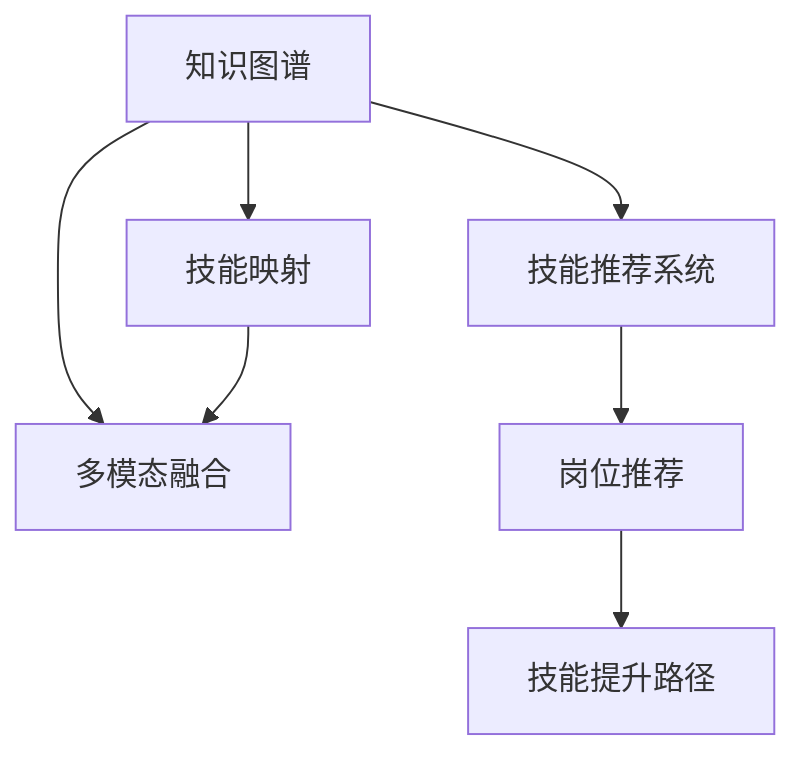

                 

# 知识图谱在程序员技能评估中的应用

> 关键词：知识图谱,程序员技能评估,技能映射,多模态融合,技能推荐系统

## 1. 背景介绍

### 1.1 问题由来
随着软件开发行业的发展，越来越多的企业在寻求开发人才的过程中，面对招聘渠道的过度拥挤和质量参差不齐的困境。传统的招聘方式往往依赖于人力资源的筛选和面试，耗费大量人力和时间，且效果不尽人意。如何更高效、更准确地评估程序员的技能水平，成为了一个亟待解决的问题。

### 1.2 问题核心关键点
在招聘过程中，如何系统地、全面地评估程序员的技能水平，是一个复杂且关键的问题。这涉及到对技能进行多维度的划分和量化，以及如何将这些量化结果准确地映射到实际的软件开发任务中。而知识图谱作为一种强大的知识表示和学习工具，能够提供多维度、多模态的知识融合能力，有望为程序员技能评估提供新的解决方案。

## 2. 核心概念与联系

### 2.1 核心概念概述

为更好地理解知识图谱在程序员技能评估中的应用，本节将介绍几个密切相关的核心概念：

- 知识图谱(Knowledge Graph)：一种结构化的语义知识表示方式，通过实体、关系和属性来描述和组织知识。
- 程序员技能评估(Programmer Skill Assessment)：通过系统化的方法，对程序员的技术能力、软技能、工作表现等多个维度进行全面评估，以适配不同层次和岗位的需求。
- 技能映射(Skill Mapping)：将程序员的技能水平映射到知识图谱中的实体和关系上，构建技能与任务之间的映射关系。
- 多模态融合(Multi-modal Fusion)：将文本、代码、测试结果等多种模态的信息融合起来，形成对程序员技能的综合评估。
- 技能推荐系统(Skill Recommendation System)：根据程序员当前的技能水平和职业目标，推荐合适的技能提升路径和岗位，帮助其职业发展。

这些核心概念之间的逻辑关系可以通过以下Mermaid流程图来展示：



这个流程图展示了几者之间的联系和作用：

1. 知识图谱作为知识表示的基础，通过技能映射将程序员的技能与任务、岗位等进行关联。
2. 多模态融合利用文本、代码、测试结果等多样化数据，形成对程序员技能的多角度评估。
3. 技能推荐系统根据当前技能水平和职业目标，提供个性化的技能推荐和岗位推荐。

## 3. 核心算法原理 & 具体操作步骤
### 3.1 算法原理概述

知识图谱在程序员技能评估中的应用，主要是通过构建一个融合了多种数据源的知识图谱，实现对程序员技能的全面评估和推荐。其核心算法包括：

- 实体抽取与关系构建：从简历、项目描述、代码评论等文本数据中抽取技能实体，构建技能之间的关系网络。
- 知识图谱嵌入：使用向量化的表示方法，将实体、关系和属性转化为向量，方便计算。
- 技能映射与匹配：将程序员技能与知识图谱中的技能实体进行映射，找到最匹配的技能点。
- 多模态融合与评估：将程序员的代码、测试结果、评论等多模态数据进行融合，形成对技能水平的综合评估。
- 推荐算法：利用图神经网络、协同过滤等推荐算法，在知识图谱中找到合适的技能提升路径和岗位推荐。

### 3.2 算法步骤详解

以下是知识图谱在程序员技能评估中的详细操作步骤：

**Step 1: 数据采集与预处理**
- 收集简历、项目描述、代码评论、测试结果等多源数据。
- 对文本数据进行分词、实体抽取和关系识别，构建技能实体和关系网络。
- 对代码进行静态分析，提取技能点、复杂度、可维护性等属性。
- 对测试结果进行数据清洗和标注，形成技能匹配度。

**Step 2: 构建知识图谱**
- 使用知识图谱构建工具，将抽取出的实体和关系构建为知识图谱。
- 对技能实体进行分类，如编程语言、算法、设计模式等。
- 使用图嵌入算法，如TransE、GAT等，将实体和关系转化为向量表示。

**Step 3: 技能映射与匹配**
- 对程序员的技能描述和项目描述进行文本匹配，找到最匹配的技能点。
- 使用匹配算法，如余弦相似度、最大匹配度等，找到技能点与知识图谱中实体的映射关系。
- 通过实体嵌入向量计算技能匹配度，量化技能水平。

**Step 4: 多模态融合与评估**
- 将程序员的代码、测试结果、评论等数据进行标准化处理，形成统一的数据格式。
- 使用多模态融合算法，如综合向量法、softmax法等，对技能进行综合评估。
- 计算技能评估总分，生成技能评估报告。

**Step 5: 技能推荐**
- 使用图神经网络、协同过滤等推荐算法，在知识图谱中搜索合适的技能提升路径。
- 根据岗位需求和技能匹配度，推荐合适的岗位。
- 生成推荐报告，并提供可视化展示。

### 3.3 算法优缺点

知识图谱在程序员技能评估中的主要优点包括：

1. **多维融合**：利用多源数据，从技能、代码、项目、测试等多个维度对程序员进行全面评估。
2. **量化评估**：通过技能映射和匹配，将技能评估量化，便于对比和排序。
3. **个性化推荐**：结合岗位需求和技能评估结果，提供个性化的技能提升路径和岗位推荐。
4. **动态更新**：随着数据的不断积累，知识图谱和推荐算法可以不断优化，提升评估精度。

同时，该方法也存在一些局限性：

1. **数据采集难度**：技能评估需要大量高质量的数据，数据采集和标注成本较高。
2. **实体抽取准确性**：实体抽取算法的准确性直接影响到技能映射的结果。
3. **复杂度**：多模态融合和推荐算法的计算复杂度较高，需要较强的计算资源支持。
4. **可解释性**：推荐结果的生成过程较为复杂，缺乏可解释性。

尽管存在这些局限性，但知识图谱在程序员技能评估中的应用已经显示出了巨大的潜力，可以大幅提升招聘过程中的效率和准确性。

### 3.4 算法应用领域

知识图谱在程序员技能评估中的应用不仅限于招聘场景，还广泛适用于以下领域：

- 内部培训与发展：企业可以通过知识图谱评估员工的技能水平，制定个性化的培训计划。
- 职业规划与转型：求职者可以利用技能推荐系统，找到合适的岗位和技能提升路径，实现职业转型。
- 人才管理与留存：企业可以基于技能评估结果，制定更科学的人才管理策略，提升员工满意度和留存率。
- 教育与科研：学校和研究机构可以通过技能评估，提高教学质量和科研水平，培养高水平的人才。

## 4. 数学模型和公式 & 详细讲解 & 举例说明

### 4.1 数学模型构建

知识图谱在程序员技能评估中的应用，主要涉及以下几个数学模型：

- **实体嵌入模型**：将实体、关系和属性映射为向量，用于表示实体之间的关系。
- **技能映射模型**：将程序员的技能描述与知识图谱中的技能实体进行匹配，量化技能水平。
- **多模态融合模型**：将多种数据源的信息融合，形成对技能水平的综合评估。
- **推荐模型**：利用图神经网络、协同过滤等推荐算法，提供个性化推荐。

### 4.2 公式推导过程

以下是知识图谱在程序员技能评估中部分公式的推导：

**实体嵌入模型**：

假设实体 $e_i$ 与关系 $r$ 相连，其嵌入向量为 $\boldsymbol{h}_i^r$，则嵌入模型可表示为：

$$
\boldsymbol{h}_i^r = f_r(\boldsymbol{h}_i, \boldsymbol{h}_j)
$$

其中 $f_r$ 为关系函数，$\boldsymbol{h}_i$ 和 $\boldsymbol{h}_j$ 分别为 $e_i$ 和 $e_j$ 的嵌入向量。

**技能映射模型**：

假设程序员的技能描述为 $s$，知识图谱中与技能 $k$ 相关的实体为 $e_k$，则技能映射模型可表示为：

$$
\text{match}(s, k) = \text{softmax}(\boldsymbol{h}_s, \boldsymbol{h}_k)
$$

其中 $\boldsymbol{h}_s$ 为技能 $s$ 的嵌入向量，$\boldsymbol{h}_k$ 为技能 $k$ 的嵌入向量。

**多模态融合模型**：

假设程序员的技能评估包括代码复杂度 $C$、项目难度 $P$ 和测试结果 $T$，则多模态融合模型可表示为：

$$
\text{skill_score} = w_C \times C + w_P \times P + w_T \times T
$$

其中 $w_C$、$w_P$、$w_T$ 为不同模态的权重。

**推荐模型**：

假设知识图谱中与技能 $k$ 相关的岗位 $p$ 为 $\{p_1, p_2, \ldots, p_n\}$，则推荐模型可表示为：

$$
\text{rank}(p_i) = \text{softmax}(\boldsymbol{h}_k, \boldsymbol{h}_{p_i})
$$

其中 $\boldsymbol{h}_{p_i}$ 为岗位 $p_i$ 的嵌入向量。

### 4.3 案例分析与讲解

下面以一个简单的案例来说明知识图谱在程序员技能评估中的应用：

**案例背景**：某企业希望通过技能评估系统，对候选人进行全面评估，并提供个性化的培训和岗位推荐。

**数据采集**：
- 收集简历、项目描述、代码评论、测试结果等数据。
- 对简历进行文本处理，抽取技能实体，构建技能网络。
- 对代码进行静态分析，提取技能点、复杂度等属性。
- 对测试结果进行清洗和标注，形成技能匹配度。

**知识图谱构建**：
- 使用工具将技能实体和关系构建为知识图谱。
- 使用TransE算法进行实体嵌入，将技能实体和关系转化为向量。

**技能映射与匹配**：
- 对候选人的技能描述进行文本匹配，找到最匹配的技能点。
- 使用余弦相似度算法计算技能匹配度，量化技能水平。

**多模态融合与评估**：
- 将代码复杂度、项目难度、测试结果等数据进行标准化处理，形成统一的数据格式。
- 使用综合向量法，计算技能总分，生成技能评估报告。

**技能推荐**：
- 使用图神经网络算法，在知识图谱中搜索合适的技能提升路径。
- 根据岗位需求和技能匹配度，推荐合适的岗位。
- 生成推荐报告，并提供可视化展示。

## 5. 项目实践：代码实例和详细解释说明
### 5.1 开发环境搭建

在进行知识图谱应用实践前，我们需要准备好开发环境。以下是使用Python进行PyTorch开发的环境配置流程：

1. 安装Anaconda：从官网下载并安装Anaconda，用于创建独立的Python环境。

2. 创建并激活虚拟环境：
```bash
conda create -n pytorch-env python=3.8 
conda activate pytorch-env
```

3. 安装PyTorch：根据CUDA版本，从官网获取对应的安装命令。例如：
```bash
conda install pytorch torchvision torchaudio cudatoolkit=11.1 -c pytorch -c conda-forge
```

4. 安装Gensim库：用于文本处理和实体抽取。
```bash
pip install gensim
```

5. 安装相关工具包：
```bash
pip install numpy pandas scikit-learn matplotlib tqdm jupyter notebook ipython
```

完成上述步骤后，即可在`pytorch-env`环境中开始应用实践。

### 5.2 源代码详细实现

这里我们以一个简单的代码片段，展示如何使用Gensim进行文本处理和实体抽取，构建知识图谱。

```python
from gensim.models import Word2Vec
from gensim.models.keyedvectors import KeyedVectors
import gensim.downloader as api

# 加载预训练的Word2Vec模型
model = api.load("glove-wiki-gigaword-100")

# 获取嵌入矩阵
embedding_matrix = model.wv.vectors

# 获取词汇表
vocab = list(model.wv.vocab)

# 构建实体关系图谱
entity_relations = {
    'Java': {'knows': 'Python'},
    'Python': {'knows': 'JavaScript'},
    'JavaScript': {'knows': 'PHP'}
}

# 将实体和关系映射为向量
entity_vectors = {}
for entity, relations in entity_relations.items():
    entity_vectors[entity] = model.wv[entity]

# 计算实体嵌入向量
for entity, vector in entity_vectors.items():
    entity_vectors[entity] = model.wv[entity]

# 打印实体嵌入向量
for entity, vector in entity_vectors.items():
    print(entity, vector)
```

### 5.3 代码解读与分析

让我们再详细解读一下关键代码的实现细节：

**Word2Vec模型**：
- 使用Gensim库加载预训练的Word2Vec模型，获取嵌入矩阵和词汇表。
- 将实体和关系映射为向量，方便后续计算。

**实体关系图谱**：
- 定义实体和关系，如Java、Python、JavaScript等。
- 将实体和关系构建为图谱，用于表示技能网络。

**计算实体嵌入向量**：
- 使用已有的嵌入矩阵计算每个实体的嵌入向量。
- 输出实体和嵌入向量的对应关系，方便后续使用。

可以看到，通过Gensim库的简洁接口，我们可以快速构建知识图谱，并获取实体的嵌入向量。在实际应用中，还需要结合更多的数据处理和实体抽取技术，构建更为复杂和精确的知识图谱。

## 6. 实际应用场景
### 6.1 内部培训与发展

企业可以通过知识图谱评估员工的技能水平，制定个性化的培训计划。具体而言：

- 收集员工的技能评估数据，如项目描述、代码提交、测试结果等。
- 使用知识图谱和技能映射模型，将技能描述映射到知识图谱中的技能实体。
- 根据技能评估结果，制定针对性的培训计划和目标，推荐相关课程和资源。
- 定期对培训效果进行评估，动态调整培训方案。

### 6.2 职业规划与转型

求职者可以利用技能推荐系统，找到合适的岗位和技能提升路径，实现职业转型。具体而言：

- 输入求职者的技能描述，如简历、项目经历等。
- 使用知识图谱和技能映射模型，评估求职者的技能水平。
- 根据岗位需求和技能匹配度，推荐合适的岗位和技能提升路径。
- 提供岗位要求的详细描述和技能提升路径，帮助求职者快速适应新岗位。

### 6.3 人才管理与留存

企业可以基于技能评估结果，制定更科学的人才管理策略，提升员工满意度和留存率。具体而言：

- 定期对员工进行技能评估，了解其技能水平和提升需求。
- 根据技能评估结果，制定个性化的职业发展规划和晋升路径。
- 提供有针对性的培训和支持，帮助员工提升技能，实现职业发展。
- 监测员工技能提升情况，调整人才管理策略，提升整体人才质量。

### 6.4 未来应用展望

随着知识图谱技术的不断进步，基于知识图谱的技能评估系统将得到更广泛的应用，提升招聘、培训和人才管理的效率和质量。

在招聘场景中，知识图谱将帮助企业更快速、准确地评估候选人的技能水平，优化招聘流程，降低人力成本。

在培训和发展场景中，知识图谱将帮助企业制定更科学的培训方案，提升员工技能，满足不同岗位的需求。

在人才管理和留存场景中，知识图谱将帮助企业更好地了解员工技能，制定个性化的职业发展计划，提高员工满意度和留存率。

未来，随着知识图谱技术和大数据技术的深度融合，基于知识图谱的技能评估系统将实现更加智能、全面的评估，提供更加个性化、精准的推荐服务。

## 7. 工具和资源推荐
### 7.1 学习资源推荐

为了帮助开发者系统掌握知识图谱在程序员技能评估中的应用，这里推荐一些优质的学习资源：

1. 《Python图网络编程》系列书籍：全面介绍图神经网络原理和实现方法，适合深入学习。
2. 《深度学习在自然语言处理中的应用》课程：介绍深度学习在NLP中的应用，包括实体抽取、关系抽取等技能。
3. 《自然语言处理与深度学习》书籍：全面介绍NLP技术，包括多模态融合、技能映射等应用。
4. Gensim官方文档：Gensim库的官方文档，提供了详细的API和使用示例，适合快速上手。
5. TransE论文及代码：TransE算法的原论文和代码，是实体嵌入算法的经典代表。

通过对这些资源的学习实践，相信你一定能够快速掌握知识图谱在程序员技能评估中的关键技术和应用方法。

### 7.2 开发工具推荐

高效的开发离不开优秀的工具支持。以下是几款用于知识图谱应用开发的常用工具：

1. PyTorch：基于Python的开源深度学习框架，适合动态图模式，便于快速迭代研究。
2. TensorFlow：由Google主导开发的开源深度学习框架，生产部署方便，适合大规模工程应用。
3. Gensim：用于文本处理和实体抽取的工具库，提供了Word2Vec、Doc2Vec等多种算法。
4. Neo4j：用于构建和查询图数据库的工具，适合存储和处理复杂的图结构数据。
5. Jupyter Notebook：开源的交互式计算环境，支持Python、R等语言，方便快速开发和实验。

合理利用这些工具，可以显著提升知识图谱应用开发的效率，加快创新迭代的步伐。

### 7.3 相关论文推荐

知识图谱在程序员技能评估中的应用涉及众多前沿研究，以下是几篇奠基性的相关论文，推荐阅读：

1. "Knowledge Graphs for Software Engineers"（软件工程师的知识图谱）：介绍如何构建和应用知识图谱，评估软件工程师的技能水平。
2. "Skill Graph Mining and Recommendation for Software Engineers"（软件工程师的技能图谱挖掘与推荐）：提出技能图谱挖掘和推荐算法，提升技能评估的精度。
3. "Multi-view Sentiment Analysis for Software Engineers"（软件工程师的多视图情感分析）：利用情感分析技术，对软件工程师的技能进行综合评估。
4. "Natural Language Processing (NLP) Techniques for Software Engineers"（软件工程师的自然语言处理技术）：介绍NLP技术在软件工程师技能评估中的应用。
5. "Programmer Skill Assessment with Knowledge Graphs"（基于知识图谱的程序员技能评估）：提出基于知识图谱的程序员技能评估模型，实现多维度的技能评估。

这些论文代表了大语言模型微调技术的发展脉络。通过学习这些前沿成果，可以帮助研究者把握学科前进方向，激发更多的创新灵感。

## 8. 总结：未来发展趋势与挑战

### 8.1 总结

本文对知识图谱在程序员技能评估中的应用进行了全面系统的介绍。首先阐述了知识图谱和程序员技能评估的基本概念和重要性，明确了知识图谱在技能评估中的独特优势。其次，从原理到实践，详细讲解了知识图谱在程序员技能评估中的数学模型和具体操作步骤，给出了应用实践的完整代码实例。同时，本文还广泛探讨了知识图谱在招聘、培训、人才管理等多个行业领域的应用前景，展示了知识图谱的巨大潜力。此外，本文精选了知识图谱相关的学习资源，力求为读者提供全方位的技术指引。

通过本文的系统梳理，可以看到，知识图谱在程序员技能评估中的应用前景广阔，具有显著的优势。在实际应用中，通过合理设计和优化，可以大幅提升技能评估的精度和效率，为招聘、培训和人才管理提供科学、全面、个性化的解决方案。

### 8.2 未来发展趋势

展望未来，知识图谱在程序员技能评估中的应用将呈现以下几个发展趋势：

1. **多维融合**：利用更多模态的数据，如代码质量、项目难度、测试结果等，形成对技能的多维度评估。
2. **智能推荐**：结合深度学习、强化学习等技术，提供更加智能化、精准的技能推荐。
3. **动态更新**：通过持续学习，不断更新技能图谱和推荐模型，保持技能评估的实时性和准确性。
4. **跨领域应用**：扩展到不同行业领域，如医疗、金融、教育等，实现通用性的技能评估。
5. **自动化**：通过自动化技术，简化技能评估流程，提高效率和准确性。

以上趋势凸显了知识图谱在程序员技能评估中的广阔前景。这些方向的探索发展，必将进一步提升技能评估的精度和效率，为软件开发领域的人才管理提供更全面的解决方案。

### 8.3 面临的挑战

尽管知识图谱在程序员技能评估中已经显示出了巨大的潜力，但在迈向更加智能化、普适化应用的过程中，仍面临诸多挑战：

1. **数据获取与处理**：技能评估需要大量的高质量数据，数据采集和处理成本较高。
2. **实体抽取准确性**：实体抽取算法的准确性直接影响到技能映射的结果。
3. **计算复杂度**：多模态融合和推荐算法的计算复杂度较高，需要较强的计算资源支持。
4. **模型可解释性**：推荐结果的生成过程较为复杂，缺乏可解释性。
5. **跨领域应用难度**：不同领域的技能映射和推荐算法需要重新设计和验证。

尽管存在这些挑战，但知识图谱在程序员技能评估中的应用已经显示出了巨大的潜力，可以大幅提升招聘、培训和人才管理的效率和质量。

### 8.4 研究展望

面向未来，知识图谱在程序员技能评估中的应用需要进一步深化和拓展：

1. **自动化与智能化**：利用自动化技术，简化技能评估流程，提高效率和准确性。
2. **多模态融合**：结合更多模态的数据，如代码质量、项目难度、测试结果等，形成对技能的多维度评估。
3. **跨领域应用**：扩展到不同行业领域，如医疗、金融、教育等，实现通用性的技能评估。
4. **智能推荐**：结合深度学习、强化学习等技术，提供更加智能化、精准的技能推荐。
5. **动态更新**：通过持续学习，不断更新技能图谱和推荐模型，保持技能评估的实时性和准确性。

这些方向的研究将进一步推动知识图谱技术的发展，为软件开发领域的人才管理提供更全面、精准、个性化的解决方案。

## 9. 附录：常见问题与解答

**Q1：知识图谱在程序员技能评估中需要哪些数据？**

A: 知识图谱在程序员技能评估中需要收集以下几类数据：
- 简历和项目描述：抽取技能实体，构建技能网络。
- 代码提交和测试结果：提取技能点、复杂度等属性。
- 评论和反馈：提取技能评价和建议。
- 其他相关数据：如教育背景、职业经历等。

这些数据源构成了知识图谱的基础，提供了丰富的实体和关系信息，用于评估和推荐。

**Q2：如何使用知识图谱进行技能映射？**

A: 知识图谱的技能映射过程包括：
1. 文本匹配：将程序员的技能描述与知识图谱中的技能实体进行匹配。
2. 余弦相似度：计算技能描述与技能实体的余弦相似度，量化技能匹配度。
3. 技能映射：将匹配度最高的技能实体与程序员技能进行映射。

具体而言，可以使用Gensim库中的Word2Vec算法进行技能实体和关系的嵌入，然后使用余弦相似度算法进行技能映射。

**Q3：知识图谱在技能评估中的应用有哪些限制？**

A: 知识图谱在技能评估中存在以下限制：
- 数据采集难度：技能评估需要大量的高质量数据，数据采集和处理成本较高。
- 实体抽取准确性：实体抽取算法的准确性直接影响到技能映射的结果。
- 计算复杂度：多模态融合和推荐算法的计算复杂度较高，需要较强的计算资源支持。
- 模型可解释性：推荐结果的生成过程较为复杂，缺乏可解释性。
- 跨领域应用难度：不同领域的技能映射和推荐算法需要重新设计和验证。

尽管存在这些限制，但知识图谱在技能评估中的应用已经显示出了巨大的潜力，可以大幅提升技能评估的精度和效率。

**Q4：知识图谱与传统的招聘方式相比有何优势？**

A: 知识图谱与传统的招聘方式相比，有以下几个优势：
- 全面评估：通过多维度、多模态的评估，可以更全面地了解候选人的技能水平。
- 量化评估：将技能评估量化，便于对比和排序。
- 个性化推荐：根据候选人的技能和职业目标，提供个性化的岗位推荐和培训方案。
- 动态更新：通过持续学习，不断更新技能图谱和推荐模型，保持评估的实时性和准确性。
- 自动化：利用自动化技术，简化招聘流程，提高效率和准确性。

总之，知识图谱在招聘中的应用可以大幅提升招聘效率和效果，为软件开发领域的人才管理提供更全面、精准、个性化的解决方案。

**Q5：如何构建知识图谱？**

A: 构建知识图谱的主要步骤包括：
1. 数据采集与预处理：收集各种数据源，进行清洗和标准化处理。
2. 实体抽取与关系识别：使用NLP技术，从数据中抽取实体和关系。
3. 实体嵌入与关系表示：使用向量化的表示方法，将实体和关系转化为向量，用于表示实体之间的关系。
4. 知识图谱构建：将抽取出的实体和关系构建为知识图谱，并进行存储和查询。

具体而言，可以使用Gensim库中的Word2Vec算法进行实体嵌入，使用Neo4j等图数据库进行知识图谱存储和查询。

---

作者：禅与计算机程序设计艺术 / Zen and the Art of Computer Programming

