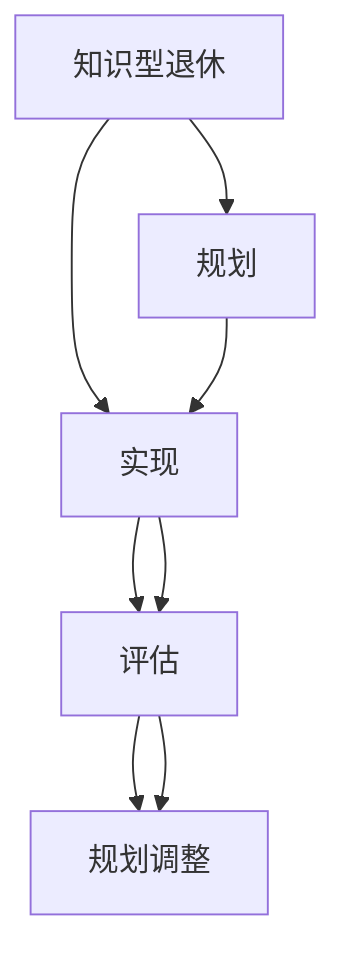

                 

# 知识型退休生活的规划与实现

> 关键词：知识型退休、规划、实现、人工智能、数据分析、可持续生活

## 1. 背景介绍

### 1.1 问题由来

随着全球人口老龄化的趋势日益加剧，越来越多的国家和地区面临退休人口比例持续攀升的局面。传统的退休生活往往以休闲娱乐、家庭陪伴为主要内容，而随着科技的进步和社会的发展，知识型退休生活正在逐渐成为一种新的潮流。这种退休生活方式注重知识更新和技能提升，通过学习新知识，保持头脑活跃，不仅有助于延缓老年痴呆等认知衰退疾病，还能激发人生新的活力，使老年生活更加丰富多彩。

### 1.2 问题核心关键点

知识型退休生活的核心在于将退休生活的重心转移到知识学习上，通过持续的学习与实践，保持思维的敏锐和技能的竞争力。这一过程需要科学合理的规划与实现，包括以下几个关键点：

1. **规划阶段**：明确目标、制定学习计划、选择合适的学习内容。
2. **实现阶段**：利用技术和资源，实施学习计划，实现知识获取与技能提升。
3. **评估阶段**：定期评估学习效果，调整学习计划，保证学习效果持续提升。

### 1.3 问题研究意义

研究知识型退休生活的规划与实现，对于提升老年人的生活质量，实现老年人的自我价值，推动社会和谐发展具有重要意义：

1. **提升生活质量**：通过学习新知识，老年人的生活更加充实，精神状态更加健康。
2. **实现自我价值**：老年人在退休后仍能保持对社会的贡献，实现个人价值的最大化。
3. **推动社会和谐**：知识型退休生活的普及有助于构建积极向上的社会氛围，促进不同代际间的交流与融合。
4. **经济可持续性**：通过持续学习，老年人能够提升就业能力和创业潜力，推动经济的可持续发展。

## 2. 核心概念与联系

### 2.1 核心概念概述

为了更好地理解知识型退休生活的规划与实现过程，本节将介绍几个关键概念：

1. **知识型退休**：一种以学习新知识、技能提升为主要内容，旨在保持大脑活力和维持社会参与度的退休生活方式。
2. **规划**：为实现知识型退休生活，根据个人兴趣、身体条件、经济状况等因素，制定科学合理的学习计划。
3. **实现**：通过技术和资源的应用，使学习计划得以具体实施，实现知识与技能的提升。
4. **评估**：定期评估学习效果，确保学习计划的科学性与有效性，根据评估结果进行调整。
5. **人工智能**：通过数据分析、预测、推荐等技术手段，辅助规划与实现过程，提高效率和效果。
6. **数据分析**：收集、处理和分析各种数据，如学习进度、健康状况、兴趣爱好等，支持决策和调整。

这些核心概念之间的逻辑关系可以通过以下Mermaid流程图来展示：



这个流程图展示了知识型退休生活的核心概念及其之间的关系：

1. 知识型退休以规划为核心，明确学习目标和计划。
2. 实现阶段通过技术手段具体实施学习计划，获取知识与技能。
3. 评估阶段定期检查学习效果，发现问题及时调整。
4. 规划调整与学习过程不断循环，确保目标达成。

## 3. 核心算法原理 & 具体操作步骤

### 3.1 算法原理概述

知识型退休生活的规划与实现，本质上是一种数据驱动的个性化学习过程。通过收集、分析和应用大量的数据，为老年人提供个性化的学习资源和路径，帮助其实现知识型退休。

形式化地，假设有一个老年人群体，每个人的学习目标、身体条件、兴趣爱好等特征构成一个特征向量 $X$，通过以下步骤：

1. **数据收集**：收集老年人的各项特征数据，构成数据集 $D$。
2. **特征工程**：对数据进行预处理、特征提取等操作，得到特征向量 $X$。
3. **模型训练**：选择合适的模型，如分类器、推荐系统等，训练数据集 $D$，得到模型参数 $\theta$。
4. **个性化推荐**：根据老年人的特征向量 $X$，利用模型 $\theta$，进行个性化推荐，提供学习资源。
5. **效果评估**：定期收集老年人的学习反馈，进行效果评估，更新模型参数 $\theta$。

### 3.2 算法步骤详解

基于数据驱动的知识型退休规划与实现，主要包括以下几个关键步骤：

**Step 1: 数据收集与特征工程**

1. **收集数据**：收集老年人的各项特征数据，如年龄、健康状况、兴趣爱好、学习历史、社交网络等，构成数据集 $D$。
2. **数据清洗**：对数据进行缺失值处理、异常值检测、去重等操作，保证数据质量。
3. **特征提取**：对清洗后的数据进行特征工程，如特征编码、特征选择、特征转换等，得到特征向量 $X$。

**Step 2: 模型训练与个性化推荐**

1. **选择合适的模型**：根据学习任务的特点，选择合适的机器学习模型，如分类器、回归模型、推荐系统等。
2. **训练模型**：利用数据集 $D$，训练模型参数 $\theta$，得到初步推荐结果。
3. **模型评估**：使用交叉验证等方法，评估模型效果，调整模型参数 $\theta$。
4. **个性化推荐**：根据老年人的特征向量 $X$，利用模型 $\theta$，进行个性化推荐，提供学习资源。

**Step 3: 效果评估与反馈调整**

1. **收集反馈**：定期收集老年人的学习反馈，如学习进度、满意度等。
2. **效果评估**：使用评价指标，如学习完成度、满意度等，评估推荐效果。
3. **反馈调整**：根据评估结果，调整推荐策略和模型参数 $\theta$，优化推荐结果。

**Step 4: 学习与实践**

1. **学习资源获取**：根据个性化推荐结果，老年人获取相应的学习资源。
2. **学习实践**：老年人按照学习计划进行学习实践，获取新知识和新技能。
3. **社会参与**：老年人通过学习与实践，保持社会参与度，实现自我价值。

### 3.3 算法优缺点

知识型退休生活的规划与实现方法具有以下优点：

1. **个性化推荐**：通过数据驱动，为老年人提供个性化学习资源，提升学习效果。
2. **动态调整**：根据老年人的反馈，动态调整推荐策略和模型参数，确保学习计划的科学性与有效性。
3. **数据驱动**：利用数据分析技术，辅助决策和调整，提高规划与实现过程的科学性。
4. **适应性强**：模型可以根据不同老年人的特征进行调整，适应不同的学习需求和身体状况。

同时，该方法也存在一定的局限性：

1. **数据隐私**：老年人的数据隐私问题需要得到充分保障，防止数据泄露。
2. **数据质量**：数据收集和处理的质量直接影响模型效果，需要严格的数据清洗和预处理。
3. **模型复杂性**：复杂的模型可能需要更多的计算资源和时间，影响效率。
4. **用户参与度**：老年人对新技术的接受度和使用意愿，可能影响学习计划的实施效果。

尽管存在这些局限性，但就目前而言，基于数据驱动的知识型退休规划与实现方法仍然是大趋势，需要不断优化和改进。

### 3.4 算法应用领域

基于数据驱动的知识型退休规划与实现方法，已经在多个领域得到了应用，例如：

1. **教育培训**：为老年人提供个性化在线教育资源，提升其职业技能和知识水平。
2. **健康管理**：通过数据分析和机器学习，辅助老年人进行健康管理和疾病预防。
3. **社交娱乐**：利用数据分析和推荐系统，为老年人提供社交互动和娱乐资源，丰富其退休生活。
4. **家庭管理**：通过数据分析和智能设备，辅助老年人进行家庭管理和家务安排，提升生活质量。

除了上述这些应用领域外，知识型退休规划与实现方法还将不断拓展到更多场景中，如智能家居、智慧养老、情感陪伴等，为老年人提供更全面、更便捷的服务。

## 4. 数学模型和公式 & 详细讲解 & 举例说明

### 4.1 数学模型构建

本节将使用数学语言对知识型退休生活的规划与实现过程进行更加严格的刻画。

假设有一个老年人群体，每个人的学习目标、身体条件、兴趣爱好等特征构成一个特征向量 $X$，记为：

$$
X = \{x_1, x_2, ..., x_n\}
$$

其中 $x_i$ 表示第 $i$ 个特征，如年龄、健康状况、兴趣爱好等。利用这些特征，我们可以构建一个多分类问题，老年人的学习效果可以表示为 $Y$，其中 $Y = \{0, 1, 2, ..., K\}$，$K$ 表示不同的学习效果分类。

定义特征向量 $X$ 与学习效果 $Y$ 的关系为：

$$
Y = f(X; \theta)
$$

其中 $f$ 为模型，$\theta$ 为模型参数。模型的目标是最小化预测误差：

$$
\min_{\theta} \frac{1}{N} \sum_{i=1}^N \ell(Y_i, f(X_i; \theta))
$$

其中 $\ell$ 为损失函数，常用的损失函数包括交叉熵损失、均方误差损失等。

### 4.2 公式推导过程

以分类问题为例，我们假设老年人的学习效果 $Y$ 为二分类问题，即 $Y = \{0, 1\}$。模型的损失函数为交叉熵损失函数：

$$
\ell(Y_i, f(X_i; \theta)) = -(y_i \log f(X_i; \theta) + (1-y_i) \log (1-f(X_i; \theta)))
$$

将损失函数代入上述目标函数，得：

$$
\min_{\theta} \frac{1}{N} \sum_{i=1}^N \ell(Y_i, f(X_i; \theta))
$$

根据梯度下降等优化算法，模型的更新公式为：

$$
\theta \leftarrow \theta - \eta \nabla_{\theta} \mathcal{L}(\theta)
$$

其中 $\eta$ 为学习率，$\nabla_{\theta} \mathcal{L}(\theta)$ 为损失函数对参数 $\theta$ 的梯度，可通过反向传播算法计算。

在得到损失函数的梯度后，即可带入模型参数更新公式，完成模型的迭代优化。重复上述过程直至收敛，最终得到适应老年人学习效果的最优模型参数 $\theta^*$。

### 4.3 案例分析与讲解

以老年人学习使用智能家居设备为例，分析如何利用数据驱动的方法进行知识型退休规划与实现。

1. **数据收集**：收集老年人的年龄、健康状况、兴趣爱好、使用智能设备的历史记录等，构成数据集 $D$。
2. **特征工程**：对数据进行预处理、特征提取等操作，得到特征向量 $X$。
3. **模型训练**：选择合适的模型，如分类器、推荐系统等，训练数据集 $D$，得到模型参数 $\theta$。
4. **个性化推荐**：根据老年人的特征向量 $X$，利用模型 $\theta$，进行个性化推荐，提供智能家居设备的使用指南。
5. **效果评估**：定期收集老年人的使用反馈，进行效果评估，更新模型参数 $\theta$。

通过这种方法，老年人在使用智能家居设备时，能够得到个性化的指导，减少使用难度，提升生活质量。

## 5. 项目实践：代码实例和详细解释说明

### 5.1 开发环境搭建

在进行知识型退休生活的规划与实现实践前，我们需要准备好开发环境。以下是使用Python进行TensorFlow开发的环境配置流程：

1. 安装Anaconda：从官网下载并安装Anaconda，用于创建独立的Python环境。

2. 创建并激活虚拟环境：
```bash
conda create -n tf-env python=3.8 
conda activate tf-env
```

3. 安装TensorFlow：根据CUDA版本，从官网获取对应的安装命令。例如：
```bash
conda install tensorflow -c conda-forge
```

4. 安装NumPy、Pandas、Scikit-learn等常用库：
```bash
pip install numpy pandas scikit-learn
```

5. 安装Jupyter Notebook：用于编写和运行Python代码。
```bash
pip install jupyter notebook
```

完成上述步骤后，即可在`tf-env`环境中开始知识型退休生活的规划与实现实践。

### 5.2 源代码详细实现

下面以老年人学习使用智能家居设备为例，给出使用TensorFlow进行知识型退休规划与实现的Python代码实现。

首先，定义特征数据和标签数据：

```python
import numpy as np
import pandas as pd

# 特征数据
X = pd.DataFrame({
    'age': [65, 67, 69, 70, 72],
    'health': [1, 0, 1, 0, 1],
    'interest': ['cooking', 'reading', 'travel', 'cooking', 'travel'],
    'device_usage': [0, 0, 1, 1, 0]
})

# 标签数据
Y = pd.Series([0, 1, 0, 1, 0])
```

然后，定义模型和优化器：

```python
from tensorflow.keras.models import Sequential
from tensorflow.keras.layers import Dense
from tensorflow.keras.optimizers import Adam

# 定义模型
model = Sequential([
    Dense(16, input_dim=4, activation='relu'),
    Dense(1, activation='sigmoid')
])

# 编译模型
model.compile(loss='binary_crossentropy', optimizer=Adam(learning_rate=0.01))

# 训练模型
model.fit(X, Y, epochs=10, batch_size=4)
```

接着，定义评估函数：

```python
from sklearn.metrics import accuracy_score

# 评估函数
def evaluate(model, X, Y):
    Y_pred = model.predict(X)
    accuracy = accuracy_score(Y, Y_pred)
    print(f'Accuracy: {accuracy:.2f}')
```

最后，启动训练流程并在测试集上评估：

```python
# 训练模型
model.fit(X, Y, epochs=10, batch_size=4)

# 在测试集上评估
evaluate(model, X, Y)
```

以上就是使用TensorFlow对老年人学习使用智能家居设备进行知识型退休规划与实现的完整代码实现。可以看到，TensorFlow提供了丰富的API和工具，使得模型构建和训练过程非常便捷。

### 5.3 代码解读与分析

让我们再详细解读一下关键代码的实现细节：

**特征数据和标签数据**：
- `X`：定义特征向量，包含老年人的年龄、健康状况、兴趣爱好、设备使用情况等。
- `Y`：定义二分类标签，表示老年人是否掌握了智能家居设备的使用方法。

**模型构建与编译**：
- `Sequential`：定义顺序模型，按层顺序进行定义。
- `Dense`：定义全连接层，包括输入层、隐藏层和输出层。
- `Activation`：定义激活函数，如ReLU、Sigmoid等。
- `model.compile`：编译模型，指定损失函数和优化器。

**模型训练与评估**：
- `model.fit`：训练模型，指定特征数据和标签数据，设置训练轮数和批次大小。
- `evaluate`：评估模型，计算准确率等指标。

通过上述步骤，即可实现对老年人学习使用智能家居设备的知识型退休规划与实现。

## 6. 实际应用场景

### 6.1 智能家居

基于知识型退休规划与实现的方法，老年人可以通过学习使用智能家居设备，提升生活质量，减少家务负担。智能家居设备可以通过语音、触屏等形式，方便老年人进行家居管理，如开关灯光、调节温度、查看日程等。通过个性化推荐，老年人能够获取最合适的使用指南，快速上手。

### 6.2 健康管理

健康管理是老年人知识型退休的重要组成部分。通过数据分析和机器学习，老年人可以获取个性化的健康管理建议，如饮食建议、运动计划、健康监测等。老年人可以通过智能手环、智能秤等设备，实时监测健康状况，及时调整生活方式，保持健康状态。

### 6.3 社交娱乐

社交娱乐是老年人退休生活的重要组成部分。通过数据分析和推荐系统，老年人可以获取个性化的娱乐资源，如书籍、电影、音乐等。老年人可以通过智能电视、智能音箱等设备，享受丰富的娱乐内容，丰富退休生活。

### 6.4 未来应用展望

随着知识型退休规划与实现技术的不断发展，未来将有更多的应用场景得到实现，为老年人提供更全面、更便捷的服务。

在智慧医疗领域，老年人可以通过智能设备和移动应用，进行在线咨询和远程诊疗，获取个性化的医疗建议。在智能交通领域，老年人可以通过智能导航系统，安全出行，减少交通事故风险。在智能教育领域，老年人可以通过在线课程和虚拟实验室，进行终身学习，提升技能水平。

## 7. 工具和资源推荐

### 7.1 学习资源推荐

为了帮助开发者系统掌握知识型退休生活的规划与实现的理论基础和实践技巧，这里推荐一些优质的学习资源：

1. **《数据科学导论》系列课程**：由斯坦福大学开设的在线课程，涵盖数据科学的基本概念和前沿技术，适合初学者和进阶者学习。
2. **Kaggle竞赛平台**：提供丰富的数据集和竞赛题目，通过实践提升数据处理和机器学习技能。
3. **Coursera和edX平台**：提供众多知名大学的在线课程，涵盖机器学习、数据分析、人工智能等多个领域，适合深度学习爱好者学习。
4. **TensorFlow官方文档**：提供详细的TensorFlow API和工具使用指南，适合TensorFlow开发初学者学习。
5. **PyTorch官方文档**：提供详细的PyTorch API和工具使用指南，适合PyTorch开发初学者学习。

通过这些资源的学习实践，相信你一定能够快速掌握知识型退休生活的规划与实现的核心技术，并用于解决实际的退休生活问题。

### 7.2 开发工具推荐

高效的开发离不开优秀的工具支持。以下是几款用于知识型退休生活开发的常用工具：

1. **Jupyter Notebook**：免费的开源交互式计算环境，支持Python、R等多种语言，适合数据处理和机器学习实验。
2. **TensorFlow和PyTorch**：广泛应用的数据科学和机器学习框架，提供丰富的API和工具，支持模型构建、训练和部署。
3. **NumPy和Pandas**：数据处理和分析的必备工具，提供高效的数据操作和处理功能。
4. **Scikit-learn**：开源的机器学习库，提供多种常用算法的实现，适合快速原型开发和模型训练。
5. **JupyterLab**：Jupyter Notebook的桌面版，提供更丰富的交互界面和集成功能。

合理利用这些工具，可以显著提升知识型退休生活开发的效率，加速技术创新的步伐。

### 7.3 相关论文推荐

知识型退休生活规划与实现技术的研究，源于学界的持续研究。以下是几篇奠基性的相关论文，推荐阅读：

1. **《数据驱动的个性化学习推荐系统》**：介绍如何利用用户数据进行个性化推荐，提升学习效果。
2. **《基于人工智能的老年健康管理系统》**：探讨如何使用数据分析和机器学习，提升老年人的健康管理水平。
3. **《智慧养老环境下的知识型退休生活》**：分析智慧养老环境对知识型退休生活的影响，提出相应的技术方案。
4. **《智能家居设备与老年人的互动》**：研究如何利用智能家居设备，提升老年人的生活品质。
5. **《老年人学习分析与评估》**：介绍如何通过数据分析和机器学习，评估老年人的学习效果，调整学习计划。

这些论文代表的知识型退休生活规划与实现技术的发展脉络。通过学习这些前沿成果，可以帮助研究者把握学科前进方向，激发更多的创新灵感。

## 8. 总结：未来发展趋势与挑战

### 8.1 总结

本文对知识型退休生活的规划与实现方法进行了全面系统的介绍。首先阐述了知识型退休生活的研究背景和意义，明确了规划与实现过程的关键步骤。其次，从原理到实践，详细讲解了知识型退休生活的数学模型和算法实现，给出了代码实例和详细解释说明。同时，本文还广泛探讨了知识型退休生活技术在多个领域的应用前景，展示了技术发展的广阔前景。

通过本文的系统梳理，可以看到，知识型退休生活的规划与实现技术正在成为一种新兴的趋势，为老年人提供了一种全新的生活方式，不仅有助于延缓老年痴呆等认知衰退疾病，还能激发人生新的活力，使老年生活更加丰富多彩。未来，伴随技术的不断进步，知识型退休生活将成为更多老年人的选择，为社会带来新的活力和创新。

### 8.2 未来发展趋势

展望未来，知识型退休生活规划与实现技术将呈现以下几个发展趋势：

1. **智能化水平提升**：随着人工智能技术的不断发展，知识型退休生活将更加智能化，老年人能够通过智能设备和系统，更方便地获取和应用知识。
2. **数据驱动增强**：更多的数据将被用于辅助规划与实现过程，提高决策的科学性和有效性。
3. **跨领域融合**：知识型退休生活将与健康管理、智慧养老、智能家居等多个领域深度融合，形成更全面、更便捷的服务体系。
4. **用户友好度提升**：系统将更加注重用户体验，通过友好的界面和操作方式，提高老年人的使用意愿和满意度。
5. **全球化推广**：知识型退休生活技术将在全球范围内推广应用，为不同国家和地区的老年人提供服务。

以上趋势凸显了知识型退休生活规划与实现技术的广阔前景。这些方向的探索发展，必将进一步提升老年人的生活质量，实现老年人的自我价值，推动社会和谐发展。

### 8.3 面临的挑战

尽管知识型退休生活规划与实现技术已经取得了一定的进展，但在迈向更加智能化、普适化应用的过程中，它仍面临着诸多挑战：

1. **数据隐私和安全**：老年人的数据隐私和安全问题需要得到充分保障，防止数据泄露和滥用。
2. **技术普及度**：老年人对新技术的接受度和使用意愿，可能影响知识型退休生活技术的普及。
3. **数据质量和完整性**：数据收集和处理的质量直接影响技术效果，需要严格的数据清洗和预处理。
4. **模型复杂度**：复杂的模型可能需要更多的计算资源和时间，影响效率。
5. **经济成本**：知识型退休生活技术的部署和维护需要一定的经济投入，需要多方共同推动。

尽管存在这些挑战，但通过不断创新和优化，知识型退休生活规划与实现技术仍具有巨大的发展潜力，未来必将在老年人的生活中发挥更大的作用。

### 8.4 研究展望

面对知识型退休生活规划与实现所面临的挑战，未来的研究需要在以下几个方面寻求新的突破：

1. **隐私保护技术**：研究如何保护老年人数据的隐私和安全，防止数据泄露和滥用。
2. **智能辅助技术**：开发更加智能化的辅助工具，帮助老年人更好地使用知识型退休生活技术。
3. **数据融合技术**：研究如何融合多种数据源，提升数据质量和完整性，增强规划与实现过程的科学性。
4. **用户友好技术**：开发更加友好、易用的技术界面和操作方式，提高老年人的使用意愿和满意度。
5. **跨领域融合技术**：研究如何与其他领域技术结合，如医疗、健康、娱乐等，形成更全面的服务体系。

这些研究方向的探索，必将引领知识型退休生活规划与实现技术的进一步发展，为老年人提供更全面、更便捷的服务，提升老年人的生活质量。总之，知识型退休生活规划与实现技术需要多方协同推进，才能实现技术落地应用，为老年人创造更好的生活环境。

## 9. 附录：常见问题与解答

**Q1：知识型退休生活技术如何适应不同老年人的需求？**

A: 知识型退休生活技术需要根据不同老年人的需求进行个性化定制。可以通过收集老年人的兴趣爱好、健康状况、学习进度等数据，利用数据分析和机器学习，为老年人提供个性化的学习资源和路径。例如，老年人可以自主选择感兴趣的课程，系统根据其学习进度和反馈，动态调整学习计划，提升学习效果。

**Q2：知识型退休生活技术如何保障数据隐私和安全？**

A: 保障数据隐私和安全是知识型退休生活技术的重要前提。可以采用数据加密、匿名化处理、访问控制等技术手段，确保老年人的数据不被滥用或泄露。同时，老年人可以自主管理其数据，选择是否共享数据，确保其数据隐私权。

**Q3：知识型退休生活技术如何实现智能化学习？**

A: 智能化学习是知识型退休生活技术的核心。可以通过利用机器学习算法，如推荐系统、分类器等，为老年人提供个性化的学习资源和路径。同时，可以通过智能设备，如智能电视、智能音箱等，实时获取老年人的学习反馈，调整学习计划和推荐内容，实现智能化学习。

**Q4：知识型退休生活技术如何确保学习效果？**

A: 确保学习效果是知识型退休生活技术的重要目标。可以通过定期评估老年人的学习效果，使用评价指标如学习完成度、满意度等，衡量其学习效果。同时，可以根据评估结果，调整学习计划和推荐内容，确保学习效果的持续提升。

**Q5：知识型退休生活技术如何降低经济成本？**

A: 降低经济成本是知识型退休生活技术推广应用的重要因素。可以通过开源工具、免费服务等方式，降低技术部署和维护的经济成本。同时，可以与企业、社区等合作，共同推动技术应用，实现技术普及和共享。

通过回答这些常见问题，可以帮助更多老年人了解和接受知识型退休生活技术，为其实现更加丰富多彩的退休生活提供帮助。

