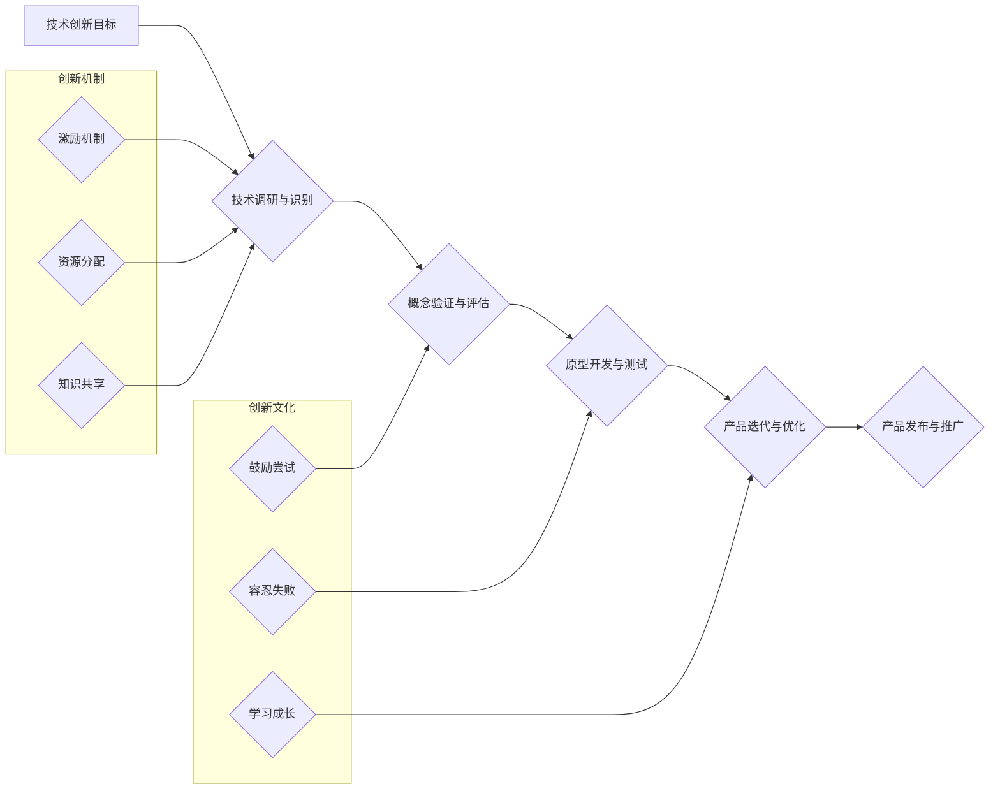

> AI创业公司,技术创新,创新管理体系,创新机制,创新流程,创新文化,技术驱动,敏捷开发,数据驱动

## 1. 背景介绍

在当今科技飞速发展的时代，人工智能（AI）正以惊人的速度改变着世界。AI创业公司应运而生，涌现出许多颠覆传统行业的创新产品和服务。然而，AI技术的复杂性和快速迭代也给AI创业公司的技术创新管理带来了新的挑战。如何建立一个高效、灵活、持续创新的技术创新管理体系，是AI创业公司能否取得成功的重要关键。

传统的创新管理体系往往侧重于产品和市场，而AI创业公司需要更加注重技术驱动的创新。技术创新是AI创业公司核心竞争力的源泉，也是其持续发展的保障。因此，建立一个以技术创新为核心的管理体系，是AI创业公司实现可持续发展的必要条件。

## 2. 核心概念与联系

**2.1 核心概念**

* **技术创新:** 指利用新技术、新方法、新工艺等手段，创造出具有新功能、新性能、新价值的产品、服务或商业模式。
* **创新机制:** 指企业内部建立的鼓励、引导和支持技术创新的制度、流程和文化。
* **创新流程:** 指从技术识别到产品发布的全过程，包括技术调研、概念验证、原型开发、测试验证、产品迭代等环节。
* **创新文化:** 指企业内部倡导创新、鼓励尝试、容忍失败的价值观和氛围。

**2.2 核心概念联系**

创新机制、创新流程和创新文化相互关联，共同构成了AI创业公司的技术创新管理体系。

* **创新机制**为创新流程提供制度保障，明确创新目标、分配资源、激励创新人员。
* **创新流程**是技术创新的具体执行路径，通过一系列步骤将创新理念转化为现实产品。
* **创新文化**是创新机制和创新流程的基础，营造积极向上的创新氛围，激发员工的创新热情。

**2.3 创新管理体系架构**



## 3. 核心算法原理 & 具体操作步骤

**3.1 算法原理概述**

深度学习算法是AI技术的重要组成部分，其核心原理是利用多层神经网络模拟人类大脑的学习过程。通过大量的训练数据，深度学习模型可以自动学习特征，并进行预测、分类、识别等任务。

**3.2 算法步骤详解**

1. **数据预处理:** 收集和清洗数据，将其转换为深度学习模型可以理解的格式。
2. **网络结构设计:** 根据任务需求设计神经网络的层数、节点数、激活函数等参数。
3. **模型训练:** 利用训练数据训练神经网络模型，调整模型参数，使其能够准确地完成任务。
4. **模型评估:** 使用测试数据评估模型的性能，并进行调整和优化。
5. **模型部署:** 将训练好的模型部署到实际应用场景中，进行预测、分类、识别等任务。

**3.3 算法优缺点**

* **优点:** 
    * 表现力强，能够学习到复杂的特征关系。
    * 自动学习，无需人工特征工程。
    * 泛化能力强，能够应用于多种任务。
* **缺点:** 
    * 数据需求量大，需要大量的训练数据。
    * 计算资源消耗大，训练时间长。
    * 可解释性差，难以理解模型的决策过程。

**3.4 算法应用领域**

深度学习算法广泛应用于图像识别、自然语言处理、语音识别、机器翻译、推荐系统等领域。

## 4. 数学模型和公式 & 详细讲解 & 举例说明

**4.1 数学模型构建**

深度学习模型通常采用多层感知机（MLP）或卷积神经网络（CNN）等结构。

* **多层感知机（MLP）:** 由多个全连接层组成，每个层的神经元都与上一层的每个神经元连接。

* **卷积神经网络（CNN）:** 利用卷积层和池化层提取图像特征，能够有效地学习图像的局部和全局特征。

**4.2 公式推导过程**

深度学习模型的训练过程基于梯度下降算法，其核心公式为：

$$
\theta = \theta - \alpha \nabla L(\theta)
$$

其中：

* $\theta$：模型参数
* $\alpha$：学习率
* $\nabla L(\theta)$：损失函数对模型参数的梯度

**4.3 案例分析与讲解**

以图像分类为例，假设我们使用CNN模型进行训练，目标是将图像分类为猫或狗。

* 损失函数：交叉熵损失函数

* 梯度下降算法：随机梯度下降（SGD）

训练过程中，模型会不断调整参数，使得预测结果与真实标签之间的差异最小化。

## 5. 项目实践：代码实例和详细解释说明

**5.1 开发环境搭建**

使用Python语言和深度学习框架TensorFlow或PyTorch进行开发。

**5.2 源代码详细实现**

```python
import tensorflow as tf

# 定义模型结构
model = tf.keras.models.Sequential([
    tf.keras.layers.Conv2D(32, (3, 3), activation='relu', input_shape=(28, 28, 1)),
    tf.keras.layers.MaxPooling2D((2, 2)),
    tf.keras.layers.Conv2D(64, (3, 3), activation='relu'),
    tf.keras.layers.MaxPooling2D((2, 2)),
    tf.keras.layers.Flatten(),
    tf.keras.layers.Dense(10, activation='softmax')
])

# 编译模型
model.compile(optimizer='adam',
              loss='sparse_categorical_crossentropy',
              metrics=['accuracy'])

# 训练模型
model.fit(x_train, y_train, epochs=10)

# 评估模型
loss, accuracy = model.evaluate(x_test, y_test)
print('Test loss:', loss)
print('Test accuracy:', accuracy)
```

**5.3 代码解读与分析**

* 代码定义了一个简单的CNN模型，用于图像分类任务。
* 模型包含卷积层、池化层和全连接层。
* 使用Adam优化器和交叉熵损失函数进行训练。
* 训练完成后，使用测试数据评估模型的性能。

**5.4 运行结果展示**

训练完成后，模型的准确率会随着训练轮数的增加而提高。

## 6. 实际应用场景

**6.1 图像识别**

* 自动驾驶汽车：识别道路标志、行人、车辆等。
* 医疗诊断：识别病灶、肿瘤等。
* 物体检测：识别商品、人员等。

**6.2 自然语言处理**

* 机器翻译：将文本从一种语言翻译成另一种语言。
* 文本摘要：自动生成文本的摘要。
* 情感分析：分析文本的情感倾向。

**6.3 语音识别**

* 语音助手：识别用户的语音指令。
* 语音搜索：识别用户的语音搜索内容。
* 语音转文本：将语音转换为文本。

**6.4 未来应用展望**

* 人机交互：更自然、更智能的人机交互方式。
* 个性化服务：根据用户的需求提供个性化的产品和服务。
* 科学研究：加速科学研究的进程。

## 7. 工具和资源推荐

**7.1 学习资源推荐**

* **书籍:**
    * 深度学习
    * 人工智能：一种现代方法
* **在线课程:**
    * Coursera深度学习课程
    * Udacity人工智能工程师课程

**7.2 开发工具推荐**

* **深度学习框架:** TensorFlow, PyTorch, Keras
* **编程语言:** Python
* **云计算平台:** AWS, Azure, GCP

**7.3 相关论文推荐**

* ImageNet Classification with Deep Convolutional Neural Networks
* Attention Is All You Need

## 8. 总结：未来发展趋势与挑战

**8.1 研究成果总结**

近年来，AI技术取得了长足的进步，深度学习算法在图像识别、自然语言处理等领域取得了突破性进展。

**8.2 未来发展趋势**

* **模型规模化:** 模型参数规模不断扩大，模型能力不断提升。
* **算法多样化:** 除了深度学习，其他算法如强化学习、图神经网络等也将在AI领域发挥重要作用。
* **边缘计算:** 将AI模型部署到边缘设备，实现更低延迟、更高效率的计算。

**8.3 面临的挑战**

* **数据安全:** AI模型训练需要大量数据，如何保证数据安全和隐私保护是一个重要挑战。
* **算法可解释性:** 深度学习模型的决策过程难以理解，如何提高算法的可解释性是一个关键问题。
* **伦理问题:** AI技术的发展引发了伦理问题，例如算法偏见、人工智能的责任等，需要认真思考和解决。

**8.4 研究展望**

未来，AI技术将继续发展，并应用于更多领域。我们需要不断探索新的算法、新的模型，并解决AI技术带来的挑战，推动AI技术向更安全、更可解释、更可持续的方向发展。

## 9. 附录：常见问题与解答

**9.1 如何选择合适的深度学习框架？**

选择深度学习框架需要根据具体项目需求和个人经验进行判断。TensorFlow和PyTorch是目前最流行的深度学习框架，各有优缺点。

**9.2 如何解决深度学习模型的过拟合问题？**

过拟合是指模型在训练数据上表现很好，但在测试数据上表现较差。解决过拟合问题的方法包括：

* 增加训练数据量
* 使用正则化技术
* 使用Dropout技术
* 使用早停策略

**9.3 如何评估深度学习模型的性能？**

常用的评估指标包括准确率、召回率、F1-score等。选择合适的评估指标需要根据具体任务需求进行判断。


作者：禅与计算机程序设计艺术 / Zen and the Art of Computer Programming 
<end_of_turn>