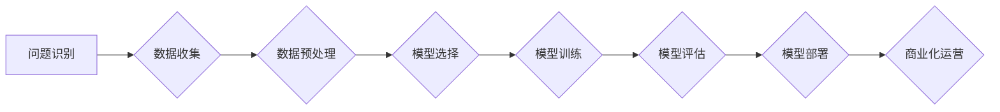

>  人工智能、创业、技术转化、商业模式、利润、机器学习、深度学习、自然语言处理、计算机视觉

## 1. 背景介绍

人工智能（AI）正以惊人的速度发展，其技术突破正在深刻地改变着我们生活的方方面面。从自动驾驶汽车到智能语音助手，从医疗诊断到金融风险评估，AI的应用场景日益广泛。与此同时，AI技术也为创业者带来了前所未有的机遇。

然而，将AI技术转化为商业利润并非易事。许多AI创业公司在技术研发阶段取得了突破，但在商业化落地时却遭遇了重重困难。这主要是因为：

* **技术壁垒高：**AI技术本身具有很高的门槛，需要专业的知识和经验才能掌握。
* **数据依赖性强：**AI算法的训练和优化需要海量的数据支持，而获取高质量的数据往往是一项巨大的挑战。
* **商业模式创新：**传统的商业模式难以直接应用于AI领域，需要探索新的商业模式来实现盈利。
* **人才短缺：**AI人才市场供不应求，吸引和留住优秀人才成为创业公司的难题。

## 2. 核心概念与联系

AI创业的核心概念包括：

* **机器学习（Machine Learning）：**让计算机从数据中学习，无需明确编程，自动发现模式和规律。
* **深度学习（Deep Learning）：**一种更高级的机器学习方法，利用多层神经网络模拟人类大脑的学习过程。
* **自然语言处理（Natural Language Processing）：**让计算机理解和处理人类语言，例如文本分析、机器翻译、语音识别等。
* **计算机视觉（Computer Vision）：**让计算机“看”世界，例如图像识别、物体检测、视频分析等。

这些核心概念相互关联，共同构成了AI创业的基础。

**AI创业流程图**



## 3. 核心算法原理 & 具体操作步骤

### 3.1  算法原理概述

机器学习算法的核心原理是通过学习数据中的模式和规律，建立一个数学模型，用于预测未来结果或分类数据。常见的机器学习算法包括：

* **线性回归：**用于预测连续数值，假设数据之间存在线性关系。
* **逻辑回归：**用于分类问题，预测数据属于某个类别或不属于某个类别。
* **决策树：**通过一系列的决策规则，将数据分类或预测结果。
* **支持向量机：**寻找最佳的分隔超平面，将数据分类。
* **k近邻：**根据数据点与其他数据点的距离，预测数据点属于哪个类别。

### 3.2  算法步骤详解

以线性回归为例，其具体操作步骤如下：

1. **数据收集和预处理：**收集相关数据，并进行清洗、转换、特征工程等预处理操作。
2. **模型选择：**选择合适的机器学习算法，例如线性回归。
3. **模型训练：**使用训练数据训练模型，调整模型参数，使模型能够准确预测结果。
4. **模型评估：**使用测试数据评估模型的性能，例如计算准确率、召回率、F1-score等指标。
5. **模型部署：**将训练好的模型部署到生产环境中，用于预测新的数据。

### 3.3  算法优缺点

每个机器学习算法都有其自身的优缺点，需要根据具体应用场景选择合适的算法。

例如，线性回归算法简单易懂，训练速度快，但对数据线性关系的假设比较严格。决策树算法可以处理非线性关系，但容易过拟合。支持向量机算法可以处理高维数据，但训练时间较长。

### 3.4  算法应用领域

机器学习算法广泛应用于各个领域，例如：

* **电商推荐：**根据用户的购买历史和浏览记录，推荐相关的商品。
* **金融风险评估：**预测客户的信用风险，帮助银行和金融机构进行贷款审批。
* **医疗诊断：**辅助医生诊断疾病，例如识别肿瘤、预测患者的病情发展。
* **自然语言处理：**实现机器翻译、文本摘要、情感分析等功能。

## 4. 数学模型和公式 & 详细讲解 & 举例说明

### 4.1  数学模型构建

线性回归模型的数学模型如下：

$$
y = w_0 + w_1x_1 + w_2x_2 + ... + w_nx_n + \epsilon
$$

其中：

* $y$ 是预测结果
* $w_0, w_1, w_2, ..., w_n$ 是模型参数
* $x_1, x_2, ..., x_n$ 是输入特征
* $\epsilon$ 是误差项

### 4.2  公式推导过程

模型参数的学习过程是通过最小化误差函数来实现的。常用的误差函数是均方误差（MSE）：

$$
MSE = \frac{1}{n} \sum_{i=1}^{n} (y_i - \hat{y}_i)^2
$$

其中：

* $n$ 是样本数量
* $y_i$ 是真实值
* $\hat{y}_i$ 是预测值

通过梯度下降算法，可以迭代更新模型参数，使MSE最小化。

### 4.3  案例分析与讲解

假设我们想要预测房屋价格，输入特征包括房屋面积、房间数量、地理位置等。我们可以使用线性回归模型，训练模型并得到模型参数。然后，对于新的房屋，我们可以输入其特征值，通过模型预测其价格。

## 5. 项目实践：代码实例和详细解释说明

### 5.1  开发环境搭建

* Python 3.x
* scikit-learn 机器学习库
* NumPy 数值计算库
* Pandas 数据处理库

### 5.2  源代码详细实现

```python
import pandas as pd
from sklearn.linear_model import LinearRegression
from sklearn.model_selection import train_test_split

# 加载数据
data = pd.read_csv('house_price.csv')

# 选择特征和目标变量
X = data[['area', 'rooms', 'location']]
y = data['price']

# 将数据分为训练集和测试集
X_train, X_test, y_train, y_test = train_test_split(X, y, test_size=0.2, random_state=42)

# 创建线性回归模型
model = LinearRegression()

# 训练模型
model.fit(X_train, y_train)

# 预测测试集结果
y_pred = model.predict(X_test)

# 评估模型性能
from sklearn.metrics import mean_squared_error
mse = mean_squared_error(y_test, y_pred)
print(f'Mean Squared Error: {mse}')
```

### 5.3  代码解读与分析

* 首先，我们加载数据并选择特征和目标变量。
* 然后，我们将数据分为训练集和测试集，用于训练和评估模型。
* 创建线性回归模型并使用训练数据进行训练。
* 训练完成后，我们可以使用模型预测测试集结果。
* 最后，我们使用均方误差（MSE）来评估模型的性能。

### 5.4  运行结果展示

运行代码后，会输出测试集的均方误差值。MSE越小，模型的预测精度越高。

## 6. 实际应用场景

AI创业的应用场景非常广泛，例如：

* **智能客服：**利用自然语言处理技术，开发智能客服机器人，自动回答客户常见问题，提高客户服务效率。
* **个性化推荐：**根据用户的行为数据，推荐个性化的商品、服务或内容，提升用户体验和转化率。
* **精准营销：**利用机器学习算法，分析用户数据，精准定位目标客户，提高营销效果。
* **自动驾驶：**利用计算机视觉和深度学习技术，开发自动驾驶系统，提高交通安全和效率。

### 6.4  未来应用展望

随着AI技术的不断发展，未来AI创业将有更广阔的应用前景，例如：

* **医疗诊断和治疗：**AI将帮助医生更准确地诊断疾病，制定个性化的治疗方案。
* **教育领域：**AI将个性化学习体验，提高教育效率。
* **金融科技：**AI将帮助金融机构进行风险管理、欺诈检测和投资决策。

## 7. 工具和资源推荐

### 7.1  学习资源推荐

* **在线课程：**Coursera、edX、Udacity等平台提供丰富的AI课程。
* **书籍：**《深度学习》、《机器学习实战》等书籍是AI学习的经典教材。
* **开源项目：**TensorFlow、PyTorch等开源项目提供了丰富的AI工具和资源。

### 7.2  开发工具推荐

* **Python：**AI开发的常用编程语言。
* **Jupyter Notebook：**交互式编程环境，方便AI开发和调试。
* **TensorFlow、PyTorch：**深度学习框架，用于构建和训练深度学习模型。

### 7.3  相关论文推荐

* **《ImageNet Classification with Deep Convolutional Neural Networks》**
* **《Attention Is All You Need》**
* **《BERT: Pre-training of Deep Bidirectional Transformers for Language Understanding》**

## 8. 总结：未来发展趋势与挑战

### 8.1  研究成果总结

AI创业取得了显著的成果，在各个领域都产生了深远的影响。

### 8.2  未来发展趋势

未来AI创业将朝着以下趋势发展：

* **更强大的算法：**新的AI算法将不断涌现，提高模型的性能和效率。
* **更广泛的应用场景：**AI将应用于更多领域，解决更多实际问题。
* **更智能的交互方式：**AI将与人类进行更自然、更智能的交互。

### 8.3  面临的挑战

AI创业也面临着一些挑战：

* **数据安全和隐私保护：**AI算法依赖于大量数据，如何确保数据安全和隐私保护是一个重要问题。
* **算法可解释性和公平性：**一些AI算法的决策过程难以解释，如何保证算法的公平性和透明性是一个挑战。
* **人才短缺：**AI人才市场供不应求，吸引和留住优秀人才成为创业公司的难题。

### 8.4  研究展望

未来AI创业需要不断探索新的技术、新的应用场景和新的商业模式，以应对挑战，实现可持续发展。

## 9. 附录：常见问题与解答

* **Q：如何选择合适的AI算法？**
* **A：**选择合适的AI算法需要根据具体应用场景和数据特点进行分析。

* **Q：如何解决数据安全和隐私保护问题？**
* **A：**可以使用数据加密、匿名化等技术来保护数据安全和隐私。

* **Q：如何保证AI算法的公平性和透明性？**
* **A：**可以采用可解释AI技术，使算法的决策过程更加透明，并进行算法公平性评估。


作者：禅与计算机程序设计艺术 / Zen and the Art of Computer Programming 
<end_of_turn>