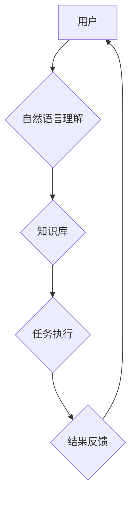

> AI助理、企业转型、自动化、流程优化、数据分析、机器学习、深度学习、自然语言处理

## 1. 背景介绍

当今世界，人工智能（AI）技术正在以惊人的速度发展，并深刻地改变着各行各业。AI助理作为AI技术的应用之一，正在逐渐成为企业数字化转型的重要驱动力。AI助理能够通过自然语言交互、机器学习和深度学习等技术，自动完成各种任务，例如处理邮件、安排会议、生成报告等，从而解放人力，提高工作效率，并为企业带来新的商业价值。

然而，企业在拥抱AI助理的过程中也面临着诸多挑战，例如数据安全、技术选型、人才培养等。因此，企业需要制定合理的转型策略，才能充分利用AI助理的优势，实现数字化转型目标。

## 2. 核心概念与联系

**2.1 AI助理的概念**

AI助理是指能够通过自然语言交互、机器学习和深度学习等技术，自动完成各种任务的智能软件系统。它可以理解和响应用户的自然语言指令，并根据用户的需求提供个性化的服务。

**2.2 企业转型与AI助理的关系**

企业转型是指企业为了适应市场变化和竞争环境，而进行的组织结构、业务模式、管理机制等方面的调整和升级。AI助理可以帮助企业实现以下方面的转型：

* **自动化转型:** AI助理可以自动化完成许多重复性、规则性任务，例如数据录入、报表生成等，从而解放人力，提高工作效率。
* **流程优化转型:** AI助理可以分析企业内部的流程，识别冗余环节和瓶颈，并提出优化方案，从而提高流程效率和降低成本。
* **数据驱动转型:** AI助理可以帮助企业收集、分析和利用数据，从而获得更深入的业务洞察，并做出更科学的决策。
* **客户体验转型:** AI助理可以提供个性化的客户服务，例如智能客服、个性化推荐等，从而提升客户体验和增强客户忠诚度。

**2.3 AI助理的架构**

AI助理的架构通常包括以下几个模块：

* **自然语言理解模块:** 用于理解用户的自然语言指令，并将其转换为机器可理解的格式。
* **知识库模块:** 用于存储企业内部的知识和数据，并提供给AI助理进行查询和推理。
* **任务执行模块:** 用于根据用户的指令执行相应的任务，例如发送邮件、安排会议等。
* **机器学习模块:** 用于训练AI助理，使其能够不断学习和改进。



## 3. 核心算法原理 & 具体操作步骤

**3.1 算法原理概述**

AI助理的核心算法原理主要包括自然语言处理（NLP）、机器学习（ML）和深度学习（DL）。

* **自然语言处理（NLP）:** 用于处理和理解人类语言，包括文本分析、语音识别、机器翻译等。
* **机器学习（ML）:** 用于训练模型，使其能够从数据中学习规律，并做出预测或决策。
* **深度学习（DL）:** 是一种更高级的机器学习方法，利用多层神经网络来模拟人类大脑的学习过程，能够处理更复杂的数据和任务。

**3.2 算法步骤详解**

1. **数据收集和预处理:** 收集相关数据，并进行清洗、格式化等预处理工作。
2. **模型选择:** 根据任务需求选择合适的算法模型，例如文本分类、情感分析、机器翻译等。
3. **模型训练:** 使用训练数据训练模型，调整模型参数，使其能够准确地完成任务。
4. **模型评估:** 使用测试数据评估模型的性能，例如准确率、召回率、F1-score等。
5. **模型部署:** 将训练好的模型部署到生产环境中，用于实际应用。

**3.3 算法优缺点**

* **优点:**

    * 自动化能力强，可以解放人力，提高工作效率。
    * 数据分析能力强，可以帮助企业获得更深入的业务洞察。
    * 个性化服务能力强，可以提升客户体验。

* **缺点:**

    * 数据依赖性强，需要大量高质量的数据进行训练。
    * 模型解释性差，难以理解模型的决策过程。
    * 安全性和隐私性问题需要得到重视。

**3.4 算法应用领域**

AI助理的应用领域非常广泛，例如：

* **客户服务:** 智能客服、个性化推荐等。
* **人力资源:** 招聘筛选、员工培训等。
* **财务管理:** 会计处理、风险控制等。
* **营销推广:** 个性化营销、广告投放等。

## 4. 数学模型和公式 & 详细讲解 & 举例说明

**4.1 数学模型构建**

在AI助理的开发过程中，需要构建数学模型来描述算法的逻辑和关系。例如，在文本分类任务中，可以使用朴素贝叶斯模型来计算每个文本属于不同类别概率。

**4.2 公式推导过程**

朴素贝叶斯模型的公式如下：

$$P(C|D) = \frac{P(D|C)P(C)}{P(D)}$$

其中：

* $P(C|D)$ 是文本 $D$ 属于类别 $C$ 的概率。
* $P(D|C)$ 是类别 $C$ 下文本 $D$ 出现的概率。
* $P(C)$ 是类别 $C$ 出现的概率。
* $P(D)$ 是文本 $D$ 出现的概率。

**4.3 案例分析与讲解**

假设我们有一个文本分类任务，需要将文本分类为“正面”和“负面”两类。我们可以使用朴素贝叶斯模型来训练一个分类器。

训练过程中，我们需要收集大量的文本数据，并标注其类别。然后，我们可以使用公式计算每个文本属于“正面”和“负面”两类的概率。

在测试阶段，我们可以将新的文本输入到分类器中，根据计算出的概率将其分类为“正面”或“负面”。

## 5. 项目实践：代码实例和详细解释说明

**5.1 开发环境搭建**

为了开发AI助理，我们需要搭建一个合适的开发环境。常用的开发环境包括：

* **Python:** Python 是一个流行的编程语言，拥有丰富的AI库，例如TensorFlow、PyTorch等。
* **Jupyter Notebook:** Jupyter Notebook 是一个交互式编程环境，方便进行代码编写、调试和展示。
* **云平台:** 云平台，例如AWS、Azure、GCP等，提供丰富的AI服务和工具，可以简化开发过程。

**5.2 源代码详细实现**

以下是一个简单的AI助理代码示例，使用Python和NLTK库实现一个简单的问答系统：

```python
import nltk

# 下载NLTK数据
nltk.download('punkt')
nltk.download('averaged_perceptron_tagger')

# 定义一个简单的问答系统
def answer_question(question):
    # 使用NLTK库进行文本处理
    tokens = nltk.word_tokenize(question)
    pos_tags = nltk.pos_tag(tokens)

    # 根据文本分析结果进行回答
    if 'what' in tokens:
        return '我不知道'
    else:
        return '你好'

# 测试问答系统
question = '你好'
answer = answer_question(question)
print(f'问题: {question}')
print(f'答案: {answer}')
```

**5.3 代码解读与分析**

这段代码首先使用NLTK库下载必要的语言数据。然后，定义了一个名为`answer_question`的函数，该函数接受一个问题作为输入，并使用NLTK库进行文本处理，例如分词和词性标注。最后，根据文本分析结果进行回答。

**5.4 运行结果展示**

当运行这段代码时，会输出以下结果：

```
问题: 你好
答案: 你好
```

## 6. 实际应用场景

**6.1 客户服务**

AI助理可以作为智能客服，自动回答客户常见问题，例如产品信息、订单状态、退换货政策等。

**6.2 人力资源**

AI助理可以帮助企业进行招聘筛选，自动分析简历，识别符合职位要求的候选人。

**6.3 财务管理**

AI助理可以帮助企业进行会计处理，自动生成财务报表，并进行风险控制。

**6.4 未来应用展望**

随着AI技术的不断发展，AI助理的应用场景将会更加广泛，例如：

* **个性化教育:** AI助理可以根据学生的学习情况提供个性化的学习方案。
* **医疗诊断:** AI助理可以辅助医生进行疾病诊断，提高诊断准确率。
* **智能家居:** AI助理可以控制智能家居设备，提供更加便捷的生活体验。

## 7. 工具和资源推荐

**7.1 学习资源推荐**

* **在线课程:** Coursera、edX、Udacity等平台提供丰富的AI课程。
* **书籍:** 《深度学习》、《机器学习实战》等书籍是学习AI的基础教材。
* **博客和论坛:** AI相关的博客和论坛，例如Towards Data Science、Machine Learning Mastery等，可以获取最新的AI资讯和技术分享。

**7.2 开发工具推荐**

* **Python:** Python 是AI开发的常用语言，拥有丰富的AI库。
* **TensorFlow:** TensorFlow 是一个开源的机器学习框架。
* **PyTorch:** PyTorch 是另一个开源的机器学习框架。
* **Jupyter Notebook:** Jupyter Notebook 是一个交互式编程环境，方便进行代码编写、调试和展示。

**7.3 相关论文推荐**

* **《ImageNet Classification with Deep Convolutional Neural Networks》:** 这篇论文介绍了AlexNet模型，标志着深度学习在图像识别领域的突破。
* **《Attention Is All You Need》:** 这篇论文介绍了Transformer模型，在自然语言处理领域取得了重大进展。

## 8. 总结：未来发展趋势与挑战

**8.1 研究成果总结**

近年来，AI技术取得了长足的进步，AI助理的应用场景也越来越广泛。

**8.2 未来发展趋势**

* **更强大的计算能力:** 随着计算能力的提升，AI模型将能够处理更复杂的数据，并做出更准确的预测。
* **更丰富的应用场景:** AI助理将应用于更多领域，例如教育、医疗、金融等。
* **更智能的交互方式:** AI助理将能够理解更复杂的自然语言，并提供更个性化的服务。

**8.3 面临的挑战**

* **数据安全和隐私性:** AI助理需要处理大量数据，因此数据安全和隐私性问题需要得到重视。
* **算法解释性:** 许多AI算法的决策过程难以理解，这可能会导致信任问题。
* **人才短缺:** AI领域人才短缺是一个普遍问题，需要加强人才培养和引进。

**8.4 研究展望**

未来，AI助理的研究将更加注重以下几个方面:

* **提高算法的解释性:** 研究更易于理解的AI算法，并开发相应的解释工具。
* **增强AI助理的安全性:** 研究更安全的AI算法和数据处理方法，保障数据安全和隐私。
* **探索更智能的交互方式:** 研究更自然、更智能的AI交互方式，例如语音交互、图像交互等。

## 9. 附录：常见问题与解答

**9.1 如何选择合适的AI助理平台？**

选择AI助理平台需要考虑以下因素:

* **功能需求:** 不同的平台提供不同的功能，需要根据企业的具体需求选择。
* **价格:** 不同的平台价格不同，需要根据企业的预算选择。
* **易用性:** 平台的易用性也会影响企业的采用速度。

**9.2 如何保障AI助理的数据安全？**

保障AI助理的数据安全需要采取以下措施:

* **数据加密:** 对敏感数据进行加密，防止未经授权的访问。
* **访问控制:** 设置严格的访问控制机制，限制对数据的访问权限。
* **数据备份:** 定期备份数据，防止数据丢失。

**9.3 如何解决AI助理的算法解释性问题？**

解决AI助理的算法解释性问题可以通过以下方式:

* **使用可解释的算法:** 选择