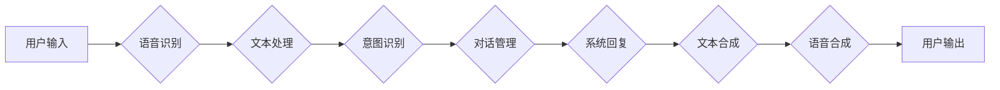

> 虚拟助手、人工智能、自然语言处理、机器学习、对话系统、语音识别、智能家居

## 1. 背景介绍

在当今科技飞速发展的时代，人工智能（AI）已经渗透到我们生活的方方面面。其中，虚拟助手作为AI技术的典型应用之一，凭借其便捷、高效、智能的特点，迅速成为人们日常生活不可或缺的一部分。从智能手机的语音助手到智能家居的控制中心，虚拟助手正在改变着我们的生活方式，提高着我们的日常效率。

虚拟助手本质上是一个能够理解和响应人类语言的软件系统。它通过自然语言处理（NLP）、语音识别、机器学习等技术，能够理解用户的意图，并提供相应的服务和帮助。例如，我们可以通过语音或文本向虚拟助手提问天气预报、设置闹钟、发送邮件、播放音乐等，虚拟助手都能快速准确地完成我们的指令。

## 2. 核心概念与联系

### 2.1 自然语言处理（NLP）

NLP是人工智能领域的一个重要分支，致力于使计算机能够理解、处理和生成人类语言。它涉及到许多复杂的语言学和计算机科学问题，例如词法分析、语法分析、语义分析、文本分类等。

### 2.2 语音识别

语音识别技术是指将语音信号转换为文本的过程。它需要对语音信号进行分析和识别，并将其映射到相应的文字。语音识别技术的发展离不开机器学习和深度学习的进步，近年来，语音识别技术的准确率和效率有了显著提升。

### 2.3 机器学习

机器学习是人工智能领域的核心技术之一，它使计算机能够从数据中学习，并根据学习到的知识进行预测或决策。在虚拟助手中，机器学习被广泛应用于用户意图识别、对话管理、个性化推荐等方面。

### 2.4 对话系统

对话系统是虚拟助手的重要组成部分，它负责与用户进行交互，理解用户的意图，并提供相应的回复。对话系统通常采用基于规则或基于机器学习的方法，可以是单轮对话，也可以是多轮对话。

**核心概念与联系流程图**



## 3. 核心算法原理 & 具体操作步骤

### 3.1 算法原理概述

虚拟助手的核心算法原理主要包括：语音识别、自然语言理解、对话管理和文本生成。

* **语音识别:** 利用深度学习模型，将语音信号转换为文本。
* **自然语言理解:** 利用词法分析、语法分析和语义分析等技术，理解用户的意图和需求。
* **对话管理:** 根据用户的意图，选择合适的回复，并引导对话的进行。
* **文本生成:** 利用自然语言生成模型，生成自然流畅的文本回复。

### 3.2 算法步骤详解

**语音识别步骤:**

1. **音频预处理:** 对语音信号进行降噪、增益调整等处理，提高识别精度。
2. **特征提取:** 从语音信号中提取特征，例如梅尔频率倒谱系数（MFCC）。
3. **模型训练:** 利用深度学习模型，例如循环神经网络（RNN）或卷积神经网络（CNN），训练语音识别模型。
4. **语音识别:** 将语音信号输入训练好的模型，得到文本输出。

**自然语言理解步骤:**

1. **词法分析:** 将文本分割成单词或词组。
2. **语法分析:** 分析文本的语法结构，构建语法树。
3. **语义分析:** 理解文本的含义，识别实体、关系和事件。
4. **意图识别:** 识别用户的意图，例如查询天气、设置闹钟等。

**对话管理步骤:**

1. **状态跟踪:** 记录对话的历史信息，了解对话上下文。
2. **意图匹配:** 将用户的意图与预定义的意图进行匹配。
3. **回复生成:** 根据用户的意图和对话上下文，选择合适的回复。
4. **对话引导:** 引导对话的进行，确保对话流畅自然。

**文本生成步骤:**

1. **编码:** 将文本转换为向量表示。
2. **解码:** 利用生成模型，例如Transformer，从向量表示中生成文本。
3. **文本后处理:** 对生成的文本进行语法检查、拼写检查等处理，提高文本质量。

### 3.3 算法优缺点

**优点:**

* **提高效率:** 自动化重复性任务，节省时间和精力。
* **个性化体验:** 根据用户的习惯和偏好，提供个性化的服务。
* **便捷性:** 通过语音或文本交互，更加方便快捷。

**缺点:**

* **理解能力有限:** 对于复杂或模糊的语言，理解能力可能不足。
* **缺乏情感理解:** 无法完全理解用户的感情和意图。
* **数据安全问题:** 用户数据可能存在泄露风险。

### 3.4 算法应用领域

虚拟助手技术广泛应用于以下领域：

* **智能手机:** 语音助手、短信助手、日程管理助手等。
* **智能家居:** 控制灯光、空调、电视等智能设备。
* **企业服务:** 客户服务、预约管理、会议安排等。
* **教育:** 在线辅导、知识问答、学习资源推荐等。
* **医疗:** 病人咨询、预约挂号、健康管理等。

## 4. 数学模型和公式 & 详细讲解 & 举例说明

### 4.1 数学模型构建

在虚拟助手中，常用的数学模型包括：

* **词嵌入模型:** 将单词映射到向量空间，捕捉单词之间的语义关系。例如Word2Vec和GloVe模型。
* **循环神经网络（RNN）:** 用于处理序列数据，例如语音识别和文本生成。
* **Transformer:** 是一种新型的深度学习模型，具有强大的文本理解和生成能力。

### 4.2 公式推导过程

**词嵌入模型的损失函数:**

$$
L = \sum_{i=1}^{N} \sum_{j=1}^{M} \log(P(w_j | w_i))
$$

其中：

* $N$ 是训练语料库中单词的数量。
* $M$ 是词嵌入向量的维度。
* $w_i$ 是训练语料库中的一个单词。
* $w_j$ 是与 $w_i$ 相关的单词。
* $P(w_j | w_i)$ 是给定 $w_i$ 的条件下，$w_j$ 出现的概率。

**RNN的输出层激活函数:**

$$
y_t = \sigma(W_y h_t + b_y)
$$

其中：

* $y_t$ 是时间步 $t$ 的输出。
* $h_t$ 是时间步 $t$ 的隐藏状态。
* $W_y$ 是输出层的权重矩阵。
* $b_y$ 是输出层的偏置向量。
* $\sigma$ 是激活函数，例如sigmoid函数或softmax函数。

### 4.3 案例分析与讲解

**词嵌入模型的应用:**

Word2Vec模型可以将单词映射到向量空间，例如“国王”和“皇后”之间的向量距离较近，因为它们在语义上相关。

**RNN的应用:**

RNN可以用于语音识别，将语音信号转换为文本。例如，RNN可以学习语音信号中不同音素的特征，并将其映射到相应的字母或单词。

## 5. 项目实践：代码实例和详细解释说明

### 5.1 开发环境搭建

虚拟助手开发环境通常包括：

* **操作系统:** Linux、macOS或Windows。
* **编程语言:** Python、Java或C++。
* **深度学习框架:** TensorFlow、PyTorch或Keras。
* **语音识别库:** Kaldi、SpeechRecognition或Vosk。
* **自然语言处理库:** NLTK、spaCy或HuggingFace Transformers。

### 5.2 源代码详细实现

以下是一个简单的Python代码示例，演示了如何使用语音识别和文本生成技术构建一个简单的虚拟助手：

```python
import speech_recognition as sr
import pyttsx3

# 初始化语音识别器
r = sr.Recognizer()

# 初始化文本合成器
engine = pyttsx3.init()

def recognize_speech():
    with sr.Microphone() as source:
        print("请说话:")
        audio = r.listen(source)
    try:
        text = r.recognize_google(audio)
        print("您说的是:", text)
        return text
    except sr.UnknownValueError:
        print("无法识别语音")
        return None

def speak(text):
    engine.say(text)
    engine.runAndWait()

if __name__ == "__main__":
    while True:
        text = recognize_speech()
        if text:
            if "你好" in text:
                speak("你好！有什么可以帮你的吗？")
            elif "再见" in text:
                speak("再见！")
                break
            else:
                speak("对不起，我不明白你的意思。")
```

### 5.3 代码解读与分析

* **语音识别:** 使用`speech_recognition`库进行语音识别，并使用Google语音识别服务进行识别。
* **文本合成:** 使用`pyttsx3`库进行文本合成，将文本转换为语音。
* **对话管理:** 通过简单的关键词匹配，实现基本的对话管理。

### 5.4 运行结果展示

当运行该代码时，虚拟助手会等待用户输入语音指令。用户可以输入“你好”来启动对话，输入“再见”来结束对话，输入其他内容则会得到“对不起，我不明白你的意思”的回复。

## 6. 实际应用场景

### 6.1 智能家居控制

虚拟助手可以控制智能家居设备，例如灯光、空调、电视等，用户可以通过语音指令控制这些设备，实现智能家居的自动化控制。

### 6.2 个人助理

虚拟助手可以作为用户的个人助理，帮助用户管理日程安排、发送邮件、设置提醒等，提高用户的效率和生活质量。

### 6.3 娱乐休闲

虚拟助手可以提供娱乐休闲服务，例如播放音乐、讲故事、玩游戏等，丰富用户的日常生活。

### 6.4 未来应用展望

随着人工智能技术的不断发展，虚拟助手将拥有更强大的功能和更智能的交互体验。未来，虚拟助手将更加深入地融入我们的生活，成为我们不可或缺的一部分。

## 7. 工具和资源推荐

### 7.1 学习资源推荐

* **书籍:**
    * 《深度学习》
    * 《自然语言处理》
    * 《人工智能：一种现代方法》
* **在线课程:**
    * Coursera
    * edX
    * Udacity

### 7.2 开发工具推荐

* **深度学习框架:** TensorFlow、PyTorch、Keras
* **语音识别库:** Kaldi、SpeechRecognition、Vosk
* **自然语言处理库:** NLTK、spaCy、HuggingFace Transformers

### 7.3 相关论文推荐

* **BERT:** Devlin et al. (2018)
* **GPT-3:** Brown et al. (2020)
* **Transformer:** Vaswani et al. (2017)

## 8. 总结：未来发展趋势与挑战

### 8.1 研究成果总结

近年来，虚拟助手技术取得了显著的进展，语音识别、自然语言理解、对话管理等方面的算法性能得到大幅提升。虚拟助手已经从简单的命令执行工具发展成为能够理解和响应复杂指令的智能助手，并开始应用于越来越多的领域。

### 8.2 未来发展趋势

* **更强大的理解能力:** 虚拟助手将能够理解更复杂和模糊的语言，更好地理解用户的意图和需求。
* **更个性化的体验:** 虚拟助手将根据用户的习惯和偏好，提供更加个性化的服务和体验。
* **更广泛的应用场景:** 虚拟助手将应用于更多领域，例如教育、医疗、金融等，为人们的生活和工作带来更多便利。

###