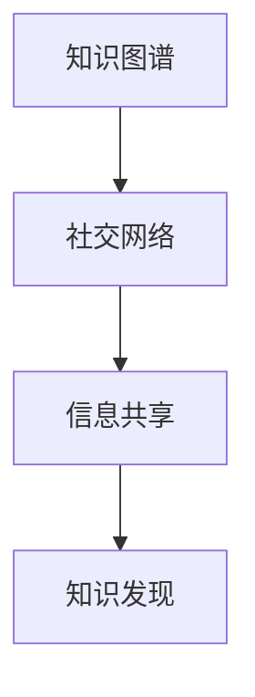

                 

# 知识的互联网效应：集体智慧的崛起

> 关键词：知识图谱, 社交网络, 信息共享, 大数据, 协同过滤, 用户行为分析, 推荐算法

## 1. 背景介绍

### 1.1 问题由来

在互联网时代，信息传播速度极快，数据量呈指数级增长。人类创造和积累的知识源源不断地汇入网络，形成了一个庞大的、相互连接的互联网效应场。知识的互联网效应不仅推动了信息技术的进步，更使得人类社会进入了集体智慧的新时代。

然而，面对海量信息的冲击，个体和组织如何高效获取、处理、利用这些知识，成为了一个亟需解决的问题。传统的信息检索、内容推荐等方法已经无法满足新的需求。

### 1.2 问题核心关键点

知识图谱的构建和大规模社交网络的分析，成为当前互联网知识处理的热点。知识图谱不仅整合了结构化数据，还捕捉了丰富的语义信息，为知识查询、推荐、推理等提供了有力支撑。而社交网络通过连接人与人之间的关系，揭示了信息传播和知识创新的社会机制。

本文章聚焦于知识图谱和社交网络的构建，以及在此基础上进行的信息共享和知识发现，探讨如何通过技术手段挖掘网络效应，实现集体智慧的崛起。

## 2. 核心概念与联系

### 2.1 核心概念概述

为更好地理解知识图谱和社交网络在互联网效应下的应用，本节将介绍几个密切相关的核心概念：

- **知识图谱(Knowledge Graphs)**：以图的形式表示实体之间的语义关系，由节点和边组成。常见的节点有实体(Entity)、属性(Attribute)、事件(Event)等，边则表示实体之间的关系(Relation)。知识图谱为知识检索、问答、推荐等应用提供了强大的语义支撑。

- **社交网络(Social Networks)**：由用户和用户之间的关系组成。常见的关系有关注、好友、转发等，用于分析用户之间的互动行为和社交网络结构。

- **信息共享(Information Sharing)**：通过网络平台，用户可以将知识、信息、经验等分享给其他用户，促进知识的传递和创新。

- **知识发现(Knowledge Discovery)**：利用计算机技术从大量数据中自动发现和提取有用信息，包括数据分析、数据挖掘等。

这些核心概念之间的逻辑关系可以通过以下Mermaid流程图来展示：



这个流程图展示了几者的联系：

1. 知识图谱和社交网络是知识共享的基础设施。
2. 信息共享使得知识在网络中传递。
3. 知识发现则通过对已有知识的整合与分析，进一步挖掘其深层含义。

## 3. 核心算法原理 & 具体操作步骤
### 3.1 算法原理概述

知识的互联网效应是通过知识图谱和社交网络的构建与分析，实现信息的共享与传递，从而在集体智慧的推动下提升整体的知识水平。其核心思想是：

1. **知识图谱构建**：通过结构化数据和语义信息，将知识组织为节点和边的关系网络。
2. **社交网络分析**：揭示用户之间的关系和互动模式，发现重要的网络节点和结构。
3. **信息共享机制**：通过推荐系统等手段，促进信息的传递和利用。
4. **知识发现技术**：使用数据挖掘等方法，从知识图谱和社交网络中提取有价值的信息。

### 3.2 算法步骤详解

知识的互联网效应涉及到多个环节，以下详细介绍每个关键步骤：

**Step 1: 知识图谱构建**

- **数据收集**：收集网页、文章、百科、新闻等各类结构化数据和非结构化数据。
- **实体识别**：通过命名实体识别(NER)等技术，将文本中的实体抽取出来。
- **关系抽取**：使用规则或模型，从文本中自动抽取出实体之间的关系。
- **知识整合**：将识别和抽取出的实体与关系，整合为知识图谱节点和边，构成关系图。

**Step 2: 社交网络构建**

- **用户画像**：收集用户的个人资料、行为数据、社交关系等，构建用户档案。
- **关系建模**：将用户之间的互动关系建模为社交网络图，包括关注、好友、评论等。
- **社交关系分析**：使用节点中心性、聚类分析等方法，发现网络中的重要节点和关系。

**Step 3: 信息共享机制**

- **推荐系统**：利用协同过滤、内容推荐等技术，将信息推荐给相关用户。
- **互动机制**：引入点赞、分享、评论等互动方式，提升信息传播的效率和质量。
- **内容多样性**：通过标签、分类等技术，提升信息的多样性和丰富性。

**Step 4: 知识发现技术**

- **数据分析**：使用统计学、机器学习等方法，分析数据集中的模式和趋势。
- **数据挖掘**：挖掘数据中的隐含知识，如关联规则、分类器等。
- **推理系统**：利用知识图谱进行推理，提取更深层的知识。

### 3.3 算法优缺点

知识图谱和社交网络构建以及信息共享和知识发现，具有以下优点：

1. **知识整合能力强**：通过知识图谱将海量知识组织起来，方便查询和推理。
2. **信息传播效率高**：利用推荐系统和互动机制，快速传递知识，提升用户参与度。
3. **知识发现潜力大**：通过数据分析和数据挖掘，可以发现隐藏在数据中的深层知识。

同时，这些方法也存在一些局限性：

1. **数据质量要求高**：数据不准确或缺失，将严重影响知识图谱和社交网络的构建。
2. **计算复杂度高**：知识图谱构建和社交网络分析需要大量计算资源，不易扩展。
3. **隐私和安全风险**：用户数据的隐私和安全问题，需要严格的技术保障。

尽管存在这些局限性，但就目前而言，知识图谱和社交网络的构建与应用已经成为互联网知识处理的重要手段，为实现集体智慧的崛起提供了坚实的技术基础。

### 3.4 算法应用领域

知识图谱和社交网络技术已经在多个领域得到广泛应用，例如：

- **搜索引擎**：利用知识图谱提高搜索结果的准确性和相关性。
- **推荐系统**：通过社交网络分析，推荐个性化的商品、文章、视频等内容。
- **医疗健康**：整合医疗知识图谱，提供精准的诊疗建议。
- **金融风控**：利用社交网络分析，识别潜在风险用户和交易。
- **教育培训**：通过知识图谱和社交网络，优化教学内容和推荐课程。
- **新闻媒体**：构建媒体知识图谱，提升新闻报道的深度和广度。

除了上述这些经典应用外，知识图谱和社交网络技术还拓展到更多新兴领域，如智慧城市、智能客服、个性化推荐等，为互联网信息时代提供了全新的解决方案。

## 4. 数学模型和公式 & 详细讲解 & 举例说明
### 4.1 数学模型构建

本节将使用数学语言对知识图谱和社交网络构建与分析的数学模型进行更加严格的刻画。

记知识图谱为$G=(E, R, A)$，其中$E$为实体集合，$R$为关系集合，$A$为属性集合。社交网络$G_s=(U, S)$，其中$U$为用户集合，$S$为社交关系集合。

假设用户$u$关注的其他用户为$N(u)$，$u$与$N(u)$之间的社交关系为$S(u)$。社交网络中用户的度数分布为$P(k)$，即节点度数为$k$的概率。

### 4.2 公式推导过程

以下我们以知识图谱和社交网络的构建为例，推导其中涉及的数学公式。

**知识图谱构建**：假设实体$e$的属性为$a_i$，关系为$r_j$。知识图谱中的实体关系图表示为：

$$
G_E=(V, E), \quad V=\{e_1,e_2,\dots,e_n\}, \quad E=\{(e_i,r_j), e_i \in V, r_j \in R\}
$$

其中，$e_i$为实体节点，$r_j$为关系边。关系$r_j$的属性为$a_k$，表示$e_i$和$e_j$之间的$k$属性关系。

**社交网络构建**：用户$u$的关注关系图表示为：

$$
G_S=(V', E'), \quad V'=\{u_1,u_2,\dots,u_m\}, \quad E'=\{(u_i,u_j), u_i \in V', u_j \in N(u_i)\}
$$

其中，$u_i$为用户节点，$(u_i,u_j)$为关注关系边。用户$u_i$的关注者集合为$N(u_i)$，即$u_i$关注的$k$个用户。

### 4.3 案例分析与讲解

**案例一：搜索引擎中的知识图谱应用**

假设有一个搜索查询“北京天气”，知识图谱中包含了天气节点$w$和地点节点$l$，关系为$t$。查询时，首先查找实体$l$，然后利用$t$关系找到天气节点$w$，最终给出$w$的属性$a$。

**案例二：推荐系统中的社交网络分析**

在一个推荐系统中，用户$u$对商品$g$的评分数据$R_{ug}$形成社交关系图$G_s=(U, S)$。通过对社交关系图进行分析，识别出高评分用户的集合$H$，然后通过$H$用户的数据推荐其他用户可能感兴趣的$g$商品。

## 5. 项目实践：代码实例和详细解释说明
### 5.1 开发环境搭建

在进行知识图谱和社交网络的实践前，我们需要准备好开发环境。以下是使用Python进行PyTorch开发的环境配置流程：

1. 安装Anaconda：从官网下载并安装Anaconda，用于创建独立的Python环境。

2. 创建并激活虚拟环境：
```bash
conda create -n knowledge_graph_env python=3.8 
conda activate knowledge_graph_env
```

3. 安装PyTorch：根据CUDA版本，从官网获取对应的安装命令。例如：
```bash
conda install pytorch torchvision torchaudio cudatoolkit=11.1 -c pytorch -c conda-forge
```

4. 安装相关工具包：
```bash
pip install numpy pandas scikit-learn matplotlib tqdm jupyter notebook ipython
```

完成上述步骤后，即可在`knowledge_graph_env`环境中开始开发实践。

### 5.2 源代码详细实现

下面我们以构建一个简单的知识图谱和社交网络模型为例，给出使用PyTorch的代码实现。

```python
import torch
import torch.nn as nn
from torch.utils.data import Dataset, DataLoader
from sklearn.metrics import precision_recall_fscore_support

# 定义知识图谱类
class KnowledgeGraph(nn.Module):
    def __init__(self):
        super(KnowledgeGraph, self).__init__()
        # 假设知识图谱中的关系为(r, a)类型，节点为(e)类型
        self.r = nn.Linear(100, 100)
        self.a = nn.Linear(100, 100)
    
    def forward(self, x, y):
        x = self.r(x)
        y = self.a(y)
        return x + y
    
# 定义社交网络类
class SocialNetwork(nn.Module):
    def __init__(self):
        super(SocialNetwork, self).__init__()
        # 假设社交网络中的关系为(s)类型，节点为(u)类型
        self.s = nn.Linear(100, 100)
    
    def forward(self, x, y):
        x = self.s(x)
        return x
    
# 定义数据集类
class GraphDataset(Dataset):
    def __init__(self, x, y):
        self.x = x
        self.y = y
    
    def __len__(self):
        return len(self.x)
    
    def __getitem__(self, item):
        return self.x[item], self.y[item]

# 加载数据
x = torch.randn(1000, 100)
y = torch.randn(1000, 100)

# 定义模型
kg_model = KnowledgeGraph()
sn_model = SocialNetwork()

# 定义损失函数
loss_fn = nn.MSELoss()

# 定义优化器
optimizer = torch.optim.Adam([kg_model.parameters(), sn_model.parameters()])

# 训练过程
for epoch in range(100):
    optimizer.zero_grad()
    for i in range(1000):
        x = x[i]
        y = y[i]
        kg_output = kg_model(x, y)
        sn_output = sn_model(x, y)
        loss = loss_fn(kg_output, sn_output)
        loss.backward()
        optimizer.step()

    if epoch % 10 == 0:
        print("Epoch {}, Loss: {:.4f}".format(epoch, loss.item()))

# 测试过程
kg_model.eval()
sn_model.eval()

x = torch.randn(1000, 100)
y = torch.randn(1000, 100)

kg_output = kg_model(x, y)
sn_output = sn_model(x, y)

kg_loss = loss_fn(kg_output, y)
sn_loss = loss_fn(sn_output, y)

kg_precision, kg_recall, _, _ = precision_recall_fscore_support(y, kg_output > 0, average='binary')
sn_precision, sn_recall, _, _ = precision_recall_fscore_support(y, sn_output > 0, average='binary')

print("Knowledge Graph Loss: {:.4f}, Precision: {:.4f}, Recall: {:.4f}".format(kg_loss.item(), kg_precision, kg_recall))
print("Social Network Loss: {:.4f}, Precision: {:.4f}, Recall: {:.4f}".format(sn_loss.item(), sn_precision, sn_recall))
```

### 5.3 代码解读与分析

让我们再详细解读一下关键代码的实现细节：

**KnowledgeGraph类**：
- `__init__`方法：定义了知识图谱模型的线性层结构。
- `forward`方法：前向传播计算知识图谱模型的输出。

**SocialNetwork类**：
- `__init__`方法：定义了社交网络模型的线性层结构。
- `forward`方法：前向传播计算社交网络模型的输出。

**GraphDataset类**：
- `__init__`方法：初始化数据集，假设输入和标签均为向量。
- `__len__`方法：返回数据集长度。
- `__getitem__`方法：返回数据集中的单个样本。

**训练过程**：
- 在每个epoch内，对数据集中的样本进行迭代，计算模型输出和损失，并反向传播更新模型参数。
- 打印当前epoch的平均损失。

**测试过程**：
- 将模型置为评估模式，计算测试样本的模型输出和损失。
- 使用`precision_recall_fscore_support`函数计算精度和召回率。

## 6. 实际应用场景

### 6.1 智能客服系统

知识图谱和社交网络技术可以应用于智能客服系统的构建。传统客服往往需要配备大量人力，高峰期响应缓慢，且一致性和专业性难以保证。利用知识图谱和社交网络，可以构建一个自适应的智能客服系统。

首先，构建包含常见问题与答案的知识图谱，用于回答客户咨询。然后，通过社交网络分析客户的历史行为和互动，推荐最适合的解决方案。最后，持续收集客户反馈，动态更新知识图谱和推荐策略，提升系统的准确性和智能化水平。

### 6.2 金融舆情监测

金融机构需要实时监测市场舆论动向，以便及时应对负面信息传播，规避金融风险。知识图谱和社交网络技术可以用于构建一个智能舆情监测系统。

收集金融领域相关的新闻、报道、评论等文本数据，构建金融知识图谱，用于实体识别和关系抽取。然后，通过社交网络分析，识别出重要的市场节点和信息传播路径。最后，利用知识图谱和社交网络进行舆情预测和风险预警，帮助金融机构快速响应潜在风险。

### 6.3 个性化推荐系统

当前的推荐系统往往只依赖用户的历史行为数据进行物品推荐，无法深入理解用户的真实兴趣偏好。利用知识图谱和社交网络，可以构建一个更加精准的个性化推荐系统。

首先，构建包含商品、用户、评价等信息的知识图谱，用于提取用户兴趣。然后，通过社交网络分析，发现用户的社交关系和行为模式。最后，将知识图谱和社交网络整合，利用协同过滤和内容推荐算法，生成个性化的推荐结果，提升用户的满意度。

### 6.4 未来应用展望

随着知识图谱和社交网络技术的不断发展，基于互联网效应的应用场景将更加丰富多样。

在智慧医疗领域，通过知识图谱和社交网络，可以为患者提供精准的诊疗建议和健康管理方案。

在智能教育领域，利用知识图谱和社交网络，可以推荐个性化的学习资源和互动活动，提升教学效果。

在智慧城市治理中，通过知识图谱和社交网络，可以实现智能化的公共服务提供和城市管理，提升城市运行效率。

此外，在企业生产、社会治理、文娱传媒等众多领域，知识图谱和社交网络技术也将得到广泛应用，为社会的信息化和智能化提供新的解决方案。

## 7. 工具和资源推荐
### 7.1 学习资源推荐

为了帮助开发者系统掌握知识图谱和社交网络技术，这里推荐一些优质的学习资源：

1. **《知识图谱：构建和应用》**：讲解知识图谱的基本概念、构建方法与应用场景，适合初学者入门。
2. **Stanford Knowledge Graph**：斯坦福大学的知识图谱资源，提供了丰富的数据集和模型，有助于理解知识图谱的应用。
3. **Neo4j官方文档**：推荐使用Neo4j图数据库，提供了详尽的API文档和示例代码，适合深度学习与图计算的结合。
4. **Python Graph Tool**：一个基于Python的图形计算库，提供了丰富的图算法实现，适合科研和工程实践。
5. **图神经网络（GNN）相关书籍**：介绍图神经网络的理论基础和应用场景，适合有深度学习基础的读者。

通过对这些资源的学习实践，相信你一定能够快速掌握知识图谱和社交网络技术，并用于解决实际的互联网知识处理问题。

### 7.2 开发工具推荐

高效的开发离不开优秀的工具支持。以下是几款用于知识图谱和社交网络开发的常用工具：

1. **PyTorch**：基于Python的开源深度学习框架，灵活动态的计算图，适合快速迭代研究。
2. **TensorFlow**：由Google主导开发的开源深度学习框架，生产部署方便，适合大规模工程应用。
3. **GraphX**：Apache Spark的图形计算扩展，支持分布式图形计算，适合大数据环境下复杂图算法的实现。
4. **Jupyter Notebook**：一个交互式编程环境，适合快速开发和实验验证。
5. **Gephi**：一个开源图形可视化工具，支持交互式图形分析，适合对图结构进行可视化。

合理利用这些工具，可以显著提升知识图谱和社交网络开发的效率，加快创新迭代的步伐。

### 7.3 相关论文推荐

知识图谱和社交网络的发展源于学界的持续研究。以下是几篇奠基性的相关论文，推荐阅读：

1. **《Semantic Web Geeks: Linking Linked Data and Search Engines》**：提出了知识图谱在搜索引擎中的应用，探索了链接数据与搜索引擎的整合。
2. **《Presto: An Incremental Graph Generation System》**：介绍了如何使用社交网络数据构建动态知识图谱，支持实时数据生成。
3. **《Knowledge-Graph-Embedding by TensorFlow》**：详细介绍了知识图谱嵌入的方法，包括TransE、TransG、SAGE等模型。
4. **《Graph Neural Networks》**：介绍图神经网络的基本原理和应用场景，适合深入理解图计算与神经网络的结合。
5. **《Social Media and Social Networks》**：讲解社交媒体和社交网络的基本概念和分析方法，适合理解社交网络在知识图谱中的应用。

这些论文代表了大数据和社交网络研究的发展脉络，为知识图谱和社交网络技术的探索提供了宝贵的理论基础。

## 8. 总结：未来发展趋势与挑战
### 8.1 研究成果总结

本文对知识图谱和社交网络在互联网效应下的应用进行了全面系统的介绍。首先阐述了知识图谱和社交网络在互联网知识处理中的重要性，明确了它们在信息共享、知识发现等方面的独特价值。其次，从原理到实践，详细讲解了知识图谱和社交网络的构建与分析的数学模型和实现步骤，给出了代码实例和详细解释说明。同时，本文还广泛探讨了知识图谱和社交网络在多个行业领域的应用前景，展示了互联网效应下的集体智慧的崛起。

通过本文的系统梳理，可以看到，知识图谱和社交网络技术正在成为互联网知识处理的重要手段，极大地推动了信息共享和知识发现，实现了集体智慧的崛起。未来，伴随技术的不断进步和应用场景的拓展，这些技术必将在更多领域发挥更大的作用。

### 8.2 未来发展趋势

展望未来，知识图谱和社交网络技术将呈现以下几个发展趋势：

1. **知识图谱规模化**：随着数据量的增长，知识图谱的规模将不断扩大，涵盖更多的实体和关系，提供更加全面的知识服务。
2. **社交网络深度化**：社交网络分析将更加深入，揭示网络中的深层次结构和关系，提升信息传播的效率和准确性。
3. **混合数据融合**：知识图谱和社交网络将与更多数据源（如视频、音频、图像）进行融合，提供更加丰富的信息服务。
4. **自动化构建**：知识图谱和社交网络将更多依赖自动化的构建技术，减少人工干预，提高构建效率和准确性。
5. **实时动态更新**：知识图谱和社交网络将实现实时动态更新，确保信息的及时性和时效性。

以上趋势凸显了知识图谱和社交网络技术的广阔前景，这些方向的探索发展，必将进一步提升互联网信息处理的效率和质量，实现集体智慧的持续崛起。

### 8.3 面临的挑战

尽管知识图谱和社交网络技术已经取得了瞩目成就，但在迈向更加智能化、普适化应用的过程中，它们仍面临着诸多挑战：

1. **数据质量瓶颈**：知识图谱和社交网络构建需要高质量的数据，但数据采集、清洗和标注工作复杂且耗时。如何高效构建大规模高质量数据集，仍是一大难题。
2. **计算资源需求**：知识图谱和社交网络构建与分析需要大量计算资源，当前计算基础设施仍面临扩展瓶颈。
3. **隐私和安全问题**：用户数据的隐私和安全问题，需要严格的技术保障，以防止数据泄露和滥用。
4. **跨领域应用挑战**：知识图谱和社交网络在跨领域应用中，面临知识迁移和数据一致性等问题，难以实现通用化和标准化。
5. **系统集成难度**：知识图谱和社交网络与现有系统集成复杂，需要克服技术异构性，实现无缝衔接。

这些挑战亟需学术界和产业界的共同努力，寻求技术突破和应用创新，才能推动知识图谱和社交网络技术的进一步成熟。

### 8.4 研究展望

面对知识图谱和社交网络所面临的挑战，未来的研究需要在以下几个方面寻求新的突破：

1. **高效数据构建**：开发更多自动化和半自动化的数据构建技术，降低数据采集和标注成本，提高数据质量。
2. **分布式计算**：研究分布式计算和存储技术，支持大规模知识图谱和社交网络的构建与分析。
3. **隐私保护技术**：开发数据隐私保护技术，确保用户数据的安全性和隐私性，提升用户信任度。
4. **跨领域融合**：探索知识图谱和社交网络在跨领域应用的整合技术，实现知识迁移和数据一致性。
5. **系统集成框架**：构建知识图谱和社交网络的集成框架，实现与其他系统的无缝衔接，提升系统灵活性和扩展性。

这些研究方向的探索，必将引领知识图谱和社交网络技术的未来发展，为互联网信息处理的智能化和普适化提供坚实的基础。面向未来，知识图谱和社交网络技术需要与其他人工智能技术进行更深入的融合，多路径协同发力，共同推动互联网信息时代的智能应用。只有勇于创新、敢于突破，才能不断拓展知识图谱和社交网络技术的边界，让集体智慧为人类社会带来更深远的影响。

## 9. 附录：常见问题与解答

**Q1：知识图谱和社交网络的区别是什么？**

A: 知识图谱侧重于表示实体之间的语义关系，用于知识的组织和查询。社交网络侧重于表示个体之间的关系，用于分析社会行为和互动模式。

**Q2：知识图谱和社交网络在实际应用中需要注意哪些问题？**

A: 知识图谱和社交网络在实际应用中，需要注意数据的质量和隐私问题，避免信息误导和滥用。同时，需要考虑系统的扩展性和集成性，确保其在大规模数据下的高效运行。

**Q3：知识图谱和社交网络如何构建？**

A: 知识图谱的构建主要通过数据采集、实体识别、关系抽取等步骤，将文本数据转化为结构化图。社交网络的构建主要通过用户画像和关系建模，将用户行为数据转化为关系图。

**Q4：知识图谱和社交网络的应用场景有哪些？**

A: 知识图谱和社交网络在搜索引擎、推荐系统、金融风控、医疗健康、教育培训等领域都有广泛应用。通过构建知识图谱和社交网络，可以实现信息共享、知识发现、智能推荐等功能。

**Q5：知识图谱和社交网络的未来发展方向是什么？**

A: 未来，知识图谱和社交网络将向着规模化、自动化、实时化、跨领域融合等方向发展，提升信息处理效率和质量，推动集体智慧的崛起。

