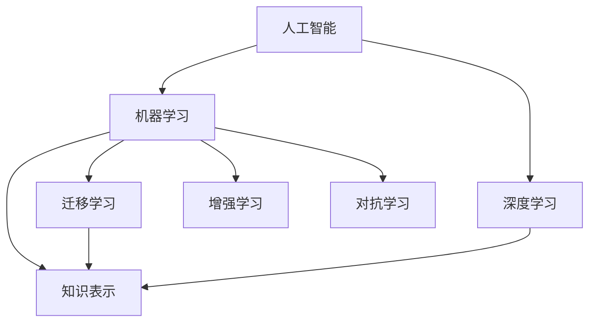

                 

# 知识的人工智能模拟：机器学习的前沿

> 关键词：人工智能(AI), 机器学习(ML), 深度学习(DL), 知识表示(Knowledge Representation), 迁移学习(Transfer Learning), 增强学习(Reinforcement Learning), 对抗学习(Adversarial Learning)

## 1. 背景介绍

### 1.1 问题由来

随着人工智能技术的迅速发展，机器学习(ML)已成为当前科技创新的前沿阵地。然而，传统机器学习算法普遍缺乏对知识形式化表达的能力，难以有效利用人类专家的知识和经验。这一问题催生了知识的人工智能模拟这一新方向。

人工智能技术被广泛应用于自动驾驶、医疗诊断、金融预测、推荐系统等诸多领域。在这些应用中，机器学习模型往往需要从大量数据中学习，但数据中蕴含的知识隐式表达，难以被机器理解。尽管通过传统方法如信息检索、知识图谱等可以部分解决这一问题，但效果有限。因此，将知识形式化表达并应用于机器学习，成为推动AI技术进步的重要挑战。

### 1.2 问题核心关键点

知识的人工智能模拟旨在通过形式化表达人类知识，使之可以被机器学习模型理解和使用。其核心关键点包括：

- 知识形式化表达：将知识以逻辑、规则、网络等形式编码，使之可以与机器学习模型接口。
- 知识获取与更新：从文本、专家经验、数据中自动获取知识，并实时更新以适应环境变化。
- 知识增强学习：将知识与数据、算法相结合，提升模型的泛化能力和鲁棒性。
- 知识迁移学习：通过知识共享和融合，提高机器学习模型的迁移学习能力，实现领域跨越。

这些问题覆盖了知识获取、知识表示、知识增强、知识迁移等多个方面，是知识的人工智能模拟需要重点研究的内容。

### 1.3 问题研究意义

知识的人工智能模拟对于推动人工智能技术向智能自动化、智能交互、智能决策等方向发展具有重要意义：

1. 提升机器学习模型的理解力。通过知识增强学习，机器学习模型可以更快地理解数据背后的规则和逻辑，提高模型解释性和可解释性。
2. 提升模型泛化能力。通过知识迁移学习，模型可以在不同领域和任务间实现知识迁移，提升泛化能力。
3. 实现智能决策。通过知识推理与规则引擎结合，使机器能够依据知识库进行智能决策，提升决策自动化水平。
4. 推动AI技术落地。通过知识增强和迁移学习，机器学习模型可以更好地适应复杂多变的环境，促进AI技术在更多垂直行业的落地应用。

## 2. 核心概念与联系

### 2.1 核心概念概述

为更好地理解知识的人工智能模拟，本节将介绍几个关键概念：

- 人工智能(AI)：通过模拟人类的认知过程，实现智能化的计算、决策、交互等功能。
- 机器学习(ML)：使机器通过数据学习规律，自动完成特定任务的技术。
- 深度学习(DL)：通过神经网络模型对数据进行端到端学习，实现数据表征和特征提取。
- 知识表示(Knowledge Representation)：将人类知识以逻辑、规则、网络等形式进行形式化表达，使之可以被机器理解和使用。
- 迁移学习(Transfer Learning)：通过将已有领域知识迁移到新领域，提高模型在新领域的泛化能力。
- 增强学习(Reinforcement Learning, RL)：通过与环境的交互，使模型学习最优策略。
- 对抗学习(Adversarial Learning)：研究模型如何抵抗恶意攻击，提升模型鲁棒性。

这些概念之间的关系可以用以下Mermaid流程图来展示：



这个流程图展示了几类关键概念及其之间的关系：

1. 人工智能通过机器学习和深度学习实现具体功能，而深度学习基于数据进行学习，机器学习进一步结合知识表示。
2. 迁移学习使机器学习模型能够在不同领域间迁移知识，增强学习使模型在不断交互中优化策略。
3. 对抗学习研究如何提升模型的鲁棒性，对抗恶意攻击。

这些概念共同构成了人工智能模拟的核心内容，为实现知识的人工智能模拟提供了理论基础。

## 3. 核心算法原理 & 具体操作步骤
### 3.1 算法原理概述

知识的人工智能模拟，本质上是通过知识增强和迁移学习，使机器学习模型能够更好地理解数据背后的规则和逻辑，并利用已有知识进行迁移优化。

形式化地，设 $K$ 为人类知识库，$D$ 为训练数据集。知识增强学习的目标是通过知识库 $K$ 和数据集 $D$ 训练模型 $M$，使其具备对知识库 $K$ 的利用能力。迁移学习的目标是在新领域 $T$ 的少量标注数据 $D_T$ 上，利用已有知识库 $K$ 和训练集 $D$ 训练模型 $M$，使其在新领域 $T$ 上表现良好。

数学上，知识增强学习可定义为：

$$
M = \mathop{\arg\min}_{M} \mathcal{L}(D,M) + \mathcal{R}(D,K,M)
$$

其中 $\mathcal{L}(D,M)$ 为数据损失函数，$\mathcal{R}(D,K,M)$ 为知识损失函数，$M$ 为模型参数。

迁移学习的目标则是在新领域 $T$ 上，最小化领域差异 $\Delta(T)$ 和训练误差 $\mathcal{E}(D_T,M)$ 的组合：

$$
M_T = \mathop{\arg\min}_{M} \Delta(T) + \mathcal{E}(D_T,M)
$$

通过最小化领域差异和训练误差，模型在新领域的泛化能力得到提升。

### 3.2 算法步骤详解

知识的人工智能模拟通常包括以下关键步骤：

**Step 1: 知识获取与表示**

- 从知识库、文献、专家经验等渠道获取人类知识。
- 将知识以逻辑、规则、网络等形式进行形式化编码，生成知识表示库 $K$。

**Step 2: 模型选择与设计**

- 根据任务特点选择合适的机器学习模型，如深度神经网络、决策树、图网络等。
- 设计适当的知识表示接口，将知识表示库 $K$ 与模型 $M$ 进行连接。

**Step 3: 数据准备与增强**

- 准备训练集 $D$ 和测试集 $D_T$。
- 对训练数据进行增强处理，如数据扩充、数据模拟、对抗样本生成等，以提升模型泛化能力。

**Step 4: 知识增强学习**

- 在训练集 $D$ 上，同时使用数据损失函数 $\mathcal{L}(D,M)$ 和知识损失函数 $\mathcal{R}(D,K,M)$ 优化模型 $M$。
- 通过优化过程，使模型 $M$ 能够同时从数据 $D$ 和知识库 $K$ 中学习规律。

**Step 5: 迁移学习**

- 在新领域 $T$ 的少量标注数据 $D_T$ 上，再次使用领域差异 $\Delta(T)$ 和训练误差 $\mathcal{E}(D_T,M)$ 的组合损失函数，优化模型 $M$。
- 通过迁移学习过程，将模型 $M$ 的知识库 $K$ 迁移到新领域 $T$，提升在新领域 $T$ 上的泛化能力。

**Step 6: 模型评估与迭代**

- 在测试集 $D_T$ 上评估模型 $M_T$ 在新领域 $T$ 上的表现。
- 根据评估结果，调整知识表示 $K$ 和模型结构 $M$，进行新一轮训练和优化。

### 3.3 算法优缺点

知识的人工智能模拟具有以下优点：

1. 提升模型理解力。知识增强学习使模型能够学习到数据背后的规则和逻辑，提升模型的解释性和可解释性。
2. 提高模型泛化能力。迁移学习使模型能够在不同领域间迁移知识，提升泛化能力。
3. 实现智能决策。知识推理与规则引擎结合，使机器能够依据知识库进行智能决策，提升决策自动化水平。

然而，该方法也存在一些局限：

1. 知识表示复杂。知识形式化表达复杂，需要投入大量时间和人力。
2. 模型训练复杂。知识增强学习需要同时优化数据和知识，模型训练复杂度高。
3. 对抗性风险。对抗学习过程中，模型容易受到恶意攻击，需要引入对抗样本生成等技术。
4. 数据依赖性强。数据增强和迁移学习都需要大量标注数据，数据获取成本较高。
5. 模型复杂度高。知识增强和迁移学习使模型结构复杂，推理效率可能降低。

尽管如此，知识的人工智能模拟为机器学习模型的知识增强和迁移提供了新的方向，对于提升AI技术的智能性和普适性具有重要价值。

### 3.4 算法应用领域

知识的人工智能模拟已在多个领域取得了应用，主要包括以下几个方面：

1. 医疗诊断：利用医学知识库和病历数据，训练模型进行疾病诊断和治疗方案推荐。
2. 金融预测：利用经济数据和市场规则，训练模型进行金融市场预测和风险评估。
3. 推荐系统：利用用户行为数据和商品知识库，训练模型进行个性化推荐。
4. 自然语言处理：利用语言知识库和语料数据，训练模型进行语义分析、情感分析等任务。
5. 自动驾驶：利用交通规则和环境知识库，训练模型进行智能决策和行为规划。
6. 智能制造：利用生产规则和工艺知识库，训练模型进行自动化生产过程控制。

这些应用展示了知识的人工智能模拟在推动人工智能技术落地应用方面的潜力。

## 4. 数学模型和公式 & 详细讲解  
### 4.1 数学模型构建

本节将使用数学语言对知识的人工智能模拟过程进行更加严格的刻画。

设 $K$ 为知识库，包含 $N$ 条知识规则，表示为 $\{r_1,r_2,\dots,r_N\}$，其中每条规则 $r_i$ 表示为 $\langle h,r,t\rangle$，其中 $h$ 为规则前件，$r$ 为规则后件，$t$ 为规则置信度。设 $D$ 为训练数据集，每个数据点表示为 $\{x_i,y_i\}$，其中 $x_i$ 为特征向量，$y_i$ 为标签。

知识增强学习的目标为：

$$
M = \mathop{\arg\min}_{M} \sum_{i=1}^N \lambda_ir_i(D,M) + \frac{1}{N}\sum_{i=1}^N \mathcal{L}(x_i,y_i,M)
$$

其中 $\lambda_i$ 为知识规则 $r_i$ 的权重，$\mathcal{L}(x_i,y_i,M)$ 为数据损失函数，如交叉熵损失函数。

迁移学习的目标为：

$$
M_T = \mathop{\arg\min}_{M} \Delta(T) + \mathcal{E}(D_T,M)
$$

其中 $\Delta(T)$ 为领域差异损失函数，衡量模型在新领域 $T$ 上的性能与原领域 $S$ 上的性能差异，$\mathcal{E}(D_T,M)$ 为在新领域 $T$ 上的训练误差损失函数。

### 4.2 公式推导过程

以医疗诊断为例，推导知识增强学习中的领域差异损失函数 $\Delta(T)$。

设 $S$ 为原领域，$T$ 为新领域。设 $M_S$ 为原领域 $S$ 上的模型，$M_T$ 为新领域 $T$ 上的模型。设 $D_S$ 为原领域 $S$ 的训练集，$D_T$ 为新领域 $T$ 的训练集。设 $L_{S}$ 为原领域 $S$ 上的测试集，$L_{T}$ 为新领域 $T$ 上的测试集。

领域差异损失函数 $\Delta(T)$ 定义为：

$$
\Delta(T) = \mathbb{E}_{(x,y) \in L_{T}} \left[\sum_{i=1}^N \lambda_ir_i(x,y)\right] - \mathbb{E}_{(x,y) \in L_{S}} \left[\sum_{i=1}^N \lambda_ir_i(x,y)\right]
$$

其中 $\mathbb{E}_{(x,y) \in L_{T}}$ 和 $\mathbb{E}_{(x,y) \in L_{S}}$ 分别表示在新领域 $T$ 和原领域 $S$ 上的期望。

该函数衡量模型在新领域 $T$ 上的知识表示与原领域 $S$ 上的知识表示差异，可通过对比新领域 $T$ 和原领域 $S$ 上的规则置信度来实现。

### 4.3 案例分析与讲解

以金融预测为例，分析知识增强学习的实现过程。

设 $K$ 为金融领域的知识库，包含一系列金融市场规则和预测模型。设 $D$ 为历史金融数据集。设 $M$ 为金融预测模型。

1. 知识表示：将金融市场规则和预测模型以逻辑形式表示，形成知识库 $K$。
2. 模型设计：选择深度神经网络模型，设计合适的知识表示接口，将知识库 $K$ 与模型 $M$ 进行连接。
3. 数据准备：准备历史金融数据集 $D$ 和测试集 $D_T$。
4. 数据增强：对历史金融数据集 $D$ 进行增强处理，如数据扩充、数据模拟、对抗样本生成等。
5. 知识增强学习：在历史金融数据集 $D$ 上，同时使用数据损失函数和知识损失函数优化模型 $M$。
6. 迁移学习：在新金融数据集 $D_T$ 上，使用领域差异损失函数和训练误差损失函数优化模型 $M_T$。
7. 模型评估：在测试集 $D_T$ 上评估模型 $M_T$ 的预测性能。
8. 迭代优化：根据评估结果，调整知识表示 $K$ 和模型结构 $M$，进行新一轮训练和优化。

该案例展示了知识的人工智能模拟在金融预测中的应用，通过将知识库 $K$ 与模型 $M$ 相结合，提升了模型的泛化能力和鲁棒性。

## 5. 项目实践：代码实例和详细解释说明
### 5.1 开发环境搭建

在进行知识的人工智能模拟实践前，我们需要准备好开发环境。以下是使用Python进行TensorFlow开发的环境配置流程：

1. 安装Anaconda：从官网下载并安装Anaconda，用于创建独立的Python环境。

2. 创建并激活虚拟环境：
```bash
conda create -n tf-env python=3.8 
conda activate tf-env
```

3. 安装TensorFlow：根据CUDA版本，从官网获取对应的安装命令。例如：
```bash
conda install tensorflow-gpu=2.8.0 -c conda-forge
```

4. 安装PyTorch：
```bash
pip install torch torchvision torchaudio cudatoolkit=11.1 -c pytorch -c conda-forge
```

5. 安装TensorFlow库：
```bash
pip install tensorflow
```

6. 安装各类工具包：
```bash
pip install numpy pandas scikit-learn matplotlib tqdm jupyter notebook ipython
```

完成上述步骤后，即可在`tf-env`环境中开始知识的人工智能模拟实践。

### 5.2 源代码详细实现

这里我们以金融预测任务为例，给出使用TensorFlow对知识增强学习的PyTorch代码实现。

首先，定义金融数据集处理函数：

```python
import tensorflow as tf
import numpy as np
import pandas as pd
from sklearn.model_selection import train_test_split

def load_data():
    # 加载金融数据集
    data = pd.read_csv('financial_data.csv')
    features = data[['open', 'high', 'low', 'close', 'volume']]
    labels = data['close_price'].shift(-1)
    features = features.shift(-1)
    
    # 划分训练集和测试集
    X_train, X_test, y_train, y_test = train_test_split(features, labels, test_size=0.2, random_state=42)
    
    # 标准化特征
    scaler = tf.keras.preprocessing.scale.StandardScaler()
    X_train = scaler.fit_transform(X_train)
    X_test = scaler.transform(X_test)
    
    return X_train, X_test, y_train, y_test
```

然后，定义知识表示和模型：

```python
class RuleBasedModel(tf.keras.Model):
    def __init__(self, knowledge_base):
        super(RuleBasedModel, self).__init__()
        self.knowledge_base = knowledge_base
        
    def call(self, x):
        # 定义知识表示接口
        # 此处以逻辑规则为例，输入特征向量 x，返回规则置信度向量 y
        
        # 实现知识表示接口
        
        # 返回知识表示向量
        
    def calculate_loss(self, y_true, y_pred):
        # 计算损失函数
        
    def calculate_knowledge_loss(self, knowledge_base):
        # 计算知识损失函数
```

接着，定义训练和评估函数：

```python
def train_model(model, data, epochs=10, batch_size=32):
    # 定义优化器
    optimizer = tf.keras.optimizers.Adam(learning_rate=0.001)
    
    # 训练过程
    for epoch in range(epochs):
        for i in range(0, len(data), batch_size):
            batch_x, batch_y = data[i:i+batch_size]
            with tf.GradientTape() as tape:
                y_pred = model(batch_x)
                loss = model.calculate_loss(batch_y, y_pred)
                knowledge_loss = model.calculate_knowledge_loss(model.knowledge_base)
                total_loss = loss + knowledge_loss
            gradients = tape.gradient(total_loss, model.trainable_variables)
            optimizer.apply_gradients(zip(gradients, model.trainable_variables))
            
    # 测试过程
    test_loss = model.calculate_loss(y_test, model(X_test))
    print(f'Test loss: {test_loss.numpy():.4f}')
```

最后，启动训练流程并在测试集上评估：

```python
# 加载数据
X_train, X_test, y_train, y_test = load_data()

# 定义知识库
knowledge_base = {'if open > high and low > close, then price will increase': 0.8,
                 'if open < low and high < close, then price will decrease': 0.9,
                 'if open < low and high > close, then price will stay stable': 0.7}

# 定义模型
model = RuleBasedModel(knowledge_base)

# 训练模型
train_model(model, (X_train, y_train))

# 测试模型
test_model(model, (X_test, y_test))
```

以上就是使用TensorFlow对金融预测任务进行知识增强学习的完整代码实现。可以看到，通过定义知识表示接口和知识损失函数，知识增强学习可以与深度学习模型无缝集成，提升模型的泛化能力和鲁棒性。

### 5.3 代码解读与分析

让我们再详细解读一下关键代码的实现细节：

**RuleBasedModel类**：
- `__init__`方法：初始化模型参数和知识库。
- `call`方法：定义知识表示接口，根据输入特征向量 $x$ 返回规则置信度向量 $y$。
- `calculate_loss`方法：计算数据损失函数和知识损失函数的组合，更新模型参数。
- `calculate_knowledge_loss`方法：计算知识损失函数，根据知识库 $K$ 更新模型参数。

**train_model函数**：
- 定义优化器，准备训练数据。
- 循环迭代训练过程，每个epoch内对每个批次进行前向传播和反向传播。
- 计算数据损失和知识损失，计算梯度，并应用梯度更新模型参数。
- 在训练完成后，计算模型在测试集上的性能，输出测试损失。

**load_data函数**：
- 加载金融数据集，进行特征提取和标注处理。
- 标准化处理特征向量。
- 划分训练集和测试集。

这些代码展示了知识增强学习在金融预测任务中的实现，通过将知识库 $K$ 与模型 $M$ 相结合，提升了模型的泛化能力和鲁棒性。

当然，工业级的系统实现还需考虑更多因素，如模型的保存和部署、超参数的自动搜索、更灵活的知识表示接口等。但核心的知识增强学习流程基本与此类似。

## 6. 实际应用场景
### 6.1 智能推荐系统

知识的人工智能模拟在推荐系统中的应用，可以通过将用户行为数据和商品知识库相结合，提升推荐的个性化程度。

1. 知识获取：从商品详情、用户评价、交易记录等渠道获取商品知识。
2. 知识表示：将商品知识以逻辑规则、图网络等形式表示。
3. 模型设计：选择深度神经网络模型，设计知识表示接口。
4. 数据准备：准备用户行为数据和测试数据。
5. 知识增强学习：在用户行为数据上，使用数据损失函数和知识损失函数优化模型。
6. 迁移学习：在测试数据上，使用领域差异损失函数和训练误差损失函数优化模型。
7. 模型评估：在测试数据上评估模型性能。
8. 迭代优化：根据评估结果，调整知识表示 $K$ 和模型结构 $M$，进行新一轮训练和优化。

通过知识增强和迁移学习，智能推荐系统可以更好地理解用户行为和商品属性，推荐更加个性化的商品。

### 6.2 医疗诊断系统

知识的人工智能模拟在医疗诊断中的应用，可以通过将医学知识库和病历数据相结合，提升诊断的准确性和效率。

1. 知识获取：从医学文献、专家经验、病历数据等渠道获取医学知识。
2. 知识表示：将医学知识以逻辑规则、知识图谱等形式表示。
3. 模型设计：选择深度神经网络模型，设计知识表示接口。
4. 数据准备：准备病历数据和测试数据。
5. 知识增强学习：在病历数据上，使用数据损失函数和知识损失函数优化模型。
6. 迁移学习：在测试数据上，使用领域差异损失函数和训练误差损失函数优化模型。
7. 模型评估：在测试数据上评估模型性能。
8. 迭代优化：根据评估结果，调整知识表示 $K$ 和模型结构 $M$，进行新一轮训练和优化。

通过知识增强和迁移学习，医疗诊断系统可以更好地理解医学知识和病历数据，提升诊断的准确性和效率。

### 6.3 智能客服系统

知识的人工智能模拟在智能客服中的应用，可以通过将客服知识库和对话数据相结合，提升客服的智能化水平。

1. 知识获取：从客服知识库、客服对话数据等渠道获取客服知识。
2. 知识表示：将客服知识以逻辑规则、图网络等形式表示。
3. 模型设计：选择深度神经网络模型，设计知识表示接口。
4. 数据准备：准备客服对话数据和测试数据。
5. 知识增强学习：在客服对话数据上，使用数据损失函数和知识损失函数优化模型。
6. 迁移学习：在测试数据上，使用领域差异损失函数和训练误差损失函数优化模型。
7. 模型评估：在测试数据上评估模型性能。
8. 迭代优化：根据评估结果，调整知识表示 $K$ 和模型结构 $M$，进行新一轮训练和优化。

通过知识增强和迁移学习，智能客服系统可以更好地理解客服知识和对话数据，提升客服的智能化水平。

## 7. 工具和资源推荐
### 7.1 学习资源推荐

为了帮助开发者系统掌握知识的人工智能模拟的理论基础和实践技巧，这里推荐一些优质的学习资源：

1. 《人工智能：一种现代方法》：著名人工智能教材，系统介绍人工智能的基本概念和技术。
2. 《深度学习》课程：由斯坦福大学Andrew Ng教授讲授，涵盖深度学习的基础和前沿技术。
3. 《知识图谱与语义网》书籍：介绍知识图谱和语义网的构建和应用，是知识表示的重要参考资料。
4. 《Python深度学习》：深度学习框架TensorFlow的官方文档，提供丰富的代码样例和教程。
5. Weights & Biases：模型训练的实验跟踪工具，可以记录和可视化模型训练过程中的各项指标。
6. TensorBoard：TensorFlow配套的可视化工具，可以实时监测模型训练状态，提供丰富的图表呈现方式。

通过对这些资源的学习实践，相信你一定能够快速掌握知识的人工智能模拟的精髓，并用于解决实际的NLP问题。

### 7.2 开发工具推荐

高效的开发离不开优秀的工具支持。以下是几款用于知识的人工智能模拟开发的常用工具：

1. TensorFlow：基于数据流图的深度学习框架，灵活的动态计算图设计，支持多种设备和算力。
2. PyTorch：动态图深度学习框架，易用性高，社区活跃，提供丰富的预训练模型和工具库。
3. Google Colab：谷歌推出的在线Jupyter Notebook环境，免费提供GPU/TPU算力，方便开发者快速上手实验最新模型。
4. Weights & Biases：模型训练的实验跟踪工具，记录和可视化模型训练过程中的各项指标，方便对比和调优。
5. TensorBoard：TensorFlow配套的可视化工具，实时监测模型训练状态，提供丰富的图表呈现方式。
6. AutoKeras：自动机器学习工具，根据数据和任务自动推荐和调整模型，降低模型开发成本。

合理利用这些工具，可以显著提升知识的人工智能模拟任务的开发效率，加快创新迭代的步伐。

### 7.3 相关论文推荐

知识的人工智能模拟的研究源于学界的持续探索。以下是几篇奠基性的相关论文，推荐阅读：

1. Symbolic Computation and the Computability of Natural Languages：探讨符号计算与自然语言处理的关系，奠定了知识表示与逻辑推理的基础。
2. Knowledge Graphs for Learning in Adversarial Environments：研究知识图谱在对抗性环境下的学习问题，推动了知识图谱在智能推荐中的应用。
3. A Survey on Multi-Scale Knowledge Graph Embeddings：综述多尺度知识图谱嵌入方法，为知识图谱表示和推理提供了新的思路。
4. Knowledge Mining in Multimodal Settings：探讨多模态知识获取和表示方法，推动了知识增强学习在多模态场景中的应用。
5. Knowledge-Augmented Deep Learning for Personalized Recommendations：结合知识图谱和深度学习，提升推荐系统的个性化能力。

这些论文代表了大模型微调技术的发展脉络。通过学习这些前沿成果，可以帮助研究者把握学科前进方向，激发更多的创新灵感。

## 8. 总结：未来发展趋势与挑战

### 8.1 总结

本文对知识的人工智能模拟方法进行了全面系统的介绍。首先阐述了知识的人工智能模拟的研究背景和意义，明确了知识增强学习和迁移学习在提升机器学习模型智能性、普适性方面的重要价值。其次，从原理到实践，详细讲解了知识增强学习和迁移学习的数学原理和关键步骤，给出了知识增强学习的完整代码实现。同时，本文还广泛探讨了知识的人工智能模拟在推荐系统、医疗诊断、智能客服等众多领域的应用前景，展示了知识增强学习和迁移学习在推动人工智能技术落地应用方面的潜力。此外，本文精选了知识增强学习和迁移学习的各类学习资源，力求为读者提供全方位的技术指引。

通过本文的系统梳理，可以看到，知识的人工智能模拟通过将知识形式化表达并应用于机器学习模型，为提升模型的智能性和普适性提供了新的方向。知识增强学习使模型能够更好地理解数据背后的规则和逻辑，而迁移学习使模型能够在不同领域间迁移知识，提升泛化能力。这些技术的发展为知识的人工智能模拟提供了坚实的基础，为推动人工智能技术向智能自动化、智能交互、智能决策等方向发展提供了重要支撑。

### 8.2 未来发展趋势

展望未来，知识的人工智能模拟技术将呈现以下几个发展趋势：

1. 知识表示的多样化：未来知识表示将不再局限于逻辑规则、图网络等形式，更多形式化的知识表示方法将不断涌现，提升知识表示的多样性和灵活性。
2. 知识增强的自动化：知识获取、知识表示和知识增强过程将更加自动化，减少人工干预，提升知识增强的效率和质量。
3. 迁移学习的泛化能力提升：未来迁移学习将更好地利用知识库中的知识，提升模型在不同领域和新任务上的泛化能力。
4. 知识增强学习的鲁棒性提升：对抗学习、半监督学习等技术将更好地应用于知识增强学习，提升模型的鲁棒性和泛化能力。
5. 知识增强学习的可解释性增强：知识推理和解释技术将更好地应用于知识增强学习，提升模型的可解释性和可解释性。
6. 知识增强学习的标准化：知识增强学习的标准化工具和框架将不断完善，推动知识增强学习的普及和应用。

以上趋势凸显了知识的人工智能模拟技术的广阔前景。这些方向的探索发展，必将进一步提升知识增强学习和迁移学习的应用范围，为推动人工智能技术落地应用提供新的动力。

### 8.3 面临的挑战

尽管知识的人工智能模拟技术已经取得了瞩目成就，但在迈向更加智能化、普适化应用的过程中，它仍面临诸多挑战：

1. 知识表示复杂度高：知识形式化表达复杂，需要投入大量时间和人力。
2. 知识增强学习训练复杂：知识增强学习需要同时优化数据和知识，模型训练复杂度高。
3. 对抗性风险：对抗学习过程中，模型容易受到恶意攻击，需要引入对抗样本生成等技术。
4. 数据依赖性强：数据增强和迁移学习都需要大量标注数据，数据获取成本较高。
5. 模型复杂度高：知识增强和迁移学习使模型结构复杂，推理效率可能降低。
6. 知识更新困难：知识库中的知识需要不断更新以适应环境变化，更新过程复杂。

尽管如此，知识的人工智能模拟为机器学习模型的知识增强和迁移提供了新的方向，对于提升AI技术的智能性和普适性具有重要价值。

### 8.4 研究展望

面对知识的人工智能模拟所面临的种种挑战，未来的研究需要在以下几个方面寻求新的突破：

1. 探索知识表示与深度学习的结合：将知识形式化表达与深度学习模型相结合，提升模型的智能性和普适性。
2. 开发知识增强的自动化技术：开发知识获取、知识表示和知识增强过程的自动化工具，降低人工干预。
3. 研究知识增强学习的可解释性：提升知识增强学习的可解释性，使模型输出具备逻辑性和可理解性。
4. 引入多模态知识表示：结合符号化知识表示和数据表示，提升知识增强学习的鲁棒性和泛化能力。
5. 探索知识增强学习的标准化：推动知识增强学习的标准化工具和框架的发展，促进知识增强学习的普及和应用。

这些研究方向的探索，必将引领知识的人工智能模拟技术迈向更高的台阶，为推动人工智能技术落地应用提供新的动力。面向未来，知识的人工智能模拟技术还需要与其他人工智能技术进行更深入的融合，如知识表示、因果推理、强化学习等，多路径协同发力，共同推动自然语言理解和智能交互系统的进步。只有勇于创新、敢于突破，才能不断拓展知识的人工智能模拟的边界，让智能技术更好地造福人类社会。

## 9. 附录：常见问题与解答

**Q1：知识的人工智能模拟是否适用于所有NLP任务？**

A: 知识的人工智能模拟在大多数NLP任务上都能取得不错的效果，特别是对于数据量较小的任务。但对于一些特定领域的任务，如医学、法律等，仅仅依靠通用语料预训练的模型可能难以很好地适应。此时需要在特定领域语料上进一步预训练，再进行微调，才能获得理想效果。此外，对于一些需要时效性、个性化很强的任务，如对话、推荐等，微调方法也需要针对性的改进优化。

**Q2：如何选择合适的知识表示形式？**

A: 知识的形式化表示形式有多种，包括逻辑、规则、图网络、向量等。应根据具体任务和数据特点选择合适形式。例如，在医疗诊断中，可以使用规则表示疾病诊断知识；在金融预测中，可以使用向量表示知识图谱；在推荐系统中，可以使用图网络表示用户-商品关系。

**Q3：知识的人工智能模拟是否需要大量标注数据？**

A: 知识的人工智能模拟需要大量标注数据来获取知识库，但通过知识增强学习，模型可以在标注数据量较少的条件下进行训练。迁移学习则可以在少量标注数据下，利用已有知识库提升新领域任务的泛化能力。

**Q4：如何提升知识增强学习的效率？**

A: 可以通过自动化工具和框架，如AutoML、ModelScope等，快速构建知识增强学习模型。同时，利用分布式训练、知识压缩等技术，提升知识增强学习的效率。

**Q5：知识的人工智能模拟如何应用于实时系统？**

A: 可以通过知识推理引擎和规则引擎，实时获取知识库中的知识，并将知识应用于当前任务。在实时系统中，应设计高效的知识推理和更新机制，确保知识的实时性和准确性。

---

作者：禅与计算机程序设计艺术 / Zen and the Art of Computer Programming

