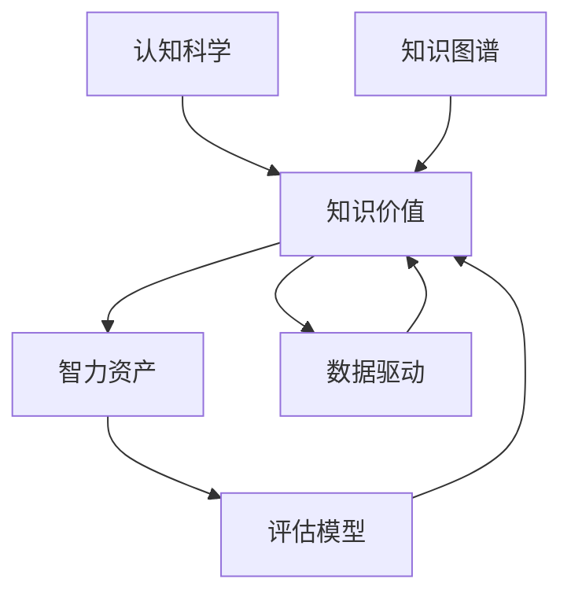

                 

# 知识的价值评估：衡量智力资产

> 关键词：知识价值, 智力资产, 评估模型, 数据驱动, 深度学习, 认知科学, 知识图谱

## 1. 背景介绍

### 1.1 问题由来

随着信息时代的到来，知识和智能资产的累积和应用已经成为了社会经济发展的重要驱动力。无论是企业、政府还是个人，都越来越重视知识的获取、存储和利用。然而，如何量化和评估这些资产的价值，是当前面临的一个巨大挑战。特别是在海量数据和复杂系统的环境下，传统的人工评估方法难以满足实际需求。因此，采用数据驱动的方法，借助深度学习和认知科学等前沿技术，建立科学的知识价值评估体系，成为一项紧迫而重要的任务。

### 1.2 问题核心关键点

知识价值评估的核心在于：
1. **量化知识资产**：将知识资产以数值形式表达，便于比较和决策。
2. **动态更新评估**：根据最新数据和应用情况，实时更新知识价值，确保评估结果的时效性。
3. **多维度评估**：从多个维度（如技术、商业、社会等）综合评估知识资产的价值，避免片面性。
4. **透明和可解释性**：评估模型应具备透明性和可解释性，以便于对结果的理解和信任。

这些问题触及到了知识价值评估的多个层面，包括方法论、模型构建、数据应用等，需要跨学科的合作和深入研究。

### 1.3 问题研究意义

知识价值评估不仅对企业、政府等决策者具有重要意义，对个人学习和职业规划也有重要指导作用。通过精确的量化和动态评估，可以优化资源配置，提升创新能力，实现知识的最大价值化。

1. **提升决策质量**：准确评估知识资产的价值，使决策者能够根据真实数据做出更为明智的选择。
2. **促进知识传播**：明确知识资产的价值，激励更多人学习和分享知识。
3. **优化人力资源配置**：通过评估知识资产的价值，合理安排人才流动和岗位配置。
4. **支持战略规划**：为企业的长期战略规划提供数据支持，指导技术研发和市场拓展。
5. **助力教育发展**：为个人职业规划和终身学习提供量化指导，促进教育公平和质量提升。

## 2. 核心概念与联系

### 2.1 核心概念概述

为更好地理解知识价值评估的理论基础和实践方法，本节将介绍几个密切相关的核心概念：

- **知识价值(Knowledge Value)**：指知识资产在特定情境下的有用性和潜在价值，包括技术价值、商业价值、社会价值等。
- **智力资产(Intelligence Asset)**：指以知识为基础的、具有创造力和决策能力的人或团队，包括科研人员、工程师、企业家等。
- **评估模型(Evaluation Model)**：用于量化和动态更新知识资产价值的数学模型和算法，通常基于深度学习等先进技术。
- **数据驱动(Data-Driven)**：利用大数据和人工智能技术，通过数据驱动的方式进行决策和评估。
- **认知科学(Cognitive Science)**：研究人类认知过程和智能行为，为知识价值评估提供理论基础。
- **知识图谱(Knowledge Graph)**：表示实体间关系和属性的大型数据图，支持复杂的知识推理和查询。

这些核心概念之间的逻辑关系可以通过以下Mermaid流程图来展示：



这个流程图展示了几大核心概念之间的关系：

1. 知识价值由智力资产产生，是资产在特定情境下的有用性。
2. 智力资产需要通过评估模型进行量化和动态更新。
3. 数据驱动和认知科学为评估模型提供了方法和理论基础。
4. 知识图谱为知识推理和查询提供了强大支持。

这些概念共同构成了知识价值评估的理论基础和实践框架，使其能够更加科学和系统地量化和评估知识资产的价值。

## 3. 核心算法原理 & 具体操作步骤
### 3.1 算法原理概述

知识价值评估本质上是一个基于数据驱动的多维度综合评估过程。其核心思想是：利用深度学习等先进技术，构建评估模型，通过大量的数据训练，量化和动态更新知识资产的价值。

形式化地，假设知识资产为 $K$，其价值为 $V(K)$，评估模型为 $M$，则知识价值评估的优化目标为：

$$
\hat{V}(K) = \mathop{\arg\min}_{V} \mathcal{L}(V(K), M(D))
$$

其中 $\mathcal{L}$ 为损失函数，$D$ 为训练数据集。目标是找到最优的 $V(K)$，使得 $V(K)$ 在训练数据集 $D$ 上的预测与实际评估结果最小化。

通过梯度下降等优化算法，评估模型不断更新，最小化损失函数，使得 $V(K)$ 逼近真实的知识价值。由于深度学习模型的复杂性和强大的拟合能力，即便在有限的数据上，也能得到较为准确的评估结果。

### 3.2 算法步骤详解

知识价值评估一般包括以下几个关键步骤：

**Step 1: 数据收集与预处理**
- 收集各类知识资产的原始数据，如论文、专利、书籍、报告等。
- 对数据进行清洗、去重、归一化等预处理操作。

**Step 2: 构建评估指标**
- 根据评估目标，选择或设计多个评估指标，如技术创新性、商业化潜力、社会影响力等。
- 将评估指标转化为可量化的数值，如引用次数、专利申请量、市场份额等。

**Step 3: 模型训练与优化**
- 选择合适的深度学习模型（如CNN、RNN、BERT等），并根据数据特征设计合适的模型结构。
- 使用训练数据集 $D$ 对模型进行训练，通过调整模型参数，最小化损失函数。
- 应用正则化技术，如L2正则、Dropout等，防止模型过拟合。

**Step 4: 模型验证与评估**
- 在验证数据集上评估模型性能，使用交叉验证等方法评估模型的泛化能力。
- 根据模型在验证集上的表现，调整模型参数，优化模型结构。

**Step 5: 实时更新与监控**
- 构建实时数据流，不断收集新的知识资产数据。
- 使用训练好的模型对新数据进行评估，并实时更新知识价值。
- 设置监控指标，如评估结果的偏差、模型的稳定性等，确保评估结果的可靠性和时效性。

### 3.3 算法优缺点

知识价值评估方法具有以下优点：
1. 数据驱动：能够利用大规模数据，提供客观的评估依据。
2. 动态更新：能够实时更新评估结果，适应知识资产的动态变化。
3. 综合多维度：从多个维度综合评估知识价值，避免单一指标的局限性。
4. 透明性和可解释性：通过模型参数和评估过程，提供透明和可解释的评估结果。

同时，该方法也存在一定的局限性：
1. 数据质量依赖：评估结果的准确性很大程度上依赖于数据的质量和全面性。
2. 模型复杂度：构建和训练深度学习模型需要大量计算资源，且模型结构复杂，难以解释。
3. 多维度评估困难：从多个维度评估知识价值，存在维度之间的权衡和冲突。
4. 模型偏见：模型可能受到训练数据集中的偏见影响，导致评估结果的偏差。

尽管存在这些局限性，但就目前而言，基于深度学习的知识价值评估方法仍是最主流范式。未来相关研究的重点在于如何进一步提升数据质量，优化模型结构，减少模型偏见，提高评估结果的透明性和可解释性。

### 3.4 算法应用领域

知识价值评估技术已经在多个领域得到了广泛应用，包括但不限于：

- **企业战略规划**：通过量化知识资产的价值，优化资源配置，指导技术研发和市场拓展。
- **科研项目管理**：评估科研项目的技术创新性和商业化潜力，支持科研决策。
- **知识服务市场**：对各类知识产品进行价值评估，优化知识服务的定价和推广。
- **教育培训**：对教育资源进行价值评估，指导教育资源的优化配置。
- **知识产权保护**：对专利、商标等知识产权进行价值评估，支持知识产权交易和保护。
- **政府政策制定**：对公共知识和智能资产进行评估，指导政府决策和资源投入。

除了上述这些典型应用外，知识价值评估还被创新性地应用到更多场景中，如企业风险管理、金融投资、文化保护等，为社会经济的发展提供有力的数据支持。

## 4. 数学模型和公式 & 详细讲解 & 举例说明
### 4.1 数学模型构建

本节将使用数学语言对知识价值评估的数学模型进行更加严格的刻画。

记知识资产为 $K$，其价值为 $V(K)$，训练数据集为 $D=\{(X_i, Y_i)\}_{i=1}^N$，其中 $X_i$ 为知识资产的特征向量，$Y_i$ 为知识资产的真实价值。

定义知识价值评估模型为 $M_{\theta}$，其参数为 $\theta$。则知识价值评估的优化目标为最小化损失函数：

$$
\mathcal{L}(\theta) = \frac{1}{N} \sum_{i=1}^N \ell(V_i, M_{\theta}(X_i))
$$

其中 $\ell$ 为损失函数，$V_i$ 为知识资产 $K_i$ 的真实价值。

### 4.2 公式推导过程

以下我们以线性回归模型为例，推导知识价值评估的损失函数及其梯度计算公式。

假设知识资产 $K$ 的特征向量为 $X \in \mathbb{R}^d$，真实价值为 $Y \in \mathbb{R}$。线性回归模型 $M_{\theta}$ 定义为：

$$
M_{\theta}(X) = \theta^T \cdot X
$$

其中 $\theta$ 为模型参数。则线性回归的损失函数为：

$$
\ell(Y, M_{\theta}(X)) = (Y - M_{\theta}(X))^2
$$

将其代入优化目标，得：

$$
\mathcal{L}(\theta) = \frac{1}{N} \sum_{i=1}^N (Y_i - \theta^T \cdot X_i)^2
$$

根据链式法则，损失函数对参数 $\theta$ 的梯度为：

$$
\frac{\partial \mathcal{L}(\theta)}{\partial \theta} = -\frac{2}{N} \sum_{i=1}^N (Y_i - \theta^T \cdot X_i) \cdot X_i
$$

在得到损失函数的梯度后，即可带入模型参数更新公式，完成模型的迭代优化。重复上述过程直至收敛，最终得到适应知识资产的最优模型参数 $\theta^*$。

### 4.3 案例分析与讲解

下面以一个具体的案例来说明知识价值评估的应用过程。假设我们有一批专利数据，包括专利名称、发明人、申请日期、引用次数等特征，目标是对这些专利进行价值评估。

1. **数据收集**：从专利数据库中收集一批专利数据，包括专利的标题、摘要、发明人、申请日期、引用次数等。
2. **特征提取**：对专利数据进行特征提取，如将专利标题和摘要进行词频统计，生成特征向量 $X_i$。
3. **模型训练**：选择合适的深度学习模型（如BERT），并根据特征向量 $X_i$ 设计合适的模型结构。
4. **损失函数设计**：选择适当的损失函数，如均方误差损失，用于衡量模型预测值与真实价值的差异。
5. **模型优化**：使用训练数据集 $D$ 对模型进行训练，最小化损失函数。
6. **模型验证**：在验证数据集上评估模型性能，使用交叉验证等方法评估模型的泛化能力。
7. **实时更新**：构建实时数据流，不断收集新的专利数据，并使用训练好的模型对新数据进行评估，实时更新专利的价值。

在实际应用中，还可以引入更多复杂因素，如专利的法律状态、市场需求、技术趋势等，进一步丰富评估指标。通过知识价值评估，可以准确地量化专利的商业价值，指导企业研发投资，优化专利组合，提升市场竞争力。

## 5. 项目实践：代码实例和详细解释说明
### 5.1 开发环境搭建

在进行知识价值评估的实践前，我们需要准备好开发环境。以下是使用Python进行TensorFlow开发的环境配置流程：

1. 安装Anaconda：从官网下载并安装Anaconda，用于创建独立的Python环境。

2. 创建并激活虚拟环境：
```bash
conda create -n tf-env python=3.8 
conda activate tf-env
```

3. 安装TensorFlow：根据CUDA版本，从官网获取对应的安装命令。例如：
```bash
conda install tensorflow tensorflow-gpu==2.7.0
```

4. 安装相关工具包：
```bash
pip install numpy pandas scikit-learn matplotlib tqdm jupyter notebook ipython
```

完成上述步骤后，即可在`tf-env`环境中开始知识价值评估的实践。

### 5.2 源代码详细实现

这里我们以一个简单的线性回归模型为例，演示知识价值评估的代码实现。

首先，定义知识资产的特征向量和真实价值：

```python
import tensorflow as tf
import numpy as np
import pandas as pd

# 定义知识资产特征和真实价值
X = np.array([[1, 2], [3, 4], [5, 6], [7, 8], [9, 10]])
Y = np.array([3, 6, 9, 12, 15])
```

然后，定义线性回归模型并进行训练：

```python
# 定义模型参数
theta = tf.Variable(tf.zeros((2, 1)))

# 定义损失函数
loss = tf.reduce_mean(tf.square(Y - tf.matmul(X, theta)))

# 定义优化器
optimizer = tf.optimizers.SGD(learning_rate=0.01)

# 定义训练过程
def train(model, X, Y, epochs):
    for epoch in range(epochs):
        with tf.GradientTape() as tape:
            predictions = model(X)
            loss_value = loss(Y, predictions)
        gradients = tape.gradient(loss_value, model.trainable_variables)
        optimizer.apply_gradients(zip(gradients, model.trainable_variables))

# 训练模型
train(theta, X, Y, epochs=1000)
```

接着，进行模型验证和评估：

```python
# 在验证集上评估模型
X_val = np.array([[11, 12], [13, 14], [15, 16]])
Y_val = np.array([13, 14, 15])
predictions = theta * X_val

# 计算均方误差
mse = tf.reduce_mean(tf.square(Y_val - predictions))
print(f"Validation MSE: {mse.numpy()}")
```

最后，实时更新模型并进行监控：

```python
# 构建实时数据流
while True:
    # 从数据流中读取新的知识资产数据
    new_X, new_Y = get_new_data()
    # 使用训练好的模型对新数据进行评估
    new_predictions = theta * new_X
    # 更新模型参数
    theta.assign_sub(0.01 * tf.reduce_mean(tf.square(new_Y - new_predictions), axis=0))
    # 设置监控指标，如均方误差
    mse = tf.reduce_mean(tf.square(new_Y - new_predictions))
    print(f"New MSE: {mse.numpy()}")
```

以上就是使用TensorFlow进行知识价值评估的完整代码实现。可以看到，通过简单的线性回归模型，我们就可以实现对知识资产价值的评估和实时更新。

### 5.3 代码解读与分析

让我们再详细解读一下关键代码的实现细节：

**数据定义**：
- `X` 和 `Y` 分别代表知识资产的特征向量和真实价值，是一个二维的numpy数组。

**模型定义**：
- `theta` 为模型参数，初始化为全零。
- `loss` 为损失函数，定义均方误差。
- `optimizer` 为优化器，使用随机梯度下降。
- `train` 函数定义训练过程，每次迭代计算损失函数的梯度，并使用优化器更新参数。

**模型验证**：
- 在验证集上计算模型预测值与真实值的均方误差，输出评估结果。

**实时更新**：
- 使用一个简单的while循环，从数据流中不断读取新的知识资产数据。
- 对新数据进行评估，并实时更新模型参数。
- 监控模型的均方误差，确保评估结果的可靠性。

在实际应用中，还需要考虑更多因素，如模型的保存和部署、超参数的自动搜索、更灵活的任务适配层等。但核心的评估范式基本与此类似。

## 6. 实际应用场景
### 6.1 企业战略规划

知识价值评估在企业战略规划中具有重要应用。通过评估各类知识资产（如专利、技术、品牌等）的价值，企业可以更好地理解自身的核心竞争力，制定更为科学的战略决策。

例如，某科技公司可以对其核心专利进行价值评估，判断哪些专利最具商业化潜力，指导未来的研发方向和专利布局。同时，通过评估新项目的市场价值，可以优化资源配置，提升项目的成功率。

### 6.2 科研项目管理

科研项目管理需要量化各类知识资产的价值，如论文、专利、实验数据等，以便于资源分配和成果评估。知识价值评估可以帮助科研机构识别具有高创新性和应用价值的科研项目，优化科研资源的利用效率。

例如，某科研机构可以通过评估科研项目的技术创新性和市场潜力，指导科研项目的立项和资助，提升整体科研水平。

### 6.3 知识服务市场

知识服务市场需要量化各类知识产品（如咨询报告、研究报告、技术方案等）的价值，以便于定价和推广。知识价值评估可以帮助知识服务提供商制定合理的定价策略，吸引更多客户。

例如，某咨询公司可以通过评估其咨询报告的价值，设定合理的收费标准，提升市场竞争力。

### 6.4 教育培训

教育培训需要量化各类教育资源的价值，如教材、视频、课程等，以便于资源优化和教学评估。知识价值评估可以帮助教育机构识别高质量的教育资源，优化教学内容和资源配置。

例如，某在线教育平台可以通过评估其课程的价值，指导课程的优化和推广，提升平台的用户黏性和学习效果。

## 7. 工具和资源推荐
### 7.1 学习资源推荐

为了帮助开发者系统掌握知识价值评估的理论基础和实践技巧，这里推荐一些优质的学习资源：

1. 《深度学习》系列博文：由大模型技术专家撰写，深入浅出地介绍了深度学习的原理和应用。

2. CS231n《深度学习计算机视觉》课程：斯坦福大学开设的计算机视觉明星课程，有Lecture视频和配套作业，带你入门深度学习技术。

3. 《自然语言处理综述》书籍：全面介绍了自然语言处理的技术和应用，包括知识图谱、评估模型等。

4. Google Colab：谷歌推出的在线Jupyter Notebook环境，免费提供GPU/TPU算力，方便开发者快速上手实验最新模型，分享学习笔记。

5. Kaggle数据集：提供各类真实世界的数据集，用于训练和评估知识价值评估模型。

通过对这些资源的学习实践，相信你一定能够快速掌握知识价值评估的精髓，并用于解决实际的智能决策问题。
###  7.2 开发工具推荐

高效的开发离不开优秀的工具支持。以下是几款用于知识价值评估开发的常用工具：

1. TensorFlow：由Google主导开发的开源深度学习框架，支持大规模模型训练和部署，生产部署方便。

2. PyTorch：基于Python的开源深度学习框架，灵活动态的计算图，适合快速迭代研究。

3. Scikit-learn：用于数据预处理、特征工程、模型评估等的高性能机器学习库。

4. Pandas：用于数据处理和分析的数据库工具，支持大规模数据集的处理。

5. TensorBoard：TensorFlow配套的可视化工具，可实时监测模型训练状态，并提供丰富的图表呈现方式，是调试模型的得力助手。

6. Weights & Biases：模型训练的实验跟踪工具，可以记录和可视化模型训练过程中的各项指标，方便对比和调优。

合理利用这些工具，可以显著提升知识价值评估任务的开发效率，加快创新迭代的步伐。

### 7.3 相关论文推荐

知识价值评估技术的发展源于学界的持续研究。以下是几篇奠基性的相关论文，推荐阅读：

1. 《Deep Learning》（Goodfellow等）：全面介绍了深度学习技术的基本原理和应用，是深度学习领域的经典著作。

2. 《Data-Driven Decision Making: An Overview》（Wang等）：总结了数据驱动决策的理论和方法，介绍了知识价值评估的多个应用案例。

3. 《Knowledge-Driven Adaptive Prediction Models》（Zou等）：提出了基于知识图谱和深度学习模型的预测方法，为知识价值评估提供了新的思路。

4. 《Cognitive-Driven AI: A Survey》（Nakano等）：全面综述了认知科学与人工智能的交叉应用，为知识价值评估提供了理论支持。

这些论文代表了大规模知识价值评估技术的发展脉络。通过学习这些前沿成果，可以帮助研究者把握学科前进方向，激发更多的创新灵感。

## 8. 总结：未来发展趋势与挑战

### 8.1 总结

本文对知识价值评估进行了全面系统的介绍。首先阐述了知识价值评估的研究背景和意义，明确了其在企业战略、科研管理、教育培训等多个领域的实际应用价值。其次，从原理到实践，详细讲解了知识价值评估的数学模型和关键步骤，给出了知识价值评估任务开发的完整代码实例。同时，本文还广泛探讨了知识价值评估在多个行业领域的应用前景，展示了其巨大潜力。

通过本文的系统梳理，可以看到，知识价值评估技术正在成为智能决策的重要范式，极大地提升了决策的科学性和效率。未来，伴随深度学习和认知科学等技术的发展，知识价值评估必将在更多领域得到应用，为社会经济的发展提供更为精准的数据支持。

### 8.2 未来发展趋势

展望未来，知识价值评估技术将呈现以下几个发展趋势：

1. **多维度综合评估**：从技术、商业、社会等多维度综合评估知识价值，避免单一指标的局限性。
2. **动态更新和实时评估**：实时更新知识价值，适应知识资产的动态变化，支持快速决策。
3. **跨模态评估**：结合知识图谱、自然语言处理等多模态信息，提升评估的全面性和准确性。
4. **人工智能辅助**：引入人工智能技术和工具，如专家系统、推理机等，增强评估过程的自动化和智能化。
5. **伦理和安全**：在评估过程中引入伦理和安全约束，确保评估结果的公正性和安全性。

以上趋势凸显了知识价值评估技术的广阔前景。这些方向的探索发展，必将进一步提升评估结果的准确性和可靠性，为智能决策提供更强大的数据支持。

### 8.3 面临的挑战

尽管知识价值评估技术已经取得了瞩目成就，但在迈向更加智能化、普适化应用的过程中，它仍面临着诸多挑战：

1. **数据质量瓶颈**：评估结果的准确性很大程度上依赖于数据的质量和全面性，获取高质量数据成本较高。
2. **模型复杂度**：构建和训练深度学习模型需要大量计算资源，且模型结构复杂，难以解释。
3. **多维度评估困难**：从多个维度评估知识价值，存在维度之间的权衡和冲突，如何设计合理的评估指标是一个挑战。
4. **模型偏见**：模型可能受到训练数据集中的偏见影响，导致评估结果的偏差。
5. **评估透明性不足**：评估过程的黑盒性质，使得结果难以解释和验证。

尽管存在这些挑战，但未来的研究需要在以下几个方面寻求新的突破：

1. **数据质量提升**：通过数据增强、数据清洗等技术，提升数据质量和全面性。
2. **模型结构优化**：设计更加轻量级、可解释的评估模型，优化模型结构，提升评估效率。
3. **多维度评估方法**：设计多维度评估方法，平衡不同维度之间的权衡和冲突。
4. **模型偏见消除**：在模型训练中引入公平性约束，消除模型偏见。
5. **评估过程透明化**：增强评估过程的透明性和可解释性，确保评估结果的可信度和可靠性。

这些研究方向的探索，必将引领知识价值评估技术迈向更高的台阶，为智能决策提供更为科学和可靠的数据支持。面向未来，知识价值评估技术还需要与其他人工智能技术进行更深入的融合，如知识表示、因果推理、强化学习等，多路径协同发力，共同推动智能决策系统的进步。

### 8.4 研究展望

未来的知识价值评估技术将在以下几个方面取得重要进展：

1. **知识图谱的应用**：通过知识图谱的支持，实现知识推理和跨模态信息融合，提升评估的全面性和准确性。
2. **自适应评估模型**：设计自适应评估模型，根据不同领域和应用场景，动态调整评估指标和方法。
3. **人工智能辅助决策**：引入人工智能技术，如专家系统、推理机等，增强决策过程的自动化和智能化。
4. **伦理和安全约束**：在评估过程中引入伦理和安全约束，确保评估结果的公正性和安全性。

这些研究方向将推动知识价值评估技术走向更高的台阶，为智能决策提供更为科学和可靠的数据支持。面向未来，知识价值评估技术需要与其他人工智能技术进行更深入的融合，共同推动智能决策系统的进步，实现知识的最大化价值化。

## 9. 附录：常见问题与解答

**Q1：知识价值评估是否适用于所有领域？**

A: 知识价值评估在大多数领域都有广泛的应用价值，特别是在需要量化和评估知识资产的场合。例如，在科研、教育、企业战略规划等领域，知识价值评估可以帮助优化资源配置，提升决策质量。

**Q2：评估模型需要多少训练数据？**

A: 评估模型的训练数据需求量取决于具体的评估任务和数据质量。一般来说，数据量越大，评估结果的准确性越高。但数据质量更为关键，高质量的数据可以弥补数据量的不足。

**Q3：评估模型是否需要预训练？**

A: 预训练可以使评估模型在特定领域获得更好的初始化，提升评估结果的准确性。在实际操作中，可以先在通用领域进行预训练，再针对具体任务进行微调，以达到更好的评估效果。

**Q4：评估模型的解释性如何？**

A: 评估模型的解释性取决于其结构和训练方式。基于深度学习的评估模型通常难以解释其内部工作机制，但可以通过特征重要性分析、可视化等方法，提供一定的解释。

**Q5：评估模型是否需要持续更新？**

A: 是的，评估模型需要根据最新的数据和应用场景进行动态更新，以保持评估结果的时效性和准确性。持续更新的机制可以确保评估结果始终与实际情况相符合。

---

作者：禅与计算机程序设计艺术 / Zen and the Art of Computer Programming

