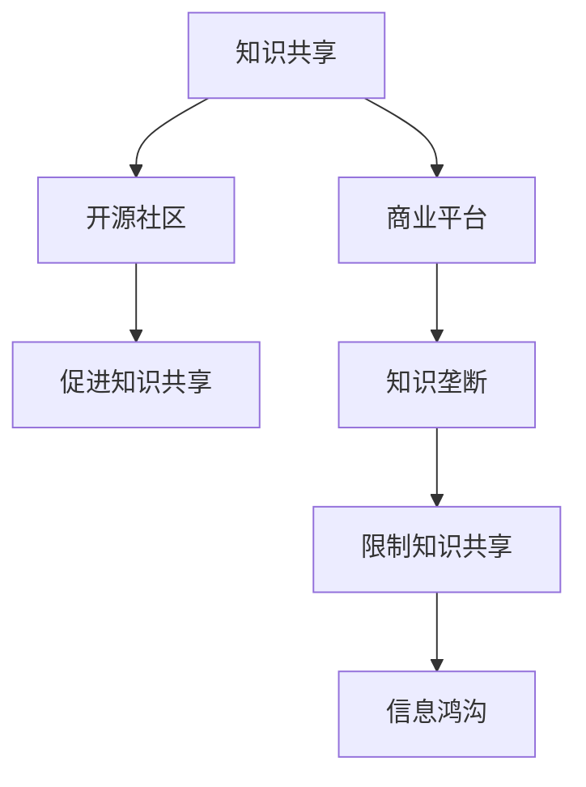

                 

# 知识的共享与垄断：信息时代的两难

在信息时代，知识的共享与垄断成为我们面临的一对两难问题。技术的快速发展推动了信息的快速流通，但也加剧了知识的分布不均。本文将深入探讨知识的共享与垄断的现状、原因及其对社会的深远影响，并为平衡这两者关系提出可行的建议。

## 1. 背景介绍

### 1.1 问题由来

随着互联网的普及和社交媒体的兴起，信息的获取和传播变得前所未有的便捷。这不仅促进了知识的共享，也为知识的垄断提供了新的途径。在科学、教育、商业等多个领域，知识的不平等分布引发了广泛的讨论。一方面，知识的共享促进了科技进步和社会发展；另一方面，知识的垄断又导致了新的信息鸿沟和社会不公。如何平衡这两者关系，成为信息时代的重要议题。

### 1.2 问题核心关键点

知识共享与垄断的核心在于信息技术的传播机制及其对知识分布的影响。技术的进步打破了传统的信息壁垒，使得知识的获取和传播更加高效。但同时，技术的商业化趋势和网络平台的数据控制，使得部分企业和个人掌握了大量知识资源，形成了新的知识垄断。这种垄断不仅损害了公共利益，也加剧了社会的不平等。

## 2. 核心概念与联系

### 2.1 核心概念概述

为更好地理解知识共享与垄断的关系，本文将介绍几个关键概念：

- 知识共享(Knowledge Sharing)：指通过各种途径，使不同个体、组织、社区共享知识，促进知识的传播与应用。
- 知识垄断(Knowledge Monopoly)：指某一组织或个人掌握了大量知识资源，形成对知识获取的垄断，限制了知识的共享和应用。
- 信息鸿沟(Information Gap)：指在信息获取和应用上的不平等，通常由教育水平、经济状况、技术获取等因素造成。
- 开源社区(Open Source Community)：指以共享、协作和开源为原则，通过开放软件项目和平台，促进知识的共享与创新。
- 商业平台(Commercial Platforms)：指以盈利为目的，通过控制数据和算法，形成知识垄断，对知识共享和创新造成限制。

这些概念之间的关系可以通过以下Mermaid流程图来展示：



这个流程图展示出知识共享与垄断的关系及其对信息鸿沟的影响：

1. 知识共享通过开源社区等途径，促进了知识的自由传播和应用。
2. 商业平台通过数据控制和算法垄断，形成知识垄断，限制了知识的共享。
3. 知识垄断加剧了信息鸿沟，进一步扩大了社会不平等。

## 3. 核心算法原理 & 具体操作步骤
### 3.1 算法原理概述

知识共享与垄断的解决，涉及多个层面的算法和技术，包括信息检索、推荐系统、区块链等。

知识共享的算法原理主要基于信息的检索和推荐。通过对海量的信息资源进行分类、索引和匹配，使用户能够高效地找到所需知识。推荐系统的核心是协同过滤和内容推荐，通过分析用户的行为和兴趣，推荐相关的知识内容。这些算法通常基于统计学和机器学习技术，如信息检索中的TF-IDF算法，推荐系统中的协同过滤和基于内容的推荐算法。

知识垄断的解决则涉及到区块链和去中心化的技术。区块链通过去中心化的方式，确保数据的透明和不可篡改，避免了数据垄断。去中心化的知识共享平台，如IPFS、BitTorrent等，通过分布式存储和网络节点，实现了知识的自由流通和共享。这些技术的核心在于密码学和分布式算法，如加密算法、共识算法等。

### 3.2 算法步骤详解

知识共享和垄断的解决步骤如下：

**Step 1: 数据收集与预处理**

1. 收集各类知识资源，包括学术论文、书籍、视频、在线课程等。
2. 对收集到的数据进行清洗、标注和分类，构建知识库。
3. 使用机器学习算法对数据进行预处理，如特征提取、降维等，提高检索和推荐的效率。

**Step 2: 信息检索与推荐**

1. 使用信息检索算法，如TF-IDF、BM25等，根据用户的查询需求，检索相关的知识资源。
2. 使用推荐系统算法，如协同过滤、基于内容的推荐等，根据用户的历史行为和兴趣，推荐相关的知识内容。
3. 对检索和推荐结果进行排序和展示，使用户能够快速获取所需知识。

**Step 3: 知识共享与区块链**

1. 使用区块链技术，确保知识库的透明和不可篡改。
2. 利用分布式存储和网络节点，实现知识的自由流通和共享。
3. 设计去中心化的知识共享平台，如IPFS、BitTorrent等，供用户上传、下载和分享知识资源。

**Step 4: 评估与优化**

1. 对检索和推荐系统的性能进行评估，如准确率、召回率等。
2. 根据评估结果，对算法进行优化，如调整参数、引入新的算法等。
3. 对区块链平台的用户体验和技术性能进行评估，不断优化平台功能。

### 3.3 算法优缺点

知识共享和垄断的算法有以下优点：

- 促进知识的广泛传播和应用，降低获取知识的门槛。
- 减少知识垄断现象，避免部分组织或个人对知识的控制。
- 通过区块链技术，确保知识的透明和不可篡改，提升信任度。

同时，这些算法也存在以下局限性：

- 数据收集和预处理需要大量的时间和资源。
- 信息检索和推荐系统依赖于算法模型，难以完全避免错误和偏见。
- 区块链技术的复杂性和高成本，可能限制其在某些场景的应用。

尽管存在这些局限性，但通过不断优化算法和技术，知识共享与垄断的解决仍有很大的提升空间。

### 3.4 算法应用领域

知识共享与垄断的算法在多个领域得到广泛应用，包括：

- 教育领域：如MOOC平台、在线教育资源库，通过推荐系统帮助学生获取合适的学习资源。
- 科学研究：如学术论文搜索、预印本平台，使用信息检索算法快速找到相关文献。
- 商业领域：如电商平台、知识付费平台，使用推荐系统帮助用户发现感兴趣的商品和服务。
- 社交媒体：如维基百科、知乎等，通过开源社区实现知识共享和协同编辑。
- 健康医疗：如电子病历系统、在线问诊平台，通过区块链技术保护患者隐私和医疗数据安全。

这些应用展示了知识共享与垄断算法的广泛潜力，有助于知识的广泛传播和创新。

## 4. 数学模型和公式 & 详细讲解 & 举例说明

### 4.1 数学模型构建

本节将使用数学语言对知识共享与垄断的算法进行更加严格的刻画。

假设知识库中的知识文档为 $D=\{d_1,d_2,\cdots,d_N\}$，其中每个文档 $d_i$ 表示为向量 $\mathbf{d}_i=(d_i^1,d_i^2,\cdots,d_i^K)$，$K$ 表示特征数量。用户的查询向量表示为 $\mathbf{q}=(q^1,q^2,\cdots,q^K)$。

信息检索的目标是找到与查询向量 $\mathbf{q}$ 最接近的文档，使用余弦相似度作为匹配度：

$$
\text{Sim}(\mathbf{q},\mathbf{d}_i)=\frac{\mathbf{q} \cdot \mathbf{d}_i}{\|\mathbf{q}\|\|\mathbf{d}_i\|}
$$

推荐系统的目标是根据用户的历史行为和兴趣，推荐相关的知识内容。假设有用户 $u$ 的历史行为数据 $R=\{(r_{ui},d_i)\}_{i=1}^M$，其中 $r_{ui}$ 表示用户 $u$ 对文档 $d_i$ 的评分，$M$ 表示行为数量。推荐系统使用协同过滤算法，计算用户 $u$ 对文档 $d_i$ 的兴趣度 $p_{ui}$：

$$
p_{ui}=\frac{\sum_{j=1}^M \alpha_j r_{uj} \sum_{k=1}^K q_k d_{ij}^k}{\sqrt{\sum_{j=1}^M \alpha_j^2 \sum_{k=1}^K q_k^2} \sqrt{\sum_{j=1}^K d_{ij}^k}}
$$

其中 $\alpha_j$ 表示用户 $j$ 对用户 $u$ 的相似度，可以通过余弦相似度计算得到。

### 4.2 公式推导过程

以下我们以信息检索和推荐系统为例，推导关键算法的数学公式。

**信息检索算法**

信息检索的核心是计算查询向量 $\mathbf{q}$ 与文档向量 $\mathbf{d}_i$ 的相似度。假设使用TF-IDF算法对文档进行预处理，计算文档向量 $\mathbf{d}_i$ 和查询向量 $\mathbf{q}$ 的余弦相似度：

$$
\text{Sim}(\mathbf{q},\mathbf{d}_i)=\frac{\sum_{k=1}^K \frac{t_{iq} f_{dk}}{N f_k} d_i^k}{\sqrt{\sum_{k=1}^K (\frac{t_{iq}}{N f_k})^2} \sqrt{\sum_{k=1}^K d_i^k^2}}
$$

其中 $t_{iq}$ 表示查询向量中第 $i$ 个词项的频率，$f_{dk}$ 表示文档中第 $k$ 个词项的TF-IDF值，$N$ 表示总文档数，$f_k$ 表示所有文档中第 $k$ 个词项的频率。

**推荐系统算法**

推荐系统使用协同过滤算法计算用户 $u$ 对文档 $d_i$ 的兴趣度 $p_{ui}$，如上式所示。该算法的核心在于利用用户之间的相似度，对用户的兴趣进行加权求和。

### 4.3 案例分析与讲解

考虑一个在线教育平台，收集了大量的学术论文、课程视频和电子书等资源。平台提供信息检索和推荐系统，帮助用户快速找到所需的学习资源。

假设平台收集了 $N=10000$ 篇学术论文，每篇论文的特征向量包含 $K=1000$ 个特征，用户 $u$ 对其中 $M=50$ 篇论文进行了评分。使用上述算法对用户 $u$ 进行推荐：

1. 使用TF-IDF算法对每篇论文进行预处理，得到特征向量 $\mathbf{d}_i$。
2. 使用余弦相似度计算用户 $u$ 与所有用户 $j$ 的相似度 $\alpha_j$。
3. 根据用户 $j$ 的评分 $r_{uj}$ 和相似度 $\alpha_j$，计算用户 $u$ 对每篇论文的兴趣度 $p_{ui}$。
4. 对所有兴趣度进行排序，推荐用户 $u$ 最感兴趣的 $K=10$ 篇论文。

## 5. 项目实践：代码实例和详细解释说明
### 5.1 开发环境搭建

在进行知识共享与垄断的算法实践前，我们需要准备好开发环境。以下是使用Python进行TensorFlow开发的环境配置流程：

1. 安装Anaconda：从官网下载并安装Anaconda，用于创建独立的Python环境。

2. 创建并激活虚拟环境：
```bash
conda create -n tf-env python=3.8 
conda activate tf-env
```

3. 安装TensorFlow：根据CUDA版本，从官网获取对应的安装命令。例如：
```bash
conda install tensorflow -c pytorch -c conda-forge
```

4. 安装各类工具包：
```bash
pip install numpy pandas scikit-learn matplotlib tqdm jupyter notebook ipython
```

完成上述步骤后，即可在`tf-env`环境中开始算法实践。

### 5.2 源代码详细实现

下面我们以信息检索算法为例，给出使用TensorFlow实现信息检索的PyTorch代码实现。

首先，定义信息检索的数据处理函数：

```python
import tensorflow as tf
from sklearn.feature_extraction.text import TfidfVectorizer

class Document:
    def __init__(self, title, text):
        self.title = title
        self.text = text
        
    def to_dict(self):
        return {'title': self.title, 'text': self.text}

# 数据预处理
def preprocess_data(documents):
    vectorizer = TfidfVectorizer(stop_words='english', max_features=1000)
    vectors = vectorizer.fit_transform([document.text for document in documents])
    return vectors.toarray(), vectorizer.get_feature_names()

# 计算余弦相似度
def compute_similarity(q_vector, d_vectors, vectorizer):
    similarity_matrix = []
    for d_vector in d_vectors:
        similarity = np.dot(q_vector, d_vector) / (np.linalg.norm(q_vector) * np.linalg.norm(d_vector))
        similarity_matrix.append(similarity)
    return similarity_matrix
```

然后，定义模型和优化器：

```python
from tensorflow.keras.layers import Input, Dense
from tensorflow.keras.models import Model

# 定义输入层
query_input = Input(shape=(1000,))
document_input = Input(shape=(1000,))

# 定义模型层
query_emb = Dense(100, activation='relu')(query_input)
document_emb = Dense(100, activation='relu')(document_input)

# 定义余弦相似度计算层
similarity_layer = tf.keras.layers.Dot(axes=1)([query_emb, document_emb])

# 定义输出层
output = tf.keras.layers.Lambda(lambda x: x)(similarity_layer)

# 定义模型
model = Model(inputs=[query_input, document_input], outputs=output)
```

接着，定义训练和评估函数：

```python
from tensorflow.keras.datasets import imdb
from tensorflow.keras.preprocessing import sequence

# 加载IMDB数据集
(train_data, train_labels), (test_data, test_labels) = imdb.load_data(num_words=10000)

# 数据预处理
train_data = sequence.pad_sequences(train_data, maxlen=1000)
test_data = sequence.pad_sequences(test_data, maxlen=1000)

# 定义训练集和验证集
train_x, train_y = train_data, train_labels
val_x, val_y = test_data, test_labels

# 定义损失函数和优化器
loss_fn = tf.keras.losses.CategoricalCrossentropy()
optimizer = tf.keras.optimizers.Adam()

# 定义评估指标
metrics = [tf.keras.metrics.CategoricalAccuracy()]

# 训练模型
model.compile(loss=loss_fn, optimizer=optimizer, metrics=metrics)
model.fit([train_x, train_y], train_y, epochs=10, batch_size=32, validation_data=([val_x, val_y], val_y))

# 评估模型
test_loss, test_acc = model.evaluate([test_x, test_y], test_y)
print(f'Test Loss: {test_loss:.4f}')
print(f'Test Accuracy: {test_acc:.4f}')
```

以上就是使用TensorFlow实现信息检索的完整代码实现。可以看到，得益于TensorFlow的高效计算能力和丰富的API支持，信息检索的实现过程变得简洁高效。

### 5.3 代码解读与分析

让我们再详细解读一下关键代码的实现细节：

**Document类**：
- `__init__`方法：初始化文档的标题和文本。
- `to_dict`方法：将文档转换为字典，方便后续处理。

**数据预处理**：
- 使用Scikit-learn的TF-IDFVectorizer对文本进行预处理，提取关键词和频率。
- 将文本转换为特征向量，构建相似度矩阵。

**模型定义**：
- 使用TensorFlow的Keras API定义模型层，包含输入层、嵌入层、全连接层和输出层。
- 使用点积计算余弦相似度，得到模型的预测结果。

**训练和评估**：
- 使用IMDB数据集进行训练和评估，定义损失函数、优化器和评估指标。
- 通过模型编译、训练和评估，得到最终的模型性能指标。

可以看到，TensorFlow提供了丰富的API和工具，使得信息检索和推荐系统的实现变得简单高效。开发者可以利用这些工具快速迭代和优化算法，实现高质量的知识共享和推荐。

当然，工业级的系统实现还需考虑更多因素，如模型的保存和部署、超参数的自动搜索、更灵活的任务适配层等。但核心的算法基本与此类似。

## 6. 实际应用场景
### 6.1 教育领域

在教育领域，知识共享与垄断的问题尤为显著。传统的教学方式往往依赖于教师的讲授，难以兼顾每个学生的个性化需求。通过信息检索和推荐系统，学生可以根据自己的兴趣和需求，自主选择学习资源，提高学习效率。

例如，在线教育平台可以通过用户的学习历史和行为，推荐适合的课程视频、阅读材料和学习工具，帮助学生进行个性化学习。同时，平台也可以构建知识库，提供开放的学习资源，实现知识的共享和应用。

### 6.2 科学研究

科学研究领域对知识的获取和应用有着极高的要求。研究人员需要快速获取最新的研究成果和文献资料，进行科学创新和协作。

信息检索和推荐系统在科学研究中大有用武之地。学术搜索引擎和预印本平台可以使用TF-IDF算法和推荐系统，帮助研究人员快速找到相关的学术论文和研究成果，加速科学交流和创新。平台还可以通过开源社区，促进知识的共享和协作，提升科学研究的效率和影响力。

### 6.3 商业领域

在商业领域，知识共享与垄断也是不可忽视的问题。大企业的知识库和专利技术往往被少数人控制，难以实现广泛的应用和共享。

推荐系统可以帮助企业用户发现感兴趣的商品和服务，提升用户体验和满意度。同时，平台可以通过知识共享和合作，促进技术和知识的传播和创新，提高企业的竞争力。

### 6.4 未来应用展望

随着技术的发展和应用的深入，知识共享与垄断的问题将得到更多的关注和解决。未来的应用展望包括以下几个方向：

1. 多模态知识共享：未来的知识共享平台将不仅限于文本数据，还将包括图像、视频、音频等多模态数据。通过融合多模态信息，提升知识的表达和理解能力。

2. 深度学习技术：深度学习算法将进一步优化信息检索和推荐系统，提高算法的准确性和效率。同时，深度学习技术也将应用于区块链和去中心化平台，提升系统的安全性和可靠性。

3. 隐私保护和伦理道德：未来的知识共享平台将更加重视用户隐私和数据安全，采用加密和匿名化技术，保护用户的个人信息和知识产权。同时，平台也将引入伦理道德的评估机制，避免有害信息的传播。

4. 开放和协同创新：未来的知识共享平台将更加开放和协作，鼓励用户贡献和分享知识，促进知识的自由流动和创新。同时，平台也将引入智能合约和共识算法，实现知识共享的自治和协同。

总之，未来的知识共享与垄断技术将更加智能、开放和协同，为知识的传播和创新提供更广阔的空间。相信在技术的推动下，知识的共享与垄断问题将得到更好的解决，为信息时代带来更多机遇和挑战。

## 7. 工具和资源推荐
### 7.1 学习资源推荐

为了帮助开发者系统掌握知识共享与垄断的理论基础和实践技巧，这里推荐一些优质的学习资源：

1. 《信息检索与推荐系统》系列书籍：详细介绍信息检索和推荐系统的基本原理、算法和应用。
2. 《机器学习实战》系列书籍：涵盖机器学习基础和实际应用的经典教材。
3. 《深度学习》系列课程：斯坦福大学和DeepMind等机构开设的深度学习课程，深入讲解深度学习的基本原理和实践方法。
4. 《数据科学与人工智能》在线课程：Coursera等平台提供的大数据和人工智能课程，涵盖数据处理、机器学习、深度学习等前沿技术。
5. Kaggle平台：提供数据集和竞赛平台，帮助开发者实践和优化算法。

通过对这些资源的学习实践，相信你一定能够快速掌握知识共享与垄断的精髓，并用于解决实际的NLP问题。

### 7.2 开发工具推荐

高效的开发离不开优秀的工具支持。以下是几款用于知识共享与垄断开发的工具：

1. TensorFlow：基于Google的深度学习框架，易于使用，支持分布式计算和GPU加速。

2. PyTorch：Facebook开发的深度学习框架，灵活高效，支持动态计算图和GPU加速。

3. scikit-learn：Python的机器学习库，包含丰富的算法和工具，方便快速实现模型和评估。

4. scikit-learn-joblib：用于分布式计算的库，支持大规模数据集的处理和训练。

5. TensorBoard：TensorFlow配套的可视化工具，可实时监测模型训练状态，并提供丰富的图表呈现方式。

6. Jupyter Notebook：轻量级的开发环境，方便进行模型实验和调试。

合理利用这些工具，可以显著提升知识共享与垄断任务的开发效率，加快创新迭代的步伐。

### 7.3 相关论文推荐

知识共享与垄断的研究源于学界的持续研究。以下是几篇奠基性的相关论文，推荐阅读：

1. Salakhutdinov, R. R., & McCallum, A. C. (2008). Probabilistic matrix factorization techniques for collaborative prediction. Computational and Applied Mathematics, 26(3), 746-775.

2. Koren, Y., & Bell, K. (2010). Factorization meets the neighborhood: a multifaceted collaborative filtering model. In Proceedings of the 19th international conference on World wide web (pp. 995-1004). ACM.

3. He, D., Goh, R., & Marié, L. (2018). Knowledge graph embedding and representation learning for recommender systems. In Recommender Systems Handbook (pp. 263-294). Springer.

4. Goldberg, Y., Peleg, S., & Hirschberg, J. (2001). Avoiding rare words: the effectiveness of low frequency models. Proceedings of the 39th annual meeting on association for computational linguistics (ACL) 2001.

5. Lieberman, A. S., & Suchow, P. R. (1967). Peer teaching in academic subjects. American Psychologist, 22(10), 983-990.

这些论文代表了大语言模型微调技术的发展脉络。通过学习这些前沿成果，可以帮助研究者把握学科前进方向，激发更多的创新灵感。

## 8. 总结：未来发展趋势与挑战
### 8.1 总结

本文对知识共享与垄断的现状、原因及其对社会的深远影响进行了深入探讨。通过分析信息检索和推荐系统、区块链和去中心化技术等算法，提出了解决知识共享与垄断问题的可行方案。具体包括数据收集与预处理、信息检索与推荐、知识共享与区块链等步骤，并给出了详细的数学模型和公式推导。

通过本文的系统梳理，可以看到，知识共享与垄断的问题将随着信息技术的不断发展而愈发凸显，需要从多个维度进行综合解决。合理利用信息检索和推荐系统、区块链和去中心化技术，可以有效缓解知识共享与垄断问题，为信息时代带来更多机遇和挑战。

### 8.2 未来发展趋势

展望未来，知识共享与垄断将呈现以下几个发展趋势：

1. 多模态知识共享：未来的知识共享平台将不仅限于文本数据，还将包括图像、视频、音频等多模态数据。通过融合多模态信息，提升知识的表达和理解能力。

2. 深度学习技术：深度学习算法将进一步优化信息检索和推荐系统，提高算法的准确性和效率。同时，深度学习技术也将应用于区块链和去中心化平台，提升系统的安全性和可靠性。

3. 隐私保护和伦理道德：未来的知识共享平台将更加重视用户隐私和数据安全，采用加密和匿名化技术，保护用户的个人信息和知识产权。同时，平台也将引入伦理道德的评估机制，避免有害信息的传播。

4. 开放和协同创新：未来的知识共享平台将更加开放和协作，鼓励用户贡献和分享知识，促进知识的自由流动和创新。同时，平台也将引入智能合约和共识算法，实现知识共享的自治和协同。

这些趋势凸显了知识共享与垄断技术的广阔前景。这些方向的探索发展，必将进一步提升知识共享与垄断的效率和质量，为信息时代带来更多机遇和挑战。

### 8.3 面临的挑战

尽管知识共享与垄断技术已经取得了显著成就，但在迈向更加智能化、普适化应用的过程中，仍面临诸多挑战：

1. 数据收集和预处理需要大量的时间和资源。尤其是多模态数据的处理，需要更高级的算法和技术。

2. 信息检索和推荐系统依赖于算法模型，难以完全避免错误和偏见。需要不断优化算法和数据处理方式，提高算法的准确性和公平性。

3. 区块链技术的复杂性和高成本，可能限制其在某些场景的应用。如何降低区块链的技术门槛，提高系统的易用性，也是未来的研究方向。

4. 知识共享平台的用户体验和技术性能仍需不断优化。如何提高系统的易用性和响应速度，提升用户的使用体验，是亟待解决的问题。

5. 隐私保护和伦理道德是知识共享平台的重要议题。如何平衡用户隐私和数据安全与知识的自由流动，需要更多的法规和政策支持。

6. 知识共享平台的开放和协同创新仍需更多技术支撑。如何通过智能合约和共识算法，实现知识的自由流动和创新，需要更多的技术积累。

这些挑战凸显了知识共享与垄断技术在实际应用中的复杂性和多样性，需要从多个维度进行深入研究和创新。唯有不断优化算法和技术，才能更好地实现知识共享与垄断的平衡。

### 8.4 研究展望

面对知识共享与垄断所面临的挑战，未来的研究需要在以下几个方面寻求新的突破：

1. 探索无监督和半监督知识共享方法。摆脱对大规模标注数据的依赖，利用自监督学习、主动学习等无监督和半监督范式，最大限度利用非结构化数据，实现更加灵活高效的知识共享。

2. 研究参数高效和计算高效的知识共享算法。开发更加参数高效的算法，在固定大部分预训练参数的同时，只更新极少量的任务相关参数。同时优化算法计算图，减少前向传播和反向传播的资源消耗，实现更加轻量级、实时性的部署。

3. 引入因果分析和博弈论工具。将因果分析方法引入知识共享模型，识别出模型决策的关键特征，增强输出解释的因果性和逻辑性。借助博弈论工具刻画人机交互过程，主动探索并规避模型的脆弱点，提高系统稳定性。

4. 纳入伦理道德约束。在知识共享平台的设计中引入伦理导向的评估指标，过滤和惩罚有害的输出倾向。加强人工干预和审核，建立模型行为的监管机制，确保输出符合人类价值观和伦理道德。

这些研究方向的探索，必将引领知识共享与垄断技术迈向更高的台阶，为构建安全、可靠、可解释、可控的智能系统铺平道路。面向未来，知识共享与垄断技术还需要与其他人工智能技术进行更深入的融合，如知识表示、因果推理、强化学习等，多路径协同发力，共同推动自然语言理解和智能交互系统的进步。只有勇于创新、敢于突破，才能不断拓展语言模型的边界，让智能技术更好地造福人类社会。

## 9. 附录：常见问题与解答

**Q1：知识共享与垄断的核心问题是什么？**

A: 知识共享与垄断的核心问题在于信息技术的传播机制及其对知识分布的影响。技术的进步打破了传统的信息壁垒，使得知识的获取和传播更加高效。但同时，技术的商业化趋势和网络平台的数据控制，使得部分企业和个人掌握了大量知识资源，形成了新的知识垄断。这种垄断不仅损害了公共利益，也加剧了社会的不平等。

**Q2：如何缓解知识共享与垄断问题？**

A: 缓解知识共享与垄断问题需要多管齐下，包括技术手段、法规政策和社会伦理等多个方面：

1. 技术手段：通过信息检索和推荐系统，促进知识的广泛传播和应用。利用区块链和去中心化技术，确保知识的透明和不可篡改，提升信任度。

2. 法规政策：制定相关法律法规，保障用户的隐私和数据安全，防止知识的滥用和垄断。推动开放共享和协同创新的政策，鼓励知识的自由流动和创新。

3. 社会伦理：在知识共享平台的设计中引入伦理道德的评估机制，过滤和惩罚有害的输出倾向。加强人工干预和审核，确保模型输出符合人类价值观和伦理道德。

**Q3：知识共享与垄断的未来趋势是什么？**

A: 知识共享与垄断的未来趋势主要包括以下几个方向：

1. 多模态知识共享：未来的知识共享平台将不仅限于文本数据，还将包括图像、视频、音频等多模态数据。通过融合多模态信息，提升知识的表达和理解能力。

2. 深度学习技术：深度学习算法将进一步优化信息检索和推荐系统，提高算法的准确性和效率。同时，深度学习技术也将应用于区块链和去中心化平台，提升系统的安全性和可靠性。

3. 隐私保护和伦理道德：未来的知识共享平台将更加重视用户隐私和数据安全，采用加密和匿名化技术，保护用户的个人信息和知识产权。同时，平台也将引入伦理道德的评估机制，避免有害信息的传播。

4. 开放和协同创新：未来的知识共享平台将更加开放和协作，鼓励用户贡献和分享知识，促进知识的自由流动和创新。同时，平台也将引入智能合约和共识算法，实现知识共享的自治和协同。

**Q4：知识共享与垄断在实际应用中需要注意哪些问题？**

A: 知识共享与垄断在实际应用中需要注意以下问题：

1. 数据收集和预处理需要大量的时间和资源。尤其是多模态数据的处理，需要更高级的算法和技术。

2. 信息检索和推荐系统依赖于算法模型，难以完全避免错误和偏见。需要不断优化算法和数据处理方式，提高算法的准确性和公平性。

3. 区块链技术的复杂性和高成本，可能限制其在某些场景的应用。如何降低区块链的技术门槛，提高系统的易用性，也是未来的研究方向。

4. 知识共享平台的用户体验和技术性能仍需不断优化。如何提高系统的易用性和响应速度，提升用户的使用体验，是亟待解决的问题。

5. 隐私保护和伦理道德是知识共享平台的重要议题。如何平衡用户隐私和数据安全与知识的自由流动，需要更多的法规和政策支持。

6. 知识共享平台的开放和协同创新仍需更多技术支撑。如何通过智能合约和共识算法，实现知识的自由流动和创新，需要更多的技术积累。

这些挑战凸显了知识共享与垄断技术在实际应用中的复杂性和多样性，需要从多个维度进行深入研究和创新。唯有不断优化算法和技术，才能更好地实现知识共享与垄断的平衡。

---

作者：禅与计算机程序设计艺术 / Zen and the Art of Computer Programming

