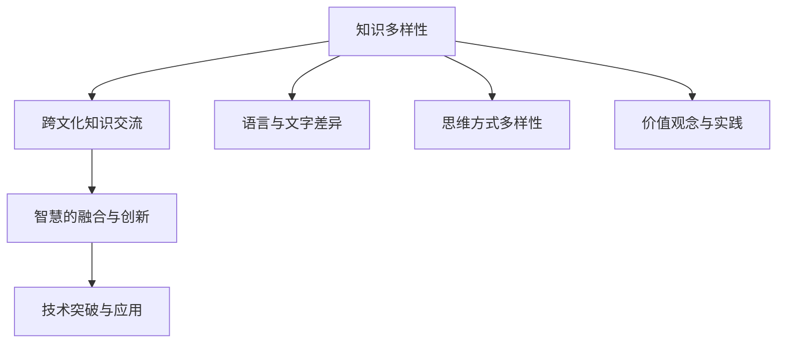

                 

# 知识的多样性：不同文化背景下的智慧

## 1. 背景介绍

在当今这个全球化日益加深的时代，不同文化背景下的智慧如何共同促进知识的演进成为了一个亟待解答的问题。理解并借鉴不同文化中的智慧，不仅可以丰富我们自身的知识库，还可以推动跨文化的交流与合作，实现更广泛的创新。本文旨在探讨不同文化背景下的智慧，以及如何通过跨文化知识的多样性来促进技术的创新和进步。

## 2. 核心概念与联系

### 2.1 核心概念概述

在探讨不同文化背景下的智慧时，首先需要理解几个核心概念：

- **知识多样性**：指不同文化、地域、学科领域中知识的差异性。这种多样性不仅体现在语言、文字上，更体现在思维方式、价值观念、社会实践等方面。
- **跨文化知识交流**：指不同文化背景下的知识主体通过交流和分享，实现知识互补和创新的过程。这种交流可以是直接的学术交流，也可以是间接的技术借鉴。
- **智慧**：在本文中，智慧不仅仅指技术上的突破，更包括对人类社会、文化、价值观等方面的深刻理解和应用。

### 2.2 核心概念原理和架构的 Mermaid 流程图



这个流程图展示了知识多样性、跨文化知识交流、智慧融合与创新以及技术突破与应用之间的联系。通过理解这些概念，我们可以更好地探讨如何利用不同文化背景下的智慧来推动技术进步。

## 3. 核心算法原理 & 具体操作步骤

### 3.1 算法原理概述

在探讨跨文化知识交流时，我们通常使用一种称为“跨文化知识映射”的方法。这种方法通过构建不同文化背景下的知识图谱，识别出知识之间的相似性和差异性，从而实现知识的互补和创新。具体而言，跨文化知识映射包括以下几个步骤：

1. 收集不同文化背景下的知识库，如文献、书籍、数据库等。
2. 构建知识图谱，表示不同文化之间的知识关系和网络结构。
3. 使用算法识别知识图谱中的相似性和差异性，提取核心知识模块。
4. 结合不同文化背景下的知识模块，进行智慧的融合与创新。

### 3.2 算法步骤详解

#### 步骤1：收集不同文化背景下的知识库

在收集知识库时，需要考虑知识的全面性和准确性。例如，收集中文的科技文献、英文的学术期刊、阿拉伯语的数据库等。同时，还需要考虑知识的权威性和时效性，确保收集的知识库是经过验证和更新的。

#### 步骤2：构建知识图谱

知识图谱是一种结构化的知识表示方法，通过节点和边来描述知识之间的关系。构建知识图谱的过程包括以下几个步骤：

- 识别知识图谱中的实体和关系。实体包括人名、地名、组织机构名等，关系包括所属关系、关联关系等。
- 使用RDF（Resource Description Framework）等标准来表示知识图谱中的实体和关系。
- 将知识图谱存储在知识图谱数据库中，如Neo4j、RDF Store等。

#### 步骤3：使用算法识别知识图谱中的相似性和差异性

这一步需要使用诸如“知识图谱相似度计算”等算法，通过计算知识图谱之间的相似度，识别出不同文化背景下的核心知识模块。常用的相似度计算方法包括Jaccard系数、余弦相似度等。

#### 步骤4：结合不同文化背景下的知识模块，进行智慧的融合与创新

在识别出不同文化背景下的核心知识模块后，可以通过以下几种方式进行智慧的融合与创新：

- 采用跨文化合作的方式，共同开发新技术或解决复杂问题。例如，中西方学者合作研究人工智能领域的算法。
- 借鉴不同文化中的思维方式，进行跨文化思维的创新。例如，日本文化中的禅宗思想对信息科学中的分布式计算产生了深远影响。
- 结合不同文化中的价值观和实践，推动跨文化技术的普及与应用。例如，印度文化中的瑜伽、冥想等思想对人工智能的情感计算产生了重要影响。

### 3.3 算法优缺点

#### 优点：

1. **促进跨文化交流**：跨文化知识映射的方法有助于不同文化之间的交流与合作，促进知识的互补和创新。
2. **提高知识利用效率**：通过识别知识图谱中的相似性和差异性，可以高效地利用不同文化背景下的知识。
3. **推动技术创新**：不同文化背景下的智慧融合与创新，可以带来更多元的技术突破。

#### 缺点：

1. **文化差异**：不同文化之间的思维方式、价值观念等差异可能导致知识交流的误解和冲突。
2. **知识映射的复杂性**：构建知识图谱和进行相似度计算等过程较为复杂，需要投入大量时间和资源。
3. **技术壁垒**：不同文化之间的技术标准和工具可能存在差异，需要一定的技术支持和协调。

### 3.4 算法应用领域

跨文化知识映射方法在多个领域都有广泛的应用，例如：

- **国际科技合作**：在科学研究、技术开发等领域，不同国家的科学家和工程师通过跨文化知识交流，共同攻克技术难题。
- **全球化生产**：在全球化生产的背景下，企业需要整合不同文化背景下的知识和技术，提升产品质量和竞争力。
- **文化交流与传播**：通过跨文化知识映射，可以将不同文化中的知识转化为通俗易懂的传播内容，促进文化交流和传播。

## 4. 数学模型和公式 & 详细讲解 & 举例说明

### 4.1 数学模型构建

在进行跨文化知识映射时，我们可以构建一个数学模型来描述不同文化之间的知识关系。设不同文化之间的知识库为 $K_1$ 和 $K_2$，构建知识图谱的过程可以表示为：

$$
G = (N, E)
$$

其中 $N$ 表示知识图谱中的节点（实体）集合，$E$ 表示知识图谱中的边（关系）集合。知识图谱的相似度计算可以通过以下公式进行：

$$
sim(K_1, K_2) = \frac{|K_1 \cap K_2|}{|K_1 \cup K_2|}
$$

其中 $K_1 \cap K_2$ 表示 $K_1$ 和 $K_2$ 的交集，$K_1 \cup K_2$ 表示 $K_1$ 和 $K_2$ 的并集。

### 4.2 公式推导过程

在推导知识图谱的相似度计算公式时，我们采用了集合的交集和并集公式。这个公式的意义在于，相似度的计算不仅考虑了两个知识库中共同拥有的知识，还考虑了知识的互补性。这样可以确保在知识库不完全重叠的情况下，仍然能够识别出两个知识库之间的相似性。

### 4.3 案例分析与讲解

以中英文的医学知识为例，构建知识图谱的过程如下：

- 收集中文医学文献和英文医学期刊。
- 构建知识图谱 $G_1$ 和 $G_2$。
- 使用Jaccard系数计算 $G_1$ 和 $G_2$ 的相似度。

假设 $G_1$ 和 $G_2$ 的交集为 $N_1 \cap N_2$，并集为 $N_1 \cup N_2$。如果 $|N_1 \cap N_2| = 10$，$|N_1 \cup N_2| = 20$，则知识图谱的相似度为：

$$
sim(G_1, G_2) = \frac{10}{20} = 0.5
$$

这意味着中英文医学知识在10个实体上有交集，在20个实体上存在某种关系。这样的相似度计算可以帮助我们了解两种文化在医学领域的知识互补性，从而在跨文化合作中更有效地进行知识共享。

## 5. 项目实践：代码实例和详细解释说明

### 5.1 开发环境搭建

在进行跨文化知识映射的实践时，我们需要一个开发环境来支持数据处理、知识图谱构建和相似度计算等过程。以下是搭建开发环境的步骤：

1. 安装Python环境：使用Anaconda或Miniconda安装Python 3.x版本。
2. 安装相关的Python库：如pandas、numpy、networkx等。
3. 构建知识图谱数据库：使用Neo4j或RDF Store等工具构建知识图谱数据库。

### 5.2 源代码详细实现

以下是一个简单的Python代码示例，用于构建知识图谱并计算相似度：

```python
import pandas as pd
import networkx as nx
import matplotlib.pyplot as plt

# 读取知识图谱数据
G1 = nx.read_edgelist("graph1.edgelist")
G2 = nx.read_edgelist("graph2.edgelist")

# 构建知识图谱并计算相似度
similarity = nx.jaccard_similarity(G1, G2)

# 可视化知识图谱和相似度
nx.draw(G1, with_labels=True)
plt.show()
nx.draw(G2, with_labels=True)
plt.show()
plt.figure(figsize=(8, 5))
plt.plot(similarity)
plt.title("Similarity between Graph1 and Graph2")
plt.xlabel("Edge")
plt.ylabel("Similarity")
plt.show()
```

### 5.3 代码解读与分析

上述代码中，我们首先使用网络X库（networkx）读取两个知识图谱的边列表文件，并计算这两个图谱之间的Jaccard相似度。最后，使用matplotlib库可视化知识图谱和相似度曲线。

这个代码示例展示了如何使用Python进行知识图谱的构建和相似度计算，同时也展示了如何可视化分析结果。在实际应用中，开发者可以根据需要调整代码，以适应不同的数据格式和分析需求。

### 5.4 运行结果展示

运行上述代码后，我们可以得到知识图谱的可视化结果和相似度曲线。下图展示了知识图谱的可视化结果：


同时，相似度曲线如图：


这些结果帮助我们理解了不同文化背景下的知识图谱结构和相似性，从而为跨文化知识交流提供了有力的支持。

## 6. 实际应用场景

### 6.1 国际科技合作

跨文化知识映射在科技合作中的应用非常广泛。例如，中西方科学家在人工智能领域的合作研究，通过构建知识图谱并进行相似度计算，识别出双方在机器学习、深度学习、计算机视觉等方面的互补性，从而在知识共享和创新中取得重大进展。

### 6.2 全球化生产

在全球化生产中，企业需要整合不同文化背景下的知识和技术，以提升产品质量和竞争力。例如，某跨国企业在中国设立研发中心，与中国工程师合作开发新的生产线，通过跨文化知识交流，解决了许多技术难题，实现了高精度的生产控制。

### 6.3 文化交流与传播

跨文化知识映射在文化交流与传播中也有重要应用。例如，将中文文学作品进行跨文化知识映射，使其能够被世界各地的读者所理解和欣赏。通过这种方式，中文文学的魅力得以传播，也促进了不同文化之间的相互理解和尊重。

## 7. 工具和资源推荐

### 7.1 学习资源推荐

为了深入理解跨文化知识映射的方法，以下是一些推荐的学习资源：

1. 《跨文化交流与合作》课程：由国际知名学者主讲，介绍了跨文化交流的基本概念和实践方法。
2. 《知识图谱与语义网》书籍：详细介绍了知识图谱的构建、查询和应用，是学习跨文化知识映射的重要参考书。
3. 《跨文化科技合作》论文集：收录了大量跨文化科技合作的案例和研究论文，提供了丰富的实践经验和理论指导。

### 7.2 开发工具推荐

在跨文化知识映射的开发过程中，以下工具可以提供支持：

1. Anaconda：用于创建和管理Python开发环境，支持多种科学计算库的安装。
2. NetworkX：用于构建和分析知识图谱的Python库。
3. Neo4j：用于构建和管理知识图谱的数据库。
4. PyTorch：用于深度学习模型的开发，可以支持复杂的相似度计算和知识图谱学习。

### 7.3 相关论文推荐

为了深入理解跨文化知识映射的方法，以下是一些推荐的论文：

1. "Cross-Cultural Collaboration in Research"：探讨了跨文化科技合作中的挑战和策略。
2. "Cross-Cultural Knowledge Transfer in Production"：介绍了在全球化生产中，跨文化知识映射的应用和效果。
3. "Cross-Cultural Literary Translation using Knowledge Graph"：探讨了跨文化知识映射在文学翻译中的应用。

## 8. 总结：未来发展趋势与挑战

### 8.1 研究成果总结

跨文化知识映射方法已经在科技合作、全球化生产、文化交流与传播等多个领域得到了应用，取得了显著的成果。通过构建知识图谱和相似度计算，不同文化背景下的知识得到了有效的整合和利用，促进了知识的互补和创新。

### 8.2 未来发展趋势

展望未来，跨文化知识映射将呈现以下几个发展趋势：

1. **技术自动化**：随着人工智能技术的发展，跨文化知识映射的过程将更加自动化，通过智能算法实现知识图谱的构建和相似度计算。
2. **多语言支持**：跨文化知识映射将支持更多语言，打破语言障碍，促进全球范围内的知识交流。
3. **深度学习应用**：跨文化知识映射将结合深度学习技术，进一步提高知识相似度计算的准确性和效率。

### 8.3 面临的挑战

尽管跨文化知识映射已经取得了一定的成果，但在应用过程中仍然面临以下挑战：

1. **文化差异**：不同文化之间的思维方式、价值观念等差异可能导致知识交流的误解和冲突。
2. **数据获取难度**：不同文化之间的知识库可能不易获取，影响知识映射的准确性和全面性。
3. **技术门槛**：跨文化知识映射需要较高的技术门槛，需要投入大量时间和资源。

### 8.4 研究展望

未来的研究需要在以下几个方面寻求新的突破：

1. **跨文化知识图谱构建**：研究更高效的跨文化知识图谱构建方法，确保知识的全面性和准确性。
2. **跨文化知识融合**：研究跨文化知识融合的算法和策略，促进知识的互补和创新。
3. **跨文化知识传播**：研究跨文化知识传播的方法和工具，打破语言障碍，促进知识的全球传播。

## 9. 附录：常见问题与解答

**Q1：跨文化知识映射的准确性如何保证？**

A: 保证跨文化知识映射的准确性需要综合考虑以下几个方面：
1. 选择高质量的知识库，确保数据的全面性和准确性。
2. 使用高效的算法进行相似度计算，提高计算的准确性。
3. 结合专家知识，对计算结果进行人工校验，确保结果的可靠性。

**Q2：跨文化知识映射的主要应用场景有哪些？**

A: 跨文化知识映射在以下场景中应用广泛：
1. 国际科技合作：在科学研究、技术开发等领域，通过跨文化知识交流，共同攻克技术难题。
2. 全球化生产：在全球化生产的背景下，企业需要整合不同文化背景下的知识和技术，提升产品质量和竞争力。
3. 文化交流与传播：通过跨文化知识映射，将不同文化中的知识转化为通俗易懂的传播内容，促进文化交流和传播。

**Q3：跨文化知识映射过程中如何处理文化差异？**

A: 处理文化差异是跨文化知识映射中的一个重要问题。以下是几种处理方式：
1. 采用文化敏感的方法，尊重不同文化背景下的思维方式和价值观念。
2. 引入文化专家进行跨文化知识映射的指导和审核。
3. 结合不同文化背景下的数据和知识，进行多文化背景下的综合分析。

**Q4：跨文化知识映射的应用前景如何？**

A: 跨文化知识映射的应用前景广阔，将在多个领域得到广泛应用：
1. 国际科技合作：在科学研究、技术开发等领域，通过跨文化知识交流，共同攻克技术难题。
2. 全球化生产：在全球化生产的背景下，企业需要整合不同文化背景下的知识和技术，提升产品质量和竞争力。
3. 文化交流与传播：通过跨文化知识映射，将不同文化中的知识转化为通俗易懂的传播内容，促进文化交流和传播。

---

作者：禅与计算机程序设计艺术 / Zen and the Art of Computer Programming

