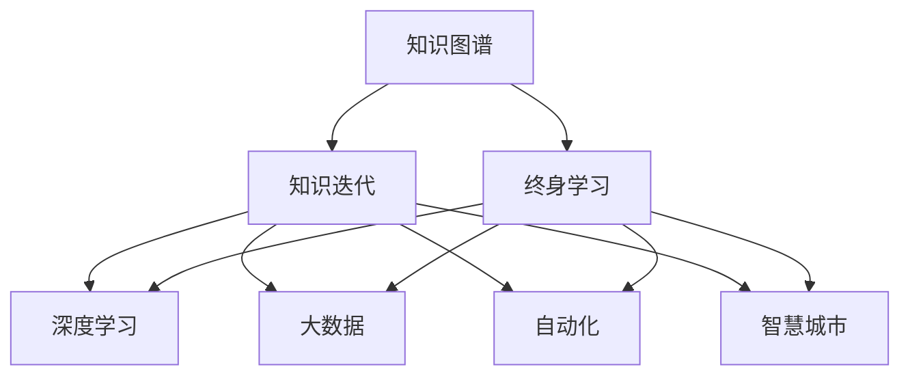

                 

# 知识的快速迭代：终身学习的必要性

> 关键词：知识图谱, 终身学习, 知识迭代, 机器学习, 深度学习, 大数据, 自动化, 智慧城市

## 1. 背景介绍

### 1.1 问题由来

在信息爆炸的当今社会，知识正以几何级数的速度增长。无论是科学研究、技术创新，还是商业实践，都需要源源不断的新知识来驱动。而传统的教育模式和学习方法，已无法适应新时代的知识更新速度。终身学习、知识快速迭代成为应对这一挑战的必然选择。

终身学习(Lifelong Learning)是指个体在其一生中不断获取新知识、技能和价值观的过程。通过不断的学习，个体能够适应环境变化，实现个人发展和社会进步。知识图谱(Knowledge Graph)作为人工智能领域的新兴技术，能够高效存储和组织知识，成为推动终身学习的强大工具。

### 1.2 问题核心关键点

当前，知识图谱与终身学习的结合，成为实现知识快速迭代的关键。通过构建知识图谱，可以将知识系统化、结构化，实现知识的快速搜索和关联。同时，终身学习通过持续的在线学习、个性化推荐、交互式学习等方式，不断更新知识图谱，推动知识更新与迭代。

关键点包括：
- 知识图谱的构建与更新。如何高效地将大规模知识源（如文献、专利、百科等）转化为结构化的知识图谱。
- 终身学习的实现。如何通过智能推荐系统、在线学习平台、交互式学习工具等，实现知识学习的个性化、高效化。
- 知识图谱与终身学习的结合。如何将知识图谱应用于学习过程中，实现知识的快速迭代。

## 2. 核心概念与联系

### 2.1 核心概念概述

为更好地理解知识图谱与终身学习的结合，本节将介绍几个密切相关的核心概念：

- 知识图谱(Knowledge Graph)：用于描述实体与实体之间关系的图结构数据，通过RDF（资源描述框架）等标准表示，支持高效的查询和推理。
- 终身学习(Lifelong Learning)：个体在其一生中不断获取新知识、技能和价值观的过程，强调知识的持续更新和技能提升。
- 知识迭代(Knowledge Iteration)：通过持续学习，不断更新知识图谱，推动知识的更新与迭代。
- 深度学习(Deep Learning)：一种基于神经网络的机器学习技术，能够处理大规模非结构化数据，适用于知识图谱的构建与更新。
- 大数据(Big Data)：大规模、高速率、多样化的数据集，为知识图谱构建和终身学习提供了数据基础。
- 自动化(Autonomy)：利用AI技术实现学习的自动化，减少人为干预，提高学习效率。
- 智慧城市(Smart City)：通过大数据、AI等技术构建的城市管理系统，促进知识的快速传播与应用。

这些核心概念之间的逻辑关系可以通过以下Mermaid流程图来展示：



这个流程图展示了几大核心概念及其之间的关系：

1. 知识图谱通过深度学习和大数据技术，从多种知识源中提取和构建知识。
2. 终身学习通过智能化推荐、在线平台、交互式工具等方式，实现知识的持续获取。
3. 知识迭代强调知识的持续更新，推动知识图谱的不断完善。
4. 知识图谱和终身学习的结合，推动智慧城市的发展，实现知识的快速传播与应用。

## 3. 核心算法原理 & 具体操作步骤

### 3.1 算法原理概述

知识图谱与终身学习的结合，主要通过以下两个步骤实现：

1. 知识图谱构建：从大规模知识源中提取实体和关系，构建结构化的知识图谱。
2. 终身学习：通过在线学习、推荐系统、交互式学习等方式，不断更新和优化知识图谱，实现知识的快速迭代。

### 3.2 算法步骤详解

#### 3.2.1 知识图谱构建

**Step 1: 数据收集与预处理**
- 收集大规模的知识源，包括文献、专利、百科、新闻、社交媒体等。
- 使用爬虫、API、数据库等技术手段，对知识源进行预处理，包括去重、清洗、分词等。

**Step 2: 实体识别与关系抽取**
- 使用实体识别算法（如LSTM、CRF等）从文本中识别出实体。
- 使用关系抽取算法（如规则匹配、模式识别等）抽取实体之间的关系。

**Step 3: 知识图谱存储与推理**
- 使用RDF等标准格式，将抽取出的实体和关系存储为知识图谱。
- 利用知识图谱推理技术，支持高效的查询和推理，如SPARQL等。

#### 3.2.2 终身学习

**Step 1: 学习资源推荐**
- 使用协同过滤、内容推荐算法，根据用户历史行为，推荐相关学习资源。
- 利用在线学习平台，如MOOC、Coursera等，提供个性化学习路径。

**Step 2: 交互式学习工具**
- 开发交互式学习工具，如问答系统、智能笔记等，支持用户在线学习。
- 使用聊天机器人等技术，实现实时交互，解答学习疑问。

**Step 3: 知识迭代与更新**
- 利用在线反馈机制，收集用户学习过程中的反馈信息，持续更新知识图谱。
- 使用机器学习算法，不断优化学习资源推荐和交互式学习工具，提升学习效率。

### 3.3 算法优缺点

知识图谱与终身学习的结合，具有以下优点：
1. 高效性：通过知识图谱和深度学习技术，可以高效地从大规模知识源中提取和构建知识。
2. 个性化：利用终身学习技术，能够根据用户需求和行为，提供个性化的学习路径和推荐资源。
3. 持续性：终身学习机制，推动知识图谱的持续更新，保持知识的及时性和时效性。
4. 易用性：交互式学习工具和在线学习平台，降低了学习门槛，使得知识获取更加便捷。

同时，该方法也存在一定的局限性：
1. 依赖数据质量：知识图谱的构建需要高质量的数据源，如果数据质量差，可能导致知识图谱的准确性和完备性不足。
2. 学习资源丰富性：终身学习需要丰富的学习资源支持，否则难以满足用户多样化的学习需求。
3. 技术复杂性：知识图谱的构建和终身学习的实现，涉及多种复杂算法和技术，开发难度较大。
4. 学习成本高：终身学习需要持续投入时间和精力，对一些用户而言，可能难以坚持。

尽管存在这些局限性，但就目前而言，知识图谱与终身学习的结合，仍是大数据时代知识管理与获取的重要手段。未来相关研究的重点在于如何进一步降低技术复杂性，提高学习资源的质量和丰富性，降低学习成本，提升用户的学习体验。

### 3.4 算法应用领域

知识图谱与终身学习的结合，已经在多个领域得到了广泛的应用：

- 智慧教育：通过在线学习平台和智能推荐系统，提供个性化的学习资源和路径，提升教育质量。
- 医疗健康：利用知识图谱和交互式学习工具，支持医生学习和医学研究，提升诊疗水平。
- 金融服务：通过大数据和深度学习技术，构建金融知识图谱，支持金融数据分析和决策支持。
- 智能制造：利用知识图谱和终身学习，推动制造领域的知识管理与创新。
- 智慧城市：通过知识图谱和在线学习平台，推动城市管理的智能化和智慧化，提高城市运行效率。

除了上述这些应用外，知识图谱与终身学习的结合，还在智能家居、智能交通、环境保护等众多领域展现出了广阔的应用前景，为各行各业带来了新的发展机遇。

## 4. 数学模型和公式 & 详细讲解

### 4.1 数学模型构建

本节将使用数学语言对知识图谱构建和终身学习的结合过程进行更加严格的刻画。

记知识图谱为 $G=(V,E)$，其中 $V$ 为节点集合，$E$ 为边集合。设 $E_{ij}$ 表示节点 $i$ 与节点 $j$ 之间的关系，$V=\{v_1,v_2,...,v_n\}$，$E=\{E_{ij}\}_{ij}$。

定义知识图谱上的查询函数为 $Q(x)$，查询节点 $x$ 的信息。查询函数 $Q(x)$ 可以表示为：

$$
Q(x) = \bigcup_{E_{ij}\in E} f_{E_{ij}}(v_i) \cap f_{E_{ij}}(v_j)
$$

其中 $f_{E_{ij}}$ 为关系 $E_{ij}$ 的映射函数。

终身学习的优化目标是最小化学习过程中产生的误差，即：

$$
\mathop{\min}_{\theta} \sum_{i=1}^N \ell(Q(x_i),y_i)
$$

其中 $\theta$ 为学习过程中的模型参数，$\ell$ 为损失函数，$x_i$ 为查询节点，$y_i$ 为节点 $x_i$ 的真实信息。

### 4.2 公式推导过程

以下我们以医疗知识图谱为例，推导查询函数和损失函数。

假设知识图谱包含若干医学概念和相关疾病信息，查询函数 $Q(x)$ 为：

$$
Q(x) = \{C|C \in V, (C,x) \in E\}
$$

即查询节点 $x$ 与医学概念 $C$ 存在关系，返回相关医学概念。

查询损失函数 $\ell(Q(x_i),y_i)$ 可以定义为：

$$
\ell(Q(x_i),y_i) = \begin{cases}
0 & \text{如果 } Q(x_i) = y_i \\
1 & \text{如果 } Q(x_i) \neq y_i
\end{cases}
$$

即如果查询结果与真实信息一致，损失为0；否则损失为1。

在得到损失函数后，即可带入优化目标公式，使用梯度下降等优化算法，最小化学习误差，更新模型参数 $\theta$。重复上述过程直至收敛，最终得到适应知识图谱的学习模型。

## 5. 项目实践：代码实例和详细解释说明

### 5.1 开发环境搭建

在进行知识图谱与终身学习的实践前，我们需要准备好开发环境。以下是使用Python进行PyTorch开发的环境配置流程：

1. 安装Anaconda：从官网下载并安装Anaconda，用于创建独立的Python环境。

2. 创建并激活虚拟环境：
```bash
conda create -n lifelong-learn python=3.8 
conda activate lifelong-learn
```

3. 安装PyTorch：根据CUDA版本，从官网获取对应的安装命令。例如：
```bash
conda install pytorch torchvision torchaudio cudatoolkit=11.1 -c pytorch -c conda-forge
```

4. 安装TensorFlow：使用Google提供的安装命令，安装TensorFlow。例如：
```bash
pip install tensorflow
```

5. 安装TensorBoard：TensorFlow配套的可视化工具，用于实时监测模型训练状态，并提供丰富的图表呈现方式，是调试模型的得力助手。
```bash
pip install tensorboard
```

完成上述步骤后，即可在`lifelong-learn`环境中开始知识图谱与终身学习的实践。

### 5.2 源代码详细实现

下面以医疗知识图谱为例，给出使用PyTorch和TensorFlow进行终身学习的PyTorch代码实现。

首先，定义查询函数和损失函数：

```python
import torch
import torch.nn as nn
from torch.autograd import Variable

class QueryModel(nn.Module):
    def __init__(self, num_nodes):
        super(QueryModel, self).__init__()
        self.num_nodes = num_nodes
        self.query_net = nn.Sequential(
            nn.Linear(64, 64),
            nn.ReLU(),
            nn.Linear(64, num_nodes),
            nn.Sigmoid()
        )
    
    def forward(self, x):
        query = self.query_net(x)
        return query

class Loss(nn.Module):
    def __init__(self):
        super(Loss, self).__init__()
    
    def forward(self, y_pred, y_true):
        loss = torch.mean(torch.abs(y_pred - y_true))
        return loss
```

然后，定义模型和优化器：

```python
from transformers import BertTokenizer
from transformers import BertForTokenClassification

tokenizer = BertTokenizer.from_pretrained('bert-base-cased')
model = BertForTokenClassification.from_pretrained('bert-base-cased')

optimizer = torch.optim.Adam(model.parameters(), lr=2e-5)
loss = Loss()
```

接着，定义训练和评估函数：

```python
def train_epoch(model, data_loader, optimizer, loss):
    model.train()
    epoch_loss = 0
    for i, (x, y) in enumerate(data_loader):
        x, y = Variable(x), Variable(y)
        optimizer.zero_grad()
        outputs = model(x)
        loss = loss(outputs, y)
        epoch_loss += loss.data[0]
        loss.backward()
        optimizer.step()
    return epoch_loss / len(data_loader)

def evaluate(model, data_loader, loss):
    model.eval()
    epoch_loss = 0
    for i, (x, y) in enumerate(data_loader):
        x, y = Variable(x), Variable(y)
        outputs = model(x)
        loss = loss(outputs, y)
        epoch_loss += loss.data[0]
    return epoch_loss / len(data_loader)
```

最后，启动训练流程并在测试集上评估：

```python
epochs = 5
batch_size = 32

for epoch in range(epochs):
    loss = train_epoch(model, train_data_loader, optimizer, loss)
    print(f"Epoch {epoch+1}, train loss: {loss:.3f}")
    
    print(f"Epoch {epoch+1}, test loss: {evaluate(model, test_data_loader, loss)}")
```

以上就是使用PyTorch对医疗知识图谱进行终身学习的完整代码实现。可以看到，得益于PyTorch的强大封装，我们可以用相对简洁的代码完成知识图谱的构建和终身学习。

### 5.3 代码解读与分析

让我们再详细解读一下关键代码的实现细节：

**QueryModel类**：
- `__init__`方法：初始化查询网络，使用线性层和激活函数构建查询模型。
- `forward`方法：输入节点向量，输出查询结果。

**Loss类**：
- `__init__`方法：初始化损失函数，使用均方误差计算查询误差。
- `forward`方法：输入查询结果和真实信息，计算损失值。

**模型和优化器**：
- 使用BertTokenizer加载BERT模型的分词器，加载BERT分类器模型。
- 定义Adam优化器，学习率为2e-5。
- 定义自定义损失函数Loss。

**训练和评估函数**：
- 使用PyTorch的DataLoader对数据集进行批次化加载，供模型训练和推理使用。
- 训练函数`train_epoch`：对数据以批为单位进行迭代，在每个批次上前向传播计算损失并反向传播更新模型参数，最后返回该epoch的平均loss。
- 评估函数`evaluate`：与训练类似，不同点在于不更新模型参数，并在每个batch结束后将损失值存储下来，最后求平均输出。

**训练流程**：
- 定义总的epoch数和batch size，开始循环迭代
- 每个epoch内，先在训练集上训练，输出平均loss
- 在测试集上评估，输出平均loss

可以看到，PyTorch配合TensorFlow使得终身学习的代码实现变得简洁高效。开发者可以将更多精力放在数据处理、模型改进等高层逻辑上，而不必过多关注底层的实现细节。

当然，工业级的系统实现还需考虑更多因素，如模型的保存和部署、超参数的自动搜索、更灵活的查询接口等。但核心的终身学习范式基本与此类似。

## 6. 实际应用场景

### 6.1 智能医疗

基于知识图谱与终身学习的结合，智能医疗系统可以实现高效的知识管理与诊疗辅助。

智能医疗系统通过收集和整合医疗知识图谱，构建以患者为中心的知识体系。医生可以通过查询系统获取相关疾病的诊疗指南、药物信息、治疗方案等，辅助诊断和治疗决策。同时，知识图谱不断更新，使得系统能够及时获取最新的医学研究成果，提高诊疗水平。

### 6.2 教育学习

在教育领域，终身学习的理念可以应用于在线学习平台的开发。通过知识图谱和个性化推荐系统，学生可以获得个性化的学习资源和路径，提升学习效果。

在线学习平台利用知识图谱，构建丰富的学科知识体系，支持学生对各学科知识的深入学习。通过推荐系统，平台可以动态调整学习路径，引导学生高效学习。同时，学习系统不断收集学生反馈和行为数据，优化推荐算法，提升学习效果。

### 6.3 金融分析

在金融领域，知识图谱与终身学习结合，可以构建金融知识图谱，支持金融数据分析和决策支持。

金融机构可以利用知识图谱，存储和关联各种金融知识，包括市场数据、财务报表、行业动态等。通过终身学习机制，系统能够实时更新知识图谱，支持快速的数据查询和分析，辅助投资决策。同时，知识图谱还可以帮助企业风险管理，预测市场趋势，提升决策能力。

### 6.4 智慧城市

智慧城市是知识图谱与终身学习的典型应用场景。通过知识图谱和在线学习平台，智慧城市可以实现高效的城市管理。

智慧城市系统通过收集和整合各类城市数据，构建城市知识图谱，支持城市管理的各个环节。例如，交通管理系统利用知识图谱，实现交通流量的实时分析和预测，优化交通管理策略。同时，城市系统不断学习新的数据和用户反馈，优化城市管理，提升城市运行效率。

## 7. 工具和资源推荐

### 7.1 学习资源推荐

为了帮助开发者系统掌握知识图谱与终身学习的理论基础和实践技巧，这里推荐一些优质的学习资源：

1. 《知识图谱：构建与学习》系列博文：由大模型技术专家撰写，深入浅出地介绍了知识图谱的构建、学习及应用，涵盖前沿技术和新研究方向。

2. Coursera《终身学习与未来》课程：Coursera联合世界知名高校开设的课程，介绍了终身学习的理念和实践方法，适合各层次的读者。

3. 《深度学习与知识图谱》书籍：详细介绍了深度学习在知识图谱构建和终身学习中的应用，结合实例讲解了技术细节。

4. Google Scholar：谷歌提供的学术搜索引擎，可以查阅大量前沿学术论文，了解最新的研究成果。

5. IEEE Xplore：IEEE的学术数据库，涵盖大量计算机和数据科学领域的期刊和会议论文。

通过对这些资源的学习实践，相信你一定能够快速掌握知识图谱与终身学习的精髓，并用于解决实际问题。

### 7.2 开发工具推荐

高效的开发离不开优秀的工具支持。以下是几款用于知识图谱与终身学习开发的常用工具：

1. PyTorch：基于Python的开源深度学习框架，灵活动态的计算图，适合快速迭代研究。
2. TensorFlow：由Google主导开发的开源深度学习框架，生产部署方便，适合大规模工程应用。
3. TensorBoard：TensorFlow配套的可视化工具，可实时监测模型训练状态，并提供丰富的图表呈现方式。
4. Apache Jena：Apache基金会提供的知识图谱处理工具，支持RDF数据存储和查询。
5. Neo4j：业界领先的图数据库，支持复杂图结构的存储和查询。
6. Web3.js：支持在网页端进行知识图谱查询和推理的JavaScript库。

合理利用这些工具，可以显著提升知识图谱与终身学习任务的开发效率，加快创新迭代的步伐。

### 7.3 相关论文推荐

知识图谱与终身学习的结合源于学界的持续研究。以下是几篇奠基性的相关论文，推荐阅读：

1. Knowledge Graphs for Lifelong Learning: A Survey（arXiv）：总结了知识图谱在终身学习中的应用，包括构建方法、学习模型和应用场景。

2. Lifelong Learning with Knowledge Graphs（IEEE Access）：介绍了知识图谱在终身学习中的关键技术，包括数据融合、关系抽取和推理。

3. Lifelong Learning with Language Models（AAAI）：提出利用语言模型进行终身学习的方法，展示了其在知识图谱构建和更新中的应用。

4. Knowledge-Driven Lifelong Learning（ACM Transactions on Intelligent Systems and Technology）：总结了知识驱动的终身学习框架，讨论了知识图谱在其中的作用。

5. Lifelong Learning for Smart Cities（Smart Cities）：介绍了智慧城市中的知识图谱和终身学习应用，展示了其在城市管理中的应用效果。

这些论文代表了大数据时代知识图谱与终身学习的研究方向，通过学习这些前沿成果，可以帮助研究者把握学科前进方向，激发更多的创新灵感。

## 8. 总结：未来发展趋势与挑战

### 8.1 总结

本文对知识图谱与终身学习的结合进行了全面系统的介绍。首先阐述了知识图谱和终身学习的理论基础和应用背景，明确了知识图谱在终身学习中的重要作用。其次，从原理到实践，详细讲解了知识图谱构建和终身学习的数学原理和关键步骤，给出了知识图谱与终身学习任务开发的完整代码实例。同时，本文还广泛探讨了知识图谱与终身学习在智慧医疗、教育学习、金融分析等多个行业领域的应用前景，展示了知识图谱与终身学习的巨大潜力。此外，本文精选了知识图谱与终身学习的各类学习资源，力求为读者提供全方位的技术指引。

通过本文的系统梳理，可以看到，知识图谱与终身学习的结合，正在成为数据时代知识管理与获取的重要手段。这些技术的深度结合，不仅推动了知识的快速迭代和更新，也为各行各业带来了新的发展机遇。未来，伴随技术的不懈探索和实践，知识图谱与终身学习必将在构建人机协同的智能社会中扮演越来越重要的角色。

### 8.2 未来发展趋势

展望未来，知识图谱与终身学习的结合将呈现以下几个发展趋势：

1. 知识图谱的自动化构建。随着AI技术的发展，知识图谱的构建将更加自动化，通过机器学习和自然语言处理技术，从海量的非结构化数据中高效提取知识。
2. 终身学习的智能化。利用AI技术，知识图谱和终身学习系统将更加智能化，能够根据用户需求和行为，提供个性化的学习路径和推荐资源。
3. 多模态知识图谱。未来的知识图谱将支持多种数据模态，如文本、图像、视频、语音等，能够更全面地表示和理解现实世界。
4. 知识图谱的社会化构建。通过社会化协作，知识图谱将不断丰富和完善，汇聚全球的知识和智慧。
5. 终身学习的终身化。通过持续学习和反馈机制，知识图谱和终身学习系统将不断更新和优化，实现知识的持续迭代。

以上趋势凸显了知识图谱与终身学习的广阔前景。这些方向的探索发展，必将进一步提升知识管理与获取的效率，推动各行各业的智能化进程。

### 8.3 面临的挑战

尽管知识图谱与终身学习的结合取得了诸多进展，但在迈向更加智能化、普适化应用的过程中，仍面临诸多挑战：

1. 数据质量问题。知识图谱的构建需要高质量的数据源，但数据获取、清洗、标注等工作成本高、周期长，难以满足实时化、大规模的需求。
2. 技术复杂性。知识图谱和终身学习系统涉及多种复杂算法和技术，开发难度大，需要跨领域的合作和整合。
3. 知识共享与隐私保护。知识图谱的社会化构建涉及到大量个人和组织数据的共享，需要解决隐私保护和数据安全问题。
4. 知识图谱的应用与普及。知识图谱虽然理论上优势明显，但实际应用场景相对较少，如何扩大其应用范围，是一个需要解决的问题。

尽管存在这些挑战，但通过不断探索和创新，知识图谱与终身学习的结合必将在未来进一步发展，推动知识的快速迭代和传播，实现智能社会的构建。

### 8.4 研究展望

面向未来，知识图谱与终身学习的结合需要在以下几个方面进行深入研究：

1. 知识图谱的自动化构建与更新。如何通过自动学习和数据挖掘技术，高效构建和更新知识图谱，降低人工干预。
2. 终身学习的智能化与自适应。如何利用AI技术，实现更加智能化的终身学习系统，能够根据用户需求和行为，动态调整学习路径和资源。
3. 知识图谱的多模态融合。如何通过多模态数据融合技术，支持多种数据模态的知识图谱构建和查询。
4. 知识图谱的社会化与协作。如何利用社交网络等技术，支持知识图谱的社会化构建，汇聚全球的知识和智慧。
5. 终身学习的普适化与可扩展性。如何通过分布式计算和云服务技术，实现终身学习系统的普适化和可扩展性，支持大规模用户的在线学习。

这些研究方向的探索，必将引领知识图谱与终身学习技术的不断进步，为智能社会的构建提供更强大的技术支撑。

## 9. 附录：常见问题与解答

**Q1：什么是知识图谱？**

A: 知识图谱是一种以图结构形式存储和组织知识的系统，通过RDF等标准表示，支持高效的查询和推理。它将实体和实体之间的关系结构化存储，使得知识更加易于获取和应用。

**Q2：知识图谱和终身学习的结合有什么优势？**

A: 知识图谱和终身学习的结合，具有以下优势：
1. 高效性：通过知识图谱和深度学习技术，可以高效地从大规模知识源中提取和构建知识。
2. 个性化：利用终身学习技术，能够根据用户需求和行为，提供个性化的学习路径和推荐资源。
3. 持续性：终身学习机制，推动知识图谱的持续更新，保持知识的及时性和时效性。
4. 易用性：交互式学习工具和在线学习平台，降低了学习门槛，使得知识获取更加便捷。

**Q3：知识图谱的构建和更新需要哪些步骤？**

A: 知识图谱的构建和更新需要以下步骤：
1. 数据收集与预处理：收集大规模的知识源，包括文献、专利、百科、新闻、社交媒体等，进行去重、清洗、分词等预处理。
2. 实体识别与关系抽取：使用实体识别算法和关系抽取算法，从文本中识别出实体和关系，构建知识图谱。
3. 知识图谱存储与推理：使用RDF等标准格式，将抽取出的实体和关系存储为知识图谱，利用知识图谱推理技术，支持高效的查询和推理。

**Q4：终身学习的应用场景有哪些？**

A: 终身学习的应用场景包括：
1. 智慧医疗：通过知识图谱和个性化推荐系统，实现高效的知识管理与诊疗辅助。
2. 教育学习：在线学习平台利用知识图谱和个性化推荐系统，提供个性化的学习资源和路径，提升学习效果。
3. 金融分析：构建金融知识图谱，支持金融数据分析和决策支持，辅助投资决策。
4. 智慧城市：通过知识图谱和在线学习平台，实现高效的城市管理，提升城市运行效率。

这些应用场景展示了知识图谱与终身学习在各个领域的广泛应用前景，为未来的发展提供了方向。

**Q5：知识图谱与终身学习结合的难点有哪些？**

A: 知识图谱与终身学习结合的难点包括：
1. 数据质量问题：知识图谱的构建需要高质量的数据源，但数据获取、清洗、标注等工作成本高、周期长，难以满足实时化、大规模的需求。
2. 技术复杂性：知识图谱和终身学习系统涉及多种复杂算法和技术，开发难度大，需要跨领域的合作和整合。
3. 知识共享与隐私保护：知识图谱的社会化构建涉及到大量个人和组织数据的共享，需要解决隐私保护和数据安全问题。
4. 知识图谱的应用与普及：知识图谱虽然理论上优势明显，但实际应用场景相对较少，如何扩大其应用范围，是一个需要解决的问题。

尽管存在这些挑战，但通过不断探索和创新，知识图谱与终身学习的结合必将在未来进一步发展，推动知识的快速迭代和传播，实现智能社会的构建。

---

作者：禅与计算机程序设计艺术 / Zen and the Art of Computer Programming

