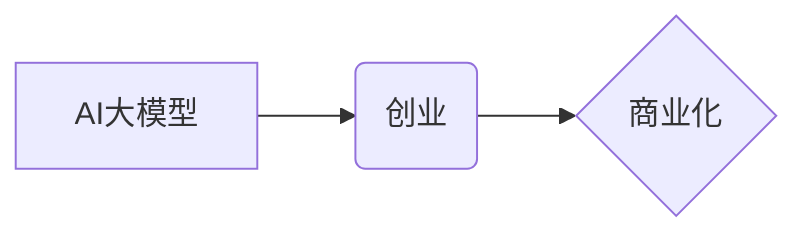

> AI大模型，创业，泡沫，金矿，商业化，应用场景，技术挑战，未来趋势

## 1. 背景介绍

近年来，人工智能（AI）技术突飞猛进，特别是大模型的出现，为各行各业带来了前所未有的机遇。大模型，指的是参数规模庞大、训练数据海量的人工智能模型，能够在自然语言处理、计算机视觉、语音识别等领域展现出强大的能力。

随着大模型技术的不断发展，越来越多的创业者看到了其中的商机，涌入AI大模型的创业领域。一些公司利用大模型技术开发了各种创新产品和服务，例如智能客服、自动写作、代码生成等，取得了显著的商业成功。然而，也有一些创业项目由于技术难度高、商业模式不明确等原因，最终走向失败。

因此，对于创业者来说，如何判断AI大模型创业是否为泡沫，还是真正的金矿，是一个至关重要的问题。

## 2. 核心概念与联系

**2.1 AI大模型**

AI大模型是指参数规模庞大、训练数据海量的人工智能模型。其核心特点是：

* **规模化：** 大模型拥有数亿甚至数十亿的参数，远超传统机器学习模型。
* **泛化能力强：** 由于训练数据量大，大模型能够学习到更丰富的知识和模式，从而在不同任务上表现出更强的泛化能力。
* **多模态学习：** 一些大模型能够处理多种数据类型，例如文本、图像、音频等，实现跨模态的学习和理解。

**2.2 创业**

创业是指创立新企业，开发新产品或服务，并将其推向市场的过程。

**2.3 商业化**

商业化是指将技术成果转化为可盈利的产品或服务，并实现商业价值。

**2.4 关系图**



## 3. 核心算法原理 & 具体操作步骤

**3.1 算法原理概述**

大模型的训练主要基于深度学习算法，特别是Transformer架构。Transformer是一种基于注意力机制的神经网络架构，能够有效地捕捉文本序列中的长距离依赖关系。

**3.2 算法步骤详解**

1. **数据预处理：** 将原始数据进行清洗、格式化、编码等操作，使其能够被模型理解。
2. **模型构建：** 根据任务需求，选择合适的Transformer架构，并设置模型参数。
3. **模型训练：** 使用训练数据，通过反向传播算法，调整模型参数，使其能够准确地预测目标输出。
4. **模型评估：** 使用测试数据，评估模型的性能，例如准确率、召回率、F1-score等。
5. **模型部署：** 将训练好的模型部署到生产环境中，用于实际应用。

**3.3 算法优缺点**

**优点：**

* 泛化能力强
* 能够处理长距离依赖关系
* 多模态学习能力

**缺点：**

* 训练成本高
* 训练时间长
* 需要大量的数据

**3.4 算法应用领域**

* 自然语言处理：文本分类、情感分析、机器翻译、文本摘要等
* 计算机视觉：图像识别、目标检测、图像分割等
* 语音识别：语音转文本、语音合成等
* 代码生成：自动生成代码

## 4. 数学模型和公式 & 详细讲解 & 举例说明

**4.1 数学模型构建**

大模型的训练过程本质上是一个优化问题，目标是找到一个能够最小化损失函数的参数集。损失函数衡量模型预测结果与真实结果之间的差异。

**4.2 公式推导过程**

损失函数的计算公式通常是基于交叉熵或均方误差等指标。

**交叉熵损失函数：**

$$
L = -\sum_{i=1}^{N} y_i \log(\hat{y}_i)
$$

其中：

* $N$ 是样本数量
* $y_i$ 是真实标签
* $\hat{y}_i$ 是模型预测的概率

**均方误差损失函数：**

$$
L = \frac{1}{N} \sum_{i=1}^{N} (y_i - \hat{y}_i)^2
$$

**4.3 案例分析与讲解**

假设我们训练一个文本分类模型，目标是将文本分类为正类或负类。我们可以使用交叉熵损失函数来衡量模型的性能。

如果模型预测的概率为0.8，而真实标签为正类，则损失函数的值为：

$$
L = -1 \log(0.8) = 0.223
$$

## 5. 项目实践：代码实例和详细解释说明

**5.1 开发环境搭建**

* Python 3.7+
* TensorFlow/PyTorch
* CUDA/cuDNN

**5.2 源代码详细实现**

```python
import tensorflow as tf

# 定义模型结构
model = tf.keras.Sequential([
    tf.keras.layers.Embedding(input_dim=10000, output_dim=128),
    tf.keras.layers.LSTM(units=64),
    tf.keras.layers.Dense(units=1, activation='sigmoid')
])

# 编译模型
model.compile(optimizer='adam', loss='binary_crossentropy', metrics=['accuracy'])

# 训练模型
model.fit(x_train, y_train, epochs=10)

# 评估模型
loss, accuracy = model.evaluate(x_test, y_test)
print('Loss:', loss)
print('Accuracy:', accuracy)
```

**5.3 代码解读与分析**

* 首先，我们定义了一个简单的文本分类模型，使用Embedding层将单词嵌入到向量空间，LSTM层捕捉文本序列中的长距离依赖关系，Dense层输出分类结果。
* 然后，我们使用Adam优化器、二分类交叉熵损失函数和准确率作为评估指标，对模型进行训练。
* 最后，我们使用测试数据评估模型的性能。

**5.4 运行结果展示**

训练完成后，我们可以查看模型的损失值和准确率。

## 6. 实际应用场景

**6.1 智能客服**

大模型可以用于构建智能客服系统，自动回答用户常见问题，提高客户服务效率。

**6.2 自动写作**

大模型可以用于自动生成各种文本内容，例如新闻报道、广告文案、产品描述等。

**6.3 代码生成**

大模型可以用于自动生成代码，提高开发效率。

**6.4 未来应用展望**

随着大模型技术的不断发展，其应用场景将更加广泛，例如：

* 个性化教育
* 医疗诊断
* 科学研究

## 7. 工具和资源推荐

**7.1 学习资源推荐**

* **书籍：**
    * 《深度学习》
    * 《自然语言处理》
* **在线课程：**
    * Coursera
    * edX
* **开源项目：**
    * TensorFlow
    * PyTorch

**7.2 开发工具推荐**

* **IDE：**
    * PyCharm
    * VS Code
* **云平台：**
    * AWS
    * Google Cloud
    * Azure

**7.3 相关论文推荐**

* **BERT：** Devlin et al. (2018)
* **GPT-3：** Brown et al. (2020)
* **T5：** Raffel et al. (2019)

## 8. 总结：未来发展趋势与挑战

**8.1 研究成果总结**

近年来，AI大模型取得了显著的进展，在各种任务上展现出强大的能力。

**8.2 未来发展趋势**

* 模型规模进一步扩大
* 多模态学习能力增强
* 训练效率提升
* 伦理和安全问题得到重视

**8.3 面临的挑战**

* 训练成本高
* 数据获取困难
* 算法解释性差
* 伦理和安全问题

**8.4 研究展望**

未来，AI大模型的研究将更加注重模型的效率、可解释性和安全性，并探索其在更多领域的应用。

## 9. 附录：常见问题与解答

**9.1 如何选择合适的AI大模型？**

选择合适的AI大模型需要根据具体的应用场景和需求进行考虑，例如模型规模、训练数据、任务类型等。

**9.2 如何训练自己的AI大模型？**

训练自己的AI大模型需要具备一定的技术基础和资源支持，包括数据、计算资源和开发工具。

**9.3 AI大模型的伦理和安全问题有哪些？**

AI大模型的伦理和安全问题包括数据隐私、算法偏见、恶意攻击等。


作者：禅与计算机程序设计艺术 / Zen and the Art of Computer Programming 
<end_of_turn>