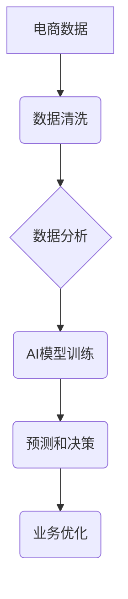

> 电商数据分析，人工智能，机器学习，深度学习，推荐系统，预测模型，客户画像

## 1. 背景介绍

在当今数字化时代，电商行业蓬勃发展，数据成为企业最重要的资产。电商企业每天都会产生海量的数据，包括用户行为、商品信息、交易记录等。如何有效地分析这些数据，挖掘其中的价值，对于电商企业的运营、营销和发展至关重要。传统的数据分析方法往往难以应对海量数据的处理和复杂分析需求，而人工智能（AI）技术的出现为电商数据分析带来了新的机遇。

AI技术，特别是机器学习和深度学习，能够自动学习数据中的模式和规律，并进行预测和决策，为电商企业提供更精准、更智能的数据分析解决方案。

## 2. 核心概念与联系

### 2.1 电商数据分析

电商数据分析是指利用数据挖掘、统计分析、机器学习等技术，对电商平台产生的各种数据进行收集、清洗、分析和挖掘，以获取用户行为、市场趋势、商品销售等有价值的信息，从而帮助电商企业优化运营、提升营销效果、提高客户满意度。

### 2.2 人工智能（AI）

人工智能（AI）是指模拟人类智能行为的计算机系统。AI技术涵盖了多个领域，包括机器学习、深度学习、自然语言处理、计算机视觉等。

### 2.3 机器学习（ML）

机器学习是AI的一个重要分支，它通过算法训练模型，使模型能够从数据中学习，并进行预测或决策。机器学习算法可以分为监督学习、无监督学习和强化学习三大类。

### 2.4 深度学习（DL）

深度学习是机器学习的一个子领域，它利用多层神经网络来模拟人类大脑的学习过程，能够处理更复杂的数据，并取得更优的性能。

**电商数据分析与AI的联系**

电商数据分析与AI技术相互促进，AI技术为电商数据分析提供了强大的工具和手段，而电商数据分析又为AI技术的训练和应用提供了丰富的样本数据。



## 3. 核心算法原理 & 具体操作步骤

### 3.1 算法原理概述

在电商数据分析中，常用的机器学习算法包括：

* **推荐系统算法:** 
    * 基于协同过滤的算法：通过分析用户历史行为和商品相似度，推荐用户可能感兴趣的商品。
    * 基于内容过滤的算法：根据用户偏好和商品属性，推荐用户可能喜欢的商品。
    * 深度学习推荐算法：利用深度神经网络，学习用户和商品之间的复杂关系，进行更精准的推荐。
* **预测模型算法:** 
    * 回归算法：预测连续型变量，例如商品销量、用户购买金额等。
    * 分类算法：预测离散型变量，例如用户是否会购买商品、用户是否会流失等。
* **客户画像算法:** 
    * 聚类算法：将用户根据相似特征进行分组，构建用户画像。
    * 关联规则挖掘算法：发现用户购买行为之间的关联关系，挖掘用户需求。

### 3.2 算法步骤详解

以推荐系统算法为例，详细说明其操作步骤：

1. **数据收集:** 收集用户行为数据、商品信息数据等。
2. **数据预处理:** 清洗数据、处理缺失值、转换数据格式等。
3. **特征工程:** 从原始数据中提取特征，例如用户购买历史、商品类别、用户评分等。
4. **模型训练:** 选择合适的推荐算法，训练模型，并评估模型性能。
5. **模型部署:** 将训练好的模型部署到线上环境，进行实时推荐。
6. **模型监控:** 持续监控模型性能，并进行模型更新和优化。

### 3.3 算法优缺点

不同的算法具有不同的优缺点，需要根据实际应用场景选择合适的算法。

* **协同过滤算法:** 优点：能够发现用户之间的隐性关系，推荐个性化商品。缺点：数据稀疏性问题，冷启动问题。
* **内容过滤算法:** 优点：能够根据用户偏好推荐相关商品，避免数据稀疏性问题。缺点：推荐结果可能过于单一，缺乏多样性。
* **深度学习推荐算法:** 优点：能够学习用户和商品之间的复杂关系，推荐更精准的商品。缺点：训练数据量大，计算资源消耗高。

### 3.4 算法应用领域

机器学习算法在电商数据分析中应用广泛，例如：

* **商品推荐:** 根据用户历史行为和商品信息，推荐用户可能感兴趣的商品。
* **用户画像:** 分析用户行为数据，构建用户画像，了解用户需求和偏好。
* **价格预测:** 预测商品价格走势，帮助企业制定定价策略。
* **库存管理:** 预测商品需求，优化库存管理，减少库存积压。
* **欺诈检测:** 检测用户交易行为中的异常情况，防止欺诈行为。

## 4. 数学模型和公式 & 详细讲解 & 举例说明

### 4.1 数学模型构建

在机器学习算法中，数学模型是算法的核心，它描述了算法的学习过程和预测过程。

例如，在协同过滤算法中，可以使用矩阵分解模型来表示用户和商品之间的关系。

假设有 $m$ 个用户和 $n$ 个商品，可以构建一个 $m \times n$ 的用户-商品交互矩阵 $R$，其中 $R_{ij}$ 表示用户 $i$ 对商品 $j$ 的评分。

矩阵分解模型将用户-商品交互矩阵分解成两个低维矩阵 $U$ 和 $V$，其中 $U$ 是用户特征矩阵，$V$ 是商品特征矩阵。

$$R \approx U V^T$$

其中，$U$ 是 $m \times k$ 的矩阵，$V$ 是 $n \times k$ 的矩阵，$k$ 是隐特征维度。

### 4.2 公式推导过程

矩阵分解模型的目标是找到最优的 $U$ 和 $V$，使得 $U V^T$ 与真实交互矩阵 $R$ 的误差最小。

可以使用均方误差 (MSE) 来衡量误差：

$$MSE = \frac{1}{m \cdot n} \sum_{i=1}^{m} \sum_{j=1}^{n} (R_{ij} - U_{i} V_{j}^T)^2$$

可以使用梯度下降算法来优化 $U$ 和 $V$，使得 MSE 最小。

### 4.3 案例分析与讲解

假设有一个电商平台，用户购买了以下商品：

| 用户 | 商品 A | 商品 B | 商品 C |
|---|---|---|---|
| 用户 1 | 5 | 3 | 4 |
| 用户 2 | 4 | 5 | 2 |
| 用户 3 | 3 | 2 | 5 |

可以使用矩阵分解模型来分析用户和商品之间的关系。

通过训练模型，可以得到用户特征矩阵 $U$ 和商品特征矩阵 $V$。

例如，用户 1 的特征向量可能是 $[0.8, 0.5, 0.7]$，商品 A 的特征向量可能是 $[0.9, 0.2, 0.1]$。

根据这些特征向量，可以预测用户 1 对商品 B 的评分。

$$U_{1} V_{B}^T = 0.8 \cdot 0.2 + 0.5 \cdot 0.5 + 0.7 \cdot 0.1 = 0.31$$

## 5. 项目实践：代码实例和详细解释说明

### 5.1 开发环境搭建

* Python 3.x
* TensorFlow 或 PyTorch
* Jupyter Notebook

### 5.2 源代码详细实现

```python
import tensorflow as tf

# 定义模型
model = tf.keras.Sequential([
    tf.keras.layers.Dense(64, activation='relu', input_shape=(n_users,)),
    tf.keras.layers.Dense(n_items)
])

# 编译模型
model.compile(optimizer='adam', loss='mse')

# 训练模型
model.fit(user_features, item_features, epochs=10)

# 预测评分
predicted_ratings = model.predict(user_features)
```

### 5.3 代码解读与分析

* `tf.keras.Sequential` 定义一个顺序模型，将多个层级连接起来。
* `tf.keras.layers.Dense` 定义一个全连接层，每个神经元都连接到上一层的每个神经元。
* `activation='relu'` 使用ReLU激活函数，引入非线性。
* `input_shape=(n_users,)` 指定输入数据的形状，为用户特征矩阵。
* `optimizer='adam'` 使用Adam优化器，更新模型参数。
* `loss='mse'` 使用均方误差作为损失函数，衡量预测评分与真实评分之间的误差。
* `epochs=10` 指定训练轮数。
* `model.predict()` 使用训练好的模型预测评分。

### 5.4 运行结果展示

训练完成后，可以将预测评分与真实评分进行比较，评估模型性能。

可以使用均方根误差 (RMSE) 来衡量模型性能：

$$RMSE = \sqrt{\frac{1}{m \cdot n} \sum_{i=1}^{m} \sum_{j=1}^{n} (R_{ij} - \hat{R}_{ij})^2}$$

其中，$R_{ij}$ 是真实评分，$\hat{R}_{ij}$ 是预测评分。

## 6. 实际应用场景

### 6.1 商品推荐

电商平台可以利用机器学习算法，根据用户的历史购买记录、浏览记录、评分等信息，推荐用户可能感兴趣的商品。

例如，当用户浏览了某个品牌的服装时，电商平台可以推荐该用户其他同品牌的服装，或者推荐其他用户购买过该品牌服装的用户也购买过的商品。

### 6.2 用户画像

电商平台可以利用机器学习算法，分析用户的行为数据，构建用户画像，了解用户的兴趣爱好、消费习惯、购买偏好等信息。

例如，可以将用户根据年龄、性别、购买频率、购买金额等特征进行分组，构建不同类型的用户画像。

### 6.3 价格预测

电商平台可以利用机器学习算法，预测商品价格走势，帮助企业制定定价策略。

例如，可以根据商品的历史价格、市场供求关系、季节性因素等信息，预测商品未来价格的变化趋势。

### 6.4 库存管理

电商平台可以利用机器学习算法，预测商品需求，优化库存管理，减少库存积压。

例如，可以根据商品的历史销量、季节性因素、促销活动等信息，预测未来商品需求量，并根据预测结果调整库存水平。

### 6.5 欺诈检测

电商平台可以利用机器学习算法，检测用户交易行为中的异常情况，防止欺诈行为。

例如，可以根据用户的交易记录、IP地址、设备信息等特征，识别可能存在的欺诈行为。

## 7. 工具和资源推荐

### 7.1 学习资源推荐

* **书籍:**
    * 《Python机器学习》
    * 《深度学习》
    * 《机器学习实战》
* **在线课程:**
    * Coursera: 机器学习
    * edX: 深度学习
    * Udacity: 机器学习工程师

### 7.2 开发工具推荐

* **Python:** 
    * TensorFlow
    * PyTorch
    * scikit-learn
* **数据可视化工具:**
    * Matplotlib
    * Seaborn
    * Plotly

### 7.3 相关论文推荐

* **协同过滤:**
    * "Collaborative Filtering: A User-Based Approach"
    * "Memory-Based Collaborative Filtering"
* **深度学习推荐:**
    * "Deep Learning for Recommender Systems"
    * "Neural Collaborative Filtering"

## 8. 总结：未来发展趋势与挑战

### 8.1 研究成果总结

AI技术在电商数据分析领域取得了显著的成果，例如推荐系统、用户画像、价格预测等应用取得了很好的效果。