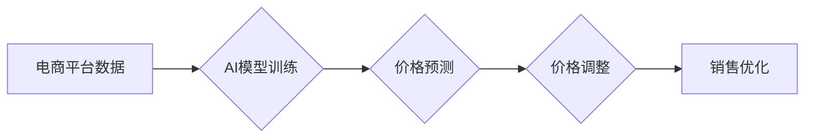

> 电商价格策略，人工智能，机器学习，深度学习，预测模型，优化算法，数据分析

## 1. 背景介绍

在当今激烈的电商市场竞争中，制定有效的价格策略是企业获得利润和提升市场份额的关键。传统的定价方法往往依赖于经验和主观判断，难以适应市场变化的快速节奏和消费者需求的多样性。随着人工智能（AI）技术的快速发展，AI在电商价格策略中的应用已成为一个重要的趋势。

AI能够通过对海量数据的分析和学习，识别出价格与销售额之间的复杂关系，并预测未来市场趋势，从而帮助电商企业制定更精准、更有效的定价策略。

## 2. 核心概念与联系

### 2.1 电商价格策略

电商价格策略是指电商企业在制定商品价格时遵循的一系列规则和原则，旨在实现企业的利润最大化和市场份额增长。常见的电商价格策略包括：

* **成本加成定价:** 将商品的生产成本和利润率加在一起，得出最终的销售价格。
* **竞争性定价:** 根据竞争对手的商品价格进行调整，保持价格竞争力。
* **价值定价:** 根据商品的价值和消费者感知价值进行定价。
* **动态定价:** 根据市场需求、库存水平、促销活动等因素进行实时调整。

### 2.2 人工智能

人工智能（AI）是指模拟人类智能行为的计算机系统。AI技术涵盖了多个领域，包括机器学习、深度学习、自然语言处理等。

### 2.3 核心概念联系

AI能够通过机器学习算法对电商平台的海量数据进行分析，识别出价格与销售额之间的复杂关系，并预测未来市场趋势。

基于AI技术的电商价格策略能够实现以下功能：

* **精准预测:** 利用机器学习算法预测未来商品需求和价格趋势，帮助企业制定更精准的定价策略。
* **动态调整:** 根据实时市场变化，动态调整商品价格，最大化利润。
* **个性化推荐:** 根据用户的购买历史和偏好，提供个性化的价格推荐。
* **竞争分析:** 分析竞争对手的价格策略，制定更有效的竞争策略。

**Mermaid 流程图**



## 3. 核心算法原理 & 具体操作步骤

### 3.1 算法原理概述

AI提升电商价格策略的核心算法主要包括：

* **回归算法:** 用于预测商品价格与销售额之间的关系，例如线性回归、逻辑回归、支持向量机等。
* **分类算法:** 用于分类商品，例如K-means聚类、决策树、随机森林等。
* **时间序列分析:** 用于预测未来商品需求和价格趋势，例如ARIMA模型、Prophet模型等。

### 3.2 算法步骤详解

**以线性回归为例，详细说明算法步骤：**

1. **数据收集:** 收集电商平台的历史销售数据，包括商品价格、销售量、时间、季节、促销活动等信息。
2. **数据预处理:** 对收集到的数据进行清洗、转换和特征工程，例如处理缺失值、归一化数据、提取特征等。
3. **模型训练:** 使用线性回归算法对预处理后的数据进行训练，学习出商品价格与销售额之间的关系。
4. **模型评估:** 使用测试数据对训练好的模型进行评估，例如计算模型的R-squared值、均方误差等指标。
5. **模型部署:** 将训练好的模型部署到电商平台，用于实时预测商品价格和销售额。

### 3.3 算法优缺点

**线性回归算法的优缺点:**

* **优点:** 算法简单易懂，计算效率高，易于解释。
* **缺点:** 只能处理线性关系，对非线性关系的预测能力较弱。

### 3.4 算法应用领域

* **电商价格优化:** 预测商品价格与销售额之间的关系，制定更精准的定价策略。
* **库存管理:** 预测商品需求，优化库存水平。
* **促销活动:** 预测促销活动的效果，制定更有效的促销策略。

## 4. 数学模型和公式 & 详细讲解 & 举例说明

### 4.1 数学模型构建

**线性回归模型:**

假设商品价格为X，销售额为Y，则线性回归模型可以表示为：

$$Y = \beta_0 + \beta_1X + \epsilon$$

其中：

* $\beta_0$ 为截距项，表示当商品价格为0时，销售额的预测值。
* $\beta_1$ 为斜率项，表示商品价格每增加1单位，销售额的预测值增加多少。
* $\epsilon$ 为误差项，表示模型预测值与实际销售额之间的差异。

### 4.2 公式推导过程

线性回归模型的参数$\beta_0$和$\beta_1$可以通过最小二乘法进行估计。最小二乘法旨在找到一条直线，使该直线与所有数据点的距离之和最小。

具体推导过程如下：

1. 计算所有数据点与直线的垂直距离的平方和。
2. 对$\beta_0$和$\beta_1$求偏导，并令偏导数等于0。
3. 解出$\beta_0$和$\beta_1$的表达式。

### 4.3 案例分析与讲解

假设我们收集到以下商品价格和销售额的数据：

| 价格 (X) | 销售额 (Y) |
|---|---|
| 10 | 100 |
| 20 | 150 |
| 30 | 200 |
| 40 | 250 |

使用线性回归模型对数据进行拟合，得到以下模型：

$$Y = 50 + 10X$$

其中，$\beta_0 = 50$，$\beta_1 = 10$。

根据该模型，我们可以预测当商品价格为50时，销售额为：

$$Y = 50 + 10 * 50 = 550$$

## 5. 项目实践：代码实例和详细解释说明

### 5.1 开发环境搭建

* Python 3.x
* Jupyter Notebook
* pandas
* scikit-learn

### 5.2 源代码详细实现

```python
import pandas as pd
from sklearn.linear_model import LinearRegression

# 数据加载
data = pd.read_csv('电商数据.csv')

# 数据预处理
X = data[['价格']]
y = data['销售额']

# 模型训练
model = LinearRegression()
model.fit(X, y)

# 模型评估
# ...

# 模型预测
new_price = 50
predicted_sales = model.predict([[new_price]])
print(f'当商品价格为{new_price}时，预测销售额为{predicted_sales[0]}')
```

### 5.3 代码解读与分析

* 数据加载：使用pandas库读取电商数据。
* 数据预处理：将价格作为特征X，销售额作为目标变量y。
* 模型训练：使用scikit-learn库的LinearRegression模型对数据进行训练。
* 模型评估：使用测试数据对模型进行评估，例如计算R-squared值、均方误差等指标。
* 模型预测：使用训练好的模型预测新的商品价格对应的销售额。

### 5.4 运行结果展示

运行代码后，会输出预测的销售额值。

## 6. 实际应用场景

### 6.1 商品定价

AI可以帮助电商企业根据商品的属性、市场需求、竞争对手价格等因素，制定更精准的商品定价策略。例如，可以根据商品的销量、库存水平、季节性等因素，动态调整商品价格，最大化利润。

### 6.2 促销活动

AI可以帮助电商企业预测促销活动的有效性，制定更有效的促销策略。例如，可以根据用户的购买历史和偏好，个性化推荐促销活动，提高转化率。

### 6.3 库存管理

AI可以帮助电商企业预测商品需求，优化库存水平。例如，可以根据历史销售数据、市场趋势等因素，预测未来商品需求，避免库存积压或缺货。

### 6.4 未来应用展望

随着AI技术的不断发展，AI在电商价格策略中的应用将更加广泛和深入。例如，可以利用更先进的机器学习算法，预测更复杂的市场趋势，制定更精准的定价策略。还可以利用自然语言处理技术，分析用户评论和反馈，更好地了解用户的需求和偏好。

## 7. 工具和资源推荐

### 7.1 学习资源推荐

* **书籍:**
    * 《Python机器学习》
    * 《深度学习》
* **在线课程:**
    * Coursera: 机器学习
    * edX: 深度学习
* **博客:**
    * Towards Data Science
    * Machine Learning Mastery

### 7.2 开发工具推荐

* **Python:** 
    * pandas
    * scikit-learn
    * TensorFlow
    * PyTorch

* **云平台:**
    * AWS
    * Azure
    * Google Cloud

### 7.3 相关论文推荐

* **《基于深度学习的电商价格预测模型》**
* **《利用机器学习算法优化电商价格策略》**

## 8. 总结：未来发展趋势与挑战

### 8.1 研究成果总结

AI在电商价格策略中的应用取得了显著的成果，能够帮助电商企业提高利润、优化库存、提升客户体验。

### 8.2 未来发展趋势

* **更精准的预测:** 利用更先进的机器学习算法，预测更复杂的市场趋势，制定更精准的定价策略。
* **更个性化的推荐:** 利用自然语言处理技术，分析用户评论和反馈，更好地了解用户的需求和偏好，提供更个性化的价格推荐。
* **更智能的决策:** 利用AI技术，自动生成定价策略，并根据市场变化进行实时调整。

### 8.3 面临的挑战

* **数据质量:** AI模型的性能依赖于数据质量，需要收集和处理高质量的数据。
* **算法复杂度:** 一些AI算法非常复杂，需要强大的计算能力和专业知识进行训练和部署。
* **伦理问题:** AI在电商价格策略中的应用可能引发一些伦理问题，例如价格歧视、算法偏见等，需要谨慎考虑和解决。

### 8.4 研究展望

未来，AI在电商价格策略中的应用将更加广泛和深入，需要进一步研究更先进的算法、更有效的模型评估方法、以及解决AI伦理问题的方法。


## 9. 附录：常见问题与解答

**Q1: AI提升电商价格策略需要哪些数据？**

**A1:** AI提升电商价格策略需要收集以下数据：

* 商品价格
* 销售额
* 时间
* 季节
* 促销活动
* 用户购买历史
* 用户偏好

**Q2: AI提升电商价格策略的优势有哪些？**

**A2:** AI提升电商价格策略的优势包括：

* 精准预测
* 动态调整
* 个性化推荐
* 竞争分析

**Q3: AI提升电商价格策略有哪些挑战？**

**A3:** AI提升电商价格策略面临的挑战包括：

* 数据质量
* 算法复杂度
* 伦理问题


作者：禅与计算机程序设计艺术 / Zen and the Art of Computer Programming 
<end_of_turn>