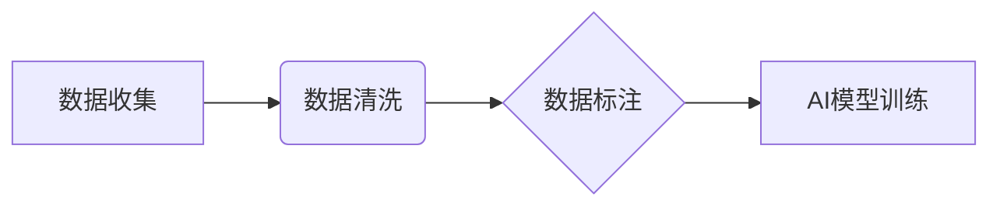

> AI数据集, 数据收集, 数据清洗, 数据标注, 数据质量, 机器学习, 深度学习, 数据预处理

## 1. 背景介绍

在人工智能（AI）领域蓬勃发展的今天，高质量的数据集是训练和评估AI模型的关键要素。一个优秀的AI模型的性能直接取决于其所依赖的数据集的质量。然而，现实世界中的数据往往是混乱、不完整和不一致的，需要经过精心设计的数据集构建流程才能满足AI模型的训练需求。

本文将深入探讨AI数据集构建的各个环节，包括数据收集、数据清洗和数据标注，并分析每个环节的关键技术和最佳实践。

## 2. 核心概念与联系

**数据收集**是构建AI数据集的第一步，旨在从各种来源收集相关的数据。

**数据清洗**是数据收集之后进行的数据处理过程，旨在消除数据中的噪声、错误和重复信息，提高数据的质量。

**数据标注**是为未标记的数据添加标签的过程，以便AI模型能够理解数据的含义并进行学习。

这三个环节相互关联，共同构成了AI数据集构建的完整流程。



## 3. 核心算法原理 & 具体操作步骤

### 3.1  算法原理概述

数据清洗和数据标注涉及到多种算法和技术，例如：

* **数据清洗:** 缺失值处理、异常值检测和处理、数据标准化、数据去重等。
* **数据标注:** 规则标注、半自动标注、自动标注等。

这些算法的原理基于统计学、机器学习和自然语言处理等领域。

### 3.2  算法步骤详解

**数据清洗:**

1. **缺失值处理:** 识别缺失值，并根据缺失值的类型和比例选择合适的处理方法，例如删除、填充或插值。
2. **异常值检测和处理:** 使用统计方法或机器学习算法检测异常值，并根据异常值的性质进行处理，例如删除、修正或保留。
3. **数据标准化:** 将数据转换为标准化格式，例如将数值数据转换为0到1之间的范围，以便于模型训练。
4. **数据去重:** 识别和删除重复数据，确保数据集的唯一性。

**数据标注:**

1. **规则标注:** 根据预先定义的规则对数据进行标注，例如根据文本内容识别情感倾向。
2. **半自动标注:** 利用人工标注的部分数据训练机器学习模型，然后让模型自动标注剩余的数据，并由人工进行校对。
3. **自动标注:** 使用机器学习模型自动对数据进行标注，例如使用图像识别模型自动识别图像中的物体。

### 3.3  算法优缺点

**数据清洗算法:**

* **优点:** 可以有效提高数据质量，为模型训练提供更可靠的数据。
* **缺点:** 算法的选择和参数设置需要根据具体的数据特点进行调整，否则可能会导致数据信息丢失或偏差。

**数据标注算法:**

* **优点:** 可以提高标注效率，降低人工标注成本。
* **缺点:** 自动标注的准确率可能不如人工标注，需要进行严格的评估和校对。

### 3.4  算法应用领域

数据清洗和数据标注算法广泛应用于各个AI领域，例如：

* **计算机视觉:** 图像识别、目标检测、图像分割等。
* **自然语言处理:** 文本分类、情感分析、机器翻译等。
* **语音识别:** 语音转文本、语音合成等。
* **推荐系统:** 商品推荐、内容推荐等。

## 4. 数学模型和公式 & 详细讲解 & 举例说明

### 4.1  数学模型构建

数据清洗和数据标注过程中，可以使用多种数学模型来进行数据处理和标注。例如：

* **缺失值处理:** 可以使用均值、中位数或众数来填充缺失值。
* **异常值检测:** 可以使用z-score或IQR方法来检测异常值。
* **数据标准化:** 可以使用Min-Max标准化或Z-score标准化来将数据转换为标准化格式。

### 4.2  公式推导过程

**Min-Max标准化公式:**

$$x' = \frac{x - min(x)}{max(x) - min(x)}$$

其中：

* $x'$ 是标准化后的数据值。
* $x$ 是原始数据值。
* $min(x)$ 是原始数据值的最小值。
* $max(x)$ 是原始数据值的 maximum 值。

**Z-score标准化公式:**

$$z = \frac{x - \mu}{\sigma}$$

其中：

* $z$ 是标准化后的数据值。
* $x$ 是原始数据值。
* $\mu$ 是原始数据值的均值。
* $\sigma$ 是原始数据值的标准差。

### 4.3  案例分析与讲解

**案例:** 假设有一个数据集包含学生的年龄和成绩，我们需要将年龄数据标准化到0到1之间的范围。

* $min(age) = 18$
* $max(age) = 22$

使用Min-Max标准化公式，可以将学生的年龄数据标准化到0到1之间的范围。例如，一个19岁的学生，其标准化后的年龄值为：

$$x' = \frac{19 - 18}{22 - 18} = 0.25$$

## 5. 项目实践：代码实例和详细解释说明

### 5.1  开发环境搭建

构建AI数据集需要使用一些开发工具和软件，例如：

* **编程语言:** Python、R等。
* **数据处理库:** Pandas、NumPy等。
* **数据可视化库:** Matplotlib、Seaborn等。
* **数据标注工具:** LabelImg、VGG Image Annotator等。

### 5.2  源代码详细实现

以下是一个使用Python语言进行数据清洗和数据标注的代码示例：

```python
import pandas as pd
from sklearn.impute import SimpleImputer

# 加载数据
data = pd.read_csv('data.csv')

# 缺失值处理
imputer = SimpleImputer(strategy='mean')
data['age'] = imputer.fit_transform(data[['age']])

# 数据标注
data['sentiment'] = data['text'].apply(lambda x: 'positive' if x.startswith('good') else 'negative')

# 保存数据
data.to_csv('cleaned_data.csv', index=False)
```

### 5.3  代码解读与分析

* **数据加载:** 使用Pandas库读取CSV文件中的数据。
* **缺失值处理:** 使用SimpleImputer类填充缺失的年龄数据，采用均值填充策略。
* **数据标注:** 使用lambda函数对文本数据进行情感分析，将文本内容以正负情感进行标注。
* **数据保存:** 使用Pandas库将处理后的数据保存为新的CSV文件。

### 5.4  运行结果展示

运行上述代码后，将生成一个名为`cleaned_data.csv`的文件，其中包含处理后的数据，包括填充后的年龄数据和标注后的情感信息。

## 6. 实际应用场景

AI数据集构建在各个领域都有广泛的应用场景，例如：

* **医疗保健:** 构建病历数据、医学影像数据等，用于疾病诊断、治疗方案推荐等。
* **金融服务:** 构建交易数据、客户数据等，用于风险评估、欺诈检测等。
* **制造业:** 构建设备运行数据、生产数据等，用于设备故障预测、生产优化等。

### 6.4  未来应用展望

随着AI技术的不断发展，AI数据集构建将变得更加重要。未来，AI数据集构建将朝着以下方向发展：

* **数据质量提升:** 采用更先进的算法和技术提高数据质量，例如自动数据清洗、自动数据标注等。
* **数据多样化:** 收集更多样化的数据，例如多语言数据、多模态数据等，以满足不同AI模型的需求。
* **数据安全:** 加强数据安全保护，确保数据的隐私和安全。

## 7. 工具和资源推荐

### 7.1  学习资源推荐

* **书籍:**
    * "Hands-On Machine Learning with Scikit-Learn, Keras & TensorFlow" by Aurélien Géron
    * "Deep Learning" by Ian Goodfellow, Yoshua Bengio, and Aaron Courville
* **在线课程:**
    * Coursera: Machine Learning by Andrew Ng
    * Udacity: Deep Learning Nanodegree

### 7.2  开发工具推荐

* **编程语言:** Python
* **数据处理库:** Pandas, NumPy
* **数据可视化库:** Matplotlib, Seaborn
* **数据标注工具:** LabelImg, VGG Image Annotator

### 7.3  相关论文推荐

* "BERT: Pre-training of Deep Bidirectional Transformers for Language Understanding"
* "ImageNet Classification with Deep Convolutional Neural Networks"

## 8. 总结：未来发展趋势与挑战

### 8.1  研究成果总结

本文深入探讨了AI数据集构建的各个环节，包括数据收集、数据清洗和数据标注，并分析了每个环节的关键技术和最佳实践。

### 8.2  未来发展趋势

AI数据集构建将朝着数据质量提升、数据多样化、数据安全等方向发展。

### 8.3  面临的挑战

* 数据质量问题
* 数据标注成本高
* 数据安全问题

### 8.4  研究展望

未来，需要进一步研究更先进的数据清洗和数据标注算法，提高数据质量和标注效率，同时加强数据安全保护，确保数据的隐私和安全。

## 9. 附录：常见问题与解答

**常见问题:**

* 如何选择合适的缺失值处理方法？
* 如何识别和处理异常值？
* 如何进行数据标注？

**解答:**

* 选择合适的缺失值处理方法需要根据缺失值的类型和比例进行判断。
* 异常值检测可以使用z-score或IQR方法，处理方法可以根据异常值的性质进行选择。
* 数据标注可以采用规则标注、半自动标注或自动标注等方法。

作者：禅与计算机程序设计艺术 / Zen and the Art of Computer Programming


<end_of_turn>