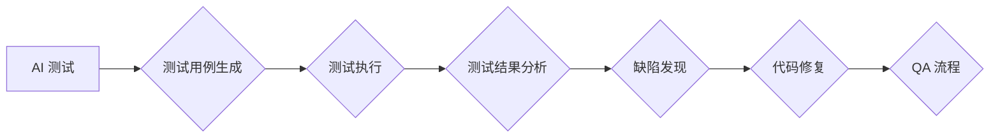

> AI测试, 质量保证, 机器学习, 深度学习, 测试自动化, 代码示例, 实践案例

## 1. 背景介绍

随着人工智能 (AI) 技术的飞速发展，AI 驱动的应用程序和系统已渗透到各个领域，从医疗保健和金融到交通和娱乐。这些 AI 系统的复杂性不断增加，其性能和可靠性对用户和社会的影响也越来越大。因此，确保 AI 系统的质量和可靠性至关重要。

传统的软件测试方法在测试 AI 系统时面临着诸多挑战。AI 系统通常具有高度的非确定性、复杂性和动态性，传统的测试用例难以覆盖所有可能的场景。此外，AI 系统的输出结果往往是连续的和概率性的，难以用传统的测试指标来评估。

为了应对这些挑战，AI 测试和质量保证 (QA) 应运而生。AI 测试利用机器学习 (ML) 和深度学习 (DL) 等 AI 技术，自动生成测试用例、执行测试、分析测试结果并提供反馈，从而提高测试效率、覆盖率和准确性。

## 2. 核心概念与联系

AI 测试的核心概念包括：

* **测试自动化:** 利用代码和工具自动执行测试用例，提高测试效率和覆盖率。
* **机器学习:** 利用算法从数据中学习模式和规律，用于生成测试用例、预测测试结果和发现缺陷。
* **深度学习:** 一种更高级的机器学习方法，利用多层神经网络模拟人类大脑的学习过程，可以处理更复杂的数据和任务。
* **数据驱动测试:** 基于测试数据来驱动测试用例的生成和执行，提高测试的针对性和有效性。
* **模型解释性:** 理解 AI 模型的决策过程，以便更好地评估测试结果和发现缺陷。

**AI 测试与 QA 的关系:**



## 3. 核心算法原理 & 具体操作步骤

### 3.1  算法原理概述

AI 测试中常用的算法包括：

* **进化算法:** 借鉴自然进化机制，通过选择、交叉和变异等操作，不断优化测试用例，使其更具针对性和有效性。
* **强化学习:** 通过奖励和惩罚机制，训练 AI 代理学习最佳的测试策略，例如选择哪些测试用例执行、如何调整测试参数等。
* **迁移学习:** 利用已有的测试知识和经验，迁移到新的 AI 系统或任务中，提高测试效率和准确性。

### 3.2  算法步骤详解

以进化算法为例，其具体操作步骤如下：

1. **初始化种群:** 生成初始的测试用例集合，称为种群。
2. **评估适应度:** 对每个测试用例进行评估，计算其适应度，即发现缺陷的能力。
3. **选择操作:** 根据适应度选择部分测试用例作为父代，用于下一代的生成。
4. **交叉操作:** 将两个父代的测试用例进行交叉，生成新的子代测试用例。
5. **变异操作:** 对部分子代测试用例进行随机变异，增加种群的多样性。
6. **重复步骤2-5:** 重复上述步骤，直到达到预设的迭代次数或种群达到收敛状态。
7. **输出最佳测试用例:** 选择适应度最高的测试用例作为最终结果。

### 3.3  算法优缺点

**优点:**

* 自动生成测试用例，提高测试效率和覆盖率。
* 能够适应复杂和动态的 AI 系统。
* 可以发现传统测试方法难以发现的缺陷。

**缺点:**

* 需要大量的测试数据和计算资源。
* 算法的性能和准确性依赖于数据质量和算法参数的设置。
* 难以解释 AI 模型的决策过程，导致测试结果的可信度降低。

### 3.4  算法应用领域

AI 测试算法广泛应用于以下领域：

* **图像识别:** 自动生成图像测试用例，验证模型对不同图像的识别准确性。
* **自然语言处理:** 自动生成文本测试用例，验证模型对不同文本的理解和生成能力。
* **机器翻译:** 自动生成翻译测试用例，验证模型的翻译准确性和流畅度。
* **语音识别:** 自动生成语音测试用例，验证模型对不同语音的识别准确性。

## 4. 数学模型和公式 & 详细讲解 & 举例说明

### 4.1  数学模型构建

在 AI 测试中，常用的数学模型包括：

* **贝叶斯网络:** 用于表示 AI 系统的知识和推理关系，可以用于预测测试结果和发现缺陷。
* **决策树:** 用于分类和预测，可以用于生成测试用例和评估测试结果。
* **支持向量机 (SVM):** 用于分类和回归，可以用于识别缺陷模式和预测缺陷的严重程度。

### 4.2  公式推导过程

以贝叶斯网络为例，其核心公式为：

$$P(A|B) = \frac{P(B|A)P(A)}{P(B)}$$

其中：

* $P(A|B)$ 表示在已知事件 B 发生的情况下，事件 A 发生的概率。
* $P(B|A)$ 表示在已知事件 A 发生的情况下，事件 B 发生的概率。
* $P(A)$ 表示事件 A 发生的概率。
* $P(B)$ 表示事件 B 发生的概率。

### 4.3  案例分析与讲解

假设我们有一个 AI 系统用于检测图像中的物体，我们希望使用贝叶斯网络来预测该系统在检测特定物体时出错的概率。

我们可以构建一个贝叶斯网络，其中节点表示事件，例如“检测到物体”、“物体类型”、“检测结果正确”等。

然后，我们可以根据历史数据来估计每个节点的概率分布和条件概率。例如，我们可以估计在检测到特定物体类型的概率，以及在检测结果正确的情况下，该物体类型被正确识别的概率。

最后，我们可以使用贝叶斯公式来计算检测特定物体时出错的概率。

## 5. 项目实践：代码实例和详细解释说明

### 5.1  开发环境搭建

* Python 3.x
* TensorFlow 或 PyTorch
* Jupyter Notebook

### 5.2  源代码详细实现

```python
import tensorflow as tf

# 定义一个简单的图像分类模型
model = tf.keras.models.Sequential([
    tf.keras.layers.Conv2D(32, (3, 3), activation='relu', input_shape=(28, 28, 1)),
    tf.keras.layers.MaxPooling2D((2, 2)),
    tf.keras.layers.Conv2D(64, (3, 3), activation='relu'),
    tf.keras.layers.MaxPooling2D((2, 2)),
    tf.keras.layers.Flatten(),
    tf.keras.layers.Dense(10, activation='softmax')
])

# 编译模型
model.compile(optimizer='adam',
              loss='sparse_categorical_crossentropy',
              metrics=['accuracy'])

# 加载 MNIST 数据集
(x_train, y_train), (x_test, y_test) = tf.keras.datasets.mnist.load_data()

# 预处理数据
x_train = x_train.astype('float32') / 255.0
x_test = x_test.astype('float32') / 255.0
x_train = x_train.reshape((x_train.shape[0], 28, 28, 1))
x_test = x_test.reshape((x_test.shape[0], 28, 28, 1))

# 训练模型
model.fit(x_train, y_train, epochs=5)

# 评估模型
loss, accuracy = model.evaluate(x_test, y_test)
print('Test loss:', loss)
print('Test accuracy:', accuracy)
```

### 5.3  代码解读与分析

这段代码实现了对 MNIST 手写数字数据集的分类任务。

* 首先，定义了一个简单的卷积神经网络模型。
* 然后，编译模型，指定优化器、损失函数和评估指标。
* 接着，加载 MNIST 数据集并进行预处理。
* 最后，训练模型并评估模型性能。

### 5.4  运行结果展示

运行这段代码后，会输出模型在测试集上的损失值和准确率。

## 6. 实际应用场景

AI 测试在各个领域都有广泛的应用场景：

* **金融:** 检测欺诈交易、评估信用风险、预测股票价格。
* **医疗保健:** 诊断疾病、预测患者风险、辅助手术。
* **交通:** 自动驾驶、交通流量预测、道路安全监控。
* **制造业:** 缺陷检测、质量控制、预测性维护。

### 6.4  未来应用展望

随着 AI 技术的不断发展，AI 测试将发挥越来越重要的作用。未来，AI 测试将更加智能化、自动化和个性化，能够更好地满足 AI 系统的测试需求。

## 7. 工具和资源推荐

### 7.1  学习资源推荐

* **书籍:**
    * 《AI测试与质量保证》
    * 《机器学习实战》
    * 《深度学习》
* **在线课程:**
    * Coursera: 机器学习
    * Udacity: 深度学习
    * edX: AI 编程

### 7.2  开发工具推荐

* **TensorFlow:** 开源机器学习框架
* **PyTorch:** 开源深度学习框架
* **Keras:** 高级神经网络API
* **Scikit-learn:** 机器学习库

### 7.3  相关论文推荐

* **论文:**
    * 《Towards Data-Driven AI Testing》
    * 《Automated Test Case Generation for Deep Learning Models》
    * 《AI-Powered Test Automation: A Survey》

## 8. 总结：未来发展趋势与挑战

### 8.1  研究成果总结

AI 测试已经取得了显著的成果，能够有效地提高 AI 系统的测试效率、覆盖率和准确性。

### 8.2  未来发展趋势

* **更智能的测试策略:** 利用强化学习等算法，训练 AI 代理学习最佳的测试策略。
* **更强大的测试用例生成:** 利用进化算法等算法，生成更具针对性和有效性的测试用例。
* **更深入的模型解释性:** 研究更有效的模型解释方法，提高测试结果的可信度。

### 8.3  面临的挑战

* **数据质量问题:** AI 测试算法依赖于高质量的数据，数据质量问题会影响测试结果的准确性。
* **算法复杂度问题:** 一些 AI 测试算法非常复杂，难以理解和维护。
* **解释性问题:** 许多 AI 模型的决策过程难以解释，这使得测试结果的可信度降低。

### 8.4  研究展望

未来，AI 测试的研究将继续深入，探索更智能、更有效、更可解释的测试方法，以更好地保障 AI 系统的质量和可靠性。

## 9. 附录：常见问题与解答

* **Q1: AI 测试与传统测试有什么区别？**

* **A1:** AI 测试利用机器学习和深度学习等 AI 技术，自动生成测试用例、执行测试、分析测试结果和提供反馈，而传统测试则主要依赖人工设计和执行测试用例。

* **Q2: AI 测试的适用场景有哪些？**

* **A2:** AI 测试适用于所有需要进行测试的 AI 系统，例如图像识别、自然语言处理、机器翻译、语音识别等。

* **Q3: 如何评估 AI 测试的有效性？**

* **A3:** 可以通过评估 AI 测试生成的测试用例的覆盖率、测试结果的准确率和缺陷发现率来评估 AI 测试的有效性。


作者：禅与计算机程序设计艺术 / Zen and the Art of Computer Programming 
<end_of_turn>