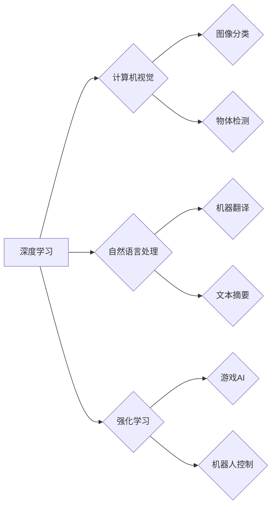

> 人工智能，深度学习，计算机视觉，自然语言处理，强化学习，伦理问题，可解释性，未来趋势

## 1. 背景介绍

人工智能（AI）近年来发展迅速，取得了令人瞩目的成就。从语音识别到图像识别，从自动驾驶到医疗诊断，AI技术正在深刻地改变着我们的生活。Andrej Karpathy，一位享誉全球的人工智能专家，在推动AI发展方面做出了卓越贡献。他曾担任特斯拉自动驾驶团队负责人，现任OpenAI研究员，并以其对深度学习的深刻理解和对未来AI发展趋势的洞察著称。

## 2. 核心概念与联系

**2.1 深度学习**

深度学习是机器学习的一个子领域，它利用多层神经网络来模拟人类大脑的学习过程。通过训练大量的样本数据，深度学习模型能够自动学习特征，并进行复杂的模式识别和预测。

**2.2 计算机视觉**

计算机视觉是让计算机“看”和理解图像和视频的技术。深度学习在计算机视觉领域取得了突破性进展，例如图像分类、物体检测、图像分割等任务。

**2.3 自然语言处理**

自然语言处理（NLP）是让计算机理解和处理人类语言的技术。深度学习在NLP领域也取得了显著成果，例如机器翻译、文本摘要、情感分析等任务。

**2.4 强化学习**

强化学习是一种基于奖励机制的机器学习方法。在强化学习中，智能体通过与环境交互，学习如何采取最优行动以获得最大奖励。

**2.5 伦理问题**

随着AI技术的快速发展，其伦理问题也日益凸显。例如，AI算法的偏见、隐私保护、责任归属等问题都需要认真思考和解决。

**2.6 可解释性**

许多深度学习模型过于复杂，其决策过程难以理解。提高AI模型的可解释性，使人类能够理解AI的决策逻辑，对于信任和应用AI至关重要。

**2.7 未来趋势**

Andrej Karpathy认为，未来AI的发展将更加注重通用性、安全性、可解释性和伦理性。他强调，AI技术应该服务于人类，并为社会带来积极影响。

**Mermaid 流程图**



## 3. 核心算法原理 & 具体操作步骤

### 3.1 算法原理概述

深度学习的核心算法是多层感知机（MLP），它由多个神经网络层组成。每层神经元都连接到下一层的每个神经元，并通过权重进行计算。通过训练大量的样本数据，模型能够学习到每个权重的最佳值，从而实现对输入数据的准确预测。

### 3.2 算法步骤详解

1. **数据预处理:** 将原始数据转换为模型可以理解的格式，例如归一化、编码等。
2. **网络结构设计:** 根据任务需求设计多层感知机的网络结构，包括神经元数量、层数、激活函数等。
3. **参数初始化:** 为网络中的每个权重赋予初始值。
4. **前向传播:** 将输入数据通过网络层层传递，计算每个神经元的输出值。
5. **损失函数计算:** 计算模型预测结果与真实结果之间的误差，即损失函数值。
6. **反向传播:** 根据损失函数值，反向计算每个权重的梯度，即权重更新的方向和幅度。
7. **参数更新:** 使用梯度下降算法更新网络中的每个权重，使模型朝着最小化损失函数的方向学习。
8. **重复步骤4-7:** 迭代训练模型，直到损失函数值达到预设阈值或训练次数达到上限。

### 3.3 算法优缺点

**优点:**

* 能够自动学习特征，无需人工特征工程。
* 能够处理高维数据，并发现复杂模式。
* 在图像识别、自然语言处理等领域取得了突破性进展。

**缺点:**

* 需要大量的样本数据进行训练。
* 训练过程耗时且耗能。
* 模型的复杂性难以理解，可解释性差。

### 3.4 算法应用领域

深度学习算法广泛应用于各个领域，例如：

* **计算机视觉:** 图像分类、物体检测、图像分割、人脸识别等。
* **自然语言处理:** 机器翻译、文本摘要、情感分析、对话系统等。
* **语音识别:** 语音转文本、语音助手等。
* **医疗诊断:** 疾病预测、图像分析、药物研发等。
* **金融分析:** 风险评估、欺诈检测、投资预测等。

## 4. 数学模型和公式 & 详细讲解 & 举例说明

### 4.1 数学模型构建

深度学习模型的核心是多层感知机（MLP），其数学模型可以表示为：

$$
y = f(W^L x^L + b^L)
$$

其中：

* $y$ 是模型的输出。
* $x^L$ 是第 $L$ 层的输入。
* $W^L$ 是第 $L$ 层的权重矩阵。
* $b^L$ 是第 $L$ 层的偏置向量。
* $f$ 是激活函数。

### 4.2 公式推导过程

通过反向传播算法，可以计算每个权重的梯度，并使用梯度下降算法更新权重值。梯度下降算法的公式如下：

$$
W^{L} = W^{L} - \alpha \frac{\partial L}{\partial W^{L}}
$$

其中：

* $\alpha$ 是学习率。
* $\frac{\partial L}{\partial W^{L}}$ 是损失函数 $L$ 对权重 $W^{L}$ 的梯度。

### 4.3 案例分析与讲解

例如，在图像分类任务中，输入图像经过多层卷积和池化操作后，得到特征向量。然后，特征向量通过全连接层进行分类，输出每个类别的概率。损失函数通常使用交叉熵损失函数，其目标是使模型预测的概率与真实标签的概率尽可能接近。

## 5. 项目实践：代码实例和详细解释说明

### 5.1 开发环境搭建

使用Python语言和深度学习框架TensorFlow或PyTorch进行开发。

### 5.2 源代码详细实现

```python
import tensorflow as tf

# 定义模型结构
model = tf.keras.models.Sequential([
    tf.keras.layers.Conv2D(32, (3, 3), activation='relu', input_shape=(28, 28, 1)),
    tf.keras.layers.MaxPooling2D((2, 2)),
    tf.keras.layers.Conv2D(64, (3, 3), activation='relu'),
    tf.keras.layers.MaxPooling2D((2, 2)),
    tf.keras.layers.Flatten(),
    tf.keras.layers.Dense(10, activation='softmax')
])

# 编译模型
model.compile(optimizer='adam',
              loss='sparse_categorical_crossentropy',
              metrics=['accuracy'])

# 加载数据集
(x_train, y_train), (x_test, y_test) = tf.keras.datasets.mnist.load_data()

# 训练模型
model.fit(x_train, y_train, epochs=5)

# 评估模型
loss, accuracy = model.evaluate(x_test, y_test)
print('Test loss:', loss)
print('Test accuracy:', accuracy)
```

### 5.3 代码解读与分析

这段代码定义了一个简单的卷积神经网络模型，用于手写数字识别任务。模型包含两层卷积层、两层池化层、一层全连接层和一层输出层。

### 5.4 运行结果展示

训练完成后，模型能够对测试数据进行分类，并输出准确率。

## 6. 实际应用场景

### 6.1 医疗诊断

深度学习可以用于分析医学图像，例如X光片、CT扫描和MRI扫描，辅助医生诊断疾病。

### 6.2 自动驾驶

深度学习可以用于训练自动驾驶汽车的视觉系统，识别道路、交通标志和行人，从而实现自动驾驶功能。

### 6.3 机器翻译

深度学习可以用于机器翻译，将一种语言翻译成另一种语言。

### 6.4 未来应用展望

未来，深度学习将应用于更多领域，例如个性化教育、精准医疗、智能家居等。

## 7. 工具和资源推荐

### 7.1 学习资源推荐

* **书籍:**
    * 深度学习
    * 人工智能：一种现代方法
* **在线课程:**
    * Coursera深度学习课程
    * Udacity深度学习课程

### 7.2 开发工具推荐

* **TensorFlow:** 开源深度学习框架
* **PyTorch:** 开源深度学习框架
* **Keras:** 高级深度学习API

### 7.3 相关论文推荐

* **ImageNet Classification with Deep Convolutional Neural Networks**
* **Attention Is All You Need**
* **Generative Adversarial Networks**

## 8. 总结：未来发展趋势与挑战

### 8.1 研究成果总结

深度学习取得了令人瞩目的成果，在计算机视觉、自然语言处理等领域取得了突破性进展。

### 8.2 未来发展趋势

未来，深度学习将更加注重通用性、安全性、可解释性和伦理性。

### 8.3 面临的挑战

* **数据获取和标注:** 深度学习模型需要大量的样本数据进行训练，数据获取和标注成本高昂。
* **模型解释性:** 深度学习模型过于复杂，其决策过程难以理解，可解释性差。
* **伦理问题:** AI算法的偏见、隐私保护、责任归属等问题需要认真思考和解决。

### 8.4 研究展望

未来研究将集中在解决上述挑战，例如开发更有效的训练方法、提高模型可解释性、建立AI伦理规范等。

## 9. 附录：常见问题与解答

### 9.1 什么是深度学习？

深度学习是一种机器学习方法，它利用多层神经网络来模拟人类大脑的学习过程。

### 9.2 深度学习有哪些应用场景？

深度学习广泛应用于各个领域，例如计算机视觉、自然语言处理、语音识别、医疗诊断、金融分析等。

### 9.3 如何学习深度学习？

可以通过阅读书籍、参加在线课程、参与开源项目等方式学习深度学习。

作者：禅与计算机程序设计艺术 / Zen and the Art of Computer Programming


<end_of_turn>