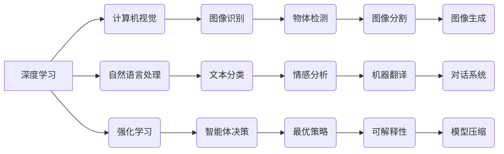

> 人工智能，深度学习，计算机视觉，自然语言处理，强化学习，模型压缩，可解释性

## 1. 背景介绍

人工智能（AI）正以惊人的速度发展，深刻地改变着我们生活的方方面面。从自动驾驶汽车到智能语音助手，AI技术已经渗透到我们的日常生活中。作为AI领域的领军人物之一，Andrej Karpathy 在过去几年中做出了许多开创性的贡献，他的研究和见解对AI未来的发展方向具有重要的指导意义。

Andrej Karpathy 是一位计算机科学家，斯坦福大学博士毕业，曾任特斯拉高级人工智能工程师，现任OpenAI研究员。他以其在深度学习、计算机视觉和自然语言处理方面的杰出成就而闻名。他开发了许多重要的AI算法和工具，例如：

* **ImageNet 比赛冠军模型:** Karpathy 在 2012 年的 ImageNet 比赛中，带领团队开发了当时最先进的图像识别模型，取得了突破性的成绩。
* **Caffe 深度学习框架:** Karpathy 是 Caffe 深度学习框架的共同创始人，该框架为深度学习研究和应用提供了强大的工具和平台。
* **OpenAI 研究贡献:** 在 OpenAI 工作期间，Karpathy 对强化学习、模型压缩和可解释性等领域做出了重要贡献。

## 2. 核心概念与联系

**2.1 深度学习**

深度学习是机器学习的一个子领域，它利用多层神经网络来模拟人类大脑的学习过程。深度学习模型能够从海量数据中自动学习特征，从而实现更准确的预测和决策。

**2.2 计算机视觉**

计算机视觉是让计算机“看”和理解图像和视频的技术。它涉及图像识别、物体检测、图像分割、图像生成等多个子领域。

**2.3 自然语言处理**

自然语言处理（NLP）是让计算机理解和处理人类语言的技术。它涉及文本分类、情感分析、机器翻译、对话系统等多个子领域。

**2.4 强化学习**

强化学习是一种机器学习方法，它通过奖励和惩罚机制来训练智能体，使其在特定环境中做出最优决策。

**2.5 模型压缩**

模型压缩是指减少深度学习模型的大小和参数量，从而提高模型的效率和部署能力。

**2.6 可解释性**

可解释性是指能够理解和解释深度学习模型的决策过程，使其更加透明和可信赖。

**2.7  核心概念关系图**



## 3. 核心算法原理 & 具体操作步骤

**3.1 算法原理概述**

深度学习算法的核心是多层神经网络。神经网络由许多相互连接的神经元组成，每个神经元接收输入信号，对其进行处理，并输出信号。通过调整神经元的连接权重，深度学习模型能够学习数据中的复杂模式和关系。

**3.2 算法步骤详解**

1. **数据预处理:** 将原始数据转换为深度学习模型可以理解的格式，例如归一化、编码等。
2. **网络结构设计:** 根据任务需求设计神经网络的结构，包括层数、神经元数量、激活函数等。
3. **参数初始化:** 为神经网络的参数（权重和偏置）赋予初始值。
4. **前向传播:** 将输入数据通过神经网络传递，计算输出结果。
5. **损失函数计算:** 计算模型输出与真实值的差异，即损失值。
6. **反向传播:** 根据损失值，调整神经网络的参数，使模型输出更接近真实值。
7. **优化算法:** 使用优化算法（例如梯度下降）来更新神经网络的参数。
8. **模型评估:** 使用测试数据评估模型的性能，例如准确率、召回率等。
9. **模型调优:** 根据评估结果，调整模型参数或网络结构，提高模型性能。

**3.3 算法优缺点**

**优点:**

* 能够学习复杂数据模式
* 自动特征提取
* 高精度

**缺点:**

* 需要大量数据训练
* 计算资源消耗大
* 可解释性差

**3.4 算法应用领域**

* 计算机视觉：图像识别、物体检测、图像分割、图像生成
* 自然语言处理：文本分类、情感分析、机器翻译、对话系统
* 强化学习：游戏 AI、机器人控制、自动驾驶

## 4. 数学模型和公式 & 详细讲解 & 举例说明

**4.1 数学模型构建**

深度学习模型通常使用神经网络来表示，神经网络可以看作是一个复杂的函数映射。

假设我们有一个输入向量 $x$，经过多层神经网络处理后，得到输出向量 $y$。我们可以用以下公式表示神经网络的映射关系：

$$y = f(W_L \cdot g(W_{L-1} \cdot ... \cdot g(W_1 \cdot x)))$$

其中：

* $W_i$ 表示第 $i$ 层神经网络的权重矩阵
* $g(x)$ 表示激活函数
* $f(x)$ 表示输出层激活函数

**4.2 公式推导过程**

神经网络的训练过程本质上是通过优化参数 $W_i$ 来最小化损失函数的过程。损失函数通常定义为模型输出与真实值的差异。常用的损失函数包括均方误差（MSE）和交叉熵损失（CE）。

**4.3 案例分析与讲解**

**均方误差 (MSE):**

MSE 用于回归问题，其公式为：

$$MSE = \frac{1}{n} \sum_{i=1}^{n} (y_i - \hat{y}_i)^2$$

其中：

* $y_i$ 表示真实值
* $\hat{y}_i$ 表示模型预测值
* $n$ 表示样本数量

**交叉熵损失 (CE):**

CE 用于分类问题，其公式为：

$$CE = -\sum_{i=1}^{n} y_i \log(\hat{y}_i)$$

其中：

* $y_i$ 表示真实标签（one-hot编码）
* $\hat{y}_i$ 表示模型预测概率

## 5. 项目实践：代码实例和详细解释说明

**5.1 开发环境搭建**

* Python 3.x
* TensorFlow 或 PyTorch 深度学习框架
* Jupyter Notebook 或 VS Code 开发环境

**5.2 源代码详细实现**

```python
import tensorflow as tf

# 定义模型结构
model = tf.keras.models.Sequential([
    tf.keras.layers.Dense(128, activation='relu', input_shape=(784,)),
    tf.keras.layers.Dense(10, activation='softmax')
])

# 编译模型
model.compile(optimizer='adam',
              loss='sparse_categorical_crossentropy',
              metrics=['accuracy'])

# 加载 MNIST 数据集
(x_train, y_train), (x_test, y_test) = tf.keras.datasets.mnist.load_data()

# 数据预处理
x_train = x_train.reshape(-1, 784).astype('float32') / 255
x_test = x_test.reshape(-1, 784).astype('float32') / 255

# 模型训练
model.fit(x_train, y_train, epochs=5)

# 模型评估
loss, accuracy = model.evaluate(x_test, y_test)
print('Test loss:', loss)
print('Test accuracy:', accuracy)
```

**5.3 代码解读与分析**

这段代码实现了使用 TensorFlow 框架训练一个简单的 MNIST 手写数字识别模型。

* 首先，定义了模型结构，包括两层全连接神经网络。
* 然后，编译了模型，指定了优化器、损失函数和评估指标。
* 接着，加载了 MNIST 数据集，并对数据进行了预处理，例如归一化。
* 最后，训练了模型，并评估了模型的性能。

**5.4 运行结果展示**

训练完成后，模型能够识别 MNIST 手写数字，并达到一定的准确率。

## 6. 实际应用场景

**6.1 计算机视觉**

* **图像识别:** 自动识别图像中的物体，例如人脸、车辆、动物等。
* **物体检测:** 在图像中定位和识别多个物体，并标注其边界框。
* **图像分割:** 将图像分割成不同的区域，例如分割出前景和背景。
* **图像生成:** 生成新的图像，例如生成人脸、风景等。

**6.2 自然语言处理**

* **文本分类:** 将文本分类到不同的类别，例如情感分析、主题分类等。
* **机器翻译:** 将文本从一种语言翻译成另一种语言。
* **对话系统:** 创建能够与人类进行自然对话的智能系统。
* **文本摘要:** 自动生成文本的摘要。

**6.3 强化学习**

* **游戏 AI:** 训练智能体玩游戏，例如围棋、Go 等。
* **机器人控制:** 训练机器人执行特定任务，例如导航、抓取等。
* **自动驾驶:** 训练自动驾驶汽车感知环境并做出决策。

**6.4 未来应用展望**

* **医疗诊断:** 利用 AI 辅助医生诊断疾病，提高诊断准确率。
* **个性化教育:** 根据学生的学习情况提供个性化的学习方案。
* **金融风险管理:** 利用 AI 识别金融风险，降低风险损失。
* **科学研究:** 利用 AI 加速科学研究，例如药物研发、材料科学等。

## 7. 工具和资源推荐

**7.1 学习资源推荐**

* **书籍:**
    * Deep Learning by Ian Goodfellow, Yoshua Bengio, and Aaron Courville
    * Hands-On Machine Learning with Scikit-Learn, Keras & TensorFlow by Aurélien Géron
* **在线课程:**
    * Stanford CS231n: Convolutional Neural Networks for Visual Recognition
    * Deep Learning Specialization by Andrew Ng on Coursera
* **博客和网站:**
    * Andrej Karpathy's Blog: https://karpathy.github.io/
    * OpenAI Blog: https://openai.com/blog/

**7.2 开发工具推荐**

* **深度学习框架:** TensorFlow, PyTorch, Keras
* **编程语言:** Python
* **数据可视化工具:** Matplotlib, Seaborn
* **云计算平台:** Google Cloud Platform, Amazon Web Services, Microsoft Azure

**7.3 相关论文推荐**

* ImageNet Classification with Deep Convolutional Neural Networks (Krizhevsky et al., 2012)
* AlexNet: Deep Learning for Image Recognition (Krizhevsky et al., 2012)
* Deep Residual Learning for Image Recognition (He et al., 2016)
* Attention Is All You Need (Vaswani et al., 2017)

## 8. 总结：未来发展趋势与挑战

**8.1 研究成果总结**

近年来，深度学习取得了令人瞩目的成就，在计算机视觉、自然语言处理等领域取得了突破性的进展。

**8.2 未来发展趋势**

* **模型规模和效率:** 继续探索更大规模、更高效的深度学习模型。
* **可解释性:** 研究更可解释的深度学习模型，提高模型的透明度和信任度。
* **数据隐私:** 开发更隐私安全的深度学习方法，保护用户数据隐私。
* **跨模态学习:** 研究能够处理多种模态数据的深度学习模型，例如文本