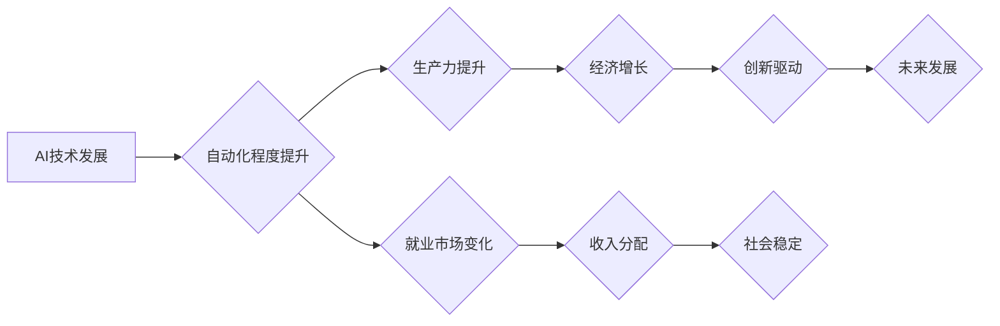

> 人工智能，经济影响，自动化，就业市场，技术发展，伦理问题，未来趋势

## 1. 背景介绍

人工智能（AI）正以惊人的速度发展，其影响力正在深刻地改变着我们的世界。从自动驾驶汽车到个性化医疗，AI技术正在各个领域展现出巨大的潜力。然而，AI的发展也引发了广泛的讨论，尤其是其对经济的影响。

Andrej Karpathy，一位享誉全球的人工智能专家，曾多次强调AI对经济的影响将是深远而复杂的。他认为，AI将带来巨大的机遇，但也可能带来一些挑战。

## 2. 核心概念与联系

**2.1 AI驱动的自动化**

AI的核心概念之一是自动化。通过机器学习和深度学习等技术，AI可以自动完成许多原本需要人类进行的任务，例如数据分析、图像识别和自然语言处理。

**2.2 经济影响的链条**

AI驱动的自动化将对经济产生多方面的影响，形成一个复杂的链条：

* **生产力提升:** AI可以提高生产效率，降低生产成本，从而提升整体经济产出。
* **就业市场变化:** 一些重复性劳动将被AI取代，但同时也会创造新的工作岗位，需要新的技能和知识。
* **收入分配:** AI带来的生产力提升可能导致收入分配不均，需要制定相应的政策来应对。
* **创新驱动:** AI技术本身也是一种创新，它将推动科技进步，创造新的产业和市场。

**2.3  AI经济影响流程图**



## 3. 核心算法原理 & 具体操作步骤

**3.1 算法原理概述**

机器学习是AI的核心算法之一，它通过训练模型来学习数据中的模式，并根据这些模式进行预测或决策。常见的机器学习算法包括：

* **监督学习:** 利用标记数据训练模型，例如分类和回归问题。
* **无监督学习:** 利用未标记数据发现数据中的隐藏结构，例如聚类和降维。
* **强化学习:** 通过试错学习，让智能体在环境中获得最大奖励。

**3.2 算法步骤详解**

以监督学习为例，其基本步骤如下：

1. **数据收集和预处理:** 收集相关数据，并进行清洗、转换和特征工程等预处理工作。
2. **模型选择:** 根据具体问题选择合适的机器学习算法模型。
3. **模型训练:** 利用标记数据训练模型，调整模型参数，使其能够准确地预测或决策。
4. **模型评估:** 利用测试数据评估模型的性能，例如准确率、召回率和F1-score等指标。
5. **模型部署:** 将训练好的模型部署到实际应用场景中，用于进行预测或决策。

**3.3 算法优缺点**

* **优点:** 能够自动学习数据中的模式，无需人工编程，具有强大的泛化能力。
* **缺点:** 需要大量的标记数据进行训练，训练过程可能耗时和耗资源，对数据质量要求较高。

**3.4 算法应用领域**

机器学习算法广泛应用于各个领域，例如：

* **图像识别:** 人脸识别、物体检测、图像分类等。
* **自然语言处理:** 文本分类、情感分析、机器翻译等。
* **推荐系统:** 商品推荐、内容推荐、用户画像等。
* **医疗诊断:** 疾病预测、影像分析、药物研发等。

## 4. 数学模型和公式 & 详细讲解 & 举例说明

**4.1 数学模型构建**

机器学习模型通常可以看作是数学函数的组合，其目标是找到最佳的函数参数，使得模型能够对数据进行准确的预测或决策。

**4.2 公式推导过程**

例如，线性回归模型的目标是找到一条直线，使得这条直线与数据点之间的误差最小。其数学公式如下：

$$
y = w_0 + w_1x
$$

其中，$y$ 是预测值，$x$ 是输入特征，$w_0$ 和 $w_1$ 是模型参数。

为了找到最佳的 $w_0$ 和 $w_1$，可以使用最小二乘法，其目标函数为：

$$
J(w_0, w_1) = \sum_{i=1}^{n}(y_i - \hat{y}_i)^2
$$

其中，$n$ 是数据点的数量，$y_i$ 是真实值，$\hat{y}_i$ 是预测值。

通过对目标函数求导，并令其等于零，可以得到 $w_0$ 和 $w_1$ 的最佳值。

**4.3 案例分析与讲解**

假设我们有一个数据集，包含房屋面积和房屋价格的信息。我们可以使用线性回归模型来预测房屋价格。

通过训练模型，我们可以得到最佳的 $w_0$ 和 $w_1$ 值，例如：

$$
w_0 = 10000
$$

$$
w_1 = 500
$$

这意味着，对于面积为 $x$ 平方米的房屋，其预测价格为：

$$
y = 10000 + 500x
$$

## 5. 项目实践：代码实例和详细解释说明

**5.1 开发环境搭建**

可以使用 Python 语言和相关的机器学习库，例如 scikit-learn，来实现机器学习项目。

**5.2 源代码详细实现**

```python
from sklearn.linear_model import LinearRegression
from sklearn.model_selection import train_test_split
import pandas as pd

# 加载数据
data = pd.read_csv('house_data.csv')

# 分割数据
X = data[['area']]
y = data['price']
X_train, X_test, y_train, y_test = train_test_split(X, y, test_size=0.2, random_state=42)

# 创建线性回归模型
model = LinearRegression()

# 训练模型
model.fit(X_train, y_train)

# 预测测试数据
y_pred = model.predict(X_test)

# 评估模型性能
from sklearn.metrics import mean_squared_error
mse = mean_squared_error(y_test, y_pred)
print(f'Mean Squared Error: {mse}')
```

**5.3 代码解读与分析**

这段代码首先加载了房屋数据，然后将数据分割为训练集和测试集。接着，创建了一个线性回归模型，并使用训练集训练模型。最后，使用测试集预测房屋价格，并计算模型的均方误差来评估模型性能。

**5.4 运行结果展示**

运行代码后，会输出模型的均方误差值，该值越小，模型的预测性能越好。

## 6. 实际应用场景

**6.1 自动化生产线**

AI可以自动控制生产线，提高生产效率和产品质量。例如，在汽车制造业中，AI可以自动完成焊接、喷漆和组装等任务。

**6.2 个性化医疗**

AI可以帮助医生诊断疾病、制定治疗方案和预测患者的健康状况。例如，AI可以分析患者的影像数据，帮助医生发现潜在的疾病。

**6.3 金融风险管理**

AI可以帮助金融机构识别和管理风险。例如，AI可以分析交易数据，识别潜在的欺诈行为。

**6.4 未来应用展望**

AI技术的未来应用前景广阔，例如：

* **自动驾驶汽车:** AI将推动自动驾驶汽车的普及，提高交通安全和效率。
* **智能家居:** AI将使家居更加智能化，例如自动控制灯光、温度和家电设备。
* **个性化教育:** AI将提供个性化的教育方案，帮助学生更好地学习和成长。

## 7. 工具和资源推荐

**7.1 学习资源推荐**

* **在线课程:** Coursera、edX、Udacity 等平台提供丰富的AI课程。
* **书籍:** 《深度学习》、《机器学习实战》等书籍是学习AI的经典教材。
* **开源项目:** TensorFlow、PyTorch 等开源项目提供了丰富的AI工具和资源。

**7.2 开发工具推荐**

* **Python:** Python 是AI开发最常用的编程语言。
* **scikit-learn:** scikit-learn 是Python最流行的机器学习库。
* **TensorFlow:** TensorFlow 是Google开发的开源深度学习框架。
* **PyTorch:** PyTorch 是Facebook开发的开源深度学习框架。

**7.3 相关论文推荐**

* **《ImageNet Classification with Deep Convolutional Neural Networks》**
* **《Attention Is All You Need》**
* **《BERT: Pre-training of Deep Bidirectional Transformers for Language Understanding》**

## 8. 总结：未来发展趋势与挑战

**8.1 研究成果总结**

近年来，AI技术取得了长足的进步，在各个领域都展现出巨大的潜力。

**8.2 未来发展趋势**

* **模型规模和能力的提升:** 未来，AI模型将变得更加强大，能够处理更复杂的任务。
* **算法的创新:** 新的AI算法将不断涌现，例如强化学习和生成对抗网络。
* **边缘计算和部署:** AI将更加广泛地部署到边缘设备，例如智能手机和传感器。

**8.3 面临的挑战**

* **数据隐私和安全:** AI模型的训练需要大量数据，如何保护数据隐私和安全是一个重要的挑战。
* **算法的公平性和可解释性:** AI算法可能存在偏见，其决策过程也难以理解，如何保证算法的公平性和可解释性是一个重要的研究方向。
* **伦理问题:** AI技术的快速发展引发了许多伦理问题，例如人工智能的责任和义务。

**8.4 研究展望**

未来，AI研究将继续朝着更安全、更可靠、更公平的方向发展。


## 9. 附录：常见问题与解答

**9.1 如何选择合适的AI算法？**

选择合适的AI算法取决于具体的应用场景和数据特点。例如，对于分类问题，可以使用支持向量机或决策树算法；对于回归问题，可以使用线性回归或神经网络算法。

**9.2 如何评估AI模型的性能？**

常用的AI模型性能评估指标包括准确率、召回率、F1-score、均方误差等。

**9.3 如何解决AI算法的偏见问题？**

可以通过以下方法来解决AI算法的偏见问题：

* 使用更加公平的训练数据。
* 使用偏见检测和缓解技术。
* 提高算法的可解释性，以便更好地理解算法的决策过程。


作者：禅与计算机程序设计艺术 / Zen and the Art of Computer Programming 
<end_of_turn>