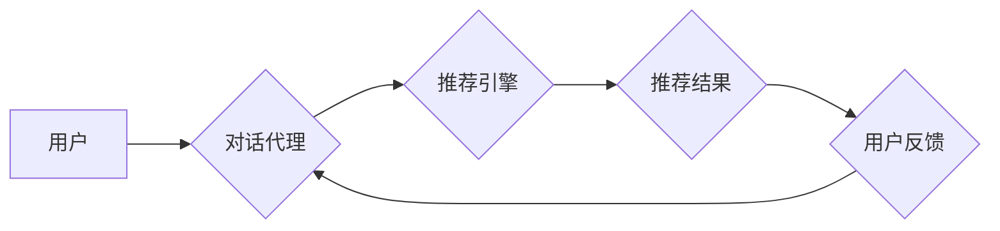

> 交互式推荐系统，Chat-Rec，对话推荐，自然语言处理，机器学习，用户行为分析，个性化推荐

## 1. 背景介绍

推荐系统作为互联网时代的重要技术支柱，在电商、社交媒体、内容平台等领域发挥着至关重要的作用。传统的推荐系统主要依赖于用户历史行为数据，例如浏览记录、购买历史等，通过协同过滤、内容过滤等算法，预测用户潜在的兴趣并提供个性化推荐。然而，随着用户需求的不断变化和个性化的程度不断提高，传统的推荐系统面临着新的挑战。

近年来，随着自然语言处理（NLP）技术的快速发展，对话推荐系统（Chat-Rec）应运而生。Chat-Rec 旨在通过与用户进行自然语言交互，更深入地理解用户的需求和偏好，从而提供更精准、更个性化的推荐。

## 2. 核心概念与联系

Chat-Rec 系统的核心概念是将推荐过程融入到对话交互中。它通过自然语言对话的方式与用户进行交互，收集用户的反馈信息，并根据用户的表达意图和上下文信息，动态调整推荐策略。

**Chat-Rec 系统架构**



**核心概念解释:**

* **用户:** Chat-Rec 系统的目标用户，通过自然语言与系统进行交互。
* **对话代理:** 负责与用户进行对话交互，理解用户的意图和需求，并将其转化为推荐引擎可以理解的格式。
* **推荐引擎:** 基于用户需求和上下文信息，从候选推荐列表中选择最合适的推荐结果。
* **推荐结果:**  推荐引擎根据用户需求生成的推荐列表，可以包含商品、内容、服务等多种类型。
* **用户反馈:** 用户对推荐结果的评价和反馈，可以帮助对话代理和推荐引擎不断优化推荐策略。

## 3. 核心算法原理 & 具体操作步骤

### 3.1  算法原理概述

Chat-Rec 系统的核心算法通常基于深度学习技术，例如 Transformer 模型，能够有效地处理自然语言文本数据，并捕捉用户表达中的语义和情感信息。

常见的 Chat-Rec 算法包括：

* **序列到序列模型 (Seq2Seq):** 将用户输入的对话历史序列映射到推荐结果序列。
* **强化学习 (RL):** 通过奖励机制训练模型，使其能够学习到最优的对话策略和推荐策略。
* **图神经网络 (GNN):** 建立用户-商品关系图，利用图结构信息进行推荐。

### 3.2  算法步骤详解

以 Seq2Seq 模型为例，Chat-Rec 系统的具体操作步骤如下：

1. **对话历史预处理:** 将用户与对话代理之间的对话历史文本进行预处理，例如分词、词向量化等。
2. **编码器:** 使用编码器网络将对话历史序列编码成一个固定长度的向量表示，捕捉对话历史中的语义信息。
3. **解码器:** 使用解码器网络将编码后的向量表示解码成推荐结果序列，例如商品名称、商品描述等。
4. **损失函数:** 使用交叉熵损失函数或其他损失函数，评估模型的推荐性能。
5. **模型训练:** 使用梯度下降算法或其他优化算法，训练模型，使其能够生成更准确的推荐结果。

### 3.3  算法优缺点

**优点:**

* 能够更好地理解用户的需求和偏好，提供更精准的推荐。
* 能够进行个性化对话，提升用户体验。
* 可以根据用户反馈动态调整推荐策略，不断优化推荐效果。

**缺点:**

* 需要大量的对话数据进行训练，数据获取和标注成本较高。
* 模型训练复杂，需要专业的机器学习知识和技术。
* 存在对话代理理解错误和推荐结果不准确的风险。

### 3.4  算法应用领域

Chat-Rec 系统在以下领域具有广泛的应用前景：

* **电商推荐:** 提供个性化商品推荐，提升用户购物体验。
* **内容推荐:** 根据用户兴趣推荐新闻、视频、音乐等内容。
* **旅游推荐:** 根据用户需求推荐旅游目的地、酒店、景点等。
* **教育推荐:** 根据用户学习进度和兴趣推荐学习资源。

## 4. 数学模型和公式 & 详细讲解 & 举例说明

### 4.1  数学模型构建

Chat-Rec 系统的数学模型通常基于深度学习框架，例如 TensorFlow 或 PyTorch。模型的结构可以根据具体应用场景进行调整，但一般包括以下几个部分：

* **编码器:** 用于将对话历史序列编码成向量表示，常用的编码器结构包括 RNN、LSTM 和 Transformer。
* **解码器:** 用于将编码后的向量表示解码成推荐结果序列，常用的解码器结构也包括 RNN、LSTM 和 Transformer。
* **注意力机制:** 用于捕捉对话历史中与当前用户输入相关的关键信息，提高模型的理解能力。

### 4.2  公式推导过程

由于 Chat-Rec 系统的数学模型比较复杂，这里只列举 Transformer 模型中常用的注意力机制公式：

**Scaled Dot-Product Attention:**

$$
Attention(Q, K, V) = \frac{exp(\frac{QK^T}{\sqrt{d_k}})}{softmax(QK^T/\sqrt{d_k})}V
$$

其中：

* $Q$：查询矩阵
* $K$：键矩阵
* $V$：值矩阵
* $d_k$：键向量的维度

### 4.3  案例分析与讲解

假设用户输入 "我想买一部手机"，对话代理需要根据这句话理解用户的意图，并从商品数据库中推荐合适的手机。

使用 Transformer 模型，对话代理首先将用户输入的这句话编码成一个向量表示，然后使用注意力机制计算出与这句话相关的商品信息，最后解码出推荐结果，例如 "推荐您购买 iPhone 14"。

## 5. 项目实践：代码实例和详细解释说明

### 5.1  开发环境搭建

Chat-Rec 系统的开发环境通常包括以下软件：

* Python 3.x
* TensorFlow 或 PyTorch
* NLTK 或 SpaCy 等自然语言处理库
* Jupyter Notebook 或 VS Code 等代码编辑器

### 5.2  源代码详细实现

由于 Chat-Rec 系统的代码实现比较复杂，这里只提供一个简单的 Seq2Seq 模型的代码示例：

```python
import tensorflow as tf

# 定义编码器模型
encoder_model = tf.keras.Sequential([
    tf.keras.layers.Embedding(input_dim=vocab_size, output_dim=embedding_dim),
    tf.keras.layers.LSTM(units=128)
])

# 定义解码器模型
decoder_model = tf.keras.Sequential([
    tf.keras.layers.Embedding(input_dim=vocab_size, output_dim=embedding_dim),
    tf.keras.layers.LSTM(units=128),
    tf.keras.layers.Dense(units=vocab_size, activation='softmax')
])

# 定义 Seq2Seq 模型
model = tf.keras.Model(inputs=encoder_model.input, outputs=decoder_model(encoder_model.output))

# 编译模型
model.compile(optimizer='adam', loss='sparse_categorical_crossentropy', metrics=['accuracy'])

# 训练模型
model.fit(train_data, epochs=10)
```

### 5.3  代码解读与分析

* 编码器模型使用 Embedding 层将单词转换为向量表示，然后使用 LSTM 层捕捉对话历史中的语义信息。
* 解码器模型使用 Embedding 层将向量表示转换为单词序列，然后使用 LSTM 层生成推荐结果。
* Seq2Seq 模型将编码器和解码器连接起来，实现从对话历史到推荐结果的映射。

### 5.4  运行结果展示

训练完成后，可以使用模型对新的对话历史进行预测，生成推荐结果。

## 6. 实际应用场景

### 6.1  电商推荐

Chat-Rec 系统可以帮助电商平台提供更个性化的商品推荐，例如：

* 根据用户的对话历史，推荐用户可能感兴趣的商品。
* 根据用户的购买习惯，推荐用户可能需要的商品。
* 根据用户的评价和反馈，推荐用户可能喜欢的商品。

### 6.2  内容推荐

Chat-Rec 系统可以帮助内容平台提供更精准的内容推荐，例如：

* 根据用户的阅读历史，推荐用户可能感兴趣的文章。
* 根据用户的观看历史，推荐用户可能喜欢的视频。
* 根据用户的音乐偏好，推荐用户可能喜欢的歌曲。

### 6.3  旅游推荐

Chat-Rec 系统可以帮助旅游平台提供更个性化的旅游推荐，例如：

* 根据用户的旅行计划，推荐合适的旅游目的地。
* 根据用户的预算和喜好，推荐合适的酒店和景点。
* 根据用户的旅行体验，推荐用户可能喜欢的旅游路线。

### 6.4  未来应用展望

Chat-Rec 系统的应用前景非常广阔，未来可能在以下领域得到更广泛的应用：

* **医疗保健:** 提供个性化的医疗建议和健康管理服务。
* **金融服务:** 提供个性化的理财建议和投资服务。
* **教育培训:** 提供个性化的学习建议和教学服务。

## 7. 工具和资源推荐

### 7.1  学习资源推荐

* **书籍:**
    * 《深度学习》
    * 《自然语言处理》
    * 《推荐系统》
* **在线课程:**
    * Coursera: 深度学习
    * Udacity: 自然语言处理
    * edX: 推荐系统

### 7.2  开发工具推荐

* **TensorFlow:** 开源深度学习框架
* **PyTorch:** 开源深度学习框架
* **NLTK:** 自然语言处理库
* **SpaCy:** 自然语言处理库

### 7.3  相关论文推荐

* **BERT: Pre-training of Deep Bidirectional Transformers for Language Understanding**
* **Transformer: Attention Is All You Need**
* **Seq2Seq Learning with Neural Networks**

## 8. 总结：未来发展趋势与挑战

### 8.1  研究成果总结

Chat-Rec 系统的发展取得了显著的成果，能够更好地理解用户的需求和偏好，提供更精准的推荐。

### 8.2  未来发展趋势

Chat-Rec 系统未来将朝着以下方向发展：

* **更强大的对话理解能力:** 利用更先进的 NLP 技术，例如预训练语言模型，提升对话理解能力。
* **更个性化的推荐策略:** 基于用户的个性化特征和行为数据，制定更个性化的推荐策略。
* **更丰富的交互方式:** 支持语音、图像等多种交互方式，提升用户体验。

### 8.3  面临的挑战

Chat-Rec 系统也面临着一些挑战：

* **数据获取和标注成本高:** 需要大量的对话数据进行训练，数据获取和标注成本较高。
* **模型训练复杂:** 需要专业的机器学习知识和技术进行模型训练。
* **对话代理理解错误和推荐结果不准确的风险:** 存在对话代理理解错误和推荐结果不准确的风险。

### 8.4  研究展望

未来，Chat-Rec 系统的研究将继续深入，探索更先进的算法和技术，以提升对话理解能力、个性化推荐能力和用户体验。


## 9. 附录：常见问题与解答

**Q1: Chat-Rec 系统与传统的推荐系统有什么区别？**

**A1:** 传统的推荐系统主要依赖于用户历史行为数据，而 Chat-Rec 系统则通过与用户进行自然语言交互，更深入地理解用户的需求和偏好。

**Q2: Chat-Rec 系统的开发难度大吗？**

**A2:** Chat-Rec 系统的开发难度较高，需要专业的机器学习知识和技术。

**Q3: Chat-Rec 系统有哪些应用场景？**

**A3:** Chat-Rec 系统在电商推荐、内容推荐、旅游推荐等领域具有广泛的应用前景。

**Q4: Chat-Rec 系统的未来发展趋势是什么？**

**A4:** Chat-Rec 系统未来将朝着更强大的对话理解能力、更个性化的推荐策略和更丰富的交互方式发展。


作者：禅与计算机程序设计艺术 / Zen and the Art of