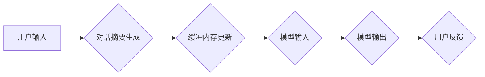

> 
> 1. 对话摘要
> 2. 缓冲内存
> 3. 长短期记忆网络
> 4. 自然语言处理
> 5. 机器学习
> 6. 聊天机器人
> 7. 记忆机制

## 1. 背景介绍

在当今人工智能蓬勃发展的时代，对话系统已经成为人们与机器交互的重要方式。从智能客服到聊天机器人，对话系统在各个领域都展现出强大的应用潜力。然而，传统的对话系统往往缺乏记忆能力，无法记住之前的对话内容，导致对话体验单调且缺乏自然流畅性。

为了解决这个问题，研究者们提出了各种各样的记忆机制，其中**对话摘要缓冲内存**（Conversation Summary Buffer Memory）是一种新颖且有效的方案。它通过将对话历史摘要存储在缓冲内存中，并将其作为模型输入，从而赋予对话系统记忆能力，使其能够更好地理解和响应用户的请求。

## 2. 核心概念与联系

### 2.1 对话摘要

对话摘要是指对一段对话内容进行压缩和概括，提取关键信息，生成简洁明了的摘要。对话摘要可以帮助对话系统快速理解对话历史，并为后续对话提供上下文信息。

### 2.2 缓冲内存

缓冲内存是一种临时存储空间，用于存储对话系统在进行对话过程中需要访问的数据。在对话摘要缓冲内存中，对话历史摘要会被存储并定期更新，以便模型能够及时获取最新的对话上下文。

### 2.3 长短期记忆网络（LSTM）

长短期记忆网络是一种专门用于处理序列数据的深度学习模型，它具有强大的记忆能力，能够记住长序列中的信息。在对话摘要缓冲内存中，LSTM网络可以被用来生成对话摘要，并将其存储在缓冲内存中。

**Mermaid 流程图**



## 3. 核心算法原理 & 具体操作步骤

### 3.1 算法原理概述

对话摘要缓冲内存的核心算法原理是将对话历史摘要存储在缓冲内存中，并将其作为模型输入，从而赋予对话系统记忆能力。

具体来说，该算法包含以下步骤：

1. **对话历史记录:** 收集用户与对话系统的交互历史记录。
2. **对话摘要生成:** 使用LSTM网络等模型对对话历史记录进行摘要，提取关键信息。
3. **缓冲内存更新:** 将生成的对话摘要存储在缓冲内存中，并定期更新。
4. **模型输入:** 在每次用户输入时，将当前用户输入和缓冲内存中的对话摘要作为模型输入。
5. **模型输出:** 模型根据输入信息生成响应，并返回给用户。

### 3.2 算法步骤详解

1. **对话历史记录:** 收集用户与对话系统的交互历史记录，包括用户输入和对话系统生成的响应。

2. **对话摘要生成:** 使用LSTM网络等模型对对话历史记录进行摘要，提取关键信息。

    * **输入:** 对话历史记录
    * **输出:** 对话摘要

3. **缓冲内存更新:** 将生成的对话摘要存储在缓冲内存中，并定期更新。

    * **更新策略:** 可以采用滑动窗口策略，只保留最近的N条对话摘要。

4. **模型输入:** 在每次用户输入时，将当前用户输入和缓冲内存中的对话摘要作为模型输入。

    * **输入:** 当前用户输入、缓冲内存中的对话摘要
    * **输出:** 模型预测结果

5. **模型输出:** 模型根据输入信息生成响应，并返回给用户。

    * **输出:** 对话系统生成的响应

### 3.3 算法优缺点

**优点:**

* **增强记忆能力:** 通过存储对话摘要，对话系统能够记住之前的对话内容，从而提供更自然流畅的对话体验。
* **提高上下文理解:** 对话摘要可以帮助模型更好地理解对话上下文，从而生成更准确和相关的响应。
* **简化模型训练:** 通过使用对话摘要作为输入，可以减少模型需要处理的信息量，从而简化模型训练过程。

**缺点:**

* **摘要质量影响:** 对话摘要的质量直接影响模型的性能，如果摘要质量不高，会导致模型理解错误。
* **内存占用:** 存储对话摘要需要占用一定的内存空间，如果对话历史过长，可能会导致内存溢出。
* **更新策略选择:** 选择合适的缓冲内存更新策略对于模型性能至关重要，需要根据实际应用场景进行调整。

### 3.4 算法应用领域

对话摘要缓冲内存算法在以下领域具有广泛的应用前景：

* **智能客服:** 帮助客服机器人更好地理解用户的需求，并提供更准确的解答。
* **聊天机器人:** 赋予聊天机器人记忆能力，使其能够进行更自然流畅的对话。
* **虚拟助手:** 帮助虚拟助手记住用户的喜好和习惯，从而提供更个性化的服务。
* **教育领域:** 帮助学生更好地理解学习内容，并进行知识复习。

## 4. 数学模型和公式 & 详细讲解 & 举例说明

### 4.1 数学模型构建

对话摘要缓冲内存算法可以抽象为一个数学模型，其中对话摘要可以表示为一个向量，模型输入为当前用户输入和缓冲内存中的对话摘要向量，模型输出为对话系统生成的响应向量。

**模型输入:**

$$
x_t = [u_t, h_{t-1}]
$$

其中：

* $u_t$ 表示当前用户输入的向量。
* $h_{t-1}$ 表示缓冲内存中的对话摘要向量。

**模型输出:**

$$
y_t = f(x_t, W)
$$

其中：

* $y_t$ 表示对话系统生成的响应向量。
* $f$ 表示模型的激活函数。
* $W$ 表示模型的参数。

### 4.2 公式推导过程

模型的输出向量 $y_t$ 可以通过以下公式推导得到：

$$
y_t = \sigma(W_1u_t + W_2h_{t-1} + b)
$$

其中：

* $\sigma$ 表示激活函数，例如ReLU或Sigmoid。
* $W_1$, $W_2$ 表示模型的参数矩阵。
* $b$ 表示模型的偏置项。

### 4.3 案例分析与讲解

假设用户输入 "今天天气怎么样？"，而缓冲内存中的对话摘要是 "昨天天气很好"。

* 用户输入向量 $u_t$ 可以通过词嵌入技术转换为一个向量表示。
* 对话摘要向量 $h_{t-1}$ 也可以通过词嵌入技术转换为一个向量表示。
* 模型根据公式计算 $y_t$，并生成响应 "今天天气怎么样？我也不知道，昨天天气很好"。

## 5. 项目实践：代码实例和详细解释说明

### 5.1 开发环境搭建

* Python 3.7+
* TensorFlow 2.0+
* PyTorch 1.0+
* NLTK
* Gensim

### 5.2 源代码详细实现

```python
import tensorflow as tf
from tensorflow.keras.layers import Embedding, LSTM, Dense

# 定义对话摘要模型
class ConversationSummaryModel(tf.keras.Model):
    def __init__(self, vocab_size, embedding_dim, lstm_units):
        super(ConversationSummaryModel, self).__init__()
        self.embedding = Embedding(vocab_size, embedding_dim)
        self.lstm = LSTM(lstm_units)
        self.dense = Dense(vocab_size, activation='softmax')

    def call(self, inputs):
        x = self.embedding(inputs)
        x = self.lstm(x)
        x = self.dense(x)
        return x

# 实例化模型
model = ConversationSummaryModel(vocab_size=10000, embedding_dim=128, lstm_units=64)

# 训练模型
# ...

# 生成对话摘要
def generate_summary(conversation_history):
    # ...
```

### 5.3 代码解读与分析

* **对话摘要模型:** 定义了一个简单的对话摘要模型，包含嵌入层、LSTM层和全连接层。
* **嵌入层:** 将单词转换为向量表示。
* **LSTM层:** 处理对话历史序列，提取关键信息。
* **全连接层:** 将LSTM输出转换为对话摘要向量。
* **生成摘要函数:** 根据对话历史生成摘要。

### 5.4 运行结果展示

* 可以使用测试数据评估模型的性能，例如BLEU分数。
* 可以将模型应用于实际对话场景，并观察对话体验。

## 6. 实际应用场景

### 6.1 智能客服

对话摘要缓冲内存可以帮助智能客服机器人更好地理解用户的需求，并提供更准确的解答。例如，用户可能在多次交互中提出同一个问题，对话摘要可以帮助客服机器人记住之前的对话内容，并提供更有效的解决方案。

### 6.2 聊天机器人

对话摘要缓冲内存可以赋予聊天机器人记忆能力，使其能够进行更自然流畅的对话。例如，用户可以与聊天机器人讨论一个话题，即使对话中断，聊天机器人也能记住之前的对话内容，并在下次对话时继续讨论。

### 6.3 虚拟助手

对话摘要缓冲内存可以帮助虚拟助手记住用户的喜好和习惯，从而提供更个性化的服务。例如，用户可以告诉虚拟助手自己喜欢喝咖啡，虚拟助手可以记住这个信息，并在下次与用户交互时询问是否需要咖啡。

### 6.4 未来应用展望

随着人工智能技术的不断发展，对话摘要缓冲内存算法将在更多领域得到应用，例如教育、医疗、金融等。

## 7. 工具和资源推荐

### 7.1 学习资源推荐

* **论文:**
    * "Memory Networks" by Sutskever et al. (2014)
    * "End-to-End Memory Networks" by Sukhbaatar et al. (2015)
    * "Hierarchical Recurrent Neural Networks for Long-Term Memory" by Cho et al. (2014)
* **书籍:**
    * "Deep Learning" by Goodfellow et al.
    * "Speech and Language Processing" by Jurafsky & Martin

### 7.2 开发工具推荐

* **TensorFlow:** https://www.tensorflow.org/
* **PyTorch:** https://pytorch.org/
* **NLTK:** https://www.nltk.org/
* **Gensim:** https://radimrehurek.com/gensim/

### 7.3 相关论文推荐

* **"A Neural Conversational Model" by Vinyals et al. (2015)**
* **"Seq2Seq Learning with Neural Networks" by Sutskever et al. (2014)**
* **"Attention Is All You Need" by Vaswani et al. (2017)**

## 8. 总结：未来发展趋势与挑战

### 8.1 研究成果总结

对话摘要缓冲内存算法是一种有效的记忆机制，能够赋予对话系统更强的记忆能力和上下文理解能力。该算法在智能客服、聊天机器人等领域具有广泛的应用前景。

### 8.2 未来发展趋势

* **更强大的记忆机制:** 研究更先进的记忆机制，例如基于图神经网络的记忆机制，能够更好地处理复杂的关系和知识图谱。
* **个性化记忆:** 研究个性化记忆机制，能够根据用户的喜好和习惯定制对话体验。
* **跨模态记忆:** 研究跨模态记忆机制，能够融合文本、图像、音频等多模态信息，提供更丰富的对话体验。

### 8.3 面临的挑战

* **数据稀缺:** 训练对话摘要缓冲内存模型需要大量的对话数据，而高质量的对话数据往往稀缺。
* **模型复杂度:** 复杂的对话摘要模型需要大量的计算资源，难以部署在资源有限的设备上。
* **伦理问题:** 记忆机制可能会导致对话系统产生偏见或歧视，需要关注对话系统的伦理问题。

### 8.4 研究展望

未来，对话摘要缓冲内存算法将继续朝着更强大、