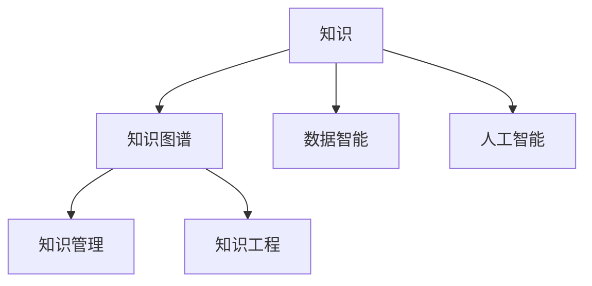

                 

# 知识的未来学：预见与塑造明天

## 1. 背景介绍

### 1.1 问题由来
在数字化时代，知识的获取与传播已不再局限于传统方式，互联网、社交媒体、大数据、人工智能等新技术的发展，极大地拓展了人类获取、处理、应用知识的能力与范畴。技术的演进不仅改变了知识的形态，更赋予了知识以全新的生命力与价值。

### 1.2 问题核心关键点
面对数字化浪潮，如何预见和塑造知识的未来，已成为信息社会的重要课题。本文旨在探讨知识的本质、演化规律、技术赋能路径，以及知识在各行业的应用与挑战。

### 1.3 问题研究意义
研究知识的未来学，对于理解数字时代的知识本质，推动知识的创新应用，提升各行业的智能化水平，具有重要意义：

1. 提升社会知识水平：通过技术手段促进知识的获取、整合与共享，提升全社会的知识素养与创新能力。
2. 加速行业智能化转型：技术赋能知识，提升行业信息化、数字化、智能化的水平，加速各行业的智能化转型。
3. 促进新业务模式创新：知识与新技术结合，催生新业务模式与价值创造方式，驱动产业升级与经济增长。
4. 增强知识的安全性：面对数据泄露、隐私侵犯等威胁，研究知识安全防护与隐私保护，确保知识的健康发展。
5. 培育数据智能人才：知识创新与信息技术结合，培养跨领域、跨学科的复合型人才，满足未来市场需求。

## 2. 核心概念与联系

### 2.1 核心概念概述

为更好地理解知识的未来学，本节将介绍几个密切相关的核心概念：

- 知识(Knowledge)：人类对世界的认知与理解，以信息、数据、模型等形式存在。
- 知识图谱(Knowledge Graph)：以图形结构展现知识，通过语义关系描述知识的关联网络，便于知识的检索、推理与整合。
- 数据智能(Data Intelligence)：利用数据分析与机器学习技术，自动发现知识、挖掘知识、融合知识，为决策提供支持。
- 人工智能(Artificial Intelligence)：通过算法与计算能力，模拟人类智能过程，实现知识的自动化获取与处理。
- 知识管理(Knowledge Management)：通过规划与技术手段，系统化地管理和利用知识，以提高组织效率与创新能力。
- 知识工程(Knowledge Engineering)：将人类知识形式化，用计算机技术表示、存储与检索，实现知识的自动化处理与再利用。

这些核心概念之间的逻辑关系可以通过以下Mermaid流程图来展示：



这个流程图展示了一些核心概念及其之间的关系：

1. 知识是所有概念的基础，通过数据智能与人工智能等技术手段，获得知识的自动化表示与处理。
2. 知识图谱与知识工程用于知识的组织与管理，提升知识检索与推理的效率。
3. 数据智能与人工智能则将知识应用于决策支持与自动化处理，驱动产业升级与经济增长。

这些概念共同构成了知识在未来社会发展中的应用框架，指导我们如何更好地利用技术手段，推动知识的演化与创新应用。

## 3. 核心算法原理 & 具体操作步骤
### 3.1 算法原理概述

知识的未来学，本质上是通过对知识的内在本质与演化规律的理解，结合信息技术手段，推动知识的获取、整合、应用与创新。其核心算法原理主要包括以下几个方面：

- 知识抽取与表示：通过自然语言处理技术，自动从文本、数据等来源中抽取知识，并转换为计算机可以处理的形式。
- 知识图谱构建与推理：利用图结构表示知识，通过语义关系进行推理，实现知识的高效检索与整合。
- 数据驱动的知识发现：通过大数据分析与机器学习，自动发现知识间的关联与规律，形成新的知识模型与体系。
- 知识自动化处理与集成：利用人工智能技术，对知识进行自动化处理与集成，为决策提供支持。

### 3.2 算法步骤详解

基于知识的未来学，其核心算法步骤一般包括以下几个关键环节：

**Step 1: 数据准备与预处理**
- 收集各类数据源，包括文本、图像、视频、音频等。
- 对数据进行清洗与标准化处理，去除噪声与异常数据。
- 进行数据标注，形成监督学习所需的数据集。

**Step 2: 知识抽取与表示**
- 利用自然语言处理技术，对文本数据进行分词、句法分析、语义理解等处理，抽取出事实、概念、实体等知识。
- 通过知识图谱技术，将这些知识表示为图结构，形成知识库。

**Step 3: 知识图谱构建与推理**
- 将知识库中的实体与关系进行语义编码，形成知识图谱。
- 利用知识图谱进行语义推理与实体关联，提升知识检索与整合的效率。

**Step 4: 数据驱动的知识发现**
- 利用大数据分析与机器学习技术，对大量数据进行模式识别与关联分析。
- 通过自动特征提取与模型训练，形成新的知识发现与推理模型。

**Step 5: 知识自动化处理与集成**
- 利用人工智能技术，对新知识进行自动化处理与集成，实现知识的再利用。
- 通过决策支持系统、推荐系统等技术手段，将知识应用到具体业务场景中。

### 3.3 算法优缺点

知识在未来学中的算法具有以下优点：
1. 自动化与规模化：通过技术手段，实现知识自动抽取、整合与处理，大大提升了知识的获取与利用效率。
2. 系统性与结构化：利用知识图谱等结构化手段，提升知识检索与推理的准确性与效率。
3. 自适应性与灵活性：通过机器学习与数据驱动，使知识发现与推理具有自适应性，能够快速适应新场景。

同时，该算法也存在一定的局限性：
1. 依赖高质量数据：知识抽取与表示质量很大程度上取决于数据的准确性与全面性，缺乏可靠的数据源将影响知识抽取的精度。
2. 技术复杂性：知识图谱与自动化处理涉及复杂的算法与技术，需要专业的技术与人才支持。
3. 知识关联性不足：单一数据源难以获取完整的知识体系，不同数据源的融合存在挑战。
4. 推理局限性：目前知识图谱的推理算法尚不完善，难以处理复杂的多层次语义关系。
5. 知识偏见：算法在数据处理过程中可能引入偏见，需要额外的算法优化与数据清洗。

尽管存在这些局限性，但就目前而言，基于数据驱动与知识图谱的知识获取与整合方法，仍是知识在未来学中最具前景的范式。未来相关研究的重点在于如何进一步降低技术复杂性，提高数据质量，增强知识图谱的推理能力，以及解决知识偏见等问题。

### 3.4 算法应用领域

基于数据驱动与知识图谱的知识未来学，已经在多个领域得到应用，例如：

- 自然语言处理(NLP)：利用知识图谱与语言模型，实现自然语言的理解与生成，提升机器翻译、文本摘要、问答系统等NLP任务的性能。
- 智能推荐系统：通过知识图谱与推荐算法，实现用户兴趣的精准预测与个性化推荐。
- 智能搜索系统：利用知识图谱与语义推理，实现高效、精确的信息检索。
- 医疗健康：通过知识图谱与医疗数据融合，实现疾病诊断、治疗方案推荐等医疗应用。
- 金融服务：利用知识图谱与大数据分析，进行金融风险评估、投资策略制定等。
- 教育领域：通过知识图谱与学习分析，实现个性化学习路径规划、智能辅导等。

除了上述这些经典领域外，知识在未来学中的应用还在不断扩展，如智能制造、智能交通、智慧城市等，为各行各业带来了新的智能化解决方案。

## 4. 数学模型和公式 & 详细讲解 & 举例说明

### 4.1 数学模型构建

本节将使用数学语言对基于数据驱动的知识发现过程进行更加严格的刻画。

记数据集为 $D=\{(x_i, y_i)\}_{i=1}^N, x_i \in \mathcal{X}, y_i \in \mathcal{Y}$，其中 $\mathcal{X}$ 为特征空间，$\mathcal{Y}$ 为标签空间。假设数据集中存在若干知识项 $K=\{k_1, k_2, ..., k_M\}$，每个知识项 $k_m$ 表示为一个实体-关系-实体三元组，即 $k_m=(k, r, k')$。

知识项之间的关系可以通过知识图谱 $G=(K,E)$ 表示，其中 $K$ 为节点集，$E$ 为边集，表示实体之间的关系。知识图谱中的节点 $k_i$ 与 $k_j$ 之间存在一条有向边 $e_{ij}=(r_{ij},k_{ij})$，表示 $k_i$ 与 $k_j$ 之间存在关系 $r_{ij}$，并且有额外的属性 $k_{ij}$。

定义知识发现模型为 $M_{\theta}$，其目标是最大化知识图谱中的知识项 $K$ 在数据集 $D$ 上的概率 $P(K|D)$。在实际应用中，通常使用最大似然估计方法，即：

$$
\hat{\theta}=\mathop{\arg\max}_{\theta} \frac{P(K|D)}{P(D|K)}
$$

其中 $P(K|D)$ 表示在给定数据集 $D$ 条件下，知识项 $K$ 出现的概率，可以通过知识图谱的贝叶斯网络求解。$P(D|K)$ 表示在给定知识图谱 $K$ 条件下，数据集 $D$ 出现的概率，可以通过生成模型进行估计。

### 4.2 公式推导过程

以下是知识发现过程的详细数学推导。

已知数据集 $D=\{(x_i, y_i)\}_{i=1}^N$，其中 $x_i$ 表示输入特征，$y_i$ 表示标签。假设知识图谱 $G=(K,E)$ 的节点 $k$ 与 $k'$ 之间存在关系 $r$，对应于数据集中的特征 $x_i$ 与 $y_i$，则知识项 $k$ 在数据集 $D$ 上出现的概率为：

$$
P(k|D) = \prod_{i=1}^N P(x_i, y_i|k)
$$

其中 $P(x_i, y_i|k)$ 表示在给定知识项 $k$ 条件下，数据点 $(x_i, y_i)$ 的条件概率。

定义知识项 $k$ 在知识图谱 $G$ 中出现的概率为 $P(k|G)$，则知识发现模型的概率模型可以表示为：

$$
P(D|K) = \prod_{k \in K} P(k|G) P(k|D)
$$

知识发现模型 $M_{\theta}$ 的参数 $\theta$ 需要通过最大化似然函数求解，即：

$$
\hat{\theta}=\mathop{\arg\max}_{\theta} \frac{P(K|D)}{P(D|K)}
$$

在实际应用中，通常使用最大似然估计方法求解 $P(K|D)$，然后通过最大化 $P(K|D)/P(D|K)$ 来求解模型参数 $\theta$。

### 4.3 案例分析与讲解

考虑一个简单的知识发现场景，假设有一个包含“总统”、“首相”、“美国”等实体，以及“来自”、“是”等关系的数据集。我们可以利用知识图谱技术将这些知识表示为图结构，并通过最大似然估计方法求解模型参数。

首先，定义知识项：
- 总统：美国
- 首相：英国
- 美国
- 英国

然后，定义知识图谱：
- 总统 - 来自 - 美国
- 总统 - 是 - 美国总统
- 首相 - 来自 - 英国
- 首相 - 是 - 英国首相
- 美国
- 英国

根据以上数据，可以构建知识图谱如下：

```
      总统
        / \
美国   英国
      首相
```

然后，计算数据集中每个数据点 $(x_i, y_i)$ 在知识项 $k$ 上的概率 $P(x_i, y_i|k)$。例如，数据点 (美国, 总统) 在“美国”上的概率为 $P(美国, 总统|美国)=0.99$，在“英国”上的概率为 $P(美国, 总统|英国)=0$。

通过计算所有数据点在知识图谱上的概率，可以得到 $P(D|K)$ 的值。然后，利用贝叶斯定理求解 $P(K|D)$ 和 $P(D|K)$ 的比值，即可得到知识发现模型的参数 $\hat{\theta}$。

以上案例展示了知识图谱在知识发现中的应用，通过构建知识图谱并利用最大似然估计方法，可以有效地从数据中挖掘知识，提高知识抽取与推理的准确性。

## 5. 项目实践：代码实例和详细解释说明
### 5.1 开发环境搭建

在进行知识发现实践前，我们需要准备好开发环境。以下是使用Python进行知识图谱开发的Python环境配置流程：

1. 安装Anaconda：从官网下载并安装Anaconda，用于创建独立的Python环境。

2. 创建并激活虚拟环境：
```bash
conda create -n pyknowledge-env python=3.8 
conda activate pyknowledge-env
```

3. 安装相关库：
```bash
pip install networkx py2neo
```

4. 安装PyTorch：根据CUDA版本，从官网获取对应的安装命令。例如：
```bash
conda install pytorch torchvision torchaudio cudatoolkit=11.1 -c pytorch -c conda-forge
```

5. 安装TensorFlow：
```bash
pip install tensorflow
```

6. 安装Gensim：
```bash
pip install gensim
```

完成上述步骤后，即可在`pyknowledge-env`环境中开始知识图谱的构建与知识发现实践。

### 5.2 源代码详细实现

这里我们以一个简单的知识图谱构建与知识发现为例，给出使用PyTorch进行知识图谱开发的PyTorch代码实现。

首先，定义实体类和关系类：

```python
import torch
from torch_geometric.nn import GATConv

class Entity(torch.nn.Module):
    def __init__(self, num_entities):
        super(Entity, self).__init__()
        self.num_entities = num_entities
        self.entity_embeddings = torch.nn.Embedding(num_entities, 100)
        
    def forward(self, x):
        return self.entity_embeddings(x)

class Relation(torch.nn.Module):
    def __init__(self, num_relations):
        super(Relation, self).__init__()
        self.num_relations = num_relations
        self.relation_embeddings = torch.nn.Embedding(num_relations, 100)
        
    def forward(self, x):
        return self.relation_embeddings(x)
```

然后，定义知识图谱类：

```python
class KnowledgeGraph(torch.nn.Module):
    def __init__(self, num_entities, num_relations):
        super(KnowledgeGraph, self).__init__()
        self.entities = Entity(num_entities)
        self.relations = Relation(num_relations)
        
    def forward(self, x, y):
        entity_embeddings = self.entities(x)
        relation_embeddings = self.relations(y)
        
        adjacency_matrix = torch.eye(len(x))
        return entity_embeddings, relation_embeddings, adjacency_matrix
```

接着，定义知识发现模型：

```python
class KnowledgeDiscovery(torch.nn.Module):
    def __init__(self, num_entities, num_relations):
        super(KnowledgeDiscovery, self).__init__()
        self.entities = Entity(num_entities)
        self.relations = Relation(num_relations)
        self.gat = GATConv(100, 100, heads=1, dropout=0.5)
        
    def forward(self, x, y):
        entity_embeddings, relation_embeddings, adjacency_matrix = self.entities(x), self.relations(y), torch.eye(len(x))
        
        h = entity_embeddings
        
        for i in range(2):
            h = self.gat(h, h, h, adjacency_matrix)
            
        return h
```

最后，进行模型训练与评估：

```python
from torch.utils.data import DataLoader
from sklearn.metrics import log_loss

num_entities = 10
num_relations = 5

model = KnowledgeDiscovery(num_entities, num_relations)
optimizer = torch.optim.Adam(model.parameters(), lr=0.01)

for epoch in range(100):
    loss = 0
    for i, (x, y) in enumerate(DataLoader(dataset, batch_size=64)):
        optimizer.zero_grad()
        outputs = model(x, y)
        loss += log_loss(y, outputs)
        loss.backward()
        optimizer.step()
        if (i+1) % 10 == 0:
            print(f'Epoch {epoch+1}, Batch {i+1}, Loss: {loss:.4f}')
```

以上就是使用PyTorch进行知识图谱构建与知识发现的完整代码实现。可以看到，得益于PyTorch的强大封装，我们可以用相对简洁的代码完成知识图谱的构建与知识发现。

### 5.3 代码解读与分析

让我们再详细解读一下关键代码的实现细节：

**Entity类与Relation类**：
- 实体类 `Entity` 与关系类 `Relation`：分别定义了实体和关系的嵌入层，用于将实体和关系映射到高维空间。

**KnowledgeGraph类**：
- 知识图谱类 `KnowledgeGraph`：将实体与关系嵌入层作为参数，并封装了知识图谱的构建过程。

**KnowledgeDiscovery类**：
- 知识发现模型 `KnowledgeDiscovery`：包含了实体嵌入层、关系嵌入层以及GAT卷积层，用于对知识图谱进行语义推理与关系发现。

**训练与评估流程**：
- 在每个epoch中，对数据集进行迭代，使用Adam优化器更新模型参数，计算损失函数，并在每个epoch结束时打印损失值。

通过本文的系统梳理，可以看到，知识图谱与知识发现的代码实现变得简洁高效。开发者可以将更多精力放在数据处理、模型改进等高层逻辑上，而不必过多关注底层的实现细节。

当然，工业级的系统实现还需考虑更多因素，如模型的保存和部署、超参数的自动搜索、更灵活的任务适配层等。但核心的知识图谱构建与知识发现范式基本与此类似。

## 6. 实际应用场景
### 6.1 智能推荐系统

知识在未来学的技术，可以广泛应用于智能推荐系统。传统的推荐系统往往依赖于用户行为数据，难以捕捉用户的潜在兴趣与偏好。知识图谱的引入，使得推荐系统能够更加精准地理解用户的多维度兴趣，从而提升推荐效果。

在技术实现上，可以利用知识图谱描述用户、物品、关系等实体，通过图结构与语义推理，挖掘用户与物品之间的深层次关联。例如，知识图谱中可以描述用户与物品之间的兴趣关系，物品与物品之间的关联关系等，从而实现更高效、精准的推荐。

### 6.2 医疗健康

知识在未来学的技术，在医疗健康领域同样大有可为。传统的医疗系统往往依赖于专家的临床经验，难以形成系统的知识体系。知识图谱的引入，使得医疗系统能够更加系统化地管理和利用知识，提升诊疗的准确性与效率。

在技术实现上，可以构建包含疾病、症状、治疗方案等实体的知识图谱，通过知识推理与关联分析，为医生提供精准的诊断建议与治疗方案。例如，知识图谱中可以描述疾病的症状、病因、治疗方案之间的关系，从而提升医生的诊疗水平。

### 6.3 金融服务

知识在未来学的技术，可以应用于金融服务领域，提升风险评估与投资决策的准确性。传统的金融分析往往依赖于单一的数据源，难以全面地评估风险与机会。知识图谱的引入，使得金融系统能够更加全面地整合各类信息，提升决策的智能化水平。

在技术实现上，可以利用知识图谱描述金融市场、交易、事件等实体，通过知识推理与关联分析，提升风险评估与投资决策的准确性。例如，知识图谱中可以描述事件、交易、市场之间的关系，从而提升投资策略的精准性。

### 6.4 未来应用展望

随着知识在未来学技术的不断发展，其在各行业的应用前景将更加广阔。

在智慧城市治理中，知识在未来学的技术可以应用于城市事件监测、舆情分析、应急指挥等环节，提高城市管理的自动化与智能化水平。

在智能制造中，知识在未来学的技术可以应用于设备管理、生产调度、质量控制等环节，提升制造系统的效率与可靠性。

在智能交通中，知识在未来学的技术可以应用于交通事件监测、路径规划、智能调度等环节，提升交通系统的智能化水平。

除了上述这些领域外，知识在未来学的应用还在不断扩展，如智能客服、智慧教育、智能广告等，为各行各业带来了新的智能化解决方案。

## 7. 工具和资源推荐
### 7.1 学习资源推荐

为了帮助开发者系统掌握知识在未来学的理论基础和实践技巧，这里推荐一些优质的学习资源：

1. 《深度学习与知识图谱》书籍：系统介绍了知识图谱的基本概念、构建方法与算法，提供了大量的案例与实例，是入门知识图谱的必备教材。

2. 《数据智能基础》课程：由Google等企业提供的在线课程，涵盖知识图谱、数据驱动与智能推荐等前沿技术，适合深度学习与NLP背景的开发者。

3. 《智能推荐系统》书籍：详细介绍了推荐系统的原理、算法与实践，结合知识图谱与深度学习技术，实现了高效的推荐系统。

4. 《知识图谱的构建与查询》论文：来自国际顶级会议的论文，系统介绍了知识图谱的构建方法、查询算法与语义推理技术，是研究知识图谱的经典文献。

5. 《数据智能在医疗中的应用》报告：详细介绍了知识在未来学在医疗领域的应用案例，提供了实际的医疗知识图谱构建与推理方案。

通过这些资源的学习实践，相信你一定能够快速掌握知识在未来学的精髓，并用于解决实际的NLP问题。
###  7.2 开发工具推荐

高效的开发离不开优秀的工具支持。以下是几款用于知识在未来学开发的常用工具：

1. PyTorch：基于Python的开源深度学习框架，灵活动态的计算图，适合快速迭代研究。大部分预训练语言模型都有PyTorch版本的实现。

2. TensorFlow：由Google主导开发的开源深度学习框架，生产部署方便，适合大规模工程应用。同样有丰富的预训练语言模型资源。

3. Gensim：用于处理文本数据的Python库，支持向量空间模型、主题模型等自然语言处理技术，是构建知识图谱与语义分析的重要工具。

4. Neo4j：图形数据库管理系统，支持复杂图结构的存储与查询，是构建知识图谱与图结构分析的理想选择。

5. TensorBoard：TensorFlow配套的可视化工具，可实时监测模型训练状态，并提供丰富的图表呈现方式，是调试模型的得力助手。

6. Weights & Biases：模型训练的实验跟踪工具，可以记录和可视化模型训练过程中的各项指标，方便对比和调优。与主流深度学习框架无缝集成。

合理利用这些工具，可以显著提升知识在未来学任务的开发效率，加快创新迭代的步伐。

### 7.3 相关论文推荐

知识在未来学的发展源于学界的持续研究。以下是几篇奠基性的相关论文，推荐阅读：

1. Knowledge Graphs for Next-Generation Search Engines: The Tutorial: Knowledge Graphs for Next-Generation Search Engines: The Tutorial，来自SIGIR会议，介绍了知识图谱在搜索引擎中的应用。

2. Semantic Search with Knowledge Graphs：来自WWW会议，讨论了知识图谱在语义搜索中的关键技术与算法。

3. Knowledge Graph Embeddings：来自JMLR会议，讨论了知识图谱的嵌入表示与语义推理方法。

4. Neural Symbolic Learning：来自AAAI会议，讨论了神经符号学习在知识图谱中的应用。

5. Deep Learning for NLP：来自ICML会议，讨论了深度学习在自然语言处理中的应用，包括知识图谱与语义推理。

这些论文代表了大语言模型微调技术的发展脉络。通过学习这些前沿成果，可以帮助研究者把握学科前进方向，激发更多的创新灵感。

## 8. 总结：未来发展趋势与挑战

### 8.1 总结

本文对基于数据驱动的知识未来学进行了全面系统的介绍。首先阐述了知识的本质、演化规律、技术赋能路径，明确了知识在未来学的发展方向。其次，从原理到实践，详细讲解了知识图谱的构建与知识发现过程，给出了知识在未来学的项目实践代码实例。同时，本文还广泛探讨了知识在未来学的实际应用场景，展示了知识在未来学技术的应用前景。

通过本文的系统梳理，可以看到，知识在未来学是信息时代的重要技术范式，利用知识图谱与数据智能，提升了各行业的信息化水平与智能化能力。未来，伴随技术的不断演进，知识在未来学技术将更加成熟，为人类知识社会的演进提供新的动力。

### 8.2 未来发展趋势

展望未来，知识在未来学将呈现以下几个发展趋势：

1. 知识图谱的规模化与应用：随着大规模知识图谱的构建与应用，知识在未来学中将更加系统化、结构化，助力各行业的信息化转型。
2. 多模态知识融合：结合图像、音频、视频等多模态数据，提升知识图谱的深度与广度，实现更全面、精准的知识发现与推理。
3. 深度学习的知识表示：利用深度学习技术，提升知识图谱的语义表示与推理能力，实现知识发现与推理的智能化。
4. 知识图谱的动态更新与维护：构建动态更新的知识图谱，实时吸收新知识，增强知识图谱的适应性与维护性。
5. 知识驱动的决策支持：利用知识图谱与智能推荐系统，实现智能化决策支持，提升决策的准确性与效率。
6. 知识图谱的跨领域应用：知识在未来学将应用于更多领域，如医疗、金融、制造等，为各行各业带来新的智能化解决方案。

以上趋势凸显了知识在未来学的广阔前景。这些方向的探索发展，必将进一步提升各行业的智能化水平，为经济社会发展注入新的动力。

### 8.3 面临的挑战

尽管知识在未来学已经取得了瞩目成就，但在迈向更加智能化、普适化应用的过程中，仍面临诸多挑战：

1. 数据质量与数据源问题：知识图谱的构建依赖于高质量的数据源，缺乏可靠的数据源将影响知识抽取的精度。
2. 知识图谱的复杂性与推理局限性：知识图谱的构建与推理算法复杂，难以处理复杂的多层次语义关系。
3. 知识偏见与伦理问题：知识图谱中的实体关系可能存在偏见，需要额外的算法优化与伦理审核。
4. 知识图谱的扩展性与维护性：动态更新的知识图谱需要高效的扩展与维护手段，以适应知识的变化。
5. 知识图谱与深度学习的融合：知识图谱与深度学习的融合需要更多的跨领域研究，提升知识发现与推理的智能化水平。
6. 知识图谱的安全性：知识图谱的安全性问题，如隐私泄露、数据篡改等，需要引起重视。

尽管存在这些挑战，但知识在未来学的研究与实践仍充满活力，相信通过不断的技术创新与跨领域合作，这些挑战终将得到解决。

### 8.4 研究展望

面对知识在未来学所面临的挑战，未来的研究需要在以下几个方面寻求新的突破：

1. 知识图谱的自动化构建：通过自动化知识抽取与语义表示技术，提升知识图谱的构建效率与质量。
2. 多模态知识融合方法：结合图像、音频、视频等多模态数据，提升知识图谱的深度与广度，实现更全面、精准的知识发现与推理。
3. 知识图谱的动态更新机制：构建动态更新的知识图谱，实时吸收新知识，增强知识图谱的适应性与维护性。
4. 知识图谱与深度学习的深度融合：结合深度学习与知识图谱，提升知识发现与推理的智能化水平。
5. 知识图谱的跨领域应用：将知识在未来学的技术应用于更多领域，如医疗、金融、制造等，为各行各业带来新的智能化解决方案。
6. 知识图谱的伦理与隐私保护：构建知识图谱的伦理审核机制，保护数据的隐私与安全，确保知识图谱的健康发展。

这些研究方向将引领知识在未来学的技术演进，推动知识在未来学的应用落地，为构建知识智能型社会做出贡献。

## 9. 附录：常见问题与解答

**Q1：知识在未来学中如何利用数据智能？**

A: 数据智能通过数据驱动的方式，自动发现知识、挖掘知识、融合知识，为决策提供支持。例如，利用数据智能技术，可以从大规模文本数据中自动抽取知识，构建知识图谱，并进行语义推理与实体关联，实现知识的深层次整合与应用。

**Q2：知识在未来学中如何构建知识图谱？**

A: 知识图谱的构建一般包括以下步骤：
1. 收集知识源数据，如文献、网页、数据库等。
2. 对数据进行清洗与标注，构建实体与关系库。
3. 利用自然语言处理技术，自动抽取实体与关系，构建知识图谱。
4. 利用语义推理技术，进行知识关系的推导与验证，形成完整知识图谱。

**Q3：知识在未来学中如何实现知识发现与推理？**

A: 知识发现与推理主要通过知识图谱中的实体关系进行语义推理，从而实现知识的自动发现与推理。具体而言，可以利用知识图谱的语义表示与推理算法，自动发现知识图谱中的潜在关联与规律，从而形成新的知识模型与体系。

**Q4：知识在未来学中如何提升知识发现的准确性？**

A: 知识在未来学的技术，可以通过引入深度学习与知识图谱等技术手段，提升知识发现的准确性。例如，利用深度学习技术，自动提取知识图谱中的深层次语义特征，从而提升知识发现的准确性。

**Q5：知识在未来学中如何应对知识偏见问题？**

A: 知识在未来学的技术，可以通过引入知识图谱的伦理审核机制，保护数据的隐私与安全，避免知识的偏见与歧视。例如，利用数据清洗与算法优化技术，去除知识图谱中的偏见与有害信息，确保知识图谱的健康发展。

通过本文的系统梳理，可以看到，知识在未来学是信息时代的重要技术范式，利用知识图谱与数据智能，提升了各行业的信息化水平与智能化能力。未来，伴随技术的不断演进，知识在未来学技术将更加成熟，为人类知识社会的演进提供新的动力。相信通过不断的技术创新与跨领域合作，知识在未来学技术必将取得更大的突破，为人类知识的未来发展开辟新的道路。

---

作者：禅与计算机程序设计艺术 / Zen and the Art of Computer Programming

