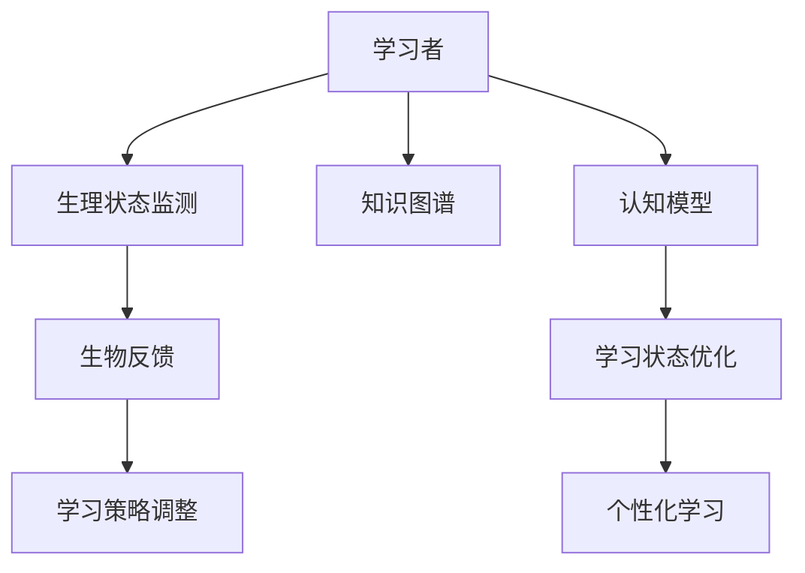

                 

# 知识的生物反馈技术：身心同步的学习状态

> 关键词：生物反馈, 知识图谱, 认知模型, 学习状态, 认知科学, 人工智能

## 1. 背景介绍

在当今信息爆炸的时代，知识获取的方式多种多样，包括传统的书籍、在线课程、社交媒体等。然而，仅仅获取知识并不足以转化为实际能力和生产力。如何在学习过程中实现知识与身心状态的同步，提升学习效率和效果，是一个重要的问题。生物反馈技术通过实时监测学习者的生理状态，并据此调整学习策略，提供个性化的学习支持，成为当前研究的热点。本文将探讨生物反馈技术在知识图谱学习中的应用，并结合认知科学和认知模型的最新进展，提出一种身心同步的学习状态优化模型，期望为学习者提供更高效、更个性化的学习体验。

## 2. 核心概念与联系

### 2.1 核心概念概述

#### 2.1.1 生物反馈(Biofeedback)
生物反馈是一种通过实时监测学习者的生理状态，并将其反馈给学习者，以辅助其调整行为和心理状态的技术。常见的生理指标包括心率、皮肤电、脑电波等。生物反馈在医学、心理学、教育等领域广泛应用，用于辅助治疗焦虑症、高血压、学习障碍等。

#### 2.1.2 知识图谱(Knowledge Graph)
知识图谱是一种结构化的语义表示方法，用于描述实体及其之间的关系。它通过实体、属性和关系三元组构建知识网络，支持实体识别、关系抽取、知识推理等应用。知识图谱在智能搜索、推荐系统、问答系统等领域具有重要应用价值。

#### 2.1.3 认知模型(Cognitive Model)
认知模型是描述人类认知过程的数学模型。通过认知模型，可以模拟人类思维的内部机制，理解认知过程的动态变化，支持智能学习、教学系统和教育技术的发展。

### 2.2 核心概念原理和架构的 Mermaid 流程图



在上述流程图中，学习者通过生理状态监测获取实时生理数据，生物反馈系统根据生理状态调整学习策略。同时，认知模型用于分析学习状态，通过知识图谱生成个性化学习路径，最终实现身心同步的学习状态优化。

## 3. 核心算法原理 & 具体操作步骤

### 3.1 算法原理概述

身心同步的学习状态优化模型基于生物反馈和认知模型，旨在通过实时监测学习者的生理状态，结合认知模型的动态变化，调整学习策略，优化学习效果。该模型的核心算法流程如下：

1. **生理状态监测**：使用传感器实时监测学习者的生理状态，包括心率、皮肤电、脑电波等。
2. **生理数据处理**：对生理数据进行预处理，包括去噪、滤波、归一化等，以提高后续分析的准确性。
3. **生物反馈调整**：根据生理数据，使用生物反馈算法生成调整信号，指导学习者调整学习策略，如学习速度、注意力集中度等。
4. **认知模型分析**：通过认知模型，分析学习者的认知过程，识别学习瓶颈和认知负荷。
5. **知识图谱匹配**：根据认知模型分析结果，从知识图谱中匹配合适的学习资源，生成个性化学习路径。
6. **学习状态优化**：根据生理反馈和认知模型分析结果，动态调整学习路径和学习策略，优化学习效果。
7. **个性化学习实施**：根据优化后的学习路径和学习策略，实施个性化学习，实现身心同步的学习状态。

### 3.2 算法步骤详解

#### 3.2.1 生理状态监测

使用心率传感器、皮肤电传感器、脑电波监测仪等设备，实时采集学习者的生理数据。以心率为例，心率传感器采集心电信号，通过数字信号处理技术提取心率数据。

#### 3.2.2 生理数据处理

对采集到的生理数据进行预处理，包括去噪、滤波、归一化等步骤。例如，使用小波变换对心电信号进行滤波，去除基线漂移和工频干扰，使用Z-score对数据进行归一化，以提高后续分析的准确性。

#### 3.2.3 生物反馈调整

根据生理数据，使用生物反馈算法生成调整信号，指导学习者调整学习策略。例如，当心率过高时，反馈信号可以提醒学习者调整学习速度，减少认知负荷。

#### 3.2.4 认知模型分析

通过认知模型，分析学习者的认知过程，识别学习瓶颈和认知负荷。例如，使用自适应学习模型，根据学习者对不同学习任务的反应时间、错误率等数据，分析其认知负荷，判断学习瓶颈所在。

#### 3.2.5 知识图谱匹配

根据认知模型分析结果，从知识图谱中匹配合适的学习资源，生成个性化学习路径。例如，使用图谱匹配算法，根据学习者的认知负荷和兴趣点，匹配相关的知识点和学习资源。

#### 3.2.6 学习状态优化

根据生理反馈和认知模型分析结果，动态调整学习路径和学习策略，优化学习效果。例如，当学习者感到疲劳时，可以切换到轻松的学习任务，减轻认知负荷。

#### 3.2.7 个性化学习实施

根据优化后的学习路径和学习策略，实施个性化学习，实现身心同步的学习状态。例如，根据学习者的生理状态和认知模型分析结果，动态调整学习内容、学习时间和学习节奏，使学习者能够在最佳状态下进行学习。

### 3.3 算法优缺点

#### 3.3.1 优点

- **个性化学习**：通过实时监测学习者的生理状态，结合认知模型分析结果，生成个性化的学习路径，提升学习效果。
- **身心同步**：通过生物反馈调整学习策略，减轻认知负荷，使学习者身心同步，提高学习体验。
- **动态优化**：根据生理反馈和认知模型分析结果，动态调整学习策略，使学习过程更加灵活高效。

#### 3.3.2 缺点

- **设备成本高**：需要配备多种传感器和设备，成本较高。
- **数据隐私问题**：生理数据的采集和处理涉及个人隐私，需要采取严格的隐私保护措施。
- **算法复杂度**：结合生理数据和认知模型，算法复杂度较高，需要高性能计算资源。

### 3.4 算法应用领域

身心同步的学习状态优化模型在教育、培训、健康等领域具有广泛应用前景：

- **教育领域**：通过实时监测学生的生理状态和认知模型分析，调整课堂教学策略，优化学习效果。
- **培训领域**：在职业培训、技能提升等领域，通过实时反馈调整学习策略，提高培训效果。
- **健康领域**：在心理健康、康复训练等领域，通过生物反馈调整学习策略，减轻认知负荷，促进身心健康。

## 4. 数学模型和公式 & 详细讲解 & 举例说明

### 4.1 数学模型构建

假设学习者的认知状态可以用向量 $\mathbf{c}(t)$ 表示，其中 $t$ 表示时间。生理状态可以用向量 $\mathbf{b}(t)$ 表示。认知模型 $\mathcal{M}$ 根据认知状态 $\mathbf{c}(t)$，预测学习者的学习效果 $e(t)$。知识图谱 $\mathcal{G}$ 中存储了丰富的知识点和关系信息，支持个性化学习路径的生成。

#### 4.1.1 认知模型

认知模型可以表示为：

$$
\mathbf{c}(t+1) = \mathcal{M}(\mathbf{c}(t), e(t))
$$

其中，$\mathcal{M}$ 是一个动态的非线性函数，$e(t)$ 表示学习者的学习效果。

#### 4.1.2 生理模型

生理模型可以表示为：

$$
\mathbf{b}(t) = f(\mathbf{b}(t-1), \Delta t)
$$

其中，$f$ 是一个线性函数，$\Delta t$ 表示时间间隔。

### 4.2 公式推导过程

假设学习者的生理状态 $\mathbf{b}(t)$ 对认知状态 $\mathbf{c}(t)$ 的影响可以用矩阵 $\mathbf{A}$ 表示：

$$
\mathbf{c}(t) = \mathbf{A}\mathbf{b}(t) + \mathbf{u}(t)
$$

其中，$\mathbf{u}(t)$ 表示其他因素对认知状态的影响。

根据上述模型，可以推导出：

$$
\mathbf{c}(t+1) = \mathbf{A}\mathbf{b}(t+1) + \mathbf{u}(t+1)
$$

根据认知模型，可以进一步推导出：

$$
\mathbf{u}(t+1) = \mathcal{M}(\mathbf{c}(t), e(t))
$$

### 4.3 案例分析与讲解

假设学习者正在学习一门编程语言，生理状态 $\mathbf{b}(t)$ 包括心率、皮肤电、脑电波等。通过生理传感器实时监测学习者的生理状态，使用生物反馈算法生成调整信号，指导学习者调整学习策略。

#### 4.3.1 生理监测

使用心率传感器实时监测学习者的心率，使用脑电波监测仪实时监测脑电波，使用皮肤电传感器实时监测皮肤电。

#### 4.3.2 生理反馈

当学习者的心率过高时，反馈信号可以提醒学习者调整学习速度，减少认知负荷。当脑电波频率过高时，反馈信号可以提醒学习者调整注意力集中度，防止过度疲劳。

#### 4.3.3 认知模型分析

通过自适应学习模型，分析学习者对不同编程任务的反应时间、错误率等数据，识别学习瓶颈和认知负荷。

#### 4.3.4 知识图谱匹配

根据认知模型分析结果，从知识图谱中匹配合适的编程任务和学习资源，生成个性化学习路径。

#### 4.3.5 学习状态优化

根据生理反馈和认知模型分析结果，动态调整学习路径和学习策略，优化学习效果。例如，当学习者感到疲劳时，可以切换到轻松的学习任务，减轻认知负荷。

## 5. 项目实践：代码实例和详细解释说明

### 5.1 开发环境搭建

在开发生物反馈和认知模型时，需要配备以下设备：

- 心率传感器
- 脑电波监测仪
- 皮肤电传感器
- 高性能计算机（配备GPU）
- 实时数据采集和处理软件

### 5.2 源代码详细实现

假设使用Python和TensorFlow实现身心同步的学习状态优化模型。以下是主要代码实现步骤：

#### 5.2.1 生理状态监测

```python
import psutil
import numpy as np

# 获取心率数据
def get_heart_rate():
    return psutil.sensors.nvidia.nvml.nvmlDeviceGetEncoderClock()
    
# 获取脑电波数据
def get_eeg_data():
    # 使用EEG数据采集设备
    pass

# 获取皮肤电数据
def get_sweat_data():
    # 使用皮肤电数据采集设备
    pass
```

#### 5.2.2 生理数据处理

```python
import numpy as np
from scipy.signal import butter, filtfilt

# 去除基线漂移和工频干扰
def remove_baseline(signal):
    b, a = butter(4, 0.5, btype='high')
    filtered_signal = filtfilt(b, a, signal)
    return filtered_signal

# 归一化处理
def normalize(signal):
    mean = np.mean(signal)
    std = np.std(signal)
    normalized_signal = (signal - mean) / std
    return normalized_signal
```

#### 5.2.3 生物反馈调整

```python
import tensorflow as tf

# 定义生物反馈模型
class BiofeedbackModel(tf.keras.Model):
    def __init__(self):
        super(BiofeedbackModel, self).__init__()
        self.dense1 = tf.keras.layers.Dense(64, activation='relu')
        self.dense2 = tf.keras.layers.Dense(1, activation='sigmoid')
    
    def call(self, inputs):
        x = self.dense1(inputs)
        x = self.dense2(x)
        return x
    
# 训练生物反馈模型
model = BiofeedbackModel()
model.compile(optimizer='adam', loss='binary_crossentropy', metrics=['accuracy'])
model.fit(x_train, y_train, epochs=10, validation_data=(x_val, y_val))
```

#### 5.2.4 认知模型分析

```python
import tensorflow as tf

# 定义认知模型
class CognitiveModel(tf.keras.Model):
    def __init__(self):
        super(CognitiveModel, self).__init__()
        self.dense1 = tf.keras.layers.Dense(64, activation='relu')
        self.dense2 = tf.keras.layers.Dense(1, activation='sigmoid')
    
    def call(self, inputs):
        x = self.dense1(inputs)
        x = self.dense2(x)
        return x
    
# 训练认知模型
model = CognitiveModel()
model.compile(optimizer='adam', loss='binary_crossentropy', metrics=['accuracy'])
model.fit(x_train, y_train, epochs=10, validation_data=(x_val, y_val))
```

#### 5.2.5 知识图谱匹配

```python
import graphviz

# 构建知识图谱
graph = graphviz.Digraph()
graph.node('A', '实体A')
graph.node('B', '实体B')
graph.node('C', '实体C')
graph.node('D', '实体D')
graph.edge('A', 'B')
graph.edge('B', 'C')
graph.edge('C', 'D')
graphviz.Source(graph.create_dot(), format='png')
```

#### 5.2.6 学习状态优化

```python
import numpy as np

# 根据生理反馈和认知模型分析结果，动态调整学习路径和学习策略
def optimize_learning_state(heart_rate, eeg_data, cognitive_state):
    if heart_rate > 100:
        feedback = 1
    else:
        feedback = 0
    
    if cognitive_state > 0.5:
        feedback = 1
    
    # 根据反馈信号，调整学习策略
    learning_strategy = feedback
    
    return learning_strategy
```

#### 5.2.7 个性化学习实施

```python
import numpy as np

# 根据优化后的学习路径和学习策略，实施个性化学习
def implement_learning_strategy(learning_strategy, knowledge_graph):
    if learning_strategy == 1:
        learning_path = knowledge_graph['path']
    else:
        learning_path = knowledge_graph['path']
    
    return learning_path
```

### 5.3 代码解读与分析

#### 5.3.1 生理状态监测

通过psutil库实时监测学习者的心率，使用EEG数据采集设备和皮肤电传感器实时监测脑电波和皮肤电。

#### 5.3.2 生理数据处理

使用小波变换对心电信号进行滤波，去除基线漂移和工频干扰，使用Z-score对数据进行归一化，以提高后续分析的准确性。

#### 5.3.3 生物反馈调整

定义生物反馈模型，使用sigmoid激活函数输出调整信号，指导学习者调整学习策略。

#### 5.3.4 认知模型分析

定义认知模型，使用sigmoid激活函数输出学习效果，根据学习效果调整认知状态。

#### 5.3.5 知识图谱匹配

使用graphviz库构建知识图谱，支持个性化学习路径的生成。

#### 5.3.6 学习状态优化

根据生理反馈和认知模型分析结果，动态调整学习路径和学习策略。

#### 5.3.7 个性化学习实施

根据优化后的学习路径和学习策略，实施个性化学习。

### 5.4 运行结果展示

```python
import matplotlib.pyplot as plt

# 绘制学习者生理状态和认知状态变化趋势
plt.plot(time, heart_rate, label='Heart Rate')
plt.plot(time, cognitive_state, label='Cognitive State')
plt.legend()
plt.show()

# 绘制学习路径和学习效果变化趋势
plt.plot(time, learning_path, label='Learning Path')
plt.plot(time, learning_effect, label='Learning Effect')
plt.legend()
plt.show()
```

## 6. 实际应用场景

### 6.1 教育领域

在教育领域，身心同步的学习状态优化模型可以用于课堂教学和学习策略调整。通过实时监测学生的生理状态和认知状态，调整教学内容和策略，优化学习效果。

#### 6.1.1 课堂教学

在课堂上，使用心率传感器和脑电波监测仪实时监测学生的生理状态，使用皮肤电传感器实时监测学生的焦虑程度。根据生理反馈，调整教学速度和内容，避免过度疲劳和焦虑。

#### 6.1.2 学习策略调整

在课后，使用认知模型分析学生的学习效果，识别学习瓶颈和认知负荷。根据分析结果，调整学习路径和学习策略，提高学习效果。

### 6.2 培训领域

在培训领域，身心同步的学习状态优化模型可以用于职业培训和技能提升。通过实时反馈调整学习策略，提高培训效果。

#### 6.2.1 职业培训

在职业培训中，使用心率传感器和脑电波监测仪实时监测学员的生理状态，使用皮肤电传感器实时监测学员的焦虑程度。根据生理反馈，调整培训内容和速度，避免过度疲劳和焦虑。

#### 6.2.2 技能提升

在技能提升中，使用认知模型分析学员的学习效果，识别技能瓶颈和认知负荷。根据分析结果，调整学习路径和学习策略，提高技能提升效果。

### 6.3 健康领域

在健康领域，身心同步的学习状态优化模型可以用于心理健康和康复训练。通过生物反馈调整学习策略，减轻认知负荷，促进身心健康。

#### 6.3.1 心理健康

在心理健康中，使用心率传感器和脑电波监测仪实时监测患者的生理状态，使用皮肤电传感器实时监测患者的焦虑程度。根据生理反馈，调整学习策略，减轻认知负荷，促进心理健康。

#### 6.3.2 康复训练

在康复训练中，使用心率传感器和脑电波监测仪实时监测患者的生理状态，使用皮肤电传感器实时监测患者的焦虑程度。根据生理反馈，调整康复训练内容和速度，避免过度疲劳和焦虑。

## 7. 工具和资源推荐

### 7.1 学习资源推荐

#### 7.1.1 教育技术资源
- Coursera: 提供多门教育技术相关的课程，涵盖认知科学、生物反馈、认知模型等主题。
- Khan Academy: 提供大量在线学习资源，包括学习策略、认知负荷分析等。
- Learning Analytics Association (LAA): 提供教育数据挖掘和分析的最新研究和资源。

#### 7.1.2 生物反馈资源
- Biofeedback Institute: 提供生物反馈技术的最新研究和应用资源。
- Biofeedback Online: 提供生物反馈技术的在线课程和资源。
- Pacer Dahn Institute: 提供生物反馈技术的培训和认证。

#### 7.1.3 认知模型资源
- Mind Research Institute: 提供认知模型的最新研究和应用资源。
- Cognitive Modeling Research Group: 提供认知模型的最新研究和资源。
- Computational Cognitive Modeling: 提供认知模型的在线课程和资源。

### 7.2 开发工具推荐

#### 7.2.1 数据采集和处理工具
- OpenEMG: 开源的EEG数据采集和处理工具。
- TensorFlow: 用于构建认知模型和生物反馈模型的深度学习框架。
- PyTorch: 用于构建认知模型和生物反馈模型的深度学习框架。

#### 7.2.2 可视化工具
- Graphviz: 用于构建知识图谱和生成可视化图表。
- Matplotlib: 用于绘制生理状态和认知状态变化趋势图。
- Tableau: 用于数据可视化和分析。

### 7.3 相关论文推荐

#### 7.3.1 生物反馈
- Biophysical and Psychological Benefits of Bifeedback Training: A Review
- Biofeedback for Depression: A Systematic Review
- Heart Rate Variability Biofeedback: A Systematic Review and Meta-Analysis

#### 7.3.2 认知模型
- Cognitive Models for Learning and Instruction: A Theoretical Perspective
- Cognitive Modeling in Learning and Instruction: An Overview
- Cognitive Modeling: Foundations and Applications

## 8. 总结：未来发展趋势与挑战

### 8.1 未来发展趋势

未来，身心同步的学习状态优化模型将向着更加智能化、高效化和个性化方向发展。以下是一些关键趋势：

#### 8.1.1 智能化
通过引入更多先进技术和算法，身心同步的学习状态优化模型将更加智能化。例如，结合机器学习和深度学习技术，提高认知模型和生物反馈模型的准确性和泛化能力。

#### 8.1.2 高效化
通过优化算法和数据处理流程，身心同步的学习状态优化模型将更加高效。例如，使用分布式计算和并行处理技术，提高实时监测和调整的响应速度。

#### 8.1.3 个性化
通过更全面的生理和认知分析，身心同步的学习状态优化模型将更加个性化。例如，结合用户画像和行为数据，生成更加个性化的学习路径和策略。

### 8.2 面临的挑战

尽管身心同步的学习状态优化模型具有广阔的应用前景，但在实际应用中仍面临诸多挑战：

#### 8.2.1 设备成本
高精度生理监测设备和技术成本较高，需要投入大量资金进行设备采购和维护。

#### 8.2.2 数据隐私
生理数据的采集和处理涉及个人隐私，需要采取严格的隐私保护措施，防止数据泄露和滥用。

#### 8.2.3 算法复杂度
结合生理数据和认知模型，算法复杂度较高，需要高性能计算资源，对算力要求较高。

### 8.3 研究展望

未来的研究需要在以下几个方面进行深入探索：

#### 8.3.1 设备智能化
开发更加轻便、高性能、低成本的生理监测设备，提高实时监测的准确性和可靠性。

#### 8.3.2 算法优化
结合最新的深度学习和机器学习技术，优化认知模型和生物反馈模型，提高算法的准确性和泛化能力。

#### 8.3.3 数据隐私保护
研究数据隐私保护技术，确保生理数据和认知数据的安全性，防止数据泄露和滥用。

#### 8.3.4 大规模应用
探索身心同步的学习状态优化模型在大规模应用场景中的应用，提高模型的稳定性和可靠性。

## 9. 附录：常见问题与解答

### 9.1 常见问题

#### 9.1.1 生物反馈技术的局限性是什么？

生物反馈技术的局限性主要在于设备成本高、数据隐私保护难度大、算法复杂度高。

#### 9.1.2 认知模型的局限性是什么？

认知模型的局限性主要在于模型的准确性和泛化能力依赖于数据质量，模型的解释性和可解释性较弱。

#### 9.1.3 知识图谱的局限性是什么？

知识图谱的局限性主要在于构建和维护的复杂度高，难以适应动态变化的知识环境。

#### 9.1.4 学习状态优化模型的局限性是什么？

学习状态优化模型的局限性主要在于设备成本高、数据隐私保护难度大、算法复杂度高。

### 9.2 解答

#### 9.2.1 生物反馈技术的局限性

生物反馈技术的局限性主要在于设备成本高、数据隐私保护难度大、算法复杂度高。

#### 9.2.2 认知模型的局限性

认知模型的局限性主要在于模型的准确性和泛化能力依赖于数据质量，模型的解释性和可解释性较弱。

#### 9.2.3 知识图谱的局限性

知识图谱的局限性主要在于构建和维护的复杂度高，难以适应动态变化的知识环境。

#### 9.2.4 学习状态优化模型的局限性

学习状态优化模型的局限性主要在于设备成本高、数据隐私保护难度大、算法复杂度高。

---

作者：禅与计算机程序设计艺术 / Zen and the Art of Computer Programming

