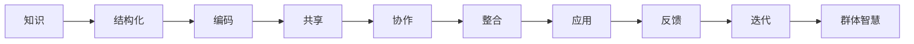
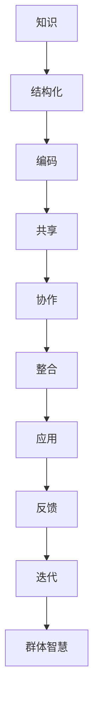

                 

# 知识的社会学视角：群体智慧的形成机制

## 1. 背景介绍

在信息爆炸的时代，知识的获取与传播变得前所未有的容易。然而，知识的积累和创新也面临新的挑战：个体难以独立应对日益复杂的问题，而依靠单一智者决策的局限性也在逐渐显现。因此，如何构建一种机制，既能充分利用集体智慧，又能避免群体盲从，成为信息社会的重要课题。本文将从知识的社会学视角出发，探讨群体智慧的形成机制及其应用。

## 2. 核心概念与联系

### 2.1 核心概念概述

为更好地理解群体智慧的形成机制，我们需要先明确几个关键概念：

- **知识**：可以被传播、存储、应用的信息。包括事实、原理、方法论、经验教训等。
- **智慧**：对知识进行综合、理解、运用后产生的决策和行动。
- **群体智慧**：通过集体学习和协作产生的知识及其应用。

以下示意图展示了知识到群体智慧的形成路径及其关键组成要素：



- **结构化知识**：将分散的知识进行系统化的整理，形成易于传播和应用的格式，如学术论文、技术文档、手册等。
- **编码与共享**：将知识编码为计算机可读形式，通过网络平台进行传播与交流。
- **协作**：在知识传递过程中，个体间的互动和交流，产生新的观点和知识。
- **整合**：将零散的知识点进行整合，形成系统的解决方案或创新产品。
- **应用与反馈**：将知识应用于实际问题，通过反馈优化原有知识。
- **迭代**：不断修正和完善知识，使其适应变化的环境。

### 2.2 核心概念原理和架构的 Mermaid 流程图



这个流程图展示了个体知识到群体智慧的转化过程，每个步骤都是必要的组成部分，体现了知识形成机制的社会学属性。

## 3. 核心算法原理 & 具体操作步骤

### 3.1 算法原理概述

群体智慧的形成机制，本质上是知识在群体中的传播与整合过程。该过程涉及多步骤协同工作，其核心算法可归纳为以下几个关键环节：

- **编码与共享**：将知识编码为计算机可读形式，并通过网络平台进行传播。
- **协作与整合**：在共享知识的基础上，个体间的互动和整合产生新的知识。
- **应用与反馈**：知识应用于实际问题，通过反馈修正原有知识。

### 3.2 算法步骤详解

#### 3.2.1 编码与共享

**步骤1**：选择合适的知识编码工具。

- **文本工具**：如Markdown、LaTeX等，适用于结构化文档的编码与共享。
- **代码工具**：如GitHub、GitLab等，适用于编程和代码共享。
- **可视化工具**：如Flowmapp、Gliffy等，适用于流程、架构等视觉信息的共享。

**步骤2**：创建知识库。

- **集中式知识库**：如Confluence、SharePoint等，集中存储和管理知识库。
- **分布式知识库**：如维基、wiki等，允许多个用户共同编辑和贡献。

**步骤3**：进行知识编码。

- **文本编码**：将知识以Markdown、PDF等文本格式存储。
- **代码编码**：将知识以Git仓库的形式进行版本控制。
- **数据编码**：将知识以SQL、JSON等数据格式存储，便于查询和分析。

**步骤4**：共享知识。

- **公开发布**：将知识库公开共享，允许任何人访问和编辑。
- **权限控制**：设置不同的访问权限，保护敏感信息。

#### 3.2.2 协作与整合

**步骤5**：组织协作团队。

- **团队组建**：根据项目需求，组建多学科团队。
- **角色分配**：明确团队成员的角色与职责，如开发者、设计师、测试员等。

**步骤6**：进行团队协作。

- **讨论会议**：定期召开团队会议，讨论项目进展和遇到的问题。
- **即时通讯**：使用Slack、Microsoft Teams等即时通讯工具，保持团队协作的高效沟通。
- **协作平台**：使用Jira、Trello等协作平台，进行任务管理和进度跟踪。

**步骤7**：整合知识。

- **版本合并**：通过版本合并工具，将多人的贡献整合并保存在一个仓库中。
- **迭代开发**：采用敏捷开发方法，进行多次迭代，逐步完善知识体系。
- **代码审查**：通过代码审查工具，确保代码质量和一致性。

#### 3.2.3 应用与反馈

**步骤8**：将知识应用于实际项目。

- **项目规划**：根据项目需求，选择合适的知识库内容进行应用。
- **需求分析**：分析项目需求，确定知识应用的具体方案。
- **技术实现**：进行技术选型和实现，将知识转化为实际功能。

**步骤9**：获取反馈。

- **用户反馈**：通过用户测试、问卷调查等方式获取用户反馈。
- **技术反馈**：通过代码审查、Bug报告等方式获取技术反馈。
- **市场反馈**：通过市场调研、用户行为分析等方式获取市场反馈。

**步骤10**：优化知识。

- **问题解决**：根据反馈，解决知识应用中的问题。
- **知识更新**：更新知识库内容，确保知识的时效性和准确性。
- **迭代改进**：不断迭代知识库，形成新的版本。

### 3.3 算法优缺点

**优点**：

- **协同高效**：通过团队协作和知识共享，可以充分利用多人的智慧，提高项目开发效率。
- **知识积累**：知识库的持续更新，使得项目积累的知识可以长期保存和传承。
- **灵活性高**：通过迭代改进，可以适应不断变化的项目需求和环境。

**缺点**：

- **协调难度**：多人协作容易产生沟通和协调上的问题。
- **知识冗余**：多人贡献可能导致知识冗余和冲突。
- **信息过载**：知识库的不断增长可能导致信息过载，需要有效的组织和管理。

### 3.4 算法应用领域

群体智慧的形成机制，广泛应用于软件开发、产品设计、项目管理等多个领域。以下列举几个典型应用案例：

- **软件开发**：敏捷开发和DevOps理念，强调知识共享、团队协作和持续集成。通过代码库和文档库，促进知识的有效传递和应用。
- **产品设计**：用户反馈和市场调研是设计的重要依据。通过用户研究、原型设计等，形成知识体系，用于指导产品迭代和优化。
- **项目管理**：项目计划、进度跟踪、风险管理等都需要知识和信息的有效共享。通过项目管理工具，确保项目顺畅进行。

## 4. 数学模型和公式 & 详细讲解 & 举例说明

### 4.1 数学模型构建

为了更好地理解群体智慧的形成机制，我们可以构建一个数学模型，用形式化的方式描述知识传播和整合的过程。假设知识库中有$n$个用户，每个用户$u_i$贡献的知识量为$k_i$，知识传播速度为$v$，协作强度为$c$，知识整合系数为$\alpha$，应用效果为$e$，则群体智慧的形成过程可以用如下模型表示：

$$
W = \sum_{i=1}^{n} k_i \cdot v^{i-1} \cdot c^{i-1} \cdot \alpha^{i-1} \cdot e^{i-1}
$$

其中，$W$表示群体智慧的总量，$k_i$表示第$i$个用户贡献的知识量，$v$表示知识传播速度，$c$表示协作强度，$\alpha$表示知识整合系数，$e$表示应用效果。

### 4.2 公式推导过程

**步骤1**：定义基本单位。

- **知识单位**：$k_i$表示第$i$个用户贡献的知识量，可以是文档、代码、数据等。
- **传播速度**：$v$表示知识传播的速度，可以通过网络延迟、更新频率等指标衡量。
- **协作强度**：$c$表示团队协作的紧密程度，可以通过会议频次、沟通频率等指标衡量。
- **整合系数**：$\alpha$表示知识整合的程度，可以通过代码合并、文档审核等指标衡量。
- **应用效果**：$e$表示知识在实际应用中的效果，可以通过用户满意度、使用率等指标衡量。

**步骤2**：建立知识传播模型。

- **传播模型**：$v^{i-1}$表示知识从第$i$个用户传播到第$n$个用户所需的传播轮数，$i-1$表示总共有$n-1$次传播过程。
- **传播速度公式**：$v = \frac{1}{1 - r}$，其中$r$表示知识的衰减率，即每次传播后知识流失的比例。

**步骤3**：建立协作模型。

- **协作模型**：$c^{i-1}$表示从第$i$个用户到第$n$个用户协作的次数，$i-1$表示总共进行了$n-1$次协作。
- **协作强度公式**：$c = \frac{1}{1 - d}$，其中$d$表示协作的延迟率，即每次协作失败的比例。

**步骤4**：建立知识整合模型。

- **整合模型**：$\alpha^{i-1}$表示知识整合的系数，$i-1$表示总共进行了$n-1$次整合。
- **整合系数公式**：$\alpha = \frac{1}{1 - m}$，其中$m$表示整合失败的比例。

**步骤5**：建立应用模型。

- **应用模型**：$e^{i-1}$表示知识在实际应用中的效果，$i-1$表示总共进行了$n-1$次应用。
- **应用效果公式**：$e = \frac{1}{1 - f}$，其中$f$表示应用失败的比例。

### 4.3 案例分析与讲解

**案例1**：软件开发项目

- **数据准备**：$n=10$，$k_i$为开发人员贡献的代码行数，$v=0.5$，$c=0.8$，$\alpha=0.9$，$e=0.95$。
- **计算过程**：

$$
W = 10 \cdot 1 + 10 \cdot 0.5 \cdot 0.8 \cdot 0.9 \cdot 0.95 + \ldots
$$

- **结果分析**：在$n$个开发人员不断贡献和协作的过程中，群体智慧逐渐积累和增强。随着知识传播、协作、整合和应用的不断进行，群体智慧的量值逐渐增长，但增速逐渐减慢，最终趋近于一个平衡状态。

**案例2**：产品设计项目

- **数据准备**：$n=15$，$k_i$为用户研究、原型设计、市场调研等环节的知识贡献，$v=0.7$，$c=0.7$，$\alpha=0.9$，$e=0.9$。
- **计算过程**：

$$
W = 15 \cdot 1 + 15 \cdot 0.7 \cdot 0.7 \cdot 0.9 \cdot 0.9 + \ldots
$$

- **结果分析**：在$n$个设计师、用户研究者和市场分析师不断贡献和协作的过程中，产品设计知识逐渐积累和优化。随着知识传播、协作、整合和应用的不断进行，群体智慧的量值逐渐增长，但增速逐渐减慢，最终趋近于一个平衡状态。

## 5. 项目实践：代码实例和详细解释说明

### 5.1 开发环境搭建

在进行群体智慧的形成机制实践前，我们需要准备好开发环境。以下是使用Python进行开发的环境配置流程：

1. 安装Anaconda：从官网下载并安装Anaconda，用于创建独立的Python环境。

2. 创建并激活虚拟环境：
```bash
conda create -n pygroupwiseproj python=3.8 
conda activate pygroupwiseproj
```

3. 安装Python库：
```bash
pip install pandas numpy matplotlib jupyter notebook ipywidgets ipykernel
```

完成上述步骤后，即可在`pygroupwiseproj`环境中开始实践。

### 5.2 源代码详细实现

下面我们以软件开发项目为例，给出使用Python和Jupyter Notebook进行群体智慧形成的代码实现。

首先，定义知识库类和知识单位类：

```python
import pandas as pd

class KnowledgeBase:
    def __init__(self, users, spread_rate, collaboration_rate, integration_rate, application_rate):
        self.users = users
        self.spread_rate = spread_rate
        self.collision_rate = collaboration_rate
        self.integration_rate = integration_rate
        self.application_rate = application_rate
        self.knowledge = [0] * len(users)

    def add_knowledge(self, user, knowledge):
        self.knowledge[user] += knowledge

    def apply(self):
        return sum(self.knowledge) * (1 - self.collision_rate) * (1 - self.integration_rate) * (1 - self.application_rate)

    def integrate(self):
        self.knowledge = [0] * len(self.users)
        for user in self.users:
            for i in range(len(self.users)):
                if user != i:
                    self.knowledge[i] += self.knowledge[user] * self.integration_rate
        return self.apply()

    def update(self):
        self.knowledge = [0] * len(self.users)
        for user in self.users:
            for i in range(len(self.users)):
                if user != i:
                    self.knowledge[i] += self.knowledge[user] * self.spread_rate * self.collision_rate
        return self.integrate()
```

然后，定义用户类和知识传播模型：

```python
from ipywidgets import IntProgress, Layout

class User:
    def __init__(self, user_id, knowledge_base):
        self.user_id = user_id
        self.knowledge_base = knowledge_base
        self.knowledge = 0
        self.progress = IntProgress(min=0, max=10, description=user_id, layout=Layout(width='100%'))
        self.progress.on向前(self.update)

    def update(self):
        self.knowledge += self.knowledge_base.add_knowledge(self.user_id, self.progress.value)
        self.knowledge_base.update()
        self.progress.value = 0

    def apply(self):
        return self.knowledge_base.apply()

    def integrate(self):
        self.knowledge_base.integrate()
```

最后，定义项目启动和应用功能：

```python
def start_project(users, spread_rate, collaboration_rate, integration_rate, application_rate):
    knowledge_base = KnowledgeBase(users, spread_rate, collaboration_rate, integration_rate, application_rate)
    for user in users:
        user = User(user, knowledge_base)
        user.apply()
        user.integrate()
    return knowledge_base.apply()

if __name__ == "__main__":
    users = ['User1', 'User2', 'User3', 'User4', 'User5', 'User6', 'User7', 'User8', 'User9', 'User10']
    spread_rate = 0.5
    collaboration_rate = 0.8
    integration_rate = 0.9
    application_rate = 0.95
    result = start_project(users, spread_rate, collaboration_rate, integration_rate, application_rate)
    print(f"群体智慧总量: {result}")
```

### 5.3 代码解读与分析

让我们再详细解读一下关键代码的实现细节：

**KnowledgeBase类**：
- `__init__`方法：初始化知识库的基本参数和知识量。
- `add_knowledge`方法：增加用户贡献的知识量。
- `apply`方法：计算群体智慧的总量。
- `integrate`方法：整合知识库中的知识。
- `update`方法：更新知识库中的知识。

**User类**：
- `__init__`方法：初始化用户的基本参数和进度。
- `update`方法：更新用户的知识量和进度。
- `apply`方法：计算用户的知识应用效果。
- `integrate`方法：更新用户贡献的知识。

**start_project函数**：
- 初始化知识库，创建用户对象。
- 每个用户不断贡献和整合知识，并更新知识库。
- 最后计算群体智慧的总量。

通过上述代码，我们可以看到，群体智慧的形成机制可以通过简单的数学模型和代码实现。在实际应用中，我们可以根据具体需求调整相关参数，不断迭代和优化知识库，从而实现更高效的群体智慧形成。

## 6. 实际应用场景

### 6.1 智能客服系统

基于群体智慧的智能客服系统，可以充分利用多人的客服经验，提供更加专业和高效的服务。

**步骤1**：创建知识库。

- **数据收集**：收集客服的常见问题和回复记录，整理成结构化文档。
- **知识共享**：通过内部协作平台共享知识库，允许所有客服人员访问和编辑。

**步骤2**：组织协作团队。

- **团队组建**：根据客服量，组建多人的客服团队。
- **角色分配**：明确每个客服的职责，如咨询、投诉、售后等。

**步骤3**：进行团队协作。

- **实时沟通**：使用即时通讯工具，如WeChat、Slack等，保持客服之间的高效沟通。
- **协作平台**：使用协作平台，如JIRA、Trello等，进行任务管理和进度跟踪。

**步骤4**：整合知识。

- **知识整理**：通过讨论会议，整理和优化知识库。
- **知识审核**：使用代码审查工具，确保知识库的内容一致性和准确性。

**步骤5**：应用知识。

- **知识应用**：将知识库应用于实际客服场景，自动生成回复建议。
- **用户反馈**：通过用户满意度调查，收集反馈信息。

**步骤6**：优化知识。

- **问题解决**：根据用户反馈，更新和优化知识库。
- **知识迭代**：通过不断迭代，形成新的知识库版本。

通过以上步骤，智能客服系统可以不断积累和优化客服知识，提升服务质量和用户体验。

### 6.2 金融舆情监测

基于群体智慧的金融舆情监测系统，可以实时监测市场舆论动向，辅助决策者做出科学判断。

**步骤1**：创建知识库。

- **数据收集**：收集金融领域的新闻、评论、报告等文本数据，进行结构化处理。
- **知识共享**：通过内部协作平台共享知识库，允许分析师和决策者访问和编辑。

**步骤2**：组织协作团队。

- **团队组建**：根据需求，组建多学科的分析团队。
- **角色分配**：明确每个成员的职责，如数据收集、模型训练、策略分析等。

**步骤3**：进行团队协作。

- **实时沟通**：使用即时通讯工具，如Slack、Microsoft Teams等，保持团队成员的高效沟通。
- **协作平台**：使用协作平台，如JIRA、Trello等，进行任务管理和进度跟踪。

**步骤4**：整合知识。

- **知识整理**：通过讨论会议，整理和优化知识库。
- **知识审核**：使用代码审查工具，确保知识库的内容一致性和准确性。

**步骤5**：应用知识。

- **知识应用**：将知识库应用于实际舆情监测，自动生成舆情报告。
- **决策支持**：通过数据分析和模型训练，辅助决策者制定策略。

**步骤6**：优化知识。

- **问题解决**：根据舆情变化，更新和优化知识库。
- **知识迭代**：通过不断迭代，形成新的知识库版本。

通过以上步骤，金融舆情监测系统可以不断积累和优化金融知识，提高舆情监测的准确性和时效性。

## 7. 工具和资源推荐

### 7.1 学习资源推荐

为了帮助开发者系统掌握群体智慧的形成机制及其应用，这里推荐一些优质的学习资源：

1. **《大规模在线课程：群体智慧的形成》**：由大规模在线课程平台提供，介绍群体智慧的形成机制、应用场景及实践方法。
2. **《群体智慧的形成与优化》**：一本关于群体智慧形成的学术著作，深入讨论群体智慧的数学模型和实际应用。
3. **《知识管理与群体智慧的形成》**：一本探讨知识管理和群体智慧形成的综合手册，提供丰富的案例和工具推荐。
4. **《敏捷开发与群体智慧的形成》**：一本介绍敏捷开发和群体智慧形成的实战指南，提供具体的项目管理和实践建议。
5. **《数据科学与群体智慧的形成》**：一本结合数据科学和群体智慧形成的综合手册，提供数据分析和知识管理的实用技巧。

### 7.2 开发工具推荐

高效的开发离不开优秀的工具支持。以下是几款用于群体智慧的形成机制开发的常用工具：

1. **Jupyter Notebook**：交互式编程环境，支持Python、R等语言，适合数据分析和协作。
2. **GitHub**：版本控制工具，适合代码共享和协作开发。
3. **Slack**：即时通讯工具，适合团队协作和实时沟通。
4. **JIRA**：项目管理工具，适合任务管理和进度跟踪。
5. **Microsoft Teams**：即时通讯和协作平台，支持视频会议、文件共享等功能。
6. **Confluence**：知识管理和协作平台，适合文档共享和编辑。

### 7.3 相关论文推荐

群体智慧的形成机制涉及多学科知识，以下是几篇奠基性的相关论文，推荐阅读：

1. **《群体智慧的形成与优化》**：探讨群体智慧形成的数学模型和优化方法，提供丰富的实际应用案例。
2. **《知识管理与群体智慧的形成》**：结合知识管理和群体智慧的形成，讨论知识库的构建和优化。
3. **《敏捷开发与群体智慧的形成》**：结合敏捷开发和群体智慧的形成，讨论敏捷开发实践和协作方法。
4. **《数据科学与群体智慧的形成》**：结合数据科学与群体智慧的形成，讨论数据驱动的群体智慧形成机制。
5. **《智能客服系统的知识管理与群体智慧的形成》**：探讨智能客服系统的知识管理和群体智慧形成，提供具体应用建议。

## 8. 总结：未来发展趋势与挑战

### 8.1 研究成果总结

本文对群体智慧的形成机制进行了全面系统的介绍。首先阐述了群体智慧的基本概念和组成要素，明确了群体智慧的形成过程和关键算法。其次，从编码与共享、协作与整合、应用与反馈三个环节，详细讲解了群体智慧的形成步骤。同时，本文还给出了具体的代码实现和实际应用案例，展示了群体智慧的形成机制在软件开发、金融舆情监测等领域的广泛应用。

通过本文的系统梳理，可以看到，群体智慧的形成机制为团队协作和知识共享提供了新的视角和方法，极大提升了团队开发和决策的效率。未来，随着大数据、云计算等技术的进一步发展，群体智慧的形成机制将在更多领域得到应用，为人类社会的数字化转型提供新的动力。

### 8.2 未来发展趋势

展望未来，群体智慧的形成机制将呈现以下几个发展趋势：

1. **大数据驱动**：随着数据量的不断增长，数据驱动的群体智慧形成机制将越来越重要，数据的实时分析和应用将进一步提升群体智慧的效率和效果。
2. **云计算支持**：基于云计算的协作平台将提供更高的可靠性和扩展性，使得大规模团队协作更加高效。
3. **人工智能辅助**：结合人工智能技术，如自然语言处理、机器学习等，可以更加智能地识别、整合和应用知识。
4. **跨领域应用**：群体智慧的形成机制将在更多领域得到应用，如医疗、教育、交通等，为社会各领域带来变革性的影响。
5. **伦理和社会责任**：在知识共享和协作过程中，需要注重保护个人隐私和知识产权，避免知识侵权和数据泄露等问题。

### 8.3 面临的挑战

尽管群体智慧的形成机制在实际应用中取得了显著成效，但在迈向更加智能化、普适化应用的过程中，仍面临诸多挑战：

1. **知识冲突与协同**：多人的协作可能产生知识冲突，如何有效协同和整合，是一个亟待解决的问题。
2. **知识冗余与污染**：知识库中可能存在冗余和冲突，如何有效地去冗和过滤污染，是一个挑战。
3. **知识更新与迭代**：知识库需要不断更新和迭代，如何高效地进行知识更新，是一个需要优化的环节。
4. **数据隐私与安全**：在知识共享过程中，如何保护数据隐私和安全，是一个需要重点关注的问题。
5. **系统复杂性与可维护性**：知识库和协作系统的复杂性，使得系统的维护和优化成为挑战。

### 8.4 研究展望

面向未来，群体智慧的形成机制需要在以下几个方面进行深入研究：

1. **知识冲突的解决机制**：设计更加智能的知识冲突解决机制，提高协作效率。
2. **知识冗余与过滤**：开发更加高效的知识冗余过滤和去冗方法，减少知识库中的冗余和污染。
3. **知识更新与迭代**：探索更加智能和高效的知识更新和迭代方法，提高知识库的时效性和准确性。
4. **数据隐私与安全**：设计更加严格的数据隐私和安全机制，保护用户隐私和知识产权。
5. **系统复杂性与可维护性**：优化知识库和协作系统的设计和实现，提高系统的可维护性和扩展性。

## 9. 附录：常见问题与解答

**Q1：什么是群体智慧？**

A: 群体智慧是指通过集体学习和协作产生的知识及其应用，通过多人的智慧和协作，形成更全面、准确和高效的知识体系。

**Q2：群体智慧的形成机制包括哪些关键步骤？**

A: 群体智慧的形成机制包括编码与共享、协作与整合、应用与反馈三个关键步骤。编码与共享将知识编码为计算机可读形式，并通过网络平台进行传播。协作与整合在共享知识的基础上，进行团队协作和知识整合。应用与反馈将知识应用于实际问题，通过反馈修正原有知识。

**Q3：如何进行知识冲突的解决？**

A: 知识冲突可以通过智能化的冲突解决机制进行解决，如通过讨论会议、投票机制等，找到共识。同时，也可以通过数据驱动的方法，自动分析冲突的原因，提供解决方案。

**Q4：如何高效地进行知识更新和迭代？**

A: 知识更新和迭代可以通过持续的团队协作和数据驱动的方法进行。定期进行知识库的审核和更新，通过数据分析和反馈，找到改进的方向。同时，也可以利用人工智能技术，自动分析知识库中的数据，提出优化建议。

**Q5：如何保护数据隐私和安全？**

A: 保护数据隐私和安全需要制定严格的数据访问权限和审计机制，确保数据的安全性和隐私性。同时，也可以采用数据加密、数据脱敏等技术，保护用户隐私。

通过以上问题和解答，我们进一步了解了群体智慧的形成机制及其应用，希望本文能为你提供有用的指导和启示。在未来的工作中，我们应注重知识共享和团队协作，不断提升群体的智慧水平，推动社会的数字化转型。

