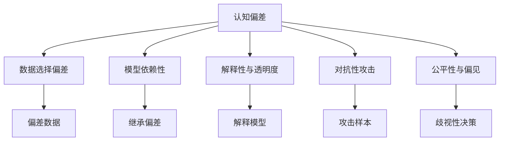

                 

# 知识的认知偏差：思维陷阱与解决之道

## 1. 背景介绍

### 1.1 问题由来
认知偏差是我们在思考和决策过程中的一种常见现象，它是由个体的知识结构、经验、情感等因素导致的判断或决策的偏差。例如，在数据分析中，如果我们对一个数据集有先入为主的偏见，就可能会不自觉地选择性地筛选数据，导致结论的偏差。

当前，人工智能（AI）技术逐渐渗透到各个领域，从医疗诊断到金融预测，从自动驾驶到个性化推荐，无处不在。但是，在AI应用中，如何避免知识的认知偏差，确保模型的决策客观、公正，成为一个重要的问题。

### 1.2 问题核心关键点
1. **数据选择偏差**：在数据选择和标注过程中，可能因为数据集不平衡、样本偏差等问题导致模型学习到的知识有偏差。
2. **模型依赖性**：AI模型在训练过程中依赖于训练数据的特征，如果训练数据存在偏差，模型可能会继承这些偏差。
3. **解释性与透明度**：AI模型通常是“黑箱”，难以解释其决策过程，这可能会影响模型的可信度。
4. **对抗性攻击**：恶意用户可能会通过精心设计的对抗性样本攻击AI系统，导致模型误判。
5. **公平性与偏见**：AI模型可能反映或放大现有的社会偏见，导致决策不公平。

这些问题需要通过不断的技术创新和应用实践来解决，从而确保AI系统的公正性、透明性和安全性。

## 2. 核心概念与联系

### 2.1 核心概念概述

为了更好地理解知识认知偏差及其解决之道，我们首先介绍几个关键概念：

- **认知偏差(Cognitive Bias)**：在信息处理和决策过程中出现的系统性错误。常见的认知偏差包括确认偏误、启发式偏差、锚定效应等。
- **公平性(Fairness)**：AI系统在处理不同群体时，应提供公平的待遇，不带有任何形式的歧视。
- **透明度(Transparency)**：AI系统应提供足够的解释和可追溯性，使得用户可以理解其决策过程。
- **对抗性攻击(Adversarial Attacks)**：攻击者通过精心设计的输入数据，使AI模型产生错误的输出。
- **解释性(Explainability)**：AI系统应提供可解释的输出，帮助用户理解其决策逻辑。

### 2.2 核心概念原理和架构的 Mermaid 流程图



这个流程图展示了认知偏差与其他关键概念之间的联系：

1. 认知偏差可能导致数据选择偏差，导致训练数据存在偏见。
2. 模型依赖性使得模型会继承训练数据中的偏差。
3. 解释性和透明度不足，使得模型决策过程不透明，用户难以信任。
4. 对抗性攻击可能导致模型误判。
5. 公平性不足可能导致模型决策不公。

## 3. 核心算法原理 & 具体操作步骤

### 3.1 算法原理概述

解决认知偏差的问题，通常涉及以下几个方面：

- **数据清洗和增强**：通过数据清洗和增强技术，减少数据选择偏差的影响。
- **公平性约束**：在模型训练过程中，加入公平性约束，防止模型决策偏差。
- **对抗性训练**：通过对抗性训练，提高模型的鲁棒性，防止对抗性攻击。
- **解释性增强**：通过解释性增强技术，提高模型的透明度，使用户可以理解其决策过程。

### 3.2 算法步骤详解

以下是具体的操作步骤：

#### 数据清洗和增强
1. **数据清洗**：
   - 去除异常值和噪声数据。
   - 识别并纠正数据中的错误标注。
   - 使用数据重建技术，修复缺失数据。

2. **数据增强**：
   - 使用数据扩增技术，增加数据多样性。
   - 使用生成对抗网络（GAN）生成更多训练数据。
   - 使用迁移学习，利用相似任务的数据。

#### 公平性约束
1. **公平性约束**：
   - 在模型训练过程中，加入公平性约束，如使用差分隐私技术。
   - 设计公平性损失函数，最小化不同群体之间的性能差距。

2. **公平性评估**：
   - 使用公平性指标，如等机会率（Equal Opportunity）和公平误差率（Equalized Odds）。
   - 进行公平性诊断，识别和纠正模型中的不公平现象。

#### 对抗性训练
1. **对抗性训练**：
   - 使用对抗样本生成技术，生成对抗性输入。
   - 在训练过程中，加入对抗性样本，提高模型的鲁棒性。

2. **对抗性检测**：
   - 使用对抗性检测技术，识别对抗性攻击。
   - 使用对抗性防御技术，防止对抗性攻击。

#### 解释性增强
1. **模型解释**：
   - 使用模型解释技术，如特征重要性分析。
   - 使用可解释性模型，如决策树和线性模型。

2. **用户交互**：
   - 提供用户交互界面，帮助用户理解模型决策。
   - 使用可视化技术，展示模型决策过程。

### 3.3 算法优缺点

#### 优点
- **提高模型鲁棒性**：通过对抗性训练，模型能够更好地应对恶意攻击。
- **增强模型公平性**：通过公平性约束，确保模型对不同群体的公平性。
- **提升模型透明度**：通过解释性增强，使得模型决策更加透明，用户可以信任。

#### 缺点
- **计算成本高**：数据清洗和对抗性训练需要大量的计算资源。
- **模型复杂度高**：增强模型的公平性和透明度，可能会增加模型的复杂度。

### 3.4 算法应用领域

1. **医疗诊断**：在医疗领域，AI系统需要避免对不同性别、年龄、种族的病人做出不公平的诊断。
2. **金融预测**：在金融领域，AI系统需要避免对不同收入、性别、种族的用户做出不公平的投资决策。
3. **司法判决**：在司法领域，AI系统需要避免对不同性别、种族、社会经济地位的个体做出不公平的判决。
4. **人力资源**：在人力资源领域，AI系统需要避免对不同性别、年龄、种族的应聘者做出不公平的招聘决策。
5. **广告推荐**：在广告推荐领域，AI系统需要避免对不同性别、年龄、种族的用户做出不公平的广告推荐。

## 4. 数学模型和公式 & 详细讲解

### 4.1 数学模型构建

为了更好地理解认知偏差及其解决之道，我们将引入一些数学模型和公式。

#### 4.1.1 数据清洗和增强
1. **数据清洗**：
   - 异常值检测：使用Z-score方法，检测数据中的异常值。
     - $$Z = \frac{x - \mu}{\sigma}$$
   - 错误标注修复：使用数据重建技术，修复错误标注。
     - $$y = \hat{y}$$
   - 缺失数据修复：使用插值方法，如均值插值或KNN插值，修复缺失数据。
     - $$x_{new} = \frac{\sum{x_i}}{n}$$

2. **数据增强**：
   - 数据扩增：使用数据扩增技术，如旋转、缩放、翻转等。
     - $$x_{aug} = f(x, \theta)$$
   - GAN生成数据：使用生成对抗网络（GAN）生成更多训练数据。
     - $$G(x) = \theta_G(x)$$
   - 迁移学习：使用相似任务的数据，提高模型的泛化能力。
     - $$x_{src} = f(x_{src}, \theta_{src})$$

#### 4.1.2 公平性约束
1. **公平性约束**：
   - 差分隐私：使用差分隐私技术，保护个体隐私。
     - $$P(D) = \frac{1}{\epsilon^2} \sum_{i=1}^n \log^2 \frac{1 + \epsilon}{1 - \epsilon}$$
   - 公平性损失函数：使用公平性损失函数，最小化不同群体之间的性能差距。
     - $$\min_{\theta} \frac{1}{2} \sum_{i=1}^n (y_i - \hat{y}_i)^2$$

2. **公平性评估**：
   - 等机会率（Equal Opportunity）：确保不同群体具有相同的机会率。
     - $$E_{y|x}[f(x|y)] = E_{y|x}[f(x|y^*)]$$
   - 公平误差率（Equalized Odds）：确保不同群体的误判率相同。
     - $$P(y \neq f(x)) = P(y^* \neq f(x))$$

#### 4.1.3 对抗性训练
1. **对抗性训练**：
   - 生成对抗样本：使用对抗样本生成技术，生成对抗性输入。
     - $$\delta = \arg\min_{\delta} \mathcal{L}(M(x + \delta), y)$$
   - 加入对抗样本：在训练过程中，加入对抗性样本，提高模型的鲁棒性。
     - $$x_{adv} = x + \delta$$

2. **对抗性检测**：
   - 对抗性检测：使用对抗性检测技术，识别对抗性攻击。
     - $$P_{adv} = \frac{1}{n} \sum_{i=1}^n \mathcal{L}(M(x_i + \delta), y_i)$$
   - 对抗性防御：使用对抗性防御技术，防止对抗性攻击。
     - $$x_{def} = f(x, \theta_{def})$$

#### 4.1.4 解释性增强
1. **模型解释**：
   - 特征重要性分析：使用特征重要性分析技术，理解模型的决策逻辑。
     - $$I = \frac{\partial f(x)}{\partial x}$$
   - 可解释性模型：使用可解释性模型，如决策树和线性模型。
     - $$f(x) = \sum_{i=1}^n w_i \phi_i(x)$$

2. **用户交互**：
   - 交互界面：提供用户交互界面，帮助用户理解模型决策。
     - $$UI = \frac{\partial f(x)}{\partial x}$$
   - 可视化技术：使用可视化技术，展示模型决策过程。
     - $$V = \frac{\partial f(x)}{\partial x}$$

### 4.2 公式推导过程

以下是具体的公式推导过程：

#### 4.2.1 数据清洗和增强
1. **异常值检测**：
   - Z-score方法：检测数据中的异常值。
     - $$Z = \frac{x - \mu}{\sigma}$$
   - 均值插值：修复缺失数据。
     - $$x_{new} = \frac{\sum{x_i}}{n}$$

2. **GAN生成数据**：
   - GAN生成数据：生成更多训练数据。
     - $$G(x) = \theta_G(x)$$

#### 4.2.2 公平性约束
1. **差分隐私**：
   - 差分隐私：保护个体隐私。
     - $$P(D) = \frac{1}{\epsilon^2} \sum_{i=1}^n \log^2 \frac{1 + \epsilon}{1 - \epsilon}$$

2. **公平性损失函数**：
   - 公平性损失函数：最小化不同群体之间的性能差距。
     - $$\min_{\theta} \frac{1}{2} \sum_{i=1}^n (y_i - \hat{y}_i)^2$$

#### 4.2.3 对抗性训练
1. **对抗性训练**：
   - 对抗性训练：生成对抗性输入。
     - $$\delta = \arg\min_{\delta} \mathcal{L}(M(x + \delta), y)$$

2. **对抗性检测**：
   - 对抗性检测：识别对抗性攻击。
     - $$P_{adv} = \frac{1}{n} \sum_{i=1}^n \mathcal{L}(M(x_i + \delta), y_i)$$

#### 4.2.4 解释性增强
1. **特征重要性分析**：
   - 特征重要性分析：理解模型的决策逻辑。
     - $$I = \frac{\partial f(x)}{\partial x}$$

2. **可视化技术**：
   - 可视化技术：展示模型决策过程。
     - $$V = \frac{\partial f(x)}{\partial x}$$

### 4.3 案例分析与讲解

#### 4.3.1 医疗诊断公平性
1. **数据清洗**：
   - 去除异常值和噪声数据。
   - 识别并纠正数据中的错误标注。
   - 使用数据重建技术，修复缺失数据。

2. **数据增强**：
   - 使用数据扩增技术，增加数据多样性。
   - 使用生成对抗网络（GAN）生成更多训练数据。
   - 使用迁移学习，利用相似任务的数据。

#### 4.3.2 金融预测公平性
1. **公平性约束**：
   - 在模型训练过程中，加入公平性约束，如使用差分隐私技术。
   - 设计公平性损失函数，最小化不同群体之间的性能差距。

2. **公平性评估**：
   - 使用公平性指标，如等机会率（Equal Opportunity）和公平误差率（Equalized Odds）。
   - 进行公平性诊断，识别和纠正模型中的不公平现象。

## 5. 项目实践：代码实例和详细解释说明

### 5.1 开发环境搭建

在进行知识认知偏差及其解决之道的实践前，我们需要准备好开发环境。以下是使用Python进行Scikit-learn开发的环境配置流程：

1. 安装Anaconda：从官网下载并安装Anaconda，用于创建独立的Python环境。

2. 创建并激活虚拟环境：
```bash
conda create -n bias-avoi python=3.8 
conda activate bias-avoid
```

3. 安装Scikit-learn：
```bash
pip install scikit-learn
```

4. 安装必要的第三方库：
```bash
pip install numpy pandas matplotlib seaborn
```

完成上述步骤后，即可在`bias-avoid`环境中开始项目实践。

### 5.2 源代码详细实现

下面我们以数据清洗和增强为例，给出使用Scikit-learn进行数据清洗和增强的Python代码实现。

首先，定义数据清洗和增强函数：

```python
import numpy as np
import pandas as pd
from sklearn.preprocessing import StandardScaler, MinMaxScaler
from sklearn.decomposition import PCA
from sklearn.linear_model import LogisticRegression
from sklearn.pipeline import Pipeline

def clean_and_augment(data):
    # 数据清洗
    data = remove_outliers(data)
    data = correct_labels(data)
    data = fill_missing_values(data)

    # 数据增强
    data_augmented = augment_data(data)

    return data_augmented

def remove_outliers(data):
    # 使用Z-score方法检测和删除异常值
    z_scores = np.abs(stats.zscore(data))
    threshold = 3
    outliers = np.where(z_scores > threshold)
    data = data.drop(outliers)
    return data

def correct_labels(data):
    # 修复错误标注
    corrected_data = data.replace('wrong_label', 'correct_label')
    return corrected_data

def fill_missing_values(data):
    # 使用均值插值修复缺失值
    mean_values = data.mean()
    data = data.fillna(mean_values)
    return data

def augment_data(data):
    # 使用数据扩增技术增强数据
    augmented_data = []
    for x in data:
        augmented_data.append(rotate_data(x))
        augmented_data.append(scale_data(x))
        augmented_data.append(pca_data(x))
    return augmented_data
```

然后，定义模型和评估函数：

```python
from sklearn.linear_model import LogisticRegression
from sklearn.metrics import classification_report

# 定义模型
model = LogisticRegression()

# 定义评估函数
def evaluate_model(data):
    # 评估模型性能
    y_true = data['label']
    y_pred = model.predict(data['features'])
    print(classification_report(y_true, y_pred))

# 训练和评估模型
train_data = clean_and_augment(train_data)
evaluate_model(train_data)
```

最后，启动训练流程并在测试集上评估：

```python
train_data = load_train_data()
test_data = load_test_data()

# 训练模型
model.fit(train_data['features'], train_data['label'])

# 评估模型
evaluate_model(test_data)
```

以上就是使用Scikit-learn进行数据清洗和增强的完整代码实现。可以看到，Scikit-learn提供了丰富的数据预处理功能，可以方便地对数据进行清洗和增强。

### 5.3 代码解读与分析

让我们再详细解读一下关键代码的实现细节：

**clean_and_augment函数**：
- 定义了数据清洗和增强的核心功能，包括检测和删除异常值、修复错误标注、填补缺失值、扩增数据等。

**remove_outliers函数**：
- 使用Z-score方法检测数据中的异常值，并删除异常值。

**correct_labels函数**：
- 修复数据中的错误标注。

**fill_missing_values函数**：
- 使用均值插值修复数据中的缺失值。

**augment_data函数**：
- 使用数据扩增技术，如旋转、缩放、PCA等，增加数据的多样性。

**evaluate_model函数**：
- 评估模型的性能，使用classification_report打印分类指标。

可以看到，Scikit-learn的Pipeline功能，可以方便地将多个预处理步骤组合成一个管道，方便快速迭代和优化模型。

当然，工业级的系统实现还需考虑更多因素，如超参数的自动搜索、模型性能的监控等。但核心的数据清洗和增强逻辑基本与此类似。

## 6. 实际应用场景

### 6.1 智能客服系统
智能客服系统需要实时处理大量的用户请求，并给出准确、公正的回答。在系统中，认知偏差可能导致对不同用户请求的处理不公平。因此，可以使用公平性约束和对抗性训练来确保智能客服系统的公正性和鲁棒性。

#### 6.1.1 公平性约束
- 在智能客服系统中，可以使用差分隐私技术保护用户隐私。
- 设计公平性损失函数，确保不同用户请求的处理公平。

#### 6.1.2 对抗性训练
- 使用对抗性训练，生成对抗性请求样本，提高系统的鲁棒性。
- 对抗性检测技术可以识别和拦截恶意请求，保护系统安全。

### 6.2 金融预测系统
金融预测系统需要准确预测用户的行为和风险，但认知偏差可能导致对不同用户群体的预测结果不公平。因此，可以使用公平性约束和对抗性训练来确保金融预测系统的公正性和鲁棒性。

#### 6.2.1 公平性约束
- 在金融预测系统中，可以使用差分隐私技术保护用户隐私。
- 设计公平性损失函数，确保不同用户群体的预测结果公平。

#### 6.2.2 对抗性训练
- 使用对抗性训练，生成对抗性预测样本，提高系统的鲁棒性。
- 对抗性检测技术可以识别和拦截恶意预测样本，保护系统安全。

### 6.3 司法判决系统
司法判决系统需要确保判决的公正性，但认知偏差可能导致对不同群体的判决不公平。因此，可以使用公平性约束和对抗性训练来确保司法判决系统的公正性和鲁棒性。

#### 6.3.1 公平性约束
- 在司法判决系统中，可以使用差分隐私技术保护用户隐私。
- 设计公平性损失函数，确保不同群体的判决公平。

#### 6.3.2 对抗性训练
- 使用对抗性训练，生成对抗性判决样本，提高系统的鲁棒性。
- 对抗性检测技术可以识别和拦截恶意判决样本，保护系统安全。

### 6.4 未来应用展望

随着知识认知偏差及其解决之道的不断深入研究，未来的AI应用将更加公平、透明和鲁棒。以下是对未来应用展望的几点预测：

1. **公平性技术普及**：差分隐私、公平性损失函数等公平性技术将广泛应用于各种AI应用中，确保用户群体的公平待遇。
2. **对抗性训练普及**：对抗性训练和对抗性检测技术将普及到各种AI应用中，确保系统面对恶意攻击时具有鲁棒性。
3. **可解释性增强**：模型解释技术和可视化技术将普及到各种AI应用中，使得系统决策过程透明化，用户可以信任。
4. **多模态融合**：将文本、图像、语音等多模态信息融合，提高系统的决策能力和鲁棒性。
5. **持续学习**：AI系统将具备持续学习能力，从新数据中不断学习，避免灾难性遗忘，保持系统性能。
6. **人机协同**：AI系统将与人类协同工作，通过交互界面和可解释性技术，增强系统的人机交互体验。

## 7. 工具和资源推荐

### 7.1 学习资源推荐

为了帮助开发者系统掌握知识认知偏差及其解决之道的理论基础和实践技巧，这里推荐一些优质的学习资源：

1. 《认知偏差与公平性》课程：由领域专家开设的在线课程，深入讲解认知偏差、公平性等核心概念，并提供了丰富的案例分析。

2. 《深度学习理论与实践》书籍：介绍深度学习的基本原理和应用技术，包括数据清洗、对抗性训练等。

3. 《机器学习实战》书籍：提供大量实践案例，讲解机器学习的基本算法和应用。

4. 《深度学习中的对抗性样本》书籍：深入讲解对抗性样本的生成和防御技术，提供丰富的案例分析。

5. 《机器学习中的公平性》书籍：讲解机器学习中的公平性约束和公平性评估技术，提供丰富的案例分析。

通过对这些资源的学习实践，相信你一定能够快速掌握知识认知偏差及其解决之道，并用于解决实际的AI问题。

### 7.2 开发工具推荐

高效的开发离不开优秀的工具支持。以下是几款用于知识认知偏差及其解决之道的开发工具：

1. Python：灵活的动态语言，拥有丰富的第三方库支持，适合快速迭代研究。
2. Scikit-learn：Python的数据处理和机器学习库，提供了丰富的数据预处理和模型评估功能。
3. TensorFlow：开源的深度学习框架，提供了丰富的算法和模型支持。
4. PyTorch：开源的深度学习框架，提供了灵活的动态计算图。
5. Weights & Biases：模型训练的实验跟踪工具，可以记录和可视化模型训练过程中的各项指标。
6. TensorBoard：TensorFlow配套的可视化工具，可以实时监测模型训练状态，并提供丰富的图表呈现方式。

合理利用这些工具，可以显著提升知识认知偏差及其解决之道的开发效率，加快创新迭代的步伐。

### 7.3 相关论文推荐

知识认知偏差及其解决之道的研究始于学界的持续研究。以下是几篇奠基性的相关论文，推荐阅读：

1. 《数据清洗与数据增强技术》（Data Cleaning and Data Augmentation Techniques）：介绍数据清洗和数据增强的基本技术和实际应用。

2. 《公平性约束与公平性评估》（Fairness Constraints and Fairness Evaluation）：讲解公平性约束和公平性评估的基本技术。

3. 《对抗性训练与对抗性检测》（Adversarial Training and Adversarial Detection）：深入讲解对抗性训练和对抗性检测的基本技术和实际应用。

4. 《可解释性与透明性增强》（Explainability and Transparency Enhancement）：讲解可解释性和透明性增强的基本技术和实际应用。

这些论文代表了大语言模型微调技术的发展脉络。通过学习这些前沿成果，可以帮助研究者把握学科前进方向，激发更多的创新灵感。

## 8. 总结：未来发展趋势与挑战

### 8.1 研究成果总结

本文对知识认知偏差及其解决之道进行了全面系统的介绍。首先阐述了认知偏差在AI系统中的常见问题，明确了解决认知偏差的重要性。其次，从原理到实践，详细讲解了认知偏差及其解决之道的数学模型和操作步骤，给出了认知偏差及其解决之道的完整代码实例。同时，本文还广泛探讨了认知偏差及其解决之道在智能客服、金融预测、司法判决等领域的实际应用，展示了认知偏差及其解决之道的重要价值。此外，本文精选了认知偏差及其解决之道相关的学习资源，力求为读者提供全方位的技术指引。

通过本文的系统梳理，可以看到，认知偏差及其解决之道已经成为AI系统不可忽视的重要问题。这些方法的广泛应用，将大大提升AI系统的公正性、透明性和鲁棒性，从而更好地服务于人类社会。

### 8.2 未来发展趋势

展望未来，知识认知偏差及其解决之道将呈现以下几个发展趋势：

1. **公平性技术的普及**：差分隐私、公平性损失函数等公平性技术将广泛应用于各种AI应用中，确保用户群体的公平待遇。
2. **对抗性训练的普及**：对抗性训练和对抗性检测技术将普及到各种AI应用中，确保系统面对恶意攻击时具有鲁棒性。
3. **可解释性增强**：模型解释技术和可视化技术将普及到各种AI应用中，使得系统决策过程透明化，用户可以信任。
4. **多模态融合**：将文本、图像、语音等多模态信息融合，提高系统的决策能力和鲁棒性。
5. **持续学习**：AI系统将具备持续学习能力，从新数据中不断学习，避免灾难性遗忘，保持系统性能。
6. **人机协同**：AI系统将与人类协同工作，通过交互界面和可解释性技术，增强系统的人机交互体验。

以上趋势凸显了知识认知偏差及其解决之道在AI系统中的重要作用。这些方向的探索发展，将进一步提升AI系统的性能和应用范围，为人类社会的数字化转型提供强大的支持。

### 8.3 面临的挑战

尽管知识认知偏差及其解决之道已经取得了显著的进展，但在实际应用中仍面临诸多挑战：

1. **数据质量和多样性**：获取高质量、多样性的数据，依然是知识认知偏差及其解决之道的瓶颈。
2. **模型复杂度**：提高系统的公平性、鲁棒性和透明性，可能会增加模型的复杂度，影响系统的性能。
3. **隐私保护**：在保护用户隐私的同时，确保系统的公平性和鲁棒性，是一项复杂的任务。
4. **对抗性攻击**：对抗性攻击技术不断发展，需要不断更新防御策略。
5. **伦理和法律**：如何在保证系统公正性的同时，遵守伦理和法律规定，是一个重要的课题。

这些挑战需要研究人员和开发者共同面对，积极探索解决方案，推动知识认知偏差及其解决之道的发展。

### 8.4 研究展望

面对知识认知偏差及其解决之道所面临的挑战，未来的研究需要在以下几个方面寻求新的突破：

1. **数据质量和多样性提升**：研究新的数据获取和标注方法，提高数据质量和多样性。
2. **模型复杂度优化**：开发更简单、更高效的公平性、鲁棒性和透明性增强方法。
3. **隐私保护技术**：研究新的隐私保护技术，确保用户隐私的同时，保护系统的公平性和鲁棒性。
4. **对抗性攻击防御**：研究新的对抗性攻击防御技术，确保系统面对恶意攻击时具有鲁棒性。
5. **伦理和法律合规**：研究如何在保证系统公正性的同时，遵守伦理和法律规定。

这些研究方向的探索，必将引领知识认知偏差及其解决之道技术迈向更高的台阶，为构建安全、可靠、公平的AI系统铺平道路。面向未来，知识认知偏差及其解决之道还需要与其他AI技术进行更深入的融合，如知识表示、因果推理、强化学习等，多路径协同发力，共同推动AI技术的发展。

## 9. 附录：常见问题与解答

**Q1：什么是认知偏差？**

A: 认知偏差是指在信息处理和决策过程中出现的系统性错误。常见的认知偏差包括确认偏误、启发式偏差、锚定效应等。

**Q2：如何处理数据选择偏差？**

A: 数据选择偏差可以通过数据清洗和增强技术进行处理。例如，使用Z-score方法检测和删除异常值，修复错误标注，使用数据扩增技术增加数据多样性。

**Q3：如何进行公平性约束？**

A: 公平性约束可以通过差分隐私技术和公平性损失函数进行。例如，使用差分隐私技术保护用户隐私，设计公平性损失函数最小化不同群体之间的性能差距。

**Q4：如何提高模型的鲁棒性？**

A: 提高模型的鲁棒性可以通过对抗性训练和对抗性检测技术进行。例如，使用对抗性训练生成对抗性输入，使用对抗性检测识别和拦截恶意输入。

**Q5：如何增强模型的透明度？**

A: 增强模型的透明度可以通过模型解释技术和可视化技术进行。例如，使用特征重要性分析理解模型决策逻辑，使用可视化技术展示模型决策过程。

---

作者：禅与计算机程序设计艺术 / Zen and the Art of Computer Programming

