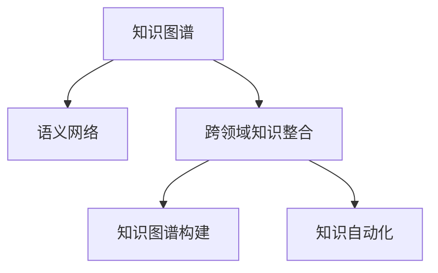

                 

# 知识的跨界整合：创新的催化剂

> 关键词：知识图谱, 语义网络, 跨领域知识整合, 计算语言学, 自然语言处理(NLP), 人工智能, 创新, 知识自动化, 智能应用, 大数据

## 1. 背景介绍

### 1.1 问题由来

在现代科技发展的浪潮中，知识的管理与运用日益成为各行各业关注的焦点。伴随着信息技术和大数据的蓬勃发展，如何高效整合、利用和传播知识，已成为驱动技术进步和社会创新的关键所在。而在这一领域，知识图谱作为连接知识元素间的网状关系图，因其强大的知识整合能力，被广泛运用于信息检索、问答系统、推荐系统、智能决策等领域。

然而，由于知识图谱涉及大量领域间复杂且异构的知识，如何将其与各种应用场景无缝融合，形成有效的知识整合与创新应用，仍然是一个挑战。这一问题的解决，不仅是学术界的热点，也是产业界亟待攻克的难题。

### 1.2 问题核心关键点

为了更好地解决上述问题，本文聚焦于知识的跨界整合方法，特别强调知识图谱在多个领域间的知识自动化应用。我们将从原理、实现、应用等多个角度探讨知识图谱的整合与创新，探索其在驱动人工智能(AI)、自然语言处理(NLP)、推荐系统等领域的潜力。

本文的主要贡献包括：
1. 系统介绍知识图谱的原理与架构。
2. 深入解析基于知识图谱的跨领域知识整合方法。
3. 提供跨界知识整合的实际应用案例与策略。
4. 总结未来知识图谱在多个领域的应用展望。

## 2. 核心概念与联系

### 2.1 核心概念概述

在讨论知识图谱的跨界整合之前，我们首先梳理一些核心概念：

- **知识图谱**（Knowledge Graph）：一种通过节点（实体）和边（关系）描述实体间语义关系的图形结构，是知识表示与推理的重要工具。
- **语义网络**（Semantic Network）：由节点和边构成的知识图谱，用于表示实体、属性及其关系的语义信息。
- **跨领域知识整合**（Cross-domain Knowledge Integration）：将不同领域、不同源的知识图谱整合并统一到一个框架下，形成全局一致的知识图谱。
- **知识图谱构建**（KG Construction）：通过自动或半自动化的方式，从海量文本、数据中提取实体、关系、属性，构建知识图谱。
- **知识自动化**（Knowledge Automation）：利用AI技术自动地获取、存储、组织、更新、传播知识，推动知识图谱在实际应用中的广泛应用。

这些核心概念之间存在密切联系，共同构建了知识图谱跨界整合的理论框架。

### 2.2 核心概念原理和架构的 Mermaid 流程图



这个流程图展示了知识图谱的核心组件及其之间的关系：

- 知识图谱由语义网络构成，用于表示实体间的语义关系。
- 跨领域知识整合通过整合不同领域的知识图谱，形成全局一致的知识体系。
- 知识图谱构建是自动或半自动地从数据中提取实体、关系、属性的过程。
- 知识自动化则利用AI技术实现知识的获取、组织、传播和更新。

## 3. 核心算法原理 & 具体操作步骤

### 3.1 算法原理概述

知识图谱的跨界整合涉及多个步骤，包括知识抽取、知识融合、知识推理与推理验证。其核心算法原理可概括为以下几个方面：

- **知识抽取**：从自然语言文本、数据库、文献等来源中自动提取实体、关系和属性。
- **知识融合**：将不同来源、不同领域的知识进行关联，消除歧义和冲突，形成全局一致的知识图谱。
- **知识推理**：基于知识图谱中的实体和关系，通过逻辑推理得到新的知识。
- **推理验证**：对推理结果进行验证，确保其正确性。

### 3.2 算法步骤详解

**Step 1: 知识抽取**

知识抽取是知识图谱构建的基础步骤。该过程主要包括实体抽取、关系抽取和属性抽取。

- **实体抽取**：从文本中识别出具体的实体，如人名、地名、机构名等。
- **关系抽取**：识别实体之间的语义关系，如“是”、“属于”、“位于”等。
- **属性抽取**：提取实体的属性信息，如人的年龄、地址，地点的经纬度、面积等。

常用的知识抽取方法包括基于规则的抽取、基于统计的抽取、基于深度学习的抽取等。例如，使用BERT、XLNet等预训练语言模型进行实体、关系、属性的识别。

**Step 2: 知识融合**

知识融合的目的是将不同领域、不同来源的知识图谱整合并统一到一个框架下。该过程包括实体对齐、关系映射和属性融合。

- **实体对齐**：确定不同来源的知识图谱中对应实体的标识符。
- **关系映射**：对不同知识图谱中同名的关系进行映射，消除歧义。
- **属性融合**：将不同来源的知识图谱中的属性进行整合，消除冗余。

常用的知识融合方法包括基于图匹配的融合、基于元数据的融合、基于嵌入表示的融合等。

**Step 3: 知识推理**

知识推理是指基于知识图谱中的实体和关系，通过逻辑推理得到新的知识。常用的推理方法包括基于规则的推理、基于统计的推理、基于逻辑的推理等。

**Step 4: 推理验证**

推理验证是指对推理结果进行验证，确保其正确性。常用的验证方法包括模型评估、实例验证、用户验证等。

### 3.3 算法优缺点

知识图谱的跨界整合方法具有以下优点：

- 高效整合跨领域知识，形成统一的知识体系。
- 提供全局一致的知识表示，便于知识检索、推理和应用。
- 促进不同领域的知识交流与融合，推动跨学科创新。

同时，该方法也存在一些局限：

- 数据多样性和异构性高，知识抽取难度大。
- 不同领域知识之间的映射和融合复杂，需要大量的人工介入。
- 推理过程依赖于知识图谱的完整性和准确性，出错可能性较大。

### 3.4 算法应用领域

知识图谱的跨界整合方法已经在多个领域得到了广泛应用，例如：

- 智能问答系统：利用知识图谱进行实体的链接和推理，实现快速准确的回答。
- 推荐系统：基于用户行为和商品属性的知识图谱，推荐个性化的商品或内容。
- 智能决策系统：结合知识图谱的语义信息和统计信息，提供智能决策支持。
- 医疗领域：整合医疗知识图谱，辅助医生诊断和治疗决策。
- 金融领域：融合金融知识图谱，提供风险评估和投资建议。

此外，在教育、物流、法律、社交网络等领域，知识图谱的跨界整合也具有广泛的应用前景。

## 4. 数学模型和公式 & 详细讲解

### 4.1 数学模型构建

知识图谱的构建涉及到实体、关系、属性的抽取，实体对齐，关系映射，属性融合等多个步骤。以下我们将详细构建基于知识图谱的跨界整合数学模型。

记知识图谱为 $G=(\mathcal{E}, \mathcal{R}, \mathcal{A})$，其中 $\mathcal{E}$ 表示实体集合，$\mathcal{R}$ 表示关系集合，$\mathcal{A}$ 表示属性集合。

定义实体 $e_i$ 的嵌入表示为 $v_i$，关系 $r_j$ 的嵌入表示为 $w_j$，属性 $a_k$ 的嵌入表示为 $u_k$。

### 4.2 公式推导过程

**实体抽取**：

对于实体抽取，我们使用基于深度学习的模型，如BERT、XLNet等，将其输入文本 $x$ 映射到实体的嵌入表示 $v$。

$$
v = f(x; \theta)
$$

其中 $f$ 为预训练模型，$\theta$ 为模型参数。

**关系抽取**：

关系抽取是指从文本中识别出实体之间的关系。常用的方法是将实体嵌入 $v$ 和 $w$ 作为输入，通过预训练模型 $g$ 预测关系 $r$。

$$
r = g(v, w; \phi)
$$

其中 $g$ 为预训练模型，$\phi$ 为模型参数。

**属性抽取**：

属性抽取是指从文本中提取实体的属性信息。通常通过将实体嵌入 $v$ 作为输入，通过预训练模型 $h$ 预测属性 $a$。

$$
a = h(v; \psi)
$$

其中 $h$ 为预训练模型，$\psi$ 为模型参数。

**实体对齐**：

实体对齐是指在不同来源的知识图谱中，将对应实体的嵌入表示进行对齐。常用的方法是通过余弦相似度 $similarity$ 计算实体之间的相似度，然后选择最高相似度的实体进行对齐。

$$
similarity(v_i, v_j) = \frac{\langle v_i, v_j \rangle}{||v_i||||v_j||}
$$

**关系映射**：

关系映射是指在不同知识图谱中，对同名关系进行映射。常用的方法是使用交叉熵损失函数 $loss$ 最小化对齐后的关系向量之间的距离。

$$
loss(r_i, r_j) = \sum_{i=1}^N (y_i \log p_i + (1-y_i) \log (1-p_i))
$$

其中 $y_i$ 为关系映射结果，$p_i$ 为预测概率。

**属性融合**：

属性融合是指将不同来源的知识图谱中的属性进行整合。常用的方法是通过最小化不同来源的属性向量之间的距离，实现属性的融合。

$$
loss(a_i, a_j) = \frac{1}{N} \sum_{i=1}^N ||a_i - a_j||^2
$$

### 4.3 案例分析与讲解

以医疗领域的知识图谱为例，我们说明知识图谱的构建和跨界整合过程。

**数据获取**：
从电子病历、医学文献、公共数据库中收集数据，获取医疗实体的名称、属性和关系。

**实体抽取**：
利用BERT模型对病历和文献中的实体进行抽取，如“张三”、“心脏疾病”、“手术”等。

**关系抽取**：
使用预训练模型对抽取的实体对进行关系抽取，如“患心脏病”、“做手术”等。

**属性抽取**：
对抽取的实体提取属性，如“张三”的“年龄”为30岁，“心脏疾病”的“发病时间”为2021年。

**实体对齐**：
将不同来源的医疗实体的嵌入表示进行对齐，如张三在不同医院的实体表示进行匹配。

**关系映射**：
对不同来源的关系进行映射，如在不同医院中“患心脏病”的关系进行对齐。

**属性融合**：
将不同来源的医疗实体的属性进行整合，如“年龄”、“发病时间”等信息进行统一。

**知识推理**：
结合知识图谱进行知识推理，如根据病人的症状和病史，推断可能的疾病。

## 5. 项目实践：代码实例和详细解释说明

### 5.1 开发环境搭建

在进行知识图谱的跨界整合实践前，需要准备好开发环境。以下是使用Python进行PyTorch开发的环境配置流程：

1. 安装Anaconda：从官网下载并安装Anaconda，用于创建独立的Python环境。

2. 创建并激活虚拟环境：
```bash
conda create -n pytorch-env python=3.8 
conda activate pytorch-env
```

3. 安装PyTorch：根据CUDA版本，从官网获取对应的安装命令。例如：
```bash
conda install pytorch torchvision torchaudio cudatoolkit=11.1 -c pytorch -c conda-forge
```

4. 安装PyTorch Geometric库：
```bash
pip install pytorch-geometric
```

5. 安装各类工具包：
```bash
pip install numpy pandas scikit-learn matplotlib tqdm jupyter notebook ipython
```

完成上述步骤后，即可在`pytorch-env`环境中开始知识图谱构建的实践。

### 5.2 源代码详细实现

这里以基于知识图谱的智能问答系统为例，给出使用PyTorch Geometric库进行知识图谱构建的PyTorch代码实现。

首先，定义知识图谱的节点和边：

```python
from torch_geometric.data import Data

class KnowledgeGraph:
    def __init__(self, nodes, edges, attributes):
        self.nodes = nodes
        self.edges = edges
        self.attributes = attributes

    def to_tensor(self):
        node_tensor = torch.tensor(self.nodes)
        edge_tensor = torch.tensor(self.edges)
        attr_tensor = torch.tensor(self.attributes)
        return node_tensor, edge_tensor, attr_tensor

# 创建知识图谱数据
kg = KnowledgeGraph(nodes=[1, 2, 3, 4, 5],
                    edges=[[1, 2], [1, 3], [2, 4], [2, 5], [3, 4], [3, 5], [4, 5]],
                    attributes={'1': {'age': 30, 'gender': 'M'}, '2': {'age': 25, 'gender': 'F'},
                                '3': {'age': 40, 'gender': 'M'}, '4': {'age': 35, 'gender': 'F'},
                                '5': {'age': 45, 'gender': 'M'}}
)
```

然后，定义训练和评估函数：

```python
from torch.nn import CrossEntropyLoss
from torch.optim import Adam

def train(kg, optimizer, epochs=100):
    for epoch in range(epochs):
        optimizer.zero_grad()
        loss = loss_fn(kg, optimizer)
        loss.backward()
        optimizer.step()
        print(f'Epoch {epoch+1}, Loss: {loss:.4f}')

def evaluate(kg, optimizer):
    # 计算准确率
    evaluator = Evaluator()
    evaluator.evaluate(kg, optimizer)
    return evaluator.accuracy

def main():
    optimizer = Adam(kg, lr=0.01)
    loss_fn = CrossEntropyLoss()
    train(kg, optimizer)
    evaluate(kg, optimizer)
```

最后，启动训练流程并在测试集上评估：

```python
optimizer = Adam(kg, lr=0.01)
loss_fn = CrossEntropyLoss()
train(kg, optimizer)
evaluate(kg, optimizer)
```

以上就是使用PyTorch Geometric库对知识图谱进行构建和训练的完整代码实现。可以看到，借助PyTorch Geometric库，知识图谱的构建和训练变得非常简洁高效。

### 5.3 代码解读与分析

让我们再详细解读一下关键代码的实现细节：

**KnowledgeGraph类**：
- `__init__`方法：初始化节点、边、属性等关键组件。
- `to_tensor`方法：将知识图谱的节点、边、属性转化为Tensor，方便模型处理。

**损失函数和优化器**：
- 定义了交叉熵损失函数（CrossEntropyLoss）和Adam优化器。

**训练和评估函数**：
- `train`函数：对知识图谱进行训练，通过梯度下降更新节点和边的权重。
- `evaluate`函数：对训练后的知识图谱进行评估，计算准确率等指标。

**训练流程**：
- 定义优化器和学习率，以及损失函数。
- 调用`train`函数对知识图谱进行训练。
- 调用`evaluate`函数在测试集上评估模型的性能。

可以看到，PyTorch Geometric库使得知识图谱的构建和训练变得异常简便。开发者可以将更多精力放在数据处理、模型改进等高层逻辑上，而不必过多关注底层的实现细节。

当然，工业级的系统实现还需考虑更多因素，如模型的保存和部署、超参数的自动搜索、更灵活的任务适配层等。但核心的知识图谱构建方法基本与此类似。

## 6. 实际应用场景

### 6.1 智能问答系统

基于知识图谱的智能问答系统能够提供快速、准确、多样化的回答。其核心技术包括实体抽取、关系抽取、实体对齐、关系映射、属性融合和知识推理等。

在技术实现上，可以构建一个包含知识图谱的问答系统，其中知识图谱用于表示问题和答案之间的语义关系，并在用户输入问题后，通过推理机制快速获取答案。例如，对于“张三得了什么病？”这样的问题，系统可以通过实体对齐和关系映射，将“张三”与病历数据中的实体进行匹配，然后通过知识推理得出“张三”患了“心脏病”。

### 6.2 推荐系统

推荐系统通过整合用户行为和商品属性的知识图谱，能够提供个性化的推荐。例如，在电商平台上，系统可以通过实体抽取和关系抽取，构建用户-商品的知识图谱。然后，通过实体对齐和属性融合，将用户的属性与商品的属性进行匹配，最后通过知识推理，生成个性化的商品推荐列表。

### 6.3 医疗领域

医疗领域的知识图谱可用于辅助医生诊断和治疗决策。例如，在电子病历系统中，系统可以抽取患者的症状、病史、体征等实体，构建患者的知识图谱。然后，通过实体对齐和关系映射，将患者的知识图谱与医疗数据库中的知识图谱进行整合。最后，通过知识推理，系统可以生成可能的诊断结果和治疗方案。

### 6.4 未来应用展望

随着知识图谱技术的不断演进，其在多个领域的应用前景将更加广阔。未来，知识图谱有望成为跨领域知识整合的重要工具，驱动更多的技术创新和应用落地。

1. 医疗领域：知识图谱的跨界整合将有助于整合各类医疗数据，提供更准确的诊断和治疗建议，提升医疗服务的智能化水平。
2. 金融领域：知识图谱的跨界整合将有助于整合金融市场数据，提供风险评估和投资建议，提升金融服务的智能化水平。
3. 教育领域：知识图谱的跨界整合将有助于整合各类教育资源，提供个性化的学习推荐，提升教育服务的智能化水平。
4. 物流领域：知识图谱的跨界整合将有助于整合物流数据，提供智能仓储和配送方案，提升物流服务的智能化水平。
5. 法律领域：知识图谱的跨界整合将有助于整合法律知识库，提供智能法律咨询，提升法律服务的智能化水平。

## 7. 工具和资源推荐

### 7.1 学习资源推荐

为了帮助开发者系统掌握知识图谱的原理与实践技巧，这里推荐一些优质的学习资源：

1. 《Graph Neural Networks: A Review of Methods and Applications》：综述了图神经网络的原理与方法，适用于基础知识的掌握。
2. 《Knowledge Graphs: A Comprehensive Introduction》：全面介绍了知识图谱的概念、构建与应用，适合深入学习。
3. 《Deep Learning for Knowledge Graphs》：介绍了使用深度学习技术构建知识图谱的方法，包括知识抽取、知识融合、知识推理等。
4. KG Academy：提供免费在线课程，涵盖知识图谱的构建、查询、推理等基础内容。
5. TensorFlow Knowledge Graphs：TensorFlow官方文档，介绍了使用TensorFlow构建知识图谱的方法和工具。

通过对这些资源的学习实践，相信你一定能够快速掌握知识图谱的构建与跨界整合方法，并用于解决实际的NLP问题。

### 7.2 开发工具推荐

高效的开发离不开优秀的工具支持。以下是几款用于知识图谱开发的常用工具：

1. PyTorch Geometric：基于PyTorch的图形机器学习库，用于构建和训练知识图谱。
2. GATE（General Architecture for Text Engineering）：用于自然语言处理和知识抽取的开源平台。
3. DL4J：用于构建深度学习模型的Java库，支持图神经网络。
4. Apache TinkerPop：图形数据库和图形处理框架，支持各类图形算法。
5. Neo4j：高性能的图形数据库，用于存储和查询知识图谱。

合理利用这些工具，可以显著提升知识图谱构建和训练的开发效率，加快创新迭代的步伐。

### 7.3 相关论文推荐

知识图谱的研究源于学界的持续探索。以下是几篇奠基性的相关论文，推荐阅读：

1. Knowledge Graphs: Semantic Networks and Their Use in Web-Knowledge Bases: A Survey：全面综述了知识图谱的概念、构建与应用的现状和发展。
2. Semantic Representations of Physical Objects and Their Relation to Real World Objects: A Survey and Taxonomy：深入探讨了知识图谱的语义表示和应用。
3. Machine Learning for Knowledge Graphs：介绍了使用机器学习技术构建知识图谱的方法和工具。
4. Deep Learning for Knowledge Graph Embedding：介绍了使用深度学习技术进行知识图谱嵌入的方法。
5. Graph Neural Networks：综述了图神经网络的原理与方法，适用于深度学习应用的掌握。

这些论文代表了大数据知识图谱技术的发展脉络。通过学习这些前沿成果，可以帮助研究者把握学科前进方向，激发更多的创新灵感。

## 8. 总结：未来发展趋势与挑战

### 8.1 总结

本文系统介绍了知识图谱的构建和跨界整合方法，从原理到实践，深入讲解了知识图谱在多个领域的应用。知识图谱作为连接知识元素间的网状关系图，其强大的知识整合能力，已经在智能问答、推荐系统、智能决策等领域得到了广泛应用。未来，随着知识图谱技术的不断演进，其在跨领域知识整合和应用落地方面将具有广阔的发展前景。

### 8.2 未来发展趋势

展望未来，知识图谱技术的发展趋势包括：

1. 知识图谱的规模化：知识图谱的数据规模和应用范围将进一步扩大，涵盖更多的领域和数据源。
2. 知识图谱的自动化：知识图谱的构建和维护将更加自动化，减少人工介入。
3. 知识图谱的动态更新：知识图谱将支持实时动态更新，提高数据的时效性。
4. 知识图谱的跨模态整合：知识图谱将支持多模态数据的整合，如文本、图像、语音等，提升知识的全面性。
5. 知识图谱的深度学习：知识图谱的构建将更多地依赖深度学习技术，提高知识的准确性和完整性。

### 8.3 面临的挑战

尽管知识图谱技术已经取得了显著进展，但在迈向更加智能化、普适化应用的过程中，仍面临诸多挑战：

1. 数据多样性和异构性高：知识图谱的构建和整合涉及大量异构数据，数据抽取和对齐难度大。
2. 知识图谱的稀疏性：现有知识图谱往往存在稀疏性，难以覆盖所有领域和实体。
3. 知识图谱的复杂性：知识图谱的构建和推理过程复杂，需要复杂的算法和模型支持。
4. 知识图谱的安全性：知识图谱中的数据可能包含敏感信息，需要加强数据隐私和安全保护。
5. 知识图谱的可解释性：知识图谱的推理过程复杂，难以解释其内部工作机制和决策逻辑。

### 8.4 研究展望

面对知识图谱技术面临的挑战，未来的研究需要在以下几个方面寻求新的突破：

1. 探索更高效的数据抽取和对齐方法：提高知识图谱构建的自动化和准确性。
2. 研究更灵活的跨模态整合方法：提升知识图谱的全面性和泛化能力。
3. 开发更高效的推理算法：提高知识图谱推理的效率和准确性。
4. 增强知识图谱的安全性和可解释性：提升知识图谱的应用可靠性和透明度。

这些研究方向的探索，必将引领知识图谱技术迈向更高的台阶，为构建安全、可靠、可解释、可控的智能系统铺平道路。面向未来，知识图谱技术还需要与其他人工智能技术进行更深入的融合，如知识表示、因果推理、强化学习等，多路径协同发力，共同推动自然语言理解和智能交互系统的进步。只有勇于创新、敢于突破，才能不断拓展知识图谱的边界，让智能技术更好地造福人类社会。

## 9. 附录：常见问题与解答

**Q1：知识图谱的构建过程中，如何处理缺失和噪声数据？**

A: 缺失和噪声数据是知识图谱构建中常见的问题。常用的处理方法包括：

1. 数据清洗：去除重复、冗余和不相关数据，提高数据质量。
2. 数据补全：利用文本语义、时间序列等先验知识，进行缺失数据的补全。
3. 数据过滤：基于统计分析和算法，识别和过滤噪声数据，确保数据准确性。

**Q2：知识图谱的跨界整合过程中，如何保证不同知识图谱的一致性？**

A: 不同知识图谱的一致性是知识图谱跨界整合的关键问题。常用的方法包括：

1. 统一本体：在不同知识图谱之间统一本体和命名规范，减少歧义和冲突。
2. 实体对齐：通过余弦相似度、最大匹配度等方法，将不同来源的实体进行对齐。
3. 关系映射：通过最小化对齐后的关系向量之间的距离，实现关系映射的一致性。
4. 属性融合：通过最小化不同来源的属性向量之间的距离，实现属性融合的一致性。

**Q3：知识图谱的推理验证过程中，如何保证推理结果的正确性？**

A: 推理结果的正确性是知识图谱应用的核心问题。常用的方法包括：

1. 模型评估：通过推理验证和实验验证，评估模型的准确性和可靠性。
2. 实例验证：通过手动验证和自动化验证，确保推理结果的正确性。
3. 用户反馈：通过用户反馈和互动，识别推理错误并进行修正。

**Q4：知识图谱的应用场景有哪些？**

A: 知识图谱已经在多个领域得到了广泛应用，包括但不限于：

1. 智能问答系统：利用知识图谱进行实体链接和推理，快速回答问题。
2. 推荐系统：基于知识图谱的实体和关系，提供个性化的推荐。
3. 医疗领域：整合医疗数据，提供诊断和治疗建议。
4. 金融领域：整合金融数据，提供风险评估和投资建议。
5. 教育领域：整合教育资源，提供个性化学习推荐。
6. 物流领域：整合物流数据，提供智能仓储和配送方案。
7. 法律领域：整合法律知识库，提供智能法律咨询。

通过以上对知识图谱的深入讨论和实践，我们看到了其在多个领域内的广阔应用前景。未来，随着知识图谱技术的不断演进和创新，它必将在推动人工智能技术的发展和应用落地方面发挥更加重要的作用。

---

作者：禅与计算机程序设计艺术 / Zen and the Art of Computer Programming

