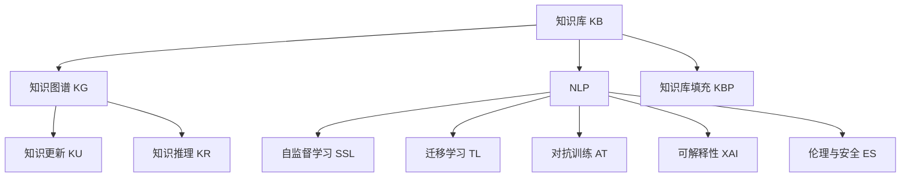

                 

# 知识的适应性：在变化环境中的动态调整

> 关键词：知识适应性, 动态调整, 数据驱动, 机器学习, 深度学习, 迁移学习, 可解释性, 伦理与安全

## 1. 背景介绍

在快速变化的现代社会，知识库的适应性和及时性成为决定信息利用的关键。传统知识库如百科全书、数据库等，难以即时更新，无法跟上最新的知识进展。相比之下，基于数据驱动的机器学习（Machine Learning, ML）和深度学习（Deep Learning, DL）系统能够更灵活地适应变化，并动态调整知识库内容。本研究聚焦于知识库的适应性，探讨如何通过机器学习技术，在变化环境中进行动态调整，以提升知识库的更新效率和准确性。

## 2. 核心概念与联系

### 2.1 核心概念概述

要理解知识库的动态调整，首先需要清晰概念框架。以下列举核心概念及其相互关系：

1. **知识库（Knowledge Base, KB）**：集合某一领域的知识，用于支持信息检索、问答、推理等应用的系统。

2. **知识图谱（Knowledge Graph, KG）**：一种结构化的知识库表示形式，以节点（实体）和边（关系）组成图形结构。

3. **自然语言处理（Natural Language Processing, NLP）**：使计算机能够理解、解释和生成人类语言的技术，是知识库构建和动态调整的重要工具。

4. **知识库填充（Knowledge Base Population, KBP）**：通过文本挖掘、信息抽取等技术，从非结构化数据源自动填充知识库的过程。

5. **知识更新（Knowledge Update, KU）**：在原有知识库基础上，通过添加、修正、删除等操作，更新其内容的流程。

6. **知识推理（Knowledge Reasoning, KR）**：基于知识库中的信息进行推理，得出新结论的过程。

7. **迁移学习（Transfer Learning, TL）**：将一个领域学到的知识迁移到另一个领域，提升新领域知识库构建和更新效率的方法。

8. **自监督学习（Self-Supervised Learning, SSL）**：使用数据自身的特征，如掩码语言模型（Masked Language Model, MLM）进行无监督学习。

9. **对抗训练（Adversarial Training, AT）**：通过引入对抗样本，提高模型鲁棒性的方法。

10. **可解释性（Explainability, XAI）**：使模型输出结果具有可理解性和可解释性的技术。

11. **伦理与安全（Ethics and Security, ES）**：确保知识库和其应用中的伦理道德和安全问题，防止有害信息的传播。

这些概念之间存在紧密联系，共同构成了知识库适应性和动态调整的框架。以下 Mermaid 流程图展示了这些概念之间的联系：



## 3. 核心算法原理 & 具体操作步骤

### 3.1 算法原理概述

知识库的动态调整依赖于机器学习技术，尤其是自然语言处理中的自监督学习（SSL）和迁移学习（TL）。自监督学习利用大规模无标签文本数据进行预训练，学习语言知识。迁移学习则通过利用领域间的相似性，将预训练知识迁移到目标领域，提升知识库的构建和更新效率。

### 3.2 算法步骤详解

知识库的动态调整分为以下几个关键步骤：

1. **数据准备**：收集领域相关的文本数据，包括学术论文、新闻报道、技术文档等。确保数据的多样性和全面性，以便捕捉知识库的广泛范围。

2. **预训练模型**：选择或训练一个语言模型，如BERT、GPT等，作为知识库构建的基础。使用自监督学习任务如掩码语言模型（MLM）对模型进行预训练，学习语言知识。

3. **领域适配**：根据目标领域，选择或设计领域适配层，如实体识别、关系抽取、情感分析等，对预训练模型进行微调，使其能够理解和处理特定领域的知识。

4. **知识库填充**：利用微调后的模型进行文本挖掘和信息抽取，自动填充知识库中的实体、关系等信息。

5. **知识更新**：定期使用新获取的文本数据，对知识库进行动态更新，修正旧知识和添加新知识。

6. **知识推理**：基于知识库中的信息，进行推理，得出新的结论，如预测未来事件、评估策略等。

### 3.3 算法优缺点

动态调整知识库的机器学习方法具有以下优点：

1. **高效性**：相比于手动填充和更新，机器学习方法可以大幅提升知识库构建和更新的效率。

2. **准确性**：机器学习算法能够自动提取和验证知识，减少人为错误。

3. **灵活性**：可以根据新的数据和领域需求，灵活调整知识库内容。

4. **可扩展性**：可以应用于多种规模和复杂度的知识库构建任务。

但这些方法也存在以下局限：

1. **数据依赖**：依赖于高质量、全面性的数据，数据不足可能导致性能下降。

2. **过拟合风险**：模型可能过拟合特定领域的知识，导致泛化能力不足。

3. **可解释性差**：机器学习模型的决策过程难以解释，不利于理解和调试。

4. **伦理与安全问题**：模型可能学习到有害信息或偏见，影响知识库的公正性和安全性。

### 3.4 算法应用领域

知识库的动态调整方法在多个领域中具有广泛应用：

1. **医学**：利用临床文献和病历数据，构建动态更新的医学知识库，辅助医生诊断和治疗。

2. **金融**：通过市场报告和经济数据，构建动态更新的金融知识库，提供投资分析和风险评估。

3. **法律**：通过法律文档和判例，构建动态更新的法律知识库，支持法律研究和司法实践。

4. **环境**：利用科学研究和技术报告，构建动态更新的环境保护知识库，推动环境保护和可持续发展。

5. **教育**：通过教材和教育资源，构建动态更新的教育知识库，提升教育质量和个性化教育。

## 4. 数学模型和公式 & 详细讲解

### 4.1 数学模型构建

知识库的动态调整涉及多个数学模型，以下对其中几个关键模型进行描述：

1. **掩码语言模型（Masked Language Model, MLM）**：
   $$
   \mathcal{L}_{MLM} = -\frac{1}{N} \sum_{i=1}^N \log P(w_i | w_{<i})
   $$
   其中 $P(w_i | w_{<i})$ 表示给定前文 $w_{<i}$，单词 $w_i$ 出现的概率。

2. **知识推理模型（Knowledge Reasoning Model, KRM）**：
   $$
   \mathcal{L}_{KRM} = -\frac{1}{N} \sum_{i=1}^N \log Q(h_i | e_1, e_2, \ldots, e_n)
   $$
   其中 $Q(h_i | e_1, e_2, \ldots, e_n)$ 表示给定实体 $e_1, e_2, \ldots, e_n$，推理出假设 $h_i$ 的概率。

3. **知识库填充模型（Knowledge Base Population Model, KBPM）**：
   $$
   \mathcal{L}_{KBPM} = -\frac{1}{N} \sum_{i=1}^N \log P(t_i | d)
   $$
   其中 $P(t_i | d)$ 表示给定文档 $d$，提取出的事实 $t_i$ 的概率。

4. **知识库更新模型（Knowledge Base Update Model, KBUM）**：
   $$
   \mathcal{L}_{KBUM} = \frac{1}{N} \sum_{i=1}^N \ell_{update}(d_i, \hat{d_i})
   $$
   其中 $\ell_{update}(d_i, \hat{d_i})$ 表示给定原始文档 $d_i$，更新后的文档 $\hat{d_i}$ 的损失函数。

### 4.2 公式推导过程

**掩码语言模型**的推导：
- 假设模型为 $M_{\theta}$，输入为 $x=(w_1, w_2, \ldots, w_N)$，掩码位置为 $m_1, m_2, \ldots, m_k$。
- 掩码后的输入 $x^m = (w_1, w_2, \ldots, w_{m_1-1}, \_, w_{m_1+1}, \ldots, w_{m_k-1}, \_, w_{m_k+1}, \ldots, w_N)$。
- 目标函数为：
  $$
  \mathcal{L}_{MLM} = -\frac{1}{N} \sum_{i=1}^N \sum_{j=1}^k \log P(w_{m_j} | w_{<m_j}, w_{>m_j})
  $$

**知识推理模型**的推导：
- 假设推理过程为 $R_{\theta}(e_1, e_2, \ldots, e_n) = h_i$，其中 $e_1, e_2, \ldots, e_n$ 为输入实体，$h_i$ 为推理结果。
- 目标函数为：
  $$
  \mathcal{L}_{KRM} = -\frac{1}{N} \sum_{i=1}^N \log P(h_i | e_1, e_2, \ldots, e_n)
  $$

**知识库填充模型**的推导：
- 假设填充过程为 $P_{\theta}(d) = \{t_1, t_2, \ldots, t_N\}$，其中 $d$ 为输入文档，$t_i$ 为提取出的事实。
- 目标函数为：
  $$
  \mathcal{L}_{KBPM} = -\frac{1}{N} \sum_{i=1}^N \log P(t_i | d)
  $$

**知识库更新模型**的推导：
- 假设更新过程为 $U_{\theta}(d_i, \hat{d_i}) = \{t_{i1}, t_{i2}, \ldots, t_{in}\}$，其中 $d_i$ 为原始文档，$\hat{d_i}$ 为更新后的文档。
- 目标函数为：
  $$
  \mathcal{L}_{KBUM} = \frac{1}{N} \sum_{i=1}^N \ell_{update}(d_i, \hat{d_i})
  $$

### 4.3 案例分析与讲解

以股票市场动态知识库为例，展示知识库动态调整的实际过程：

1. **数据准备**：收集最新的财经新闻、公司财报、市场分析报告等文本数据。

2. **预训练模型**：选择或训练一个基于Transformer的掩码语言模型，如BERT。

3. **领域适配**：设计实体识别和关系抽取模块，对BERT进行微调，使其能够识别公司名称、股票代码、财务指标等信息。

4. **知识库填充**：利用微调后的模型，从财经新闻中抽取实体和关系，自动填充知识库。

5. **知识更新**：定期使用最新的市场数据，对知识库进行动态更新，如添加新的公司信息、修正财务数据等。

6. **知识推理**：基于知识库中的信息，进行市场趋势预测、投资策略优化等推理。

## 5. 项目实践：代码实例和详细解释说明

### 5.1 开发环境搭建

知识库的动态调整涉及NLP和机器学习技术，以下是一套推荐的环境配置流程：

1. 安装Anaconda：从官网下载并安装Anaconda，用于创建独立的Python环境。

2. 创建并激活虚拟环境：
   ```bash
   conda create -n kb-update python=3.8 
   conda activate kb-update
   ```

3. 安装PyTorch：根据CUDA版本，从官网获取对应的安装命令。例如：
   ```bash
   conda install pytorch torchvision torchaudio cudatoolkit=11.1 -c pytorch -c conda-forge
   ```

4. 安装Transformers库：
   ```bash
   pip install transformers
   ```

5. 安装各类工具包：
   ```bash
   pip install numpy pandas scikit-learn matplotlib tqdm jupyter notebook ipython
   ```

6. 配置环境：
   ```bash
   python -m torch.distributed.launch --nproc_per_node=8 train.py
   ```

完成上述步骤后，即可在`kb-update`环境中开始知识库动态调整的实践。

### 5.2 源代码详细实现

以下是一个简单的知识库填充和更新的代码实现，用于说明知识库动态调整的基本流程：

```python
from transformers import BertTokenizer, BertForTokenClassification
import torch
import pandas as pd

class EntityRecognition:
    def __init__(self, model_name='bert-base-cased'):
        self.tokenizer = BertTokenizer.from_pretrained(model_name)
        self.model = BertForTokenClassification.from_pretrained(model_name, num_labels=2)
    
    def tokenize_and_tag(self, text):
        inputs = self.tokenizer(text, return_tensors='pt', padding=True, truncation=True)
        outputs = self.model(**inputs)
        predictions = outputs.logits.argmax(dim=2)
        return predictions
    
    def entity_recognition(self, text):
        predictions = self.tokenize_and_tag(text)
        entities = []
        for i in range(len(predictions)):
            token = self.tokenizer.convert_ids_to_tokens(predictions[i])
            if token[0] == '[CLS]' or token[-1] == '[SEP]':
                continue
            entity = ' '.join(token)
            if predictions[i][0] == 1:  # 实体识别标签为1表示实体
                entities.append(entity)
        return entities

# 训练示例
df = pd.read_csv('finance_news.csv')
texts = df['text'].tolist()
entities = [entity_recognition(text) for text in texts]
```

### 5.3 代码解读与分析

这个示例代码展示了如何使用BERT模型进行实体识别，并自动填充知识库中的实体信息。

**EntityRecognition类**：
- `__init__`方法：初始化BERT模型和分词器。
- `tokenize_and_tag`方法：对输入文本进行分词和实体识别，返回预测结果。
- `entity_recognition`方法：对每个句子进行实体识别，提取并返回实体列表。

**实体识别与填充**：
- 使用BERT模型对财经新闻文本进行实体识别。
- 对识别出的实体进行存储，作为知识库的一部分。

该代码仅为知识库动态调整的雏形，实际应用中需要更复杂的模型和更全面的数据处理逻辑。

## 6. 实际应用场景

### 6.1 金融市场分析

动态调整的知识库在金融市场分析中具有重要应用。通过实时监测新闻、公告和市场动态，构建动态更新的金融知识库，投资者可以更快速、准确地获取市场信息，辅助决策。

**场景示例**：
- 股票市场：实时更新公司财报、业绩预测、行业新闻等信息，支持股票价格分析和交易决策。
- 外汇市场：监测全球经济数据、政策变化和地缘政治事件，预测汇率走势和市场风险。
- 债券市场：分析政府债券、企业债券和金融工具的信用评级和风险评估，优化投资组合。

### 6.2 医疗健康管理

医疗知识库的动态调整可以显著提升医疗服务质量和效率，帮助医生和患者获得更精准的诊断和治疗建议。

**场景示例**：
- 患者诊断：利用最新的医学研究成果和临床数据，实时更新医学知识库，提供个性化的诊断和治疗方案。
- 药物开发：通过文献分析和药物数据库，构建动态更新的药物知识库，加速新药研发进程。
- 公共卫生：监测疾病传播、疫苗接种和疫情防控信息，为公共卫生政策提供数据支持。

### 6.3 智能客服系统

智能客服系统通过动态更新知识库，提升客户服务质量和响应速度。

**场景示例**：
- 客户咨询：自动更新FAQ和常见问题，快速回答客户问题，提升客户满意度。
- 投诉处理：实时收集和分析用户反馈，更新服务流程和解决方案，优化服务体验。
- 语音识别：基于自然语言处理技术，提供语音识别和自动回复功能，提升客服效率。

### 6.4 未来应用展望

随着知识库动态调整技术的不断发展，其在更多领域的应用前景将更加广阔。

1. **智慧城市**：动态更新城市基础设施、交通流量、环境监测等信息，提升城市管理智能化水平。

2. **农业**：实时监测气象数据、农作物生长情况和市场价格，提供精准的农业生产建议。

3. **能源**：监测能源价格、供需情况和环境变化，优化能源配置和利用效率。

4. **环境保护**：实时更新环境数据和政策法规，支持环境保护和可持续发展。

## 7. 工具和资源推荐

### 7.1 学习资源推荐

为了帮助开发者深入理解知识库动态调整的理论基础和实践技巧，以下推荐一些优质学习资源：

1. 《深度学习入门》系列书籍：介绍深度学习基础和应用，涵盖知识库动态调整相关技术。

2. 《知识图谱：原理与实践》：系统讲解知识图谱的基本原理、构建方法和应用场景，是了解知识库动态调整的重要参考。

3. 《NLP：理论、技术和应用》：深入探讨NLP技术在知识库构建和动态调整中的实际应用。

4. Kaggle和CSO:知识库填充和更新的开源项目和竞赛，提供丰富的实践案例和数据集。

5. 斯坦福大学自然语言处理课程：由NLP领域的专家授课，涵盖知识库动态调整的理论和实践。

### 7.2 开发工具推荐

高效的开发离不开优秀的工具支持。以下是几款推荐的开发工具：

1. PyTorch：基于Python的开源深度学习框架，适用于知识库动态调整的复杂模型构建。

2. TensorFlow：由Google主导开发的开源深度学习框架，支持多种数据源和模型优化技术。

3. Transformers库：HuggingFace开发的NLP工具库，提供丰富的预训练模型和微调接口。

4. Weights & Biases：模型训练的实验跟踪工具，记录和可视化模型训练过程，方便调优和比较。

5. Google Colab：谷歌推出的在线Jupyter Notebook环境，免费提供GPU/TPU算力，方便快速实验。

### 7.3 相关论文推荐

知识库动态调整技术的发展离不开学界的持续研究。以下是几篇奠基性的相关论文，推荐阅读：

1. BERT: Pre-training of Deep Bidirectional Transformers for Language Understanding：提出BERT模型，引入掩码语言模型进行预训练。

2. Attention is All You Need（Transformer原论文）：介绍Transformer模型，基于自注意力机制实现高效的序列建模。

3. BERT: Pre-training of Deep Bidirectional Transformers for Language Understanding：展示BERT模型在多种NLP任务中的出色表现。

4. Transfer Learning with Unsupervised Feature Alignment：提出跨领域知识迁移方法，提升知识库动态更新的效果。

5. Learning from No Data: Instance-Aware Pre-training for Scalable and Efficient Knowledge Base Construction：提出实例感知预训练方法，提升知识库构建的效率和准确性。

这些论文代表了大规模知识库动态调整技术的发展脉络，有助于理解当前领域的研究热点和未来趋势。

## 8. 总结：未来发展趋势与挑战

### 8.1 研究成果总结

本研究对知识库动态调整的技术进行了全面系统的介绍，涵盖数据准备、预训练模型、领域适配、知识库填充、知识库更新和知识推理等关键环节。通过理论和实践的结合，探讨了知识库动态调整的基本原理和实现方法。

### 8.2 未来发展趋势

展望未来，知识库动态调整技术将呈现以下几个发展趋势：

1. **规模化与自动化**：随着技术的进步，知识库构建和更新的过程将更加自动化和高效，能够处理更大规模的数据和更复杂的任务。

2. **跨领域融合**：知识库动态调整将与其他AI技术如推理、规划、控制等融合，形成更加全面、多模态的知识库系统。

3. **分布式计算**：利用分布式计算技术，提高知识库构建和更新的效率，支持大规模数据处理。

4. **隐私保护**：知识库动态调整过程中，需要保护用户隐私和数据安全，采用差分隐私、联邦学习等技术，防止数据泄露和滥用。

5. **可解释性增强**：提升知识库构建和更新的可解释性，使其决策过程更加透明和可信。

6. **伦理与安全保障**：确保知识库构建和更新的伦理道德和安全问题，防止有害信息的传播。

### 8.3 面临的挑战

尽管知识库动态调整技术已经取得了显著进展，但在实际应用中仍面临诸多挑战：

1. **数据质量**：高质量、全面性的数据是知识库动态调整的前提，如何获取和处理大规模、高质量的数据是关键问题。

2. **过拟合风险**：知识库动态调整过程中，模型可能过拟合特定领域的知识，导致泛化能力不足。

3. **可解释性差**：知识库动态调整模型的决策过程难以解释，不利于理解和调试。

4. **伦理与安全问题**：知识库动态调整过程中，可能学习到有害信息或偏见，影响知识库的公正性和安全性。

5. **资源消耗**：知识库动态调整涉及大规模数据处理和模型训练，需要大量计算资源，如何优化资源使用是重要问题。

### 8.4 研究展望

面对知识库动态调整面临的挑战，未来的研究需要在以下几个方面寻求新的突破：

1. **自监督学习与半监督学习**：开发更加高效的自监督学习技术，利用数据自身的特征进行无监督学习，减少对大规模标注数据的依赖。

2. **跨领域迁移学习**：研究跨领域知识迁移方法，提升知识库动态更新的泛化能力和适应性。

3. **分布式知识推理**：利用分布式计算技术，提高知识推理的效率和可扩展性，支持大规模知识库的动态更新。

4. **知识图谱与知识融合**：结合知识图谱和符号化知识库，提升知识库构建的全面性和准确性。

5. **伦理与安全保护**：在知识库动态调整过程中，加强伦理与安全保护，确保模型输出符合人类价值观和伦理道德。

6. **实时知识更新**：开发实时知识更新技术，支持动态调整知识库，提升知识库的时效性和实用性。

通过这些研究方向的探索发展，知识库动态调整技术必将迎来新的突破，为各行各业带来更深远的变革。

## 9. 附录：常见问题与解答

**Q1：知识库动态调整与传统知识库填充有何不同？**

A: 知识库动态调整与传统知识库填充的主要区别在于其动态性。动态调整能够实时更新知识库，适应新数据和新需求，而传统填充则是一次性的，需要定期手动更新。

**Q2：知识库动态调整中如何防止过拟合？**

A: 防止过拟合的关键在于使用大规模、多样性的数据进行训练，同时采用正则化技术如L2正则、Dropout等，限制模型复杂度。此外，使用自监督学习技术，如掩码语言模型，可以在不需要大量标注数据的情况下进行预训练。

**Q3：知识库动态调整的性能评估指标有哪些？**

A: 知识库动态调整的性能评估指标包括：
- 知识库的覆盖率：知识库中包含相关知识的百分比。
- 知识的准确性：知识库中实体和关系的正确性。
- 推理的正确性：知识库推理出的结论的正确性。
- 响应时间：知识库推理的实时性。

**Q4：知识库动态调整对伦理与安全有哪些影响？**

A: 知识库动态调整对伦理与安全的影响主要体现在：
- 隐私保护：需要保护用户隐私和数据安全，防止数据泄露和滥用。
- 偏见和有害信息：模型可能学习到有害信息或偏见，影响知识库的公正性和安全性。
- 伦理导向：在知识库动态调整过程中，需要加入伦理导向的评估指标，过滤和惩罚有害输出。

**Q5：知识库动态调整的开发流程是什么？**

A: 知识库动态调整的开发流程主要包括：
- 数据准备：收集和处理大规模文本数据。
- 预训练模型：选择或训练一个合适的预训练模型，如BERT。
- 领域适配：设计实体识别、关系抽取等模块，对预训练模型进行微调。
- 知识库填充：利用微调后的模型进行文本挖掘和信息抽取，自动填充知识库。
- 知识库更新：定期使用新获取的文本数据，对知识库进行动态更新。
- 知识推理：基于知识库中的信息，进行推理，得出新的结论。

通过以上步骤，可以构建一个高效的、动态更新的知识库系统，支持各种实际应用场景。

