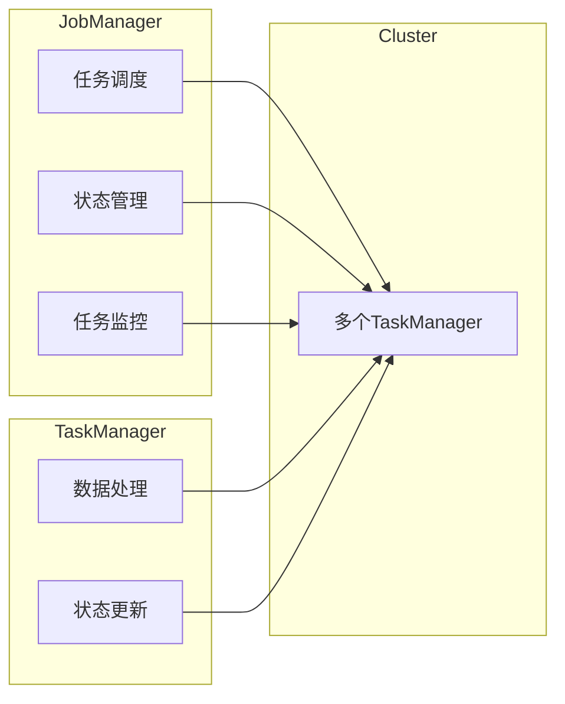

> Apache Flink, JobManager, 任务调度, 状态管理, 数据流处理, 并行计算

## 1. 背景介绍

Apache Flink 作为一款开源的分布式流处理引擎，以其高吞吐量、低延迟和强大的状态管理能力而闻名。在构建复杂的数据流应用时，Flink 的 JobManager 扮演着至关重要的角色，负责协调和管理整个任务执行流程。本文将深入探讨 Flink JobManager 的原理、核心算法和代码实现，并通过实例讲解帮助读者理解其工作机制。

## 2. 核心概念与联系

Flink 的架构主要由以下几个核心组件组成：

* **JobManager:** 负责任务的调度、分配、监控和状态管理。
* **TaskManager:** 负责执行具体的任务，处理数据并更新状态。
* **Cluster:** 由多个 TaskManager 组成，共同处理数据流。

**Flink JobManager 与其他组件的关系:**



**核心概念:**

* **任务 (Task):** Flink 将一个 Job 分解成多个独立的任务，每个任务负责处理一部分数据。
* **算子 (Operator):** 算子是 Flink 中处理数据的基本单元，例如 Map、Filter、Reduce 等。
* **数据流 (Data Stream):** 数据流是 Flink 处理的数据形式，它是一个连续的、有序的数据序列。
* **状态 (State):** 状态是 Flink 中用于存储和更新数据的重要机制，它可以用于实现窗口操作、累加计数等功能。

## 3. 核心算法原理 & 具体操作步骤

### 3.1  算法原理概述

Flink JobManager 使用一种基于 **流式任务图 (Stream Task Graph)** 的调度算法，它将 Job 分解成一个有向图，其中节点代表任务，边代表数据流。JobManager 会根据任务的依赖关系和资源分配策略，将任务分配到不同的 TaskManager 上执行。

### 3.2  算法步骤详解

1. **任务图构建:** JobManager 会根据 Job 的定义，构建一个流式任务图。
2. **任务分配:** JobManager 会根据任务图的依赖关系和 TaskManager 的资源情况，将任务分配到不同的 TaskManager 上。
3. **任务执行:** TaskManager 会根据分配的任务，执行相应的算子操作，处理数据并更新状态。
4. **状态管理:** JobManager 会负责协调和管理任务的状态，确保状态的正确性和一致性。
5. **任务监控:** JobManager 会持续监控任务的执行情况，例如任务的进度、资源使用情况等，并根据监控结果进行调整和优化。

### 3.3  算法优缺点

**优点:**

* **高效的资源利用:** 基于任务图的调度算法可以有效地利用集群资源，提高任务执行效率。
* **灵活的部署:** Flink 支持多种部署模式，例如本地部署、集群部署等，可以根据实际需求进行灵活配置。
* **强大的状态管理:** Flink 提供了丰富的状态管理机制，可以用于实现各种复杂的数据流应用。

**缺点:**

* **调度复杂度高:** 任务图的构建和调度算法的实现比较复杂，需要一定的技术积累。
* **状态管理的挑战:** 在分布式环境下，状态管理是一个比较复杂的问题，需要考虑状态的正确性和一致性。

### 3.4  算法应用领域

Flink 的流式任务图调度算法广泛应用于各种数据流处理场景，例如：

* **实时数据分析:** 实时监控数据流，进行分析和报警。
* **事件处理:** 处理各种事件，例如用户行为、系统告警等。
* **机器学习:** 实时训练机器学习模型，进行预测和决策。
* **数据集成:** 从多个数据源中收集数据，进行清洗和转换。

## 4. 数学模型和公式 & 详细讲解 & 举例说明

### 4.1  数学模型构建

Flink JobManager 的调度算法可以抽象为一个图论模型，其中：

* **节点:** 代表任务
* **边:** 代表数据流

我们可以用以下数学模型来描述任务图：

* **G = (V, E)**

其中：

* **V:** 任务集
* **E:** 数据流集

每个任务 v ∈ V 可以用一个元组 (cpu, memory) 表示，其中 cpu 和 memory 分别代表任务所需的 CPU 资源和内存资源。

### 4.2  公式推导过程

Flink JobManager 会根据任务图和 TaskManager 的资源情况，使用以下公式来计算任务分配方案：

* **目标函数:** 

$$
minimize \sum_{v \in V} c(v)
$$

其中 c(v) 代表任务 v 的执行成本，可以根据任务的执行时间、资源消耗等因素进行计算。

* **约束条件:**

$$
\sum_{v \in V} c(v) \leq C
$$

其中 C 代表集群的总资源容量。

### 4.3  案例分析与讲解

假设我们有一个包含三个任务的 Job，每个任务的资源需求如下：

* 任务 1: (2, 1)
* 任务 2: (1, 2)
* 任务 3: (3, 1)

集群的总资源容量为 (5, 3)。

Flink JobManager 会根据上述公式和约束条件，计算出最优的任务分配方案，例如：

* 将任务 1 分配到 TaskManager 1 上
* 将任务 2 分配到 TaskManager 2 上
* 将任务 3 分配到 TaskManager 3 上

## 5. 项目实践：代码实例和详细解释说明

### 5.1  开发环境搭建

为了方便理解 Flink JobManager 的工作原理，我们可以使用 Flink 的官方提供的 Scala API 来编写一个简单的代码实例。

**开发环境:**

* JDK 8 或以上
* Maven 或 Gradle
* Flink 1.13 或以上版本

### 5.2  源代码详细实现

```scala
import org.apache.flink.api.common.functions.MapFunction
import org.apache.flink.streaming.api.datastream.DataStream
import org.apache.flink.streaming.api.environment.StreamExecutionEnvironment

object JobManagerExample {
  def main(args: Array[String]): Unit = {
    // 创建流处理环境
    val env = StreamExecutionEnvironment.getExecutionEnvironment

    // 创建一个数据流
    val dataStream: DataStream[String] = env.fromElements("Hello", "World", "Flink")

    // 使用 map 函数将数据转换为大写
    val uppercaseStream: DataStream[String] = dataStream.map(new MapFunction[String, String] {
      override def map(value: String): String = value.toUpperCase()
    })

    // 打印结果
    uppercaseStream.print()

    // 执行任务
    env.execute("JobManagerExample")
  }
}
```

### 5.3  代码解读与分析

这段代码演示了如何使用 Flink API 创建一个简单的流处理任务。

* **创建流处理环境:** `StreamExecutionEnvironment.getExecutionEnvironment` 创建一个流处理环境。
* **创建数据流:** `env.fromElements("Hello", "World", "Flink")` 创建一个包含三个元素的数据流。
* **使用 map 函数处理数据:** `dataStream.map(...)` 使用 map 函数将数据转换为大写。
* **打印结果:** `uppercaseStream.print()` 打印处理后的数据。
* **执行任务:** `env.execute("JobManagerExample")` 执行流处理任务。

### 5.4  运行结果展示

运行这段代码后，会输出以下结果：

```
HELLO
WORLD
FLINK
```

## 6. 实际应用场景

Flink 的 JobManager 在各种实际应用场景中发挥着重要作用，例如：

* **实时广告推荐:** 根据用户的行为数据，实时推荐个性化的广告。
* **欺诈检测:** 实时监控交易数据，检测异常行为并进行报警。
* **网络流量分析:** 实时分析网络流量数据，识别攻击行为和流量异常。
* **金融风险管理:** 实时监控金融数据，识别风险并进行预警。

### 6.4  未来应用展望

随着数据流处理技术的不断发展，Flink JobManager 的应用场景将会更加广泛，例如：

* **边缘计算:** 将 JobManager 部署到边缘设备上，实现实时数据处理和决策。
* **物联网:** 处理来自物联网设备的大量数据，实现智能感知和控制。
* **工业互联网:** 实时监控工业设备运行状态，进行故障诊断和预测维护。

## 7. 工具和资源推荐

### 7.1  学习资源推荐

* **Apache Flink 官方文档:** https://flink.apache.org/docs/stable/
* **Flink 中文社区:** https://flink.apache.org/zh-cn/
* **Flink 入门教程:** https://flink.apache.org/docs/stable/getting_started.html

### 7.2  开发工具推荐

* **IntelliJ IDEA:** https://www.jetbrains.com/idea/
* **Eclipse:** https://www.eclipse.org/

### 7.3  相关论文推荐

* **Apache Flink: A Unified Platform for Batch and Stream Processing:** https://arxiv.org/abs/1803.08193

## 8. 总结：未来发展趋势与挑战

### 8.1  研究成果总结

Flink JobManager 的研究成果主要体现在以下几个方面：

* **高效的流式任务图调度算法:** 能够有效地利用集群资源，提高任务执行效率。
* **强大的状态管理机制:** 可以用于实现各种复杂的数据流应用。
* **灵活的部署模式:** 支持多种部署模式，可以根据实际需求进行灵活配置。

### 8.2  未来发展趋势

Flink JobManager 的未来发展趋势主要包括：

* **更智能的调度算法:** 基于机器学习等技术，实现更智能的资源分配和任务调度。
* **更强大的状态管理能力:** 支持更复杂的 state 管理模式，例如分布式状态存储和状态同步。
* **更完善的生态系统:** 发展更多 Flink 的生态系统，例如更丰富的第三方库和工具。

### 8.3  面临的挑战

Flink JobManager 还面临着一些挑战，例如：

* **状态管理的复杂性:** 在分布式环境下，状态管理是一个比较复杂的问题，需要考虑状态的正确性和一致性。
* **调度算法的优化:** 随着数据流处理规模的不断扩大，调度算法的优化仍然是一个重要的研究方向。
* **生态系统建设:** 完善 Flink 的生态系统，需要更多的开发者和贡献者参与。

### 8.4  研究展望

未来，我们将继续深入研究 Flink JobManager 的原理和算法，探索更智能、更高效的调度和状态管理机制，为数据流处理领域的发展做出贡献。

## 9. 附录：常见问题与解答

**常见问题:**

* **Flink JobManager 的职责是什么？**

**解答:** Flink JobManager 负责协调和管理整个任务执行流程，包括任务调度、状态管理、任务监控等。

* **Flink JobManager 如何分配任务？**

**解答:** Flink JobManager 会根据任务图的依赖关系和 TaskManager 的资源情况，使用一种基于流式任务图的调度算法来分配任务。

* **Flink JobManager 如何管理状态？**

**解答:** Flink 提供了丰富的状态管理机制，JobManager 会负责协调和管理任务的状态，确保状态的正确性和一致性。


作者：禅与计算机程序设计艺术 / Zen and the Art of Computer Programming 
<end_of_turn>