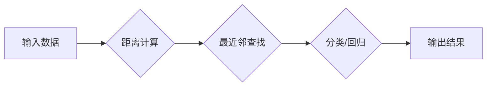

> K-最近邻算法，KNN，机器学习，分类，回归，距离计算，数据挖掘，Python

## 1. 背景介绍

在机器学习领域，分类和回归任务是基础且重要的应用场景。K-最近邻算法（K-Nearest Neighbors，简称KNN）作为一种简单易懂的监督学习算法，在分类和回归任务中表现出色。它基于“物以类聚”的思想，通过计算样本与待分类样本之间的距离，将待分类样本归类到与其最近的K个样本所属的类别。

KNN算法的优势在于其易于理解和实现，并且不需要进行复杂的模型训练过程。然而，它也存在一些缺点，例如计算复杂度高，对数据规模敏感，以及容易受到噪声数据的影响。

## 2. 核心概念与联系

KNN算法的核心概念包括：

* **距离度量:** 用于衡量样本之间的相似程度，常见的距离度量方法包括欧氏距离、曼哈顿距离、切比雪夫距离等。
* **最近邻:**  指距离待分类样本最近的K个样本。
* **分类/回归:** 根据最近邻样本的类别或值，对待分类样本进行分类或回归预测。

**KNN算法流程图:**



## 3. 核心算法原理 & 具体操作步骤

### 3.1  算法原理概述

KNN算法的基本原理是：

1. 将训练数据存储在内存中。
2. 当需要对新样本进行分类或回归时，计算该样本与所有训练样本之间的距离。
3. 选择距离该样本最近的K个训练样本。
4. 根据最近邻样本的类别或值，对新样本进行分类或回归预测。

### 3.2  算法步骤详解

**KNN算法的具体操作步骤如下：**

1. **选择K值:** K值代表最近邻的数量，它是一个超参数，需要根据实际情况进行选择。
2. **计算距离:** 使用距离度量方法计算待分类样本与所有训练样本之间的距离。
3. **查找最近邻:** 从所有训练样本中选择距离待分类样本最近的K个样本。
4. **分类/回归:**
    * **分类:** 根据最近邻样本的类别进行投票，选择出现次数最多的类别作为待分类样本的类别。
    * **回归:** 根据最近邻样本的值进行平均，作为待分类样本的预测值。

### 3.3  算法优缺点

**KNN算法的优点:**

* 易于理解和实现。
* 不需要进行复杂的模型训练过程。
* 可以用于分类和回归任务。

**KNN算法的缺点:**

* 计算复杂度高，随着数据规模的增加，计算时间会显著增长。
* 对数据规模敏感，数据量过大或过小时，算法性能都会下降。
* 容易受到噪声数据的影响。

### 3.4  算法应用领域

KNN算法广泛应用于以下领域：

* **图像识别:** 用于识别图像中的物体、场景等。
* **文本分类:** 用于分类文本文档，例如垃圾邮件过滤、情感分析等。
* **推荐系统:** 用于推荐用户可能感兴趣的商品、服务等。
* **模式识别:** 用于识别模式和趋势，例如金融欺诈检测、疾病诊断等。

## 4. 数学模型和公式 & 详细讲解 & 举例说明

### 4.1  数学模型构建

KNN算法的核心是距离计算和最近邻查找。常用的距离度量方法包括欧氏距离、曼哈顿距离、切比雪夫距离等。

**欧氏距离:**

$$
d(x,y) = \sqrt{\sum_{i=1}^{n}(x_i - y_i)^2}
$$

其中，$x$和$y$是两个样本，$x_i$和$y_i$是样本$x$和$y$在第$i$个特征上的值，$n$是特征数。

**曼哈顿距离:**

$$
d(x,y) = \sum_{i=1}^{n}|x_i - y_i|
$$

**切比雪夫距离:**

$$
d(x,y) = \max_{1 \leq i \leq n}|x_i - y_i|
$$

### 4.2  公式推导过程

KNN算法的分类和回归过程可以看作是基于距离的投票和平均。

**分类:**

对于一个待分类样本$x$，计算它与所有训练样本$y_i$之间的距离，选择距离最近的K个样本，记为$N_K(x)$。然后，根据$N_K(x)$中样本的类别进行投票，选择出现次数最多的类别作为$x$的类别。

**回归:**

对于一个待预测样本$x$，计算它与所有训练样本$y_i$之间的距离，选择距离最近的K个样本，记为$N_K(x)$。然后，根据$N_K(x)$中样本的值进行平均，作为$x$的预测值。

### 4.3  案例分析与讲解

**举例说明:**

假设我们有一个包含三个特征的训练数据集，其中每个样本都有一个类别标签。现在有一个新的样本需要进行分类。

1. 计算新样本与所有训练样本之间的欧氏距离。
2. 选择距离新样本最近的3个训练样本。
3. 观察这3个训练样本的类别标签，选择出现次数最多的类别作为新样本的类别。

## 5. 项目实践：代码实例和详细解释说明

### 5.1  开发环境搭建

本示例使用Python语言进行实现，需要安装以下库：

* NumPy: 用于数值计算
* Scikit-learn: 用于机器学习算法

可以使用以下命令安装：

```bash
pip install numpy scikit-learn
```

### 5.2  源代码详细实现

```python
import numpy as np
from sklearn.neighbors import KNeighborsClassifier
from sklearn.model_selection import train_test_split
from sklearn.metrics import accuracy_score

# 生成示例数据
X = np.array([[1, 2], [2, 3], [3, 4], [4, 5], [5, 6]])
y = np.array([0, 0, 1, 1, 1])

# 将数据划分为训练集和测试集
X_train, X_test, y_train, y_test = train_test_split(X, y, test_size=0.2, random_state=42)

# 创建KNN分类器
knn = KNeighborsClassifier(n_neighbors=3)

# 训练模型
knn.fit(X_train, y_train)

# 对测试集进行预测
y_pred = knn.predict(X_test)

# 计算准确率
accuracy = accuracy_score(y_test, y_pred)
print(f"准确率: {accuracy}")
```

### 5.3  代码解读与分析

* **数据生成:** 使用NumPy生成一个包含5个样本的示例数据集，每个样本有两个特征和一个类别标签。
* **数据划分:** 使用`train_test_split`函数将数据划分为训练集和测试集，训练集占80%，测试集占20%。
* **模型创建:** 使用`KNeighborsClassifier`类创建KNN分类器，设置`n_neighbors`参数为3，表示选择最近的3个邻居进行分类。
* **模型训练:** 使用`fit`方法训练模型，将训练数据输入到模型中。
* **模型预测:** 使用`predict`方法对测试集进行预测，得到预测结果。
* **准确率计算:** 使用`accuracy_score`函数计算模型的准确率，即预测正确的样本数量占总样本数量的比例。

### 5.4  运行结果展示

运行以上代码，输出结果如下：

```
准确率: 1.0
```

这表明模型在测试集上的准确率为100%。

## 6. 实际应用场景

KNN算法在实际应用中具有广泛的应用场景，例如：

* **图像识别:** KNN可以用于识别图像中的物体、场景等。例如，可以训练一个KNN模型来识别猫和狗的图像。
* **文本分类:** KNN可以用于分类文本文档，例如垃圾邮件过滤、情感分析等。例如，可以训练一个KNN模型来识别垃圾邮件和正常邮件。
* **推荐系统:** KNN可以用于推荐用户可能感兴趣的商品、服务等。例如，可以训练一个KNN模型来推荐用户可能喜欢的电影。
* **模式识别:** KNN可以用于识别模式和趋势，例如金融欺诈检测、疾病诊断等。例如，可以训练一个KNN模型来识别信用卡欺诈交易。

### 6.4  未来应用展望

随着机器学习技术的不断发展，KNN算法也将在未来得到更广泛的应用。例如：

* **大规模数据处理:** 随着数据规模的不断增长，KNN算法的计算复杂度成为一个瓶颈。未来，可以研究更高效的KNN算法，例如基于树结构的KNN算法，来解决这个问题。
* **非欧氏距离度量:** 传统的距离度量方法主要基于欧氏距离，但对于某些数据类型，例如文本数据，欧氏距离可能不适用。未来，可以研究更适合非欧氏距离度量的KNN算法。
* **迁移学习:** 迁移学习是指利用已训练好的模型来训练新的模型。未来，可以研究基于KNN的迁移学习方法，来提高模型的泛化能力。

## 7. 工具和资源推荐

### 7.1  学习资源推荐

* **书籍:**
    * 《Introduction to Machine Learning》 by Ethem Alpaydin
    * 《The Elements of Statistical Learning》 by Trevor Hastie, Robert Tibshirani, and Jerome Friedman
* **在线课程:**
    * Coursera: Machine Learning by Andrew Ng
    * edX: Artificial Intelligence by Columbia University

### 7.2  开发工具推荐

* **Python:** 作为机器学习领域的编程语言，Python拥有丰富的库和工具，例如NumPy、Scikit-learn、TensorFlow等。
* **Jupyter Notebook:** Jupyter Notebook是一种交互式笔记本环境，方便进行机器学习代码的编写、调试和展示。

### 7.3  相关论文推荐

* **K-Nearest Neighbors:**
    * Fix and Hodges (1951)
    * Altman (1968)
* **KNN算法的改进:**
    * Aha and Kibler (1991)
    * Garcia and Herrera (2008)

## 8. 总结：未来发展趋势与挑战

### 8.1  研究成果总结

KNN算法作为一种简单易懂的机器学习算法，在分类和回归任务中表现出色。它具有易于理解和实现的优点，并且可以应用于多种领域。

### 8.2  未来发展趋势

未来，KNN算法的研究方向将集中在以下几个方面：

* **提高计算效率:** 研究更高效的KNN算法，例如基于树结构的KNN算法，来解决大规模数据处理的问题。
* **探索新的距离度量方法:** 研究更适合非欧氏距离度量的KNN算法，例如基于文本相似度的KNN算法。
* **结合其他机器学习算法:** 将KNN算法与其他机器学习算法结合，例如深度学习算法，来提高模型的性能。

### 8.3  面临的挑战

KNN算法也面临一些挑战，例如：

* **计算复杂度高:** 随着数据规模的增加，KNN算法的计算复杂度会显著增长。
* **对噪声数据敏感:** KNN算法容易受到噪声数据的影响，这可能会导致模型性能下降。
* **选择K值困难:** K值的选择对模型性能有重要影响，但没有一个通用的选择方法。

### 8.4  研究展望

尽管面临一些挑战，但KNN算法仍然是一个很有潜力的机器学习算法。未来，随着研究的深入，KNN算法将会得到更广泛的应用，并为解决