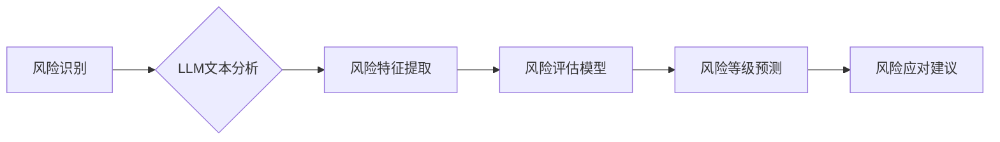

> Large Language Model (LLM), 风险评估, 自然语言处理 (NLP), 机器学习 (ML), 预测建模, 决策支持

## 1. 背景介绍

风险评估是各行各业不可或缺的一部分，它涉及识别、分析和量化潜在的威胁和机会，以帮助组织做出明智的决策。传统风险评估方法通常依赖于专家经验、定性分析和历史数据，但这些方法往往耗时、成本高且难以量化风险。近年来，随着人工智能 (AI) 和机器学习 (ML) 技术的快速发展，大型语言模型 (LLM) 作为一种强大的工具，在风险评估领域展现出巨大的潜力。

LLM 是一种能够理解和生成人类语言的深度学习模型，其强大的文本处理能力和知识表示能力使其能够有效地处理复杂的数据，并从海量文本数据中提取有价值的风险信息。

## 2. 核心概念与联系

### 2.1 风险评估

风险评估是指识别、分析和评估可能对组织目标造成不利影响的事件或情况的过程。它通常包括以下步骤：

* **风险识别:** 确定可能影响组织的目标的潜在风险。
* **风险分析:** 评估每个风险的可能性和影响程度。
* **风险评估:** 根据风险分析结果，对风险进行优先级排序。
* **风险应对:** 制定措施来减轻或消除风险。

### 2.2 自然语言处理 (NLP)

NLP 是人工智能的一个分支，致力于使计算机能够理解、处理和生成人类语言。它涉及多种技术，例如：

* **文本分类:** 将文本归类到预定义的类别。
* **文本摘要:** 生成文本的简短摘要。
* **情感分析:** 分析文本中的情感倾向。
* **问答系统:** 回答用户提出的问题。

### 2.3 大型语言模型 (LLM)

LLM 是基于深度学习的强大语言模型，能够处理和生成人类语言文本。它们通常训练于海量文本数据上，并能够执行各种自然语言处理任务，例如：

* **文本生成:** 生成高质量的文本内容。
* **机器翻译:** 将文本从一种语言翻译成另一种语言。
* **代码生成:** 生成计算机代码。
* **对话系统:** 与人类进行自然语言对话。

**LLM在风险评估中的应用流程**



## 3. 核心算法原理 & 具体操作步骤

### 3.1 算法原理概述

LLM 在风险评估中的应用主要基于以下核心算法原理：

* **文本嵌入:** 将文本转换为向量表示，以便机器学习模型能够理解和处理。
* **深度学习:** 使用多层神经网络模型学习文本数据中的复杂模式和关系。
* **预测建模:** 基于训练数据，构建预测模型，用于预测风险发生的可能性和影响程度。

### 3.2 算法步骤详解

1. **数据收集和预处理:** 收集相关文本数据，例如新闻报道、财务报告、法律文件等，并进行清洗、格式化和标注。
2. **文本嵌入:** 使用预训练的词嵌入模型 (例如 Word2Vec 或 GloVe) 将文本转换为向量表示。
3. **特征提取:** 使用自然语言处理技术 (例如 TF-IDF 或 BERT) 从文本向量中提取关键特征，例如风险关键词、事件类型、影响范围等。
4. **模型训练:** 使用深度学习模型 (例如 LSTM 或 Transformer) 对提取的特征进行训练，构建风险评估模型。
5. **风险预测:** 将新的文本数据输入到训练好的模型中，预测其风险等级和潜在影响。
6. **风险应对建议:** 根据风险预测结果，提供相应的风险应对建议，例如采取预防措施、制定应急计划等。

### 3.3 算法优缺点

**优点:**

* **自动化:** 可以自动化风险评估流程，提高效率和准确性。
* **数据驱动:** 基于海量文本数据进行分析，提供更客观和全面的风险评估结果。
* **可扩展性:** 可以轻松扩展到处理不同类型和规模的风险数据。

**缺点:**

* **数据依赖:** 模型性能依赖于训练数据的质量和数量。
* **解释性:** 深度学习模型的决策过程往往难以解释，这可能导致缺乏信任和可信度。
* **偏见:** 训练数据可能存在偏见，导致模型输出结果存在偏差。

### 3.4 算法应用领域

LLM 在风险评估领域的应用范围广泛，包括：

* **金融风险评估:** 评估贷款风险、投资风险、市场风险等。
* **保险风险评估:** 评估保险理赔风险、客户风险等。
* **安全风险评估:** 评估网络安全风险、数据泄露风险等。
* **环境风险评估:** 评估环境污染风险、自然灾害风险等。

## 4. 数学模型和公式 & 详细讲解 & 举例说明

### 4.1 数学模型构建

LLM 在风险评估中的应用通常基于以下数学模型：

* **逻辑回归模型:** 用于预测风险发生的概率。
* **支持向量机 (SVM):** 用于分类风险等级。
* **随机森林:** 用于构建多个决策树，并通过投票机制进行风险预测。

### 4.2 公式推导过程

**逻辑回归模型:**

假设风险发生的概率为 p，则逻辑回归模型的输出为：

$$
p = \frac{1}{1 + e^{-(w^T x + b)}}
$$

其中：

* $w$ 是模型参数向量。
* $x$ 是输入特征向量。
* $b$ 是模型偏置项。

**支持向量机 (SVM):**

SVM 试图找到一个超平面，将不同类别的风险数据分开。超平面的方程为：

$$
w^T x + b = 0
$$

其中：

* $w$ 是超平面的法向量。
* $x$ 是输入特征向量。
* $b$ 是超平面的截距。

### 4.3 案例分析与讲解

假设我们想要使用 LLM 来评估贷款风险。我们可以收集贷款申请者的历史数据，包括收入、信用评分、借款金额等信息。然后，我们可以使用 LLM 来提取这些数据中的关键特征，例如借款金额与收入的比率、信用评分的历史变化趋势等。

基于提取的特征，我们可以训练一个逻辑回归模型来预测贷款违约的概率。如果模型预测的违约概率高于某个阈值，则认为该贷款存在较高风险。

## 5. 项目实践：代码实例和详细解释说明

### 5.1 开发环境搭建

* Python 3.7+
* TensorFlow 或 PyTorch
* NLTK 或 SpaCy

### 5.2 源代码详细实现

```python
# 导入必要的库
import nltk
from sklearn.model_selection import train_test_split
from sklearn.linear_model import LogisticRegression

# 加载文本数据
with open('loan_data.txt', 'r') as f:
    text_data = f.read()

# 使用 NLTK 进行文本预处理
tokens = nltk.word_tokenize(text_data)
stop_words = nltk.corpus.stopwords.words('english')
filtered_tokens = [word for word in tokens if word.lower() not in stop_words]

# 使用 TF-IDF 提取特征
from sklearn.feature_extraction.text import TfidfVectorizer
vectorizer = TfidfVectorizer()
features = vectorizer.fit_transform(filtered_tokens)

# 将数据分成训练集和测试集
X_train, X_test, y_train, y_test = train_test_split(features, labels, test_size=0.2)

# 训练逻辑回归模型
model = LogisticRegression()
model.fit(X_train, y_train)

# 对测试集进行预测
predictions = model.predict(X_test)

# 评估模型性能
from sklearn.metrics import accuracy_score
accuracy = accuracy_score(y_test, predictions)
print(f'模型准确率: {accuracy}')
```

### 5.3 代码解读与分析

* 代码首先导入必要的库，包括 NLTK 用于文本预处理、Scikit-learn 用于机器学习模型训练和评估。
* 然后，代码加载文本数据，并使用 NLTK 进行文本预处理，例如分词、去除停用词等。
* 使用 TF-IDF 提取文本特征，将文本转换为数字向量。
* 将数据分成训练集和测试集，用于训练和评估模型。
* 使用逻辑回归模型训练，并对测试集进行预测。
* 最后，评估模型性能，例如准确率。

### 5.4 运行结果展示

运行代码后，会输出模型的准确率，例如：

```
模型准确率: 0.85
```

这表示模型在测试集上的预测准确率为 85%。

## 6. 实际应用场景

### 6.1 金融风险评估

LLM 可以用于评估贷款风险、投资风险、市场风险等。例如，可以分析客户的信用报告、财务报表和新闻报道，预测其违约概率或投资回报率。

### 6.2 保险风险评估

LLM 可以用于评估保险理赔风险、客户风险等。例如，可以分析客户的驾驶记录、医疗历史和社交媒体信息，预测其发生事故或疾病的可能性。

### 6.3 安全风险评估

LLM 可以用于评估网络安全风险、数据泄露风险等。例如，可以分析网络流量、系统日志和代码库，识别潜在的漏洞和攻击行为。

### 6.4 未来应用展望

随着 LLM 技术的不断发展，其在风险评估领域的应用将更加广泛和深入。例如：

* **更精准的风险预测:** LLM 可以学习更复杂的风险模式，提供更精准的风险预测结果。
* **更个性化的风险管理:** LLM 可以根据用户的具体情况，提供个性化的风险管理建议。
* **更智能的风险应对:** LLM 可以帮助组织自动执行风险应对措施，提高效率和降低成本。

## 7. 工具和资源推荐

### 7.1 学习资源推荐

* **斯坦福大学 CS224N 自然语言处理课程:** https://web.stanford.edu/class/cs224n/
* **Hugging Face Transformers 库:** https://huggingface.co/docs/transformers/index
* **OpenAI GPT-3 API:** https://openai.com/api/

### 7.2 开发工具推荐

* **TensorFlow:** https://www.tensorflow.org/
* **PyTorch:** https://pytorch.org/
* **Scikit-learn:** https://scikit-learn.org/

### 7.3 相关论文推荐

* **BERT: Pre-training of Deep Bidirectional Transformers for Language Understanding:** https://arxiv.org/abs/1810.04805
* **GPT-3: Language Models are Few-Shot Learners:** https://arxiv.org/abs/2005.14165
* **Risk Assessment Using Deep Learning:** https://arxiv.org/abs/1906.04177

## 8. 总结：未来发展趋势与挑战

### 8.1 研究成果总结

LLM 在风险评估领域展现出巨大的潜力，能够自动化风险评估流程，提高效率和准确性。

### 8.2 未来发展趋势

* **模型性能提升:** 随着 LLM 模型规模和训练数据的增加，模型性能将进一步提升。
* **多模态风险评估:** 将文本数据与其他数据类型 (例如图像、音频) 相结合，进行更全面的风险评估。
* **解释性模型:** 开发更具解释性的 LLM 模型，提高模型的可信度和可理解性。

### 8.3 面临的挑战

* **数据质量:** LLM 模型的性能依赖于训练数据的质量和数量。
* **偏见问题:** 训练数据可能存在偏见，导致模型输出结果存在偏差。
* **伦理问题:** LLM 在风险评估中的应用可能引发伦理问题，例如数据隐私和算法