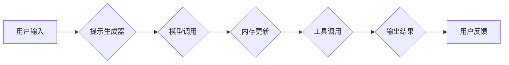

> LangChain, 大语言模型, 应用开发, 链式调用, 应用程序, 编程接口, 数据处理, 自然语言处理

## 1. 背景介绍

近年来，大语言模型（LLM）的快速发展，如GPT-3、LaMDA等，为自然语言处理（NLP）领域带来了革命性的变革。这些模型展现出惊人的文本生成、翻译、摘要等能力，但其直接应用场景仍然有限。 

为了更好地利用LLM的强大能力，并将其应用于更广泛的场景，LangChain应运而生。LangChain是一个开源框架，旨在简化与LLM的交互，并构建更复杂的应用程序。它提供了一套工具和组件，帮助开发者将LLM与其他数据源、工具和服务集成，从而构建更智能、更强大的应用程序。

## 2. 核心概念与联系

LangChain的核心概念是“链式调用”（Chain），它将多个组件串联起来，形成一个完整的应用程序流程。这些组件包括：

* **模型（Model）：** 核心是LLM，负责处理文本输入并生成文本输出。
* **提示（Prompt）：** 用于引导模型生成特定类型的输出的文本指令。
* **内存（Memory）：** 用于存储和管理与对话相关的上下文信息，帮助模型理解对话历史并生成更连贯的回复。
* **工具（Tool）：** 用于扩展模型功能的外部工具，例如搜索引擎、数据库、计算器等。
* ** agentes（Agent）：** 能够自主执行任务的智能实体，它可以根据任务目标选择合适的工具和模型进行调用。

**LangChain 架构流程图**



## 3. 核心算法原理 & 具体操作步骤

### 3.1  算法原理概述

LangChain的核心算法原理是基于Transformer模型的文本生成和链式调用机制。

* **Transformer模型:** Transformer模型是一种深度学习模型，能够有效地处理序列数据，例如文本。它利用注意力机制，能够捕捉文本中不同词语之间的关系，从而生成更准确、更流畅的文本。
* **链式调用机制:** LangChain通过定义一系列组件和它们的调用关系，构建了一个链式调用机制。用户输入经过提示生成器处理，生成模型调用所需的提示信息。模型根据提示信息生成文本输出，并将输出结果与上下文信息一起更新到内存中。内存中的上下文信息可以被后续组件使用，例如工具调用组件。

### 3.2  算法步骤详解

1. **用户输入:** 用户向应用程序输入文本信息。
2. **提示生成:** 提示生成器根据用户输入和上下文信息，生成一个合适的提示信息，用于引导模型生成文本输出。
3. **模型调用:** 模型根据提示信息进行文本生成，并返回生成的文本输出。
4. **内存更新:** 模型生成的文本输出和上下文信息一起更新到内存中。
5. **工具调用:** 如果需要，工具调用组件可以根据任务目标选择合适的工具进行调用，例如搜索引擎、数据库等。
6. **输出结果:** 将最终的输出结果返回给用户。

### 3.3  算法优缺点

**优点:**

* **灵活性和可扩展性:** LangChain提供了一套灵活的组件，可以根据不同的应用场景进行组合和定制。
* **易于使用:** LangChain提供了简洁易用的API，方便开发者快速构建应用程序。
* **强大的功能:** LangChain可以与各种LLM、工具和数据源集成，扩展应用程序的功能。

**缺点:**

* **依赖于LLM:** LangChain的性能和功能依赖于所使用的LLM模型，如果模型能力不足，应用程序的性能也会受到影响。
* **复杂性:** 构建复杂的应用程序可能需要对LangChain框架有深入的理解和掌握。

### 3.4  算法应用领域

LangChain的应用领域非常广泛，包括：

* **聊天机器人:** 构建更智能、更自然的聊天机器人。
* **文本生成:** 自动生成各种类型的文本，例如文章、故事、代码等。
* **问答系统:** 构建能够回答用户问题的问答系统。
* **数据分析:** 利用LLM的文本理解能力，对文本数据进行分析和挖掘。
* **代码生成:** 自动生成代码，提高开发效率。

## 4. 数学模型和公式 & 详细讲解 & 举例说明

### 4.1  数学模型构建

LangChain的核心算法原理基于Transformer模型，其数学模型构建主要包括以下几个方面：

* **词嵌入:** 将每个词语映射到一个低维向量空间中，使得语义相似的词语拥有相似的向量表示。常用的词嵌入方法包括Word2Vec、GloVe等。
* **注意力机制:** 用于捕捉文本中不同词语之间的关系，并赋予不同词语不同的权重。注意力机制的数学公式可以表示为：

$$
Attention(Q, K, V) = softmax(\frac{QK^T}{\sqrt{d_k}})V
$$

其中，Q、K、V分别代表查询矩阵、键矩阵和值矩阵，$d_k$代表键向量的维度。

* **多头注意力:** 将多个注意力机制堆叠在一起，可以捕捉到不同层次的语义关系。

### 4.2  公式推导过程

Transformer模型的具体结构和公式推导过程较为复杂，涉及到大量的矩阵运算和激活函数。这里不再详细展开，可以参考相关论文和书籍进行深入学习。

### 4.3  案例分析与讲解

例如，在文本生成任务中，给定一个文本提示，Transformer模型会根据提示信息和其训练数据中的知识，生成一个符合语法和语义的文本序列。

## 5. 项目实践：代码实例和详细解释说明

### 5.1  开发环境搭建

LangChain的开发环境搭建相对简单，主要需要安装Python和必要的库。

```bash
pip install langchain
```

### 5.2  源代码详细实现

以下是一个简单的LangChain代码示例，演示如何使用LLM生成文本：

```python
from langchain.llms import OpenAI
from langchain.prompts import PromptTemplate

# 初始化LLM模型
llm = OpenAI(temperature=0.7)

# 定义提示模板
template = """
根据以下提示生成一段文本: {text}
"""

# 创建提示对象
prompt = PromptTemplate(template=template, input_variables=["text"])

# 生成文本
response = llm(prompt.format(text="今天天气真好"))

# 打印结果
print(response)
```

### 5.3  代码解读与分析

* **初始化LLM模型:** 使用OpenAI类初始化OpenAI的LLM模型。
* **定义提示模板:** 使用PromptTemplate类定义一个提示模板，其中包含一个占位符{text}，用于输入需要生成的文本内容。
* **创建提示对象:** 使用prompt对象将提示模板和输入文本结合起来，生成最终的提示信息。
* **生成文本:** 使用llm对象调用模型，根据生成的提示信息生成文本输出。
* **打印结果:** 打印模型生成的文本输出。

### 5.4  运行结果展示

运行以上代码，会输出一段根据提示“今天天气真好”生成的文本。

## 6. 实际应用场景

### 6.1  聊天机器人

LangChain可以用于构建更智能、更自然的聊天机器人。例如，可以利用LLM的文本生成能力，让聊天机器人能够进行更流畅、更自然的对话。

### 6.2  文本摘要

LangChain可以用于构建文本摘要应用程序。例如，可以利用LLM的文本理解能力，自动生成文章、文档等文本的摘要。

### 6.3  代码生成

LangChain可以用于构建代码生成应用程序。例如，可以利用LLM的代码理解能力，根据用户描述自动生成相应的代码。

### 6.4  未来应用展望

LangChain的应用场景还在不断扩展，未来可能会应用于更多领域，例如：

* **个性化教育:** 根据学生的学习情况，自动生成个性化的学习内容。
* **医疗诊断:** 利用LLM的文本理解能力，辅助医生进行疾病诊断。
* **法律服务:** 自动生成法律文件，提高法律服务的效率。

## 7. 工具和资源推荐

### 7.1  学习资源推荐

* **LangChain官方文档:** https://python.langchain.com/docs/
* **LangChain GitHub仓库:** https://github.com/langchain-ai/langchain

### 7.2  开发工具推荐

* **Python:** https://www.python.org/
* **Jupyter Notebook:** https://jupyter.org/

### 7.3  相关论文推荐

* **Attention Is All You Need:** https://arxiv.org/abs/1706.03762

## 8. 总结：未来发展趋势与挑战

### 8.1  研究成果总结

LangChain为LLM的应用开发提供了强大的工具和框架，促进了LLM在更多领域应用的普及。

### 8.2  未来发展趋势

未来，LangChain可能会朝着以下方向发展：

* **更强大的模型支持:** 支持更多类型的LLM模型，例如开源模型、轻量级模型等。
* **更丰富的组件库:** 提供更多类型的组件，例如数据处理组件、推理组件等，扩展应用程序的功能。
* **更易于使用的界面:** 提供更直观、更易于使用的界面，降低开发者使用门槛。

### 8.3  面临的挑战

LangChain也面临着一些挑战，例如：

* **模型性能瓶颈:** LLMs的性能仍然有限，可能会影响应用程序的准确性和效率。
* **数据安全和隐私问题:** LLMs的训练数据可能包含敏感信息，需要妥善处理数据安全和隐私问题。
* **伦理问题:** LLMs的应用可能会带来一些伦理问题，例如信息操纵、偏见等，需要引起重视和探讨。

### 8.4  研究展望

未来，LangChain的研究方向可能会包括：

* **开发更强大的LLM模型:** 研究更有效的模型架构和训练方法，提升LLM的性能。
* **解决数据安全和隐私问题:** 研究数据加密、匿名化等技术，保障数据安全和隐私。
* **探讨LLM的伦理问题:** 研究LLM的潜在风险和伦理问题，制定相应的规范和指南。

## 9. 附录：常见问题与解答

### 9.1  Q: LangChain只能使用OpenAI的LLM模型吗？

### 9.2  A: 不，LangChain支持多种LLM模型，包括OpenAI、HuggingFace等。

### 9.3  Q: 如何选择合适的LLM模型？

### 9.4  A: 选择合适的LLM模型需要根据具体的应用场景和需求进行考虑，例如模型的性能、参数量、成本等。

### 9.5  Q: LangChain的学习难度高吗？

### 9.6  A: LangChain的学习难度相对较低，官方文档和社区资源丰富，可以帮助开发者快速上手。


作者：禅与计算机程序设计艺术 / Zen and the Art of Computer Programming 
<end_of_turn>