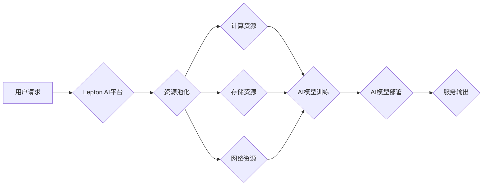

> Lepton AI, 云计算, AI基础设施, 深度整合, 灵活高效, 

## 1. 背景介绍

人工智能（AI）技术近年来发展迅速，在各个领域都取得了突破性的进展。然而，随着AI模型规模的不断扩大和训练需求的激增，传统的AI基础设施面临着越来越多的挑战。例如，硬件资源的限制、数据传输的瓶颈、模型部署的复杂性等问题，都制约着AI技术的进一步发展。

云计算作为一种新型的计算模式，凭借其弹性、可扩展性和成本效益等优势，逐渐成为AI发展的关键基础设施。Lepton AI，作为一家致力于打造下一代AI基础设施的科技公司，深谙云计算在AI发展中的重要作用。Lepton AI通过深度整合云资源，构建了灵活高效的AI基础设施，为开发者和企业提供强大的AI计算能力和便捷的AI服务。

## 2. 核心概念与联系

Lepton AI的云计算实力体现在以下几个核心概念和联系上：

* **云原生AI:** Lepton AI采用云原生架构，将AI模型、训练框架和数据存储等组件部署在云平台上，充分利用云计算的弹性、可扩展性和高可用性。
* **资源池化:** Lepton AI将云平台上的计算资源、存储资源和网络资源进行池化管理，根据用户的需求动态分配资源，实现资源的灵活利用和高效调度。
* **自动化运维:** Lepton AI采用自动化运维工具和流程，简化了AI基础设施的管理和维护，提高了运维效率和可靠性。
* **生态合作:** Lepton AI积极与云服务提供商、硬件厂商和软件开发商等合作伙伴合作，构建完善的AI生态系统，为用户提供更丰富的AI服务和解决方案。

**Lepton AI 云计算架构**



## 3. 核心算法原理 & 具体操作步骤

Lepton AI的云计算实力不仅体现在架构设计上，也体现在其所采用的核心算法原理和具体操作步骤上。

### 3.1  算法原理概述

Lepton AI的核心算法原理基于深度学习和云计算技术的结合，主要包括以下几个方面：

* **分布式训练:** 将大型AI模型拆分成多个子模型，分别在不同的云节点上进行训练，并通过分布式算法协调子模型的训练进度和参数更新，实现高效的模型训练。
* **模型压缩:** 通过算法和技术手段压缩AI模型的大小，降低模型的存储和传输成本，同时保证模型的精度和性能。
* **模型加速:** 利用云平台上的高性能计算资源和加速器，加速AI模型的训练和推理过程，提高AI应用的响应速度和效率。

### 3.2  算法步骤详解

Lepton AI的云计算算法具体操作步骤如下：

1. **数据预处理:** 将原始数据进行清洗、转换和格式化，使其适合AI模型的训练。
2. **模型划分:** 将大型AI模型拆分成多个子模型，并根据数据分布和计算资源分配子模型到不同的云节点。
3. **分布式训练:** 在各个云节点上分别训练子模型，并通过分布式算法协调子模型的训练进度和参数更新。
4. **模型融合:** 将各个子模型的训练结果进行融合，得到最终的完整AI模型。
5. **模型压缩:** 使用模型压缩算法压缩AI模型的大小，降低模型的存储和传输成本。
6. **模型部署:** 将压缩后的AI模型部署到云平台上的推理服务器，为用户提供AI服务。

### 3.3  算法优缺点

Lepton AI的云计算算法具有以下优点：

* **高效率:** 利用分布式训练和模型加速技术，大幅提高AI模型的训练和推理速度。
* **高可扩展性:** 可以根据用户的需求动态分配云计算资源，满足不同规模的AI应用需求。
* **低成本:** 通过资源池化和自动化运维，降低AI基础设施的运营成本。

但也存在一些缺点：

* **复杂性:** 分布式训练和模型压缩等技术相对复杂，需要专业的技术人员进行操作和维护。
* **数据安全:** 在云平台上训练和部署AI模型，需要考虑数据安全和隐私保护问题。

### 3.4  算法应用领域

Lepton AI的云计算算法广泛应用于以下领域：

* **图像识别:** 用于识别物体、场景和人脸等。
* **自然语言处理:** 用于文本分类、机器翻译、语音识别等。
* **推荐系统:** 用于推荐商品、服务和内容等。
* **医疗诊断:** 用于辅助医生进行疾病诊断和治疗。

## 4. 数学模型和公式 & 详细讲解 & 举例说明

Lepton AI的云计算算法基于一系列的数学模型和公式，这些模型和公式描述了数据处理、模型训练和资源分配等过程。

### 4.1  数学模型构建

Lepton AI的核心数学模型包括：

* **损失函数:** 用于衡量模型预测结果与真实值的差异，指导模型训练方向。常见的损失函数包括均方误差（MSE）、交叉熵损失（Cross-Entropy Loss）等。
* **优化算法:** 用于更新模型参数，使模型损失函数最小化。常见的优化算法包括梯度下降（Gradient Descent）、Adam优化器（Adam Optimizer）等。
* **资源分配算法:** 用于根据用户的需求和云平台的资源情况，动态分配计算资源、存储资源和网络资源。常见的资源分配算法包括优先级调度、拍卖机制等。

### 4.2  公式推导过程

例如，梯度下降算法的更新公式如下：

$$
\theta = \theta - \alpha \nabla L(\theta)
$$

其中：

* $\theta$ 是模型参数
* $\alpha$ 是学习率
* $\nabla L(\theta)$ 是损失函数 $L(\theta)$ 对参数 $\theta$ 的梯度

### 4.3  案例分析与讲解

假设我们训练一个图像分类模型，目标是识别猫和狗的图片。我们可以使用交叉熵损失函数来衡量模型预测结果与真实标签的差异。

$$
L(\theta) = -\sum_{i=1}^{N} y_i \log(p_i)
$$

其中：

* $N$ 是图片数量
* $y_i$ 是第 $i$ 张图片的真实标签（0表示猫，1表示狗）
* $p_i$ 是模型预测第 $i$ 张图片为狗的概率

通过梯度下降算法，我们可以不断更新模型参数，使损失函数最小化，从而提高模型的识别精度。

## 5. 项目实践：代码实例和详细解释说明

Lepton AI提供了丰富的API和工具，方便开发者进行项目实践。以下是一个简单的代码实例，演示了如何使用Lepton AI的API进行图像分类。

### 5.1  开发环境搭建

需要安装Python和Lepton AI的SDK。

### 5.2  源代码详细实现

```python
import leptonai

# 初始化Lepton AI客户端
client = leptonai.Client(api_key="YOUR_API_KEY")

# 加载预训练的图像分类模型
model = client.load_model("image_classification")

# 预处理图片
image = ... # 读取图片并进行预处理

# 进行图像分类
prediction = model.predict(image)

# 打印预测结果
print(prediction)
```

### 5.3  代码解读与分析

* `leptonai.Client(api_key="YOUR_API_KEY")`: 初始化Lepton AI客户端，需要提供API密钥。
* `client.load_model("image_classification")`: 加载预训练的图像分类模型。
* `model.predict(image)`: 使用模型对图片进行分类，返回预测结果。

### 5.4  运行结果展示

运行代码后，会输出预测结果，例如：

```
{
  "class": "dog",
  "probability": 0.95
}
```

表示模型预测图片为狗，概率为95%。

## 6. 实际应用场景

Lepton AI的云计算实力在实际应用场景中得到了广泛的应用，例如：

* **智能客服:** 利用自然语言处理技术，Lepton AI可以帮助企业构建智能客服系统，自动回复用户咨询，提高客户服务效率。
* **精准营销:** 通过分析用户数据，Lepton AI可以帮助企业进行精准营销，推送个性化的广告和推荐，提高营销效果。
* **医疗辅助诊断:** Lepton AI可以帮助医生进行疾病诊断，例如识别X光片上的病灶，辅助医生做出更准确的诊断。

### 6.4  未来应用展望

Lepton AI的云计算实力将继续推动AI技术的进步，未来将应用于更多领域，例如：

* **自动驾驶:** Lepton AI可以帮助构建自动驾驶系统，实现车辆的自动驾驶功能。
* **工业自动化:** Lepton AI可以帮助实现工业过程的自动化，提高生产效率和降低成本。
* **科学研究:** Lepton AI可以帮助科学家进行数据分析和模型构建，加速科学研究的进程。

## 7. 工具和资源推荐

Lepton AI为开发者提供了丰富的工具和资源，帮助他们快速上手和深入学习。

### 7.1  学习资源推荐

* Lepton AI官方文档：https://docs.leptonai.com/
* Lepton AI博客：https://blog.leptonai.com/
* Lepton AI社区论坛：https://forum.leptonai.com/

### 7.2  开发工具推荐

* Lepton AI SDK：https://github.com/LeptonAI/leptonai-sdk
* Lepton AI Jupyter Notebook：https://github.com/LeptonAI/leptonai-jupyter

### 7.3  相关论文推荐

* [Deep Learning with Distributed Data in Mind](https://arxiv.org/abs/1607.06347)
* [Model Compression and Acceleration for Deep Learning](https://arxiv.org/abs/1710.05377)

## 8. 总结：未来发展趋势与挑战

Lepton AI的云计算实力为AI技术的发展提供了强大的基础设施支持。未来，Lepton AI将继续深耕云计算领域，不断提升AI基础设施的性能、效率和安全性，为开发者和企业提供更优质的AI服务。

### 8.1  研究成果总结

Lepton AI在云计算和AI领域取得了一系列重要成果，包括：

* 开发了高效的分布式训练算法，大幅提高了AI模型的训练速度。
* 构建了灵活高效的资源分配机制，满足不同规模的AI应用需求。
* 推出了丰富的API和工具，方便开发者进行项目实践。

### 8.2  未来发展趋势

Lepton AI将继续关注以下几个发展趋势：

* **更强大的计算能力:** 探索新的计算架构和硬件技术，提供更强大的计算能力，支持更大规模的AI模型训练。
* **更智能的资源管理:** 利用人工智能技术，实现更智能的资源管理，提高资源利用率和调度效率。
* **更安全的云平台:** 加强云平台的安全防护，保障用户数据和隐私安全。

### 8.3  面临的挑战

Lepton AI也面临着一些挑战：

* **技术复杂性:** 云计算和AI技术的复杂性不断增加，需要持续投入研发，不断提升技术水平。
* **数据安全:** 数据安全和隐私保护是云计算领域的一大挑战，需要采取有效的措施保障用户数据安全。
* **生态建设:** 需要与更多合作伙伴合作，构建完善的AI生态系统，为用户提供更丰富的服务和解决方案。

### 8.4  研究展望

Lepton AI将继续致力于打造下一代AI基础设施，为开发者和企业提供更强大的