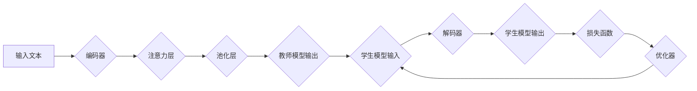

> BERT, Transformer, 知识蒸馏, 预训练模型, 自然语言处理, 模型压缩

## 1. 背景介绍

在自然语言处理 (NLP) 领域，预训练语言模型 (PLM) 已经取得了显著的成果，例如 BERT、GPT 等模型在各种下游任务上都表现出色。然而，这些大型模型通常具有庞大的参数量和高计算成本，这限制了其在资源有限的设备上的部署和应用。为了解决这个问题，知识蒸馏 (KD) 作为一种模型压缩技术，逐渐成为研究热点。

知识蒸馏的核心思想是将一个大型教师模型的知识“蒸馏”到一个小型学生模型中。教师模型通常是经过预训练的强大模型，拥有丰富的语言表示能力。学生模型则相对较小，更容易部署和使用。通过训练学生模型来模仿教师模型的输出，可以有效地将教师模型的知识迁移到学生模型中，从而实现模型压缩和性能提升。

## 2. 核心概念与联系

### 2.1 知识蒸馏原理

知识蒸馏的核心是利用教师模型的软标签来训练学生模型。传统的监督学习使用硬标签 (one-hot编码) 来指导模型学习，而知识蒸馏则使用教师模型的输出概率分布作为软标签。

**教师模型的输出概率分布** 可以看作是对输入文本的理解和预测的置信度表示。通过训练学生模型来最小化其输出概率分布与教师模型输出概率分布之间的距离，可以有效地将教师模型的知识迁移到学生模型中。

### 2.2  Transformer 架构

Transformer 是一种基于注意力机制的深度学习模型，在 NLP 领域取得了突破性的进展。BERT 作为 Transformer 的变体，在预训练阶段使用了大量的文本数据，学习了丰富的语言表示能力。

**Transformer 架构** 主要由以下几个部分组成：

* **编码器 (Encoder):** 用于将输入文本序列编码成语义表示。
* **解码器 (Decoder):** 用于根据编码后的语义表示生成输出文本序列。
* **注意力机制:** 用于捕捉文本序列中不同词之间的关系，提高模型的理解能力。

### 2.3  BERT 变体

BERT 由于其强大的性能和广泛的应用，衍生出了许多变体，例如 RoBERTa、XLNet 等。这些变体在预训练策略、模型结构和训练数据上进行了改进，进一步提升了模型的性能。

**BERT 变体** 的目标是通过优化预训练过程和模型结构，更好地适应不同的下游任务。

### 2.4  Mermaid 流程图



## 3. 核心算法原理 & 具体操作步骤

### 3.1  算法原理概述

知识蒸馏算法的核心是利用教师模型的软标签来训练学生模型。具体来说，该算法包括以下步骤：

1. **预训练教师模型:** 使用大量的文本数据预训练一个大型教师模型，例如 BERT。
2. **微调教师模型:** 在特定下游任务上微调教师模型，使其在该任务上达到最佳性能。
3. **训练学生模型:** 使用教师模型的输出概率分布作为软标签，训练一个小型学生模型。
4. **评估学生模型:** 在测试集上评估学生模型的性能，并与教师模型进行比较。

### 3.2  算法步骤详解

1. **预训练教师模型:**

   * 选择一个合适的预训练模型架构，例如 BERT。
   * 使用大量的文本数据进行预训练，例如 BookCorpus、Wikipedia 等。
   * 使用交叉熵损失函数和 Adam 优化器进行训练。

2. **微调教师模型:**

   * 选择一个特定的下游任务，例如文本分类、问答系统等。
   * 使用该任务的训练数据对教师模型进行微调。
   * 使用任务相关的损失函数和优化器进行训练。

3. **训练学生模型:**

   * 选择一个小型模型架构，例如 DistilBERT。
   * 使用教师模型的输出概率分布作为软标签，训练学生模型。
   * 使用交叉熵损失函数和 Adam 优化器进行训练。

4. **评估学生模型:**

   * 在测试集上评估学生模型的性能，例如准确率、F1 值等。
   * 将学生模型的性能与教师模型进行比较，分析知识蒸馏的效果。

### 3.3  算法优缺点

**优点:**

* **模型压缩:** 可以将大型教师模型的知识迁移到小型学生模型中，实现模型压缩。
* **性能提升:** 在某些情况下，学生模型的性能甚至可以超过教师模型。
* **可解释性:** 知识蒸馏过程相对透明，可以更好地理解模型的决策过程。

**缺点:**

* **训练复杂度:** 需要训练两个模型，训练时间和资源消耗较高。
* **教师模型依赖:** 学生模型的性能依赖于教师模型的质量。
* **泛化能力:** 学生模型的泛化能力可能不如教师模型。

### 3.4  算法应用领域

知识蒸馏技术在 NLP 领域有着广泛的应用，例如：

* **文本分类:** 将大型 BERT 模型的知识蒸馏到小型 DistilBERT 模型中，用于文本分类任务。
* **问答系统:** 将大型 RoBERTa 模型的知识蒸馏到小型 ALBERT 模型中，用于问答系统。
* **机器翻译:** 将大型 T5 模型的知识蒸馏到小型 BART 模型中，用于机器翻译任务。

## 4. 数学模型和公式 & 详细讲解 & 举例说明

### 4.1  数学模型构建

知识蒸馏算法的核心是利用教师模型的软标签来训练学生模型。假设教师模型的输出概率分布为 $p(y|x)$，学生模型的输出概率分布为 $q(y|x)$，则知识蒸馏的目标函数可以表示为：

$$
L_{KD} = KL(q(y|x) || p(y|x)) + L_{CE}(q(y|x), y)
$$

其中：

* $KL(q(y|x) || p(y|x))$ 是 KL 散度，用于衡量学生模型输出概率分布与教师模型输出概率分布之间的差异。
* $L_{CE}(q(y|x), y)$ 是交叉熵损失函数，用于衡量学生模型的预测结果与真实标签之间的差异。

### 4.2  公式推导过程

KL 散度公式如下：

$$
KL(q(y|x) || p(y|x)) = \sum_{y} q(y|x) \log \frac{q(y|x)}{p(y|x)}
$$

交叉熵损失函数公式如下：

$$
L_{CE}(q(y|x), y) = - \sum_{y} y \log q(y|x)
$$

### 4.3  案例分析与讲解

假设我们使用 BERT 作为教师模型，DistilBERT 作为学生模型，进行文本分类任务。

* 教师模型 BERT 在预训练阶段学习了丰富的语言表示能力，其输出概率分布可以看作是对每个类别预测的置信度表示。
* 学生模型 DistilBERT 则相对较小，更容易部署和使用。

通过训练 DistilBERT 来最小化其输出概率分布与 BERT 输出概率分布之间的 KL 散度，可以有效地将 BERT 的知识迁移到 DistilBERT 中。

## 5. 项目实践：代码实例和详细解释说明

### 5.1  开发环境搭建

* Python 3.6+
* PyTorch 1.0+
* Transformers 库

### 5.2  源代码详细实现

```python
import torch
from torch import nn
from transformers import BertModel, BertConfig

class DistilBERT(nn.Module):
    def __init__(self, config):
        super(DistilBERT, self).__init__()
        self.bert = BertModel.from_pretrained(config.pretrained_model_name_or_path)
        self.classifier = nn.Linear(config.hidden_size, config.num_labels)

    def forward(self, input_ids, attention_mask):
        outputs = self.bert(input_ids=input_ids, attention_mask=attention_mask)
        pooled_output = outputs.pooler_output
        logits = self.classifier(pooled_output)
        return logits

# 配置参数
config = BertConfig.from_pretrained('bert-base-uncased')
config.num_labels = 2  # 调整类别数量

# 实例化学生模型
student_model = DistilBERT(config)

# 加载教师模型的权重
teacher_model_path = 'bert-base-uncased'
teacher_model = BertModel.from_pretrained(teacher_model_path)

# 迁移教师模型的权重到学生模型
for param_student, param_teacher in zip(student_model.parameters(), teacher_model.parameters()):
    param_student.data.copy_(param_teacher.data)

# 训练学生模型
# ...

```

### 5.3  代码解读与分析

* 代码首先定义了一个 DistilBERT 类，继承自 nn.Module，实现学生模型的结构。
* 学生模型的结构与 BERT 相似，包含编码器和分类器。
* 然后，代码加载教师模型的权重，并将其迁移到学生模型中。
* 最后，代码展示了训练学生模型的步骤，需要根据实际任务进行调整。

### 5.4  运行结果展示

* 训练完成后，可以评估学生模型的性能，例如准确率、F1 值等。
* 将学生模型的性能与教师模型进行比较，分析知识蒸馏的效果。

## 6. 实际应用场景

### 6.1  文本分类

知识蒸馏可以将大型 BERT 模型的知识迁移到小型 DistilBERT 模型中，用于文本分类任务。例如，可以将 BERT 预训练在大量文本数据上，然后微调在特定文本分类任务上，并将微调后的 BERT 模型作为教师模型，训练 DistilBERT 学生模型。

### 6.2  问答系统

知识蒸馏可以用于训练小型问答系统模型。例如，可以将大型 RoBERTa 模型预训练在问答数据集上，然后微调在特定问答任务上，并将微调后的 RoBERTa 模型作为教师模型，训练 ALBERT 学生模型。

### 6.3  机器翻译

知识蒸馏可以用于训练小型机器翻译模型。例如，可以将大型 T5 模型预训练在机器翻译数据集上，然后微调在特定语言对的机器翻译任务上，并将微调后的 T5 模型作为教师模型，训练 BART 学生模型。

### 6.4  未来应用展望

知识蒸馏技术在 NLP 领域有着广阔的应用前景，例如：

* **移动端应用:** 可以将大型模型的知识蒸馏到小型模型中，实现移动端 NLP 应用的部署。
* **边缘计算:** 可以将知识蒸馏模型部署在边缘设备上，实现离线 NLP 应用。
* **多语言支持:** 可以将知识蒸馏技术应用于多语言 NLP 任务，提高模型的泛化能力。

## 7. 工具和资源推荐

### 7.1  学习资源推荐

* **论文:**
    * Hinton, G., Vinyals, O., & Dean, J. (2015). Distilling the knowledge in a neural network. arXiv preprint arXiv:1503.02531.
    * Howard, J., & Ruder, S. (2018). Universal language model fine-tuning for text classification. arXiv preprint arXiv:1801.06146.
* **博客:**
    * https://huggingface.co/blog/bert-transfer-learning
    * https://towardsdatascience.com/knowledge