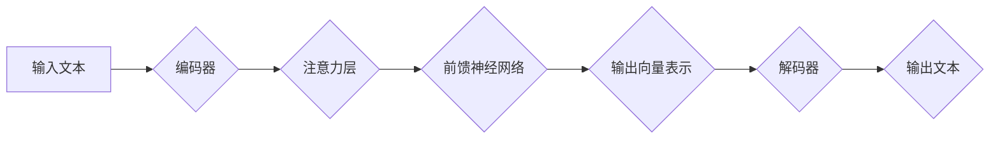

> Transformer, BERT, 自然语言处理, 预训练模型, 中文文本理解, 语言模型

## 1. 背景介绍

近年来，深度学习在自然语言处理 (NLP) 领域取得了突破性进展。其中，Transformer 架构的出现标志着 NLP 领域进入了一个新的时代。Transformer 凭借其强大的并行能力和长距离依赖建模能力，在各种 NLP 任务中都取得了优异的性能，例如机器翻译、文本摘要、问答系统等。

BERT (Bidirectional Encoder Representations from Transformers) 是基于 Transformer 架构的预训练语言模型，由 Google AI 团队开发。BERT 通过在大量的文本数据上进行双向预训练，学习到丰富的语言表示，能够理解上下文信息，从而在各种下游 NLP 任务中表现出色。

中文文本理解一直是 NLP 领域的一个重要挑战。由于中文的复杂性和多样性，传统的 NLP 方法难以有效地处理中文文本。BERT 的出现为中文文本理解提供了新的思路和方法。

## 2. 核心概念与联系

### 2.1 Transformer 架构

Transformer 架构的核心是注意力机制 (Attention Mechanism)，它能够学习到文本中单词之间的关系，并根据这些关系对单词进行加权求和，从而更好地理解上下文信息。

Transformer 架构由以下几个主要部分组成：

* **编码器 (Encoder):** 负责将输入的文本序列编码成一个固定长度的向量表示。
* **解码器 (Decoder):** 负责根据编码器的输出生成目标文本序列。
* **注意力层 (Attention Layer):** 用于学习文本中单词之间的关系。
* **多头注意力 (Multi-Head Attention):** 将注意力机制扩展到多个头，能够学习到更丰富的文本表示。
* **前馈神经网络 (Feed-Forward Network):** 用于对编码器和解码器中的每个单词向量进行非线性变换。

**Mermaid 流程图:**



### 2.2 BERT 模型

BERT 模型基于 Transformer 架构，并采用了双向预训练策略。

BERT 的预训练目标主要有两种：

* **Masked Language Modeling (MLM):** 在输入文本中随机屏蔽一些单词，然后让模型预测屏蔽单词的词语。
* **Next Sentence Prediction (NSP):** 给定两个句子，判断它们是否相邻。

通过这两个预训练任务，BERT 模型能够学习到丰富的语言表示，并理解上下文信息。

## 3. 核心算法原理 & 具体操作步骤

### 3.1 算法原理概述

BERT 模型的核心算法原理是 Transformer 架构和双向预训练策略。

Transformer 架构能够有效地学习文本中单词之间的关系，而双向预训练策略能够让模型更好地理解上下文信息。

### 3.2 算法步骤详解

BERT 模型的训练过程可以分为以下几个步骤：

1. **数据预处理:** 将原始文本数据进行清洗、分词、标记等操作，生成训练数据。
2. **模型初始化:** 初始化 BERT 模型的参数。
3. **预训练:** 使用 MLM 和 NSP 任务对 BERT 模型进行预训练。
4. **下游任务 fine-tuning:** 将预训练好的 BERT 模型用于下游 NLP 任务，例如文本分类、问答系统等，对模型进行微调。

### 3.3 算法优缺点

**优点:**

* 强大的上下文理解能力
* 在各种下游 NLP 任务中表现出色
* 预训练模型可以复用，降低训练成本

**缺点:**

* 训练成本较高
* 模型参数量较大，需要较大的计算资源

### 3.4 算法应用领域

BERT 模型在以下领域有广泛的应用:

* 文本分类
* 问答系统
* 机器翻译
* 文本摘要
* 情感分析
* 语义相似度计算

## 4. 数学模型和公式 & 详细讲解 & 举例说明

### 4.1 数学模型构建

BERT 模型的数学模型主要基于 Transformer 架构，其核心是注意力机制和多头注意力机制。

**注意力机制:**

注意力机制的目的是学习到文本中单词之间的关系，并根据这些关系对单词进行加权求和。

注意力机制的公式如下:

$$
\text{Attention}(Q, K, V) = \text{softmax}\left(\frac{QK^T}{\sqrt{d_k}}\right)V
$$

其中:

* $Q$ 是查询矩阵
* $K$ 是键矩阵
* $V$ 是值矩阵
* $d_k$ 是键向量的维度
* $\text{softmax}$ 是 softmax 函数

**多头注意力机制:**

多头注意力机制将注意力机制扩展到多个头，能够学习到更丰富的文本表示。

多头注意力机制的公式如下:

$$
\text{MultiHeadAttention}(Q, K, V) = \text{Concat}(head_1, head_2, ..., head_h)W^O
$$

其中:

* $head_i$ 是第 $i$ 个注意力头的输出
* $h$ 是注意力头的数量
* $W^O$ 是一个线性变换矩阵

### 4.2 公式推导过程

注意力机制的公式推导过程如下:

1. 计算查询矩阵 $Q$ 和键矩阵 $K$ 的点积。
2. 对点积结果进行归一化，得到注意力权重。
3. 将注意力权重与值矩阵 $V$ 进行加权求和，得到注意力输出。

多头注意力机制的公式推导过程如下:

1. 将查询矩阵 $Q$、键矩阵 $K$ 和值矩阵 $V$ 分别投影到多个头空间。
2. 对每个头空间中的 $Q$、$K$ 和 $V$ 计算注意力权重。
3. 将每个头的注意力输出进行拼接，并进行线性变换，得到最终的多头注意力输出。

### 4.3 案例分析与讲解

假设我们有一个句子 "The cat sat on the mat"，我们使用 BERT 模型对其进行编码。

BERT 模型会将每个单词都编码成一个向量表示，然后通过注意力机制学习到每个单词之间的关系。例如，BERT 模型会学习到 "cat" 和 "sat" 之间的关系，以及 "sat" 和 "on" 之间的关系。

最终，BERT 模型会将整个句子的向量表示输出，这个向量表示包含了句子中所有单词的信息和关系。

## 5. 项目实践：代码实例和详细解释说明

### 5.1 开发环境搭建

为了使用 BERT 模型，我们需要搭建一个开发环境。

开发环境需要包含以下软件:

* Python 3.6+
* TensorFlow 或 PyTorch
* CUDA 和 cuDNN (如果使用 GPU)

### 5.2 源代码详细实现

BERT 模型的源代码可以从 Hugging Face 库中获取。

以下是一个使用 BERT 模型进行文本分类的代码示例:

```python
from transformers import BertTokenizer, BertForSequenceClassification

# 加载预训练模型和分词器
tokenizer = BertTokenizer.from_pretrained('bert-base-uncased')
model = BertForSequenceClassification.from_pretrained('bert-base-uncased', num_labels=2)

# 预处理文本数据
text = "This is a positive sentence."
inputs = tokenizer(text, return_tensors='pt')

# 进行预测
outputs = model(**inputs)
predicted_class = outputs.logits.argmax().item()

# 输出预测结果
print(predicted_class)
```

### 5.3 代码解读与分析

这段代码首先加载了预训练的 BERT 模型和分词器。然后，它对输入文本进行预处理，将文本转换为 BERT 模型可以理解的格式。最后，它使用 BERT 模型进行预测，并输出预测结果。

### 5.4 运行结果展示

运行这段代码后，会输出一个整数，表示预测的文本类别。

## 6. 实际应用场景

BERT 模型在各种实际应用场景中都取得了成功。

例如，BERT 模型可以用于:

* **搜索引擎:** 提高搜索结果的准确性和相关性。
* **聊天机器人:** 理解用户的问题并提供更准确的回复。
* **问答系统:** 回答用户的问题，并提供相关信息。
* **文本摘要:** 自动生成文本摘要。
* **机器翻译:** 将文本从一种语言翻译成另一种语言。

### 6.4 未来应用展望

BERT 模型的未来应用前景非常广阔。

例如，BERT 模型可以用于:

* **个性化推荐:** 根据用户的兴趣和偏好进行个性化推荐。
* **医疗诊断:** 辅助医生进行疾病诊断。
* **法律文本分析:** 分析法律文本，并提供法律建议。
* **代码生成:** 自动生成代码。

## 7. 工具和资源推荐

### 7.1 学习资源推荐

* **BERT 官方论文:** https://arxiv.org/abs/1810.04805
* **Hugging Face BERT 模型库:** https://huggingface.co/transformers/model_doc/bert.html
* **Stanford NLP Group BERT 教程:** https://nlp.stanford.edu/projects/bert/

### 7.2 开发工具推荐

* **TensorFlow:** https://www.tensorflow.org/
* **PyTorch:** https://pytorch.org/
* **Jupyter Notebook:** https://jupyter.org/

### 7.3 相关论文推荐

* **XLNet:** https://arxiv.org/abs/1906.08237
* **RoBERTa:** https://arxiv.org/abs/1907.11692
* **GPT-3:** https://openai.com/blog/gpt-3/

## 8. 总结：未来发展趋势与挑战

### 8.1 研究成果总结

BERT 模型的出现标志着 NLP 领域取得了重大进展。BERT 模型的强大能力和广泛的应用场景，为 NLP 领域的发展提供了新的方向和思路。

### 8.2 未来发展趋势

未来，BERT 模型的发展趋势主要包括:

* **模型规模的扩大:** 随着计算资源的不断发展，BERT 模型的规模将会不断扩大，从而提高模型的性能。
* **模型架构的改进:** 研究人员将会继续改进 BERT 模型的架构，使其更加高效和灵活。
* **多模态学习:** 将 BERT 模型与其他模态数据 (例如图像、音频) 相结合，进行多模态学习。

### 8.3 面临的挑战

BERT 模型也面临着一些挑战:

* **训练成本:** BERT 模型的训练成本较高，需要大量的计算资源。
* **数据偏见:** BERT 模型的训练数据可能存在偏见，从而导致模型的输出结果存在偏差。
* **可解释性:** BERT 模型的内部机制比较复杂，难以解释模型的输出结果。

### 8.4 研究展望

未来，研究人员将会继续研究 BERT 模型的改进和应用，以解决上述挑战，并推动 NLP 领域的发展。

## 9. 附录：常见问题与解答

### 9.1 BERT 模型的预训练数据是什么？

BERT 模型的预训练数据来自 Google 的 BookCorpus 和 Wikipedia 数据集。

### 9.2 BERT 模型的训练方法是什么？

BERT 模型使用 MLM 和 NSP 任务进行预训练。

### 9.3 如何使用 BERT 模型进行下游任务 fine-tuning？

可以使用 Hugging Face 库中的代码示例进行 fine-tuning。

### 9.4 BERT 模型的开源代码在哪里？

BERT 模型的开源代码可以在 Hugging Face 库中找到。

作者：禅与计算机程序设计艺术 / Zen and the Art of Computer Programming


<end_of_turn>