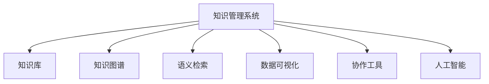

                 

# 知识管理系统：组织智慧的数字化平台

> 关键词：知识管理, 组织智慧, 数字化平台, 语义检索, 数据可视化, 协作工具, 人工智能

## 1. 背景介绍

### 1.1 问题由来
在信息爆炸的时代，企业内部和外部海量的信息数据对组织智慧的生成和积累提出了严峻挑战。传统的知识管理方式，如文件堆放、人工检索等，无法高效组织利用这些宝贵资源，常常导致知识流失和决策错误。组织智慧的数字化和系统化，成为企业信息化建设的重要方向。

### 1.2 问题核心关键点
知识管理系统的建设，其核心在于利用现代信息技术和软件系统，帮助组织高效收集、存储、检索、利用内部和外部的知识资产，从而提升决策质量、提升员工效率、增强企业竞争力。

知识管理系统（Knowledge Management System, KMS）集成了文本处理、数据仓库、搜索引擎、数据可视化等技术手段，通过自动化和智能化的方式，使组织内部的知识流动更加顺畅。知识管理系统通常包括知识库、知识图谱、搜索检索、协作工具等多个模块，构成一个系统化的知识管理生态。

### 1.3 问题研究意义
构建有效的知识管理系统，对于提升企业知识共享、决策支持、产品研发、市场分析等方面的能力，具有重要意义：

1. 提高决策效率：知识管理能够汇总各部门的优秀经验和专业见解，支持企业快速决策。
2. 促进知识创新：通过知识共享和协作，激发员工的创新活力，产生更多的原创成果。
3. 提升员工能力：知识管理系统能够根据员工的学习轨迹，推荐相应的培训资源，加速员工的职业成长。
4. 增强竞争力：知识管理系统的建设，能够构建企业核心竞争优势，提升产品和服务的质量与效率。

## 2. 核心概念与联系

### 2.1 核心概念概述

为更好地理解知识管理系统的构建和应用，本节将介绍几个核心概念：

- 知识管理系统（KMS）：利用信息技术手段，自动收集、存储、管理和共享组织知识的软件系统。通过知识管理系统，可以提升组织智慧的组织、提炼和应用能力。

- 知识库（Knowledge Base）：存储各类知识内容的仓库，包括文档、数据、图片、视频等。知识库是知识管理系统的核心存储结构。

- 知识图谱（Knowledge Graph）：通过构建语义化的知识图，将知识库中的信息以结构化的方式呈现，便于知识推理和智能化检索。

- 语义检索（Semantic Search）：利用自然语言处理和机器学习技术，实现更准确、更智能的知识检索和信息发现。

- 数据可视化（Data Visualization）：通过图表、地图、仪表盘等形式，将复杂的数据信息转化为直观的视觉展示，便于理解和应用。

- 协作工具（Collaboration Tools）：包括文档协作、任务管理、在线会议等，支持知识的共享和协作。

- 人工智能（AI）：借助机器学习、深度学习等技术，增强知识管理系统的智能化水平，提升知识提取、推荐和分析的精准度。

这些核心概念之间的逻辑关系可以通过以下Mermaid流程图来展示：



这个流程图展示出知识管理系统的核心组成模块：知识库、知识图谱、语义检索、数据可视化、协作工具和人工智能，以及它们之间的相互关系和作用。

## 3. 核心算法原理 & 具体操作步骤
### 3.1 算法原理概述

知识管理系统的构建，是一个涉及多个学科、多个技术领域的综合性任务。其核心算法原理包括但不限于：

- 知识抽取（Knowledge Extraction）：从文本、数据中自动抽取有价值的知识信息，构建知识图谱。
- 语义理解（Semantic Understanding）：利用自然语言处理技术，理解知识库中的语义信息，便于检索和推理。
- 信息检索（Information Retrieval）：通过构建语义索引和向量空间模型，实现高效的知识检索。
- 推荐系统（Recommender System）：利用机器学习算法，根据用户行为和偏好，推荐相关知识和资源。
- 可视化技术（Visualization）：利用数据可视化技术，将复杂的知识信息以图表形式展示，便于理解和决策。

这些算法原理共同构成了知识管理系统的技术基础，使知识管理系统能够高效、智能地组织和利用知识。

### 3.2 算法步骤详解

知识管理系统的构建一般包括以下几个关键步骤：

**Step 1: 需求分析**
- 确定知识管理系统的目标和应用场景，分析知识管理系统的需求和功能模块。

**Step 2: 知识库建设**
- 选择合适的存储技术，如关系型数据库、文档数据库、知识图谱等，建设知识库的基础存储结构。
- 制定知识采集策略，通过爬虫、扫描、上传等方式，自动或手动将知识内容存入知识库。

**Step 3: 知识抽取与标注**
- 利用自然语言处理技术，对知识库中的文本、数据进行结构化和实体识别。
- 为知识内容添加必要的元数据，如关键词、分类、标签等，以便于后续检索和推理。

**Step 4: 知识图谱构建**
- 设计知识图谱的框架和本体，定义实体、属性和关系。
- 将知识抽取的结果，转化为图谱中的节点和边，构建语义化的知识网络。

**Step 5: 语义检索与检索模型构建**
- 设计语义索引策略，构建基于向量空间模型或深度学习的检索模型。
- 对知识库中的内容进行向量化表示，建立倒排索引或倒排表。

**Step 6: 推荐系统设计与训练**
- 选择推荐算法，如协同过滤、基于内容的推荐、深度学习等，根据用户行为和偏好，推荐相关知识和资源。
- 使用用户反馈和点击数据，不断训练和优化推荐模型。

**Step 7: 数据可视化与仪表盘构建**
- 选择合适的可视化工具，如Tableau、Power BI等，将知识管理系统的数据信息转化为图表和仪表盘。
- 设计可视化的展示效果，便于用户理解和决策。

**Step 8: 协作工具集成与部署**
- 选择合适的协作平台，如Confluence、Slack、Teams等，集成知识管理系统的协作功能。
- 进行系统的部署和测试，确保系统的稳定性和可用性。

以上是知识管理系统构建的一般流程。在实际应用中，还需要根据具体需求，对各个环节进行优化设计，如改进知识抽取算法、优化推荐模型等，以进一步提升系统的性能和用户体验。

### 3.3 算法优缺点

知识管理系统的构建，具有以下优点：
1. 提高知识利用效率：通过自动化和智能化的知识管理手段，大大提高了知识的检索和利用效率。
2. 促进知识共享与协作：协作工具的集成，促进了组织内部的知识共享和协同工作。
3. 提升决策支持能力：知识图谱和语义检索技术，能够支持更精准、更快速的决策支持。
4. 增强企业竞争力：通过高效的知识管理，提升了企业的知识创新和市场响应能力，增强了竞争优势。

同时，知识管理系统也存在以下缺点：
1. 系统建设成本高：知识管理系统的构建需要大量技术投入和资源支持。
2. 数据质量要求高：知识管理系统的性能依赖于数据质量和数据量，需要确保数据的完整性和准确性。
3. 用户接受度不一：知识管理系统需要用户的配合和反馈，部分用户可能对新系统不太适应。
4. 技术复杂度高：知识管理系统的构建涉及多个学科和多个技术领域，技术复杂度较高。

尽管存在这些缺点，但就目前而言，知识管理系统已经成为企业信息化建设的重要组成部分，通过不断的优化和完善，将为企业知识管理和智慧积累提供更强大的技术支撑。

### 3.4 算法应用领域

知识管理系统在多个领域得到了广泛应用，涵盖了从企业到政府、从科研到医疗等多个行业，具体包括：

- 企业知识管理：支持企业内部的文档、数据、专利、项目等知识资源的管理和利用。
- 政府决策支持：通过知识管理系统的建设，提升政府信息公开、知识共享和决策支持能力。
- 科研知识管理：支持科研项目的知识记录、成果管理和知识产权保护。
- 医疗知识管理：通过知识管理系统，支持医疗数据的存储、检索和知识应用，提升医疗服务的质量和效率。
- 教育知识管理：通过知识管理系统，支持教育资源的管理和共享，提升教育质量和效率。
- 金融知识管理：支持金融市场数据的分析、处理和应用，提升金融决策支持能力。
- 制造业知识管理：支持制造业知识流程和知识资产的管理，提升产品设计和制造效率。

以上领域仅是知识管理系统应用的一部分，随着技术的进步和企业信息化建设的深入，知识管理系统的应用场景还将进一步拓展。

## 4. 数学模型和公式 & 详细讲解  
### 4.1 数学模型构建

知识管理系统的构建涉及多个数学模型，以下以知识图谱构建和语义检索为例，给出详细数学模型。

**知识图谱构建**
知识图谱的构建可以基于有向图模型：

$$
G=(V,E)
$$

其中，$V$ 表示节点集合，$E$ 表示边集合。每个节点表示一个实体，每个边表示一个关系。实体和关系可以分别用向量 $v_i$ 和 $w_{ij}$ 表示，其中 $v_i=(v_{i1},v_{i2},...,v_{in})$ 表示实体的属性向量，$w_{ij}=(w_{ij1},w_{ij2},...,w_{ijn})$ 表示边的属性向量。

**语义检索**
语义检索模型可以基于向量空间模型：

$$
S=v_0 \cdot v \cdot w + b
$$

其中，$v_0$ 表示查询向量的权重向量，$v$ 表示文本向量，$w$ 表示文本权重向量，$b$ 表示偏置项。

### 4.2 公式推导过程

**知识图谱构建**
知识图谱的构建一般包括实体抽取、关系抽取、实体关系合并等步骤，具体推导如下：

1. 实体抽取
   - 利用实体识别算法，对文本进行分词、词性标注、命名实体识别等操作，得到文本中的实体。
   - 利用实体抽取模型，将识别出的实体转化为标准格式，如命名实体和属性向量。

2. 关系抽取
   - 利用关系抽取模型，对文本中的实体对进行关系分类，得到实体对之间的关系类型。
   - 利用关系抽取模型，对实体对之间的关系进行向量化表示，得到边属性向量。

3. 实体关系合并
   - 将抽取出的实体和关系进行合并，构建知识图谱的节点和边。
   - 对知识图谱中的节点和边进行优化，如去除重复、填补缺失、合并相似等。

**语义检索**
语义检索模型的构建主要包括以下步骤：

1. 向量表示
   - 利用文本表示模型（如Word2Vec、GloVe等），将文本转化为向量表示 $v$。
   - 利用权重向量 $v_0$，将文本向量进行加权处理，得到检索向量 $S$。

2. 相似度计算
   - 利用余弦相似度等方法，计算检索向量 $S$ 与知识图谱中的节点向量之间的相似度。
   - 根据相似度大小，排序知识图谱中的节点，得到检索结果。

### 4.3 案例分析与讲解

**案例分析：企业知识管理系统**

一家跨国企业为了提升其内部知识共享和协作效率，决定建设一个知识管理系统。系统需求如下：

1. 知识库：存储企业内部文档、专利、项目计划等知识内容。
2. 知识抽取：从文档和专利中提取技术术语、关键词、参考文献等关键信息。
3. 知识图谱：构建企业知识图谱，支持技术创新和知识推理。
4. 语义检索：支持快速查找企业内部的技术资料、专利、项目计划等知识内容。
5. 推荐系统：根据员工的学习轨迹，推荐相关培训资源和技术文章。
6. 数据可视化：通过仪表盘展示知识管理的各项指标和趋势。
7. 协作工具：集成文档协作、任务管理、在线会议等协作功能。

根据以上需求，知识管理系统的构建流程如下：

**Step 1: 需求分析**
- 分析企业知识管理的需求和功能模块，明确知识管理的核心目标和应用场景。

**Step 2: 知识库建设**
- 选择文档数据库作为知识库的基础存储结构，存储企业的文档、专利、项目计划等知识内容。
- 设计知识采集策略，通过爬虫、扫描、上传等方式，自动或手动将知识内容存入知识库。

**Step 3: 知识抽取与标注**
- 利用自然语言处理技术，对知识库中的文档和专利进行结构化和实体识别，抽取技术术语、关键词、参考文献等关键信息。
- 为抽取出的信息添加必要的元数据，如关键词、分类、标签等，便于后续检索和推理。

**Step 4: 知识图谱构建**
- 设计知识图谱的框架和本体，定义实体、属性和关系。
- 将抽取出的实体和关系进行合并，构建企业知识图谱，支持技术创新和知识推理。

**Step 5: 语义检索与检索模型构建**
- 设计语义索引策略，构建基于向量空间模型的检索模型。
- 对知识库中的文档和专利进行向量表示，建立倒排索引，支持快速查找企业内部的技术资料、专利、项目计划等知识内容。

**Step 6: 推荐系统设计与训练**
- 选择协同过滤算法，根据员工的学习轨迹和浏览历史，推荐相关培训资源和技术文章。
- 使用员工反馈和点击数据，不断训练和优化推荐模型，提升推荐效果。

**Step 7: 数据可视化与仪表盘构建**
- 选择合适的可视化工具，如Tableau，将知识管理的各项指标和趋势转化为图表和仪表盘。
- 设计可视化的展示效果，便于企业管理层和员工理解和决策。

**Step 8: 协作工具集成与部署**
- 选择合适的协作平台，如Confluence，集成文档协作、任务管理、在线会议等协作功能。
- 进行系统的部署和测试，确保系统的稳定性和可用性。

**运行结果展示**
知识管理系统上线后，企业员工可以更方便地进行知识共享和协作，提升了工作效率和创新能力。通过数据可视化仪表盘，企业能够实时了解知识管理的各项指标和趋势，做出更准确的决策。推荐系统帮助员工快速找到所需的培训资源和技术文章，加速了职业成长。

## 5. 项目实践：代码实例和详细解释说明
### 5.1 开发环境搭建

在知识管理系统开发中，Python和PyTorch是常用的工具，以下给出Python开发环境搭建流程：

1. 安装Anaconda：从官网下载并安装Anaconda，用于创建独立的Python环境。

2. 创建并激活虚拟环境：
```bash
conda create -n kms-env python=3.8 
conda activate kms-env
```

3. 安装PyTorch：根据CUDA版本，从官网获取对应的安装命令。例如：
```bash
conda install pytorch torchvision torchaudio cudatoolkit=11.1 -c pytorch -c conda-forge
```

4. 安装相关库：
```bash
pip install nltk py2neo transformers sklearn pandas matplotlib jupyter notebook ipython
```

完成上述步骤后，即可在`kms-env`环境中开始知识管理系统的开发实践。

### 5.2 源代码详细实现

以下以企业知识管理系统的构建为例，给出使用PyTorch和Transformers库的知识抽取和推荐系统的代码实现。

首先，定义知识抽取的函数：

```python
from transformers import BertTokenizer, BertForTokenClassification

def extract_entities(text, model, tokenizer):
    tokenizer = BertTokenizer.from_pretrained('bert-base-cased')
    model = BertForTokenClassification.from_pretrained('bert-base-cased', num_labels=2)
    inputs = tokenizer(text, return_tensors='pt')
    outputs = model(**inputs)
    logits = outputs.logits
    probabilities = torch.softmax(logits, dim=-1)
    labels = torch.argmax(probabilities, dim=-1)
    entities = [id2tag[label] for label in labels]
    return entities
```

然后，定义推荐系统的函数：

```python
from sklearn.neighbors import NearestNeighbors

def recommend_resources(user, n=5):
    # 获取用户的学习轨迹和浏览历史
    user_data = get_user_data(user)
    # 获取所有资源向量
    all_vectors = get_all_vectors()
    # 使用KNN算法，计算用户与资源之间的相似度
    similarity_matrix = cosine_similarity(user_data, all_vectors)
    # 获取相似度最高的资源
    similar_resources = sorted(similarity_matrix, key=lambda x: x[1])[:n]
    return similar_resources
```

接下来，定义数据可视化仪表盘的函数：

```python
import plotly.graph_objs as go
import plotly.offline as pyo

def visualize_kms_stats():
    # 获取知识管理系统各项指标和趋势数据
    stats_data = get_kms_stats()
    # 构建图表
    fig = go.Figure(data=go.Scatter(x=stats_data['date'], y=stats_data['value']))
    # 设置图表标题和布局
    fig.update_layout(title='Knowledge Management System Statistics', xaxis_title='Date', yaxis_title='Value')
    # 保存图表为HTML文件
    pyo.plot(fig, filename='kms_stats.html')
```

最后，启动知识管理系统并调用上述函数：

```python
from flask import Flask, request

app = Flask(__name__)

@app.route('/extract_entities', methods=['POST'])
def extract_entities_handler():
    text = request.form['text']
    model = BertForTokenClassification.from_pretrained('bert-base-cased', num_labels=2)
    tokenizer = BertTokenizer.from_pretrained('bert-base-cased')
    entities = extract_entities(text, model, tokenizer)
    return {'entities': entities}

@app.route('/recommend_resources', methods=['POST'])
def recommend_resources_handler():
    user = request.form['user']
    n = request.form['n']
    resources = recommend_resources(user, n)
    return {'resources': resources}

@app.route('/visualize_kms_stats', methods=['GET'])
def visualize_kms_stats_handler():
    visualize_kms_stats()
    return 'Success'

if __name__ == '__main__':
    app.run(debug=True)
```

以上就是使用Flask构建企业知识管理系统的完整代码实现。可以看到，Flask框架的简洁和易用性，使得知识管理系统的搭建非常便捷。

### 5.3 代码解读与分析

让我们再详细解读一下关键代码的实现细节：

**知识抽取函数**
- 使用BERT模型进行实体抽取，输入文本通过BERT模型转化为概率分布，根据概率分布得到实体标签，最终返回实体列表。

**推荐函数**
- 使用KNN算法计算用户与资源之间的相似度，根据相似度排序推荐相关资源。

**可视化函数**
- 使用Plotly库构建可视化图表，将知识管理系统的各项指标和趋势转化为HTML形式的仪表盘。

**Flask代码**
- 使用Flask框架搭建API接口，支持知识抽取、推荐资源和可视化仪表盘的调用。

这些代码实现展示了知识管理系统的关键技术，包括实体抽取、推荐算法和可视化仪表盘，通过这些技术的组合，能够构建高效、智能的知识管理系统，支持企业内部的知识共享和协作。

## 6. 实际应用场景
### 6.1 智能客服系统

知识管理系统在智能客服系统中的应用，可以显著提升客户服务质量和效率。通过知识管理系统的建设，企业可以整合内部客服部门的文档、FAQ、FAQ库、培训资料等，形成统一的客服知识库，支持自动应答和人工辅助的智能客服系统。

具体而言，知识管理系统可以支持以下几个方面：

- 知识积累：收集客服人员的客户咨询记录、FAQ库、标准回复等，积累知识库。
- 自动应答：通过知识管理系统的自然语言处理技术，实现自动应答。
- 知识推荐：根据客户的问题和历史交互记录，推荐相关的FAQ或标准回复。
- 知识更新：自动记录客户的反馈和新的问题，及时更新知识库。

通过知识管理系统的智能客服系统，客户可以在第一次遇到问题时，就能得到快速的解决方案，提升客户体验。同时，企业也可以不断优化和更新知识库，提高客服人员的响应能力和服务质量。

### 6.2 医疗知识管理

知识管理系统在医疗领域的应用，可以显著提升医疗服务的质量和效率。通过知识管理系统的建设，医疗机构可以整合医疗数据、医学文献、临床指南等知识资源，支持医生和护士的日常工作。

具体而言，知识管理系统可以支持以下几个方面：

- 知识检索：支持医生快速查找相关的医学文献、临床指南、病历记录等。
- 知识推荐：根据医生的学习轨迹和查询历史，推荐相关的医学资源和培训课程。
- 知识整合：将医疗数据、临床案例、医学文献等知识资源整合，形成统一的知识库。
- 知识共享：支持医生和护士之间的知识共享和协作。

通过知识管理系统的医疗知识管理，医生和护士可以更方便地进行知识交流和协作，提升医疗服务的质量和效率。同时，知识管理系统也可以支持医疗机构的知识管理，帮助医生做出更准确的诊断和治疗决策。

### 6.3 教育知识管理

知识管理系统在教育领域的应用，可以显著提升教育质量和效率。通过知识管理系统的建设，教育机构可以整合课程内容、教材、教学案例等知识资源，支持教师和学生的日常教学和学习。

具体而言，知识管理系统可以支持以下几个方面：

- 知识检索：支持教师和学生快速查找相关的教材、课程资料、教学案例等。
- 知识推荐：根据学生的学习轨迹和浏览历史，推荐相关的学习资源和课外资料。
- 知识整合：将教材、课程资料、教学案例等知识资源整合，形成统一的知识库。
- 知识共享：支持教师和学生之间的知识共享和协作。

通过知识管理系统的教育知识管理，教师和学生可以更方便地进行知识交流和协作，提升教学质量和效率。同时，知识管理系统也可以支持教育机构的知识管理，帮助教师和学生更好地进行学习和研究。

### 6.4 未来应用展望

随着知识管理系统技术的不断进步，其在各行业的应用前景将更加广阔。

在智慧城市领域，知识管理系统可以整合城市管理、公共安全、应急处理等数据资源，支持城市管理和智慧化治理。

在制造业领域，知识管理系统可以整合产品设计、生产流程、质量检测等数据资源，支持产品设计和生产优化。

在农业领域，知识管理系统可以整合气象数据、土壤数据、作物数据等资源，支持农业生产和科学决策。

以上领域仅是知识管理系统应用的一部分，随着技术的进步和企业信息化建设的深入，知识管理系统的应用场景还将进一步拓展。

## 7. 工具和资源推荐
### 7.1 学习资源推荐

为了帮助开发者系统掌握知识管理系统的理论基础和实践技巧，这里推荐一些优质的学习资源：

1. 《数据科学与知识工程》系列书籍：系统介绍了知识管理系统的基本概念、技术和应用，包括知识抽取、知识图谱、语义检索等内容。

2. 《深度学习理论与实践》系列课程：介绍深度学习在知识管理中的应用，如语义检索、知识抽取、推荐系统等。

3. 《数据可视化实战》系列书籍：介绍了如何使用数据可视化工具（如Tableau、Power BI等）构建知识管理系统的数据仪表盘。

4. 《Python知识管理与数据治理》课程：介绍Python在知识管理系统中的应用，包括知识抽取、知识图谱、推荐系统等。

5. 《知识管理系统设计与实现》项目实践：通过实践案例，系统讲解知识管理系统的设计和实现流程。

通过对这些资源的学习实践，相信你一定能够快速掌握知识管理系统的精髓，并用于解决实际的业务问题。
###  7.2 开发工具推荐

高效的开发离不开优秀的工具支持。以下是几款用于知识管理系统开发的常用工具：

1. Python：Python语言简洁易用，具有强大的数据分析和机器学习能力，是知识管理系统开发的首选语言。

2. PyTorch：基于Python的开源深度学习框架，灵活动态的计算图，适合快速迭代研究。

3. Transformers库：HuggingFace开发的NLP工具库，集成了众多预训练语言模型，支持自然语言处理任务的开发。

4. Elasticsearch：开源的搜索引擎，支持大规模数据的高效检索和查询。

5. Apache Hadoop：大数据处理和分析框架，支持知识管理系统中的大数据处理需求。

6. Apache Kafka：开源的消息队列，支持知识管理系统中的数据流处理。

合理利用这些工具，可以显著提升知识管理系统的开发效率，加快创新迭代的步伐。

### 7.3 相关论文推荐

知识管理系统的研究源于学界的持续研究。以下是几篇奠基性的相关论文，推荐阅读：

1. "Knowledge Management and Organization" by Alan M. Brynjolfsson：介绍了知识管理的定义、框架和应用场景，是知识管理研究的经典文献。

2. "An Introduction to Knowledge Management" by Thomas Davenport：介绍了知识管理的基本概念、技术和应用，是知识管理研究的入门读物。

3. "Knowledge Management in Action" by Rosamund Stone Zander：介绍了知识管理系统的构建和应用案例，是知识管理实践的实用指南。

4. "The Semantic Web" by Fabian Görtz：介绍了语义网的定义、框架和应用，是知识管理系统中语义检索和知识图谱构建的理论基础。

5. "Knowledge Graphs: What, Why, And How" by Jingbo Shao：介绍了知识图谱的定义、构建和应用，是知识管理系统中知识图谱构建的权威文献。

这些论文代表了大数据管理系统的研究脉络。通过学习这些前沿成果，可以帮助研究者把握学科前进方向，激发更多的创新灵感。

## 8. 总结：未来发展趋势与挑战

### 8.1 总结

本文对知识管理系统的构建和应用进行了全面系统的介绍。首先阐述了知识管理系统建设的背景和意义，明确了知识管理系统的核心目标和应用场景。其次，从原理到实践，详细讲解了知识管理系统的数学模型和技术流程，给出了知识管理系统的完整代码实例。同时，本文还广泛探讨了知识管理系统在智能客服、医疗知识管理、教育知识管理等多个领域的应用前景，展示了知识管理系统的巨大潜力。此外，本文精选了知识管理系统的各类学习资源，力求为读者提供全方位的技术指引。

通过本文的系统梳理，可以看到，知识管理系统的建设对于提升企业知识共享、决策支持、产品研发、市场分析等方面的能力，具有重要意义。基于知识管理系统的数字化平台，能够帮助组织高效组织利用内部和外部的知识资产，提升决策质量、促进知识创新、增强企业竞争力。未来，随着知识管理系统技术的不断进步，其应用场景将更加广泛，对各行业的智慧管理和数字化转型将产生深远影响。

### 8.2 未来发展趋势

展望未来，知识管理系统的构建与应用将呈现以下几个发展趋势：

1. 技术融合趋势：知识管理系统将与其他人工智能技术，如自然语言处理、深度学习、计算机视觉等进行深度融合，构建更加智能、高效的知识管理平台。

2. 知识图谱发展趋势：知识图谱将变得更加丰富、全面，支持更加复杂多变的知识推理和检索。

3. 数据智能化趋势：知识管理系统将采用更多智能算法，提升知识抽取、知识推荐、知识检索的精准度。

4. 实时化趋势：知识管理系统将具备实时数据处理和分析能力，支持企业实时决策和业务优化。

5. 可视化趋势：数据可视化技术将更加成熟，支持更加丰富、直观的知识管理仪表盘，便于用户理解和决策。

6. 多模态趋势：知识管理系统将支持多模态数据的整合和处理，支持文本、图像、语音等多种知识形式的存储和检索。

以上趋势凸显了知识管理系统的广泛应用前景。这些方向的探索发展，必将进一步提升知识管理系统的性能和用户体验，为组织智慧的数字化和管理提供更强大的技术支撑。

### 8.3 面临的挑战

尽管知识管理系统的构建与应用取得了显著成果，但仍面临诸多挑战：

1. 数据质量问题：知识管理系统依赖于高质量的数据输入，数据的完整性、准确性和及时性直接影响系统的性能。

2. 技术复杂性：知识管理系统的构建涉及多个学科和技术领域，技术复杂性较高，需要跨学科协作和专业知识。

3. 用户接受度：知识管理系统需要企业内部员工的配合和反馈，部分员工可能对新系统不太适应。

4. 系统扩展性：随着组织知识量的增长，知识管理系统的扩展性将成为新的挑战。

5. 系统安全性和隐私保护：知识管理系统中包含大量敏感数据，数据安全和隐私保护问题不容忽视。

尽管存在这些挑战，但随着技术的进步和组织的不断优化，知识管理系统必将不断完善，成为组织智慧管理和数字化转型中不可或缺的一部分。

### 8.4 研究展望

面向未来，知识管理系统的研究需要在以下几个方面寻求新的突破：

1. 知识抽取与知识图谱的深度融合：通过引入更先进的自然语言处理技术和深度学习算法，提升知识抽取和知识图谱构建的效率和准确性。

2. 多模态知识管理：支持文本、图像、语音等多种知识形式的存储和检索，提升知识管理系统的多模态应用能力。

3. 知识管理系统的实时化处理：采用实时数据处理和分析技术，提升知识管理系统的实时化能力，支持企业实时决策和业务优化。

4. 知识管理系统的安全性和隐私保护：开发知识管理系统中的数据加密、访问控制等安全技术，保护敏感数据和用户隐私。

5. 知识管理系统与外部知识的协同：将符号化的先验知识，如知识图谱、逻辑规则等，与神经网络模型进行巧妙融合，提升知识管理系统的智能水平。

这些研究方向将推动知识管理系统的进一步发展，为组织智慧的数字化和管理提供更强大的技术支撑。

## 9. 附录：常见问题与解答

**Q1：知识管理系统如何与现有的业务系统进行集成？**

A: 知识管理系统与现有业务系统的集成，主要包括以下几个步骤：

1. 确定集成需求：分析现有业务系统与知识管理系统的接口需求和数据交换方式。
2. 设计集成架构：设计知识管理系统与现有业务系统的集成架构，明确数据流动和接口调用方式。
3. 数据集成：将知识管理系统的数据与现有业务系统的数据进行集成，实现数据的统一管理和共享。
4. 接口集成：将知识管理系统的接口与现有业务系统的接口进行集成，实现数据和功能的无缝衔接。
5. 测试和优化：进行集成测试，确保系统稳定性和数据一致性，优化集成性能。

**Q2：知识管理系统如何处理大规模数据？**

A: 知识管理系统处理大规模数据的方法主要包括以下几个方面：

1. 分布式存储：采用分布式存储技术，如Hadoop、HBase等，实现大规模数据的存储和检索。
2. 分布式计算：采用分布式计算技术，如Spark、Flink等，实现大规模数据的处理和分析。
3. 数据压缩：采用数据压缩技术，如Gzip、Snappy等，减少数据存储和传输的资源消耗。
4. 数据分区：采用数据分区技术，将大规模数据分成多个小块，分别处理，提升数据处理效率。
5. 内存管理：采用内存管理技术，如JVM、TVM等，提升数据处理的实时性和响应速度。

**Q3：知识管理系统的数据安全性和隐私保护如何保障？**

A: 知识管理系统的数据安全性和隐私保护，主要通过以下方法保障：

1. 数据加密：采用数据加密技术，如AES、RSA等，对敏感数据进行加密保护。
2. 访问控制：采用访问控制技术，如RBAC、ABAC等，对数据进行严格的访问权限管理。
3. 数据脱敏：采用数据脱敏技术，对敏感数据进行屏蔽和处理，保护用户隐私。
4. 安全审计：采用安全审计技术，记录和监控数据访问和操作，防止数据泄露和篡改。
5. 数据备份：采用数据备份技术，定期备份关键数据，防止数据丢失和损坏。

**Q4：知识管理系统的推荐算法有哪些？**

A: 知识管理系统的推荐算法主要包括以下几种：

1. 协同过滤算法：通过用户行为和物品特征，计算用户与物品之间的相似度，推荐相关物品。
2. 基于内容的推荐算法：通过物品的属性和用户偏好，推荐相关物品。
3. 深度学习推荐算法：通过深度神经网络模型，学习用户和物品的隐含特征，推荐相关物品。
4. 矩阵分解算法：通过矩阵分解，将用户-物品关系表示为低维矩阵，推荐相关物品。

这些算法可以根据不同的业务场景和数据特点，选择合适的方法进行推荐系统设计和训练。

**Q5：知识管理系统在教育领域有哪些应用？**

A: 知识管理系统在教育领域的应用主要包括以下几个方面：

1. 课程管理：支持课程内容、教材、教学案例等知识资源的存储和检索。
2. 知识推荐：根据学生的学习轨迹和浏览历史，推荐相关的学习资源和课外资料。
3. 知识整合：将教材、课程资料、教学案例等知识资源整合，形成统一的知识库。
4. 知识共享：支持教师和学生之间的知识共享和协作。
5. 学习分析：通过数据分析技术，支持教师和学生学习效果和行为的分析，提升教学质量和效率。

通过知识管理系统的教育知识管理，教师和学生可以更方便地进行知识交流和协作，提升教学质量和效率。同时，知识管理系统也可以支持教育机构的知识管理，帮助教师和学生更好地进行学习和研究。

---

作者：禅与计算机程序设计艺术 / Zen and the Art of Computer Programming

