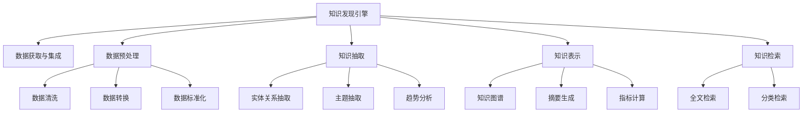

                 

# 知识管理解决方案：知识发现引擎的商业化应用

> 关键词：知识发现, 数据挖掘, 商业智能, 商业化应用, 机器学习, 自然语言处理(NLP), 信息检索

## 1. 背景介绍

### 1.1 问题由来

在知识密集型的现代企业中，数据和信息已经成为了企业竞争力的关键因素。然而，数据规模的爆炸性增长和数据的多样性，使得企业对于知识的有效管理和应用面临着前所未有的挑战。传统的知识管理方式往往依赖于人工整理和归档，效率低下且难以满足日益增长的信息需求。

随着大数据、人工智能技术的迅猛发展，知识发现引擎成为应对这一挑战的重要解决方案。通过使用数据挖掘、机器学习等技术手段，可以从海量数据中挖掘出有价值的知识，帮助企业更高效地利用数据资源，提升决策质量和业务效率。

### 1.2 问题核心关键点

知识发现引擎的核心目标是从原始数据中识别、提炼和呈现知识，以支持企业的战略决策、业务运营和知识共享。实现这一目标的关键点包括：

- **数据获取与集成**：高效采集、整合来自不同来源、不同格式的数据，包括结构化和非结构化数据。
- **数据预处理**：清洗、转换和标准化数据，以便进行后续的分析和挖掘。
- **知识抽取**：从数据中提取有价值的信息和模式，例如实体关系、主题、趋势等。
- **知识表示**：将抽取的知识组织成易于理解和应用的形式，如知识图谱、摘要、指标等。
- **知识检索**：通过高效的信息检索技术，快速响应用户的信息查询需求。

这些关键点相互依存，共同构成了知识发现引擎的完整体系。

### 1.3 问题研究意义

开发知识发现引擎，对于提升企业的数据利用效率、优化决策过程、促进知识共享和创新具有重要意义：

1. **提升数据利用效率**：通过自动化地发现和提炼知识，减少人工处理的数据量，加快数据洞察的速度。
2. **优化决策过程**：基于深入的知识洞察，辅助企业做出更为科学合理的商业决策。
3. **促进知识共享**：构建知识共享平台，使知识得以在企业内部流动，提升团队协作效率。
4. **激发创新**：从大量数据中挖掘出潜在的商业机会，加速产品和服务的创新迭代。

## 2. 核心概念与联系

### 2.1 核心概念概述

为了更好地理解知识发现引擎的原理和架构，本节将介绍几个关键概念：

- **知识发现(Knowledge Discovery, KDD)**：通过数据挖掘、机器学习等技术手段，从原始数据中识别、提炼和呈现知识。
- **数据挖掘(Data Mining)**：从数据集中发现规律和知识的过程，包括分类、聚类、关联规则挖掘等。
- **商业智能(Business Intelligence, BI)**：利用数据、信息和知识支持企业决策，帮助提升企业的运营效率和竞争力。
- **商业化应用(Business Application)**：将技术成果转化为实际商业应用的过程，包括用户界面设计、系统集成、数据治理等。
- **机器学习(Machine Learning, ML)**：让计算机从数据中学习，识别规律并做出预测或决策的技术。
- **自然语言处理(Natural Language Processing, NLP)**：让计算机理解、处理和生成人类语言的技术。
- **信息检索(Information Retrieval, IR)**：从大量信息中高效检索出用户需要的信息，包括全文检索、分类检索等。

这些概念之间的逻辑关系可以通过以下Mermaid流程图来展示：



这个流程图展示出了知识发现引擎的核心组件和关键流程：

1. 知识发现引擎接收多源数据，进行数据集成和预处理。
2. 通过各种机器学习算法，从数据中抽取实体关系、主题、趋势等知识。
3. 将抽取的知识以知识图谱、摘要、指标等形式表示。
4. 提供信息检索功能，满足用户的信息查询需求。

这些核心组件和流程共同构成了知识发现引擎的技术框架，使其能够高效地从数据中挖掘出有价值的知识。

## 3. 核心算法原理 & 具体操作步骤

### 3.1 算法原理概述

知识发现引擎的核心算法原理主要涉及数据挖掘、机器学习和信息检索等领域。其核心思想是通过自动化地分析和挖掘数据，识别出潜在的知识模式，并将其表示为易于理解和应用的形式。

具体而言，知识发现引擎通常包括以下几个步骤：

1. **数据采集与集成**：从多个数据源中收集数据，进行格式转换和合并，构建统一的数据仓库。
2. **数据预处理**：清洗数据，处理缺失值、异常值等噪声，进行特征选择和数据转换。
3. **特征抽取与选择**：利用降维、聚类、关联规则挖掘等技术，抽取特征并选择合适的特征集。
4. **模型训练与预测**：使用分类、回归、聚类等机器学习算法，训练模型并进行预测。
5. **知识表示与存储**：将模型训练出的知识以知识图谱、摘要、指标等形式进行表示和存储。
6. **信息检索与展示**：通过高效的信息检索技术，快速响应用户的信息查询需求，并提供可视化展示。

### 3.2 算法步骤详解

以下将详细阐述知识发现引擎的核心算法步骤和具体操作步骤：

**Step 1: 数据采集与集成**

知识发现引擎的第一步是从多个数据源中收集数据。常见的数据源包括数据库、日志文件、社交媒体、网络爬虫等。

- 数据库数据：通过数据库连接器采集结构化数据。
- 日志文件：解析日志文件格式，提取时间戳、事件类型、用户ID等信息。
- 社交媒体数据：通过API接口爬取社交媒体平台上的公开数据，如Twitter、Facebook等。
- 网络爬虫数据：使用爬虫工具抓取网页内容，提取文本、图片、视频等非结构化数据。

在数据采集阶段，需要确保数据源的稳定性和可靠性，避免因数据中断或格式不一致导致的数据丢失或错误。

**Step 2: 数据预处理**

数据预处理是知识发现引擎的重要步骤，主要包括数据清洗、特征选择和数据转换。

- **数据清洗**：去除重复、缺失、异常的数据，处理数据一致性问题，确保数据质量。
- **特征选择**：选择对问题有用的特征，去除无关或冗余的特征，提高模型的性能和效率。
- **数据转换**：对数据进行标准化、归一化、编码等处理，使其适合后续的分析和挖掘。

在数据预处理过程中，可以使用Python等编程语言配合Pandas、NumPy等库进行数据处理。

**Step 3: 特征抽取与选择**

特征抽取与选择是知识发现引擎的核心技术之一。通过特征抽取和选择，可以从原始数据中提取出对问题有用的信息，减少模型的复杂度。

- **降维**：通过主成分分析(PCA)、线性判别分析(LDA)等技术，将高维数据转换为低维数据，减少计算复杂度。
- **聚类**：使用K-Means、层次聚类等算法，对数据进行分组，发现数据中的内在结构。
- **关联规则挖掘**：利用Apriori、FP-Growth等算法，挖掘数据中的关联规则，发现数据之间的潜在关系。

在特征抽取与选择过程中，需要根据具体问题和数据特点选择合适的算法和参数。

**Step 4: 模型训练与预测**

模型训练与预测是知识发现引擎的核心技术之一。通过训练模型并进行预测，可以实现从数据中提取知识的目的。

- **分类**：使用决策树、随机森林、支持向量机(SVM)等算法，将数据分为不同的类别。
- **回归**：使用线性回归、岭回归、弹性网络等算法，预测连续变量的值。
- **聚类**：使用K-Means、层次聚类等算法，将数据分为不同的群组。

在模型训练与预测过程中，需要使用交叉验证、正则化等技术手段，避免过拟合和欠拟合的问题。

**Step 5: 知识表示与存储**

知识表示与存储是知识发现引擎的重要环节，通过将知识表示为易于理解和应用的形式，方便后续的检索和使用。

- **知识图谱**：使用图数据库存储实体、关系和属性，构建知识图谱，支持图形查询和推理。
- **摘要生成**：使用NLP技术，将文本数据转换为简短摘要，方便用户阅读和理解。
- **指标计算**：根据业务需求，计算关键指标，如用户活跃度、销售额等。

在知识表示与存储过程中，需要考虑知识表示的语义一致性和可解释性，确保知识能够被用户理解和应用。

**Step 6: 信息检索与展示**

信息检索与展示是知识发现引擎的最终环节，通过高效的信息检索技术，快速响应用户的信息查询需求，并提供可视化展示。

- **全文检索**：使用Elasticsearch、Solr等搜索引擎，快速检索文本数据中的关键词和短语。
- **分类检索**：使用分类算法，将数据分为不同的类别，支持快速检索特定类别的数据。

在信息检索与展示过程中，需要考虑用户界面的友好性和响应速度，确保用户能够高效地获取所需信息。

### 3.3 算法优缺点

知识发现引擎具有以下优点：

- **自动化程度高**：自动化地从数据中发现知识，减少人工处理的工作量。
- **灵活性高**：适用于多种数据类型和业务场景，具有较高的通用性。
- **性能稳定**：通过多层次、多角度的分析，能够提供较为准确的知识洞察。

同时，知识发现引擎也存在以下缺点：

- **数据质量依赖性强**：知识发现的结果高度依赖于数据的质量和完整性，数据噪声和缺失会影响结果的准确性。
- **算法复杂度高**：部分算法（如深度学习、知识图谱等）的复杂度较高，需要较高的计算资源和专业知识。
- **结果解释性差**：部分算法的输出结果难以解释，需要结合业务知识进行人工验证。

尽管存在这些缺点，知识发现引擎在知识密集型企业中的应用前景仍然非常广阔，其自动化、灵活性和高性能等特点，能够为企业提供强大的知识支撑。

### 3.4 算法应用领域

知识发现引擎已经在多个行业领域得到广泛应用，包括但不限于：

- **金融**：通过分析交易数据、客户行为数据，识别潜在的投资机会和风险。
- **医疗**：通过分析患者数据、医学文献，发现疾病诊断和治疗的新方法。
- **零售**：通过分析销售数据、客户反馈，优化库存管理和营销策略。
- **电商**：通过分析用户行为数据，推荐个性化商品和服务，提升用户体验和销售额。
- **政府**：通过分析公共数据、社交媒体数据，预测和应对社会热点事件，提升公共治理能力。

这些行业领域的应用，展示了知识发现引擎的强大潜力和广泛适用性。

## 4. 数学模型和公式 & 详细讲解 & 举例说明

### 4.1 数学模型构建

为了更好地理解知识发现引擎的数学原理，本节将介绍几个常用的数学模型和算法。

- **主成分分析(PCA)**：用于降维，将高维数据转换为低维数据，保留主要的信息。

  数学公式：
  $$
  X_{new} = WX_{old}
  $$
  其中 $W$ 为权重矩阵， $X_{old}$ 为原始数据， $X_{new}$ 为降维后的数据。

- **K-Means聚类**：用于聚类，将数据分为若干个群组。

  数学公式：
  $$
  \min_{C,\mu} \sum_{i=1}^k \sum_{x \in C_i} ||x - \mu_i||^2
  $$
  其中 $C$ 为聚类结果， $\mu_i$ 为聚类中心， $k$ 为聚类数目。

- **决策树**：用于分类，将数据分为不同的类别。

  数学公式：
  $$
  T = \sum_{i=1}^n p_i * \log(\frac{p_i}{1-p_i})
  $$
  其中 $T$ 为信息熵， $p_i$ 为每个类别的概率。

- **支持向量机(SVM)**：用于分类和回归，通过最大化边界（或最小化间隔）来构建分类（或回归）模型。

  数学公式：
  $$
  \min_{\omega,b,\lambda} \frac{1}{2}\|\omega\|^2 + \lambda \sum_{i=1}^n L(y_i,\omega^T\phi(x_i) + b)
  $$
  其中 $\omega$ 为权重向量， $b$ 为偏置项， $L$ 为损失函数。

### 4.2 公式推导过程

以下将详细推导PCA和K-Means算法的公式。

**PCA公式推导**：

PCA的核心思想是通过找到数据的主成分（Principal Component），将高维数据转换为低维数据。设原始数据矩阵为 $X_{old} \in \mathbb{R}^{n \times m}$，其中 $n$ 为样本数， $m$ 为特征数。

假设 $X_{old}$ 的前 $k$ 个主成分的权重向量为 $W \in \mathbb{R}^{m \times k}$，则降维后的数据 $X_{new} \in \mathbb{R}^{n \times k}$ 可表示为：

$$
X_{new} = W^T X_{old}
$$

其中 $W^T$ 为权重矩阵 $W$ 的转置。

**K-Means公式推导**：

K-Means算法通过最小化簇内点与聚类中心之间的平方距离，实现数据的聚类。设原始数据集为 $X \in \mathbb{R}^{n \times m}$，其中 $n$ 为样本数， $m$ 为特征数， $k$ 为聚类数目。

K-Means算法的目标函数为：

$$
\min_{C,\mu} \sum_{i=1}^k \sum_{x \in C_i} ||x - \mu_i||^2
$$

其中 $C = \{C_1, C_2, ..., C_k\}$ 为聚类结果， $\mu_i$ 为聚类中心。

K-Means算法通过迭代更新聚类中心和聚类结果，最小化目标函数，最终得到聚类结果。

### 4.3 案例分析与讲解

**案例1: 股票市场预测**

假设有一家金融公司，需要预测股票市场的走势。公司收集了大量的交易数据、财务报表和新闻数据，利用知识发现引擎进行分析和挖掘。

1. **数据采集与集成**：通过数据库连接器采集交易数据，使用网络爬虫抓取新闻数据。
2. **数据预处理**：清洗数据，去除缺失值和异常值，选择重要的财务指标和新闻关键词。
3. **特征抽取与选择**：使用PCA算法将高维数据转换为低维数据，使用LDA算法选择重要的特征。
4. **模型训练与预测**：使用决策树算法构建预测模型，进行股票市场的走势预测。
5. **知识表示与存储**：将预测结果存储为知识图谱，展示预测结果的推理路径。
6. **信息检索与展示**：使用Elasticsearch搜索引擎，快速检索与预测相关的数据和新闻，供决策参考。

**案例2: 客户流失预测**

一家电商平台需要对客户流失进行预测，帮助提高客户保留率。公司收集了用户的购买记录、浏览行为、评价数据等，利用知识发现引擎进行分析和挖掘。

1. **数据采集与集成**：通过数据库连接器采集用户的购买记录，使用日志解析器抓取用户浏览和评价数据。
2. **数据预处理**：清洗数据，去除异常值，选择重要的用户行为特征和评价情感。
3. **特征抽取与选择**：使用K-Means算法将用户分为不同的群组，使用Apriori算法挖掘关联规则。
4. **模型训练与预测**：使用随机森林算法构建预测模型，进行客户流失的预测。
5. **知识表示与存储**：将预测结果存储为摘要，展示流失客户的特征和原因。
6. **信息检索与展示**：使用全文检索技术，快速检索与流失客户相关的数据和评价，供客户保留策略的制定。

以上案例展示了知识发现引擎在不同行业领域的应用，通过自动化地分析和挖掘数据，帮助企业发现潜在问题和机会。

## 5. 项目实践：代码实例和详细解释说明

### 5.1 开发环境搭建

在进行知识发现引擎的开发实践前，我们需要准备好开发环境。以下是使用Python进行Pandas和Scikit-learn开发的环境配置流程：

1. 安装Anaconda：从官网下载并安装Anaconda，用于创建独立的Python环境。

2. 创建并激活虚拟环境：
```bash
conda create -n data-mining python=3.8 
conda activate data-mining
```

3. 安装Pandas和Scikit-learn：
```bash
pip install pandas scikit-learn
```

4. 安装各类工具包：
```bash
pip install numpy matplotlib seaborn joblib
```

5. 安装Jupyter Notebook：
```bash
pip install jupyter notebook
```

完成上述步骤后，即可在`data-mining`环境中开始开发实践。

### 5.2 源代码详细实现

以下是一个简单的知识发现引擎示例，用于分类任务。

```python
import pandas as pd
from sklearn.ensemble import RandomForestClassifier
from sklearn.model_selection import train_test_split
from sklearn.metrics import accuracy_score

# 数据加载与预处理
data = pd.read_csv('data.csv')
X = data.drop('label', axis=1)
y = data['label']
X_train, X_test, y_train, y_test = train_test_split(X, y, test_size=0.3, random_state=42)

# 特征选择与转换
from sklearn.preprocessing import StandardScaler
scaler = StandardScaler()
X_train = scaler.fit_transform(X_train)
X_test = scaler.transform(X_test)

# 模型训练与评估
clf = RandomForestClassifier(n_estimators=100, random_state=42)
clf.fit(X_train, y_train)
y_pred = clf.predict(X_test)
acc = accuracy_score(y_test, y_pred)
print(f'Accuracy: {acc:.3f}')

# 知识表示与展示
from sklearn.metrics import confusion_matrix
import seaborn as sns
cm = confusion_matrix(y_test, y_pred)
sns.heatmap(cm, annot=True, fmt='d')
```

以上代码实现了一个基于随机森林的分类模型，并对模型的预测结果进行了展示。其中，数据加载与预处理部分使用了Pandas库，特征选择与转换部分使用了Scikit-learn库，模型训练与评估部分使用了Scikit-learn库，知识表示与展示部分使用了Seaborn库。

### 5.3 代码解读与分析

让我们再详细解读一下关键代码的实现细节：

**数据加载与预处理**：
- 使用Pandas库的`read_csv`函数加载CSV格式的数据集。
- 使用`drop`函数去除标签列，获取特征数据。
- 使用`train_test_split`函数将数据集划分为训练集和测试集。

**特征选择与转换**：
- 使用Scikit-learn库的`StandardScaler`对特征进行标准化处理，以提高模型的收敛速度和性能。

**模型训练与评估**：
- 使用Scikit-learn库的`RandomForestClassifier`构建随机森林分类模型。
- 使用`fit`函数对模型进行训练。
- 使用`predict`函数对测试集进行预测。
- 使用`accuracy_score`函数计算模型预测的准确率。

**知识表示与展示**：
- 使用Scikit-learn库的`confusion_matrix`函数生成混淆矩阵。
- 使用Seaborn库的`heatmap`函数将混淆矩阵可视化，展示模型预测的详细结果。

可以看到，利用Pandas、Scikit-learn和Seaborn等库，可以轻松实现知识发现引擎的分类任务。在实际应用中，还可以根据具体需求，灵活组合不同的库和算法，实现更复杂的知识发现和分析。

## 6. 实际应用场景

### 6.1 智能投顾

智能投顾系统通过知识发现引擎，分析用户的历史投资数据和行为数据，识别出投资偏好和风险承受能力，提供个性化的投资建议。

具体而言，智能投顾系统可以通过以下步骤实现：

1. **数据采集与集成**：通过API接口、爬虫工具等，采集用户的投资数据、交易记录和社交媒体数据。
2. **数据预处理**：清洗数据，处理缺失值和异常值，选择重要的投资特征和行为特征。
3. **特征抽取与选择**：使用PCA算法降维，使用LDA算法选择重要的特征。
4. **模型训练与预测**：使用随机森林算法构建预测模型，进行投资建议的预测。
5. **知识表示与存储**：将预测结果存储为知识图谱，展示投资建议的推理路径。
6. **信息检索与展示**：使用全文检索技术，快速检索与投资建议相关的数据和新闻，供用户参考。

**案例1: 客户流失预测**

智能投顾系统可以通过客户流失预测，及时发现并挽留潜在流失的客户，提高客户保留率。

1. **数据采集与集成**：通过API接口、爬虫工具等，采集用户的投资数据、交易记录和社交媒体数据。
2. **数据预处理**：清洗数据，处理缺失值和异常值，选择重要的投资行为特征和社交媒体情感。
3. **特征抽取与选择**：使用K-Means算法将用户分为不同的群组，使用Apriori算法挖掘关联规则。
4. **模型训练与预测**：使用随机森林算法构建预测模型，进行客户流失的预测。
5. **知识表示与存储**：将预测结果存储为摘要，展示流失客户的特征和原因。
6. **信息检索与展示**：使用全文检索技术，快速检索与流失客户相关的数据和新闻，供客户保留策略的制定。

### 6.2 医疗诊断

医疗诊断系统通过知识发现引擎，分析患者的病历数据和基因数据，识别出潜在的疾病和治疗方法，提供个性化的诊断建议。

具体而言，医疗诊断系统可以通过以下步骤实现：

1. **数据采集与集成**：通过数据库、API接口等，采集患者的病历数据、基因数据和医学文献数据。
2. **数据预处理**：清洗数据，处理缺失值和异常值，选择重要的病历特征和基因特征。
3. **特征抽取与选择**：使用PCA算法降维，使用LDA算法选择重要的特征。
4. **模型训练与预测**：使用决策树算法构建预测模型，进行疾病和治疗方法的预测。
5. **知识表示与存储**：将预测结果存储为知识图谱，展示疾病和治疗方法的推理路径。
6. **信息检索与展示**：使用全文检索技术，快速检索与诊断建议相关的病历和文献，供医生参考。

**案例1: 疾病诊断**

医疗诊断系统可以通过疾病诊断，及时发现并治疗潜在的疾病，提高患者的生活质量。

1. **数据采集与集成**：通过数据库、API接口等，采集患者的病历数据、基因数据和医学文献数据。
2. **数据预处理**：清洗数据，处理缺失值和异常值，选择重要的病历特征和基因特征。
3. **特征抽取与选择**：使用K-Means算法将患者分为不同的群组，使用Apriori算法挖掘关联规则。
4. **模型训练与预测**：使用随机森林算法构建预测模型，进行疾病诊断的预测。
5. **知识表示与存储**：将预测结果存储为摘要，展示疾病诊断的特征和原因。
6. **信息检索与展示**：使用全文检索技术，快速检索与疾病诊断相关的病历和文献，供医生参考。

### 6.3 零售推荐

零售推荐系统通过知识发现引擎，分析用户的购买记录和行为数据，识别出用户的兴趣和偏好，提供个性化的推荐商品和服务。

具体而言，零售推荐系统可以通过以下步骤实现：

1. **数据采集与集成**：通过API接口、爬虫工具等，采集用户的购买记录、浏览行为和评价数据。
2. **数据预处理**：清洗数据，处理缺失值和异常值，选择重要的用户行为特征和商品特征。
3. **特征抽取与选择**：使用PCA算法降维，使用LDA算法选择重要的特征。
4. **模型训练与预测**：使用协同过滤算法构建推荐模型，进行商品推荐的预测。
5. **知识表示与存储**：将预测结果存储为摘要，展示推荐商品和服务的特征和原因。
6. **信息检索与展示**：使用全文检索技术，快速检索与推荐商品和服务相关的数据和评价，供用户参考。

**案例1: 商品推荐**

零售推荐系统可以通过商品推荐，提高用户的购物体验和满意度，增加销售额。

1. **数据采集与集成**：通过API接口、爬虫工具等，采集用户的购买记录、浏览行为和评价数据。
2. **数据预处理**：清洗数据，处理缺失值和异常值，选择重要的用户行为特征和商品特征。
3. **特征抽取与选择**：使用K-Means算法将用户分为不同的群组，使用Apriori算法挖掘关联规则。
4. **模型训练与预测**：使用协同过滤算法构建推荐模型，进行商品推荐的预测。
5. **知识表示与存储**：将预测结果存储为摘要，展示推荐商品和服务的特征和原因。
6. **信息检索与展示**：使用全文检索技术，快速检索与推荐商品和服务相关的数据和评价，供用户参考。

## 7. 工具和资源推荐

### 7.1 学习资源推荐

为了帮助开发者系统掌握知识发现引擎的理论基础和实践技巧，这里推荐一些优质的学习资源：

1. 《Python数据科学手册》：一本全面介绍Python数据科学库（如Pandas、NumPy、Scikit-learn等）的书籍，适合初学者入门。

2. 《机器学习实战》：由机器学习专家编写，结合实际案例，介绍机器学习算法的实现和应用。

3. 《数据挖掘导论》：一本经典的数据挖掘教材，涵盖数据预处理、特征选择、分类、聚类等核心内容。

4. 《大数据分析实战》：介绍如何使用Python和R进行大数据分析，涵盖数据清洗、探索性分析、统计建模等技术。

5. Kaggle平台：一个数据科学竞赛平台，提供丰富的数据集和竞赛任务，是锻炼实战能力的好地方。

通过这些资源的学习实践，相信你一定能够快速掌握知识发现引擎的核心技术和应用方法。

### 7.2 开发工具推荐

高效的开发离不开优秀的工具支持。以下是几款用于知识发现引擎开发的常用工具：

1. Jupyter Notebook：一个交互式的编程环境，支持Python、R等多种语言，方便编写和运行代码。

2. PyCharm：一款强大的IDE，支持Python和Scikit-learn等库，提供代码调试、代码自动补全等功能。

3. RStudio：一款R语言IDE，支持R语言和相关的数据科学库，提供可视化界面和丰富的图表展示。

4. Apache Spark：一个大数据处理框架，支持分布式数据处理和机器学习算法。

5. Elasticsearch：一个全文搜索引擎，支持高效的文本检索和分布式部署。

合理利用这些工具，可以显著提升知识发现引擎的开发效率，加快创新迭代的步伐。

### 7.3 相关论文推荐

知识发现引擎的研究源于学界的持续研究。以下是几篇奠基性的相关论文，推荐阅读：

1. Knowledge Discovery in Databases (KDD)：第一届国际知识发现和数据挖掘大会，奠定了知识发现和数据挖掘的学术基础。

2. PCA算法论文：《The Use of Principal Component Analysis in Finding Patterns in Multivariate Data》，介绍了主成分分析算法的原理和应用。

3. K-Means算法论文：《A Method for Obtaining Sparse Representation of a Set of Documents》，介绍了K-Means算法的原理和实现。

4. 决策树算法论文：《A Decision-Theoretic Generalization of On-Line Learning and an Application to Boosting》，介绍了决策树算法的原理和应用。

5. 支持向量机算法论文：《Support Vector Machines》，介绍了支持向量机的原理和应用。

这些论文代表了大数据和人工智能领域的研究进展，通过学习这些前沿成果，可以帮助研究者把握学科前进方向，激发更多的创新灵感。

## 8. 总结：未来发展趋势与挑战

### 8.1 总结

本文对知识发现引擎的原理和应用进行了全面系统的介绍。首先阐述了知识发现引擎的研究背景和意义，明确了其在大数据和人工智能领域的重要价值。其次，从原理到实践，详细讲解了知识发现引擎的数学模型和算法步骤，给出了实际应用场景的代码实现。同时，本文还广泛探讨了知识发现引擎在智能投顾、医疗诊断、零售推荐等多个行业领域的应用前景，展示了其在各行各业中的强大潜力和广阔应用空间。

通过本文的系统梳理，可以看到，知识发现引擎在知识密集型企业中的应用前景非常广阔，其自动化、灵活性和高性能等特点，能够为企业提供强大的知识支撑。未来，伴随大数据和人工智能技术的持续演进，知识发现引擎必将在更多的领域中得到应用，为企业的数字化转型和智能化升级提供强大的技术支撑。

### 8.2 未来发展趋势

展望未来，知识发现引擎将呈现以下几个发展趋势：

1. **自动化程度提升**：自动化程度将进一步提升，从数据采集、数据预处理到模型训练，都能够实现自动化处理。
2. **模型性能优化**：通过模型压缩、高效算法等手段，优化知识发现引擎的性能，降低计算资源消耗。
3. **多模态数据融合**：将文本、图像、语音等多种模态数据进行融合，提升知识发现引擎的跨模态理解和分析能力。
4. **联邦学习**：通过联邦学习技术，实现知识发现引擎在分布式环境中的高效训练和推理。
5. **深度学习应用**：利用深度学习技术，提升知识发现引擎的复杂建模能力和知识表示能力。

以上趋势凸显了知识发现引擎的广阔前景。这些方向的探索发展，必将进一步提升知识发现引擎的性能和应用范围，为企业的数字化转型和智能化升级提供强大的技术支撑。

### 8.3 面临的挑战

尽管知识发现引擎已经取得了一定的进展，但在迈向更加智能化、普适化应用的过程中，它仍面临着诸多挑战：

1. **数据隐私和安全**：在数据采集和处理过程中，需要保护用户隐私，避免数据泄露。
2. **数据质量控制**：知识发现引擎高度依赖数据质量，需要确保数据完整性、一致性和准确性。
3. **模型可解释性**：知识发现引擎的输出结果难以解释，需要开发可解释的模型和可视化工具，帮助用户理解模型决策过程。
4. **算法复杂性**：部分算法（如深度学习、知识图谱等）的计算复杂度较高，需要高计算资源支持。
5. **模型泛化能力**：知识发现引擎需要在不同场景和数据集上表现良好，避免过拟合和欠拟合问题。

尽管存在这些挑战，知识发现引擎在知识密集型企业中的应用前景仍然非常广阔，其自动化、灵活性和高性能等特点，能够为企业提供强大的知识支撑。

### 8.4 研究展望

面向未来，知识发现引擎的研究需要在以下几个方面寻求新的突破：

1. **数据隐私保护**：开发隐私保护技术，确保数据采集和使用过程中的隐私安全。
2. **数据质量控制**：开发自动化数据清洗和质量控制工具，提高数据质量。
3. **模型可解释性**：开发可解释的模型和可视化工具，帮助用户理解模型决策过程。
4. **算法优化**：优化算法性能和计算效率，降低资源消耗。
5. **跨模态融合**：开发跨模态数据融合技术，提升知识发现引擎的多模态理解和分析能力。

这些研究方向将推动知识发现引擎迈向更高的成熟度，为企业的数字化转型和智能化升级提供强大的技术支撑。

## 9. 附录：常见问题与解答

**Q1：知识发现引擎适用于所有数据集吗？**

A: 知识发现引擎适用于结构化和半结构化数据集，但对于无结构化数据集（如文本、图像等），需要进行预处理和特征提取。知识发现引擎的效果很大程度上依赖于数据质量，因此需要保证数据的完整性、一致性和准确性。

**Q2：知识发现引擎的实现需要哪些编程语言和工具？**

A: 知识发现引擎的实现主要依赖Python和R等编程语言，以及Pandas、Scikit-learn、Numpy等数据科学库。同时，还需要使用Elasticsearch、Solr等全文搜索引擎和Jupyter Notebook等交互式编程环境。

**Q3：知识发现引擎的计算资源需求有多大？**

A: 知识发现引擎的计算资源需求取决于具体算法和数据规模。部分算法（如深度学习、知识图谱等）的计算复杂度较高，需要高计算资源支持。可以通过分布式计算、优化算法等方式降低资源消耗。

**Q4：知识发现引擎的应用场景有哪些？**

A: 知识发现引擎适用于多种行业领域，包括金融、医疗、零售、智能投顾等。通过自动化地分析和挖掘数据，帮助企业发现潜在问题和机会，提升业务效率和决策质量。

**Q5：知识发现引擎的训练和推理过程有哪些优化方法？**

A: 知识发现引擎的训练和推理过程可以采用以下优化方法：
1. 数据增强：通过数据增强技术，扩充训练集，提高模型的泛化能力。
2. 正则化：使用L2正则化、Dropout等技术，避免过拟合问题。
3. 模型压缩：通过模型压缩技术，减小模型规模，提高推理速度。
4. 分布式训练：通过分布式计算技术，加速模型训练过程。

这些优化方法可以有效提升知识发现引擎的性能和效率，提高其在实际应用中的效果。

---

作者：禅与计算机程序设计艺术 / Zen and the Art of Computer Programming

