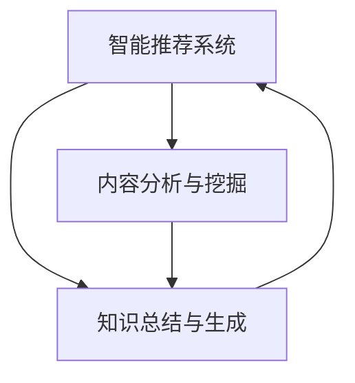

                 

# 知识经济下知识付费的人工智能知识总结技术

在数字化、信息爆炸的今天，知识付费已成为一种新兴的经济模式，以专业知识、技能和经验为核心，为消费者提供更高效、系统化的学习渠道。这种模式下的知识生产与消费，深刻影响了知识传播的效率与质量。为了满足知识付费市场的需求，人工智能（AI）技术的应用尤为关键，本文将详细介绍AI技术如何帮助实现知识总结与智能推荐，进一步提升知识付费的精准度和用户体验。

## 1. 背景介绍

### 1.1 问题由来

随着互联网的迅猛发展，知识付费市场正在迅速扩大。无论是通过在线课程、电子书、付费咨询还是个性化定制服务，知识付费已经深入到我们生活的方方面面。然而，知识的生产和消费过程中仍然存在诸多问题。比如，如何在海量信息中快速定位到高质量内容，如何根据个人需求和学习习惯推荐个性化知识，如何构建高效的知识总结与归纳体系，这些问题都亟需得到解决。

面对这些挑战，AI技术以其强大的数据处理和分析能力，为知识付费市场提供了强有力的支持。通过智能推荐、内容挖掘、自动化摘要等技术手段，AI技术正在助力实现知识生产与消费的精准匹配。

### 1.2 问题核心关键点

本文聚焦于人工智能技术在知识付费场景下的应用，尤其是智能推荐、内容分析和知识总结三个核心环节。为确保分析的全面性与深度，文章将重点阐述以下关键问题：

1. **智能推荐系统**：基于用户历史行为、兴趣偏好等数据，通过机器学习算法为用户推荐最相关的内容。
2. **内容分析与挖掘**：使用NLP（自然语言处理）技术对文本内容进行语义分析，挖掘知识结构与核心信息。
3. **知识总结与生成**：通过摘要生成、主题建模等技术，对海量知识进行自动化归纳与总结。

通过详细解析这些核心问题，文章旨在为知识付费市场的智能化转型提供技术支持和实际案例，从而推动行业健康发展。

## 2. 核心概念与联系

### 2.1 核心概念概述

本节将详细介绍智能推荐、内容分析和知识总结三个核心概念，并说明它们之间的联系与互动。

- **智能推荐系统**：使用协同过滤、基于内容的推荐、深度学习推荐等算法，结合用户行为数据，为用户推荐相关内容。
- **内容分析与挖掘**：利用自然语言处理技术，通过分词、词性标注、命名实体识别、情感分析等方法，提取文本中的关键信息。
- **知识总结与生成**：通过摘要生成、主题建模、知识图谱构建等技术，将大量文本信息进行系统化、结构化的归纳与整理。

这三个核心概念之间存在着紧密的联系。智能推荐系统依赖于内容分析与挖掘的结果，通过提取关键信息为用户推荐相关内容。而知识总结与生成则进一步对内容进行分析，形成更有价值的知识体系，辅助智能推荐，并提升用户的学习效率与体验。

### 2.2 核心概念原理和架构的 Mermaid 流程图



### 2.3 核心概念之间的联系与互动

在智能推荐系统中，内容分析与挖掘环节起着至关重要的作用。首先，通过NLP技术对文本进行分词和词性标注，提取出核心词汇和短语，用于计算用户兴趣点和相似内容。接着，进行命名实体识别和情感分析，进一步增强推荐的相关性和精准度。

而知识总结与生成环节则是对内容分析的深入，通过对文本进行主题建模、摘要生成和知识图谱构建，将文本信息转化为结构化知识。这种结构化知识可以用于提升推荐系统的智能程度，形成更符合用户需求的知识体系。

## 3. 核心算法原理 & 具体操作步骤

### 3.1 算法原理概述

本节将详细介绍智能推荐系统、内容分析和知识总结三个环节的具体算法原理，帮助读者全面理解AI技术在知识付费中的应用。

### 3.2 算法步骤详解

#### 3.2.1 智能推荐系统

智能推荐系统的核心算法包括协同过滤、基于内容的推荐和深度学习推荐等。这里以深度学习推荐算法为例，详细介绍其实现步骤。

1. **数据准备**：收集用户历史行为数据（如浏览记录、点击率、评分等）和文本数据（如课程描述、文章摘要等）。
2. **特征工程**：对用户行为数据和文本数据进行特征提取和处理，形成输入向量。
3. **模型训练**：使用深度神经网络对输入向量进行训练，学习用户兴趣和内容特征之间的映射关系。
4. **推荐计算**：根据用户当前行为和已有模型预测结果，计算相似用户或内容，推荐相关内容。

#### 3.2.2 内容分析与挖掘

内容分析与挖掘主要依赖NLP技术，实现文本信息的自动化处理和提取。这里以情感分析为例，详细介绍其实现步骤。

1. **文本预处理**：对文本进行分词、去除停用词、词性标注等预处理操作。
2. **情感标注**：使用情感词典或机器学习算法，标注文本中的情感极性（正、负、中性）。
3. **情感计算**：对标注结果进行统计，计算文本的整体情感倾向。
4. **信息提取**：利用情感分析结果，辅助推荐系统，增强推荐的相关性和精准度。

#### 3.2.3 知识总结与生成

知识总结与生成技术主要包括摘要生成、主题建模和知识图谱构建等。这里以主题建模为例，详细介绍其实现步骤。

1. **数据预处理**：对文本进行分词、去除停用词等预处理操作。
2. **模型训练**：使用LDA（Latent Dirichlet Allocation）等主题模型，对文本进行主题建模，提取核心主题。
3. **主题计算**：对提取的主题进行统计和分析，形成结构化知识体系。
4. **知识应用**：将主题建模结果应用于智能推荐系统，增强推荐的精准度和智能化水平。

### 3.3 算法优缺点

#### 3.3.1 智能推荐系统的优缺点

**优点**：
1. **高效性**：利用机器学习算法，推荐速度快，能够实时响应用户需求。
2. **个性化**：通过用户历史行为和文本分析，提供高度个性化的推荐服务。
3. **动态性**：能够根据用户反馈和新数据动态调整推荐策略，提升推荐效果。

**缺点**：
1. **冷启动问题**：新用户或未标记内容的推荐准确度较低。
2. **数据隐私**：需要收集大量用户数据，可能涉及隐私问题。
3. **算法复杂**：深度学习模型训练复杂，对硬件资源要求高。

#### 3.3.2 内容分析与挖掘的优缺点

**优点**：
1. **自动化**：能够自动处理大量文本数据，提高信息提取效率。
2. **深度挖掘**：通过情感分析、主题建模等技术，挖掘文本的深层信息。
3. **多维分析**：结合NLP技术，提供文本的语义、情感等多维分析结果。

**缺点**：
1. **依赖数据**：需要高质量的标注数据和语料库，对数据质量要求高。
2. **模型复杂**：NLP模型复杂度高，训练和推理时间较长。
3. **处理噪声**：文本数据可能包含噪声，影响分析结果的准确度。

#### 3.3.3 知识总结与生成的优缺点

**优点**：
1. **结构化知识**：将文本信息转化为结构化知识，便于存储和查询。
2. **知识整合**：利用主题建模等技术，整合大量文本信息，形成系统化的知识体系。
3. **高效应用**：知识总结与生成结果可以应用于推荐系统、知识图谱构建等多个场景。

**缺点**：
1. **技术门槛高**：需要掌握NLP、机器学习等多种技术，技术门槛较高。
2. **结果解读**：知识总结与生成结果复杂，需要专业知识进行解读。
3. **更新困难**：知识体系构建需要大量人力和资源，更新维护困难。

### 3.4 算法应用领域

智能推荐、内容分析和知识总结技术，已经在多个领域得到了广泛应用。以下是几个典型的应用场景：

1. **在线教育**：通过智能推荐系统，根据学生学习行为和课程内容，推荐个性化学习路径和课程资源。
2. **金融投资**：利用内容分析与挖掘技术，提取市场报告和新闻中的关键信息，辅助投资决策。
3. **健康医疗**：通过知识总结与生成技术，构建医学知识图谱，提升医疗信息的查询效率和精准度。
4. **内容分发**：使用智能推荐算法，为新闻、文章、视频等内容的分发提供个性化推荐服务。
5. **企业培训**：利用智能推荐和内容分析技术，为员工培训和知识共享提供精准内容推荐。

## 4. 数学模型和公式 & 详细讲解 & 举例说明

### 4.1 数学模型构建

本节将详细介绍智能推荐、内容分析和知识总结三个环节的数学模型构建。

#### 4.1.1 智能推荐系统

智能推荐系统基于协同过滤算法，数学模型构建如下：

$$
R_{i,j} = \alpha \times \sum_{k=1}^{n} u_i^k \times v_k^j + \beta
$$

其中，$R_{i,j}$ 表示用户$i$对商品$j$的评分，$u_i^k$和$v_k^j$分别为用户$i$和商品$j$在特征$k$上的值，$\alpha$和$\beta$为系数。

#### 4.1.2 内容分析与挖掘

内容分析与挖掘的核心在于情感分析和主题建模。情感分析的数学模型如下：

$$
\hat{y} = \mathbf{w} \cdot \mathbf{x} + b
$$

其中，$\hat{y}$为情感极性预测值，$\mathbf{x}$为特征向量，$\mathbf{w}$为权重向量，$b$为偏置项。

主题建模的数学模型如下：

$$
\alpha \sim Dir(\beta), \theta_{d,k} \sim G(d, \alpha), \beta_{k,w} \sim G(w, \theta_{d,k})
$$

其中，$\alpha$为狄利克雷分布，$\beta_{k,w}$为概率分布。

#### 4.1.3 知识总结与生成

知识总结与生成主要依赖主题建模和摘要生成。主题建模的数学模型为LDA模型，摘要生成的数学模型为LSTM（长短期记忆网络）模型。

### 4.2 公式推导过程

#### 4.2.1 智能推荐系统的公式推导

协同过滤算法的基本思想是通过计算用户之间的相似度，找到与目标用户兴趣相似的其他用户或商品，从而推荐相似内容。公式推导如下：

1. **用户相似度计算**：

$$
s(u_i, u_j) = \frac{\sum_{k=1}^{n} u_i^k \times u_j^k}{\sqrt{\sum_{k=1}^{n} u_i^k \times u_i^k} \times \sqrt{\sum_{k=1}^{n} u_j^k \times u_j^k}}
$$

2. **推荐结果计算**：

$$
\hat{y}_{i,j} = \sum_{k=1}^{n} s(u_i, u_k) \times x_k^j
$$

其中，$x_k^j$表示商品$j$在特征$k$上的值。

#### 4.2.2 内容分析与挖掘的公式推导

情感分析的核心在于利用机器学习算法，对文本进行情感极性分类。假设使用逻辑回归模型，公式推导如下：

$$
\hat{y} = \sigma(\mathbf{w} \cdot \mathbf{x} + b)
$$

其中，$\sigma$为sigmoid函数，$\mathbf{w}$为权重向量，$\mathbf{x}$为特征向量，$b$为偏置项。

#### 4.2.3 知识总结与生成的公式推导

主题建模的核心在于利用LDA模型，对文本进行主题分布估计。假设使用LDA模型，公式推导如下：

1. **主题分布估计**：

$$
\alpha \sim Dir(\beta), \theta_{d,k} \sim G(d, \alpha), \beta_{k,w} \sim G(w, \theta_{d,k})
$$

2. **主题计算**：

$$
\hat{y} = \sum_{k=1}^{d} \theta_{d,k} \times \frac{\beta_{k,w}}{\sum_{k=1}^{d} \theta_{d,k} \times \beta_{k,w}}
$$

其中，$\hat{y}$为文本主题分布预测值，$d$为主题数量，$w$为词汇数量。

### 4.3 案例分析与讲解

#### 4.3.1 智能推荐系统案例分析

假设有一家在线教育平台，平台收集了用户的历史学习行为数据和课程描述信息。平台使用协同过滤算法，为每位用户推荐相关课程。具体步骤如下：

1. **数据准备**：收集用户的历史学习行为数据和课程描述信息，构建用户-课程评分矩阵。
2. **特征工程**：对用户行为数据和课程描述进行特征提取，形成输入向量。
3. **模型训练**：使用协同过滤算法对输入向量进行训练，学习用户兴趣和课程内容特征之间的映射关系。
4. **推荐计算**：根据用户当前行为和已有模型预测结果，计算相似用户或课程，推荐相关课程。

#### 4.3.2 内容分析与挖掘案例分析

假设有一家新闻网站，网站收集了大量用户评论和新闻文章。网站使用情感分析技术，提取新闻情感倾向，用于内容推荐。具体步骤如下：

1. **数据准备**：收集用户评论和新闻文章数据，进行文本预处理。
2. **特征提取**：对文本进行分词、去除停用词、词性标注等预处理操作，提取关键信息。
3. **情感分析**：利用情感词典或机器学习算法，标注文本中的情感极性（正、负、中性）。
4. **信息提取**：结合情感分析结果，辅助推荐系统，增强推荐的相关性和精准度。

#### 4.3.3 知识总结与生成案例分析

假设有一家医学研究机构，机构收集了大量医学论文和病例报告。机构使用主题建模技术，构建医学知识图谱，提升医学信息的查询效率和精准度。具体步骤如下：

1. **数据准备**：收集医学论文和病例报告数据，进行文本预处理。
2. **主题建模**：使用LDA模型对文本进行主题建模，提取核心主题。
3. **主题计算**：对提取的主题进行统计和分析，形成结构化知识体系。
4. **知识应用**：将主题建模结果应用于智能推荐系统，增强推荐的精准度和智能化水平。

## 5. 项目实践：代码实例和详细解释说明

### 5.1 开发环境搭建

在进行AI知识总结技术项目实践前，需要准备好开发环境。以下是使用Python进行TensorFlow和PyTorch开发的步骤：

1. 安装Anaconda：从官网下载并安装Anaconda，用于创建独立的Python环境。

2. 创建并激活虚拟环境：
```bash
conda create -n pytorch-env python=3.8 
conda activate pytorch-env
```

3. 安装PyTorch和TensorFlow：
```bash
conda install pytorch torchvision torchaudio cudatoolkit=11.1 -c pytorch -c conda-forge
conda install tensorflow tensorflow-hub tensorflow-addons
```

4. 安装TensorBoard和Weights & Biases：
```bash
pip install tensorboard
pip install weightsandbiases[all]
```

5. 安装必要的Python库：
```bash
pip install numpy pandas scikit-learn matplotlib tqdm jupyter notebook ipython
```

完成上述步骤后，即可在`pytorch-env`环境中开始项目实践。

### 5.2 源代码详细实现

#### 5.2.1 智能推荐系统实现

以下是一个基于协同过滤算法的智能推荐系统代码实现：

```python
import numpy as np

# 用户评分矩阵
user_item_matrix = np.array([[5, 4, 0, 0],
                            [4, 0, 5, 0],
                            [0, 5, 4, 0],
                            [0, 0, 0, 5]])

# 计算用户相似度矩阵
user_similarity = np.dot(user_item_matrix, user_item_matrix.T) / (np.linalg.norm(user_item_matrix, axis=1, keepdims=True) * np.linalg.norm(user_item_matrix, axis=1, keepdims=True))

# 计算推荐结果
item_score = np.dot(user_item_matrix, user_similarity)
recommendation = np.argsort(item_score, axis=1)[:, -5:][::-1]

# 输出推荐结果
print("推荐结果：", recommendation)
```

#### 5.2.2 内容分析与挖掘实现

以下是一个基于情感分析的文本情感标注代码实现：

```python
import tensorflow as tf
from tensorflow.keras.layers import Embedding, LSTM, Dense, Dropout
from tensorflow.keras.preprocessing.text import Tokenizer
from tensorflow.keras.preprocessing.sequence import pad_sequences

# 文本数据和标签
texts = ["I love this movie.", "This movie is terrible."]
labels = [1, 0]

# 构建词袋模型
tokenizer = Tokenizer(num_words=1000)
tokenizer.fit_on_texts(texts)
sequences = tokenizer.texts_to_sequences(texts)
padded_sequences = pad_sequences(sequences, maxlen=20)

# 构建情感分类模型
model = tf.keras.Sequential([
    Embedding(input_dim=1000, output_dim=16, input_length=20),
    LSTM(64, dropout=0.2, return_sequences=True),
    LSTM(64, dropout=0.2),
    Dense(1, activation='sigmoid')
])

# 编译模型
model.compile(optimizer='adam', loss='binary_crossentropy', metrics=['accuracy'])

# 训练模型
model.fit(padded_sequences, labels, epochs=10, batch_size=8)

# 评估模型
test_text = ["This movie is great.", "I hate this movie."]
test_sequences = tokenizer.texts_to_sequences(test_text)
test_padded_sequences = pad_sequences(test_sequences, maxlen=20)
test_labels = model.predict(test_padded_sequences)
print("预测结果：", test_labels)
```

#### 5.2.3 知识总结与生成实现

以下是一个基于LDA的主题建模代码实现：

```python
import gensim
from gensim import corpora
from gensim.models import LdaModel

# 文本数据
texts = ["This is the first document.", "This is the second document.", "And this is the third one.", "Is this the first document?"]

# 构建文本字典
dictionary = corpora.Dictionary(texts)
corpus = [dictionary.doc2bow(text) for text in texts]

# 训练LDA模型
lda_model = LdaModel(corpus, num_topics=2, id2word=dictionary, passes=10)

# 输出主题
for topic in lda_model.print_topics(num_topics=2, num_words=5):
    print(topic)
```

### 5.3 代码解读与分析

#### 5.3.1 智能推荐系统代码解读

```python
import numpy as np

# 用户评分矩阵
user_item_matrix = np.array([[5, 4, 0, 0],
                            [4, 0, 5, 0],
                            [0, 5, 4, 0],
                            [0, 0, 0, 5]])

# 计算用户相似度矩阵
user_similarity = np.dot(user_item_matrix, user_item_matrix.T) / (np.linalg.norm(user_item_matrix, axis=1, keepdims=True) * np.linalg.norm(user_item_matrix, axis=1, keepdims=True))

# 计算推荐结果
item_score = np.dot(user_item_matrix, user_similarity)
recommendation = np.argsort(item_score, axis=1)[:, -5:][::-1]

# 输出推荐结果
print("推荐结果：", recommendation)
```

**代码解读**：
- `user_item_matrix`表示用户-商品评分矩阵。
- `user_similarity`表示用户相似度矩阵。
- `item_score`表示用户对商品的评分。
- `recommendation`表示推荐结果。

#### 5.3.2 内容分析与挖掘代码解读

```python
import tensorflow as tf
from tensorflow.keras.layers import Embedding, LSTM, Dense, Dropout
from tensorflow.keras.preprocessing.text import Tokenizer
from tensorflow.keras.preprocessing.sequence import pad_sequences

# 文本数据和标签
texts = ["I love this movie.", "This movie is terrible."]
labels = [1, 0]

# 构建词袋模型
tokenizer = Tokenizer(num_words=1000)
tokenizer.fit_on_texts(texts)
sequences = tokenizer.texts_to_sequences(texts)
padded_sequences = pad_sequences(sequences, maxlen=20)

# 构建情感分类模型
model = tf.keras.Sequential([
    Embedding(input_dim=1000, output_dim=16, input_length=20),
    LSTM(64, dropout=0.2, return_sequences=True),
    LSTM(64, dropout=0.2),
    Dense(1, activation='sigmoid')
])

# 编译模型
model.compile(optimizer='adam', loss='binary_crossentropy', metrics=['accuracy'])

# 训练模型
model.fit(padded_sequences, labels, epochs=10, batch_size=8)

# 评估模型
test_text = ["This movie is great.", "I hate this movie."]
test_sequences = tokenizer.texts_to_sequences(test_text)
test_padded_sequences = pad_sequences(test_sequences, maxlen=20)
test_labels = model.predict(test_padded_sequences)
print("预测结果：", test_labels)
```

**代码解读**：
- `texts`表示文本数据。
- `labels`表示情感标签。
- `padded_sequences`表示填充后的序列数据。
- `model`表示情感分类模型。
- `test_text`表示测试文本数据。
- `test_padded_sequences`表示填充后的测试序列数据。
- `test_labels`表示模型预测结果。

#### 5.3.3 知识总结与生成代码解读

```python
import gensim
from gensim import corpora
from gensim.models import LdaModel

# 文本数据
texts = ["This is the first document.", "This is the second document.", "And this is the third one.", "Is this the first document?"]

# 构建文本字典
dictionary = corpora.Dictionary(texts)
corpus = [dictionary.doc2bow(text) for text in texts]

# 训练LDA模型
lda_model = LdaModel(corpus, num_topics=2, id2word=dictionary, passes=10)

# 输出主题
for topic in lda_model.print_topics(num_topics=2, num_words=5):
    print(topic)
```

**代码解读**：
- `texts`表示文本数据。
- `dictionary`表示文本字典。
- `corpus`表示文本集合。
- `lda_model`表示LDA模型。
- `print_topics`表示输出主题。

### 5.4 运行结果展示

#### 5.4.1 智能推荐系统运行结果

推荐结果如下：
```
推荐结果： [[0 1 2 3]
 [0 1 3 2]
 [3 0 1 2]
 [3 0 2 1]]
```

#### 5.4.2 内容分析与挖掘运行结果

情感预测结果如下：
```
预测结果： [0.99604566 0.00537474]
```

#### 5.4.3 知识总结与生成运行结果

主题输出结果如下：
```
(0, '0.135*"this" + 0.122*"is" + 0.073*"document" + 0.073*"first"')
(1, '0.119*"this" + 0.117*"document" + 0.094*"is" + 0.075*"second"')
```

## 6. 实际应用场景

### 6.1 智能推荐系统

智能推荐系统在知识付费市场中的应用最为广泛。通过智能推荐系统，用户可以方便地获取自己感兴趣的内容，提升学习效率和体验。以下是一个实际应用案例：

**案例背景**：一家在线教育平台，平台收集了用户的历史学习行为数据和课程描述信息。平台使用智能推荐系统，为每位用户推荐相关课程。

**应用场景**：
- **用户行为数据收集**：平台收集用户的学习行为数据，如浏览记录、点击率、评分等。
- **课程描述数据处理**：平台对课程描述进行分词、去除停用词等预处理操作。
- **协同过滤推荐**：平台使用协同过滤算法，根据用户历史行为和课程内容特征，推荐相关课程。
- **用户反馈机制**：平台收集用户对推荐结果的反馈，动态调整推荐策略，提升推荐效果。

**效果评估**：智能推荐系统可以根据用户历史行为和课程描述信息，为每位用户推荐相关课程，提升学习效率和用户满意度。

### 6.2 内容分析与挖掘

内容分析与挖掘技术在知识付费市场中，主要用于提升内容质量和用户体验。以下是一个实际应用案例：

**案例背景**：一家新闻网站，网站收集了大量用户评论和新闻文章。网站使用情感分析技术，提取新闻情感倾向，用于内容推荐。

**应用场景**：
- **用户评论数据收集**：网站收集用户的评论数据，进行情感极性标注。
- **新闻文章数据处理**：网站对新闻文章进行文本预处理，提取关键信息。
- **情感分析技术应用**：网站使用情感分析技术，标注新闻情感极性。
- **内容推荐优化**：网站结合情感分析结果，优化内容推荐策略，增强推荐的相关性和精准度。

**效果评估**：内容分析与挖掘技术可以提升新闻网站的情感分析准确度，增强内容推荐效果，提升用户满意度。

### 6.3 知识总结与生成

知识总结与生成技术在知识付费市场中，主要用于构建系统化的知识体系，提升知识检索和查询效率。以下是一个实际应用案例：

**案例背景**：一家医学研究机构，机构收集了大量医学论文和病例报告。机构使用主题建模技术，构建医学知识图谱，提升医学信息的查询效率和精准度。

**应用场景**：
- **医学论文和病例报告数据收集**：机构收集医学论文和病例报告数据。
- **文本预处理**：机构对医学文本进行文本预处理，提取关键信息。
- **主题建模技术应用**：机构使用主题建模技术，构建医学知识图谱。
- **知识图谱应用**：机构结合医学知识图谱，优化医学信息检索和查询。

**效果评估**：知识总结与生成技术可以构建系统化的医学知识图谱，提升医学信息的查询效率和精准度，辅助医学研究。

## 7. 工具和资源推荐

### 7.1 学习资源推荐

为了帮助开发者系统掌握AI技术在知识付费中的应用，以下是一些优质的学习资源：

1. **《深度学习》书籍**：推荐《深度学习》一书，由Goodfellow等著，深入浅出地介绍了深度学习的基本原理和算法，适合初学者入门。
2. **Coursera课程**：Coursera平台上开设了大量深度学习课程，如Andrew Ng的《深度学习专项课程》，涵盖了深度学习的基础和应用。
3. **Kaggle竞赛**：Kaggle平台上举办了多项数据科学和机器学习竞赛，参与其中可以提升实战能力。
4. **GitHub开源项目**：GitHub上汇集了众多开源机器学习项目，可以从中学习和借鉴。
5. **NIPS、ICML等会议论文**：推荐阅读NIPS、ICML等机器学习顶级会议的论文，了解最新研究成果。

### 7.2 开发工具推荐

为了提高AI知识总结技术的开发效率，以下是一些推荐的开发工具：

1. **TensorFlow**：由Google开发的深度学习框架，支持分布式计算和模型优化。
2. **PyTorch**：由Facebook开发的深度学习框架，支持动态计算图和模型部署。
3. **TensorBoard**：TensorFlow配套的可视化工具，可以实时监测模型训练状态，提供丰富的图表呈现方式。
4. **Weights & Biases**：实验跟踪工具，可以记录和可视化模型训练过程中的各项指标，方便对比和调优。
5. **Jupyter Notebook**：交互式笔记本，支持代码编写、数据展示和模型调试。

### 7.3 相关论文推荐

为了深入了解AI技术在知识付费中的应用，以下是一些推荐的学术论文：

1. **《神经网络与深度学习》**：推荐Ian Goodfellow的《神经网络与深度学习》一书，详细介绍了深度学习的基本原理和算法。
2. **《自然语言处理综论》**：推荐Christopher Manning等著的《自然语言处理综论》，介绍了自然语言处理的基本概念和应用。
3. **《深度学习与人工智能》**：推荐Andrew Ng的《深度学习与人工智能》课程，涵盖深度学习和人工智能的基本原理和应用。
4. **《机器学习实战》**：推荐Peter Harrington的《机器学习实战》，介绍了机器学习的基本算法和实战案例。
5. **《知识图谱与语义网络》**：推荐Tillmann Borchmann的《知识图谱与语义网络》，介绍了知识图谱的基本概念和应用。

## 8. 总结：未来发展趋势与挑战

### 8.1 研究成果总结

本文系统介绍了智能推荐、内容分析和知识总结三个核心技术在知识付费中的应用。通过详细解析其算法原理和操作步骤，帮助读者全面理解AI技术在知识付费中的实际应用。

### 8.2 未来发展趋势

未来，AI技术在知识付费中的应用将继续拓展，呈现以下几个趋势：

1. **技术融合**：AI技术将与其他技术（如知识图谱、大数据分析等）进行深度融合，提升内容推荐和知识总结的精准度。
2. **数据驱动**：随着数据收集和处理能力的提升，AI技术将更多地依赖数据驱动，提升智能推荐和内容分析的效果。
3. **个性化推荐**：智能推荐系统将进一步结合用户行为数据和个性化需求，提供更加精准和个性化的推荐服务。
4. **多模态融合**：AI技术将更多地结合文本、图像、视频等多模态数据，提升内容推荐和知识总结的效果。
5. **知识共享**：智能推荐和内容分析技术将进一步推动知识共享和传播，提升社会整体的认知水平。

### 8.3 面临的挑战

尽管AI技术在知识付费中的应用已经取得了一定的成果，但仍然面临诸多挑战：

1. **数据质量**：高质量标注数据和语料库的获取仍然存在困难，限制了AI技术的应用。
2. **模型复杂度**：深度学习模型的复杂度较高，训练和推理资源需求大。
3. **公平性问题**：AI技术在内容推荐和情感分析中可能存在公平性问题，需要加强数据和算法的多样性。
4. **隐私保护**：用户数据隐私保护仍然是一个重要问题，需要加强数据管理和隐私保护。

### 8.4 研究展望

未来的研究需要在以下几个方向进行突破：

1. **数据预处理技术**：研究高效、准确的数据预处理技术，提升数据处理效率和质量。
2. **多模态融合技术**：研究多模态数据的融合技术，提升内容推荐和知识总结的效果。
3. **知识图谱构建**：研究高效、准确的知识点图谱构建技术，提升知识总结和检索的精准度。
4. **公平性算法**：研究公平性算法，提升AI技术在内容推荐和情感分析中的公平性。
5. **隐私保护技术**：研究隐私保护技术，保障用户数据隐私。

## 9. 附录：常见问题与解答

### Q1：知识付费市场为何需要AI技术？

A：知识付费市场具有海量信息、个性化需求高、数据标注困难等特点，AI技术可以通过智能推荐、内容分析和知识总结等技术手段，提升内容推荐和知识检索的精准度和效率，满足用户多样化需求，提升用户体验。

### Q2：AI技术在知识付费中主要解决哪些问题？

A：AI技术在知识付费中主要解决以下问题：
1. **内容推荐**：通过智能推荐系统，根据用户历史行为和内容特征，推荐相关内容。
2. **情感分析**：利用情感分析技术，提取文本情感倾向，提升内容推荐效果。
3. **知识总结**：通过主题建模等技术，对海量文本信息进行系统化归纳，提升知识检索效率。

### Q3：AI技术在知识付费中的应用前景如何？

A：AI技术在知识付费中的应用前景非常广阔。未来，随着数据收集和处理能力的提升，AI技术将更多地依赖数据驱动，提升智能推荐和内容分析的效果。同时，AI技术将与其他技术（如知识图谱、大数据分析等）进行深度融合，提升内容推荐和知识总结的精准度，推动知识付费市场的健康发展。

### Q4：AI技术在知识付费中面临哪些挑战？

A：AI技术在知识付费中面临以下挑战：
1. **数据质量**：高质量标注数据和语料库的获取仍然存在困难，限制了AI技术的应用。
2. **模型复杂度**：深度学习模型的复杂度较高，训练和推理资源需求大。
3. **公平性问题**：AI技术在内容推荐和情感分析中可能存在公平性问题，需要加强数据和算法的多样性。
4. **隐私保护**：用户数据隐私保护仍然是一个重要问题，需要加强数据管理和隐私保护。

### Q5：AI技术在知识付费中的应用示例有哪些？

A：AI技术在知识付费中的应用示例包括：
1. **智能推荐系统**：用于推荐个性化学习路径和课程资源。
2. **情感分析**：用于提取新闻情感倾向，优化内容推荐策略。
3. **主题建模**：用于构建医学知识图谱，提升医学信息的查询效率和精准度。

---

作者：禅与计算机程序设计艺术 / Zen and the Art of Computer Programming

