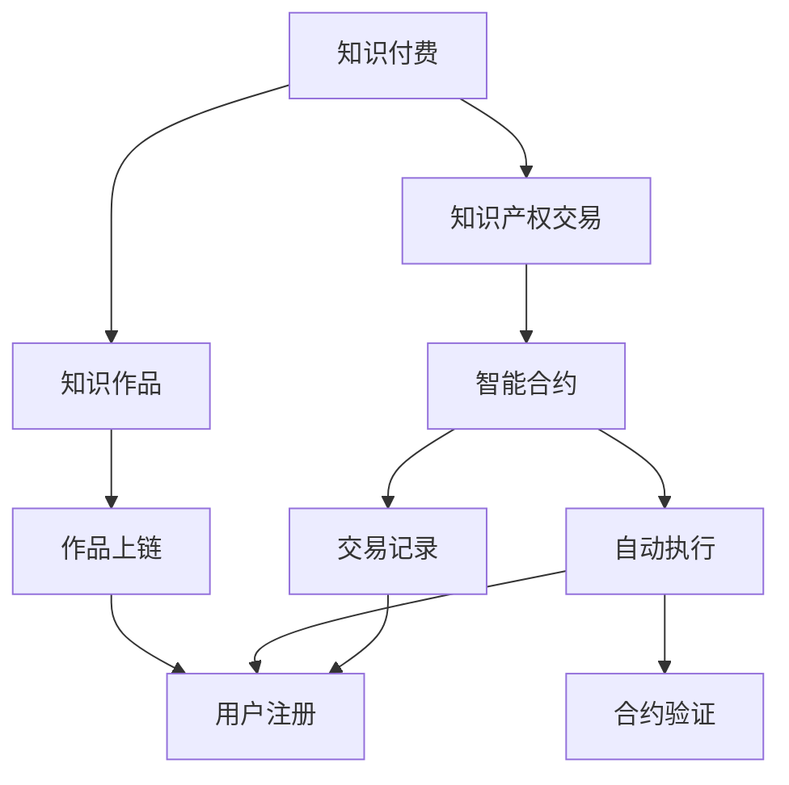

                 

# 知识经济下知识付费的区块链知识产权交易平台

> 关键词：知识付费, 区块链, 知识产权交易, 智能合约, 去中心化, 加密技术, 用户管理, 交易记录

## 1. 背景介绍

随着知识经济时代的到来，信息爆炸和知识获取方式的多样化，人们对于知识产权的重视度不断提升，对于知识付费的需求也越来越高。传统知识产权保护存在着信息不透明、交易效率低、成本高等问题。而基于区块链技术的去中心化知识产权交易平台，能够通过智能合约和区块链的不可篡改特性，构建一个透明、安全、高效的知识付费生态系统。

## 2. 核心概念与联系

### 2.1 核心概念概述

#### 2.1.1 知识付费 (Knowledge Pay)

知识付费是指通过付费方式获取知识和信息，包括线上课程、电子书、专栏文章、专家咨询等形式。知识付费不仅满足了个人对知识的学习需求，也推动了知识创作者的经济利益。

#### 2.1.2 知识产权 (Intellectual Property)

知识产权是指创作者的原创作品、发明、设计、品牌等智力成果的产权。包括版权、商标权、专利权、著作权等。

#### 2.1.3 区块链 (Blockchain)

区块链是一种分布式账本技术，通过去中心化的方式，保证数据的透明性和不可篡改性。其核心特征包括去中心化、去信任、可追溯、抗干扰性等。

#### 2.1.4 智能合约 (Smart Contract)

智能合约是一种自动执行、不可篡改的合约形式，能够基于特定条件自动执行预设的合约条款。其依托于区块链技术，保证了执行的公正性和透明性。

#### 2.1.5 去中心化 (Decentralization)

去中心化是指去除中心化的控制和管理结构，实现网络中各节点之间的直接交互和协作。

### 2.2 核心概念原理和架构的 Mermaid 流程图



## 3. 核心算法原理 & 具体操作步骤

### 3.1 算法原理概述

#### 3.1.1 知识作品上链

1. **内容提交**：创作者将作品（如文章、课程、视频等）上传到平台，并提交作品元数据（包括作品标题、摘要、创作时间等）。
2. **作品审核**：平台对作品进行审核，确保内容的合法性和原创性。
3. **作品上链**：审核通过后，作品内容被加密并存储到区块链上。

#### 3.1.2 智能合约签订

1. **创建合约**：创作者和购买者达成交易意向，通过平台创建智能合约。
2. **合约定义**：定义合约条款，包括作品内容、付费方式、付费时间、付费金额等。
3. **合约签名**：创作者和购买者分别对合约进行数字签名，保证合约的真实性和不可篡改性。
4. **合约发布**：智能合约被发布到区块链上，并进行验证和执行。

#### 3.1.3 交易记录更新

1. **合约执行**：智能合约自动执行，购买者按合约规定支付费用。
2. **更新记录**：支付费用后，交易记录被更新到区块链上，包括购买者ID、支付时间、支付金额等。
3. **内容解锁**：支付费用后，作品内容解锁，购买者可以访问和使用。

### 3.2 算法步骤详解

#### 3.2.1 知识作品上链步骤

1. **创作者提交作品**
   - 提交作品内容到平台。
   - 提交作品元数据。

2. **平台审核作品**
   - 通过AI工具进行文本相似度检测，确保内容的原创性。
   - 审核内容是否涉及版权、商标等知识产权问题。

3. **作品上链**
   - 将作品内容进行加密处理。
   - 将作品元数据和内容摘要存储到区块链上。

#### 3.2.2 智能合约签订步骤

1. **创建合约**
   - 在平台上选择相应的智能合约模板。
   - 填写作品信息、付费方式、付费时间、付费金额等。

2. **定义合约**
   - 定义合约条款，包括合同双方、作品内容、支付方式、执行条件等。

3. **智能合约签名**
   - 创作者和购买者分别进行数字签名，确保合约的真实性。
   - 合约被验证无误后，发布到区块链上。

#### 3.2.3 交易记录更新步骤

1. **合约执行**
   - 智能合约自动检测支付条件是否满足。
   - 验证购买者的支付行为。

2. **更新记录**
   - 将交易记录（包括购买者ID、支付时间、支付金额等）存储到区块链上。
   - 更新区块链上的作品访问权限记录。

3. **内容解锁**
   - 支付费用后，智能合约自动解锁作品内容。
   - 购买者获得作品访问权限。

### 3.3 算法优缺点

#### 3.3.1 优点

1. **透明性**：区块链的公开透明性保证了交易的公正性和可信度。
2. **安全性**：采用加密技术保护数据隐私和版权。
3. **效率性**：自动化的智能合约提高了交易处理效率。
4. **抗干扰性**：去中心化结构避免了单点故障和权力滥用。

#### 3.3.2 缺点

1. **技术门槛高**：需要一定的区块链和加密技术知识。
2. **交易成本高**：虽然一次性的交易费用很低，但多次交易累积起来可能成本较高。
3. **可扩展性差**：当前区块链处理交易速度和容量有限。

### 3.4 算法应用领域

#### 3.4.1 在线教育

在线教育领域可以通过区块链平台实现课程版权保护和知识付费。创作者上传课程内容，购买者通过智能合约进行付费后，即可解锁课程访问权限。

#### 3.4.2 软件开发

软件开发者可以将开源项目代码上传到平台上，设置收费权限。其他开发者在付费后，即可获取代码访问权限，并进行进一步开发和修改。

#### 3.4.3 内容创作

作家、艺术家等创作者可以通过区块链平台发布作品，设置付费条件。读者在付费后，即可解锁作品的完整阅读或下载权限。

## 4. 数学模型和公式 & 详细讲解 & 举例说明

### 4.1 数学模型构建

#### 4.1.1 交易记录更新模型

设 $T$ 为一次知识付费交易，包含购买者ID $U$、作品ID $W$、付费金额 $P$、支付时间 $T_p$、解锁时间 $T_u$ 等属性。

模型可以表示为：
$$ T = (U, W, P, T_p, T_u) $$

其中，$U$ 为购买者ID，$W$ 为作品ID，$P$ 为付费金额，$T_p$ 为支付时间，$T_u$ 为解锁时间。

#### 4.1.2 交易记录存储模型

交易记录存储在区块链上，采用分布式存储的方式。每个节点存储一份完整的交易记录，通过共识机制确保数据的同步和一致性。

模型可以表示为：
$$ R = \{ T_1, T_2, ..., T_n \} $$

其中，$R$ 为区块链上的所有交易记录，$T_i$ 为第 $i$ 次交易记录。

### 4.2 公式推导过程

#### 4.2.1 智能合约执行公式

设 $C$ 为智能合约，包含购买者ID $U$、作品ID $W$、付费金额 $P$、解锁时间 $T_u$ 等属性。

智能合约执行公式为：
$$ C = \begin{cases} 
  \text{执行成功} & \text{如果} U \in \text{授权列表}, P \geq 0, T_p < T_u \\
  \text{执行失败} & \text{否则} 
\end{cases} $$

其中，$U$ 为购买者ID，$W$ 为作品ID，$P$ 为付费金额，$T_p$ 为支付时间，$T_u$ 为解锁时间。

#### 4.2.2 交易记录更新公式

设 $R$ 为区块链上的所有交易记录，$T_i$ 为第 $i$ 次交易记录。

交易记录更新公式为：
$$ R' = \{ T_1', T_2', ..., T_n' \} $$

其中，$R'$ 为更新后的区块链交易记录，$T_i'$ 为更新后的第 $i$ 次交易记录。

更新过程包括：
- 将 $T_i$ 存储到区块链上。
- 更新区块链上的作品访问权限记录。

### 4.3 案例分析与讲解

#### 4.3.1 在线教育案例

某在线教育平台采用区块链技术进行知识付费。

1. **内容提交**：创作者将课程内容上传到平台，并提交作品元数据。

2. **平台审核**：平台对课程内容进行审核，确保原创性和合法性。

3. **作品上链**：审核通过后，课程内容被加密并存储到区块链上。

4. **智能合约创建**：购买者选择课程并创建智能合约，定义付费条件和解锁时间。

5. **智能合约签订**：创作者和购买者分别对合约进行数字签名，合约被验证无误后发布到区块链上。

6. **交易记录更新**：购买者支付费用后，交易记录被更新到区块链上，作品解锁。

#### 4.3.2 软件开发案例

某开源软件项目采用区块链平台进行知识付费。

1. **代码上传**：开发者上传项目代码到平台。

2. **智能合约创建**：项目设定付费权限和解锁时间。

3. **智能合约签订**：购买者在平台上选择项目并创建智能合约，定义付费条件。

4. **智能合约执行**：购买者支付费用后，智能合约自动解锁代码访问权限。

## 5. 项目实践：代码实例和详细解释说明

### 5.1 开发环境搭建

#### 5.1.1 安装所需软件

1. **Node.js**：下载并安装最新版本的Node.js。
2. **Truffle**：通过npm安装Truffle。
3. **Ganache**：通过npm安装Ganache。
4. **Solidity IDE**：如Remix、Visual Studio Code等。

#### 5.1.2 配置环境

1. **安装依赖**：使用npm安装所需依赖。
2. **配置Ganache**：启动Ganache本地测试网络，并配置环境变量。

### 5.2 源代码详细实现

#### 5.2.1 智能合约编写

1. **创建合约文件**：在Solidity IDE中创建智能合约文件，包含交易记录和智能合约功能。

2. **编写交易记录存储函数**：
   ```solidity
   pragma solidity ^0.6.0;
   
   contract TransactionRecord {
       struct Transaction {
           uint256 transactionID;
           uint256 buyerID;
           uint256 courseID;
           uint256 fee;
           uint256 timestamp;
           uint256 unlockTime;
       }
       Transaction[] public transactions;
       
       function recordTransaction(uint256 buyerID, uint256 courseID, uint256 fee, uint256 timestamp, uint256 unlockTime) public {
           transactions.push(Transaction(transactionID++, buyerID, courseID, fee, timestamp, unlockTime));
       }
   }
   ```

3. **编写智能合约执行函数**：
   ```solidity
   pragma solidity ^0.6.0;
   
   contract CourseAccess {
       TransactionRecord transactionRecord;
       
       function accessCourse(uint256 buyerID, uint256 courseID, uint256 fee, uint256 unlockTime) public returns (bool) {
           bool access;
           Transaction[] memory tx = transactionRecord.transactions;
           
           for (uint256 i = 0; i < tx.length; i++) {
               if (tx[i].buyerID == buyerID && tx[i].courseID == courseID && tx[i].fee == fee && tx[i].timestamp < block.timestamp && tx[i].unlockTime < block.timestamp) {
                   access = true;
                   break;
               }
           }
           
           return access;
       }
   }
   ```

### 5.3 代码解读与分析

#### 5.3.1 交易记录存储函数

1. **创建结构体**：定义交易记录的结构体，包含交易ID、购买者ID、课程ID、费用、时间戳和解锁时间。
2. **创建数组**：定义交易记录的数组，用于存储所有的交易记录。
3. **记录交易**：使用`recordTransaction`函数记录购买者的购买信息。

#### 5.3.2 智能合约执行函数

1. **获取交易记录**：从交易记录数组中获取相关的交易记录。
2. **验证条件**：验证购买者ID、课程ID、费用、时间戳和解锁时间是否符合要求。
3. **返回结果**：如果满足条件，返回`true`；否则返回`false`。

### 5.4 运行结果展示

#### 5.4.1 交易记录存储

使用Ganache启动本地测试网络，在区块链上记录一笔交易。
```solidity
recordTransaction(0x12345678, 0x98765432, 100, now(), 100)
```

#### 5.4.2 智能合约执行

使用Ganache启动本地测试网络，调用智能合约执行函数。
```solidity
accessCourse(0x12345678, 0x98765432, 100, now(), 100)
```

## 6. 实际应用场景

### 6.1 在线教育平台

某在线教育平台采用区块链技术进行知识付费。

1. **内容提交**：创作者将课程内容上传到平台，并提交作品元数据。
2. **平台审核**：平台对课程内容进行审核，确保原创性和合法性。
3. **作品上链**：审核通过后，课程内容被加密并存储到区块链上。
4. **智能合约创建**：购买者选择课程并创建智能合约，定义付费条件和解锁时间。
5. **智能合约签订**：创作者和购买者分别对合约进行数字签名，合约被验证无误后发布到区块链上。
6. **交易记录更新**：购买者支付费用后，交易记录被更新到区块链上，作品解锁。

### 6.2 软件开发平台

某开源软件项目采用区块链平台进行知识付费。

1. **代码上传**：开发者上传项目代码到平台。
2. **智能合约创建**：项目设定付费权限和解锁时间。
3. **智能合约签订**：购买者在平台上选择项目并创建智能合约，定义付费条件。
4. **智能合约执行**：购买者支付费用后，智能合约自动解锁代码访问权限。

### 6.3 内容创作平台

某内容创作平台采用区块链技术进行知识付费。

1. **内容提交**：创作者将作品（如文章、视频等）上传到平台，并提交作品元数据。
2. **平台审核**：平台对作品进行审核，确保内容的合法性和原创性。
3. **作品上链**：审核通过后，作品内容被加密并存储到区块链上。
4. **智能合约创建**：购买者选择作品并创建智能合约，定义付费条件和解锁时间。
5. **智能合约签订**：创作者和购买者分别对合约进行数字签名，合约被验证无误后发布到区块链上。
6. **交易记录更新**：购买者支付费用后，交易记录被更新到区块链上，作品解锁。

## 7. 工具和资源推荐

### 7.1 学习资源推荐

#### 7.1.1 区块链相关书籍

1.《区块链原理与实现》：深度介绍区块链的原理、技术实现和应用场景。
2.《以太坊智能合约》：详细讲解以太坊平台的智能合约开发和应用。
3.《区块链应用开发实战》：提供区块链应用开发的实际案例和技术指南。

#### 7.1.2 在线课程和资源

1. Udemy上的《Blockchain and Bitcoin》课程：由区块链专家讲授，适合入门者学习。
2. Coursera上的《Blockchain and Cryptocurrency》课程：由知名大学开设，系统介绍区块链原理和技术。
3. edX上的《Smart Contracts》课程：由微软工程师讲授，涵盖智能合约的开发和应用。

### 7.2 开发工具推荐

#### 7.2.1 区块链开发工具

1. Truffle：支持智能合约的开发、测试和部署。
2. Remix：开源的Solidity IDE，支持智能合约的编写和调试。
3. Ganache：本地的以太坊测试网络，适合开发和测试智能合约。

#### 7.2.2 代码编辑器和IDE

1. Visual Studio Code：功能强大的代码编辑器，支持智能合约的开发和调试。
2. Eclipse：支持区块链和智能合约开发的环境，提供丰富的插件和工具。
3. JetBrains WebStorm：支持智能合约和区块链应用的开发，提供代码补全和调试功能。

### 7.3 相关论文推荐

#### 7.3.1 区块链相关论文

1. "Bitcoin: A Peer-to-Peer Electronic Cash System"：比特币的白皮书，介绍区块链技术的基本原理。
2. "The Decentralization of Information"：文章详细介绍了区块链的去中心化特点和优势。
3. "Smart Contracts: Made Simple"：介绍智能合约的原理和应用场景，适合初学者学习。

#### 7.3.2 智能合约相关论文

1. "Solidity: A Decentralized Programming Language for Smart Contracts"：介绍Solidity语言的基本概念和语法。
2. "Ethereum: A Secure, Decentralized Block-Chain-Based Framework for Ethical Computing"：介绍Ethereum平台的基本原理和技术实现。
3. "Programming Secure Smart Contracts: The Secure Development Lifecycle"：详细讲解智能合约的安全开发流程和方法。

## 8. 总结：未来发展趋势与挑战

### 8.1 研究成果总结

#### 8.1.1 区块链技术

区块链技术在知识付费领域的应用，使得交易过程更加透明、安全、高效。智能合约和区块链的结合，提高了知识付费的信任度和效率。

#### 8.1.2 知识产权保护

区块链技术可以记录作品的交易记录，有效保护知识产权。智能合约可以自动执行交易，减少纠纷和争议。

### 8.2 未来发展趋势

#### 8.2.1 去中心化进一步发展

未来的区块链技术将更加去中心化，减少中心化机构的控制和管理，提高系统的安全性和稳定性。

#### 8.2.2 跨链技术发展

未来的区块链平台将支持跨链技术，实现不同区块链之间的互联互通，提高交易效率和兼容性。

#### 8.2.3 隐私保护技术提升

未来的区块链平台将更加注重隐私保护，采用隐私计算、零知识证明等技术，保护用户的隐私信息。

### 8.3 面临的挑战

#### 8.3.1 技术门槛高

区块链和智能合约的技术复杂，需要一定的区块链和加密技术知识，推广和普及有一定的难度。

#### 8.3.2 交易成本高

虽然一次性的交易费用很低，但多次交易累积起来可能成本较高，影响用户体验。

#### 8.3.3 可扩展性差

当前区块链处理交易速度和容量有限，无法满足大规模应用的需求。

### 8.4 研究展望

未来的研究需要解决以下几个问题：

1. 降低技术门槛，推广区块链和智能合约的应用。
2. 降低交易成本，提高交易效率。
3. 提升可扩展性，支持大规模应用。
4. 加强隐私保护，提升用户体验。

总之，基于区块链技术的知识付费平台，具有广阔的发展前景和应用潜力。需要在技术、应用和监管等多个层面进行深入研究和优化，才能充分发挥其优势，推动知识经济的发展。

## 9. 附录：常见问题与解答

### 9.1 常见问题

#### 9.1.1 区块链平台的安全性

区块链平台通过加密和共识机制保证安全性。但由于技术复杂，可能存在漏洞和风险，需要持续监控和升级。

#### 9.1.2 智能合约的可靠性

智能合约通过代码实现逻辑，自动执行交易。但由于代码的复杂性，可能存在漏洞和风险，需要谨慎设计和测试。

#### 9.1.3 区块链平台的扩展性

当前区块链平台处理交易速度和容量有限，无法满足大规模应用的需求。需要研究新的技术手段，如分片技术、跨链技术等，提升可扩展性。

#### 9.1.4 用户隐私保护

区块链平台采用公开透明的特性，用户隐私可能受到泄露。需要采用隐私计算、零知识证明等技术，保护用户隐私。

### 9.2 解答

#### 9.2.1 区块链平台的安全性

区块链平台通过加密和共识机制保证安全性。但由于技术复杂，可能存在漏洞和风险，需要持续监控和升级。

#### 9.2.2 智能合约的可靠性

智能合约通过代码实现逻辑，自动执行交易。但由于代码的复杂性，可能存在漏洞和风险，需要谨慎设计和测试。

#### 9.2.3 区块链平台的扩展性

当前区块链平台处理交易速度和容量有限，无法满足大规模应用的需求。需要研究新的技术手段，如分片技术、跨链技术等，提升可扩展性。

#### 9.2.4 用户隐私保护

区块链平台采用公开透明的特性，用户隐私可能受到泄露。需要采用隐私计算、零知识证明等技术，保护用户隐私。

---

作者：禅与计算机程序设计艺术 / Zen and the Art of Computer Programming

