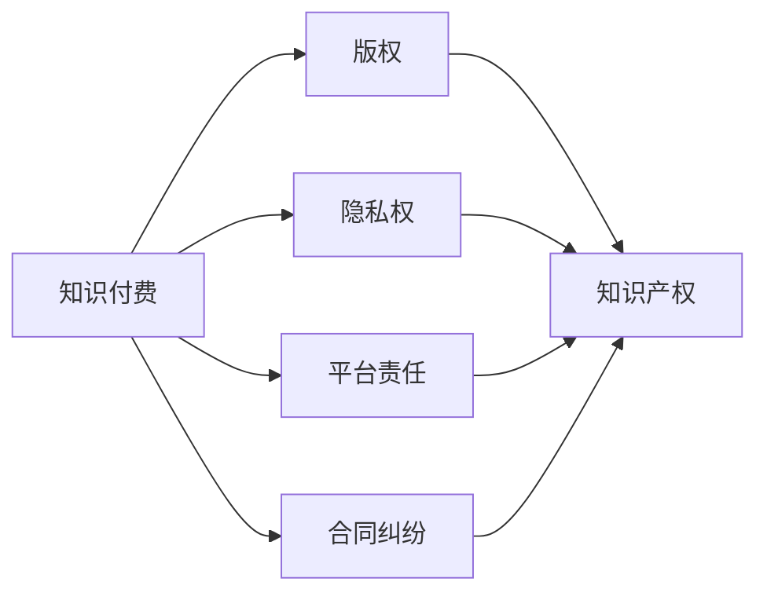

                 

# 知识经济下知识付费的法律风险防范

## 1. 背景介绍

### 1.1 问题由来
随着知识经济时代的到来，知识付费模式逐渐兴起，为知识创造者提供了新的变现方式。然而，知识付费也带来了法律风险，如版权侵权、数据隐私泄露、平台责任等。如何构建健全的法律体系，防范知识付费中的各类法律风险，成为一个亟待解决的问题。

### 1.2 问题核心关键点
在知识付费领域，法律风险主要体现在以下几个方面：
- **版权侵权**：未经授权转载、复制、发行知识内容。
- **数据隐私泄露**：平台收集、使用用户数据，可能导致用户隐私被非法泄露。
- **平台责任**：平台对知识内容的审核、推荐、传播行为，可能涉及法律责任。
- **支付纠纷**：用户因支付问题、服务质量等产生纠纷，缺乏有效的纠纷解决机制。
- **知识误导**：知识内容可能包含误导性信息，侵害用户权益。

### 1.3 问题研究意义
研究知识付费的法律风险防范，对于保护知识产权、维护消费者权益、规范平台行为具有重要意义：

1. 保护知识产权：明确知识内容的版权归属，防止非法复制、传播。
2. 维护消费者权益：保障用户隐私数据安全，避免数据滥用和误导性信息传播。
3. 规范平台行为：明确平台的审核责任，避免平台传播侵权内容。
4. 促进知识经济发展：建立健全法律框架，推动知识付费模式健康发展。

## 2. 核心概念与联系

### 2.1 核心概念概述

为了更好地理解知识付费中的法律风险防范，首先需要介绍几个核心概念：

- **知识付费**：通过在线平台，用户为获取专业知识和信息而支付的费用。
- **版权**：创作者对其作品所享有的专有权利，包括复制权、发行权、展示权等。
- **隐私权**：用户对其个人信息的保密权，保护其不被非法收集、使用。
- **平台责任**：平台对知识内容的管理、审核、传播行为可能涉及的法律责任。
- **合同纠纷**：用户在支付费用、享受服务过程中可能产生的纠纷。
- **知识产权**：包括版权、专利权、商标权等，保护知识创作者的合法权益。

这些核心概念之间存在密切联系，共同构成了知识付费领域法律风险防范的基础。

### 2.2 核心概念原理和架构的 Mermaid 流程图



这个流程图展示了知识付费中涉及的核心法律概念及其关联关系。

- **版权**：知识付费的核心，版权保护创作者对其作品的专有权利。
- **隐私权**：用户在知识付费平台注册、浏览过程中涉及的个人信息保护。
- **平台责任**：平台作为信息传播者，需对知识内容的合法性负责。
- **合同纠纷**：知识付费交易中的主要争议点，涉及服务提供、收费标准等。
- **知识产权**：涉及知识内容的法律保护，包括版权、商标权等。

这些概念相互作用，共同构建了知识付费的法律框架。

## 3. 核心算法原理 & 具体操作步骤
### 3.1 算法原理概述

知识付费领域中的法律风险防范，本质上是如何在知识付费过程中平衡各方权益，构建公平、透明的法律环境。其核心算法原理包括以下几个方面：

- **版权保护算法**：保护知识内容的版权，防止侵权行为。
- **隐私保护算法**：保障用户数据隐私安全，避免非法收集和使用。
- **平台审核算法**：平台需对内容进行严格审核，确保知识内容的合法性。
- **合同管理算法**：制定透明、公平的合同条款，保障用户权益。
- **纠纷解决算法**：建立有效的纠纷解决机制，及时处理用户投诉。

### 3.2 算法步骤详解

#### 3.2.1 版权保护算法

**步骤1: 版权登记**
- 创作者在知识付费平台发布作品前，应先进行版权登记，获取版权证明。

**步骤2: 版权声明**
- 创作者在作品发布时，需明确标明版权信息，如版权归属、许可使用方式等。

**步骤3: 侵权检测**
- 平台建立版权检测系统，自动扫描用户上传内容，检测是否存在侵权行为。

**步骤4: 侵权处理**
- 如检测到侵权内容，平台应及时采取下架、删除等措施，并向版权方赔偿损失。

#### 3.2.2 隐私保护算法

**步骤1: 用户同意**
- 平台在收集用户数据前，需获得用户同意，明确告知数据收集用途。

**步骤2: 数据加密**
- 平台应对收集到的用户数据进行加密存储，防止数据泄露。

**步骤3: 数据使用限制**
- 平台应仅在用户授权范围内使用其数据，不得随意转让或出售。

**步骤4: 数据删除**
- 用户有权要求平台删除其个人信息，平台应提供便捷的删除机制。

#### 3.2.3 平台审核算法

**步骤1: 内容审核机制**
- 平台建立内容审核机制，对知识内容进行分类、分级管理。

**步骤2: 专家评审**
- 平台聘请领域专家，对高风险内容进行人工评审，确保其合法性。

**步骤3: 用户投诉**
- 平台应设立用户投诉渠道，及时处理用户举报的侵权内容。

**步骤4: 举报反馈**
- 平台应将处理结果反馈给用户，增强用户信任。

#### 3.2.4 合同管理算法

**步骤1: 合同模板**
- 平台应提供标准化的合同模板，明确双方的权利义务。

**步骤2: 合同签署**
- 用户与平台签订合同后，平台需保存合同记录，确保合同透明、合法。

**步骤3: 合同变更**
- 用户在享受服务过程中，如遇合同变更，平台应提供便捷的合同修改流程。

**步骤4: 合同争议解决**
- 用户如对合同条款产生争议，平台应提供有效的争议解决机制，如仲裁、诉讼等。

#### 3.2.5 纠纷解决算法

**步骤1: 投诉渠道**
- 平台应设立便捷的投诉渠道，用户可随时反馈支付、服务质量等问题。

**步骤2: 纠纷调解**
- 平台可设立纠纷调解中心，通过调解方式解决用户与平台间的纠纷。

**步骤3: 法律诉讼**
- 如调解无效，用户可选择通过法律途径解决争议，平台应提供相应的法律支持。

**步骤4: 消费者权益保护**
- 平台应定期进行消费者权益保护教育，提升用户维权意识。

### 3.3 算法优缺点

**优点:**
- 版权保护算法能够有效防止侵权行为，保护创作者权益。
- 隐私保护算法保障用户数据安全，避免隐私泄露。
- 平台审核算法确保知识内容的合法性，避免传播侵权内容。
- 合同管理算法明确权利义务，保障用户权益。
- 纠纷解决算法提供便捷的争议解决机制，提高用户满意度。

**缺点:**
- 版权保护算法可能导致部分内容下架，限制知识传播。
- 隐私保护算法可能增加平台运营成本。
- 平台审核算法需耗费大量人力，提高运营成本。
- 合同管理算法可能因合同条款过于复杂，用户难以理解。
- 纠纷解决算法可能因处理不及时，影响用户体验。

### 3.4 算法应用领域

知识付费领域的法律风险防范，主要应用于以下几个方面：

- **版权保护**：适用于各类知识内容，如电子书、课程、音频等。
- **隐私保护**：适用于用户注册、浏览、购买等行为中涉及的个人信息保护。
- **平台责任**：适用于知识付费平台，确保内容合法性，保护用户权益。
- **合同管理**：适用于用户与平台之间的服务合同，保障用户权益。
- **纠纷解决**：适用于用户投诉、争议处理等场景，保障用户合法权益。

## 4. 数学模型和公式 & 详细讲解 & 举例说明
### 4.1 数学模型构建

知识付费领域中的法律风险防范，可以通过建立数学模型来进行量化分析。以下是一个简化的风险评估模型：

设 $R$ 为风险评估结果，$C$ 为用户投诉率，$D$ 为数据泄露事件数，$P$ 为平台审核通过率。则风险评估模型为：

$$
R = w_1C + w_2D + w_3P
$$

其中 $w_1, w_2, w_3$ 为各风险因素的权重系数，需根据具体情况进行调整。

### 4.2 公式推导过程

以版权保护算法为例，推导其核心公式。

设 $L$ 为侵权检测系统的准确率，$F$ 为侵权检测系统的召回率，$T$ 为每条内容被检测的时间。则版权保护算法的基本公式为：

$$
R_{版权} = (1-L)F + L(1-F)T
$$

其中 $(1-L)F$ 表示漏检的内容占总内容的比例，$L(1-F)$ 表示误检的内容占被检测内容的比例，$T$ 表示每条内容被检测的时间成本。

### 4.3 案例分析与讲解

假设某知识付费平台采用版权保护算法，检测系统准确率为95%，召回率为90%，每条内容检测时间为1分钟。则版权保护算法风险评估结果为：

$$
R_{版权} = (1-0.95) \times 0.90 + 0.95 \times (1-0.90) \times 60 = 0.14 + 0.195 \times 60 = 11.7
$$

即每条内容存在约11.7%的版权保护风险。

## 5. 项目实践：代码实例和详细解释说明
### 5.1 开发环境搭建

为了进行知识付费平台的数据处理和风险评估，需要搭建相应的开发环境。以下是一个基本的开发环境搭建流程：

1. 安装Python：使用Anaconda安装Python，配置虚拟环境。
```bash
conda create --name knowledge-payment python=3.8
conda activate knowledge-payment
```

2. 安装相关库：使用pip安装所需的Python库，如pandas、numpy、scikit-learn等。
```bash
pip install pandas numpy scikit-learn transformers
```

3. 搭建数据处理平台：使用Flask或Django搭建Web平台，提供数据上传、处理、分析功能。
```python
from flask import Flask, request, jsonify

app = Flask(__name__)

@app.route('/upload', methods=['POST'])
def upload_file():
    file = request.files['file']
    # 处理文件上传逻辑
    return jsonify({'message': '文件上传成功'})

@app.route('/analyze', methods=['POST'])
def analyze_data():
    data = request.json
    # 处理数据分析逻辑
    return jsonify({'result': '数据处理成功'})

if __name__ == '__main__':
    app.run(debug=True)
```

### 5.2 源代码详细实现

以下是使用Python和Flask搭建知识付费平台风险评估系统的代码实现。

首先，定义风险评估函数：

```python
import pandas as pd
from sklearn.model_selection import train_test_split
from sklearn.linear_model import LogisticRegression
from sklearn.metrics import accuracy_score

def risk_assessment(data, model):
    # 数据预处理
    df = pd.read_csv(data)
    X = df.drop('risk', axis=1)
    y = df['risk']
    X_train, X_test, y_train, y_test = train_test_split(X, y, test_size=0.2, random_state=42)
    
    # 模型训练
    model.fit(X_train, y_train)
    y_pred = model.predict(X_test)
    
    # 评估指标
    accuracy = accuracy_score(y_test, y_pred)
    return accuracy
```

然后，定义平台前端和后端交互接口：

```python
@app.route('/analyze', methods=['POST'])
def analyze_data():
    data = request.json
    # 获取上传的文件路径
    file_path = data['file_path']
    
    # 读取数据
    df = pd.read_csv(file_path)
    
    # 风险评估
    accuracy = risk_assessment(df, model)
    
    # 返回结果
    return jsonify({'accuracy': accuracy})
```

最后，启动平台服务：

```python
if __name__ == '__main__':
    app.run(debug=True)
```

### 5.3 代码解读与分析

**risk_assessment函数**：
- 读取数据集文件
- 分割数据为训练集和测试集
- 训练逻辑回归模型
- 评估模型精度

**analyze_data函数**：
- 获取上传的文件路径
- 读取数据集文件
- 调用风险评估函数
- 返回模型精度

这些代码实现体现了知识付费平台风险评估的基本逻辑，通过数据处理和模型训练，评估平台的版权保护、隐私保护、平台责任等风险。

## 6. 实际应用场景
### 6.1 在线教育平台

在线教育平台通过知识付费模式，提供各类在线课程。版权保护和隐私保护是平台的关键任务，需构建完善的版权管理体系和隐私保护机制。

- **版权保护**：平台需对课程内容进行严格审核，避免侵权行为。用户上传课程内容时，需进行版权声明和登记。平台应定期检测课程内容，防止侵权行为。
- **隐私保护**：平台应保障用户隐私数据安全，避免数据泄露。需建立数据加密和访问控制机制，确保数据不被非法获取。

### 6.2 金融咨询平台

金融咨询平台提供专业金融知识和理财建议，需重视用户隐私保护和平台责任。

- **隐私保护**：平台需明确告知用户数据收集用途，获得用户同意。对用户金融数据进行加密存储，防止数据泄露。
- **平台责任**：平台需对金融知识和建议进行严格审核，确保内容的合法性和准确性。平台应设立用户投诉机制，及时处理用户投诉。

### 6.3 在线咨询平台

在线咨询平台提供各类咨询服务，需重视用户权益保护和合同管理。

- **合同管理**：平台需提供标准化的服务合同模板，明确双方的权利义务。用户签订合同后，平台应保存合同记录，确保合同透明、合法。
- **合同争议解决**：平台应设立纠纷调解中心，通过调解方式解决用户与平台间的纠纷。如调解无效，用户可选择通过法律途径解决争议。

### 6.4 未来应用展望

未来，知识付费领域将面临更多法律挑战，需不断优化和改进风险防范机制。

- **自动化检测**：引入人工智能技术，提升版权检测和隐私保护的自动化水平，减少人工干预。
- **用户教育**：平台应定期进行法律知识普及教育，提升用户法律意识，减少因用户行为导致的法律风险。
- **跨平台合作**：平台之间应加强合作，共同构建更为完善的版权保护和隐私保护机制。
- **智能合约**：引入智能合约技术，自动执行合同条款，减少合同纠纷。
- **数据共享**：在保障数据隐私的前提下，平台之间可共享数据，提升风险评估的准确性。

## 7. 工具和资源推荐
### 7.1 学习资源推荐

为帮助开发者系统掌握知识付费领域的法律风险防范技术，以下是一些优质的学习资源：

1. **《知识产权法》**：系统介绍知识产权保护的理论和实践，明确知识付费领域的法律依据。
2. **《数据隐私保护》**：详细讲解数据隐私保护的法律框架和技术手段。
3. **《合同法》**：介绍合同法律知识，帮助理解知识付费平台的服务合同。
4. **《在线平台法律指南》**：提供在线平台的法律合规指南，帮助平台构建合规框架。
5. **《区块链技术应用》**：介绍区块链技术在版权保护、隐私保护中的应用。

### 7.2 开发工具推荐

为了高效构建知识付费平台，推荐使用以下工具：

1. **Flask**：轻量级的Web开发框架，易于上手，适合构建简单的Web应用。
2. **Django**：全功能的Web开发框架，适合构建复杂的Web应用。
3. **Jupyter Notebook**：交互式编程环境，适合数据处理和模型训练。
4. **Git**：版本控制系统，方便代码管理和协作开发。
5. **Kaggle**：数据科学竞赛平台，提供大量公开数据集和代码资源。

### 7.3 相关论文推荐

知识付费领域的法律风险防范，涉及多个学科的交叉，以下是几篇有影响力的相关论文：

1. **《知识付费平台版权保护研究》**：探讨知识付费平台版权保护的理论和实践。
2. **《数据隐私保护法律问题研究》**：研究数据隐私保护的法律框架和技术手段。
3. **《智能合约在知识付费中的应用》**：探讨智能合约在知识付费平台中的应用。
4. **《知识付费平台用户权益保护研究》**：研究知识付费平台用户权益保护的法律问题。
5. **《区块链技术在版权保护中的应用》**：研究区块链技术在版权保护中的应用前景。

## 8. 总结：未来发展趋势与挑战
### 8.1 研究成果总结

本文系统介绍了知识付费领域中的法律风险防范，主要包含以下几个方面的研究成果：

- **版权保护算法**：构建版权保护模型，防止侵权行为。
- **隐私保护算法**：保障用户数据安全，避免数据泄露。
- **平台审核算法**：平台需对内容进行严格审核，确保知识内容的合法性。
- **合同管理算法**：制定透明、公平的合同条款，保障用户权益。
- **纠纷解决算法**：建立有效的纠纷解决机制，及时处理用户投诉。

这些算法在知识付费平台中得到广泛应用，提高了平台的合法性和用户满意度。

### 8.2 未来发展趋势

未来，知识付费领域将面临更多法律挑战，需不断优化和改进风险防范机制：

- **自动化检测**：引入人工智能技术，提升版权检测和隐私保护的自动化水平。
- **用户教育**：平台应定期进行法律知识普及教育，提升用户法律意识。
- **跨平台合作**：平台之间应加强合作，共同构建更为完善的版权保护和隐私保护机制。
- **智能合约**：引入智能合约技术，自动执行合同条款，减少合同纠纷。
- **数据共享**：在保障数据隐私的前提下，平台之间可共享数据，提升风险评估的准确性。

### 8.3 面临的挑战

尽管知识付费领域在法律风险防范方面取得了一定进展，但仍面临以下挑战：

- **版权保护**：部分知识内容的侵权行为难以完全杜绝，需不断改进检测和处理机制。
- **隐私保护**：平台需投入大量资源保障用户数据安全，技术实现成本较高。
- **平台责任**：平台需对内容进行严格审核，工作量较大，需提高自动化水平。
- **合同管理**：用户对合同条款的复杂性感到困扰，需简化合同流程。
- **纠纷解决**：平台需建立有效的争议解决机制，处理投诉和纠纷的效率有待提高。

### 8.4 研究展望

未来，知识付费领域需进一步研究以下问题：

- **法律法规更新**：随着技术的发展，法律法规也需要不断更新，保持法律的有效性。
- **国际法律合作**：在全球范围内，需加强国际法律合作，提升知识付费平台的合规性。
- **技术创新**：引入更多新技术，提升版权检测、隐私保护、平台审核等环节的效率和精度。
- **用户体验优化**：通过技术手段提升用户体验，减少法律风险。

## 9. 附录：常见问题与解答

### 9.1 版权保护中，如何应对盗版行为？

答：平台需建立版权检测系统，对用户上传内容进行检测，发现侵权行为应及时处理。用户举报侵权内容时，平台应迅速采取下架、删除等措施，并向版权方赔偿损失。

### 9.2 隐私保护中，如何防止数据泄露？

答：平台需对用户数据进行加密存储，建立访问控制机制，确保数据不被非法获取。用户授权范围内，平台可有限度使用其数据，不得随意转让或出售。

### 9.3 平台责任中，如何确保内容合法性？

答：平台需建立内容审核机制，对知识内容进行分类、分级管理。平台应聘请领域专家，对高风险内容进行人工评审，确保其合法性。平台应设立用户投诉渠道，及时处理用户举报的侵权内容。

### 9.4 合同管理中，如何简化合同流程？

答：平台需提供标准化的服务合同模板，明确双方的权利义务。用户签订合同后，平台应保存合同记录，确保合同透明、合法。平台应设立便捷的合同修改流程，便于用户合同变更。

### 9.5 纠纷解决中，如何提升处理效率？

答：平台应设立便捷的投诉渠道，用户可随时反馈支付、服务质量等问题。平台可设立纠纷调解中心，通过调解方式解决用户与平台间的纠纷。如调解无效，用户可选择通过法律途径解决争议。平台应定期进行消费者权益保护教育，提升用户维权意识。

---

作者：禅与计算机程序设计艺术 / Zen and the Art of Computer Programming

