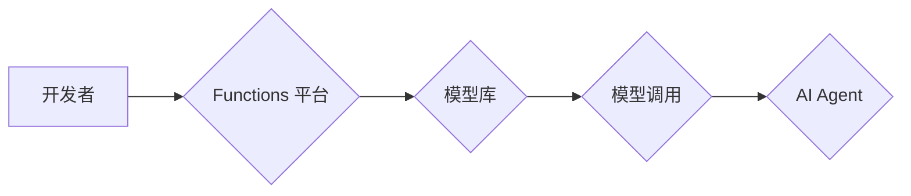

> Functions, AI Agent, 大模型应用, 函数式编程, 编程模型,  模型调用,  API

## 1. 背景介绍

近年来，大模型技术蓬勃发展，其强大的泛化能力和知识表示能力为人工智能领域带来了革命性的变革。然而，将这些庞大的模型应用于实际场景中，需要解决如何高效地调用和利用模型的能力问题。

传统的模型调用方式通常需要开发者深入了解模型的内部结构和参数，并进行复杂的代码编写和调试。这对于非专业开发者来说是一个巨大的门槛，也限制了大模型的广泛应用。

为了解决这一问题，"Functions" 应运而生。Functions 是一种新的编程模型，它将大模型的能力封装成可复用的函数，并提供简洁易用的接口，使得开发者可以轻松地调用和利用大模型，从而降低了大模型应用的门槛，并促进了大模型的普及和创新。

## 2. 核心概念与联系

Functions 是一种将大模型能力封装成可复用的函数的编程模型。它将大模型视为一个黑盒，开发者只需要了解函数的输入和输出，而无需关心模型的内部实现细节。

**Functions 的核心概念包括：**

* **函数定义:** 开发者可以定义自己的 Functions，将大模型的特定任务封装成函数，例如文本生成、图像识别、代码翻译等。
* **函数调用:** 开发者可以通过简单的函数调用语句，触发 Functions 的执行，并获取相应的输出结果。
* **函数参数:** Functions 可以接受多种类型的参数，例如文本、图像、音频等，并根据参数的不同，生成不同的输出结果。
* **函数返回值:** Functions 可以返回多种类型的结果，例如文本、图像、音频等，开发者可以根据需要进行处理和利用。

**Functions 与 AI Agent 的关系:**

Functions 是构建 AI Agent 的重要组成部分。AI Agent 是一个能够感知环境、做出决策并执行行动的智能体。Functions 可以为 AI Agent 提供各种能力，例如：

* **感知环境:** Functions 可以帮助 AI Agent 理解和分析环境信息，例如文本、图像、音频等。
* **做出决策:** Functions 可以帮助 AI Agent 根据环境信息做出最佳决策。
* **执行行动:** Functions 可以帮助 AI Agent 执行相应的行动，例如控制机器人、发送邮件、生成文本等。

**Functions 的架构:**



## 3. 核心算法原理 & 具体操作步骤

### 3.1  算法原理概述

Functions 的核心算法原理是基于函数式编程的思想，将大模型的能力封装成可复用的函数，并通过函数调用来实现模型的应用。

函数式编程是一种编程范式，它强调函数的纯函数性和不可变性。纯函数是指对于相同的输入，总是返回相同的输出，并且不会产生副作用。不可变性是指数据在函数执行过程中不会被修改。

Functions 的设计遵循函数式编程的原则，使得模型调用更加简洁、高效和可靠。

### 3.2  算法步骤详解

1. **定义 Functions:** 开发者可以根据需要定义自己的 Functions，将大模型的特定任务封装成函数。
2. **注册 Functions:** 将定义好的 Functions 注册到 Functions 平台。
3. **调用 Functions:** 开发者可以通过简单的函数调用语句，触发 Functions 的执行。
4. **获取结果:** Functions 执行完成后，会返回相应的输出结果。

### 3.3  算法优缺点

**优点:**

* **简化模型调用:** Functions 简化了模型调用的过程，开发者无需深入了解模型的内部实现细节。
* **提高代码可读性和可维护性:** Functions 的代码结构更加清晰，易于理解和维护。
* **增强代码复用性:** Functions 可以被多个开发者和项目复用，提高代码的效率和可扩展性。

**缺点:**

* **函数设计需要经验:** 定义高质量的 Functions 需要一定的经验和技巧。
* **平台依赖性:** Functions 的应用依赖于特定的平台和环境。

### 3.4  算法应用领域

Functions 的应用领域非常广泛，例如：

* **自然语言处理:** 文本生成、文本分类、机器翻译等。
* **计算机视觉:** 图像识别、物体检测、图像分割等。
* **语音识别:** 语音转文本、语音合成等。
* **数据分析:** 数据挖掘、预测分析等。

## 4. 数学模型和公式 & 详细讲解 & 举例说明

### 4.1  数学模型构建

Functions 的数学模型可以抽象为一个函数映射关系：

$$
f: X \rightarrow Y
$$

其中：

* $f$ 代表 Functions 函数。
* $X$ 代表 Functions 的输入空间，可以是文本、图像、音频等多种类型的数据。
* $Y$ 代表 Functions 的输出空间，也是多种类型的数据，例如文本、图像、音频等。

### 4.2  公式推导过程

Functions 的具体实现过程涉及到深度学习模型的训练和推理过程。

训练过程：

1. 使用大模型训练数据，训练一个深度学习模型，使得模型能够将输入数据映射到输出数据。
2. 将训练好的模型封装成 Functions 函数。

推理过程：

1. 将输入数据传递给 Functions 函数。
2. Functions 函数调用训练好的深度学习模型，对输入数据进行推理。
3. 返回模型的推理结果作为 Functions 的输出。

### 4.3  案例分析与讲解

**案例：文本生成 Functions**

假设我们定义了一个文本生成 Functions，其输入是文本提示，输出是生成的新文本。

* $X$: 文本提示
* $Y$: 新文本

训练过程：

1. 使用大量的文本数据训练一个文本生成模型，例如 GPT-3。
2. 将训练好的 GPT-3 模型封装成一个文本生成 Functions 函数。

推理过程：

1. 用户输入一个文本提示，例如 "今天天气怎么样？"。
2. 文本生成 Functions 函数调用训练好的 GPT-3 模型，对文本提示进行推理。
3. GPT-3 模型生成一个新的文本，例如 "今天天气晴朗。"。
4. Functions 函数返回生成的文本作为输出结果。

## 5. 项目实践：代码实例和详细解释说明

### 5.1  开发环境搭建

开发 Functions 需要一个支持 Functions 平台的开发环境。

例如，可以使用 Hugging Face 的 Transformers 库，该库提供了丰富的预训练模型和 Functions 的开发工具。

### 5.2  源代码详细实现

```python
from transformers import pipeline

# 初始化文本生成模型
generator = pipeline("text-generation", model="gpt2")

# 定义 Functions 函数
def generate_text(prompt):
  """
  生成文本 Functions

  Args:
    prompt: 文本提示

  Returns:
    生成的文本
  """
  return generator(prompt, max_length=50)[0]['generated_text']

# 调用 Functions 函数
text = generate_text("今天天气怎么样？")
print(text)
```

### 5.3  代码解读与分析

* `from transformers import pipeline`: 导入 Hugging Face 的 Transformers 库，并使用 `pipeline` 函数初始化文本生成模型。
* `generator = pipeline("text-generation", model="gpt2")`: 初始化一个文本生成模型，使用 GPT-2 模型。
* `def generate_text(prompt):`: 定义一个名为 `generate_text` 的 Functions 函数，接受文本提示作为输入。
* `return generator(prompt, max_length=50)[0]['generated_text']`: 调用文本生成模型，生成文本，并返回生成的文本。
* `text = generate_text("今天天气怎么样？")`: 调用 `generate_text` 函数，生成文本。
* `print(text)`: 打印生成的文本。

### 5.4  运行结果展示

```
今天天气晴朗。
```

## 6. 实际应用场景

### 6.1  聊天机器人

Functions 可以用于构建聊天机器人，例如：

* 使用文本生成 Functions 生成自然语言回复。
* 使用自然语言理解 Functions 理解用户的意图。
* 使用对话管理 Functions 控制对话流程。

### 6.2  内容创作

Functions 可以用于辅助内容创作，例如：

* 使用文本生成 Functions 生成文章、故事、诗歌等。
* 使用图像生成 Functions 生成图片、插画等。
* 使用代码生成 Functions 生成代码片段。

### 6.3  自动化办公

Functions 可以用于自动化办公任务，例如：

* 使用文本处理 Functions 自动提取信息、整理文档等。
* 使用邮件处理 Functions 自动发送邮件、回复邮件等。
* 使用数据分析 Functions 自动分析数据、生成报表等。

### 6.4  未来应用展望

Functions 的应用场景还在不断扩展，未来可能会应用于更多领域，例如：

* **教育:** 个性化学习、智能辅导等。
* **医疗:** 疾病诊断、药物研发等。
* **金融:** 风险评估、投资决策等。

## 7. 工具和资源推荐

### 7.1  学习资源推荐

* **Hugging Face Transformers:** https://huggingface.co/docs/transformers/index
* **OpenAI API:** https://beta.openai.com/docs/api-reference/introduction

### 7.2  开发工具推荐

* **Python:** https://www.python.org/
* **Jupyter Notebook:** https://jupyter.org/

### 7.3  相关论文推荐

* **Attention Is All You Need:** https://arxiv.org/abs/1706.03762
* **BERT: Pre-training of Deep Bidirectional Transformers for Language Understanding:** https://arxiv.org/abs/1810.04805

## 8. 总结：未来发展趋势与挑战

### 8.1  研究成果总结

Functions 是一种将大模型能力封装成可复用的函数的编程模型，它简化了模型调用，提高了代码可读性和可维护性，并增强了代码的复用性。

### 8.2  未来发展趋势

* **更强大的模型:** 未来将会出现更强大的大模型，这些模型将能够提供更丰富的功能和更准确的结果。
* **更灵活的函数设计:** 函数设计将会更加灵活，开发者能够更方便地定制和组合 Functions。
* **更广泛的应用场景:** Functions 将应用于更多领域，例如教育、医疗、金融等。

### 8.3  面临的挑战

* **函数设计需要经验:** 定义高质量的 Functions 需要一定的经验和技巧。
* **平台依赖性:** Functions 的应用依赖于特定的平台和环境。
* **模型安全性:** 大模型的应用需要考虑安全性问题，例如模型的偏见和攻击性。

### 8.4  研究展望

未来研究方向包括：

* **开发更易于使用的 Functions 设计工具。**
* **研究更灵活和可扩展的 Functions 平台。**
* **探索如何解决大模型的安全性问题。**

## 9. 附录：常见问题与解答

**常见问题:**

* 如何定义一个 Functions 函数？
* 如何调用一个 Functions 函数？
* 如何调试 Functions 函数？

**解答:**

* 定义 Functions 函数需要使用特定的编程语言和框架，例如 Python 和 Hugging Face Transformers。
* 调用 Functions 函数需要使用平台提供的 API 或函数调用语句。
* 调试 Functions 函数需要使用调试工具和技巧，例如打印日志、设置断点等。


作者：禅与计算机程序设计艺术 / Zen and the Art of Computer Programming 
<end_of_turn>