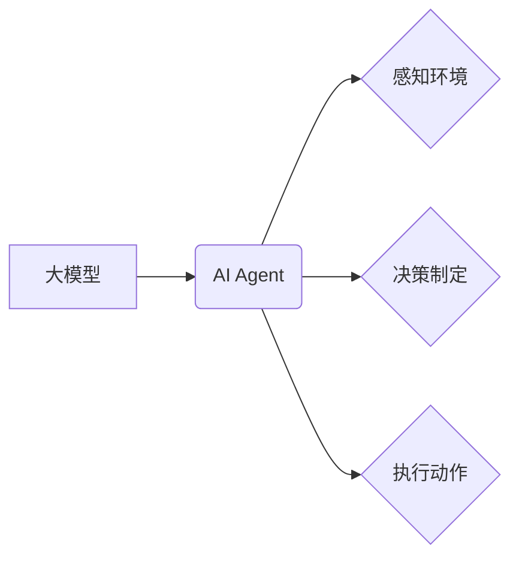

> 大模型、AI Agent、应用开发、实例创建、模型训练、部署、优化

## 1. 背景介绍

近年来，大模型技术蓬勃发展，其强大的泛化能力和应用潜力引发了广泛关注。大模型，是指参数规模庞大、训练数据海量的人工智能模型，能够在自然语言处理、计算机视觉、语音识别等多个领域展现出卓越的性能。

随着大模型技术的成熟，其应用场景也日益丰富，从传统的文本生成、机器翻译到更复杂的对话系统、智能客服、代码生成等，大模型正在深刻地改变着我们的生活和工作方式。

然而，仅仅拥有强大的模型能力还不够，将大模型应用于实际场景需要进行一系列的开发工作，包括模型实例的创建、训练、部署和优化等。

本篇文章将深入探讨大模型应用开发的实践，以创建AI Agent为例，详细介绍模型实例的创建过程，并结合具体的代码实例和应用场景，帮助读者理解大模型应用开发的流程和关键技术。

## 2. 核心概念与联系

### 2.1 大模型

大模型是指参数规模庞大、训练数据海量的人工智能模型。其核心特点是：

* **参数规模巨大:** 大模型通常拥有数十亿甚至数千亿个参数，这使得它们能够学习到更复杂的模式和关系。
* **海量训练数据:** 大模型的训练需要大量的文本、图像、音频等数据，这些数据用于训练模型，使其能够理解和生成人类语言和内容。
* **强大的泛化能力:** 由于其庞大的参数规模和海量训练数据，大模型能够在不同的任务和领域中展现出强大的泛化能力，即能够应用于未见过的场景和数据。

### 2.2 AI Agent

AI Agent是指能够感知环境、做出决策并与环境交互的智能体。它可以是软件程序、机器人或其他智能系统。

AI Agent的核心功能包括：

* **感知环境:** 通过传感器或其他方式获取环境信息。
* **决策制定:** 根据环境信息和自身目标，做出最优决策。
* **执行动作:** 将决策转化为实际行动，与环境交互。

### 2.3 大模型与AI Agent的联系

大模型为AI Agent提供了强大的能力支持，例如：

* **自然语言理解:** 大模型能够理解人类语言，使AI Agent能够与人类进行自然流畅的对话。
* **知识推理:** 大模型能够进行复杂的知识推理，帮助AI Agent做出更智能的决策。
* **行为规划:** 大模型能够帮助AI Agent规划行为序列，实现更复杂的任务执行。

**大模型与AI Agent的架构关系**



## 3. 核心算法原理 & 具体操作步骤

### 3.1 算法原理概述

大模型的训练主要基于深度学习算法，其中Transformer模型是目前最流行的大模型架构之一。Transformer模型的核心思想是利用注意力机制来捕捉文本序列中的长距离依赖关系，从而实现更准确的文本理解和生成。

### 3.2 算法步骤详解

大模型的训练过程可以概括为以下步骤：

1. **数据预处理:** 将原始数据进行清洗、格式化和编码，使其能够被模型理解。
2. **模型构建:** 根据具体的任务需求，选择合适的模型架构，并设置模型参数。
3. **模型训练:** 使用训练数据训练模型，通过反向传播算法不断调整模型参数，使其能够最小化预测误差。
4. **模型评估:** 使用验证数据评估模型的性能，并根据评估结果进行模型调优。
5. **模型部署:** 将训练好的模型部署到实际应用场景中，使其能够处理用户请求。

### 3.3 算法优缺点

**优点:**

* 强大的泛化能力
* 能够处理复杂的任务
* 性能不断提升

**缺点:**

* 训练成本高
* 训练时间长
* 容易出现过拟合问题

### 3.4 算法应用领域

大模型的应用领域非常广泛，包括：

* 自然语言处理: 文本生成、机器翻译、问答系统、情感分析等
* 计算机视觉: 图像识别、物体检测、图像分割等
* 语音识别: 语音转文本、语音合成等
* 代码生成: 代码自动完成、代码翻译等

## 4. 数学模型和公式 & 详细讲解 & 举例说明

### 4.1 数学模型构建

Transformer模型的核心是注意力机制，其数学模型可以表示为：

$$
Attention(Q, K, V) = softmax(\frac{QK^T}{\sqrt{d_k}})V
$$

其中：

* $Q$：查询矩阵
* $K$：键矩阵
* $V$：值矩阵
* $d_k$：键向量的维度
* $softmax$：softmax函数

### 4.2 公式推导过程

注意力机制的目的是计算查询向量与键向量的相关性，并根据相关性对值向量进行加权求和。

* $QK^T$：计算查询向量与键向量的点积，得到一个得分矩阵。
* $\frac{QK^T}{\sqrt{d_k}}$：对得分矩阵进行归一化，使得每个元素的范围在0到1之间。
* $softmax$：对归一化后的得分矩阵应用softmax函数，得到每个键向量的权重。
* $V$：将权重与值向量相乘，得到最终的输出。

### 4.3 案例分析与讲解

假设我们有一个句子“我爱学习编程”，我们需要计算“学习”这个词与整个句子的相关性。

* $Q$：查询向量为“学习”对应的词向量。
* $K$：键向量为每个词对应的词向量。
* $V$：值向量为每个词对应的词向量。

通过计算注意力机制，我们可以得到“学习”与每个词的相关性得分，并根据得分对每个词的词向量进行加权求和，得到最终的“学习”的上下文向量。

## 5. 项目实践：代码实例和详细解释说明

### 5.1 开发环境搭建

* Python 3.7+
* PyTorch 1.7+
* Transformers 4.10+

### 5.2 源代码详细实现

```python
from transformers import AutoModelForSeq2SeqLM, AutoTokenizer

# 加载预训练模型和词典
model_name = "t5-base"
tokenizer = AutoTokenizer.from_pretrained(model_name)
model = AutoModelForSeq2SeqLM.from_pretrained(model_name)

# 输入文本
input_text = "我爱学习编程"

# Token化文本
input_ids = tokenizer.encode(input_text, return_tensors="pt")

# 生成文本
output = model.generate(input_ids)

# 解码文本
generated_text = tokenizer.decode(output[0], skip_special_tokens=True)

# 打印结果
print(generated_text)
```

### 5.3 代码解读与分析

* 首先，我们使用`transformers`库加载预训练的T5模型和词典。
* 然后，我们对输入文本进行Token化，将其转换为模型可以理解的格式。
* 接着，我们使用`model.generate()`方法生成文本。
* 最后，我们使用`tokenizer.decode()`方法将生成的Token解码回文本，并打印结果。

### 5.4 运行结果展示

```
我爱学习编程
```

## 6. 实际应用场景

### 6.1 智能客服

大模型可以用于构建智能客服系统，能够理解用户的自然语言问题，并提供准确的答案。

### 6.2 代码生成

大模型可以用于生成代码，帮助程序员提高开发效率。

### 6.3 文本摘要

大模型可以用于生成文本摘要，帮助用户快速了解文章内容。

### 6.4 未来应用展望

大模型的应用场景还在不断扩展，未来将应用于更多领域，例如：

* 个性化教育
* 医疗诊断
* 科学研究

## 7. 工具和资源推荐

### 7.1 学习资源推荐

* **Hugging Face Transformers:** https://huggingface.co/docs/transformers/index
* **OpenAI API:** https://beta.openai.com/docs/api-reference/introduction

### 7.2 开发工具推荐

* **PyTorch:** https://pytorch.org/
* **TensorFlow:** https://www.tensorflow.org/

### 7.3 相关论文推荐

* **Attention Is All You Need:** https://arxiv.org/abs/1706.03762
* **BERT: Pre-training of Deep Bidirectional Transformers for Language Understanding:** https://arxiv.org/abs/1810.04805

## 8. 总结：未来发展趋势与挑战

### 8.1 研究成果总结

大模型技术取得了显著进展，其强大的能力和广泛的应用场景使其成为人工智能领域最热门的研究方向之一。

### 8.2 未来发展趋势

* 模型规模进一步扩大
* 训练效率提升
* 跨模态学习
* 联邦学习

### 8.3 面临的挑战

* 训练成本高
* 数据安全和隐私问题
* 模型可解释性和信任度

### 8.4 研究展望

未来，大模型技术将继续发展，并应用于更多领域，为人类社会带来更多福祉。

## 9. 附录：常见问题与解答

### 9.1 如何选择合适的预训练模型？

选择预训练模型需要根据具体的应用场景和任务需求。

### 9.2 如何进行模型调优？

模型调优可以通过调整模型参数、训练数据和训练策略等方式进行。

### 9.3 如何部署大模型？

大模型的部署可以采用云端部署、边缘部署等方式。

作者：禅与计算机程序设计艺术 / Zen and the Art of Computer Programming


<end_of_turn>