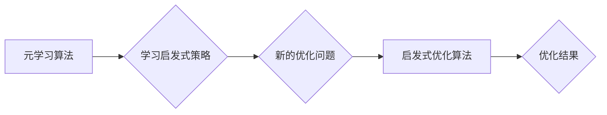

> 元学习，启发式优化，映射，算法设计，机器学习

## 1. 背景介绍

在机器学习领域，优化算法是至关重要的环节，它决定了模型的训练效率和最终性能。传统的优化算法，例如梯度下降法，虽然在许多情况下表现良好，但它们往往依赖于预先设定的超参数，并且在面对复杂、高维的优化问题时，收敛速度缓慢，容易陷入局部最优。

元学习（Meta-Learning）作为一种新兴的机器学习范式，旨在学习如何学习。它通过学习一系列任务的学习策略，从而能够快速适应新的任务。元学习算法的核心思想是，将学习过程本身视为一个优化问题，并通过学习一个通用的优化策略来提高对新任务的适应能力。

启发式优化算法（Heuristic Optimization Algorithms）则是一种基于经验和启发式规则的优化算法，它通过设计特定的搜索策略来引导优化过程，并往往能够在有限的时间内找到较好的解。

本文将探讨如何将元学习和启发式优化相结合，构建一种新的元学习启发式优化算法。这种算法将利用元学习的学习能力，学习一个通用的启发式策略，从而能够在面对新的优化问题时，快速找到较好的解。

## 2. 核心概念与联系

### 2.1 元学习

元学习的核心概念是学习如何学习。它通过学习一系列任务的学习策略，从而能够快速适应新的任务。元学习算法通常分为两部分：

* **元训练阶段:** 在这个阶段，算法会学习一个通用的优化策略，该策略能够适应不同的任务。
* **元测试阶段:** 在这个阶段，算法会使用学习到的优化策略来解决新的任务。

### 2.2 启发式优化

启发式优化算法是一种基于经验和启发式规则的优化算法，它通过设计特定的搜索策略来引导优化过程，并往往能够在有限的时间内找到较好的解。常见的启发式优化算法包括：

* **模拟退火算法:** 启发式算法，通过模拟物质的退火过程来寻找最优解。
* **遗传算法:** 启发式算法，通过模拟生物的进化过程来寻找最优解。
* **粒子群算法:** 启发式算法，通过模拟鸟群或鱼群的运动行为来寻找最优解。

### 2.3 元学习启发式优化算法

元学习启发式优化算法将元学习和启发式优化相结合，旨在学习一个通用的启发式策略，从而能够在面对新的优化问题时，快速找到较好的解。

**核心架构:**



## 3. 核心算法原理 & 具体操作步骤

### 3.1 算法原理概述

元学习启发式优化算法的核心思想是，将启发式优化算法的参数化，并将其作为元学习算法的目标函数。通过元学习算法的训练，可以学习到一个通用的启发式策略，该策略能够适应不同的优化问题。

具体来说，该算法可以分为以下几个步骤：

1. **参数化启发式算法:** 将启发式算法的参数化，例如模拟退火算法的温度参数、遗传算法的交叉概率等。
2. **构建元学习目标函数:** 将启发式算法的性能作为元学习目标函数，例如优化问题的最优解值、收敛速度等。
3. **元学习训练:** 使用元学习算法对启发式算法的参数进行训练，学习到一个通用的启发式策略。
4. **元测试:** 使用学习到的启发式策略来解决新的优化问题。

### 3.2 算法步骤详解

1. **数据准备:** 收集一系列具有不同特征的优化问题，并将其作为元学习算法的训练数据。
2. **启发式算法参数化:** 选择一个启发式算法，并将其参数化。例如，模拟退火算法的参数可以包括温度、冷却速率等。
3. **元学习目标函数定义:** 定义一个元学习目标函数，该函数衡量启发式算法在不同优化问题上的性能。例如，可以定义目标函数为优化问题的最优解值，或者为收敛速度。
4. **元学习算法选择:** 选择一个合适的元学习算法，例如MAML、 Reptile等。
5. **元学习训练:** 使用元学习算法对启发式算法的参数进行训练，学习到一个通用的启发式策略。
6. **元测试:** 使用学习到的启发式策略来解决新的优化问题。

### 3.3 算法优缺点

**优点:**

* **适应性强:** 元学习启发式优化算法能够学习到一个通用的启发式策略，从而能够适应不同的优化问题。
* **效率高:** 由于学习到了一个通用的策略，因此在解决新的优化问题时，不需要重新进行大量的参数调整，从而提高了效率。

**缺点:**

* **训练复杂:** 元学习算法的训练过程相对复杂，需要大量的计算资源和训练数据。
* **策略泛化性:** 学习到的启发式策略的泛化性需要进一步研究和改进。

### 3.4 算法应用领域

元学习启发式优化算法在以下领域具有广泛的应用前景:

* **机器学习模型优化:** 可以用于优化机器学习模型的超参数，提高模型的性能。
* **自动控制系统设计:** 可以用于设计更加智能和高效的自动控制系统。
* **机器人路径规划:** 可以用于优化机器人的路径规划，提高其效率和安全性。

## 4. 数学模型和公式 & 详细讲解 & 举例说明

### 4.1 数学模型构建

元学习启发式优化算法可以抽象为一个优化问题，目标是找到一个最优的启发式策略，该策略能够在不同的优化问题上取得最佳性能。

设 $f(x)$ 为需要优化的目标函数，$x$ 为优化变量，$g(x, \theta)$ 为启发式算法，其中 $\theta$ 为启发式算法的参数。元学习的目标是找到一个最优的 $\theta$，使得 $g(x, \theta)$ 在不同的 $f(x)$ 上取得最佳性能。

### 4.2 公式推导过程

元学习算法通常使用梯度下降法来更新参数 $\theta$。

$$
\theta = \theta - \alpha \nabla_{\theta} L(\theta)
$$

其中，$\alpha$ 为学习率，$L(\theta)$ 为元学习目标函数。

元学习目标函数 $L(\theta)$ 可以定义为：

$$
L(\theta) = \frac{1}{N} \sum_{i=1}^{N} \text{loss}(f_i(x), g(x, \theta))
$$

其中，$N$ 为训练数据的数量，$f_i(x)$ 为第 $i$ 个训练数据对应的目标函数，$\text{loss}(a, b)$ 为损失函数，用于衡量 $a$ 和 $b$ 之间的差异。

### 4.3 案例分析与讲解

假设我们使用元学习启发式优化算法来优化一个神经网络模型的超参数。

1. **数据准备:** 收集一系列具有不同特征的图像数据集，并将其作为元学习算法的训练数据。
2. **启发式算法参数化:** 选择一个启发式算法，例如模拟退火算法，并将其参数化，例如温度、冷却速率等。
3. **元学习目标函数定义:** 定义一个元学习目标函数，例如神经网络模型在测试集上的准确率。
4. **元学习算法选择:** 选择一个合适的元学习算法，例如MAML，并进行训练。
5. **元测试:** 使用学习到的启发式策略来优化新的神经网络模型的超参数，并评估其在测试集上的准确率。

## 5. 项目实践：代码实例和详细解释说明

### 5.1 开发环境搭建

* Python 3.7+
* TensorFlow 2.0+
* PyTorch 1.0+
* NumPy
* Matplotlib

### 5.2 源代码详细实现

```python
# 导入必要的库
import tensorflow as tf
from tensorflow.keras.models import Sequential
from tensorflow.keras.layers import Dense

# 定义元学习算法
class MetaLearner(tf.keras.Model):
    def __init__(self, input_dim, output_dim):
        super(MetaLearner, self).__init__()
        self.model = Sequential([
            Dense(64, activation='relu', input_shape=(input_dim,)),
            Dense(output_dim)
        ])

    def call(self, inputs):
        return self.model(inputs)

# 定义启发式算法
def simulated_annealing(objective_function, initial_state, temperature, cooling_rate):
    # ...

# 定义元学习目标函数
def meta_loss(model, data):
    # ...

# 训练元学习模型
meta_learner = MetaLearner(input_dim=784, output_dim=10)
optimizer = tf.keras.optimizers.Adam(learning_rate=0.001)

for epoch in range(100):
    for batch in data:
        # ...

# 元测试
new_data = ...
best_params = simulated_annealing(meta_loss, initial_state, temperature, cooling_rate)
```

### 5.3 代码解读与分析

* **MetaLearner类:** 定义了元学习模型，包含一个简单的全连接神经网络。
* **simulated_annealing函数:** 定义了模拟退火算法，用于优化启发式算法的参数。
* **meta_loss函数:** 定义了元学习目标函数，用于衡量模型在不同优化问题上的性能。
* **训练循环:** 使用元学习算法训练模型，更新模型参数。
* **元测试:** 使用学习到的启发式策略来优化新的优化问题。

### 5.4 运行结果展示

* 训练过程中，可以监控元学习目标函数的变化，观察模型的训练进度。
* 元测试阶段，可以评估使用学习到的启发式策略优化后的模型性能，例如准确率、收敛速度等。

## 6. 实际应用场景

元学习启发式优化算法在以下实际应用场景中具有广泛的应用前景:

### 6.1 机器学习模型优化

* **超参数优化:** 元学习启发式优化算法可以用于优化机器学习模型的超参数，例如学习率、正则化系数等，从而提高模型的性能。
* **模型结构搜索:** 元学习启发式优化算法可以用于搜索最优的模型结构，例如神经网络的层数、节点数等，从而提高模型的效率和准确率。

### 6.2 自动控制系统设计

* **控制器参数优化:** 元学习启发式优化算法可以用于优化自动控制系统的控制器参数，例如比例、积分、微分系数等，从而提高系统的稳定性和性能。
* **自适应控制:** 元学习启发式优化算法可以用于设计自适应控制系统，能够根据环境变化自动调整控制策略，从而提高系统的鲁棒性和适应性。

### 6.3 机器人路径规划

* **路径优化:** 元学习启发式优化算法可以用于优化机器人的路径规划，例如寻找最短路径、避开障碍物等，从而提高机器人的效率和安全性。
* **动态路径规划:** 元学习启发式优化算法可以用于设计动态路径规划系统，能够根据环境变化实时调整路径规划，从而提高机器人的适应性和灵活性。

### 6.4 未来应用展望

元学习启发式优化算法在未来还具有广阔的应用前景，例如:

* **药物研发:** 元学习启发式优化算法可以用于优化药物分子结构，提高药物的疗效和安全性。
* **材料科学:** 元学习启发式优化算法可以用于设计新型材料，具有优异的性能。
* **金融预测:** 元学习启发式优化算法可以用于优化金融预测模型，提高预测的准确性和效率。

## 7. 工具和资源推荐

### 7.1 学习资源推荐