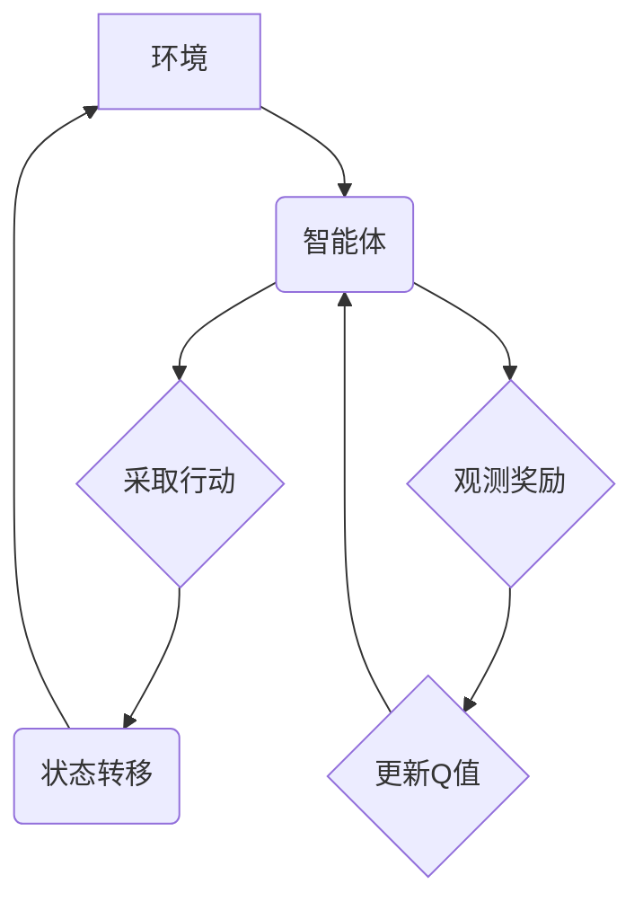

> 深度强化学习，DQN，Q-learning，贝尔曼方程，神经网络，逆向工程，决策过程

## 1. 背景介绍

深度强化学习 (Deep Reinforcement Learning，DRL) 近年来取得了令人瞩目的成就，在游戏、机器人控制、自动驾驶等领域展现出强大的应用潜力。其中，深度Q网络 (Deep Q-Network，DQN) 作为DRL领域的重要里程碑，成功将深度神经网络与Q-learning算法相结合，为解决复杂决策问题提供了新的思路。

然而，对于许多开发者和研究者来说，DQN的内部工作机制仍然显得较为神秘。本文将通过逆向工程的方式，深入剖析DQN的决策过程，帮助读者理解其核心原理、算法流程以及应用场景。

## 2. 核心概念与联系

DQN的核心思想是利用深度神经网络来逼近Q函数，从而实现对复杂环境的智能决策。

**2.1 核心概念**

* **强化学习 (Reinforcement Learning，RL):** 一种机器学习范式，通过强化信号 (reward) 来训练智能体，使其在环境中采取最优行动以最大化累积回报。
* **Q-learning:** 一种经典的强化学习算法，通过学习Q值表来评估不同状态下采取不同行动的价值。Q值表是一个存储所有状态-动作对价值的表格。
* **深度神经网络 (Deep Neural Network，DNN):** 一种能够学习复杂非线性映射的网络结构，常用于处理高维数据和复杂任务。

**2.2 核心架构**

DQN将Q-learning算法与深度神经网络相结合，构建了一个新的决策框架。



**2.3 核心联系**

DQN的核心在于利用深度神经网络来逼近Q函数，从而实现对Q值表的学习和更新。

## 3. 核心算法原理 & 具体操作步骤

### 3.1 算法原理概述

DQN的核心算法原理是基于Q-learning算法，但它将Q值表替换为一个深度神经网络。

DQN算法的目标是学习一个能够预测状态-动作对价值的Q函数，即Q(s, a)。

* **状态 (s):** 智能体所处的环境状态。
* **动作 (a):** 智能体可以采取的行动。
* **Q值 (Q(s, a)):** 在状态s下采取动作a的期望累积回报。

DQN算法通过以下步骤来学习Q函数：

1. **初始化:** 初始化深度神经网络参数。
2. **采样:** 从环境中采样状态-动作对 (s, a)。
3. **评估:** 使用神经网络评估状态-动作对的Q值 Q(s, a)。
4. **更新:** 根据贝尔曼方程更新神经网络参数，以最小化Q值与实际回报之间的误差。

### 3.2 算法步骤详解

1. **环境初始化:** 智能体从初始状态开始，并与环境交互。
2. **状态观测:** 智能体观测当前环境状态。
3. **动作选择:** 智能体根据当前状态和学习到的Q值选择一个动作。
4. **环境反馈:** 智能体执行动作，环境给出相应的奖励和下一个状态。
5. **经验存储:** 将状态-动作-奖励-下一个状态的四元组存储到经验池中。
6. **经验回放:** 从经验池中随机采样多个状态-动作-奖励-下一个状态的四元组。
7. **Q值更新:** 使用采样的经验数据更新神经网络参数，以最小化Q值与实际回报之间的误差。

### 3.3 算法优缺点

**优点:**

* **能够处理高维状态空间:** 深度神经网络能够学习复杂非线性映射，适用于高维状态空间。
* **能够学习复杂策略:** DQN能够学习复杂的策略，并适应动态变化的环境。

**缺点:**

* **训练过程复杂:** DQN的训练过程需要大量的经验数据和计算资源。
* **容易陷入局部最优:** DQN可能会陷入局部最优解，无法找到全局最优策略。

### 3.4 算法应用领域

DQN在以下领域具有广泛的应用前景:

* **游戏:** 
* **机器人控制:**
* **自动驾驶:**
* **医疗诊断:**
* **金融交易:**

## 4. 数学模型和公式 & 详细讲解 & 举例说明

### 4.1 数学模型构建

DQN的核心数学模型是Q函数，它用来评估在特定状态下采取特定动作的期望累积回报。

**Q函数定义:**

$$Q(s, a) = E[\sum_{t=0}^{\infty} \gamma^t r_{t+1} | s_t = s, a_t = a]$$

其中:

* $s$ 是当前状态。
* $a$ 是当前动作。
* $r_{t+1}$ 是在时间步t+1获得的奖励。
* $\gamma$ 是折扣因子，控制未来奖励的权重。

### 4.2 公式推导过程

DQN算法的目标是通过最小化Q值与实际回报之间的误差来更新神经网络参数。

**贝尔曼方程:**

$$Q(s, a) = r + \gamma \max_{a'} Q(s', a')$$

其中:

* $s'$ 是下一个状态。
* $a'$ 是下一个状态下采取的动作。

**损失函数:**

$$L = E[(y - Q(s, a))^2]$$

其中:

* $y$ 是目标Q值，由贝尔曼方程计算得到。

### 4.3 案例分析与讲解

假设一个智能体在玩一个简单的游戏，目标是收集尽可能多的金币。

* **状态:** 智能体的当前位置。
* **动作:** 向上、向下、向左、向右移动。
* **奖励:** 收集金币获得正奖励，撞墙或跌落获得负奖励。

DQN算法可以学习一个Q函数，来评估在每个状态下采取每个动作的期望累积回报。

例如，如果智能体在某个位置上，向右移动可以获得更高的奖励，那么DQN算法会学习到这个位置下采取向右移动动作的Q值更高。

## 5. 项目实践：代码实例和详细解释说明

### 5.1 开发环境搭建

* Python 3.x
* TensorFlow 或 PyTorch
* OpenAI Gym

### 5.2 源代码详细实现

```python
import tensorflow as tf
import numpy as np

# 定义DQN网络结构
class DQN(tf.keras.Model):
    def __init__(self, state_size, action_size):
        super(DQN, self).__init__()
        self.dense1 = tf.keras.layers.Dense(64, activation='relu')
        self.dense2 = tf.keras.layers.Dense(64, activation='relu')
        self.output = tf.keras.layers.Dense(action_size)

    def call(self, state):
        x = self.dense1(state)
        x = self.dense2(x)
        return self.output(x)

# 定义DQN算法
class DQNAgent:
    def __init__(self, state_size, action_size, learning_rate=0.001, gamma=0.99, epsilon=1.0, epsilon_decay=0.995, epsilon_min=0.01):
        self.state_size = state_size
        self.action_size = action_size
        self.learning_rate = learning_rate
        self.gamma = gamma
        self.epsilon = epsilon
        self.epsilon_decay = epsilon_decay
        self.epsilon_min = epsilon_min
        self.model = DQN(state_size, action_size)
        self.optimizer = tf.keras.optimizers.Adam(learning_rate=self.learning_rate)

    def choose_action(self, state):
        if np.random.rand() < self.epsilon:
            return np.random.randint(self.action_size)
        else:
            q_values = self.model(state)
            return np.argmax(q_values[0])

    def train(self, state, action, reward, next_state, done):
        with tf.GradientTape() as tape:
            target_q_values = reward + self.gamma * tf.reduce_max(self.model(next_state), axis=1) * (1 - done)
            q_values = self.model(state)
            loss = tf.keras.losses.MeanSquaredError()(target_q_values, q_values[0, action])
        gradients = tape.gradient(loss, self.model.trainable_variables)
        self.optimizer.apply_gradients(zip(gradients, self.model.trainable_variables))

        self.epsilon = max(self.epsilon * self.epsilon_decay, self.epsilon_min)

### 5.3 代码解读与分析

* **DQN网络结构:** DQN网络是一个简单的多层感知机，包含两层全连接层和一层输出层。
* **DQN算法:** DQN算法使用经验回放和目标网络来稳定训练过程。
* **训练过程:** DQN算法通过最小化Q值与实际回报之间的误差来更新神经网络参数。

### 5.4 运行结果展示

运行DQN算法后，智能体可以学习到在不同状态下采取不同动作的策略，并最终达到目标。

## 6. 实际应用场景

DQN算法在以下领域具有广泛的应用前景:

### 6.1 游戏

DQN算法可以用于训练游戏AI，例如AlphaGo、AlphaZero等。

### 6.2 机器人控制

DQN算法可以用于训练机器人控制策略，例如机器人导航、抓取等。

### 6.3 自动驾驶

DQN算法可以用于训练自动驾驶汽车的决策策略，例如路径规划、避障等。

### 6.4 医疗诊断

DQN算法可以用于辅助医生进行医疗诊断，例如图像识别、疾病预测等。

### 6.5 金融交易

DQN算法可以用于开发智能交易系统，例如股票交易、风险管理等。

## 7. 工具和资源推荐

### 7.1 学习资源推荐

* **书籍:**
    * Deep Reinforcement Learning Hands-On
    * Reinforcement Learning: An Introduction
* **课程:**
    * Deep Reinforcement Learning Specialization (Coursera)
    * Reinforcement Learning (Udacity)
* **博客:**
    * OpenAI Blog
    * DeepMind Blog

### 7.2 开发工具推荐

* **TensorFlow:**
* **PyTorch:**
* **OpenAI Gym:**

### 7.3 相关论文推荐

* **Playing Atari with Deep Reinforcement Learning (Mnih et al., 2013)**
* **Human-level control through deep reinforcement learning (Mnih et al., 2015)**
* **Deep Q-Networks (Mnih et al., 2015)**

## 8. 总结：未来发展趋势与挑战

### 8.1 研究成果总结

DQN算法取得了显著的成果，在游戏、机器人控制等领域取得了突破性进展。

### 8.2 未来发展趋势

* **更强大的算法:** 研究更强大的强化学习算法，例如强化学习与迁移学习的结合。
* **更复杂的应用场景:** 将DQN算法应用于更复杂的现实世界问题，例如自动驾驶、医疗诊断等。
* **更安全的算法:** 研究更安全的强化学习算法，避免算法出现不可预知的行为。

### 8.3 面临的挑战

* **数据效率:** 强化学习算法需要大量的经验数据，如何提高数据效率是重要的挑战。
* **样本复杂性:** 强化学习算法的样本复杂性较高，如何降低样本复杂性是重要的研究方向