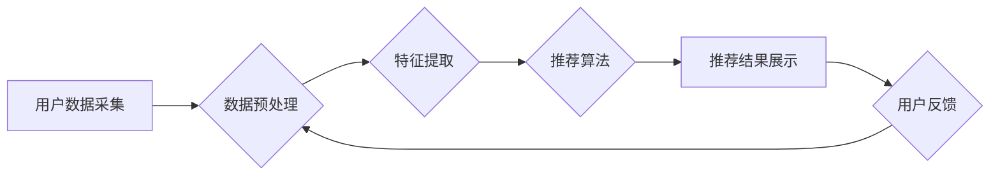

> 个性化推荐系统，电商，协同过滤，内容过滤，矩阵分解，深度学习，推荐算法，用户行为分析

## 1. 背景介绍

在当今数据爆炸的时代，电商平台面临着海量商品和用户，如何精准地将用户与感兴趣的商品匹配，提升用户体验和转化率成为了一个关键问题。个性化推荐系统应运而生，它通过分析用户的历史行为、偏好和兴趣，为用户提供个性化的商品推荐，从而提高用户满意度、促进销售额增长。

电商平台的个性化推荐系统主要应用于以下场景：

* **商品推荐:** 根据用户的浏览历史、购买记录、收藏列表等信息，推荐用户可能感兴趣的商品。
* **分类推荐:** 根据用户的兴趣偏好，推荐用户可能感兴趣的商品分类。
* **新品推荐:** 推送新上架的商品，吸引用户关注。
* **关联推荐:** 根据用户购买的商品，推荐其他相关商品。
* **个性化广告:** 根据用户的兴趣和行为，推送个性化的广告信息。

## 2. 核心概念与联系

个性化推荐系统的核心是理解用户的需求和偏好，并根据这些信息推荐合适的商品。

**2.1 核心概念**

* **用户:** 个性化推荐系统的核心对象，每个用户都有其独特的兴趣、偏好和行为模式。
* **商品:** 需要被推荐的对象，每个商品都有其自身的属性、特征和标签。
* **交互:** 用户与商品之间的互动行为，例如浏览、点击、购买、收藏等。
* **推荐策略:** 根据用户和商品信息，确定推荐商品的算法和规则。

**2.2 系统架构**



**2.3 核心技术**

个性化推荐系统主要依赖以下核心技术：

* **数据挖掘:** 从海量用户行为数据中挖掘用户兴趣、偏好和模式。
* **机器学习:** 利用机器学习算法，构建用户画像和商品特征模型，实现精准推荐。
* **自然语言处理:** 分析用户评论、描述等文本数据，提取商品属性和用户情感信息。
* **云计算:** 利用云计算平台的强大计算能力和存储资源，处理海量数据和模型训练。

## 3. 核心算法原理 & 具体操作步骤

### 3.1  算法原理概述

个性化推荐系统常用的算法主要分为两大类：

* **协同过滤:** 基于用户的相似度或商品的相似度进行推荐。
* **内容过滤:** 基于商品的属性和特征进行推荐。

**3.1.1 协同过滤**

协同过滤算法的核心思想是：

* **用户-用户协同过滤:** 如果用户A和用户B对相似的商品有相同的喜好，那么用户A可能也喜欢用户B喜欢的商品。
* **商品-商品协同过滤:** 如果商品A和商品B经常被用户一起购买，那么用户可能也喜欢商品A和商品B。

**3.1.2 内容过滤**

内容过滤算法的核心思想是：

* 分析商品的属性和特征，例如商品类别、品牌、价格、描述等。
* 根据用户的兴趣偏好，推荐与用户兴趣相符的商品。

### 3.2  算法步骤详解

**3.2.1 协同过滤算法步骤**

1. **数据收集:** 收集用户对商品的交互数据，例如浏览记录、购买记录、评分等。
2. **数据预处理:** 处理数据，例如去除缺失值、处理异常值、将数据转化为合适的格式。
3. **相似度计算:** 计算用户之间的相似度或商品之间的相似度。常用的相似度计算方法包括余弦相似度、皮尔逊相关系数等。
4. **推荐生成:** 根据用户与商品的相似度，生成推荐列表。

**3.2.2 内容过滤算法步骤**

1. **商品特征提取:** 从商品描述、属性等信息中提取商品特征。
2. **用户兴趣建模:** 根据用户的历史行为数据，构建用户的兴趣模型。
3. **推荐生成:** 根据商品特征和用户的兴趣模型，计算商品与用户的匹配度，生成推荐列表。

### 3.3  算法优缺点

**3.3.1 协同过滤算法**

* **优点:** 可以发现用户之间的隐性关系，推荐更个性化的商品。
* **缺点:** 数据稀疏性问题，当用户对商品的交互数据较少时，难以计算出准确的相似度。冷启动问题，对于新用户和新商品，难以进行推荐。

**3.3.2 内容过滤算法**

* **优点:** 不需要用户历史交互数据，可以对新用户和新商品进行推荐。
* **缺点:** 难以捕捉用户之间的隐性关系，推荐结果可能不够个性化。

### 3.4  算法应用领域

协同过滤和内容过滤算法广泛应用于以下领域：

* **电商推荐:** 推荐商品、分类、新品等。
* **视频网站推荐:** 推荐视频、电视剧、电影等。
* **音乐平台推荐:** 推荐歌曲、专辑、歌手等。
* **社交媒体推荐:** 推荐好友、群组、话题等。

## 4. 数学模型和公式 & 详细讲解 & 举例说明

### 4.1  数学模型构建

**4.1.1 协同过滤模型**

协同过滤模型通常使用矩阵分解技术，将用户-商品交互矩阵分解成两个低维矩阵，分别表示用户特征和商品特征。

* **用户特征矩阵:**  每个行代表一个用户，每个列代表一个特征维度，每个元素表示用户在该特征维度上的得分。
* **商品特征矩阵:** 每个行代表一个商品，每个列代表一个特征维度，每个元素表示商品在该特征维度上的得分。

**4.1.2 内容过滤模型**

内容过滤模型通常使用向量空间模型，将商品和用户表示为向量。

* **商品向量:** 每个维度代表一个商品特征，每个元素表示商品在该特征上的得分。
* **用户向量:** 每个维度代表一个用户兴趣，每个元素表示用户对该兴趣的偏好程度。

### 4.2  公式推导过程

**4.2.1 协同过滤模型公式**

用户对商品的评分可以表示为用户特征和商品特征的内积：

$$
r_{ui} = \mathbf{u}_i^T \mathbf{v}_j
$$

其中：

* $r_{ui}$ 表示用户 $i$ 对商品 $j$ 的评分。
* $\mathbf{u}_i$ 表示用户 $i$ 的特征向量。
* $\mathbf{v}_j$ 表示商品 $j$ 的特征向量。
* $^T$ 表示转置。

**4.2.2 内容过滤模型公式**

用户对商品的评分可以表示为用户向量和商品向量的点积：

$$
r_{ui} = \mathbf{u}_i \cdot \mathbf{v}_j
$$

其中：

* $r_{ui}$ 表示用户 $i$ 对商品 $j$ 的评分。
* $\mathbf{u}_i$ 表示用户 $i$ 的兴趣向量。
* $\mathbf{v}_j$ 表示商品 $j$ 的特征向量。
* $\cdot$ 表示点积。

### 4.3  案例分析与讲解

**4.3.1 协同过滤案例**

假设有两个用户 A 和 B，他们对以下两本书进行了评分：

* 书 A: 用户 A 给出 5 分，用户 B 给出 4 分。
* 书 B: 用户 A 给出 3 分，用户 B 给出 5 分。

我们可以使用协同过滤算法计算用户 A 和用户 B 的相似度，并根据相似度推荐书籍。

**4.3.2 内容过滤案例**

假设有一个用户喜欢阅读科幻小说，我们可以根据用户的兴趣偏好，推荐其他科幻小说。

## 5. 项目实践：代码实例和详细解释说明

### 5.1  开发环境搭建

* **操作系统:** Linux/macOS/Windows
* **编程语言:** Python
* **库依赖:** pandas, numpy, scikit-learn, tensorflow/pytorch

### 5.2  源代码详细实现

```python
# 协同过滤算法示例代码

import pandas as pd
from sklearn.metrics.pairwise import cosine_similarity

# 加载用户-商品交互数据
data = pd.read_csv('user_item_interactions.csv')

# 构建用户-商品交互矩阵
user_item_matrix = data.pivot_table(index='user_id', columns='item_id', values='rating')

# 计算用户相似度
user_similarity = cosine_similarity(user_item_matrix)

# 获取用户 A 的相似用户
user_A_id = 1
similar_users = user_similarity[user_A_id].argsort()[:-6:-1]  # 排序获取相似用户

# 推荐商品
recommended_items = []
for user_B_id in similar_users:
    for item_id in user_item_matrix.columns:
        if user_item_matrix.loc[user_B_id, item_id] > 0 and item_id not in recommended_items:
            recommended_items.append(item_id)

# 打印推荐结果
print(f'用户 {user_A_id} 的推荐商品: {recommended_items}')
```

### 5.3  代码解读与分析

* **数据加载:** 从 CSV 文件中加载用户-商品交互数据。
* **交互矩阵构建:** 将数据转换为用户-商品交互矩阵，其中每个元素表示用户对商品的评分。
* **相似度计算:** 使用余弦相似度计算用户之间的相似度。
* **相似用户获取:** 根据用户 A 的相似度排序，获取其相似用户。
* **推荐商品:** 从相似用户的评分数据中，推荐用户 A 尚未评分的商品。

### 5.4  运行结果展示

运行上述代码后，将输出用户 A 的推荐商品列表。

## 6. 实际应用场景

个性化推荐系统在电商平台的实际应用场景非常广泛，例如：

* **商品推荐:** 根据用户的浏览历史、购买记录、收藏列表等信息，推荐用户可能感兴趣的商品。
* **分类推荐:** 根据用户的兴趣偏好，推荐用户可能感兴趣的商品分类。
* **新品推荐:** 推送新上架的商品，吸引用户关注。
* **关联推荐:** 根据用户购买的商品，推荐其他相关商品。
* **个性化广告:** 根据用户的兴趣和行为，推送个性化的广告信息。

**6.1  案例分析**

例如，电商平台可以根据用户的浏览历史，推荐用户可能感兴趣的商品。如果用户浏览了运动鞋，那么平台可以推荐其他运动鞋、运动服、运动配件等商品。

## 7. 工具和资源推荐

### 7.1  学习资源推荐

* **书籍:**
    * 《推荐系统实践》
    * 《机器学习》
    * 《深度学习》
* **在线课程:**
    * Coursera: Recommender Systems
    * Udacity: Machine Learning Engineer Nanodegree
* **博客:**
    * Recommender Systems Blog
    * Machine Learning Mastery

### 7.2  开发工具推荐

* **Python:** 广泛用于机器学习和数据科学。
* **Scikit-learn:** Python 的机器学习库，提供各种推荐算法实现。
* **TensorFlow/PyTorch:** 深度学习框架，用于构建更复杂的推荐模型。
* **Spark:** 大数据处理框架，用于处理海量数据。

### 7.3  相关论文推荐

* **Collaborative Filtering for Implicit Feedback Datasets**
* **Matrix Factorization Techniques for Recommender Systems**
* **Deep Learning for Recommender Systems**

## 8. 总结：未来发展趋势与挑战

### 8.1  研究成果总结

个性化推荐系统在电商领域取得了显著的成果，提高了用户体验和转化率。

### 8.2  未来发展趋势

* **深度学习:** 深度学习算法在推荐系统领域展现出强大的潜力，可以学习更复杂的用户行为模式。
* **